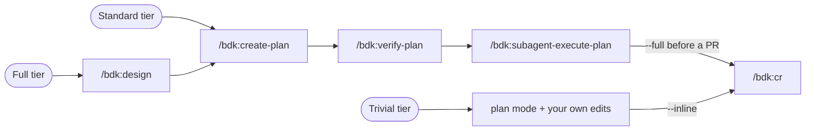

# BDK - Broneq Dev Kit

BDK is a Claude Code plugin that packages one complete development workflow - design, planning, plan verification, autonomous execution, and code review - into a single installable unit. Nothing in it is tied to a language or a stack: your project's test, lint, and build commands live in `.bdk/settings.json`, and every skill reads them from there.

## Why BDK

- **[Language-agnostic by construction](https://broneq.github.io/bdk/concepts/shared-foundation/).** Skills never name a test runner; commands live in `.bdk/settings.json` and reach agents through preloaded meta-skills.
- **[Verification proportional to the change](https://broneq.github.io/bdk/concepts/verification-scoping/).** Fast and e2e tiers with scoped, related, failed, and incremental forms; the full suite runs once per plan, not after every edit.
- **[Crash-safe, resumable execution](https://broneq.github.io/bdk/concepts/plan-pipeline/).** The plan is immutable once verified (sha256 stamp), git commit trailers are the ground truth, the run manifest is only a cache - resume from any session, or run plans in parallel worktrees.
- **[Coordinator-only executor](https://broneq.github.io/bdk/concepts/plan-pipeline/).** Every task gets a fresh subagent context, parallel waves are computed at plan time, and each group lands as one commit.
- **[Independent verifiers](https://broneq.github.io/bdk/concepts/agents/).** `bdk:plan-verifier` and `bdk:design-verifier` are separate Opus agents critiquing the author's draft; reviewers are read-only mechanically - by a `tools:` allowlist that grants no editing tools, and by `disallowed-tools` on the skills that spawn them - not by promise.
- **[Delta code review](https://broneq.github.io/bdk/workflows/code-review/).** Reviews only what changed since the last review by default, scales 3-13 agents to the size of the change, and remembers deferred findings.
- **[Best available tooling, automatically](https://broneq.github.io/bdk/concepts/tool-tiers/).** code-review-graph, then Serena, then grep: the tier is injected per feature flag, so a session uses the strongest tool the project actually has.
- **[Every seam is a file](https://broneq.github.io/bdk/workflows/full-pipeline/).** Design docs, plans, verification reports, and commit trailers carry the state between stages, so any stage of the pipeline runs in a fresh session.
- **[Rules hygiene built in](https://broneq.github.io/bdk/workflows/rules-hygiene/).** `/bdk:add-rule` and `/bdk:refine-rules` plus a drift hook keep `.claude/rules/` from turning into a changelog.

## Install

```
/plugin marketplace add broneq/bdk
/plugin install bdk@bdk
```

Then, once per project you want to use it in:

```
/bdk:setup
```

`/bdk:setup` probes the project, derives the test and lint tiers, and writes `.bdk/settings.json`. Until that file exists, BDK's SessionStart hook blocks the session with `BDK project settings not found (.bdk/settings.json missing).` - that block is the expected first thing you see, not a failure. See the [installation guide](https://broneq.github.io/bdk/getting-started/installation/) for prerequisites.

## How you work with it

There is one pipeline, and three tiers differ only in where you enter it.



| Tier | When | Flow |
|---|---|---|
| Full | new feature, architecture or schema change, ambiguous scope | `/bdk:design` -> `/bdk:create-plan` -> `/bdk:verify-plan` -> `/bdk:subagent-execute-plan` -> `/bdk:cr --full` |
| Standard | clear scope, several files, no design questions | `/bdk:create-plan` -> (`/bdk:verify-plan`) -> `/bdk:subagent-execute-plan` -> `/bdk:cr` |
| Trivial | one or two files, obvious change | Claude Code built-in plan mode -> edit -> `/bdk:cr --inline` |

The trivial tier needs no BDK skill at all: the SessionStart hook injects the shared foundation - tool tiers, verification proportionality, quality rules, capture conventions - into every session. [Choosing a tier](https://broneq.github.io/bdk/workflows/choosing-a-tier/) has the concrete criteria.

## Skills

| Skill | What it does |
|---|---|
| [`/bdk:setup`](https://broneq.github.io/bdk/reference/skills/#bdksetup) | Probe the project and write `.bdk/settings.json`; run once per project |
| [`/bdk:design`](https://broneq.github.io/bdk/reference/skills/#bdkdesign) | Design partner: classifies product vs architecture vs combined, explores 2+ approaches with Mermaid, self-critiques, then verifies |
| [`/bdk:create-plan`](https://broneq.github.io/bdk/reference/skills/#bdkcreate-plan) | Turn a feature description or design doc into a TDD implementation plan |
| [`/bdk:verify-plan`](https://broneq.github.io/bdk/reference/skills/#bdkverify-plan) | Check a plan against real code before execution, via a single Opus verifier |
| [`/bdk:subagent-execute-plan`](https://broneq.github.io/bdk/reference/skills/#bdksubagent-execute-plan) | Execute a plan in parallel groups: fresh implementer per task, then tests, lint, and fixes |
| [`/bdk:cr`](https://broneq.github.io/bdk/reference/skills/#bdkcr) | Code review with 3-13 agents; delta by default, plus `--full`, `--inline`, `--base <ref>` |
| [`/bdk:pr-review`](https://broneq.github.io/bdk/reference/skills/#bdkpr-review) | Review GitHub PRs from URLs: inline comments, summary, and a verdict you confirm before it posts |
| [`/bdk:debug`](https://broneq.github.io/bdk/reference/skills/#bdkdebug) | Structured debugging: investigate, write the failing test, then fix or hand off to a plan |
| [`/bdk:test-driven-development`](https://broneq.github.io/bdk/reference/skills/#bdktest-driven-development) | Rigid red-green cycle, driven by the test cases a plan task declares |
| [`/bdk:commit`](https://broneq.github.io/bdk/reference/skills/#bdkcommit) | Generate a conventional commit message from the git changes |
| [`/bdk:create-adr`](https://broneq.github.io/bdk/reference/skills/#bdkcreate-adr) | Write an Architecture Decision Record in MADR format |
| [`/bdk:explain-complex-code`](https://broneq.github.io/bdk/reference/skills/#bdkexplain-complex-code) | Generate architecture documentation for a module, with Mermaid diagrams and examples |
| [`/bdk:update-docs`](https://broneq.github.io/bdk/reference/skills/#bdkupdate-docs) | Refresh existing architecture documentation after code changes |
| [`/bdk:mermaid-drawer`](https://broneq.github.io/bdk/reference/skills/#bdkmermaid-drawer) | BDK's shared Mermaid standard: type selection, node budget, light- and dark-safe palette |
| [`/bdk:add-rule`](https://broneq.github.io/bdk/reference/skills/#bdkadd-rule) | Capture one lesson as a properly-homed rule - or decide it is not a rule at all |
| [`/bdk:refine-rules`](https://broneq.github.io/bdk/reference/skills/#bdkrefine-rules) | Compact and verify `.claude/rules/*.md` against real code |

## Agents

BDK ships 13 subagents - `bdk:explorer`, `bdk:implementer`, `bdk:code-reviewer`, `bdk:plan-verifier` and others. A few are meant to be invoked directly; most are orchestrated by the skills above. See the [agent reference](https://broneq.github.io/bdk/reference/agents/).

## Documentation

Full documentation: **<https://broneq.github.io/bdk/>** - installation, setup, the three workflow tiers, the concepts behind them, and reference for every skill, agent, setting, and hook.

## Contributing

See [CONTRIBUTING.md](CONTRIBUTING.md) for development setup, authoring conventions, and how to add skills, agents, and docs pages.

## License

MIT - see [LICENSE](LICENSE).
