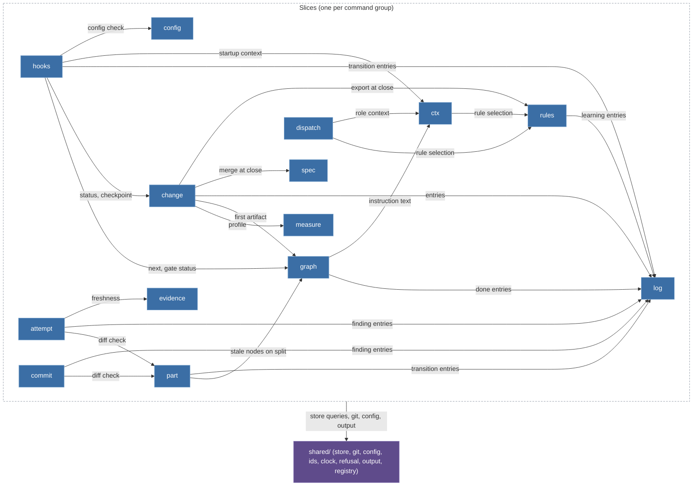
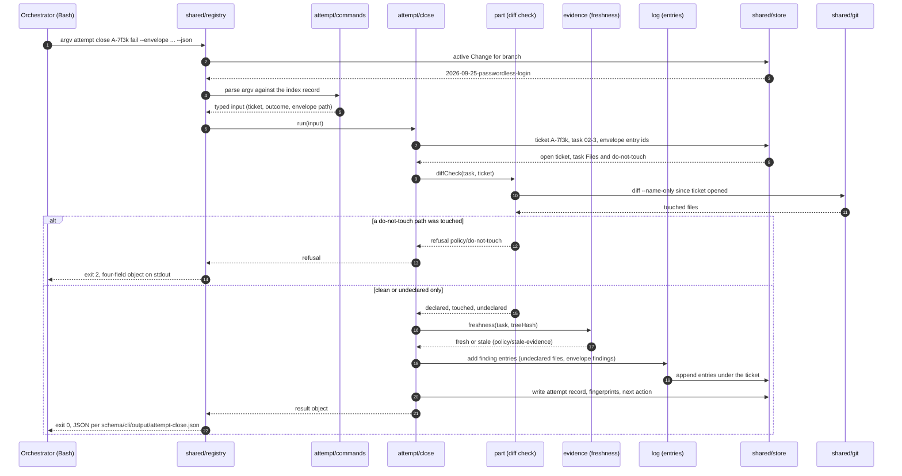

# BDK v3 kernel CLI contract

Contract version **3** (the kernel's major version). Status: **first-class document, written before the kernel exists** (design, "What We Did NOT Decide": "Exact CLI contract ... is the first plan artifact"; plan task T10). The machine-readable half lives in `schema/cli/`: `commands.json` is the command index, `output/<command-id>.json` the JSON Schema of each `--json` success output, `common/*.json` the shared shapes. `tests/contract/cli-contract.test.mjs` keeps this document and `schema/cli/` consistent.

Reading order for a task that implements a command group: sections 2 to 6 once, then the group's entries in section 7, then section 9 for where the code goes.

## 1. Scope and status

- **What this document fixes:** for every kernel command, the invocation, who may call it, the output mode, the arguments, the `--json` output shape, the exit codes and the refusal rules it may emit. It does not fix internals (store layout, graph semantics, budgets, heuristics); those belong to the command's owner task.
- **The only supported invocation** is `node ${CLAUDE_PLUGIN_ROOT}/dist/bdk.mjs <args>`. `bdk <args>` in this document is shorthand. No PATH shim is installed, and the `hooks pre-tool` prefilter matches `bdk.mjs` for that reason.
- **Owner tasks.** Every command carries `owner: Tnn`, the plan task that implements it (`docs/V3-IMPLEMENTATION-PLAN.md`). T11 registers every command in the index from day one; a command whose owner task has not landed is a stub that exits 2 with the rule `kernel/not-implemented` and an `instead` naming the task. Contract tests in T11 assert exactly that: handler or stub, nothing in between.
- **Amendment rule.** A later task may change a command's arguments, output schema or rules only in the PR that implements the command, editing this document and `schema/cli/` together, with the reason in the PR. T12's zod export must reproduce `schema/cli/` byte for byte, so a schema drift fails CI.
- **Versioning.** Additive changes (a new command, a new optional field, a new rule id, a new `since` field on an entry) stay within contract version 3. Removing or renaming a command, a field or an exit code needs a kernel major bump and a new contract version. `bdk version --json` reports both `kernel` (full semver) and `contract`. The dispatch package frontmatter keeps `kernel-version` as the full semver (P10).
- **What is deliberately absent:** no `approve`, no `gate pass` (T1: a gate is passed by the user typing the next stage command; the only writer of `source: user` is `hooks prompt-expansion`); no `stage enter` (HOST-FACTS `upe-fires`: `UserPromptExpansion` fires for plugin skills, so the fallback is not needed); no `hooks stop` (T02 decision Q-6: the rule-drift Stop hook is not ported).
- **Sources.** Design: "CLI contract (outline)", "Key boundaries", "UX Touchpoints", "Hooks (V1-1, V1-2)", the sequence diagram under "Selected Approach". Decisions: Q3, T1, T2, T3, P1, P2, P4, P6, P10, P11, K2-K4, R-store. Host facts: `docs/HOST-FACTS.md`. Where a host fact contradicts the design text, this document follows the host fact and cites the row.

## 2. Invocation

- **Form.** `node ${CLAUDE_PLUGIN_ROOT}/dist/bdk.mjs <group> [<verb>] <positional...> [--flag [value]]`. Groups and verbs are lowercase words. A mandatory choice that changes the command's meaning is a positional literal (`attempt close A-7f3k ok`, `config set --global` being the one flag-shaped exception because the layer is a target, not a meaning); optional inputs and switches are flags. Flags never repeat a positional. Boolean flags take no value. `--skip-verify` is not a CLI flag anywhere: it reaches the kernel only inside the `UserPromptExpansion` payload (P2).
- **Project root.** The kernel walks up from the working directory to the nearest directory containing `.bdk/`; without one, the git work tree root is the project root and `.bdk/` is created by the first writing command (`config set` from `/bdk:setup`, `import` on a v2 layout). Every command except `version` requires the project root to be inside a git work tree (`runtime/not-a-repo` otherwise) and Node at or above the minimum (`runtime/node-version`); `version` is the one standalone command, so `doctor` and the wrapper's STOP line can always quote it.
- **Active Change.** Every Change-scoped command resolves the active Change from the current git branch: one active Change per branch (Key boundaries, hooks table). No command takes a `--change` flag in contract version 3; cross-Change reads use the qualified reference `<changeId>/<id>` (section 5). Without an active Change the command exits 2 with `policy/no-active-change` and an `instead` that names `/bdk:change new` and `bdk change resume <id>`.
- **`--json`.** Every command accepts `--json` and then prints exactly one JSON object on stdout, validated by its schema under `schema/cli/output/`. Without `--json` the same data is rendered as text. Only the JSON form is a contract; skills and tests that parse output use `--json`. Inject-mode commands (section 3) print Markdown by default and, with `--json`, the same content as an object (`content` plus the parts it was composed from) while still exiting 0; the `!` wrapper never passes `--json`. Guard-mode commands print the host's stdout shape (section 8) by default and their own decision record with `--json`, which is how tests drive them.
- **`--help`.** `bdk --help`, `bdk <group> --help` and `bdk <group> <verb> --help` print usage generated from the same command index this document is built on (`schema/cli/commands.json`): synopsis, availability, arguments, flags, exit codes. `--help` is the only usage text a skill may rely on (T02 decision R-13); a skill that repeats usage documentation fails the T15 content check. T11 decides whether `--help` is generated at build time or hand-written with a parity test; the contract requires parity with the index, not a mechanism.
- **stdin.** Only `log ingest` (the `bdk-entries` block, unless `--file` is given) and the `hooks` group (the host's hook payload) read stdin. Every other command ignores it.
- **Environment.** `CLAUDE_PLUGIN_ROOT` locates the bundle (set by the host). The personal configuration layer is `~/.config/bdk/settings.yaml` (XDG; the Windows equivalent is an open design item). `${CLAUDE_PLUGIN_DATA}` is used only for caches. No other environment variable changes behaviour.
- **Streams.** stdout carries the result (text, JSON or Markdown). stderr carries diagnostics and is never part of the contract; guard hooks are the exception, where stderr is the message the host shows the user on exit 2 (section 3).

## 3. Output modes

Three modes, fixed per command in the index (`mode`).

### Inject mode (`ctx skill|role|startup`, `next`, `hooks session-start`, `hooks session-end`)

Called from a skill's `!` block or from a content hook in `hooks.json`; the output is content the model reads. The kernel **always exits 0** in this mode, even on an internal failure, because the host silently drops the output of a `!` block that exits non-zero (decision Q3, live fact) and a content hook that exits non-zero shows only a notice. Errors become a STOP block rendered inside the content, exactly two lines and nothing after them:

```
BDK STOP: <why>
Instead: <instead[0]>; <instead[1]>; ...
```

`<why>` and `<instead>` are the same values the error object of section 4 would carry. The model treats a STOP block as an instruction to stop the skill and report the two lines.

A missing Node, a wrong Node version or a crash before the kernel's top-level handler still exits non-zero at shell level. Every `!` block therefore uses one wrapper form whose `||` branch runs in the same shell, so the block as a whole exits 0 and the STOP line is visible in the loaded skill (V1-5):

```
!`node "${CLAUDE_PLUGIN_ROOT}/dist/bdk.mjs" ctx skill debug 2>&1 || echo "BDK STOP: kernel unavailable (exit $?). Install Node >= 22.13 and run /bdk:setup."`
```

The content test (T15 `skill-check`, BDK rule plugin) accepts a `!` block only when the whole line matches this regular expression, which also restricts `!` blocks to `ctx` and `next` (Key boundaries):

```regex content-wrapper
^!`node "\$\{CLAUDE_PLUGIN_ROOT\}/dist/bdk\.mjs" (ctx (skill|role) [a-z][a-z0-9-]*|ctx startup|next) 2>&1 \|\| echo "BDK STOP: kernel unavailable \(exit \$\?\)\. Install Node >= 22\.13 and run /bdk:setup\."`$
```

The Node minimum `22.13` is HOST-FACTS `node-sqlite-min`; HOST-FACTS `allowed-compound` confirms that `allowed-tools: Bash(node ${CLAUDE_PLUGIN_ROOT}/dist/bdk.mjs *)` pre-approves the compound `node ... || echo ...` form, and `allowed-control` shows that a skill with a `!` block and without that rule is lost whole in `default` permission mode. Content hooks in `hooks.json` (`hooks session-start`, `hooks session-end`) use the same `2>&1 || echo "BDK STOP: ..."` branch without the `!` and backticks.

### Command mode (everything else)

Called from Bash by the orchestrator or a subagent, or by a test. stdout is the result, stderr is diagnostics, the exit code is the verdict (section 4). A failing command prints the error object (JSON with `--json`, four labelled lines otherwise) on stdout, not stderr, so that a caller reading stdout always sees either the result or the reason.

### Guard mode (`hooks pre-tool`, `hooks prompt-expansion`)

Called by the host through `hooks.json` with the hook payload on stdin. A guard must **fail closed**: when the kernel is missing or crashes, the tool call or the stage command must be blocked, not waved through. The `hooks.json` line therefore ends in `|| exit 2`, which the host treats as a blocking error for that one call and shows stderr to the user (hooks reference, exit code 2):

```regex guard-wrapper
node "\$\{CLAUDE_PLUGIN_ROOT\}/dist/bdk\.mjs" hooks (pre-tool|prompt-expansion) \|\| exit 2$
```

The shell prefilter that decides whether to start Node at all (T24) precedes this fragment on the same line or in the script it calls; the regex is not anchored at the start for that reason. Within guard mode the kernel itself uses two outcomes only: **pass** is exit 0 with the host's JSON decision or plain context on stdout, **block** is exit 2 with the reason on stderr (and, for `PreToolUse`, the same reason in `permissionDecisionReason` on stdout). Exit codes 3, 4 and 5 never leave a guard: an unreadable payload, a corrupted state or a missing runtime all become exit 2, because "unknown" is "blocked" (T24: an unknown payload shape means no transition). The exact stdout shapes per hook are in section 8.

## 4. Exit codes and the error object

| Exit | Meaning | Rule classes | Notes |
|---|---|---|---|
| 0 | ok | - | Result on stdout. Inject mode always exits 0, even for a STOP block. |
| 1 | uncaught crash | - | A kernel bug by definition. Stack trace on stderr, no object on stdout. Never emitted on purpose; a contract test that sees exit 1 fails the build. |
| 2 | refusal | `policy/`, `guard/`, `kernel/` | The command understood the input and declined: a policy of the Change process, a guard, or a stub for a command whose owner task has not landed. |
| 3 | input error | `input/` | Unknown command or flag, missing or malformed argument, a kernel-stamped field passed as input, a block that fails validation, an id that does not exist. |
| 4 | corrupted state | `state/` | The committed Change files or the index are inconsistent. `instead` always names `bdk rebuild`. |
| 5 | missing runtime | `runtime/` | Node below the minimum, no git, not inside a work tree. `instead` carries the exact install or setup command. |

Every non-zero exit except 1 emits one **error object** with exactly four fields (`schema/cli/common/refusal.json`):

```json refusal
{
  "refused": true,
  "rule": "policy/budget-exhausted",
  "why": "loop task-redispatch for 02-3 used 3 of 3 attempts; the last two failed with the same fingerprint",
  "instead": [
    "bdk attempt open task-escalation 02-3",
    "bdk change park --reason \"02-3 exhausted\""
  ]
}
```

`refused` is always `true`. `rule` is a stable identifier from the catalogue below; the class before the slash determines the exit code. `why` is one sentence carrying the concrete values (ids, counts, paths), never a generic phrase. `instead` lists at least one concrete command or action the caller can take next. Without `--json` the same object prints as four labelled lines:

```
refused: policy/budget-exhausted
why: loop task-redispatch for 02-3 used 3 of 3 attempts; the last two failed with the same fingerprint
instead: bdk attempt open task-escalation 02-3
instead: bdk change park --reason "02-3 exhausted"
```

There is no second error shape. Input errors, corrupted state and missing runtime use the same four fields; only the class and the exit code differ. The model-facing rule is one sentence: *a non-zero exit prints `refused` with a `rule`; do the first `instead` or report the `why`, never retry the same command unchanged.*

### Rule catalogue

Commands declare in the index which rules they may emit (`refusals`); the coverage test checks that every declared rule is in this table.

| Rule | Exit | Emitted by | Meaning |
|---|---|---|---|
| `input/unknown-command` | 3 | every command | The group or verb does not exist; `instead` names `bdk --help` and the closest match. |
| `input/unknown-flag` | 3 | every command | A flag the command does not declare. |
| `input/missing-argument` | 3 | every command | A required positional or flag value is absent, or stdin is empty where a block was expected. |
| `input/invalid-argument` | 3 | every command | A value has the wrong form: an unknown outcome literal, a malformed id, a non-existent layer, a path outside the project. |
| `input/forbidden-field` | 3 | `log add`, `log ingest` | A kernel-stamped field (`id`, `at`, `author`, `source`) was passed as input (P1). |
| `input/invalid-block` | 3 | `log ingest` | The `bdk-entries` block does not parse or one entry fails validation; `why` names the line and the field, and the whole block is rejected (T2). |
| `input/not-found` | 3 | commands taking an id, path, key, skill, role or artifact (each entry declares it) | The referenced object does not exist in the active Change, the configuration or the bundle. |
| `policy/no-active-change` | 2 | every Change-scoped command | No Change is bound to the current branch. |
| `policy/change-exists` | 2 | `change new`, `change resume` | The branch already has an active Change; `instead` names `change status` and `change close`. |
| `policy/gate-not-ready` | 2 | `change close`, `done`, `spec merge`, `hooks prompt-expansion` | The gate node is not ready: `why` names what is missing (T1). |
| `policy/not-ready` | 2 | `done`, `part start`, `attempt open` | The artifact, part or task is blocked by an unfinished `requires` edge; `instead` names `bdk explain <artifact>`. |
| `policy/validation-failed` | 2 | `validate`, `done`, `part done` | A kind validator failed; `why` carries the first failing check. |
| `policy/part-too-large` | 2 | `validate`, `part start` | A plan part is over 8 KB (S1, P6). |
| `policy/part-too-many-tasks` | 2 | `validate`, `part start` | A plan part has more than 8 tasks (S1). |
| `policy/do-not-touch-overlap` | 2 | `validate`, `part start` | A task's `Files:` intersects the part's `do-not-touch` (P6). |
| `policy/placeholder` | 2 | `validate`, `part start`, `dispatch build` | An executable field contains `TODO`, `<fill in>` or `...` (P6, P7). |
| `policy/budget-exhausted` | 2 | `attempt open` | The loop's budget is used up; `instead` names the next rung of the ladder (A-drabina). |
| `policy/oscillation` | 2 | `attempt open` | The same finding fingerprint returned twice after a fix; the ladder is shortened. |
| `policy/no-open-ticket` | 2 | `attempt close`, `log add`, `log ingest`, `dispatch build`, `dispatch run`, `evidence record` | No open ticket for the task, or the ticket named does not match. |
| `policy/ticket-open` | 2 | `change park`, `change takeover`, `change checkpoint`, `change close`, `part done`, `part split`, `attempt open`, `commit`, `hooks session-end` | A ticket is still open; subagents may still be writing. |
| `policy/package-too-large` | 2 | `dispatch build` | The package exceeds 12 KB (K4). |
| `policy/do-not-touch` | 2 | `attempt close`, `commit` | The real diff touches a `do-not-touch` path (P6). |
| `policy/entries-missing` | 2 | `attempt close` | The envelope declares ledger ids that do not exist under this ticket. |
| `policy/stale-evidence` | 2 | `attempt close`, `evidence check` | The evidence manifest is older than the last code change (P5). |
| `policy/missing-citation` | 2 | `done`, `attempt close`, `evidence record` | A PASS verdict cites no value that resolves inside the recorded evidence (T4). |
| `policy/observation-cap` | 2 | `log add`, `log ingest` | The per-dispatch cap on `observation` entries is reached (K2). |
| `policy/invalid-transition` | 2 | `change resume`, `change park`, `change takeover`, `part start`, `part done`, `part split`, `log resolve`, `dispatch run` | The Change or part is not in a state from which the verb applies; `why` names the current state. |
| `policy/git-in-progress` | 2 | `change checkpoint`, `commit`, `hooks session-end` | A rebase, merge or cherry-pick is in progress (V1-4). |
| `policy/nothing-to-commit` | 2 | `commit` | Neither the code nor the Change directory changed since the last commit for this task. |
| `policy/spec-invalid` | 2 | `validate`, `spec delta check`, `spec merge` | A delta breaks the format: `Scenario:` prefix, missing WHEN / THEN, a scenario lost without `REMOVED` (D2b). |
| `policy/spec-conflict` | 2 | `change close`, `spec merge` | Two deltas edit the same requirement differently; `why` names both. |
| `policy/merge-hash-mismatch` | 2 | `change close`, `spec merge`, `doctor` | A spec file's content hash differs from its `bdk-merge-hash` (V1-7). |
| `policy/unknown-config-key` | 2 | `config show`, `config check`, `config set`, `ctx skill`, `ctx role`, `ctx startup`, `hooks session-start` | A key no module schema declares; `why` lists the keys. |
| `policy/config-invalid` | 2 | `config show`, `config check`, `config set`, `hooks session-start`, `import` | A value fails its module schema. |
| `policy/profile-downgrade` | 2 | `change new`, `change resume` | The requested profile is smaller than the current one (R-profil). |
| `policy/rule-format` | 2 | `rules check`, `rules add`, `rules import`, `rules export` | A rule lacks its `[PREFIX-n]`, or a `knowledge` rule with a fact lacks `source` / `verified` (T5). |
| `policy/duplicate-rule-id` | 2 | `rules check`, `rules import`, `import` | Two rules carry the same id, typically after a parallel close (V1-6). |
| `guard/subagent-git` | 2 | `hooks pre-tool` | A subagent ran a destructive or history-writing git command (T3). |
| `guard/subagent-kernel-command` | 2 | `hooks pre-tool` | A subagent invoked an `orchestrator` or `hook` class command (section 6). |
| `guard/hooks-from-bash` | 2 | `hooks pre-tool` | Any thread invoked `bdk.mjs hooks` through Bash (T1 defence in depth). |
| `guard/spec-dir-write` | 2 | `hooks pre-tool` | A tool call writes under `.bdk/specs/` (V1-7). |
| `guard/kernel-unavailable` | 2 | the `\|\| exit 2` branch | Not emitted by the kernel: the shell fragment produces it when Node or the bundle is missing. Listed so that the catalogue names every reason a caller can see. |
| `state/corrupted-index` | 4 | every Change-scoped command | The SQLite index cannot be opened or disagrees with the files after a lazy rebuild. |
| `state/ledger-invalid` | 4 | every Change-scoped command | A committed entry, attempt or manifest fails its schema (T14). |
| `state/trailer-mismatch` | 4 | `change close`, `part done`, `rebuild` | Progress derived from git trailers disagrees with the committed attempt records. |
| `state/change-dir-missing` | 4 | every Change-scoped command | The branch marker names a Change whose directory is gone. |
| `runtime/node-version` | 5 | every command except `version` | Node is below 22.13.0 (HOST-FACTS `node-sqlite-min`); `instead` carries the install line. |
| `runtime/not-a-repo` | 5 | every command except `version` | The project root is not inside a git work tree. |
| `runtime/git-missing` | 5 | every command that shells out to git | No `git` executable on `PATH`. |
| `kernel/not-implemented` | 2 | any stubbed command | The command exists in the index but its owner task has not landed; `instead` names the task. |

## 5. Conventions

- **Success output is a plain object.** No envelope: the `--json` output of a command is the object its schema under `schema/cli/output/` describes. Optional fields are absent when unknown, never `null`. Enumerations are lowercase words. Text mode renders the same data; only JSON is the contract.
- **List pages.** Every `list` verb and every command that returns a collection uses `schema/cli/common/list-page.json`: `items[]`, `total` (the count before truncation), `truncated` (boolean), and `for` (the `--for` filter as given, absent when none). The default page is the first 100 items, which is the design's "<= 100 lines" rule; `--all` lifts it. Text mode prints at most 100 lines for the same reason. `--for <ref>` narrows a list to what references a task (`02-3`), a part (`02`) or a file path; the list verbs that accept it say so in their entry.
- **Full bodies only via `show`.** `list` returns summaries (id, type, summary, status, refs). `show <id>` returns the whole entry, package or attempt record. Dumping the whole state needs `query` with `--all`.
- **Kernel-stamped fields.** `id`, `at`, `author` and `source` on ledger entries, tickets, attempts and manifests are stamped by the kernel from its clock, git config and the ticket's role (P1). They appear in outputs and never in inputs; passing one is `input/forbidden-field`. `source: user` exists only on the stage-transition path (`hooks prompt-expansion`); `source: policy` only when `policy.gates.<gate>: auto` passes a gate (T02 decision R-9); `source: inferred` only from `change new --inferred`.
- **Identifiers.** Change ids, ledger ids (`L-`), ticket ids (`A-`), evidence ids (`E-`) and rule ids (`[PREFIX-n]`) are opaque strings; their exact merge-safe format is T14's (non-sequential, no allocator lock). Within the active Change an id is bare (`L-m2x9v`); across Changes it is qualified (`<changeId>/L-m2x9v`). Task ids are `<part>-<n>` (`02-3`), part ids two digits (`02`), artifact ids the node names of `pipeline.yaml` (`design`, `plan-verify`, `gate:design`). Ids in the examples of this document are illustrative.
- **Time, hashes, sizes, paths.** `at` and every other timestamp is ISO 8601 UTC with seconds, `2026-09-25T09:41:07Z`. Hashes are `sha256:<64 hex>`. Sizes are bytes. Paths in outputs are relative to the project root with `/` separators; inputs accept absolute paths inside the project.
- **Idempotence and deduplication.** A command that would create an object identical by its dedupe key returns the existing object with `deduplicated: true` and exits 0 (`log add`, `evidence record`, `change checkpoint` when nothing changed). Commands that transition state refuse a repeated transition with `policy/invalid-transition` rather than silently succeeding, except where an entry says otherwise (`hooks prompt-expansion` on an already passed gate passes without writing, S5).
- **Refusal versus finding.** The kernel refuses (exit 2) when proceeding would break an invariant: a forbidden path, a missing ticket, a stale manifest. It records a `finding` entry and exits 0 when the deviation is information for the human: a file outside a task's `Files:`, an uncategorised verifier blocker (downgraded to `observation` with `review: true`, P8). Each entry names which of the two it does.
- **Clock and budgets are not arguments.** No command takes a timestamp, an author, a budget or a model name as input; budgets and the escalation model come from policy (T22), time from the kernel.

## 6. Availability classes and the guard

Each command carries exactly one class in the index (`availability`). The `hooks pre-tool` guard (T24) reads the same index: it denies a subagent (hook input carries `agent_id`) every command whose verb is `orchestrator` or `hook`, and denies every thread a Bash invocation of a `hook` command. The match is by exact verb from the index, not by group prefix, so a read-only verb inside a guarded group (`change status`, `attempt list`, `part list`) stays callable from a subagent; the design's group-level deny list ("`bdk.mjs commit|attempt|part|change|log ingest|spec merge|hooks`") is the same set at verb granularity. The deny reason names the verb and tells the agent to return `blocked` with the cause instead of working around it.

| Class | Who may call | Guarded | Verbs |
|---|---|---|---|
| `orchestrator` | The main thread (the orchestrating skill) and tests. | Yes: denied to subagents by `hooks pre-tool`. | Every command that writes into the Change, the working tree or the configuration: `change new\|resume\|park\|takeover\|checkpoint\|close`, `done`, `part start\|done\|split`, `attempt open\|close`, `log ingest\|resolve\|route`, `dispatch build\|run`, `spec merge`, `config set`, `commit`, `rules add\|import\|export`, `export agents`, `rebuild`, `import`. |
| `agent` | Subagents and the main thread. | No. | The five operations a worker or runner needs (T2, T3): `log add`, `log show`, `dispatch show`, `evidence record`, `ctx skill\|role\|startup`. |
| `hook` | The host only, through `hooks.json` or skill frontmatter. | Yes: a Bash invocation is denied in every thread (T1 defence in depth). | `hooks session-start\|session-end\|prompt-expansion\|pre-tool\|skill-exists`. |
| `read` | Anyone. | No. | Read-only queries with no side effect beyond the lazy index rebuild: `next`, `explain`, `validate`, `measure`, `change status\|list`, `part list`, `attempt list`, `log list`, `evidence check`, `spec delta check\|diff`, `config show\|check\|schema`, `query`, `rules check\|show\|explain\|prune\|stats`, `doctor`, `version`. |

`hooks prompt-expansion` is the only writer of `source: user` transition entries; there is no `approve`, no `gate pass`, and `log add` cannot produce `source: user` (T1, P1, S8). A model that wants a gate passed has exactly one option: render the gate status and stop, so that the user types the next stage command.

**Cross-check with the state contract (T14).** Every command that writes lists the Change directory paths it may touch in `writes[]` (index field); `read` commands have an empty list. T14's write map names a writer for every file in the Change directory and checks that each writer is an `orchestrator`, `agent` or `hook` command here, never a `read` one.

## 7. Command reference

One entry per command, in the order of the index. Every entry has the same fields: synopsis, availability class (section 6), mode (section 3), arguments, behaviour, the paths it may write, the `--json` output schema, exit codes with the command-specific rules (the common rules of section 4 are not repeated), one example, owner task and kernel slice (section 9). The heading anchor is the command's `id` in `schema/cli/commands.json`.

Common rules, not repeated per entry: every command may emit `input/unknown-command`, `input/unknown-flag`, `input/missing-argument`, `input/invalid-argument`, `runtime/node-version`, `runtime/not-a-repo`; every Change-scoped command additionally `policy/no-active-change`, `state/corrupted-index`, `state/ledger-invalid`, `state/change-dir-missing`. A command's `exits` in the index is derived from the classes of its specific and common rules.

### Change lifecycle (`change`, `measure`)

One Change per branch. `new` opens it, `status` and `list` read it, `resume` and `park` move it between active and parked, `takeover` recovers it from a dead session, `checkpoint` commits its directory, `close` ends it. `measure` sits here because `change new` is its first caller.

Representative refusal:

```json refusal
{
  "refused": true,
  "rule": "policy/change-exists",
  "why": "branch feat/login already has the active Change 2026-09-25-passwordless-login (stage design)",
  "instead": [
    "bdk change status",
    "bdk change close",
    "switch to a new branch and run change new there"
  ]
}
```

#### `bdk change new` {#change-new}

Open a Change on the current branch from an intent; measure and propose the profile.

- **Synopsis:** `bdk change new <intent> [--kind feature|bug] [--profile tiny|small|large] [--inferred]`
- **Availability:** `orchestrator`
- **Mode:** `command`
- **Arguments:**
  - `<intent>` (required). One sentence or a quoted paragraph; with --kind bug the reproduction.
  - `--kind feature|bug`. Graph variant; default feature (T02 decision R-8).
  - `--profile tiny|small|large`. Override the measured profile (R-profil).
  - `--inferred`. The Change is opened on the user's behalf by another skill; stamped source: inferred (R-12).
- **Behaviour:** Creates `.bdk/changes/<id>/` with `change.md` (written once, never mutated), runs `measure` on the intent, records the proposed profile as an `assumption` entry and the D4b list of locally overridden keys, and binds the Change to the current branch. `--profile` may only raise the measured profile. With `--inferred` the intent is the first sentence of the caller's context and `change status` shows the Change as unconfirmed until the user runs a stage command. Refuses when the branch already has an active Change.
- **Writes:** `.bdk/changes/<id>/change.md`, `.bdk/changes/<id>/log/`, `.bdk/.machine/`
- **Output:** `schema/cli/output/change-new.json`
- **Exit codes and rules:** `0, 2, 3, 5`. Specific rules: `policy/change-exists`, `policy/profile-downgrade`, `runtime/git-missing`; plus the common rules of every command (section 4).
- **Example:**

  ```bash
  bdk change new "Add passwordless login" --json
  ```

  ```json
  {
    "change": "2026-09-25-passwordless-login",
    "branch": "feat/login",
    "kind": "feature",
    "profile": {
      "value": "small",
      "measured": "small",
      "overridden": false,
      "entry": "L-m2x9v"
    },
    "source": "user",
    "overriddenKeys": [
      "policy.escalation.enabled"
    ],
    "next": "design"
  }
  ```

- **Owner:** T20
- **Slice:** `change`

#### `bdk change status` {#change-status}

The active Change at a glance: stage, graph state, gate status with pending review entries, parked options.

- **Synopsis:** `bdk change status`
- **Availability:** `read`
- **Mode:** `command`; Change-scoped
- **Arguments:**
  - none beyond `--json` and `--help`.
- **Behaviour:** Read-only, at most 100 lines in text mode. Shows which gates were passed by the user and which by policy (`passedBy`), an inferred intent as unconfirmed, and, when parked, the options and the single resume command. This is the second place (after the previous stage skill's closing output) where the user sees pending `review: true` entries before typing the next stage command.
- **Writes:** nothing
- **Output:** `schema/cli/output/change-status.json`
- **Exit codes and rules:** `0, 2, 3, 4, 5`. Specific rules: none; plus the common rules of every command and of Change-scoped commands (section 4).
- **Example:**

  ```bash
  bdk change status --json
  ```

  ```json
  {
    "change": "2026-09-25-passwordless-login",
    "kind": "feature",
    "profile": "small",
    "source": "user",
    "confirmed": true,
    "stage": "design",
    "nodes": [
      {
        "id": "design",
        "kind": "design",
        "state": "done"
      },
      {
        "id": "gate:design",
        "kind": "gate",
        "state": "ready"
      }
    ],
    "gates": [
      {
        "gate": "gate:design",
        "ready": true,
        "done": false,
        "command": "/bdk:plan",
        "pending": [
          {
            "id": "L-k3d8p",
            "type": "question",
            "summary": "Keep magic links or add WebAuthn?",
            "status": "proposed",
            "source": "agent:design-verifier",
            "at": "2026-09-25T09:41:07Z",
            "refs": [
              "design.md"
            ],
            "review": true
          }
        ]
      }
    ],
    "parts": []
  }
  ```

- **Owner:** T20
- **Slice:** `change`

#### `bdk change list` {#change-list}

List Changes in this repository: active per branch, parked, archived.

- **Synopsis:** `bdk change list [--all]`
- **Availability:** `read`
- **Mode:** `command`
- **Arguments:**
  - `--all`. Include archived Changes.
- **Behaviour:** Without `--all` archived Changes are omitted. Different Changes on different branches own different directories, so the list is the union of committed Change directories and local branch markers.
- **Writes:** nothing
- **Output:** `schema/cli/output/change-list.json`
- **Exit codes and rules:** `0, 3, 5`. Specific rules: none; plus the common rules of every command (section 4).
- **Example:**

  ```bash
  bdk change list --json
  ```

  ```json
  {
    "items": [
      {
        "change": "2026-09-25-passwordless-login",
        "branch": "feat/login",
        "stage": "design",
        "state": "active",
        "kind": "feature",
        "profile": "small",
        "updatedAt": "2026-09-25T09:41:07Z"
      }
    ],
    "total": 1,
    "truncated": false
  }
  ```

- **Owner:** T20
- **Slice:** `change`

#### `bdk change resume` {#change-resume}

Bind an existing Change to the current branch or leave the parked state with a chosen option.

- **Synopsis:** `bdk change resume <id> [--option <n>] [--profile small|large]`
- **Availability:** `orchestrator`
- **Mode:** `command`
- **Arguments:**
  - `<id>` (required).
  - `--option <n>`. Index of the option from the parked entry; required when the Change is parked.
  - `--profile small|large`. Raise the profile mid-flight; never lowers it.
- **Behaviour:** On a parked Change the chosen option is written as a `decision` entry (`source: user` is not used: the resume is a kernel action on the user's typed command, so the entry carries `source: kernel` and `refs` to the parked `question`). On another machine or a fresh clone it rebinds the branch marker without writing an entry (S5).
- **Writes:** `.bdk/changes/<id>/log/`, `.bdk/.machine/`
- **Output:** `schema/cli/output/change-resume.json`
- **Exit codes and rules:** `0, 2, 3, 5`. Specific rules: `input/not-found`, `policy/invalid-transition`, `policy/change-exists`, `policy/profile-downgrade`; plus the common rules of every command (section 4).
- **Example:**

  ```bash
  bdk change resume 2026-09-25-passwordless-login --option 2 --json
  ```

  ```json
  {
    "change": "2026-09-25-passwordless-login",
    "branch": "feat/login",
    "stage": "execute",
    "resumedFrom": "parked",
    "decision": "L-p9q2r",
    "next": "execute-part:02"
  }
  ```

- **Owner:** T20
- **Slice:** `change`

#### `bdk change park` {#change-park}

Park the active Change with a question or blocker entry, options and one resume command.

- **Synopsis:** `bdk change park [--reason <text>] [--option <text>]`
- **Availability:** `orchestrator`
- **Mode:** `command`; Change-scoped
- **Arguments:**
  - `--reason <text>`. Becomes the summary of the question entry.
  - `--option <text>`. Repeatable; at least one. Defaults are accept as debt, change decision X, split part.
- **Behaviour:** Called by the orchestrator when the escalation ladder ends (A-drabina) or by the user through `/bdk:change park`. Writes the `question` entry with the options, then runs `change checkpoint` (V-checkpoint). Refuses while a ticket is open: close or `attempt close not-run` first.
- **Writes:** `.bdk/changes/<id>/log/`, `.bdk/changes/<id>/attempts/`
- **Output:** `schema/cli/output/change-park.json`
- **Exit codes and rules:** `0, 2, 3, 4, 5`. Specific rules: `policy/invalid-transition`, `policy/ticket-open`; plus the common rules of every command and of Change-scoped commands (section 4).
- **Example:**

  ```bash
  bdk change park --reason "02-3 exhausted its budget" --option "accept as debt" --option "split part 02" --json
  ```

  ```json
  {
    "change": "2026-09-25-passwordless-login",
    "entry": "L-t4w7n",
    "options": [
      "accept as debt",
      "split part 02"
    ],
    "resume": "bdk change resume 2026-09-25-passwordless-login --option <n>",
    "checkpoint": {
      "done": true,
      "commit": "a1b2c3d"
    }
  }
  ```

- **Owner:** T20
- **Slice:** `change`

#### `bdk change takeover` {#change-takeover}

Take over a Change whose previous session died with open tickets.

- **Synopsis:** `bdk change takeover [--close-tickets]`
- **Availability:** `orchestrator`
- **Mode:** `command`; Change-scoped
- **Arguments:**
  - `--close-tickets`. Close every open ticket as not-run instead of refusing.
- **Behaviour:** Today's `--force`. Records the takeover as a `transition` entry, closes the dead session's tickets as `not-run` when asked (their `not-run` counters advance, budgets stay), and runs `rebuild`. Refuses when the recorded session is still alive on this machine.
- **Writes:** `.bdk/changes/<id>/attempts/`, `.bdk/changes/<id>/log/`, `.bdk/.machine/`
- **Output:** `schema/cli/output/change-takeover.json`
- **Exit codes and rules:** `0, 2, 3, 4, 5`. Specific rules: `policy/invalid-transition`, `policy/ticket-open`; plus the common rules of every command and of Change-scoped commands (section 4).
- **Example:**

  ```bash
  bdk change takeover --close-tickets --json
  ```

  ```json
  {
    "change": "2026-09-25-passwordless-login",
    "previousSession": "<SESSION-3>",
    "closedTickets": [
      "A-7f3k"
    ],
    "rebuilt": true
  }
  ```

- **Owner:** T22
- **Slice:** `change`

#### `bdk change checkpoint` {#change-checkpoint}

Pathspec commit of the Change directory: `chore(bdk): checkpoint <change>`.

- **Synopsis:** `bdk change checkpoint`
- **Availability:** `orchestrator`
- **Mode:** `command`; Change-scoped
- **Arguments:**
  - none beyond `--json` and `--help`.
- **Behaviour:** Runs `git commit --only -- .bdk/changes/<id>/`, so files the user staged are never swept in (V1-4). Exits 0 with `skipped` when nothing changed or `policy.checkpoint.enabled` is false; refuses during a rebase, merge or cherry-pick and while a ticket is open (subagents may still be writing). Called by `hooks session-end`, `change park` and the escalation step.
- **Writes:** `git:commit`
- **Output:** `schema/cli/output/change-checkpoint.json`
- **Exit codes and rules:** `0, 2, 3, 4, 5`. Specific rules: `policy/git-in-progress`, `policy/ticket-open`, `runtime/git-missing`; plus the common rules of every command and of Change-scoped commands (section 4).
- **Example:**

  ```bash
  bdk change checkpoint --json
  ```

  ```json
  {
    "change": "2026-09-25-passwordless-login",
    "done": true,
    "commit": "a1b2c3d"
  }
  ```

- **Owner:** T22
- **Slice:** `change`

#### `bdk change close` {#change-close}

Close the Change after the review gate: spec merge, learning routing, archive, PR summary.

- **Synopsis:** `bdk change close [--squash] [--dry-run]`
- **Availability:** `orchestrator`
- **Mode:** `command`; Change-scoped
- **Arguments:**
  - `--squash`. Squash checkpoint commits (policy default open, V2-2).
  - `--dry-run`. Report what would be merged, routed and archived; write nothing.
- **Behaviour:** Requires the final review gate to be done (a `source: user` or `source: policy` transition). Runs `spec merge` (refusing on conflict or a merge-hash mismatch, so a manual spec edit is caught here at the latest), routes `learning` entries, prunes `dispatch/` and `reports/` to hash indexes unless `archive.keep-evidence`, regenerates `.claude/rules/bdk-generated.md` and prints the PR summary. `--dry-run` is the form `/bdk:close` runs first to show the user what will happen.
- **Writes:** `.bdk/changes/<id>/log/`, `.bdk/changes/archive/<date>-<id>/`, `.bdk/specs/`, `.claude/rules/bdk-generated.md`, `git:commit`
- **Output:** `schema/cli/output/change-close.json`
- **Exit codes and rules:** `0, 2, 3, 4, 5`. Specific rules: `policy/gate-not-ready`, `policy/ticket-open`, `policy/spec-conflict`, `policy/merge-hash-mismatch`, `state/trailer-mismatch`, `runtime/git-missing`; plus the common rules of every command and of Change-scoped commands (section 4).
- **Example:**

  ```bash
  bdk change close --json
  ```

  ```json
  {
    "change": "2026-09-25-passwordless-login",
    "archivedTo": ".bdk/changes/archive/2026-09-26-2026-09-25-passwordless-login",
    "spec": {
      "merged": [
        "auth/login"
      ]
    },
    "learning": {
      "proposedRules": [
        "L-z1c4h"
      ],
      "spec": [],
      "nothing": [
        "L-q8n2m"
      ]
    },
    "gatesByPolicy": [],
    "summary": "## Passwordless login
..."
  }
  ```

- **Owner:** T30
- **Slice:** `change`

#### `bdk measure` {#measure}

Measure the size of an intent or a diff: files, impacted modules, proposed profile.

- **Synopsis:** `bdk measure [<intent>] [--diff <ref>]`
- **Availability:** `read`
- **Mode:** `command`
- **Arguments:**
  - `<intent>` (optional). Text to measure; omit with --diff.
  - `--diff <ref>`. Measure a git diff (base ref) instead of an intent; what cr uses for agent scaling.
- **Behaviour:** Deterministic for the same input (T20 acceptance). Shared by `change new` (profile) and `/bdk:cr` (agent count, T02 decision R-4). The heuristic and thresholds are T20's to calibrate; the output fields are fixed here.
- **Writes:** nothing
- **Output:** `schema/cli/output/measure.json`
- **Exit codes and rules:** `0, 3, 5`. Specific rules: `runtime/git-missing`; plus the common rules of every command (section 4).
- **Example:**

  ```bash
  bdk measure "Add passwordless login" --json
  ```

  ```json
  {
    "profile": "small",
    "files": 6,
    "modules": [
      "auth",
      "mail"
    ],
    "impact": 14,
    "signals": {
      "files": 6,
      "modules": 2,
      "impact": 14
    }
  }
  ```

- **Owner:** T20
- **Slice:** `measure`

### Artifact graph (`graph`)

The pipeline graph of T21: `next` is the entry point every stage skill injects, `explain` is its debugger, `validate` runs a kind validator without side effects, `done` is the only writer of an artifact's done state.

Representative refusal:

```json refusal
{
  "refused": true,
  "rule": "policy/not-ready",
  "why": "plan-verify requires plan-part:01, which is ready but not done",
  "instead": [
    "bdk explain plan-verify",
    "bdk done plan-part:01"
  ]
}
```

#### `bdk next` {#next}

The next ready artifact with its instruction, plus the gate status; the skill's entry point.

- **Synopsis:** `bdk next`
- **Availability:** `read`
- **Mode:** `inject`; Change-scoped
- **Arguments:**
  - none beyond `--json` and `--help`.
- **Behaviour:** Inject mode: called from stage skills' `!` blocks and by `hooks prompt-expansion`. Always exits 0; without a ready artifact it says what the Change waits for (a gate: render the gate status and stop; the user: a parked question). Never writes. When a gate is ready but not done, the Markdown output is the gate status the previous stage skill shows the user: the command to type and the pending `review: true` entries with ids and summaries.
- **Writes:** nothing
- **Output:** `schema/cli/output/next.json` for `--json`; Markdown otherwise (section 3).
- **Exit codes and rules:** `0` always (inject mode). Rules rendered as a STOP block: none; plus the common rules of every command and of Change-scoped commands (section 4).
- **Example:**

  ```bash
  bdk next --json
  ```

  ```json
  {
    "change": "2026-09-25-passwordless-login",
    "stage": "plan",
    "artifact": {
      "id": "plan-part:01",
      "kind": "plan-part",
      "state": "ready",
      "requires": [
        "gate:design"
      ]
    },
    "instruction": "Write plan part 01 ...",
    "gates": [
      {
        "gate": "gate:design",
        "ready": true,
        "done": true,
        "passedBy": "user",
        "pending": []
      }
    ]
  }
  ```

- **Owner:** T21
- **Slice:** `graph`

#### `bdk explain` {#explain}

Why an artifact is in its state: the `requires` chain with each node's state and input hash.

- **Synopsis:** `bdk explain <artifact>`
- **Availability:** `read`
- **Mode:** `command`; Change-scoped
- **Arguments:**
  - `<artifact>` (required). Node id from pipeline.yaml, e.g. plan-verify, gate:design, execute-part:02.
- **Behaviour:** Mandatory from the first release (Approach A's debuggability requirement). A `stale` node names the hash that changed (P2).
- **Writes:** nothing
- **Output:** `schema/cli/output/explain.json`
- **Exit codes and rules:** `0, 2, 3, 4, 5`. Specific rules: `input/not-found`; plus the common rules of every command and of Change-scoped commands (section 4).
- **Example:**

  ```bash
  bdk explain plan-verify --json
  ```

  ```json
  {
    "artifact": "plan-verify",
    "state": "blocked",
    "chain": [
      {
        "id": "plan-verify",
        "kind": "plan-verify",
        "state": "blocked",
        "requires": [
          "plan-part:01"
        ],
        "why": "plan-part:01 is ready, not done"
      },
      {
        "id": "plan-part:01",
        "kind": "plan-part",
        "state": "ready",
        "requires": [
          "gate:design"
        ]
      },
      {
        "id": "gate:design",
        "kind": "gate",
        "state": "done"
      }
    ]
  }
  ```

- **Owner:** T21
- **Slice:** `graph`

#### `bdk validate` {#validate}

Run an artifact's kind validator without marking it done.

- **Synopsis:** `bdk validate [<artifact>]`
- **Availability:** `read`
- **Mode:** `command`; Change-scoped
- **Arguments:**
  - `<artifact>` (optional). Defaults to the artifact next returns.
- **Behaviour:** Exits 0 with `valid: false` and the failing checks when called on a valid-looking artifact that fails; exits 2 with the first failing rule when the caller asked for a verdict (`--json` consumers read `checks`, text mode prints them). Part validators (S1, P6) and the spec delta validator (T30) are reached through this command as well as through `done`.
- **Writes:** nothing
- **Output:** `schema/cli/output/validate.json`
- **Exit codes and rules:** `0, 2, 3, 4, 5`. Specific rules: `input/not-found`, `policy/validation-failed`, `policy/part-too-large`, `policy/part-too-many-tasks`, `policy/do-not-touch-overlap`, `policy/placeholder`, `policy/spec-invalid`; plus the common rules of every command and of Change-scoped commands (section 4).
- **Example:**

  ```bash
  bdk validate plan-part:01 --json
  ```

  ```json
  {
    "artifact": "plan-part:01",
    "valid": true,
    "inputHash": "sha256:0000000000000000000000000000000000000000000000000000000000000000",
    "checks": [
      {
        "id": "size",
        "ok": true
      },
      {
        "id": "tasks",
        "ok": true
      },
      {
        "id": "do-not-touch",
        "ok": true
      },
      {
        "id": "placeholders",
        "ok": true
      },
      {
        "id": "success-measure",
        "ok": true
      }
    ]
  }
  ```

- **Owner:** T21
- **Slice:** `graph`

#### `bdk done` {#done}

Mark an artifact done after its validator passes and record the input hash.

- **Synopsis:** `bdk done <artifact>`
- **Availability:** `orchestrator`
- **Mode:** `command`; Change-scoped
- **Arguments:**
  - `<artifact>` (required).
- **Behaviour:** `done` is the only way an artifact becomes done (defence against the existence-check anti-pattern): schema, non-emptiness and the kind's validator must pass, and the sha256 of the inputs is recorded so a later edit makes dependants `stale` (P2). A gate node cannot be marked done by this command: it refuses with `policy/gate-not-ready`, because a gate becomes done only through a `source: user` (or `source: policy`) transition entry.
- **Writes:** `.bdk/changes/<id>/log/`, `.bdk/.machine/`
- **Output:** `schema/cli/output/done.json`
- **Exit codes and rules:** `0, 2, 3, 4, 5`. Specific rules: `input/not-found`, `policy/not-ready`, `policy/validation-failed`, `policy/gate-not-ready`, `policy/missing-citation`; plus the common rules of every command and of Change-scoped commands (section 4).
- **Example:**

  ```bash
  bdk done design --json
  ```

  ```json
  {
    "artifact": "design",
    "state": "done",
    "inputHash": "sha256:1111111111111111111111111111111111111111111111111111111111111111",
    "next": "gate:design",
    "entry": "L-h6s1d"
  }
  ```

- **Owner:** T21
- **Slice:** `graph`

### Plan parts (`part`)

Parts of a plan (S1): read with `list`, opened with `start`, closed with `done`, divided with `split`. State is derived from trailers and attempt records, never stored in the plan file.

Representative refusal:

```json refusal
{
  "refused": true,
  "rule": "policy/part-too-large",
  "why": "plan/parts/02-login.md is 9 412 bytes; the limit is 8 192",
  "instead": [
    "bdk part split 02 02-3,02-4",
    "shorten the part and run bdk validate plan-part:02"
  ]
}
```

#### `bdk part list` {#part-list}

Plan parts with state, task counts, size, dependencies and wave.

- **Synopsis:** `bdk part list`
- **Availability:** `read`
- **Mode:** `command`; Change-scoped
- **Arguments:**
  - none beyond `--json` and `--help`.
- **Behaviour:** State is derived from trailers and attempt records, never from a mutable field in the plan (progress lives in git).
- **Writes:** nothing
- **Output:** `schema/cli/output/part-list.json`
- **Exit codes and rules:** `0, 2, 3, 4, 5`. Specific rules: none; plus the common rules of every command and of Change-scoped commands (section 4).
- **Example:**

  ```bash
  bdk part list --json
  ```

  ```json
  {
    "items": [
      {
        "part": "01",
        "title": "Token service",
        "state": "done",
        "tasks": 4,
        "done": 4,
        "bytes": 5120,
        "specImpact": "delta",
        "wave": 1
      },
      {
        "part": "02",
        "title": "Login endpoint",
        "state": "started",
        "tasks": 3,
        "done": 1,
        "bytes": 4210,
        "dependsOn": [
          "01"
        ],
        "specImpact": "none",
        "wave": 2
      }
    ],
    "total": 2,
    "truncated": false
  }
  ```

- **Owner:** T22
- **Slice:** `part`

#### `bdk part start` {#part-start}

Validate a part and record the start transition; required before its first ticket.

- **Synopsis:** `bdk part start <part>`
- **Availability:** `orchestrator`
- **Mode:** `command`; Change-scoped
- **Arguments:**
  - `<part>` (required).
- **Behaviour:** Refuses a part whose `Depends on` parts are not done, and runs the part validators: <= 8 KB, <= 8 tasks, `goal`, `success-measure` and `do-not-touch` present, no task `Files:` inside `do-not-touch`, no placeholders in executable fields (P6, P7, S1).
- **Writes:** `.bdk/changes/<id>/log/`
- **Output:** `schema/cli/output/part-start.json`
- **Exit codes and rules:** `0, 2, 3, 4, 5`. Specific rules: `input/not-found`, `policy/not-ready`, `policy/invalid-transition`, `policy/part-too-large`, `policy/part-too-many-tasks`, `policy/do-not-touch-overlap`, `policy/placeholder`; plus the common rules of every command and of Change-scoped commands (section 4).
- **Example:**

  ```bash
  bdk part start 02 --json
  ```

  ```json
  {
    "part": "02",
    "state": "started",
    "tasks": [
      {
        "task": "02-1",
        "files": [
          "src/auth/login.ts"
        ]
      },
      {
        "task": "02-2",
        "files": [
          "src/auth/login.test.ts"
        ]
      }
    ],
    "doNotTouch": [
      "src/billing/**"
    ],
    "successMeasure": "POST /login returns a session for a valid magic link",
    "entry": "L-r2v8k"
  }
  ```

- **Owner:** T22
- **Slice:** `part`

#### `bdk part done` {#part-done}

Close a part: every task has a trailer commit and no ticket is open.

- **Synopsis:** `bdk part done <part>`
- **Availability:** `orchestrator`
- **Mode:** `command`; Change-scoped
- **Arguments:**
  - `<part>` (required).
- **Behaviour:** The validator reads git: each task of the part must have a commit carrying `BDK-Task: <task>` (the read-back after write that TSH confirmed). Open `finding` entries do not block; they are listed.
- **Writes:** `.bdk/changes/<id>/log/`
- **Output:** `schema/cli/output/part-done.json`
- **Exit codes and rules:** `0, 2, 3, 4, 5`. Specific rules: `input/not-found`, `policy/invalid-transition`, `policy/ticket-open`, `policy/validation-failed`, `state/trailer-mismatch`, `runtime/git-missing`; plus the common rules of every command and of Change-scoped commands (section 4).
- **Example:**

  ```bash
  bdk part done 02 --json
  ```

  ```json
  {
    "part": "02",
    "state": "done",
    "commits": [
      {
        "task": "02-1",
        "commit": "b4d2e1f"
      },
      {
        "task": "02-2",
        "commit": "c7a9d30"
      }
    ],
    "openFindings": [],
    "entry": "L-y5u3e",
    "next": "execute-part:03"
  }
  ```

- **Owner:** T22
- **Slice:** `part`

#### `bdk part split` {#part-split}

Split an oversized or parked part into two parts with the same dependencies.

- **Synopsis:** `bdk part split <part> <task-ids>`
- **Availability:** `orchestrator`
- **Mode:** `command`; Change-scoped
- **Arguments:**
  - `<part>` (required).
  - `<task-ids>` (required). Comma-separated tasks that move to the new part.
- **Behaviour:** The one command that edits plan files after `plan` is done: it appends a new part file, updates `plan/index.md` and marks the affected plan nodes `stale`, so the plan verifier runs again on both parts. Used as the `split part` option of a parked Change.
- **Writes:** `.bdk/changes/<id>/plan/parts/`, `.bdk/changes/<id>/plan/index.md`, `.bdk/changes/<id>/log/`
- **Output:** `schema/cli/output/part-split.json`
- **Exit codes and rules:** `0, 2, 3, 4, 5`. Specific rules: `input/not-found`, `policy/invalid-transition`, `policy/ticket-open`; plus the common rules of every command and of Change-scoped commands (section 4).
- **Example:**

  ```bash
  bdk part split 02 02-3,02-4 --json
  ```

  ```json
  {
    "part": "02",
    "newPart": "05",
    "moved": [
      "02-3",
      "02-4"
    ],
    "entry": "L-n1b7c"
  }
  ```

- **Owner:** T22
- **Slice:** `part`

### Tickets and attempts (`attempt`)

Every dispatch runs under a ticket (P4): `open` issues one or refuses with the next rung of the ladder, `close` records the outcome and performs the diff, evidence and entry checks, `list` reads the records and the budgets.

Representative refusal:

```json refusal
{
  "refused": true,
  "rule": "policy/budget-exhausted",
  "why": "loop task-redispatch for 02-3 used 3 of 3 attempts; the last two failed with the same fingerprint",
  "instead": [
    "bdk attempt open task-escalation 02-3",
    "bdk change park --reason \"02-3 exhausted\""
  ]
}
```

#### `bdk attempt open` {#attempt-open}

Open a ticket for one loop iteration, or refuse with the next rung of the ladder.

- **Synopsis:** `bdk attempt open <loop> <target>`
- **Availability:** `orchestrator`
- **Mode:** `command`; Change-scoped
- **Arguments:**
  - `<loop>` (required). Loop kind from policy: task-redispatch, verify-fix, review-fix, verifier, task-escalation.
  - `<target>` (required). Task, part or Change id.
- **Behaviour:** The kernel issues no dispatch package without an open ticket. Budgets per loop kind live in policy; `not-run` closes never consume them. Refuses with `policy/budget-exhausted` (instead: the escalation loop, then `change park`) and with `policy/oscillation` when the same finding fingerprint came back twice after a fix, which shortens the ladder regardless of remaining budget. Scope N+1 is a subset of scope N.
- **Writes:** `.bdk/changes/<id>/attempts/`
- **Output:** `schema/cli/output/attempt-open.json`
- **Exit codes and rules:** `0, 2, 3, 4, 5`. Specific rules: `input/not-found`, `policy/not-ready`, `policy/budget-exhausted`, `policy/oscillation`, `policy/ticket-open`; plus the common rules of every command and of Change-scoped commands (section 4).
- **Example:**

  ```bash
  bdk attempt open task-redispatch 02-3 --json
  ```

  ```json
  {
    "ticket": "A-7f3k",
    "loop": "task-redispatch",
    "target": "02-3",
    "attempt": 2,
    "of": 3,
    "scope": "high+",
    "openedAt": "2026-09-25T10:02:11Z",
    "narrowedFrom": "full",
    "dropped": [
      {
        "id": "L-d3f6g",
        "summary": "rename helper for clarity"
      }
    ]
  }
  ```

- **Owner:** T22
- **Slice:** `attempt`

#### `bdk attempt close` {#attempt-close}

Close a ticket with its outcome; check the diff, the evidence and the declared entries.

- **Synopsis:** `bdk attempt close <ticket> ok|fail|not-run [--envelope <path>] [--reason <text>]`
- **Availability:** `orchestrator`
- **Mode:** `command`; Change-scoped
- **Arguments:**
  - `<ticket>` (required).
  - `ok|fail|not-run` (required). ok: done; fail: findings remain (fingerprints stored); not-run: the check could not be performed (P4).
  - `--envelope <path>`. The subagent's envelope file; its log ids and files are checked.
  - `--reason <text>`. Required with not-run: which precondition was missing.
- **Behaviour:** Reads the real diff and compares it with the task's `Files:` and the part's `do-not-touch` (P6): a forbidden path is a refusal, an undeclared file becomes a `finding` entry and `undeclared` in the output. Refuses when the envelope declares ledger ids that do not exist under the ticket, when evidence recorded for the task is older than the tree (P5), or when a PASS verdict cites nothing that resolves in the evidence (T4). `not-run` needs `--reason`, advances the ticket's `not-run` counter and, when that budget is exhausted, returns `next.action: question` with the entry id. `next` is the orchestrator's instruction: post-task steps, retry with the same scope, narrow, escalate, question or parked.
- **Writes:** `.bdk/changes/<id>/attempts/`, `.bdk/changes/<id>/log/`
- **Output:** `schema/cli/output/attempt-close.json`
- **Exit codes and rules:** `0, 2, 3, 4, 5`. Specific rules: `input/not-found`, `policy/no-open-ticket`, `policy/do-not-touch`, `policy/entries-missing`, `policy/stale-evidence`, `policy/missing-citation`, `runtime/git-missing`; plus the common rules of every command and of Change-scoped commands (section 4).
- **Example:**

  ```bash
  bdk attempt close A-7f3k fail --envelope .bdk/changes/2026-09-25-passwordless-login/reports/02-3-implementer-2.md --json
  ```

  ```json
  {
    "ticket": "A-7f3k",
    "outcome": "fail",
    "diff": {
      "declared": [
        "src/auth/login.ts"
      ],
      "touched": [
        "src/auth/login.ts",
        "src/auth/util.ts"
      ],
      "undeclared": [
        "src/auth/util.ts"
      ]
    },
    "findings": [
      "L-e8k2s"
    ],
    "fingerprints": [
      "finding|src/auth/login.ts|verifyToken|expired token accepted"
    ],
    "next": {
      "action": "narrow",
      "scope": "blockers"
    }
  }
  ```

- **Owner:** T22
- **Slice:** `attempt`

#### `bdk attempt list` {#attempt-list}

Tickets and attempt records, open first.

- **Synopsis:** `bdk attempt list [--for <task|part>] [--all]`
- **Availability:** `read`
- **Mode:** `command`; Change-scoped
- **Arguments:**
  - `--for <task|part>`.
  - `--all`.
- **Behaviour:** Reads the committed `attempts/` records, so it is correct on a fresh clone; the SQLite index only speeds it up.
- **Writes:** nothing
- **Output:** `schema/cli/output/attempt-list.json`
- **Exit codes and rules:** `0, 2, 3, 4, 5`. Specific rules: none; plus the common rules of every command and of Change-scoped commands (section 4).
- **Example:**

  ```bash
  bdk attempt list --for 02-3 --json
  ```

  ```json
  {
    "items": [
      {
        "ticket": "A-7f3k",
        "loop": "task-redispatch",
        "target": "02-3",
        "attempt": 2,
        "of": 3,
        "scope": "high+",
        "openedAt": "2026-09-25T10:02:11Z",
        "closedAt": "2026-09-25T10:19:40Z",
        "outcome": "fail"
      }
    ],
    "total": 1,
    "truncated": false,
    "for": "02-3",
    "budgets": {
      "task-redispatch": {
        "used": 2,
        "of": 3
      },
      "not-run": {
        "used": 0,
        "of": 3
      }
    }
  }
  ```

- **Owner:** T22
- **Slice:** `attempt`

### Ledger (`log`)

The append-only ledger of the Change (K2, P1): `add` writes one entry, `ingest` writes a read-only role's block under its ticket, `list` and `show` read, `resolve` changes a status, `route` sorts `learning` entries at close.

Representative refusal:

```json refusal
{
  "refused": true,
  "rule": "input/forbidden-field",
  "why": "--source is not a flag of log add: source is stamped from the ticket's role (P1)",
  "instead": [
    "bdk log add finding \"...\" --ref <ref> --ticket A-7f3k",
    "bdk log add --help"
  ]
}
```

#### `bdk log add` {#log-add}

Append one ledger entry; the kernel stamps id, time, author and source.

- **Synopsis:** `bdk log add decision|finding|observation|blocker|question|assumption|risk|learning|report <summary> [--ref <ref>] [--body <text>] [--ticket <ticket>] [--review] [--supersedes <id>] [--status proposed|accepted|superseded|resolved|routed]`
- **Availability:** `agent`
- **Mode:** `command`; Change-scoped
- **Arguments:**
  - `decision|finding|observation|blocker|question|assumption|risk|learning|report` (required).
  - `<summary>` (required). <= 120 characters.
  - `--ref <ref>`. Repeatable; at least one (file, symbol, part, task, rule or entry id).
  - `--body <text>`. Markdown body; - reads it from stdin.
  - `--ticket <ticket>`. The ticket the caller works under; required inside a dispatch, sets source: agent:<role>.
  - `--review`. Mark the entry to be shown at the next gate.
  - `--supersedes <id>`.
  - `--status proposed|accepted|superseded|resolved|routed`.
  - stdin: Body text when --body - is given.
- **Behaviour:** Available to subagents (worker and runner roles write their own entries, T2). `type: transition` is not accepted here and `--source` does not exist: `source` is derived from the ticket's role, or is `kernel` for the main thread without a ticket; passing `id`, `at`, `author` or `source` in any form is `input/forbidden-field` (P1, T20 acceptance: `--source user` exits 3). Validation: type from the list, summary <= 120 characters, >= 1 ref. Dedupe by key returns the existing entry with `deduplicated: true`. The per-dispatch cap on `observation` applies per ticket.
- **Writes:** `.bdk/changes/<id>/log/`
- **Output:** `schema/cli/output/log-add.json`
- **Exit codes and rules:** `0, 2, 3, 4, 5`. Specific rules: `input/forbidden-field`, `policy/no-open-ticket`, `policy/observation-cap`; plus the common rules of every command and of Change-scoped commands (section 4).
- **Example:**

  ```bash
  bdk log add finding "expired magic link still accepted" --ref src/auth/login.ts --ref 02-3 --ticket A-7f3k --json
  ```

  ```json
  {
    "entry": {
      "id": "L-e8k2s",
      "type": "finding",
      "summary": "expired magic link still accepted",
      "status": "proposed",
      "source": "agent:implementer",
      "author": "Przemysław Broniszewski",
      "at": "2026-09-25T10:15:02Z",
      "refs": [
        "src/auth/login.ts",
        "02-3"
      ],
      "review": false
    },
    "path": ".bdk/changes/2026-09-25-passwordless-login/log/20260925T101502-finding-expired-magic-link.md",
    "deduplicated": false
  }
  ```

- **Owner:** T20
- **Slice:** `log`

#### `bdk log ingest` {#log-ingest}

Ingest a `bdk-entries` block from a read-only role's report under its ticket.

- **Synopsis:** `bdk log ingest [--ticket <ticket>] [--file <path>]`
- **Availability:** `orchestrator`
- **Mode:** `command`; Change-scoped
- **Arguments:**
  - `--ticket <ticket>`. Required; provenance comes from the ticket's role.
  - `--file <path>`. Read the block from a file instead of stdin (typically the report).
  - stdin: The fenced bdk-entries YAML block, or a whole report containing exactly one such block.
- **Behaviour:** Verifier, reviewer and reader roles end their report with a fenced `bdk-entries` YAML block; the orchestrator passes it here verbatim (T2). Every entry is validated exactly like `log add`; one bad entry refuses the whole block with `input/invalid-block` naming the line and field, and the orchestrator re-dispatches once before the block becomes a `blocker` entry (design edge case). A blocking item whose category is not in the closed list is downgraded (P8). The ticket's entry counter is what `attempt close` checks against the envelope.
- **Writes:** `.bdk/changes/<id>/log/`
- **Output:** `schema/cli/output/log-ingest.json`
- **Exit codes and rules:** `0, 2, 3, 4, 5`. Specific rules: `input/invalid-block`, `input/forbidden-field`, `policy/no-open-ticket`, `policy/observation-cap`; plus the common rules of every command and of Change-scoped commands (section 4).
- **Example:**

  ```bash
  bdk log ingest --ticket A-9c2d --file .bdk/changes/2026-09-25-passwordless-login/reports/plan-verifier-1.md --json
  ```

  ```json
  {
    "ticket": "A-9c2d",
    "entries": [
      {
        "id": "L-w4m1q",
        "type": "blocker",
        "summary": "plan claims verifyToken exists; it does not",
        "status": "proposed",
        "source": "agent:plan-verifier",
        "at": "2026-09-25T10:31:44Z",
        "refs": [
          "plan/parts/02-login.md",
          "src/auth/token.ts"
        ]
      }
    ],
    "downgraded": []
  }
  ```

- **Owner:** T22
- **Slice:** `log`

#### `bdk log list` {#log-list}

Ledger entries as summaries, filtered by type, status, review flag or reference.

- **Synopsis:** `bdk log list [--type decision|finding|observation|blocker|question|assumption|risk|learning|report|transition] [--status proposed|accepted|superseded|resolved|routed] [--review] [--for <task|part|file>] [--all]`
- **Availability:** `read`
- **Mode:** `command`; Change-scoped
- **Arguments:**
  - `--type decision|finding|observation|blocker|question|assumption|risk|learning|report|transition`.
  - `--status proposed|accepted|superseded|resolved|routed`.
  - `--review`. Only review: true entries.
  - `--for <task|part|file>`.
  - `--all`.
- **Behaviour:** Summaries only; `< 200 ms` at 1 000 entries is the T20 target, met by the index. Timing telemetry lands in `.machine/` from day one.
- **Writes:** nothing
- **Output:** `schema/cli/output/log-list.json`
- **Exit codes and rules:** `0, 2, 3, 4, 5`. Specific rules: none; plus the common rules of every command and of Change-scoped commands (section 4).
- **Example:**

  ```bash
  bdk log list --type decision --status accepted --json
  ```

  ```json
  {
    "items": [
      {
        "id": "L-a2s5d",
        "type": "decision",
        "summary": "magic links, no passwords, WebAuthn later",
        "status": "accepted",
        "source": "user",
        "at": "2026-09-25T09:12:30Z",
        "refs": [
          "design.md"
        ]
      }
    ],
    "total": 1,
    "truncated": false
  }
  ```

- **Owner:** T20
- **Slice:** `log`

#### `bdk log show` {#log-show}

One entry in full, by bare or qualified id.

- **Synopsis:** `bdk log show <id>`
- **Availability:** `agent`
- **Mode:** `command`; Change-scoped
- **Arguments:**
  - `<id>` (required). L-xxxx or <changeId>/L-xxxx.
- **Behaviour:** Available to subagents: a dispatch package carries summaries, and a worker fetches the full text of an entry it needs (K3).
- **Writes:** nothing
- **Output:** `schema/cli/output/log-show.json`
- **Exit codes and rules:** `0, 2, 3, 4, 5`. Specific rules: `input/not-found`; plus the common rules of every command and of Change-scoped commands (section 4).
- **Example:**

  ```bash
  bdk log show L-a2s5d --json
  ```

  ```json
  {
    "entry": {
      "id": "L-a2s5d",
      "type": "decision",
      "summary": "magic links, no passwords, WebAuthn later",
      "status": "accepted",
      "source": "user",
      "author": "Przemysław Broniszewski",
      "at": "2026-09-25T09:12:30Z",
      "refs": [
        "design.md"
      ],
      "body": "We ship magic links first ...",
      "path": ".bdk/changes/2026-09-25-passwordless-login/log/20260925T091230-decision-magic-links.md"
    }
  }
  ```

- **Owner:** T20
- **Slice:** `log`

#### `bdk log resolve` {#log-resolve}

Set an entry's status (resolved, accepted, superseded) with a reason.

- **Synopsis:** `bdk log resolve <id> accepted|resolved|superseded [--by <id>] [--reason <text>]`
- **Availability:** `orchestrator`
- **Mode:** `command`; Change-scoped
- **Arguments:**
  - `<id>` (required).
  - `accepted|resolved|superseded` (required).
  - `--by <id>`. Superseding entry; required with superseded.
  - `--reason <text>`.
- **Behaviour:** Entries are append-only files: the status change is itself a record (T14 decides whether as a frontmatter rewrite guarded by the merge test or as a follow-up entry; the output names the record either way). `source: user` cannot be produced here.
- **Writes:** `.bdk/changes/<id>/log/`
- **Output:** `schema/cli/output/log-resolve.json`
- **Exit codes and rules:** `0, 2, 3, 4, 5`. Specific rules: `input/not-found`, `policy/invalid-transition`; plus the common rules of every command and of Change-scoped commands (section 4).
- **Example:**

  ```bash
  bdk log resolve L-e8k2s resolved --reason "fixed in A-7f3k retry" --json
  ```

  ```json
  {
    "entry": "L-e8k2s",
    "status": "resolved",
    "record": "L-o7p3x",
    "reason": "fixed in A-7f3k retry"
  }
  ```

- **Owner:** T20
- **Slice:** `log`

#### `bdk log route` {#log-route}

Route learning entries at close: rule proposal, spec, or nothing, by the T31 thresholds.

- **Synopsis:** `bdk log route [--dry-run]`
- **Availability:** `orchestrator`
- **Mode:** `command`; Change-scoped
- **Arguments:**
  - `--dry-run`.
- **Behaviour:** Nothing under `.bdk/rules/` changes here: a proposal is a `learning` entry marked `status: routed` with the evidence; the user accepts with `rules add` (T02 decision R-3, Q-4). Called by `change close`.
- **Writes:** `.bdk/changes/<id>/log/`
- **Output:** `schema/cli/output/log-route.json`
- **Exit codes and rules:** `0, 2, 3, 4, 5`. Specific rules: none; plus the common rules of every command and of Change-scoped commands (section 4).
- **Example:**

  ```bash
  bdk log route --dry-run --json
  ```

  ```json
  {
    "proposedRules": [
      {
        "entry": "L-z1c4h",
        "fingerprint": "tests|scoped|missing-negative-case",
        "signals": {
          "recurrence": 3,
          "authors": 2,
          "cost": 2
        }
      }
    ],
    "spec": [],
    "nothing": [
      "L-q8n2m"
    ]
  }
  ```

- **Owner:** T31
- **Slice:** `log`

### Dispatch packages and the headless runner (`dispatch`)

The subagent interface (K3, K4): `build` writes a package file, `show` reads one back, `run` is the headless runner that spawns one host CLI process per package.

Representative refusal:

```json refusal
{
  "refused": true,
  "rule": "policy/package-too-large",
  "why": "package for 02-3 implementer is 13 210 bytes; the limit is 12 288 (K4)",
  "instead": [
    "bdk part split 02 02-3,02-4",
    "trim the task's Files: and re-run bdk dispatch build 02-3 implementer A-7f3k"
  ]
}
```

#### `bdk dispatch build` {#dispatch-build}

Build the dispatch package file for a task, role and ticket.

- **Synopsis:** `bdk dispatch build <task> <role> <ticket>`
- **Availability:** `orchestrator`
- **Mode:** `command`; Change-scoped
- **Arguments:**
  - `<task>` (required).
  - `<role>` (required). Role skill under skills/roles/: implementer, verifier, design-verifier, reviewer, pr-reviewer, runner, scout.
  - `<ticket>` (required).
- **Behaviour:** Frontmatter `ticket`, `task`, `role`, `adapter`, `attempt n/N`, `scope`, `kernel-version`, `template-hash` (P10); sections per the design's "Dispatch package (K3, K4)" plus the role skill body (T02 decision Q-3). Refuses above 12 KB, on placeholders in executable fields and without an open ticket. The orchestrator hands the subagent the path only.
- **Writes:** `.bdk/changes/<id>/dispatch/`
- **Output:** `schema/cli/output/dispatch-build.json`
- **Exit codes and rules:** `0, 2, 3, 4, 5`. Specific rules: `input/not-found`, `policy/no-open-ticket`, `policy/package-too-large`, `policy/placeholder`; plus the common rules of every command and of Change-scoped commands (section 4).
- **Example:**

  ```bash
  bdk dispatch build 02-3 implementer A-7f3k --json
  ```

  ```json
  {
    "path": ".bdk/changes/2026-09-25-passwordless-login/dispatch/02-3-implementer-2.md",
    "bytes": 9814,
    "ticket": "A-7f3k",
    "task": "02-3",
    "role": "implementer",
    "adapter": "worker",
    "scope": "high+",
    "kernelVersion": "3.0.0",
    "templateHash": "sha256:2222222222222222222222222222222222222222222222222222222222222222",
    "entries": {
      "full": [
        "L-a2s5d"
      ],
      "summaries": [
        "L-e8k2s"
      ]
    },
    "rules": [
      "CQ-4",
      "SEC-2",
      "PL-1"
    ]
  }
  ```

- **Owner:** T23
- **Slice:** `dispatch`

#### `bdk dispatch show` {#dispatch-show}

Print a dispatch package by path or ticket.

- **Synopsis:** `bdk dispatch show <ticket|path>`
- **Availability:** `agent`
- **Mode:** `command`; Change-scoped
- **Arguments:**
  - `<ticket|path>` (required).
- **Behaviour:** Available to subagents so a worker can re-read its package without touching `.bdk/` directly (Key boundaries).
- **Writes:** nothing
- **Output:** `schema/cli/output/dispatch-show.json`
- **Exit codes and rules:** `0, 2, 3, 4, 5`. Specific rules: `input/not-found`; plus the common rules of every command and of Change-scoped commands (section 4).
- **Example:**

  ```bash
  bdk dispatch show A-7f3k --json
  ```

  ```json
  {
    "path": ".bdk/changes/2026-09-25-passwordless-login/dispatch/02-3-implementer-2.md",
    "content": "---
ticket: A-7f3k
...",
    "frontmatter": {
      "ticket": "A-7f3k",
      "task": "02-3",
      "role": "implementer"
    }
  }
  ```

- **Owner:** T23
- **Slice:** `dispatch`

#### `bdk dispatch run` {#dispatch-run}

Headless runner: spawn one host CLI process per package of a wave and collect the reports.

- **Synopsis:** `bdk dispatch run <part> [--wave <n>] [--concurrency <n>]`
- **Availability:** `orchestrator`
- **Mode:** `command`; Change-scoped
- **Arguments:**
  - `<part>` (required).
  - `--wave <n>`. Wave number from plan/index.md; default the next wave with open tickets.
  - `--concurrency <n>`. Cap; default execution.concurrency.
- **Behaviour:** The `headless` runner of T23 (the plan's `bdk execute --wave N` and `bdk run`; renamed here because both collide with stage skill names). Only meaningful when `execution.runner: headless`; with `host-agent` the orchestrator calls the host's Agent tool itself and this command refuses with `policy/invalid-transition`. Each process gets one package, isolated by worktree or `do-not-touch`; reports land as files and the envelopes are returned for `attempt close`.
- **Writes:** `.bdk/changes/<id>/reports/`, `.bdk/.machine/`
- **Output:** `schema/cli/output/dispatch-run.json`
- **Exit codes and rules:** `0, 2, 3, 4, 5`. Specific rules: `input/not-found`, `policy/no-open-ticket`, `policy/invalid-transition`; plus the common rules of every command and of Change-scoped commands (section 4).
- **Example:**

  ```bash
  bdk dispatch run 02 --wave 2 --json
  ```

  ```json
  {
    "part": "02",
    "wave": 2,
    "runner": "headless",
    "runs": [
      {
        "ticket": "A-7f3k",
        "task": "02-3",
        "host": "claude",
        "status": "done",
        "report": ".bdk/changes/2026-09-25-passwordless-login/reports/02-3-implementer-2.md",
        "durationMs": 184000
      }
    ]
  }
  ```

- **Owner:** T23
- **Slice:** `dispatch`

### Evidence (`evidence`)

Two of the three T4 primitives as commands: `record` registers a manifest with hashes and citations, `check` answers whether it is still fresh. The third primitive, the citation validator, runs inside `record` and `attempt close`.

Representative refusal:

```json refusal
{
  "refused": true,
  "rule": "policy/missing-citation",
  "why": "verdict pass for 02-3 cites /summary/failed, which does not resolve in .bdk/.machine/evidence/02-3-tests.json",
  "instead": [
    "bdk evidence record tests-scoped <file> --ticket A-7f3k --verdict pass --cite <pointer that resolves>",
    "record the verdict as fail or not-run"
  ]
}
```

#### `bdk evidence record` {#evidence-record}

Register verification evidence: a manifest with the tree hash and the hashes of the files.

- **Synopsis:** `bdk evidence record <kind> <file> [--ticket <ticket>] [--verdict pass|fail|not-run] [--cite <pointer>]`
- **Availability:** `agent`
- **Mode:** `command`; Change-scoped
- **Arguments:**
  - `<kind>` (required). tests-scoped, lint, typecheck, ui-capture or a project-defined kind.
  - `<file>` (required). Repeatable; the evidence files (reports, snapshots, captures).
  - `--ticket <ticket>`. Required; ties the evidence to the task and role.
  - `--verdict pass|fail|not-run`.
  - `--cite <pointer>`. Repeatable; JSON pointer into a measured file or file:line in a snapshot, required for pass.
- **Behaviour:** The first of the three T4 primitives. Binary or large files stay in `.machine/evidence/` and are referenced by hash from the committed manifest. A `pass` verdict without a citation that resolves inside the files is refused (citation validator). Available to subagents: runners record the evidence they produce.
- **Writes:** `.bdk/changes/<id>/evidence/`, `.bdk/.machine/evidence/`
- **Output:** `schema/cli/output/evidence-record.json`
- **Exit codes and rules:** `0, 2, 3, 4, 5`. Specific rules: `input/not-found`, `policy/no-open-ticket`, `policy/missing-citation`; plus the common rules of every command and of Change-scoped commands (section 4).
- **Example:**

  ```bash
  bdk evidence record tests-scoped .bdk/.machine/evidence/02-3-tests.json --ticket A-7f3k --verdict pass --cite '/summary/failed' --json
  ```

  ```json
  {
    "evidence": "E-b6n9t",
    "path": ".bdk/changes/2026-09-25-passwordless-login/evidence/02-3-1.md",
    "treeHash": "sha256:3333333333333333333333333333333333333333333333333333333333333333",
    "files": [
      {
        "path": ".bdk/.machine/evidence/02-3-tests.json",
        "hash": "sha256:4444444444444444444444444444444444444444444444444444444444444444",
        "stored": "machine"
      }
    ],
    "verdict": "pass",
    "citations": [
      "/summary/failed"
    ],
    "deduplicated": false
  }
  ```

- **Owner:** T23
- **Slice:** `evidence`

#### `bdk evidence check` {#evidence-check}

Is the evidence for a task still fresh against the working tree?

- **Synopsis:** `bdk evidence check <task|evidence-id>`
- **Availability:** `read`
- **Mode:** `command`; Change-scoped
- **Arguments:**
  - `<task|evidence-id>` (required).
- **Behaviour:** Exits 0 with `fresh: false` in `--json`; text mode exits 2 with `policy/stale-evidence` so a shell caller can branch on it. `attempt close` runs the same check (P5).
- **Writes:** nothing
- **Output:** `schema/cli/output/evidence-check.json`
- **Exit codes and rules:** `0, 2, 3, 4, 5`. Specific rules: `input/not-found`, `policy/stale-evidence`; plus the common rules of every command and of Change-scoped commands (section 4).
- **Example:**

  ```bash
  bdk evidence check 02-3 --json
  ```

  ```json
  {
    "fresh": false,
    "treeHash": "sha256:5555555555555555555555555555555555555555555555555555555555555555",
    "evidence": [
      {
        "evidence": "E-b6n9t",
        "kind": "tests-scoped",
        "treeHash": "sha256:3333333333333333333333333333333333333333333333333333333333333333",
        "fresh": false,
        "verdict": "pass",
        "changedSince": [
          "src/auth/login.ts"
        ]
      }
    ]
  }
  ```

- **Owner:** T23
- **Slice:** `evidence`

### Specifications (`spec`)

Deltas and the deterministic merge (D2b, V1-7): `delta check` validates a Change's deltas, `merge` writes `.bdk/specs/` through `node:fs`, `diff` previews the merge.

Representative refusal:

```json refusal
{
  "refused": true,
  "rule": "policy/merge-hash-mismatch",
  "why": ".bdk/specs/auth/login/spec.md was edited by hand: content hash differs from bdk-merge-hash",
  "instead": [
    "move the manual edit into a spec delta of the Change",
    "bdk spec diff auth/login"
  ]
}
```

#### `bdk spec delta check` {#spec-delta-check}

Validate a spec delta: Scenario prefix, WHEN / THEN, no silent scenario loss.

- **Synopsis:** `bdk spec delta check [<capability>]`
- **Availability:** `read`
- **Mode:** `command`; Change-scoped
- **Arguments:**
  - `<capability>` (optional). Default: every delta of the active Change.
- **Behaviour:** Same behaviour as the part validator calls (T22): a part declaring a delta must pass this; `spec-impact: none` is the default for `tiny` and `small`. The normative word is configurable (D2b).
- **Writes:** nothing
- **Output:** `schema/cli/output/spec-delta-check.json`
- **Exit codes and rules:** `0, 2, 3, 4, 5`. Specific rules: `input/not-found`, `policy/spec-invalid`; plus the common rules of every command and of Change-scoped commands (section 4).
- **Example:**

  ```bash
  bdk spec delta check auth/login --json
  ```

  ```json
  {
    "valid": false,
    "deltas": [
      {
        "capability": "auth/login",
        "path": ".bdk/changes/2026-09-25-passwordless-login/spec-delta/auth-login.md",
        "valid": false,
        "problems": [
          {
            "line": 14,
            "code": "then-missing",
            "message": "Scenario 'expired link' has WHEN without THEN"
          }
        ]
      }
    ]
  }
  ```

- **Owner:** T30
- **Slice:** `spec`

#### `bdk spec merge` {#spec-merge}

Deterministically merge the Change's deltas into `.bdk/specs/`; refuse on conflict.

- **Synopsis:** `bdk spec merge [--dry-run]`
- **Availability:** `orchestrator`
- **Mode:** `command`; Change-scoped
- **Arguments:**
  - `--dry-run`.
- **Behaviour:** Writes through `node:fs`, which no tool hook sees, so the kernel's exception to the spec guard is structural (V1-7). Idempotent: running it twice yields the same file. Each written spec carries `bdk-merge-hash`; a mismatch before merging means a manual edit and is refused. On conflict the output names both texts and the model is consulted only then; `change close` stays blocked until resolved.
- **Writes:** `.bdk/specs/`
- **Output:** `schema/cli/output/spec-merge.json`
- **Exit codes and rules:** `0, 2, 3, 4, 5`. Specific rules: `policy/spec-invalid`, `policy/spec-conflict`, `policy/merge-hash-mismatch`, `policy/gate-not-ready`; plus the common rules of every command and of Change-scoped commands (section 4).
- **Example:**

  ```bash
  bdk spec merge --json
  ```

  ```json
  {
    "merged": [
      {
        "capability": "auth/login",
        "path": ".bdk/specs/auth/login/spec.md",
        "mergeHash": "sha256:6666666666666666666666666666666666666666666666666666666666666666",
        "added": 2,
        "modified": 1,
        "removed": 0
      }
    ],
    "conflicts": []
  }
  ```

- **Owner:** T30
- **Slice:** `spec`

#### `bdk spec diff` {#spec-diff}

What the merged spec would look like: requirement-level diff of the Change's deltas against `.bdk/specs/`.

- **Synopsis:** `bdk spec diff [<capability>]`
- **Availability:** `read`
- **Mode:** `command`; Change-scoped
- **Arguments:**
  - `<capability>` (optional).
- **Behaviour:** Read-only preview used by `/bdk:close --dry-run` and by reviewers.
- **Writes:** nothing
- **Output:** `schema/cli/output/spec-diff.json`
- **Exit codes and rules:** `0, 2, 3, 4, 5`. Specific rules: `input/not-found`; plus the common rules of every command and of Change-scoped commands (section 4).
- **Example:**

  ```bash
  bdk spec diff auth/login --json
  ```

  ```json
  {
    "capabilities": [
      {
        "capability": "auth/login",
        "requirements": [
          {
            "name": "Magic link expires",
            "change": "added",
            "scenarios": {
              "added": 2,
              "removed": 0
            }
          }
        ]
      }
    ]
  }
  ```

- **Owner:** T30
- **Slice:** `spec`

### Configuration (`config`)

The four-layer YAML configuration (D4, A-warstwy): `show` resolves it, `check` validates it, `schema` prints the JSON Schema, `set` writes one key.

Representative refusal:

```json refusal
{
  "refused": true,
  "rule": "policy/unknown-config-key",
  "why": "policy.budgets.retries is not declared by any module schema",
  "instead": [
    "bdk config schema policy",
    "bdk config set policy.budgets.task-redispatch <n>"
  ]
}
```

#### `bdk config show` {#config-show}

The resolved configuration after the four layers, with the origin of every key.

- **Synopsis:** `bdk config show [<key>] [--origins]`
- **Availability:** `read`
- **Mode:** `command`
- **Arguments:**
  - `<key>` (optional). Dotted key; default the whole tree.
  - `--origins`. Annotate each leaf with the layer it came from.
- **Behaviour:** Layers: bundle defaults < `~/.config/bdk/settings.yaml` < `.bdk/settings.yaml` < `.bdk/settings.local.yaml`; deep merge, arrays merged by `id` (A-warstwy, D4). Markdown values from `prompts/` are shown as their file path, not inlined.
- **Writes:** nothing
- **Output:** `schema/cli/output/config-show.json`
- **Exit codes and rules:** `0, 2, 3, 5`. Specific rules: `input/not-found`, `policy/unknown-config-key`, `policy/config-invalid`; plus the common rules of every command (section 4).
- **Example:**

  ```bash
  bdk config show policy.budgets --origins --json
  ```

  ```json
  {
    "key": "policy.budgets",
    "value": {
      "task-redispatch": 3,
      "verify-fix": 2,
      "review-fix": 2,
      "verifier": 2,
      "not-run": 3
    },
    "origins": {
      "policy.budgets.task-redispatch": "project",
      "policy.budgets.verify-fix": "default"
    }
  }
  ```

- **Owner:** T12
- **Slice:** `config`

#### `bdk config check` {#config-check}

Validate every layer against the module schema registry; name unknown keys.

- **Synopsis:** `bdk config check`
- **Availability:** `read`
- **Mode:** `command`
- **Arguments:**
  - none beyond `--json` and `--help`.
- **Behaviour:** Writes the resolved snapshot to `.machine/` as a side effect of validation (a cache, not state; the command stays `read`). Run by `hooks session-start`; there its problems are content, not an exit code.
- **Writes:** nothing
- **Output:** `schema/cli/output/config-check.json`
- **Exit codes and rules:** `0, 2, 3, 5`. Specific rules: `policy/unknown-config-key`, `policy/config-invalid`; plus the common rules of every command (section 4).
- **Example:**

  ```bash
  bdk config check --json
  ```

  ```json
  {
    "valid": false,
    "problems": [
      {
        "layer": "project",
        "key": "policy.budgets.retries",
        "code": "unknown-key",
        "message": "unknown key; did you mean policy.budgets.task-redispatch?"
      }
    ],
    "snapshot": ".bdk/.machine/config/resolved.yaml",
    "overriddenKeys": []
  }
  ```

- **Owner:** T12
- **Slice:** `config`

#### `bdk config schema` {#config-schema}

Print the JSON Schema of the settings (the file committed under `schema/`) or of one module.

- **Synopsis:** `bdk config schema [<module>] [--url]`
- **Availability:** `read`
- **Mode:** `command`
- **Arguments:**
  - `<module>` (optional).
  - `--url`. Print only the versioned raw URL used in the yaml-language-server modeline.
- **Behaviour:** Exported from the zod registry on CI (R-format). `setup` writes the modeline; `hooks session-start` refreshes the offline copy.
- **Writes:** nothing
- **Output:** `schema/cli/output/config-schema.json`
- **Exit codes and rules:** `0, 3, 5`. Specific rules: `input/not-found`; plus the common rules of every command (section 4).
- **Example:**

  ```bash
  bdk config schema --url --json
  ```

  ```json
  {
    "schema": {},
    "url": "https://raw.githubusercontent.com/broneq/bdk/v3.0.0/schema/settings.json",
    "offlineCopy": ".bdk/.machine/schema/settings.json"
  }
  ```

- **Owner:** T12
- **Slice:** `config`

#### `bdk config set` {#config-set}

Set one key in the project, local or global layer after validating the result.

- **Synopsis:** `bdk config set <key> <value> [--global] [--local]`
- **Availability:** `orchestrator`
- **Mode:** `command`
- **Arguments:**
  - `<key>` (required).
  - `<value>` (required). YAML scalar or inline collection.
  - `--global`. Write ~/.config/bdk/settings.yaml.
  - `--local`. Write .bdk/settings.local.yaml (gitignored).
- **Behaviour:** Without a layer flag the project layer is written. The key must exist in a module schema and the merged result must validate before anything is written. A local override that disables escalation shows up in the Change's D4b list at the next `change new` or `hooks session-start`.
- **Writes:** `.bdk/settings.yaml`, `.bdk/settings.local.yaml`, `~/.config/bdk/settings.yaml`, `.bdk/.machine/config/`
- **Output:** `schema/cli/output/config-set.json`
- **Exit codes and rules:** `0, 2, 3, 5`. Specific rules: `policy/unknown-config-key`, `policy/config-invalid`; plus the common rules of every command (section 4).
- **Example:**

  ```bash
  bdk config set policy.escalation.enabled false --local --json
  ```

  ```json
  {
    "key": "policy.escalation.enabled",
    "value": false,
    "previous": true,
    "layer": "local",
    "path": ".bdk/settings.local.yaml"
  }
  ```

- **Owner:** T12
- **Slice:** `config`

### Prompt context (`ctx`)

The three inject-mode composers that replace the v2 injection scripts: `skill` for a skill's `!` block, `role` for a role class, `startup` for the session foundation.

Representative refusal:

```json refusal
{
  "refused": true,
  "rule": "input/not-found",
  "why": "no skill named debugg under skills/ or the configured fragment roots",
  "instead": [
    "bdk ctx skill debug",
    "check the skill name in the ! block"
  ]
}
```

#### `bdk ctx skill` {#ctx-skill}

Compose the prompt context a skill's `!` block injects: tool tiers, fragments, rules, prompt values.

- **Synopsis:** `bdk ctx skill <name>`
- **Availability:** `agent`
- **Mode:** `inject`
- **Arguments:**
  - `<name>` (required). Skill name, e.g. debug, plan.
- **Behaviour:** Replaces `inject.py`, `inject-rules.py` and `inject-language-rules.py` (Configuration section). Inject mode: exits 0 always; a configuration error becomes a STOP block. Resolution order: feature flags from the resolved configuration, then fragment chains, then rules by id filtered by `applies`, then Markdown prompt values with `mode: extends|replace`.
- **Writes:** nothing
- **Output:** `schema/cli/output/ctx.json` for `--json`; Markdown otherwise (section 3).
- **Exit codes and rules:** `0` always (inject mode). Rules rendered as a STOP block: `input/not-found`, `policy/unknown-config-key`; plus the common rules of every command (section 4).
- **Example:**

  ```bash
  bdk ctx skill debug --json
  ```

  ```json
  {
    "content": "## Tool tiers
...",
    "parts": [
      {
        "kind": "tier",
        "source": "fragments/tool-tiers/search.chain.json"
      },
      {
        "kind": "rules",
        "source": "rules/code-quality.md"
      }
    ]
  }
  ```

- **Owner:** T13
- **Slice:** `ctx`

#### `bdk ctx role` {#ctx-role}

Compose the context for a role class (worker, reader, reviewer, verifier, runner).

- **Synopsis:** `bdk ctx role <class>`
- **Availability:** `agent`
- **Mode:** `inject`
- **Arguments:**
  - `<class>` (required).
- **Behaviour:** Role skills under `skills/roles/` and the dispatch package builder (T23) use it; the role must be named because a skill cannot know which agent preloaded it. Same output shape and STOP behaviour as `ctx skill`.
- **Writes:** nothing
- **Output:** `schema/cli/output/ctx.json` for `--json`; Markdown otherwise (section 3).
- **Exit codes and rules:** `0` always (inject mode). Rules rendered as a STOP block: `input/not-found`, `policy/unknown-config-key`; plus the common rules of every command (section 4).
- **Example:**

  ```bash
  bdk ctx role worker --json
  ```

  ```json
  {
    "content": "## Worker role
...",
    "parts": [
      {
        "kind": "tier",
        "source": "fragments/tool-tiers/edit.chain.json"
      },
      {
        "kind": "rules",
        "source": ".bdk/rules/"
      }
    ]
  }
  ```

- **Owner:** T13
- **Slice:** `ctx`

#### `bdk ctx startup` {#ctx-startup}

Render the STARTUP instructions, including the agents table generated from agent frontmatter (P11).

- **Synopsis:** `bdk ctx startup`
- **Availability:** `agent`
- **Mode:** `inject`
- **Arguments:**
  - none beyond `--json` and `--help`.
- **Behaviour:** Called by `hooks session-start`. The agents table is byte-identical to what the content test compares against `STARTUP_INSTRUCTIONS.md` (P11, T6).
- **Writes:** nothing
- **Output:** `schema/cli/output/ctx.json` for `--json`; Markdown otherwise (section 3).
- **Exit codes and rules:** `0` always (inject mode). Rules rendered as a STOP block: `policy/unknown-config-key`; plus the common rules of every command (section 4).
- **Example:**

  ```bash
  bdk ctx startup --json
  ```

  ```json
  {
    "content": "# BDK Shared Foundation
...",
    "parts": [
      {
        "kind": "agents-table",
        "source": "agents/"
      },
      {
        "kind": "tier",
        "source": "fragments/tool-tiers/explore.chain.json"
      }
    ]
  }
  ```

- **Owner:** T13
- **Slice:** `ctx`

### Index queries (`query`)

Read-only SQL over the rebuildable index (R-store).

Representative refusal:

```json refusal
{
  "refused": true,
  "rule": "input/invalid-argument",
  "why": "only a single SELECT is accepted; the statement starts with DELETE",
  "instead": [
    "bdk query \"select ...\"",
    "bdk log resolve <id> <status> to change an entry"
  ]
}
```

#### `bdk query` {#query}

Read-only SQL over the rebuildable index.

- **Synopsis:** `bdk query <sql> [--all]`
- **Availability:** `read`
- **Mode:** `command`
- **Arguments:**
  - `<sql>` (required). A single SELECT; T20 decides the table allowlist.
  - `--all`. Lift the 100-row page.
- **Behaviour:** The index is a cache (R-store): a query never sees more than the committed files contain, and a stale index is rebuilt lazily before the query runs. Anything but a SELECT is `input/invalid-argument`. The future global-findings extension builds on this command.
- **Writes:** nothing
- **Output:** `schema/cli/output/query.json`
- **Exit codes and rules:** `0, 3, 4, 5`. Specific rules: `state/corrupted-index`; plus the common rules of every command (section 4).
- **Example:**

  ```bash
  bdk query "select type, count(*) from entries group by type" --json
  ```

  ```json
  {
    "columns": [
      "type",
      "count(*)"
    ],
    "items": [
      [
        "decision",
        4
      ],
      [
        "finding",
        7
      ]
    ],
    "total": 2,
    "truncated": false
  }
  ```

- **Owner:** T20
- **Slice:** `query`

### Task commits (`commit`)

The one kernel command that creates a task commit with BDK trailers.

Representative refusal:

```json refusal
{
  "refused": true,
  "rule": "policy/do-not-touch",
  "why": "diff for 02-3 touches src/billing/invoice.ts, which is under do-not-touch src/billing/** of part 02",
  "instead": [
    "revert the change under src/billing/",
    "bdk log add blocker \"02-3 needs a change in billing\" --ref src/billing/invoice.ts --ref 02-3"
  ]
}
```

#### `bdk commit` {#commit}

Commit a task: code plus Change directory, with BDK trailers, after the diff check.

- **Synopsis:** `bdk commit <task> [--message <text>]`
- **Availability:** `orchestrator`
- **Mode:** `command`; Change-scoped
- **Arguments:**
  - `<task>` (required).
  - `--message <text>`. Subject line; default from the task title.
- **Behaviour:** Stages the task's files and the Change directory and commits with the three trailers `rebuild` reads. Compares the diff with `Files:` and `do-not-touch` exactly as `attempt close` does (P6): a forbidden path refuses, an undeclared file is committed and recorded as a `finding`. Main-thread git stays the user's; this is the only kernel command that creates a task commit, which is why `hooks pre-tool` denies it to subagents (T3).
- **Writes:** `git:commit`, `.bdk/changes/<id>/log/`
- **Output:** `schema/cli/output/commit.json`
- **Exit codes and rules:** `0, 2, 3, 4, 5`. Specific rules: `input/not-found`, `policy/do-not-touch`, `policy/git-in-progress`, `policy/nothing-to-commit`, `policy/ticket-open`, `runtime/git-missing`; plus the common rules of every command and of Change-scoped commands (section 4).
- **Example:**

  ```bash
  bdk commit 02-3 --json
  ```

  ```json
  {
    "task": "02-3",
    "commit": "d8e4f21",
    "trailers": {
      "BDK-Change": "2026-09-25-passwordless-login",
      "BDK-Part": "02",
      "BDK-Task": "02-3"
    },
    "files": [
      "src/auth/login.ts",
      "src/auth/login.test.ts",
      ".bdk/changes/2026-09-25-passwordless-login/log/20260925T101502-finding-expired-magic-link.md"
    ]
  }
  ```

- **Owner:** T22
- **Slice:** `commit`

### Rules and the learning funnel (`rules`)

House and knowledge rules with `[PREFIX-n]` ids (T5) and the learning funnel of T31: `check`, `show`, `explain`, `prune`, `stats` read; `add`, `import`, `export` write.

Representative refusal:

```json refusal
{
  "refused": true,
  "rule": "policy/duplicate-rule-id",
  "why": "[API-3] is defined in .bdk/rules/api.md:9 and .bdk/rules/api-legacy.md:4",
  "instead": [
    "renumber the later rule to [API-7]; numbers are never reused",
    "bdk rules check"
  ]
}
```

#### `bdk rules check` {#rules-check}

Check rule files: unique ids, `[PREFIX-n]` format, `source` / `verified` on knowledge rules, tombstones.

- **Synopsis:** `bdk rules check [<path>]`
- **Availability:** `read`
- **Mode:** `command`
- **Arguments:**
  - `<path>` (optional). A rule file or directory; default .bdk/rules/ and the bundle's rules.
- **Behaviour:** Green on CI is the T31 acceptance signal. Detects the duplicate a parallel close can introduce (V1-6); the later Change renumbers, numbers are never reused.
- **Writes:** nothing
- **Output:** `schema/cli/output/rules-check.json`
- **Exit codes and rules:** `0, 2, 3, 5`. Specific rules: `input/not-found`, `policy/rule-format`, `policy/duplicate-rule-id`; plus the common rules of every command (section 4).
- **Example:**

  ```bash
  bdk rules check --json
  ```

  ```json
  {
    "valid": false,
    "rules": 41,
    "problems": [
      {
        "file": ".bdk/rules/api.md",
        "line": 9,
        "code": "duplicate-id",
        "message": "[API-3] also defined in .bdk/rules/api-legacy.md:4 (parallel close?)"
      }
    ]
  }
  ```

- **Owner:** T31
- **Slice:** `rules`

#### `bdk rules show` {#rules-show}

Print one rule by id.

- **Synopsis:** `bdk rules show <id>`
- **Availability:** `read`
- **Mode:** `command`
- **Arguments:**
  - `<id>` (required). PREFIX-n, e.g. CQ-4.
- **Behaviour:** A removed rule prints its tombstone (`removed: <reason>`).
- **Writes:** nothing
- **Output:** `schema/cli/output/rules-show.json`
- **Exit codes and rules:** `0, 3, 5`. Specific rules: `input/not-found`; plus the common rules of every command (section 4).
- **Example:**

  ```bash
  bdk rules show CQ-4 --json
  ```

  ```json
  {
    "rule": {
      "id": "CQ-4",
      "file": "rules/code-quality.md",
      "kind": "house",
      "text": "Early return over nested conditionals.",
      "applies": [
        "**/*.ts"
      ]
    },
    "citedBy": 12
  }
  ```

- **Owner:** T31
- **Slice:** `rules`

#### `bdk rules add` {#rules-add}

Propose a rule from work in progress: writes a learning entry with applies globs; no rule file changes.

- **Synopsis:** `bdk rules add <text> [--applies <glob>] [--kind house|knowledge] [--accept <entry>]`
- **Availability:** `orchestrator`
- **Mode:** `command`; Change-scoped
- **Arguments:**
  - `<text>` (required).
  - `--applies <glob>`. Repeatable; default derived from the current task's files.
  - `--kind house|knowledge`.
  - `--accept <entry>`. Accept a routed learning entry into .bdk/rules/ and assign its id (the manual accept of the funnel).
- **Behaviour:** Two forms. Without `--accept`: a `learning` entry with `fingerprint`, `applies` and `evidence` (T02 decision R-3, Q-4); it competes for adoption through `log route` at close. With `--accept <entry>`: the user's explicit adoption, which writes the rule under `.bdk/rules/` with the next number for its prefix and `kind`, `source` and `verified` when `knowledge`. No automation ever takes the second path.
- **Writes:** `.bdk/changes/<id>/log/`, `.bdk/rules/`
- **Output:** `schema/cli/output/rules-add.json`
- **Exit codes and rules:** `0, 2, 3, 4, 5`. Specific rules: `input/not-found`, `policy/rule-format`; plus the common rules of every command and of Change-scoped commands (section 4).
- **Example:**

  ```bash
  bdk rules add "Scoped test runs must include the negative case" --applies "**/*.test.ts" --json
  ```

  ```json
  {
    "entry": "L-z1c4h"
  }
  ```

- **Owner:** T31
- **Slice:** `rules`

#### `bdk rules explain` {#rules-explain}

Which rules apply to a file, and why.

- **Synopsis:** `bdk rules explain <file> [--role worker|reader|reviewer|verifier|runner]`
- **Availability:** `read`
- **Mode:** `command`
- **Arguments:**
  - `<file>` (required).
  - `--role worker|reader|reviewer|verifier|runner`.
- **Behaviour:** The same selection `dispatch build` performs for a task's `Files:`, exposed for humans.
- **Writes:** nothing
- **Output:** `schema/cli/output/rules-explain.json`
- **Exit codes and rules:** `0, 3, 5`. Specific rules: `input/not-found`; plus the common rules of every command (section 4).
- **Example:**

  ```bash
  bdk rules explain src/auth/login.ts --role reviewer --json
  ```

  ```json
  {
    "file": "src/auth/login.ts",
    "rules": [
      {
        "id": "SEC-2",
        "matchedBy": "src/auth/**",
        "kind": "house"
      },
      {
        "id": "CQ-4",
        "matchedBy": "**/*.ts",
        "kind": "house"
      }
    ]
  }
  ```

- **Owner:** T31
- **Slice:** `rules`

#### `bdk rules prune` {#rules-prune}

List rules whose globs match no file or that no Change cited in the last N closes.

- **Synopsis:** `bdk rules prune [--uncited <n>]`
- **Availability:** `read`
- **Mode:** `command`
- **Arguments:**
  - `--uncited <n>`. Changes without a citation; default from policy.
- **Behaviour:** Reports only; removal is a manual edit that leaves a tombstone.
- **Writes:** nothing
- **Output:** `schema/cli/output/rules-prune.json`
- **Exit codes and rules:** `0, 3, 5`. Specific rules: none; plus the common rules of every command (section 4).
- **Example:**

  ```bash
  bdk rules prune --json
  ```

  ```json
  {
    "items": [
      {
        "id": "DP-3",
        "reason": "no-match",
        "detail": "applies: [\"legacy/**\"] matches 0 files"
      }
    ],
    "total": 1,
    "truncated": false
  }
  ```

- **Owner:** T31
- **Slice:** `rules`

#### `bdk rules import` {#rules-import}

Import a project's `.claude/rules/*.md` into `.bdk/rules/` with ids and applies from paths.

- **Synopsis:** `bdk rules import [<dir>] [--dry-run] [--prefix <PREFIX>]`
- **Availability:** `orchestrator`
- **Mode:** `command`
- **Arguments:**
  - `<dir>` (optional). Default .claude/rules/.
  - `--dry-run`.
  - `--prefix <PREFIX>`. Override the prefix derived from the file name.
- **Behaviour:** Id from the file name, `applies` from the `paths:` frontmatter (T02 decision R-3). Also run by `import` for the v2 cut.
- **Writes:** `.bdk/rules/`
- **Output:** `schema/cli/output/rules-import.json`
- **Exit codes and rules:** `0, 2, 3, 5`. Specific rules: `input/not-found`, `policy/rule-format`, `policy/duplicate-rule-id`; plus the common rules of every command (section 4).
- **Example:**

  ```bash
  bdk rules import --json
  ```

  ```json
  {
    "imported": [
      {
        "from": ".claude/rules/fragment-system.md",
        "to": ".bdk/rules/fragment-system.md",
        "rules": 6,
        "prefix": "FRAG"
      }
    ],
    "skipped": [
      {
        "from": ".claude/rules/bdk-generated.md",
        "why": "generated by rules export"
      }
    ]
  }
  ```

- **Owner:** T31
- **Slice:** `rules`

#### `bdk rules stats` {#rules-stats}

Recurrence by fingerprint and citations by rule id, from the index.

- **Synopsis:** `bdk rules stats [--all]`
- **Availability:** `read`
- **Mode:** `command`
- **Arguments:**
  - `--all`.
- **Behaviour:** The evidence view behind the learning funnel thresholds (T02 decision Q-4).
- **Writes:** nothing
- **Output:** `schema/cli/output/rules-stats.json`
- **Exit codes and rules:** `0, 3, 4, 5`. Specific rules: `state/corrupted-index`; plus the common rules of every command (section 4).
- **Example:**

  ```bash
  bdk rules stats --json
  ```

  ```json
  {
    "learning": [
      {
        "fingerprint": "tests|scoped|missing-negative-case",
        "changes": 3,
        "authors": 2,
        "cost": 2
      }
    ],
    "citations": [
      {
        "id": "CQ-4",
        "count": 12
      }
    ]
  }
  ```

- **Owner:** T31
- **Slice:** `rules`

#### `bdk rules export` {#rules-export}

Generate the host projection of the rules, `.claude/rules/bdk-generated.md`, with `paths:` from applies.

- **Synopsis:** `bdk rules export [--claude] [--check]`
- **Availability:** `orchestrator`
- **Mode:** `command`
- **Arguments:**
  - `--claude`. Target Claude Code (the only target in 3.0).
  - `--check`. Exit 2 when the committed projection is out of date; write nothing.
- **Behaviour:** The file is marked generated and never edited by hand; `change close` regenerates it. `--check` is the CI form.
- **Writes:** `.claude/rules/bdk-generated.md`
- **Output:** `schema/cli/output/rules-export.json`
- **Exit codes and rules:** `0, 2, 3, 5`. Specific rules: `policy/rule-format`; plus the common rules of every command (section 4).
- **Example:**

  ```bash
  bdk rules export --claude --json
  ```

  ```json
  {
    "path": ".claude/rules/bdk-generated.md",
    "rules": 41,
    "changed": true
  }
  ```

- **Owner:** T31
- **Slice:** `rules`

### Host exports (`export`)

Generators for host-specific files. `agents` writes a host's agent files from the role skills; `rules export` (in the `rules` group) writes the rule projection.

Representative refusal:

```json refusal
{
  "refused": true,
  "rule": "input/missing-argument",
  "why": "--host is required: claude, gemini, cursor or opencode",
  "instead": [
    "bdk export agents --host claude",
    "bdk export agents --help"
  ]
}
```

#### `bdk export agents` {#export-agents}

Generate a host's agent files from the role skills and the per-host tool map.

- **Synopsis:** `bdk export agents [--host claude|gemini|cursor|opencode] [--out <dir>] [--check]`
- **Availability:** `orchestrator`
- **Mode:** `command`
- **Arguments:**
  - `--host claude|gemini|cursor|opencode`. Required.
  - `--out <dir>`. Default the host's agents directory.
  - `--check`. Exit 2 when the committed files differ; write nothing.
- **Behaviour:** BDK's own `agents/` is the Claude Code output of this generator, checked by a content test (T23 acceptance: byte-identical). `setup` runs it for the detected host.
- **Writes:** `<host agents directory>`
- **Output:** `schema/cli/output/export-agents.json`
- **Exit codes and rules:** `0, 3, 5`. Specific rules: none; plus the common rules of every command (section 4).
- **Example:**

  ```bash
  bdk export agents --host claude --check --json
  ```

  ```json
  {
    "host": "claude",
    "files": [
      {
        "adapter": "worker",
        "path": "agents/worker.md",
        "changed": false
      }
    ],
    "changed": false
  }
  ```

- **Owner:** T23
- **Slice:** `export`

### Host hooks (`hooks`)

The five entry points the host calls (hooks table, HOST-FACTS). Content hooks and `skill-exists` are inject mode; `prompt-expansion` and `pre-tool` are guard mode. Payloads and stdout shapes are in section 8.

Representative refusal:

```json refusal
{
  "refused": true,
  "rule": "guard/subagent-kernel-command",
  "why": "subagent <AGENT-1> invoked bdk.mjs commit 02-3; commit is an orchestrator command",
  "instead": [
    "return blocked with the cause; the orchestrator commits",
    "bdk log add blocker \"...\" --ref 02-3 --ticket A-7f3k"
  ]
}
```

#### `bdk hooks session-start` {#hooks-session-start}

SessionStart content hook: STARTUP text, configuration check, v2 layout detection, schema refresh, graph registration.

- **Synopsis:** `bdk hooks session-start`
- **Availability:** `hook`
- **Mode:** `inject`
- **Arguments:**
  - stdin: SessionStart payload (section 8).
- **Behaviour:** One process instead of four (hooks table). Inject mode: exits 0 always; a v2 layout or a configuration problem is reported as content, never as an exit code, because the hook must not break a session. The plain-shell `uvx` lines stay outside the kernel.
- **Writes:** `.bdk/.machine/`
- **Output:** `schema/cli/output/hooks-session-start.json` for `--json`; Markdown otherwise (section 3).
- **Exit codes and rules:** `0` always (inject mode). Rules rendered as a STOP block: `policy/unknown-config-key`, `policy/config-invalid`; plus the common rules of every command (section 4).
- **Example:**

  ```bash
  echo "$PAYLOAD" | bdk hooks session-start
  ```

  ```json
  {
    "content": "# BDK Shared Foundation
...

[BDK] v2 layout detected: run `bdk import`.",
    "layout": "v2",
    "configProblems": 0
  }
  ```

- **Owner:** T24
- **Slice:** `hooks`

#### `bdk hooks session-end` {#hooks-session-end}

SessionEnd content hook: Change checkpoint commit when enabled and safe.

- **Synopsis:** `bdk hooks session-end`
- **Availability:** `hook`
- **Mode:** `inject`
- **Arguments:**
  - stdin: SessionEnd payload (section 8).
- **Behaviour:** Calls `change checkpoint` with the same skips (rebase / merge / cherry-pick in progress, open tickets, policy off). Fires on `/clear`, `/exit`, SIGTERM and after every headless run (HOST-FACTS `end-clear`, `end-exit`, `end-term`, `end-headless`), never after SIGKILL (`end-kill`), so recovery never assumes it ran. The payload field is `reason` as recorded (HOST-FACTS `end-payload`).
- **Writes:** `git:commit`
- **Output:** `schema/cli/output/hooks-session-end.json` for `--json`; Markdown otherwise (section 3).
- **Exit codes and rules:** `0` always (inject mode). Rules rendered as a STOP block: `policy/git-in-progress`, `policy/ticket-open`; plus the common rules of every command (section 4).
- **Example:**

  ```bash
  echo "$PAYLOAD" | bdk hooks session-end
  ```

  ```json
  {
    "content": "",
    "reason": "prompt_input_exit",
    "checkpoint": {
      "done": false,
      "skipped": "open tickets"
    }
  }
  ```

- **Owner:** T24
- **Slice:** `hooks`

#### `bdk hooks prompt-expansion` {#hooks-prompt-expansion}

UserPromptExpansion guard: the only writer of `source: user` stage transitions.

- **Synopsis:** `bdk hooks prompt-expansion`
- **Availability:** `hook`
- **Mode:** `guard`; Change-scoped
- **Arguments:**
  - stdin: UserPromptExpansion payload (section 8).
- **Behaviour:** Resolves the Change from the branch, calls `next`, and for a typed `/bdk:plan` or `/bdk:close` with the gate ready writes the `source: user` transition entry (kernel clock, `session_id`, command text, `refs` = the gate node and its gated artifacts); for `/bdk:execute` writes a plain stage transition carrying `--skip-verify` when `command_args` contains it (P2); for `/bdk:run` walks the stages under `policy.gates.<gate>: auto` writing `source: policy` (T02 decision R-9). Outcomes: gate ready -> pass and write; gate not ready -> block "gate not ready: <what is missing>"; gate already done -> pass without writing (S5); no gate in the profile -> pass with a plain stage entry; no active Change -> block with the hint; kernel missing -> the shell's `|| exit 2` blocks with "kernel unavailable". On pass, stdout is the gate status as plain text, which the host prepends to the skill's prompt. `command_name` arrives namespaced (`bdk:plan`, HOST-FACTS `upe-name`) and a nested `claude -p "/bdk:plan"` counts as user-typed (`upe-headless`).
- **Writes:** `.bdk/changes/<id>/log/`
- **Output:** `schema/cli/output/hooks-prompt-expansion.json` for `--json` (the kernel's own decision record, used by tests); the host's stdout shape otherwise (section 8).
- **Exit codes and rules:** `0` (pass) or `2` (block); guard mode never exits 3, 4 or 5. Rules: `policy/gate-not-ready`; plus the common rules of every command and of Change-scoped commands (section 4), all reported as exit 2.
- **Example:**

  ```bash
  echo "$PAYLOAD" | bdk hooks prompt-expansion --json
  ```

  ```json
  {
    "decision": "pass",
    "command": "plan",
    "stage": "plan",
    "gate": "gate:design",
    "entry": "L-g5h2j",
    "wrote": "transition:user",
    "skipVerify": false
  }
  ```

- **Owner:** T24
- **Slice:** `hooks`

#### `bdk hooks pre-tool` {#hooks-pre-tool}

PreToolUse guard: spec directory, subagent git, subagent kernel commands, `bdk.mjs hooks` from Bash.

- **Synopsis:** `bdk hooks pre-tool`
- **Availability:** `hook`
- **Mode:** `guard`
- **Arguments:**
  - stdin: PreToolUse payload (section 8).
- **Behaviour:** Reached only after the shell prefilter (T24): Bash with `agent_id` and text containing `git` or `bdk.mjs`, any thread with `.bdk/specs` or `bdk.mjs hooks`, edit tools with a path under `.bdk/specs/` read from `tool_input.file_path` or `notebook_path` (HOST-FACTS `input-notebookedit`); `MultiEdit` does not exist (`input-multiedit`). Denied git verbs: `stash`, `reset`, `clean`, `checkout -- <path>`, `checkout .`, `restore`, `switch --discard-changes`, `commit`, `add`, `merge`, `rebase`, `cherry-pick`, `push`. Denied kernel commands: every `orchestrator` and `hook` verb of section 6. On deny the kernel prints the host's `permissionDecision: deny` JSON with the reason and exits 2 (stderr carries the same reason). Main-thread git is never touched. The user's own `!` bash-mode commands do not pass through this hook (HOST-FACTS `bang-pretool`), a known gap.
- **Writes:** nothing
- **Output:** `schema/cli/output/hooks-pre-tool.json` for `--json` (the kernel's own decision record, used by tests); the host's stdout shape otherwise (section 8).
- **Exit codes and rules:** `0` (pass) or `2` (block); guard mode never exits 3, 4 or 5. Rules: `guard/spec-dir-write`, `guard/subagent-git`, `guard/subagent-kernel-command`, `guard/hooks-from-bash`; plus the common rules of every command (section 4), all reported as exit 2.
- **Example:**

  ```bash
  echo "$PAYLOAD" | bdk hooks pre-tool --json
  ```

  ```json
  {
    "decision": "deny",
    "rule": "guard/subagent-git",
    "verb": "git stash",
    "reason": "subagents may not run git stash; return blocked with the cause instead of reverting (BDK T3)",
    "agentId": "<AGENT-1>"
  }
  ```

- **Owner:** T24
- **Slice:** `hooks`

#### `bdk hooks skill-exists` {#hooks-skill-exists}

Skill-frontmatter UserPromptSubmit hook: warn as content when a named skill is not installed.

- **Synopsis:** `bdk hooks skill-exists <name>`
- **Availability:** `hook`
- **Mode:** `inject`
- **Arguments:**
  - `<name>` (required). Skill name as in frontmatter, e.g. caveman-commit.
  - stdin: UserPromptSubmit payload; only the presence of a name matters.
- **Behaviour:** Port of `is-skill-exist/check.py`. Searches `~/.claude/skills/`, `.claude/skills/` and installed plugin marketplaces by frontmatter `name:`. Inject mode: exits 0 in both cases; a missing skill is a content line, never a block. Plugin-level and skill-level hooks are supported by the host; only agent-level hooks are stripped.
- **Writes:** nothing
- **Output:** `schema/cli/output/hooks-skill-exists.json` for `--json`; Markdown otherwise (section 3).
- **Exit codes and rules:** `0` always (inject mode). Rules rendered as a STOP block: none; plus the common rules of every command (section 4).
- **Example:**

  ```bash
  bdk hooks skill-exists caveman-commit --json
  ```

  ```json
  {
    "name": "caveman-commit",
    "installed": false,
    "content": "[BDK] skill caveman-commit is not installed; /bdk:commit falls back to its own message format."
  }
  ```

- **Owner:** T24
- **Slice:** `hooks`

### Service commands (`service`)

Diagnosis, repair, migration and version: `doctor`, `rebuild`, `import`, `version`.

Representative refusal:

```json refusal
{
  "refused": true,
  "rule": "state/trailer-mismatch",
  "why": "commit d8e4f21 carries BDK-Task: 02-3 but attempts/ has no closed ok ticket for 02-3",
  "instead": [
    "bdk rebuild",
    "bdk attempt list --for 02-3"
  ]
}
```

#### `bdk doctor` {#doctor}

Diagnose the runtime, the layout and the state; one known repair action per finding.

- **Synopsis:** `bdk doctor [--fix]`
- **Availability:** `read`
- **Mode:** `command`
- **Arguments:**
  - `--fix`. Apply the repairs that need no system change (index rebuild, schema refresh); never installs software.
- **Behaviour:** Checks: Node version (HOST-FACTS `node-sqlite-min`, including a shell where nvm selects 20, `node-sqlite-local`), `uv` / `uvx` presence with the exact install line, the v2 layout with the `bdk import` instruction, spec `bdk-merge-hash` mismatches, index freshness, schema modeline and offline copy, graph registration. `/bdk:doctor` (T02 decision R-14) runs this and asks before every system change. Exits 0 with `ok: false` when findings exist; exit 5 only when the kernel itself cannot run.
- **Writes:** nothing
- **Output:** `schema/cli/output/doctor.json`
- **Exit codes and rules:** `0, 2, 3, 5`. Specific rules: `policy/merge-hash-mismatch`; plus the common rules of every command (section 4).
- **Example:**

  ```bash
  bdk doctor --json
  ```

  ```json
  {
    "ok": false,
    "version": {
      "kernel": "3.0.0",
      "contract": 3,
      "node": "20.20.2"
    },
    "layout": "v2",
    "findings": [
      {
        "id": "node-version",
        "level": "fail",
        "summary": "Node 20.20.2 is below 22.13.0; node:sqlite is missing",
        "repair": "nvm use 24"
      },
      {
        "id": "v2-layout",
        "level": "warn",
        "summary": ".bdk/settings.json and .bdk/plans/ found",
        "repair": "bdk import"
      },
      {
        "id": "uv-missing",
        "level": "warn",
        "summary": "uvx not on PATH; MCP servers cannot start",
        "repair": "curl -LsSf https://astral.sh/uv/install.sh | sh"
      }
    ]
  }
  ```

- **Owner:** T11
- **Slice:** `service`

#### `bdk rebuild` {#rebuild}

Rebuild the index and the derived progress from committed files and git trailers.

- **Synopsis:** `bdk rebuild [--all]`
- **Availability:** `orchestrator`
- **Mode:** `command`; Change-scoped
- **Arguments:**
  - `--all`. Every Change, not only the active one.
- **Behaviour:** The mandatory repair path behind every exit 4 (Q3): progress from trailers, attempts and budgets from the committed `attempts/` records, entries from `log/`; budgets never reset silently. A genuine inconsistency between trailers and attempt records is reported as `state/trailer-mismatch` with both sides, not papered over.
- **Writes:** `.bdk/.machine/`
- **Output:** `schema/cli/output/rebuild.json`
- **Exit codes and rules:** `0, 2, 3, 4, 5`. Specific rules: `state/trailer-mismatch`, `runtime/git-missing`; plus the common rules of every command and of Change-scoped commands (section 4).
- **Example:**

  ```bash
  bdk rebuild --json
  ```

  ```json
  {
    "changes": 1,
    "entries": 38,
    "attempts": 6,
    "commits": 9,
    "durationMs": 412,
    "warnings": []
  }
  ```

- **Owner:** T22
- **Slice:** `service`

#### `bdk import` {#import}

One-time v2 to v3 import: settings, rules, old designs as intents of new Changes.

- **Synopsis:** `bdk import [--dry-run]`
- **Availability:** `orchestrator`
- **Mode:** `command`
- **Arguments:**
  - `--dry-run`.
- **Behaviour:** Hard cut (Q1). Converts `settings.json` to the v3 schema naming dropped keys, runs `rules import`, turns `.bdk/design/*.md` into intents of new Changes with `source: inferred`, fixes `.gitignore` to the two v3 paths, and removes the v2 directories. `hooks session-start` and `doctor` point here; the command runs without an existing v3 layout.
- **Writes:** `.bdk/settings.yaml`, `.bdk/rules/`, `.bdk/changes/`, `.gitignore`
- **Output:** `schema/cli/output/import.json`
- **Exit codes and rules:** `0, 2, 3, 5`. Specific rules: `input/not-found`, `policy/config-invalid`, `policy/duplicate-rule-id`, `runtime/git-missing`; plus the common rules of every command (section 4).
- **Example:**

  ```bash
  bdk import --dry-run --json
  ```

  ```json
  {
    "settings": {
      "from": ".bdk/settings.json",
      "to": ".bdk/settings.yaml",
      "keys": 14,
      "dropped": [
        "features.caveman"
      ]
    },
    "rules": 6,
    "changes": [
      {
        "from": ".bdk/design/2026-08-01-auth.md",
        "change": "2026-09-25-auth-imported"
      }
    ],
    "removed": [
      ".bdk/runs",
      ".bdk/plans"
    ]
  }
  ```

- **Owner:** T32
- **Slice:** `service`

#### `bdk version` {#version}

Kernel version, contract version, Node version.

- **Synopsis:** `bdk version`
- **Availability:** `read`
- **Mode:** `command`
- **Arguments:**
  - none beyond `--json` and `--help`.
- **Behaviour:** The one command that needs no project, no git and no Node minimum: it runs on any Node that can load the bundle, so `doctor` and the wrapper's STOP line can quote it. Text mode prints `bdk 3.0.0 (contract 3, node 24.21.0)`.
- **Writes:** nothing
- **Output:** `schema/cli/common/version.json`
- **Exit codes and rules:** `0, 3`. Rules: `input/unknown-flag`, `input/invalid-argument`; no common rules apply (standalone: no runtime or project check, section 4).
- **Example:**

  ```bash
  bdk version --json
  ```

  ```json
  {
    "kernel": "3.0.0",
    "contract": 3,
    "node": "24.21.0"
  }
  ```

- **Owner:** T11
- **Slice:** `service`

## 8. Hook payloads

The `hooks` group reads the host's JSON payload from stdin and answers in the shape the host expects for that event (Claude Code hooks reference, "Hook input" and "Hook output"). Field names below are the recorded ones: every payload cited here is in `tests/fixtures/host-payloads/2.1.281/` (T01), with machine-specific values replaced by placeholders. Where no recording exists the row says so and T24 records one before relying on the field. Common input fields on every event: `session_id`, `transcript_path`, `cwd`, `hook_event_name`, and `permission_mode` on every event except `SessionEnd` (HOST-FACTS `end-payload`). The kernel ignores fields it does not list.

| Command | Event | Fixture | Input fields the kernel reads | stdout on pass (exit 0) | Block |
|---|---|---|---|---|---|
| `hooks session-start` | `SessionStart` | none in 2.1.281 (T24 records `session-start.json`; the field list is from the hooks reference) | `source` (`startup`, `resume`, `clear`, `compact`), `cwd` | The STARTUP Markdown, prepended to the session context by the host. A configuration problem, a v2 layout or a missing `uvx` is a line inside that Markdown. | Never. Inject mode: exit 0 always. |
| `hooks session-end` | `SessionEnd` | `session-end-clear.json` (`reason: "clear"`), `session-end-term.json` (`reason: "other"`), `upe-typed.json` (`reason: "prompt_input_exit"`) | `reason` | Empty, or one line naming the checkpoint commit. The host shows nothing from this event. | Never; the event cannot block. Fires on `/clear`, `/exit`, headless end and SIGTERM, not on SIGKILL (HOST-FACTS `end-clear`, `end-exit`, `end-headless`, `end-term`, `end-kill`). |
| `hooks prompt-expansion` | `UserPromptExpansion` | `upe-typed.json` (interactive), `allowed.json` (headless `claude -p`) | `command_name` (namespaced, `bdk:plan`; HOST-FACTS `upe-name`), `command_args` (raw string, `""` when empty; `--skip-verify` is parsed from it, P2), `command_source` (`plugin`), `prompt`, `expansion_type` (`slash_command`) | Plain text: the gate status (the gate, what passed it, the pending `review: true` entries). The host prepends it to the expanded skill prompt. | Exit 2 with the reason on stderr; the host shows it and does not run the skill. |
| `hooks pre-tool` | `PreToolUse` | `pre-bash.json` (main thread, no `agent_id`), `agent-fg.json` and `agent-bg.json` (subagent, `agent_id` and `agent_type` present), `pre-write.json`, `pre-edit.json`, `pre-notebookedit.json` | `tool_name`, `tool_input.command` (Bash), `tool_input.file_path` (Write, Edit), `tool_input.notebook_path` (NotebookEdit; HOST-FACTS `input-notebookedit`), `agent_id` (presence means subagent; HOST-FACTS `main-no-agent-id`) | Nothing: an empty stdout with exit 0 lets the host apply its normal permission flow. | Exit 2, the reason on stderr, and on stdout the host's decision object (below). |
| `hooks skill-exists <name>` | `UserPromptSubmit` (declared in a skill's frontmatter `hooks:`) | none in 2.1.281 (T24 records `skill-exists.json`) | none; the name comes from the command line, the payload only proves the event | One line of context when the skill is missing, empty when installed. | Never. Inject mode. |

`hooks pre-tool` block, printed on stdout exactly as the host expects it (hooks reference, `PreToolUse` decision control), with the same text on stderr:

```json
{
  "hookSpecificOutput": {
    "hookEventName": "PreToolUse",
    "permissionDecision": "deny",
    "permissionDecisionReason": "guard/subagent-git: subagents may not run git stash; return blocked with the cause instead of reverting (BDK T3)"
  }
}
```

The reason always starts with the rule id, then names the verb or path, then the instruction. The kernel never answers `allow` or `ask`: a pass is silence, so that the host's own permission rules stay in force.

### `hooks prompt-expansion` outcomes

The six outcomes of the design's hooks table, with the host behaviour they rely on (HOST-FACTS `upe-fires`, `upe-fields`, `upe-headless`):

| Situation | Exit | Writes | stdout / stderr |
|---|---|---|---|
| Stage command whose gate is ready (`/bdk:plan` after `design`, `/bdk:close` after `review`) | 0 | `transition` entry with `source: user`, the kernel clock, `session_id`, the command text and `refs` to the gate node and the artifacts it gates | stdout: gate status as plain text |
| Gate not ready | 2 | nothing | stderr: `policy/gate-not-ready: <what is missing>`; the skill does not run |
| Gate already done (the user retyped the command, or resumes on another machine, S5) | 0 | nothing | stdout: gate status noting the earlier pass |
| Stage command without a gate in this profile (`/bdk:execute`, or `tiny` skipping `design`) | 0 | plain `transition` entry (`source: kernel`), carrying `skipVerify: true` when `command_args` contains `--skip-verify` | stdout: the stage line |
| `/bdk:run` with `policy.gates.<gate>: auto` | 0 | `transition` entries with `source: policy` for each auto gate crossed (T02 decision R-9) | stdout: the gates passed by policy, so the user sees them |
| No active Change on the branch | 2 | nothing | stderr: `policy/no-active-change: ...; run /bdk:change new "<intent>" or bdk change resume <id>` |

A non-BDK command (`command_name` without the `bdk:` prefix) or a non-stage BDK skill passes with empty stdout and no write. A nested `claude -p "/bdk:plan"` started from a tool call arrives as a user prompt (HOST-FACTS `upe-headless`); whether `hooks pre-tool` denies `claude` invocations from tool calls is T24's decision, recorded there. The user's own `!` bash-mode commands do not pass through `PreToolUse` at all (HOST-FACTS `bang-pretool`), a known gap of the spec and command guards.

## 9. Kernel architecture

The kernel source is organised by capability, not by technical layer (design decision D-13 of this Change). One **slice** per command group of section 7 owns its whole vertical: parsing argv into a typed input, the use case, its writes on the Change directory built on the shared store, text and JSON rendering, the zod output schema that T12 exports to `schema/cli/output/`, and its tests next to the code. `shared/` holds only what is an OS boundary or is used by three or more slices. Every record in `schema/cli/commands.json` names its `slice`; the contract test checks that the set of slices in the index equals the module list below and that the dependency matrix names only known slices. T11's import scan checks the code against the same matrix.

### Module list

| Slice | Commands | Owner tasks | One sentence |
|---|---|---|---|
| `change` | `change new`, `status`, `list`, `resume`, `park`, `takeover`, `checkpoint`, `close` | T20, T22, T30 | Lifecycle of the one Change per branch; `close` composes `spec`, `log route` and `rules export`. |
| `measure` | `measure` | T20 | Size heuristic for an intent or a diff; separate because `change new` and `/bdk:cr` both call it and its calibration changes independently. |
| `graph` | `next`, `explain`, `validate`, `done` | T21 | The artifact graph from `pipeline.yaml`: node states, input hashes, kind validators, gate status. |
| `part` | `part list`, `start`, `done`, `split` | T22 | Plan parts, their validators (S1, P6) and the diff check against `Files:` and `do-not-touch`. |
| `attempt` | `attempt open`, `close`, `list` | T22 | Tickets, budgets, the escalation ladder and oscillation detection (P4, A-drabina). |
| `log` | `log add`, `ingest`, `list`, `show`, `resolve`, `route` | T20, T22, T31 | The append-only ledger and its provenance rules (K2, P1); the leaf every writing slice depends on. |
| `dispatch` | `dispatch build`, `show`, `run` | T23 | Dispatch packages (K3, K4) and the headless runner. |
| `evidence` | `evidence record`, `check` | T23 | Evidence manifests, tree hashes, citations and freshness (T4, P5). |
| `spec` | `spec delta check`, `merge`, `diff` | T30 | Spec deltas and the deterministic merge (D2b, V1-7). |
| `config` | `config show`, `check`, `schema`, `set` | T12 | The commands over the layered configuration; the layering itself is `shared/config`. |
| `ctx` | `ctx skill`, `role`, `startup` | T13 | Prompt context composition: tiers, fragments, rules, prompt values, the agents table. |
| `rules` | `rules check`, `show`, `add`, `explain`, `prune`, `import`, `stats`, `export` | T31 | Rule files, ids, `applies` selection and the learning funnel. |
| `query` | `query` | T20 | Read-only SQL over the index. |
| `commit` | `commit` | T22 | The task commit with BDK trailers. |
| `hooks` | `hooks session-start`, `session-end`, `prompt-expansion`, `pre-tool`, `skill-exists` | T24 | Host payload parsing, guard decisions, the only writer of `source: user`. |
| `service` | `doctor`, `rebuild`, `import`, `version` | T11, T22, T32 | Diagnosis, index rebuild, the v2 import and the version; reads every other slice, writes none. |
| `export` | `export agents` | T23 | Host projections generated from the role skills. |

### Module map

The one relationship the map shows is *who may import whom*. Arrows point from the importing slice to the imported one; every slice may import `shared/`, drawn as one edge from the slice boundary. `service` (imports every slice, read-only), `query` and `export` (import nothing but `shared/`) are left out of the drawing to stay within the node budget; the matrix below is complete.



### Dependency matrix

A slice imports another slice only through that slice's `index.ts`, and only along a row of this table. **Reads of committed state never need a slice import**: `shared/store` exposes typed queries over the index (open tickets of a Change, the `Files:` of a task, the manifests of a task, entry summaries) whose row shapes are T14's, so `evidence record` checks its ticket, `part done` checks for open tickets and `log add` checks its ticket without importing `attempt`. A slice import is for a use case or domain logic that another slice owns (the diff check owned by `part`, freshness owned by `evidence`, entry writing owned by `log`). This is what keeps the graph acyclic.

| From | May import | Why |
|---|---|---|
| `change` | `measure`, `graph`, `log`, `spec`, `rules` | `new` measures and asks the graph for the first artifact; every verb writes entries; `close` merges specs and regenerates the rule projection. |
| `graph` | `log`, `ctx` | `done` writes the entry; `next` composes the instruction from the kind template and the skill context. |
| `part` | `graph`, `log` | `split` marks plan nodes stale; `start`, `done` and `split` write transition entries. |
| `attempt` | `part`, `log`, `evidence` | `close` runs `part`'s diff check, `evidence`'s freshness check and writes findings. |
| `commit` | `part`, `log` | The same diff check as `attempt close`, and the finding for undeclared files. |
| `dispatch` | `rules`, `ctx` | Package sections come from rule selection and the role context. |
| `ctx` | `rules` | Rule text and `applies` filtering. |
| `rules` | `log` | `add` writes the `learning` entry; `stats` reads through the store. |
| `hooks` | `change`, `graph`, `log`, `ctx`, `config` | `session-start` composes status, startup context and the config check; `prompt-expansion` asks the graph and writes the transition; `session-end` checkpoints. |
| `service` | every slice (read-only) | `doctor` and `rebuild` inspect all state; `import` calls `rules import` and `config`. |
| `log`, `evidence`, `spec`, `config`, `query`, `measure`, `export` | `shared` only | Leaves. |

Edges not in the table are forbidden, including the reverse of every listed edge. The two structural tests below fail the build on a violation.

### Anatomy of one slice

```
kernel/src/attempt/
  index.ts        public surface: the three command registrations and the use cases other slices may call
  commands.ts     argv -> typed input for open, close, list (positional grammar of section 2), flag parsing, --help text from the index record
  open.ts         use case: budgets, ladder, oscillation, ticket file
  close.ts        use case: outcome, diff check (part), evidence freshness (evidence), entries check, findings (log), next action
  list.ts         use case: read model over store queries
  store.ts        this slice's writes on .bdk/changes/<id>/attempts/ and its index tables, built on shared/store primitives
  render.ts       text rendering of the three outputs; JSON is the schema's object
  schema.ts       zod schemas of the outputs; T12 exports them to schema/cli/output/attempt-*.json
  attempt.test.ts unit tests of the use cases on an in-memory store
  attempt.e2e.ts  E2E through bdk.mjs on a repository fixture, one case per exit code the index declares
```

Every slice has the same files with the same responsibilities, so a reader who knows one slice knows all of them. A slice with one command (`commit`, `query`, `measure`) keeps the layout with one use-case file.

### `shared/` inventory and the admission rule

Something enters `shared/` for one of two reasons and each entry states which: **(a)** it is an OS boundary (file system, child process, clock, terminal), or **(b)** three or more slices use it. Anything else lives in the slice that needs it, even if a second slice later copies three lines.

| Module | Admitted by | Holds |
|---|---|---|
| `shared/store` | (a) file system; (b) every slice | The single access point of R-store: Change directory IO, frontmatter, the SQLite index (`node:sqlite`), lazy rebuild, typed read queries whose shapes are T14's. |
| `shared/git` | (a) child process | Wrapper over `git` (`node:child_process`): diff, trailers, pathspec commit, work tree state; the `runtime/git-missing` and `policy/git-in-progress` checks. |
| `shared/config` | (a) file system, user home; (b) every slice | The four layers, deep merge, the zod module registry, the resolved snapshot. |
| `shared/ids` | (b) `change`, `log`, `attempt`, `evidence` | Merge-safe id generation and parsing of qualified references (T14 format). |
| `shared/clock` | (a) system clock | The one source of `at`; injectable in tests. |
| `shared/refusal` | (b) every slice | The four-field error object, the rule id catalogue as a typed enum, the class-to-exit mapping (section 4). |
| `shared/output` | (b) every slice | Text and JSON writers, list pages and the 100-item cap, the STOP block renderer (section 3). |
| `shared/registry` | (b) every slice | Command registration from `schema/cli/commands.json`, dispatch by argv, `--help`, mode handling (inject always exits 0, guard fail-closed), the active-Change resolution for `changeScoped` records, the `kernel/not-implemented` stub for unregistered handlers. |

A content test allows `node:fs` only in `shared/store`, `shared/config` and `shared/git`, `node:child_process` only in `shared/git` and the `dispatch` runner (`run.ts`, which spawns host CLIs and is the documented exception), and `node:sqlite` only in `shared/store`. `shared/` never imports a slice; the composition root (`kernel/src/main.ts`) wires the slices into the registry.

### The flow of one command

`bdk attempt close A-7f3k fail --envelope <path> --json`, through the registry, the slice's layers and the shared modules. The refusal branch shows the fail-closed shape of section 4.



### Recipes

**A new command** touches one slice and the contract: add the record to `schema/cli/commands.json` and its entry to section 7 (the contract test enforces the pair), add the parser case in `<slice>/commands.ts`, the use case file, the zod schema in `<slice>/schema.ts` (T12 exports it), the render case, one unit test per rule the record declares and one E2E case per exit code. Nothing outside the slice changes; the registry reads the index.

**A new artifact kind** touches `graph` and configuration only: a node in `pipeline.yaml` with its `requires` and `if:` conditions, a kind class in `graph/kinds/` with `validate()` and `instruction()`, the kind's template under `prompts/`. `next`, `explain`, `validate` and `done` need no change, and no other slice learns about the kind (the promise of approach A, kept at slice level).

**A new host hook** touches `hooks` only: a payload parser for the event, a decision function, and a fixture under `tests/fixtures/host-payloads/<version>/` recorded with the T01 probe.

### Tests per slice and the two structural tests

Each slice carries unit tests of its use cases on an in-memory `shared/store` (no file system, no git) and E2E tests through `dist/bdk.mjs` on a repository fixture. E2E cases are enumerated from the index: for every record, one case per value in `exits` and one per rule in `refusals`, asserting the exit code and, on `--json`, the schema. Two `node:test` structural tests run over the whole tree:

1. **Import scan.** Parses every `import` in `kernel/src/`: a slice may import `shared/*` and the `index.ts` of the slices in its matrix row, nothing else (no deep imports, no reverse edges, no slice import from `shared/`). The matrix is read from this section's table, so the document and the code cannot drift apart silently.
2. **`node:` boundary.** `node:fs`, `node:child_process` and `node:sqlite` appear only in the files the inventory above names.

### What T11 builds first

In order: `shared/refusal`, `shared/output`, `shared/registry` (with the index loaded and every command stubbed as `kernel/not-implemented`), `shared/clock`, `shared/ids`, `shared/config` (the reading half; T12 completes the registry), `shared/store` (Change directory IO and the index skeleton; T14 fixes the schemas), `shared/git`, then the `service` slice with `version` and `doctor`. That is the smallest set on which the E2E harness can assert the contract for all 61 records: 59 stubs answering `kernel/not-implemented` and 2 real commands.

## 10. Coverage

Every `` `bdk ...` `` and `` `bdk.mjs ...` `` mention in the design (`docs/v3/2026-09-23-0703-bdk-v3-change-centric-design.md`), the plan (`docs/V3-IMPLEMENTATION-PLAN.md`) and the host facts (`docs/HOST-FACTS.md`), resolved to command ids of this contract or to an explicit reason why it is not a command. The contract test extracts the same mentions with the same regular expression and fails on any that resolves to nothing and is not in its allowlist; this table is the human-readable form of that check. A mention that names a group with several verbs (`bdk change new|resume|park`) resolves to every verb named. 49 distinct mentions.

| Mention | Where | Resolves to |
|---|---|---|
| `bdk <args>` | design | not a command: placeholder for any invocation |
| `bdk change checkpoint` | design | [`change-checkpoint`](#change-checkpoint) |
| `bdk change new` | design | [`change-new`](#change-new) |
| `bdk change resume` | design | [`change-resume`](#change-resume) |
| `bdk change status` | design | [`change-status`](#change-status) |
| `bdk close` | design | not a command: design shorthand for `change close` in the V1-7 merge-hash paragraph |
| `bdk commit` | design, plan | [`commit`](#commit) |
| `bdk commit\|attempt\|part\|change\|log ingest\|spec merge\|hooks` | design, plan | 23 commands: every verb of `attempt`, `change`, `commit`, `hooks`, `part`, plus [`log-ingest`](#log-ingest), [`spec-merge`](#spec-merge) |
| `bdk config` | design, plan | [`config-check`](#config-check), [`config-schema`](#config-schema), [`config-set`](#config-set), [`config-show`](#config-show) |
| `bdk ctx` | design, plan | [`ctx-role`](#ctx-role), [`ctx-skill`](#ctx-skill), [`ctx-startup`](#ctx-startup) |
| `bdk ctx role <class>` | design | [`ctx-role`](#ctx-role) |
| `bdk ctx skill <name> \| role <class> \| startup` | design | [`ctx-role`](#ctx-role), [`ctx-skill`](#ctx-skill), [`ctx-startup`](#ctx-startup) |
| `bdk ctx startup` | design | [`ctx-startup`](#ctx-startup) |
| `bdk design done` | design | not a command: Approach B command; Approach B was rejected |
| `bdk dispatch run <part> --wave <n>` | plan | [`dispatch-run`](#dispatch-run) |
| `bdk doctor` | design, plan | [`doctor`](#doctor) |
| `bdk evidence record` | design | [`evidence-record`](#evidence-record) |
| `bdk execute --wave N` | plan | not a command: outline wording; the headless runner is `dispatch run <part> --wave <n>` (plan T10 Resolution) |
| `bdk explain` | design | [`explain`](#explain) |
| `bdk explain <artifact>` | design | [`explain`](#explain) |
| `bdk export agents --host` | plan | [`export-agents`](#export-agents) |
| `bdk export agents --host <claude \| gemini \| cursor \| opencode>` | plan | [`export-agents`](#export-agents) |
| `bdk export agents --host claude` | plan | [`export-agents`](#export-agents) |
| `bdk hooks` | design, plan | [`hooks-pre-tool`](#hooks-pre-tool), [`hooks-prompt-expansion`](#hooks-prompt-expansion), [`hooks-session-end`](#hooks-session-end), [`hooks-session-start`](#hooks-session-start), [`hooks-skill-exists`](#hooks-skill-exists) |
| `bdk hooks *` | design | [`hooks-pre-tool`](#hooks-pre-tool), [`hooks-prompt-expansion`](#hooks-prompt-expansion), [`hooks-session-end`](#hooks-session-end), [`hooks-session-start`](#hooks-session-start), [`hooks-skill-exists`](#hooks-skill-exists) |
| `bdk hooks pre-tool` | design | [`hooks-pre-tool`](#hooks-pre-tool) |
| `bdk hooks prompt-expansion` | design | [`hooks-prompt-expansion`](#hooks-prompt-expansion) |
| `bdk hooks session-end` | design | [`hooks-session-end`](#hooks-session-end) |
| `bdk hooks session-start` | design | [`hooks-session-start`](#hooks-session-start) |
| `bdk hooks skill-exists <name>` | design | [`hooks-skill-exists`](#hooks-skill-exists) |
| `bdk hooks stop` | design | not a command: removed by T02 decision Q-6; the Stop hook is not ported |
| `bdk import` | design, plan | [`import`](#import) |
| `bdk log ingest --ticket <A-nnnn>` | design | [`log-ingest`](#log-ingest) |
| `bdk measure` | plan | [`measure`](#measure) |
| `bdk measure <intent \| --diff>` | plan | [`measure`](#measure) |
| `bdk part start 03` | design | [`part-start`](#part-start) |
| `bdk query` | design, plan | [`query`](#query) |
| `bdk rebuild` | design, plan | [`rebuild`](#rebuild) |
| `bdk review open` | design | not a command: Approach B command; Approach B was rejected |
| `bdk rules check` | design | [`rules-check`](#rules-check) |
| `bdk rules show CQ-4` | design | [`rules-show`](#rules-show) |
| `bdk run` | plan | not a command: outline wording; the headless runner is `dispatch run`; `/bdk:run` is a stage skill |
| `bdk spec delta check` | design | [`spec-delta-check`](#spec-delta-check) |
| `bdk spec merge` | design | [`spec-merge`](#spec-merge) |
| `bdk stage` | design, plan | not a command: the fallback's group in the design's `pre-tool` deny wording; never added |
| `bdk stage enter` | design, plan, host facts | not a command: fallback rejected by HOST-FACTS `upe-fires`; never added |
| `bdk stage enter <gate>` | design | not a command: same fallback, with its argument |
| `bdk version` | plan | [`version`](#version) |
| `bdk version --json` | plan | [`version`](#version) |

Commands the sources name only without the `bdk` prefix (as `` `log add` ``), which the regular expression does not catch (17): [`dispatch-build`](#dispatch-build), [`dispatch-show`](#dispatch-show), [`done`](#done), [`evidence-check`](#evidence-check), [`log-add`](#log-add), [`log-list`](#log-list), [`log-route`](#log-route), [`log-show`](#log-show), [`next`](#next), [`rules-add`](#rules-add), [`rules-explain`](#rules-explain), [`rules-export`](#rules-export), [`rules-import`](#rules-import), [`rules-prune`](#rules-prune), [`rules-stats`](#rules-stats), [`spec-diff`](#spec-diff), [`validate`](#validate).

Commands no source names at all (1), added because a behaviour the design describes needs a kernel verb; each entry in section 7 cites the passage: [`log-resolve`](#log-resolve).
