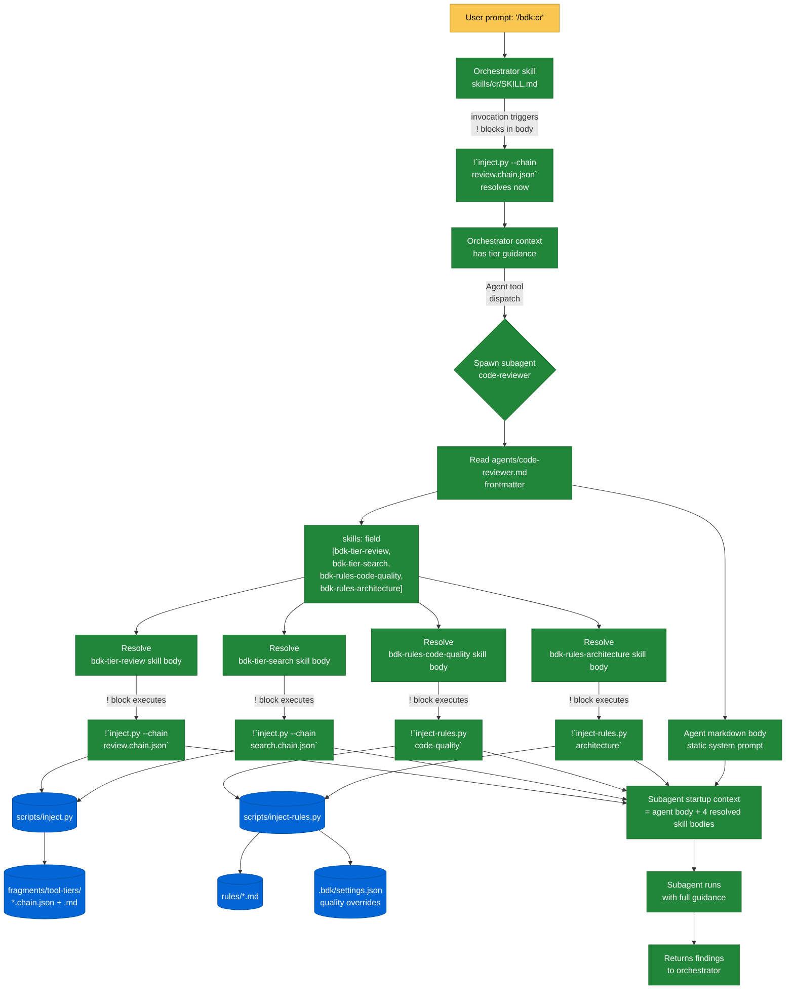
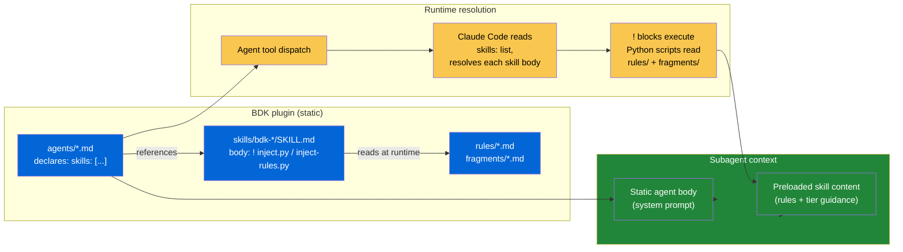
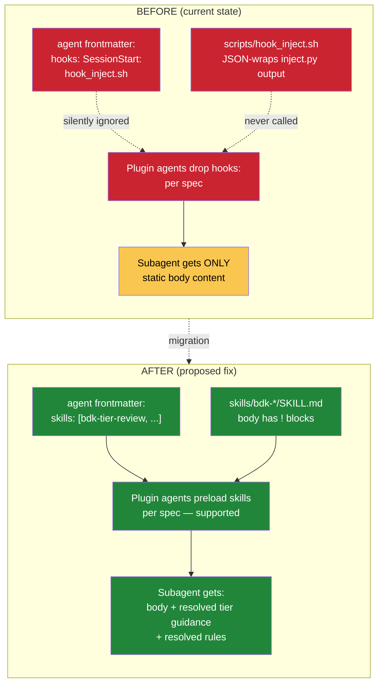

# BDK Injection Flows — Audit & Reference

Audit of every dynamic-content injection mechanism in BDK, mapped against the Claude Code plugin spec. Documents what works, what's silently broken, and where every usage lives.

**Sources verified against:**
- `https://code.claude.com/docs/en/plugins-reference` — Plugins reference
- `https://code.claude.com/docs/en/skills` — Skills (frontmatter, dynamic context injection)
- `https://code.claude.com/docs/en/agents` — Subagents (supported frontmatter, plugin restrictions)
- `https://code.claude.com/docs/en/hooks` — Hooks (SessionStart output handling)

**Audit date:** 2026-05-05

---

## TL;DR — Status of every flow

| # | Flow | Status | Severity |
|---|------|--------|----------|
| 1 | `hooks.json` SessionStart shells `cat STARTUP_INSTRUCTIONS.md` | ⚠️ **Partially broken** | High |
| 2 | `STARTUP_INSTRUCTIONS.md` `!\`inject.py --chain\`` blocks | ❌ **Dead code** | High — defeats Tool Tier System |
| 3 | Skill `SKILL.md` `!\`inject.py --chain\`` blocks | ✅ Works | — |
| 4 | Skill `SKILL.md` `!\`inject-rules.py <name>\`` blocks | ✅ Works | — |
| 5 | Skill `SKILL.md` `!\`get_settings.py <kind>\`` blocks | ✅ Works | — |
| 6 | Skill template `<!-- INJECT: <name> -->` markers | ✅ Works (instruction-driven, not directive) | — |
| 7 | Agent frontmatter `hooks: SessionStart: hook_inject.sh` | ❌ **Dead code** | High — 5 agents lose tool-tier guidance |
| 8 | Agent frontmatter `hooks: PostToolUse: ...` | ❌ **Dead code** | High — `implementer`, `fixer` lose context-usage tracking |
| 9 | Skill frontmatter `hooks:` blocks (e.g. `commit/SKILL.md`) | ✅ Works | — |
| 10 | Agent body reading `.claude/rules/` from target project | ✅ Works | — |

---

## The two execution contexts (read this first)

The whole confusion stems from **`!\`...\`` only working in some contexts, not others**.

### Where `!\`command\`` IS executed

Per docs, dynamic context injection runs in:
- **`SKILL.md` body** — verbatim quote: *"Each `!\`<command>\`` executes immediately (before Claude sees anything). The output replaces the placeholder in the skill content."*
- **Custom commands** (`.claude/commands/*.md`) — same skill machinery

Output is **substituted before Claude sees the rendered skill**.

### Where `!\`command\`` is NOT executed

- **Hook stdout** — verbatim quote: *"Any text your hook script prints to stdout is added as context for Claude."* Plus: *"There is no mention of processing embedded directives or expanding special syntax."*
- **Agent body** (`agents/*.md` markdown body) — agents are static markdown; never re-parsed for directives.
- **Files `cat`'d by hooks** — `cat` outputs the file verbatim. The hook then sends that verbatim text as additionalContext.

**Result:** Any `!\`...\`` block that reaches the model via a hook (rather than via skill invocation) is shown as **literal text**, not executed.

### Plugin restrictions on agents (the other showstopper)

Verbatim from the agents doc:

> **For security reasons, plugin subagents do not support the `hooks`, `mcpServers`, or `permissionMode` frontmatter fields. These fields are ignored when loading agents from a plugin.**

So plugin agents *cannot* attach hooks via frontmatter, period. Skills *can*.

---

## Flow-by-flow audit (every usage listed)

### Flow 1 — `hooks.json` SessionStart

**Status:** ⚠️ Partially broken. The `cat` step works (file is loaded into context). The `!\`...\`` blocks inside it do not — see Flow 2.

**File:** `hooks/hooks.json`

```json
{
  "hooks": {
    "SessionStart": [{"hooks": [
      {"type": "command", "command": "cat ${CLAUDE_PLUGIN_ROOT}/STARTUP_INSTRUCTIONS.md"},
      ...
    ]}]
  }
}
```

**What works:** The SessionStart hook fires and `cat`'s `STARTUP_INSTRUCTIONS.md` to stdout, which Claude Code injects as additionalContext.

**What doesn't:** The injected text contains `!\`...\`` blocks that the model then sees as literal strings (Flow 2).

---

### Flow 2 — `STARTUP_INSTRUCTIONS.md` chain expansion

**Status:** ❌ **DEAD CODE.** Has never worked under the documented spec.

**File:** `STARTUP_INSTRUCTIONS.md`

**Three usages, all dead:**
- Line 11: `!\`python3 ${CLAUDE_PLUGIN_ROOT}/scripts/inject.py --chain ${CLAUDE_PLUGIN_ROOT}/fragments/tool-tiers/explore.chain.json\``
- Line 15: `!\`python3 ${CLAUDE_PLUGIN_ROOT}/scripts/inject.py --chain ${CLAUDE_PLUGIN_ROOT}/fragments/tool-tiers/search.chain.json\``
- Line 19: `!\`python3 ${CLAUDE_PLUGIN_ROOT}/scripts/inject.py --chain ${CLAUDE_PLUGIN_ROOT}/fragments/tool-tiers/impact.chain.json\``

**Why dead:** `cat` outputs the file verbatim. The model receives the literal string `!\`python3 ...\``. There is no second-pass evaluation.

**Empirical verification:** Start a fresh Claude Code session in any test project with BDK installed. Inspect the SessionStart context. The "Tool Tier System" section should contain raw backtick-wrapped strings, not the resolved tier guidance.

**Impact:** The Tool Tier System — the central abstraction injected at session start — is not reaching the model. Skills that *do* invoke chains directly (Flow 3) still get them, but the session-level baseline is missing.

**Fix options:**
- **A.** Move expansion into the hook command itself: `bash -c 'cat .../STARTUP_INSTRUCTIONS.md && python3 .../inject.py --chain .../explore.chain.json && ...'`
- **B.** Replace `STARTUP_INSTRUCTIONS.md` with a Python script that prints the resolved content (chains expanded inline). Hook calls the script directly.
- **C.** Use `additionalContext` JSON form in the hook to assemble the final string in the script.

Recommended: **B**. Cleanest, single source of truth.

---

### Flow 3 — Skill `!\`inject.py --chain\`` blocks

**Status:** ✅ Works. Skill markdown supports dynamic context injection per spec.

**Usages:**
- `skills/cr/SKILL.md:52` — `review.chain.json`
- `skills/create-plan/SKILL.md:52` — `explore.chain.json`
- `skills/explain-complex-code/SKILL.md:34` — `explore.chain.json`
- `skills/debug/SKILL.md:84` — `search.chain.json`
- `skills/debug/SKILL.md:95` — `impact.chain.json`
- `skills/test-driven-development/SKILL.md:76` — `search.chain.json`

These run when the skill is invoked. Output replaces the placeholder before Claude sees the rendered prompt.

---

### Flow 4 — Skill `!\`inject-rules.py <name>\`` blocks

**Status:** ✅ Works.

**Two usages:**
- `skills/create-plan/SKILL.md:122` — `code-quality`
- `skills/cr/SKILL.md:99` — generic loop in prose: *"For each `<!-- INJECT: <name> -->` marker, run python3 ${CLAUDE_PLUGIN_ROOT}/scripts/inject-rules.py <name>"*

The `cr` skill uses an instruction-driven loop (it's prose, the model walks the markers and shells the script per-marker). The `create-plan` skill hardcodes one rule name. **Inconsistent — see "Recommendations" at end.**

---

### Flow 5 — Skill `!\`get_settings.py <kind>\`` blocks

**Status:** ✅ Works.

**Usages:**
- `skills/test-driven-development/SKILL.md:105` — `test-tools`
- `skills/create-plan/SKILL.md:120,121` — `test-tools`, `lint-tools`
- `skills/debug/SKILL.md:117,168,169` — `test-tools` (×2), `lint-tools`

Resolves project-level test/lint commands from `.bdk/settings.json`. Standard skill-runtime injection.

---

### Flow 6 — Skill template `<!-- INJECT: <name> -->` markers

**Status:** ✅ Works (instruction-driven, not a Claude Code feature).

**Usages:**
- `skills/cr/references/reviewer-prompt-template.md:18` — `code-quality`
- `skills/cr/references/reviewer-prompt-template.md:22` — `architecture`
- `skills/cr/references/reviewer-prompt-template.md:48` — `architecture`
- `skills/create-plan/references/plan-template.md:183` — `code-quality`

These are **not Claude Code directives** — they're literal placeholder strings. The consuming SKILL.md prose tells the model to walk them and substitute resolved content. So the mechanism is "instruction to the model" + Flow 4 (the substitution content comes from `inject-rules.py`).

This is fragile: depends on the model following SKILL.md instructions correctly. Robust enough in practice because the SKILL.md tells it what to do explicitly.

---

### Flow 7 — Agent frontmatter `hooks: SessionStart`

**Status:** ❌ **DEAD CODE — now removed.** Plugin agents drop `hooks` per spec. No agent declares `hooks:` any more; tier guidance reaches agents through `skills:` preload instead.

**Why dead:** Verbatim from spec — *"plugin subagents do not support the `hooks`, `mcpServers`, or `permissionMode` frontmatter fields. These fields are ignored when loading agents from a plugin."*

**Impact:** These agents never receive the tool-tier guidance their frontmatter requests. Each runs with only the static markdown body for tool guidance.

**Reinforces an existing comment:** `.claude/rules/fragment-system.md:88` already says *"Agent `.md` files are static markdown — shell commands do not execute at load time."* The `hooks:` blocks contradict this and were never going to work.

**Fix:** Delete the dead `hooks:` blocks. Move tool-tier guidance into the agent body (static prose: "Use `query_graph` for callers/callees, fall back to grep when graph unavailable"). Accept that subagent prompts cannot be dynamically composed.

---

### Flow 8 — Agent frontmatter `hooks: PostToolUse`

**Status:** ❌ **DEAD CODE — now removed.** Same plugin restriction. `implementer` and `fixer` declared `PostToolUse` hooks running a context-usage tracker; both the hooks and the tracker script are gone. Context budgeting is the coordinator's job, enforced in `subagent-execute-plan`'s own prose.

---

### Flow 9 — Skill frontmatter `hooks:`

**Status:** ✅ Works. Skill frontmatter `hooks:` is documented and supported, no plugin restriction.

**Skills using this:**
- `skills/commit/SKILL.md:7-9`
- `skills/update-docs/SKILL.md:8-10`
- `skills/graphviz-docs-compiler/SKILL.md:6-14`
- `skills/explain-complex-code/SKILL.md:8-10`

These fire correctly when the skill is invoked.

---

### Flow 10 — Agent runtime path lookup of `.claude/rules/`

**Status:** ✅ Works. Pure file-read at runtime, no special mechanism.

**Two agents:**
- `agents/code-reviewer.md:49` — reads `.claude/rules/` for project-specific quality standards
- `agents/architecture-reviewer.md:39,73` — reads `.claude/rules/architecture.md`

Note: This refers to **target project's** `.claude/rules/`, not BDK's internal `.claude/rules/`. Naming collision — see "Naming gotcha" below.

---

## Two scripts, overlapping purpose

| Script | Reads from | Used by |
|---|---|---|
| `scripts/inject.py` | `fragments/**/*.md` (chain JSON or `--if`/`--prefer`) | STARTUP, 6 skill `!\`...\`` blocks |
| `scripts/inject-rules.py` | `rules/*.md` (with `.bdk/settings.json` quality overrides) | 1 hardcoded skill block + 1 instruction-driven skill loop |
| `scripts/get_settings.py` | `.bdk/settings.json` (specific keys) | 6 skill `!\`...\`` blocks |
| `scripts/hook_inject.sh` | Wraps `inject.py` for hook stdout JSON output | **Only the dead agent SessionStart blocks** — Flow 7 |

`hook_inject.sh` exists exclusively to feed the dead Flow 7. **If Flow 7 is removed, the script is dead too.**

---

## Naming gotcha — three different `rules/` directories

| Path | Owner | Read by |
|---|---|---|
| `rules/` (BDK plugin root) | BDK | `inject-rules.py` for skill injection |
| `.claude/rules/` (BDK plugin internal) | BDK contributors | Dev-time conventions for BDK itself (per `CLAUDE.md`) |
| `.claude/rules/` (target project) | end user | `code-reviewer.md` and `architecture-reviewer.md` read at runtime |

Three same-named-or-similar directories, three different purposes. Worth a rename pass eventually (e.g., BDK's internal one → `.claude/dev-rules/`).

---

## Inconsistencies worth fixing

### 1. `create-plan` hardcodes one rule, `cr` uses a generic loop

`skills/create-plan/SKILL.md:122` — `!\`python3 ... inject-rules.py code-quality\`` (one rule name baked in)
`skills/cr/SKILL.md:96-99` — instruction-driven loop over `<!-- INJECT: <name> -->` markers (any rule)

If `design-patterns.md` (or any future rule) is added, only `cr` picks it up automatically. `create-plan` requires editing SKILL.md.

**Fix:** Convert `create-plan` to use the same marker loop as `cr`. One-time refactor, future rules plug in for free.

### 2. `architecture.md` is injected only by `cr`, not by `create-plan`

`create-plan/references/plan-template.md` injects `code-quality` only. Architecture rules never reach the plan output.

**Fix:** Add `<!-- INJECT: architecture -->` to `plan-template.md`. Cheap.

### 3. Tool-tier chains are duplicated across STARTUP and skills

Each skill that needs tool-tier guidance re-invokes `inject.py --chain`. Same content fetched 7+ times across skill invocations in a session.

If Flow 2 worked (it doesn't), the chains would be in the session baseline and skills wouldn't need to re-inject. Fixing Flow 2 might let us remove the per-skill chain injections, OR we keep both — STARTUP for orchestrator, skills for forked subagents that don't inherit session context.

---

## Recommended fix order

1. **Delete dead code first.** Removes the false-positive that "this seems to work."
   - `agents/*.md`: strip `hooks:` blocks from 7 agents (Flows 7 + 8)
   - Update `.claude/rules/fragment-system.md` to cite the spec quote
   - Delete `scripts/hook_inject.sh` (no longer used)

2. **Fix Flow 2 — STARTUP_INSTRUCTIONS.md chain expansion.**
   - Convert `STARTUP_INSTRUCTIONS.md` to a Python script (e.g., `scripts/render_startup.py`) that prints the resolved content with chains expanded
   - Update `hooks/hooks.json` to call the script instead of `cat`
   - Test in a fresh Claude Code session in a test project

3. **Move dead agent tool-tier guidance into agent bodies.**
   - For each of 5 agents (Flow 7), embed the relevant tool-tier guidance as static prose in the agent's markdown body
   - Document in `.claude/rules/fragment-system.md` that agent tool guidance is static, not dynamic

4. **Standardize rule injection in `create-plan`.**
   - Replace hardcoded `code-quality` injection with the same marker-loop pattern as `cr`
   - Add `<!-- INJECT: architecture -->` marker to `plan-template.md`

5. **Then add new rules** (`design-patterns.md` etc.).
   - Once Step 4 lands, new rules are a one-line addition: drop the `.md` file in `rules/`, add a `<!-- INJECT: -->` marker where wanted.

6. **(Optional) Document or rename `.claude/rules/` collision.**
   - Either rename BDK's internal `.claude/rules/` to `.claude/dev-rules/`, or add a clarifying note to `CLAUDE.md`.

---

## Proposed architecture — unified injection via `skills:` preload

After empirically confirming agent `hooks:` frontmatter is dead in plugin mode (see Flow 7 + 8), the replacement strategy uses the `skills:` preload field, which IS supported for plugin subagents per spec.

> **`skills`**: Skills to load into the subagent's context at startup. The full skill content is injected, not just made available for invocation. Subagents don't inherit skills from the parent conversation. *(verbatim from `/en/sub-agents`, supported frontmatter table)*

The `skills:` field is **not** in the plugin-restricted list (only `hooks`, `mcpServers`, `permissionMode` are). So this works for plugin agents.

### Mechanism



### Responsibility split



### Migration: before vs. after



### Skills introduced by this design

| Skill name | Body | Purpose |
|---|---|---|
| `bdk-tier-explore` | `!\`inject.py --chain explore.chain.json\`` | Architecture/codebase exploration tier |
| `bdk-tier-search` | `!\`inject.py --chain search.chain.json\`` | Symbol search/tracing tier |
| `bdk-tier-review` | `!\`inject.py --chain review.chain.json\`` | Code review tier |
| `bdk-tier-impact` | `!\`inject.py --chain impact.chain.json\`` | Impact-radius analysis tier |
| `bdk-rules-code-quality` | `!\`inject-rules.py code-quality\`` | Code quality principles |
| `bdk-rules-architecture` | `!\`inject-rules.py architecture\`` | Architecture principles |
| `bdk-rules-design-patterns` (future) | `!\`inject-rules.py design-patterns\`` | GoF + data-driven principles |

All marked `user-invocable: false` to hide from `/` menu. Cannot use `disable-model-invocation: true` because that blocks subagent preloading per spec.

### Proposed injection map — every agent

For each, decision based on the entity's actual job. "Inject only what's used."

| Agent | Model | Job | tier-explore | tier-search | tier-review | tier-impact | rules-code-quality | rules-architecture | rules-design-patterns |
|---|---|---|---|---|---|---|---|---|---|
| `code-reviewer` | sonnet | Review files, find findings | — | ✅ | ✅ | — | ✅ | ✅ | ✅ |
| `architecture-reviewer` | opus | Cross-cutting architecture analysis | ✅ | ✅ | — | ✅ | — | ✅ | ✅ |
| `dead-code-detector` | haiku | Find unused symbols | — | ✅ | — | — | — | — | — |
| `duplicate-detector` | haiku | Find duplicates | — | ✅ | — | — | — | — | — |
| `explorer` | haiku | Fast codebase exploration | ✅ | ✅ | — | — | — | — | — |
| `fixer` | sonnet | Apply specific findings to code | — | ✅ | — | ✅ | ✅ | — | — |
| `implementer` | sonnet | Implement one plan task TDD-style | — | ✅ | — | ✅ | ✅ | — | ✅ |
| `log-analyzer` | haiku | Triage stderr / stack traces | — | ✅ | — | — | — | — | — |
| `static-analyse` | haiku | Run lint/format/typecheck tools | — | — | — | — | — | — | — |
| `test-runner` | haiku | Run test suite, report results | — | — | — | — | — | — | — |
| `web-researcher` | haiku | Internet research | — | — | — | — | — | — | — |

**Notes per agent:**
- `architecture-reviewer` — gets both `tier-explore` and `tier-search` because it traces structure AND symbols. No `code-quality` (not its job — it reviews layering, not function-level hygiene).
- `code-reviewer` — gets all rules. Reviews function-level code AND structural choices.
- `dead-code-detector` / `duplicate-detector` — narrow jobs. Only `tier-search`. No rules to enforce.
- `explorer` — purely informational. Returns context to caller; doesn't apply rules.
- `fixer` — applies findings someone else generated. `code-quality` because it's writing code; `tier-impact` because every fix has a blast radius.
- `implementer` — writes new code. `code-quality` for hygiene; `design-patterns` to encourage right shape from the start.
- `log-analyzer` — reads logs. Sometimes needs to find a symbol from a stack trace (`tier-search`).
- `web-researcher` — pure tool runner. No injection. Its body is short and self-contained.
- `static-analyse`, `test-runner` — no tier or rules injection (they read no code), but each preloads its tool meta-skill (`bdk-lint-tools` / `bdk-test-tools`) via `skills:`. That is not just a command list: the meta-skill carries the **tier and scoping policy** — which form of a command to run given a file list, and which tier may run when. Callers pass paths and intent; the agent resolves the command. Removing the preload would make every caller embed a command string, which is how scoping silently rots into a full-suite run.

### Proposed injection map — every skill

Skills that ARE orchestrators (dispatch subagents) and skills that produce output documents need injection differently.

| Skill | Type | Already injects tiers in body? | Needs tier injection (skill body) | Needs rules injection (skill body) | Notes |
|---|---|---|---|---|---|
| `cr` | Orchestrator | ✅ `tier-review` | Keep `tier-review` | — | Orchestrator dispatches reviewers; itself does not enforce rules. Rules go to subagents via `skills:` preload. **Remove `<!-- INJECT: -->` template markers** (redundant once subagents preload rules). |
| `create-plan` | Output document | ✅ `tier-explore` | Keep `tier-explore` | Add `code-quality`, `architecture`, `design-patterns` | Plan output cites rules for the human reader. Add markers in `plan-template.md`. **Generalize hardcoded `inject-rules.py code-quality` to a marker loop like `cr` uses.** |
| `debug` | Output document | ✅ `tier-search` + `tier-impact` | Keep both | — | Debug session is investigation; doesn't enforce rules per se. |
| `explain-complex-code` | Output document | ✅ `tier-explore` | Keep | — | Explanatory output, not enforcement. |
| `test-driven-development` | Procedure | ✅ `tier-search` | Keep | — | TDD process; tests are the enforcement, no rule injection needed. |
| `subagent-execute-plan` | Orchestrator | — | Add `tier-impact` (orchestrator triages risk) | — | Dispatches `implementer`/`fixer`/reviewers. Rules go to those subagents. |
| `design` | Output document | ✅ `tier-explore` (via `explore.chain.json`) | Keep | Add `architecture`, `design-patterns` | Design exploration; should know the constraints it's designing within. Replaces `brainstorming` + `brainstorm-architecture`. |
| `verify-plan` | Orchestrator | — | Add `tier-impact` | — | Orchestrates `plan-verifier`. Rules go to subagents. |
| `commit` | Procedure | — | — | — | Generates commit message from git diff. No code analysis. |
| `setup` | Bootstrap | — | — | — | Initializes settings; no analysis. |
| `create-adr` | Output document | — | — | Add `architecture` | ADRs document architectural decisions; arch rules give the reviewer's lens. |
| `update-docs` | Output document | — | Add `tier-explore` | — | Compares docs to code; needs exploration. |
| `graphviz-docs-compiler` | Tool wrapper | — | — | — | Compiles `.dot` → SVG. No analysis. |

### Cross-cutting observations from the audit

1. **`cr` orchestrator currently has `<!-- INJECT: code-quality -->` and `<!-- INJECT: architecture -->` markers in `reviewer-prompt-template.md`.** Once subagents preload rules via `skills:`, these markers are redundant. **Plan: delete the markers and the SKILL.md inject loop.** Saves prompt-build complexity and tokens-per-dispatch.

2. **`create-plan` hardcodes `inject-rules.py code-quality` and lacks `architecture`.** Generalize to a marker loop (mirroring `cr`'s pattern), then add markers for `code-quality`, `architecture`, and future `design-patterns` — a one-time refactor that makes future rules zero-touch.

3. **No agent currently reads `tier-impact` despite `impact.chain.json` existing.** Worth adding to `fixer` and `implementer` — they both reason about blast radius.

4. **`design` should know architecture and design-patterns rules.** The skill currently injects `architecture` only; adding `design-patterns` would tighten its output toward project conventions.

6. **`graph-*` skills are deliberately frozen.** They only make sense when `code-review-graph` is enabled, so they hardcode graph tools instead of going through the chain mechanism. Don't migrate them.

### Verification status

- [x] Test: `!`...`` blocks resolve when skill is preloaded into subagent (sentinel-script test) — verified 2026-05-07
- [x] Test: Resolved content appears in subagent's startup context — verified 2026-05-07
- [x] Test: Multiple `skills:` entries all resolve and concatenate — verified 2026-05-07

Until these tests pass, the proposal stays a proposal. Do not migrate production code on theory alone.

---

## Verbatim spec citations

For future verification, here are the exact lines from Claude Code docs that this audit relies on.

**Plugin agent restrictions** (`/en/agents`):
> For security reasons, plugin subagents do not support the `hooks`, `mcpServers`, or `permissionMode` frontmatter fields. These fields are ignored when loading agents from a plugin.

**Hook stdout handling** (`/en/hooks`):
> Any text your hook script prints to stdout is added as context for Claude.

> Once output is injected as context or additionalContext, it is static. The documentation contains no reference to re-parsing hook output for embedded commands or macros.

**Skill dynamic context injection** (`/en/skills`):
> The `!\`<command>\`` syntax runs shell commands before the skill content is sent to Claude. The command output replaces the placeholder, so Claude receives actual data, not the command itself.

> Each `!\`<command>\`` executes immediately (before Claude sees anything)
> The output replaces the placeholder in the skill content
> Claude receives the fully-rendered prompt with actual PR data
> This is preprocessing, not something Claude executes. Claude only sees the final result.

**Skill `hooks:` frontmatter field** (`/en/skills`, frontmatter table):
> `hooks` — Hooks scoped to this skill's lifecycle. See [Hooks in skills and agents] for configuration format.

(No equivalent restriction on plugin skills — only plugin *agents* drop hooks.)

**Plugin path behavior** (`/en/plugins-reference`):
> For `skills`, `commands`, `agents`, `outputStyles`, `themes`, and `monitors`, a custom path replaces the default.

(Note: `rules/` is not in the list of recognized plugin directories — it's plugin payload, read by BDK's own scripts via `${CLAUDE_PLUGIN_ROOT}`. Not a bug, just clarifying.)
