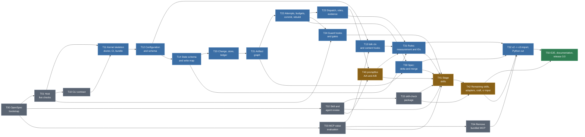

# BDK v3 - implementation plan (tasks)

**Sources**: `docs/v3/2026-09-23-0703-bdk-v3-change-centric-design.md` (design, verifier PASS iteration 3, 2026-09-24) and `docs/v3/2026-09-23-0703-bdk-v3-decisions.md` (decision register D1-D5, S1-S8, Q1-Q5, K1-K4, A-_, R-_, T1-T6, P1-P11).
**Date**: 2026-09-24, revised 2026-09-25 after T02 (decisions in `docs/V3-SKILL-INVENTORY.md`, sections 11-13: two plugins, roles as skills with five adapters, kernel runners, state schema task T14, skill-check package T15, rules funnel, no OpenSpec runtime dependency)
**Status**: draft plan, to be run in OpenSpec

## How to read this document

- This file is a **roadmap and task index**, not a specification. Each task below gets **its own spec in OpenSpec** (`openspec/changes/<id>/` with `proposal.md`, `specs/`, `design.md`, `tasks.md`), written before it starts. No decisions are made here; the "To resolve in the spec" section of each task lists what the spec must settle.
- Tasks are executed by AI, so they are **large** - one task is a coherent kernel module or a coherent group of skills, not a single file. A task boundary runs where the contract between components changes (CLI, Change directory, hook, skill), because that is where the spec has something to describe.
- The **Input** column points to the design sections and decision IDs the spec must carry over; the **Acceptance signal** column lists the scenarios from the design's "Testing Strategy" section that must pass for the task to be closed.
- Phase order follows dependencies, not time. Tasks in one phase with no arrow between them can run in parallel (separate OpenSpec Changes, separate branches).

## Running the project in OpenSpec

Convention (confirmed in T00; project context and artifact rules live in `openspec/config.yaml`):

| Plan element                 | OpenSpec counterpart                                                                                                        |
| ---------------------------- | --------------------------------------------------------------------------------------------------------------------------- |
| This document                | `docs/V3-IMPLEMENTATION-PLAN.md`, linked from `openspec/config.yaml` as project context                                     |
| One task `Tnn`               | one Change `openspec/changes/v3-tnn-<slug>/` (lowercase task ID, e.g. `v3-t01-host-live-checks`; OpenSpec rejects capitals) |
| "Input" column               | `proposal.md` (why and what) plus `design.md` (how), with citations of v3 design sections                                   |
| "Acceptance signal" column   | `specs/<capability>/spec.md` as `Requirement` / `#### Scenario:` WHEN / THEN                                                |
| Work breakdown within a task | `tasks.md` (`## section`, `- [ ] N.M`) - written by AI in `/opsx:propose` or `/opsx:ff`, not here                           |
| Closing a task               | `/opsx:verify` then `/opsx:archive`; the BDK living spec grows in `openspec/specs/`                                         |

Status across tasks is tracked on GitHub, not in this file: every `Tnn` has one issue in the [`v3.0` milestone](https://github.com/broneq/bdk/milestone/1), labelled `v3:phase-N`, with native "blocked by" links that mirror the **Dependencies** line of each task. The [BDK v3 project board](https://github.com/users/broneq/projects/1) shows every issue with its `Status` (Todo / In progress / Done) and `Phase`. The issue holds status only; scope stays here and detail stays in the OpenSpec Change, whose `proposal.md` links the issue. The task's work happens on a branch `v3/Tnn-<slug>`; the PR that lands the archived Change targets `staging/v3`, and because closing keywords only fire on the default branch, the issue is closed by hand after the merge. When a task's dependencies change, update this file and the issue links together.

Note on the seam: BDK v3 itself introduces a living spec in OpenSpec format under `.bdk/specs/` (D2). Until the v2 -> v3 cut, the BDK project is run with the OpenSpec tool (`openspec/`), and after T50 the BDK spec may be migrated to BDK's own mechanism (`bdk import` or by hand). Whether and when is a decision outside this plan, recorded in T50 as a question.

## Dependency graph

Colours: grey = preparation without kernel code; blue = kernel and data; amber = skill layer, dependent on the A/B result (risk from the register: fallback to approach B with the same kernel); green = closing.

---

## Phase 0 - Preparation

### T00 Bootstrap OpenSpec in the BDK repository

**Goal**: the BDK repo is run in OpenSpec; this plan is the index of Changes.

**Scope**:

- `openspec init` in the repo, `openspec/config.yaml` with context (link to this plan, to the v3 design and the decision register).
- Change naming convention `v3-Tnn-<slug>`, a `proposal.md` template that points to design sections and decision IDs.
- Settle where the v3 design documents live during implementation (today untracked because of `/.bdk/` in `.gitignore`, decision V-tracking): copy to `openspec/changes/` or `docs/`, or leave as is.
- Entry in `CLAUDE.md` / `CONTRIBUTING.md`: how to start a task from this plan (`/opsx:propose` with the task ID).

**Input**: the "Running the project in OpenSpec" section above; D2 (OpenSpec format as the target format of the BDK spec); V-tracking.

**Acceptance signal**: `openspec validate` passes on an empty Change tree; the first Change (`v3-t01-...`) created by `/opsx:propose` links this document.

**To resolve in the spec**: OpenSpec schema for kernel tasks (default spec-driven or tdd); whether the v3 design goes into git now; whether `openspec/specs/` stays after v3 or migrates to `.bdk/specs/`.

**Dependencies**: none.

**Resolution** (T00 ran directly, before OpenSpec existed, so it has no Change of its own):

- Schema: `spec-driven`, the only schema OpenSpec 1.13.2 ships. Test-first work is enforced by a `tasks` rule in `openspec/config.yaml`, not by a separate schema.
- The v3 design and decision register are in git under `docs/v3/` (commit 389557d). The `.md` files are authoritative; the Polish `.html` pages are background material.
- Whether `openspec/specs/` stays after v3 or migrates to `.bdk/specs/` stays open until T50, as that task already records.
- Workflow profile: `custom` with `propose, explore, new, continue, apply, update, ff, verify, sync, archive`; the default `core` profile lacks `ff` and `verify`, which this plan relies on.
- The second half of the acceptance signal (the first Change links this document) is checked when T01 starts.

### T01 Host live checks and recorded hook payloads

**Goal**: facts about Claude Code that T1-T3 depend on, checked live **before** the kernel skeleton; hook payloads recorded as fixtures for E2E.

**Scope** (the "Live checks" list from "What We Did NOT Decide" and the register):

- `UserPromptExpansion`: a BDK plugin skill arrives as `command_name: plan`, `command_source: plugin`; shape of `prompt`, `command_args`; whether `disable-model-invocation: true` also blocks invocation through the `Skill` tool.
- `PreToolUse`: whether user `!` commands (bash mode) go through the hook; whether background plugin subagents get `agent_id` like foreground ones; shape of `tool_input` for `Bash`, `Edit`, `Write`, `MultiEdit`, `NotebookEdit`.
- `SessionEnd`: whether it fires when the session is killed and on `/clear`; payload.
- `allowed-tools`: whether the rule `Bash(node ${CLAUDE_PLUGIN_ROOT}/dist/bdk.mjs *)` pre-approves the compound form `node ... || echo ...` (V2-4).
- `disallowed-tools` in a skill: confirm that it is cleared on the next user message (P9).
- `node:sqlite`: minimum Node version without a flag, stability status; the user's Node version (nvm).
- Every measurement saved as a recorded JSON payload in a fixtures directory (e.g. `tests/fixtures/host-payloads/`), with the Claude Code version in the name.

**Input**: "Existing Codebase Context" paragraph "Host facts verified"; NFR row "Host"; risk "Host hook semantics move under us"; T1-T3.

**Acceptance signal**: a `docs/HOST-FACTS.md` document with a fact / result / host version / fixture table; every item on the list has a result YES / NO / NOT APPLICABLE; on NO for `UserPromptExpansion`, the `bdk stage enter` fallback is described for inclusion in T10 and T24.

**To resolve in the spec**: recording method (a hook script writing stdin to a file); whether fixtures live in `tests/` or `openspec/`.

**Dependencies**: T00 (formally); none in substance.

### T02 Review of the skill, meta-skill and agent inventory

**Goal**: a deliberate disposition for each of today's 16 user skills, 13 meta-skills and 13 agents: **stays / merges / redesign / removed**. The design's inventory (15 skills, 5 meta-skills per role class, 13 agents) is marked PoC / TODO, so this task verifies it rather than adopting it.

**Scope**:

- For each skill: size (today 8-661 lines, S1 = 200), what it really does, which steps are "process" to move into the graph / kernel, which are "domain knowledge" to keep in the skill, what `!` blocks, frontmatter hooks and `allowed-tools` it has.
- Merge candidates from the design: `create-plan` + `verify-plan` -> `plan`; `add-rule` + `refine-rules` -> `rules`; `design` + `create-adr` (decision export); rename `test-driven-development` -> `tdd`, `update-docs` -> `docs`. For each: for / against / recommendation.
- Meta-skills `bdk-tier-*`, `bdk-rules-*`, `bdk-lint-tools`, `bdk-test-tools`, `bdk-implementer-return-contract` -> 5 `bdk-role-<class>` (worker / reader / reviewer / verifier / runner): agent -> class mapping, what each agent loses or gains.
- Agents: `tools:` unchanged (T2), but the input / output contract changes (package path, envelope, `bdk-entries` block); identify which agents today contain text that conflicts with P3 (statements about approval) and T3 (no ban on destructive git).
- `cr` and `pr-review`: out of redesign scope (user decision), but write down how they should accept the dispatch package as input.
- Choice of the skill (or two) for the "thin vs long" A/B in T40 - recommendation of which one we measure.
- Dev-time `.claude/skills/skill-lint`, `agent-lint`: what of them becomes a CI content test (A3).

**Input**: "Skill inventory (PoC / TODO)", "Users & Personas", "TSH revision grounding", `README.md` Skills and Agents sections, `STARTUP_INSTRUCTIONS.md`.

**Acceptance signal**: `docs/V3-SKILL-INVENTORY.md` with a table: skill / lines today / disposition / rationale / target task (T41 or T42); the same for agents and meta-skills; a list of open decisions for the user, each with a recommendation.

**To resolve in the spec**: this is a review task; the spec describes the output format and criteria (e.g. "process vs knowledge"). Decisions about the fate of skills are made by the user on the task's output; T41 / T42 receive them as input.

**Dependencies**: T00.

**Resolution** (2026-09-25, three Lavish review rounds; the full record is `docs/V3-SKILL-INVENTORY.md`, sections 11-13):

- Two plugins from one repository and one marketplace: `bdk` (everything that calls the kernel) and `bdk-craft` (pure knowledge: `tdd`, `oop-design`, `api-design`, `debugging`, `refactoring`, `data-modeling`, `testing-strategy`, `modularizing`, `mermaid-drawer`; standard fields only; each admitted only after a measured with / without difference). Thematic directories through the `skills` array in `plugin.json`, flat command names.
- Core skills: stages `setup`, `change`, `design`, `plan`, `verify-plan`, `execute`, `close`, `run`; tools `cr`, `pr-review`, `docs`, `rules`, `commit`, `adr`, `doctor`, `bdk-cli`. `debug` becomes Change kind `bug` plus `bdk-craft:debugging`; `explain-complex-code` merges into `docs`; `create-adr` into `design` plus a thin `adr`; `verify-plan` stays separate (user decision).
- Roles are skills under `skills/roles/` (`user-invocable: false`); agents shrink to five adapters (`worker`, `reader`, `reviewer`, `runner`, `scout`) generated per host; the `bdk-role-*` meta-skills disappear; two kernel runners (`host-agent`, `headless`) give parallel waves on every host.
- Rules: `.bdk/rules/<id>.md` with `applies` globs, per-package selection, ID citations in reports; no automation writes a rule (candidates as `learning` entries with fingerprint and evidence, proposal at `close` on thresholds, manual accept); the `check-rules-drift` hook is not ported; `.claude/rules/` in the target project becomes a generated projection.
- Text as the state's source of truth with a rebuilt SQLite index, non-sequential IDs, a two-branch merge contract test; no OpenSpec runtime dependency (format compatibility only); autonomy as per-gate policy plus `run`; `bdk measure` shared by `change new` and `cr`; `architecture.md` and design parts for the `large` profile; T40 measures `execute` thin vs long and the rules no-op test on one harness; Serena's value (R-16) is measured in T03.
- Plan impact applied on 2026-09-25: new T14 and T15; scope changes in T11-T13, T20-T24, T30-T32, T40-T42, T50.

### T03 MCP value evaluation: serena and code-review-graph

**Goal**: a measured decision for each bundled MCP server - **default-on / opt-in / removed** - instead of carrying both into v3 by assumption. Today the plan keeps them unchanged (T13 "The `uvx` lines unchanged", T11 `doctor` checks `uv`, T32 asks whether `uv.lock` stays for MCP), while the tool tiers and the `tools:` lists of every agent depend on them.

**Why now** (observed on v2.6.0, 2026-09-25):

- The plugin `Stop` hook runs `uvx code-review-graph update` after every assistant reply, in every session, with no `features.code-review-graph` or `.bdk/settings.json` check and no lock: parallel sessions in one repo update the graph concurrently. Even a no-change incremental update reports `postprocess=full`. Field report: the process held 30-60% CPU for 3-4 minutes under 8 parallel sessions, with endpoint security scanning every file read. The v2 hotfix removes the hook; this task decides the v3 update strategy.
- Both servers start through `uvx` with no pinned version (serena from `git+https://github.com/oraios/serena` HEAD). Both hit `CONNECT_TIMEOUT` (30 s) at session start on 2026-09-25; `CONNECT_TIMEOUT` appears in 37 of 1932 local transcripts from the last 30 days.
- Tier fragments are selected by `features.*` flags, not by server availability, so a server that fails to connect leaves agents instructed to use tools that do not exist.
- Tier menus and agent `tools:` lists drift apart: `bdk-tier-explore` names graph tools that `architecture-reviewer`, `design-verifier`, `explorer` and `plan-verifier` are not granted (for example `get_community_tool`, `get_knowledge_gaps_tool`, `find_large_functions_tool`), and no test ties the two together.
- Usage in the same 30 days (real `tool_use` calls): code-review-graph 1204 (`semantic_search_nodes` 536, `query_graph` 267), serena 467 (`get_symbols_overview` 254, `find_symbol` 117; editing tools 56 against 5670 `Edit`), against `Read` 13264, `Grep` 1060, `Glob` 223. Usage is not value: nothing shows the calls saved anything over `Grep` / `Read`.

**Scope**:

- **Cost**, on at least one large real repository (not the BDK repo, 38 files): cold start and time to connect per server, connect failure rate, CPU and wall time of `update` (incremental with and without changes, `--skip-flows`, postprocess) and of a full build, disk size of the graph, behaviour under parallel sessions.
- **Value**: a fixed set of about 8 tasks covering the tiers (symbol search, reference tracing, impact / blast radius, change review, architecture overview, a structural refactor), run headless (`claude -p --output-format json`) in three configurations - no MCP, graph only, graph + serena - at least 3 runs each. Compare tokens, tool calls, wall time and correctness against a reference answer written before the runs. A lightweight precursor to T40, not a dependency on it. This is the only Serena value measurement in the plan: it absorbs T02 decision R-16, which first placed it in T40. R-16's proposed threshold is the starting point: serena is dropped if it neither improves correctness nor cuts tokens by at least 20% over graph only. The same data answers whether the `scout` adapter's four former agents (`explorer`, `log-analyzer`, `dead-code-detector`, `duplicate-detector`) stay merged (T02 decision R-7).
- **Failure mode**: what agents and tier guidance do when a server is configured but not connected; whether the tier choice can follow availability rather than the flag.
- **Update strategy** for the graph if it stays: on demand in the skills that use it, debounced, locked, or left to the server; which one survives parallel sessions.
- **Pinning**: version pin for each server that stays (`uvx` spec or `uv.lock`), feeding the T32 question.

**Input**: this section's "Why now" list; `hooks/hooks.json`; `.mcp.json`; `fragments/tool-tiers/`; `.claude/rules/fragment-system.md`; `.claude/rules/mcp-tool-naming.md`; agent `tools:` lists in `agents/*.md`; T02 decisions R-7 and R-16 (`docs/V3-SKILL-INVENTORY.md`, section 12); local transcripts for usage data; design "Integration points" (`.mcp.json` for serena and code-review-graph).

**Acceptance signal**: `docs/V3-MCP-EVALUATION.md` (delivered as `docs/adr/0001-remove-bundled-mcp-servers.md`, user decision) with the cost table, the per-task value table (all configurations and runs, raw numbers kept next to the summary), and per server a disposition with rationale; the resulting changes listed per downstream task (T13 hook lines, T32 `uv.lock`, T41 / T42 tier fragments and agent `tools:`); open decisions for the user, each with a recommendation.

**To resolve in the spec**: the task set and reference answers; which large repository serves as the benchmark; the threshold that counts as "worth it" (for example, fewer tokens or fewer tool calls at equal correctness, beyond run-to-run noise); whether serena and code-review-graph are judged separately or only as a pair.

**Dependencies**: T00.

**Resolution** (2026-09-25, user decision; the record is `docs/adr/0001-remove-bundled-mcp-servers.md`, data and harness in git history at `e061216:docs/v3/t03-mcp-eval/`, OpenSpec change `v3-t03-mcp-value-evaluation`):

- Both bundled MCP servers are **removed**. On vibe-kanban (TypeScript, 8 tasks x 4 configurations x 3 Haiku 4.5 runs) neither passed the value rule: code-review-graph better on 0 of 8 tasks, serena on 0 of 8, serena on top of the graph better on 1 and worse on 1; in a Sonnet 5 slice no run called an MCP tool.
- Cost that goes with them: +0.9-1.4 s per server at session start warm, 31-45 s (graph) and 19-34 s (serena) cold, past the 30 s default `MCP_TIMEOUT` for every cold graph start; 136-700 MB (graph) and about 450-500 MB (serena with its TypeScript language server) RSS per session. The parallel-load test was not run, since it cannot change a failed value verdict.
- Failure mode: with a server missing, the model falls back to `grep` + `Read` on its own; nothing a hook or skill reads at session start knows whether a server connected, so tiers could not follow availability anyway.
- R-7: `scout` stays one adapter; without MCP its four former agents need the same read-only tool set.
- Plan impact applied on 2026-09-25: T11 (`doctor` without `uv`), T13 (no `uvx` lines, no graph registration, one tier text), T15 (no `mcp__plugin_bdk_` names), T23 and T42 (`scout` tools), T32 (`uv.lock` deleted), T41 (content test). Removing the servers from the plugin that ships today is its own task, T04.

### T04 Remove the bundled MCP servers (serena, code-review-graph)

**Goal**: carry out ADR-0001 in the plugin that ships today, so that no session pays for the two servers while v3 is being built, and the v3 tasks start from a tree with no MCP in it.

**Scope**:

- Plugin wiring: the `serena` and `code-review-graph` entries of `.mcp.json` (the file goes if empty); the `uvx` lines in `hooks/hooks.json` (the `uvx` presence warning, `code-review-graph status`, the `Stop` `code-review-graph update`); `hooks/register-graph-repo/` and its hook entry; `.serena/`.
- Tool tiers: `fragments/tool-tiers/*-graph.md` and `*-serena.md` go; each chain keeps only its built-in-tools tier (or the chains collapse to plain fragments); `fragments/code-review-graph/`; the tier markers in `STARTUP_INSTRUCTIONS.md` and the `bdk-tier-*` meta-skills render the built-in-tools text.
- Agents and skills: every `mcp__plugin_bdk_*` tool leaves agent `tools:` and skill `allowed-tools`; prose in agents, skills and references that names MCP tools is rewritten for `Read` / `Grep` / `Glob` / `Bash`; `skills/setup` no longer bootstraps the servers.
- Settings: `features.code-review-graph` and `features.serena` leave `hooks/check-bdk-config/settings.schema.json`, `scripts/get_settings.py` and `scripts/inject.py`; a project that still sets them gets a warning, not an error.
- Tests and docs: tests for the removed parts go, tests that assert tier or tool content are updated, and one test fails on any `mcp__plugin_bdk_` name in the plugin; `README.md`, `CONTRIBUTING.md`, `docs/INJECTION-FLOWS.md`, `.claude/rules/mcp-tool-naming.md` (retired), the MCP parts of `.claude/rules/fragment-system.md`, `.claude/rules/inject-fragments.md` and `.claude/rules/skill-creation-rules.md`, `.claude/settings.json`, `.gitignore`.
- Branches: close `fix/38` without merging (it documented the serena hook in `setup`); `fix/stop-hook-graph-update` is superseded by this task.

**Input**: `docs/adr/0001-remove-bundled-mcp-servers.md` (decision, consequences, implementation requirements); T03 Resolution; `.claude/rules/fragment-system.md` (chain rules the reduced chains must still satisfy).

**Acceptance signal**: `git grep -E "mcp__plugin_bdk|code-review-graph|serena|uvx"` outside `docs/v3/`, `docs/adr/`, `openspec/` and `tests/evals/` iterations is empty; a session started with `--plugin-dir` on the result lists no BDK MCP server and runs no `uvx` process; the rendered `STARTUP_INSTRUCTIONS.md` and every `bdk-tier-*` skill show the built-in-tools tier with all features on and off; `pytest tests/unit/` passes.

**To resolve in the spec**: whether the change lands only in `staging/v3` or also ships as a v2.x release on `main` (the per-session cost is paid in v2 today); whether the tier chains stay as one-entry chains or become plain fragments; whether the repository's own `CLAUDE.md` code-review-graph section (a dev-time choice for BDK contributors, left open by the ADR) goes too; what to do with `tests/evals/` iterations that mention MCP tools (historic output, left as is by default).

**Dependencies**: T03 (done).

### T10 Kernel CLI contract (first-class document)

**Goal**: the full contract of `node ${CLAUDE_PLUGIN_ROOT}/dist/bdk.mjs <args>` before any code exists; the design calls it "the first plan artifact".

**Scope**:

- All command groups from the design: `change`, graph (`next`, `explain`, `validate`, `done`), `part`, `attempt`, `log` (including `ingest`), `dispatch`, `evidence`, `spec`, `config`, `ctx`, `rules`, `query`, `commit`, `hooks`, service commands (`doctor`, `rebuild`, `import`, `version`).
- For each command: arguments, `--json` output shape (JSON Schema), exit code (0 ok, 2 refusal, 3 input error, 4 corrupted state, 5 missing runtime), refusal shape (`refused`, `rule`, `why`, `instead[]`), limits (<= 100 lines, `--for`, `--all`).
- Two output modes: **inject** (`ctx`, `next`: always exit 0, errors as a "BDK STOP" block) and **command**; one allowed form of the `!` wrapper with a `|| echo "BDK STOP..."` branch, and the `|| exit 2` form for guard hooks.
- Command split: orchestrator-only (`commit`, `attempt`, `part`, `change`, `log ingest`, `spec merge`, `hooks`) vs available to subagents (`log add`, `log show`, `dispatch show`, `evidence record`, `ctx`).
- Explicitly: no `approve`, no `gate pass`; `source: user` only from the `hooks prompt-expansion` path. If T01 shows no `UserPromptExpansion` for plugin skills, the contract gets `stage enter` as the only writing `!`.
- Format this document so that the contract tests in T11 can read it by machine (e.g. output schemas next to the prose).

**Input**: "CLI contract (outline)", "Key boundaries", "UX Touchpoints - Failure surface", input assumptions for 2A ("CLI contract as a first-class document"), Q3, T1-T3.

**Acceptance signal**: the kernel CLI spec (`openspec/specs/kernel-cli/`, one file per command group) covers every command from the design; every refusal example has four fields; cross-review: every command called in the design sections (sequence diagram, hooks table, skill inventory) exists in the contract.

**To resolve in the spec**: argument syntax (`attempt close ok` vs `--outcome ok`), contract versioning (`kernel-version` in the package, P10), whether output schemas live in `schema/cli/`.

**Dependencies**: T01 (the live checks result affects `hooks` and a possible `stage enter`).

**Resolution** (2026-09-25, Change `v3-t10-kernel-cli-contract`, #48):

- Contract location: prose as OpenSpec main specs, `openspec/specs/kernel-cli/spec.md` (cross-cutting rules) plus `openspec/specs/kernel-cli/<group>/spec.md` (one requirement per command, one scenario per declared rule), machine data in `schema/cli/` (`commands.json` index, `output/<id>.json` per command, `common/*.json` shared shapes), kept consistent by `tests/contract/cli-contract.test.mjs` (`node:test`, no dependencies) on CI; T11 moved the suite into the kernel harness as `kernel/tests/contract/cli-contract.test.ts` (Vitest).
- Argument syntax: positional literals for meaning-changing choices (`attempt close <ticket> ok|fail|not-run`), flags for optional inputs; no `--outcome`.
- One error shape for exit 2 / 3 / 4 / 5: `refused`, `rule`, `why`, `instead[]`; the rule class prefix maps to the exit code; exit 1 is a crash. Common rules live in the index's `base`, command-specific rules per record.
- Contract version = kernel major (3); `bdk version --json` reports `kernel`, `contract`, `node`; the dispatch package keeps `kernel-version` as the full semver (P10).
- Headless runner command is `bdk dispatch run <part> --wave <n>` (the outline's `bdk execute --wave N` and `bdk run` collided with the `execute` and `run` stage skills); T23 and T41 wording aligned below.
- `stage enter` not added (HOST-FACTS `upe-fires`); `hooks stop` absent (T02 decision Q-6); `hooks prompt-expansion` parses the namespaced `command_name` (HOST-FACTS `upe-name`).
- Availability classes `orchestrator | agent | hook | read` per command; the `pre-tool` guard denies by exact verb from the index, so read verbs inside guarded groups stay open to subagents.
- Kernel architecture: vertical slices, one per command group, with `shared/` for OS boundaries and three-plus-consumer primitives; module list, dependency matrix, slice anatomy and the T11 build order are the `openspec/specs/kernel-architecture/spec.md` spec. T11's "kernel directory layout" item is resolved there.
- Every command carries `owner: Tnn` and `slice`; T11 registers all 61 commands from day one and stubs the unlanded ones with `kernel/not-implemented`.

---

## Phase 1 - Kernel foundation

### T11 Node / TypeScript kernel skeleton, bundle, CI, `doctor`

**Goal**: a working kernel with the `version` and `doctor` commands, a full build / test / lint chain and CI, so that every following task adds a module, not infrastructure.

**Scope**:

- A `kernel/` structure (name to be decided) in TS, pnpm dev-only, esbuild -> one ESM `dist/bdk.mjs`, **committed** and guarded by `git diff --exit-code` on CI; Biome; `node --test` for units.
- Runtime dependencies: only `node:` plus bundled, pinned zod and a YAML parser; `pnpm audit` on CI (V1-8).
- E2E harness: a repository fixture (created in `tmp`, with git), a helper that runs `bdk.mjs` and asserts exit code / JSON; contract tests that read `schema/cli/commands.json` from T10 (every command id has a handler or an explicit stub that returns `refused` with `kernel/not-implemented`; `--help` parity with the index; examples in `schema/cli/output/` validate with zod).
- `bdk version`; `bdk doctor`: Node version (minimum from T01), detection of the v2 layout (`settings.json`, `.bdk/runs/`, `.bdk/plans/`) with a `bdk import` instruction **as content**, never exit != 0 in inject mode.
- Shared modules: error handling -> refusal shape; inject vs command mode; `--json`; the <= 100 lines limit.
- A CI step reserved for skill content tests: `skill-check` (T15) plus the BDK rule plugin, run over `skills/` of both plugins; until T15 lands the step is a stub that passes.
- Update of ADR 0001 in git-identity (the consequence "bdk stays in Python" is outdated; rule 9 for the bundle) - amendment text as part of the task or a separate PR in that repo.
- Formal ADRs for decisions already made (D5 runtime, A-podejście artifact graph, R-format YAML + Markdown, R-store Markdown + SQLite) via `/bdk:create-adr` - here, because this is the first task in which these decisions become code.

**Input**: D5, Q3, NFR "Runtime", "Security", risk "SPOF: the kernel", "Testing and CI", "Next Steps".

**Acceptance signal**: CI green with the steps build, `git diff --exit-code dist/`, lint, unit, E2E; `bdk doctor` on a v2 fixture prints the import instruction; a call from Node below the minimum ends with exit 5 and an instruction.

**To resolve in the spec**: minimum Node version (based on T01); pinning policy and dependency update cadence; whether CI is GitHub Actions next to the existing release-please. The kernel's module layout is fixed by the `kernel-architecture` spec (`openspec/specs/kernel-architecture/spec.md`: vertical slices with one directory per layer, `shared/`, dependency matrix, build order): T11 builds `shared/` and the `service` slice first. CI runs the kernel suite on the Node matrix named there (the 22.13 minimum, the active LTS, the current release); the contract-test job in `.github/workflows/tests.yml` already runs on it.

**Dependencies**: T10, T01.

### T12 Layered configuration, zod registry, JSON Schema, `prompts/`

**Goal**: `bdk config` as the single source of settings for the kernel and skills; the end of `get_settings.py` and the hand-written `settings.schema.json`.

**Scope**:

- Four layers: defaults in the bundle < `~/.config/bdk/settings.yaml` (XDG) < `.bdk/settings.yaml` < `.bdk/settings.local.yaml`; deep-merge, arrays merged by `id`; full override allowed (D4).
- Schema registry per module (zod); unknown key = error naming the key (S6); key without a consumer = error; resolved configuration snapshot to `.machine/`; list of locally overridden keys (names, no values) to record in the Change (D4b; the recording in the Change itself arrives in T20).
- `prompts/<key>.md` and `prompts.local/<key>.md` as Markdown values with `mode: extends|replace`, `applies` frontmatter.
- JSON Schema export from the zod registry to `schema/` on CI, `git diff --exit-code`; a `# yaml-language-server: $schema=<versioned raw URL>` modeline added by setup; offline copy in `.machine/schema/`.
- Commands: `config show | check | schema | set --global | --local`.
- Removal of `hooks/check-bdk-config/settings.schema.json` and `scripts/get_settings.py` (physical deletion can wait until T32, but nothing may read them any more).

**Input**: "Configuration (A-warstwy, R-format, D4, B7-B10)", S6, R-format (user condition: JSON Schema for the IDE), "What We Did NOT Decide" (Windows path for XDG).

**Acceptance signal**: E2E "config layering with unknown key" (the error names the key and the layer); local override visible in the snapshot; `schema/*.json` consistent with the registry (CI); an IDE with yaml-language-server suggests keys in the fixture's `settings.yaml` (manual confirmation once).

**To resolve in the spec**: full list of v3 keys (migration from today's `settings.json`: `features.*`, `tools.*`, `quality.*`, `languages`), XDG path on Windows, format of the versioned schema URL, what a "key without a consumer" looks like technically (consumer registration).

Keys added by the T02 decisions (each with a consumer in the named task): `features.lavish` (T41, default true, `AskUserQuestion` fallback), `policy.gates.<gate>: manual | auto` (T21, T24), `execution.runner: host-agent | headless` and `execution.concurrency` (T23), `rules.propose_when` thresholds and `rules.max_per_package` (T31), `archive.keep-evidence` (T23).

**Dependencies**: T11.

### T13 `bdk ctx` and content hooks (replacing the Python injection scripts)

**Goal**: one prompt context composer instead of `inject.py`, `inject-rules.py`, `inject-language-rules.py` and the static STARTUP hook; STARTUP rendered by the kernel.

**Scope**:

- `ctx skill <name>`: conditional fragments (`if` / `prefer`; tool-tier chains were removed in T04, `v3-t04-drop-tool-tiers`), quality rules (by file at this stage; by ID from T31), language rules from `languages`, values from `prompts/`.
- No `ctx role`: roles are skills under `skills/roles/` (T02 decision Q-3) and `dispatch build` (T23) embeds the role body into the package, so nothing preloads role context by class. The Lavish question fragment is injected only when `features.lavish` is on; otherwise the `AskUserQuestion` fragment (T02, R-11).
- `ctx startup`: STARTUP_INSTRUCTIONS with an **agents table generated from the five adapter files in `agents/`** (P11, closes the T6 drift); content test: the table in the repo is byte-identical to the output.
- Content hooks in `hooks.json`: `hooks session-start` (STARTUP, `config check`, v2 layout detection - one process instead of four), `hooks skill-exists <name>` (for `commit`); `|| echo "BDK STOP..."` wrapper (always exit 0). No `uvx` lines: T03 removed both bundled MCP servers (`docs/adr/0001-remove-bundled-mcp-servers.md`). No `hooks stop`: the rule drift check is not ported (T02 decision Q-6; its useful half becomes `rules prune` in T31).
- A3 content test: every `!` block in `skills/` calls only `ctx` or `next` in the exact wrapper form; `allowed-tools` carries the rule `Bash(node ${CLAUDE_PLUGIN_ROOT}/dist/bdk.mjs *)` (form confirmed in T01).
- Migration of the existing `fragments/` and `rules/` to the format read by `ctx` without changing content (changing rule content = T31).

**Input**: "Configuration" (the paragraph about `ctx`), "Hooks (V1-1, V1-2)", P11, T6, `docs/INJECTION-FLOWS.md`, `.claude/rules/fragment-system.md`, risk "SPOF" (stateless skills lose tier guidance, visible BDK STOP).

**Acceptance signal**: E2E "`!`-block error rendering" (no Node -> a BDK STOP line in the skill content, exit 0); `ctx skill design` gives the same built-in-tools tier with or without `features.code-review-graph`, and `config check` reports `features.code-review-graph` / `features.serena` as removed keys; with `features.lavish: false` the `AskUserQuestion` fragment; `ctx startup` lists the five adapters; `hooks.json` without `python3` and without a Stop hook.

**To resolve in the spec**: whether `fragments/` stay files or go into `prompts/` defaults in the bundle; adapter frontmatter format required for generating the table.

**Dependencies**: T12, T03 (done: no `uvx` lines stay).

### T14 State schema and write map (first-class document, zod, JSON Schema)

**Goal**: one machine-readable definition of everything the kernel writes into a Change, before the store exists; the second first-class document next to the CLI contract (T02 decision Q-2).

**Scope**:

- zod schemas in the kernel for: `change.md` frontmatter (id, kind `feature | bug`, profile, intent, `source: user | inferred`, overridden keys), ledger entry (10 types including `transition`; `learning` gains `fingerprint` and `evidence`), attempt record, evidence manifest, dispatch package frontmatter, report envelope, `plan/index.md`, `design/index.md`, rule file frontmatter (`id`, `applies`, `roles`, `severity`, `origin`, `since`).
- JSON Schema export to `schema/state/` by the same mechanism T12 uses for configuration; `git diff --exit-code` on CI; `schema: 1` field in every file, migrations run by `bdk rebuild`.
- Entry and ticket IDs are merge-safe, not sequential (ULID or `<timestamp>-<slug>`); cross-Change references `<changeId>/<id>`; a sequence exists only as an index view.
- The state spec `openspec/specs/kernel-state/spec.md` (an OpenSpec main spec, like the CLI contract): the Change directory, every file's schema, and the **write map**: which skill or role writes which file and which entry types, who stamps `source`, and the rule that `intent` lives only in `change.md`, written only by `change new` (stage skills started without a Change call `change new --inferred`; `plan` and `close` never create one).
- Contract tests: every file in a fixture `.bdk/changes/` validates against its schema; a **two-branch merge test**: two branches run a Change in parallel (entries, attempts, reports, an accepted rule, a spec delta) and merge without conflict; the only permitted conflict is the same rule edited two ways.
- Mutable shared files kept to a minimum by construction: Change status is derived from the latest `transition` entry, `plan/index.md` and `design/index.md` are regenerated from parts.

**Input**: "Change directory", "Ledger entry", "Dispatch package", "Plan part fields", K1-K4, P1, P10, R-store; T02 decisions Q-2, Q-4, R-12 (write map).

**Acceptance signal**: `schema/state/*.json` on CI consistent with the zod registry; the fixture validates; the two-branch merge test passes; the `kernel-state` spec names a writer for every file and entry type in the Change directory (cross-checked against the CLI contract's command split).

**To resolve in the spec**: ID format (ULID vs timestamp-slug), fingerprint normalisation for `learning`, whether `schema/state/` and `schema/config/` share one export command, how much of the write map is enforced by the kernel versus documented.

**Dependencies**: T12, T10.

### T15 `skill-check`: deterministic skill validation as a separate package

**Goal**: the content tests BDK has never had (A3) as a reusable TypeScript / Node CLI and library in its own repository, with BDK-specific rules as a plugin to it (T02 decision R-15; the mechanism is modelled on BMAD's `validate_skills.py` from `sdd-analysis`, rewritten because Q1 forbids Python).

**Scope**:

- Generic deterministic rules: frontmatter present and parseable, `name` equals the directory, description front-loaded and within the length cap, non-empty body, line limit, no absolute paths, no model names in prose, `--portable` mode that allows only the Agent Skills standard fields (`name`, `description`, `license`, `compatibility`, `metadata`, `allowed-tools`).
- BDK rule plugin: `!` blocks only in the exact wrapper form and only calling `ctx` / `next`, `allowed-tools` carries the node rule, no `mcp__plugin_bdk_` tool names (T03 removed the bundled MCP servers), `disable-model-invocation` on the gate skills, `disallowed-tools` where the prose states an invariant, adapters are frontmatter plus one sentence, skill names unique across the `skills` directories, `bdk-craft` skills pass `--portable`.
- The "skill fronting a CLI" authoring rule (T02, R-13): a thin skill (model-invocable, <= 30 lines) that says when to reach for the tool, the wrapper form and `--help` as the source of truth; a check that flags a CLI-fronting skill which duplicates usage documentation.
- Configurable prefix and directories; JSON and human output; exit codes; runnable from BDK's CI (T11 step) and from a pre-commit hook.

**Input**: `bdk-raport-koncowy.md` (no content tests today), BMAD `tools/validate_skills.py` (10 rules), `.claude/skills/skill-lint` and `agent-lint` (dev-time checks to port), Agent Skills specification.

**Acceptance signal**: the package publishes with its own tests; BDK's CI runs it over both plugins and fails on a seeded violation of each rule; `--portable` fails on a `bdk-craft` skill that uses a Claude-only field.

**To resolve in the spec**: package name and repository; which of today's `skill-lint` checks are deterministic enough to port; whether agent adapters are validated by the same tool or by a kernel content test.

**Dependencies**: T02.

---

## Phase 2 - Change, ledger, graph, attempts

### T20 Change directory, `store` module, ledger, IDs, profile

**Goal**: the Change as a durable on-disk object with an append-only ledger, `store` as the single access point and a rebuildable index.

**Scope**:

- The `.bdk/changes/<id>/` layout from the design (`change.md`, `log/`, `design.md`, `plan/`, `spec-delta/`, `attempts/`, `evidence/`, `dispatch/`, `reports/`, `archive/`); `.machine/` gitignored; **fix `ensure_ignored()`**: `/.bdk/.machine/` and `/.bdk/settings.local.yaml` instead of `/.bdk/`.
- `store` module (R-store): Markdown as truth, SQLite index (`node:sqlite`) in `.machine/` rebuilt lazily; freshness = `stat` of the `log/` and `attempts/` directories plus file count, full rehash only after a change (V1-9); busy timeout; fallback JSON index as an escape hatch if `node:sqlite` is unavailable (decision from T01 / T11).
- Ledger (K1-K4): one file per entry, schemas from T14 (`id`, `type` (9 types + `transition`), `summary` <= 120, `status`, `source`, `author`, `at`, `refs` >= 1, `supersedes`, `review`; `learning` with `fingerprint` and `evidence`); validator on `log add`; dedup by key (for `learning` by fingerprint); `observation` limit per dispatch (limit enforced in T23, here only the field); P1: `id`, `at`, `author`, `source` stamped by the kernel, never from arguments; `source: user` unreachable from `log add`.
- IDs per T14: merge-safe, non-sequential, allocated without markers or locks; references between Changes `<changeId>/<id>`. (Replaces the `L-nnnn` maximum-plus-`mkdir` scheme from the design, which collides when two branches allocate the same number.)
- Change status derived from the latest `transition` entry; `change.md` is written once by `change new` and never mutated (T14 merge argument).
- `bdk measure <intent | --diff>`: the size measurement as its own command (files from the intent, impact from the code graph, modules), used by `change new` for the profile and by `cr` for its agent scaling (T02 decision R-4).
- Change kind `feature | bug` (T02 decision R-8): `change new --kind bug` takes the reproduction as intent and selects the `bug` graph variant (T21).
- `change new --inferred "<first sentence>"` for stage skills started without an active Change: the kernel stamps `source: inferred`, `change status` shows it as unconfirmed (T02 decision R-12).
- Commands: `change new "<intent>" | status | list | resume | park`, `log add | list | show | resolve`, `measure`, `query` (read-only SQL). `change takeover`, `change close`, `log route`, `log ingest` arrive in T22 / T30 / T50.
- Resolving the active Change from the current branch (one active Change per branch).
- Profile (R-profil, S7): `change new` runs `measure` (heuristic to be calibrated), proposes `tiny | small | large`, records it as an `assumption` entry; `--profile` overrides; a change mid-flight only upward.
- Recording the list of overridden keys (D4b) into the Change at start.
- `log list` timing telemetry in `.machine/` from day one.

**Input**: "Change directory", "Ledger entry", R-store, K1-K4, V1-9, P1, R-profil, D4b, NFR "Scale" and "Latency", risk "Bottleneck: ledger index"; T14 schemas; T02 decisions R-4, R-8, R-12, Q-4.

**Acceptance signal**: E2E: 15 parallel `log add` without ID collisions and the T14 two-branch merge test passing on real kernel output; `log list` < 200 ms at 1 000 entries; `log add` with `--source user` rejected (exit 3); `change status` <= 100 lines and shows an inferred intent as unconfirmed; a deleted index rebuilt without data loss; `measure` returns the same profile for the same intent twice; the fixture's `.gitignore` contains exactly two `.bdk` paths.

**To resolve in the spec**: profile heuristic and thresholds; dedup key per entry type; whether `query` has a table allowlist; index schema; what `measure` reads for `cr` (diff) versus `change new` (intent).

**Dependencies**: T14 (schemas, IDs), T12.

### T21 Artifact graph engine (`pipeline.yaml`, kinds in TS, `next`, `explain`, gate)

**Goal**: the Change process as data; the kernel computes ready / blocked / done and gives the skill the next artifact with an instruction; skills do not know the stage order.

**Scope**:

- `pipeline.yaml` in the bundle plus the project `policy` (part of `settings.yaml`), zod validation; **no expressions beyond `if: features.X`**, no loops and no references outside the Change directory; a content test rejects unknown keys.
- Artifact kinds in TS with validators: `intent`, `design`, `architecture`, `design-part`, `design-index`, `plan-part`, `plan-verify`, `gate`, `execute-part`, `post-task-step`, `review`, `spec-delta`, `close`; `done` only after the validator (schema, non-emptiness, input hash) - defence against the OpenSpec `existsSync` risk.
- `architecture` (T02 decision R-5): a separate artifact between `design` and `plan`, produced by the `design` skill in architecture mode, with its own verifier pass; skipped for `tiny` and for product-only Changes. `design-part` / `design-index` (R-4): the `large` profile splits the design into parts per subsystem, each verified alone, the index verified for interface consistency; plan parts follow design parts.
- P2: every validator records the sha256 of its inputs; a verdict for a different hash = `stale`, the node is not `done`.
- The `gate` kind (T1, S8): `done` when the ledger holds a `transition` entry with `source: user` for this gate, **newer than the node's last transition into the ready state** (a loop-back invalidates earlier ones); the gate checks provenance and readiness, never content; no hashes, no `approvals/`. Writing the entry itself is done by the hook in T24; here the kernel only recognises it. With `policy.gates.<gate>: auto` (T02 decision R-9) the gate also accepts a `transition` with `source: policy`, written by the kernel; `change status` and the PR summary show which gates were passed by policy.
- Profiles `tiny | small | large` and kind `feature | bug` as graph variants (what they skip; `bug` = intent as reproduction, no design, one plan part "failing test + fix").
- Commands: `next` (artifact + instruction + gate status with the list of `review: true`), `explain <artifact>` (the `requires` chain, mandatory from the first release), `validate`, `done`; `change status` extended with the graph.
- Instruction builder: template + rules + context via `ctx`.
- Extensibility: a test proving that a new kind (fake, for testing) is a TS class + a YAML node, with no changes in skills (the promise of approach A; reused in T23 for the evidence primitives).

**Input**: "Approach A", "Selected Approach", A-podejście, A-drabina (states only), D3, S7, P2, risks "pipeline.yaml grows conditions" and "process documentation moves into a graph".

**Acceptance signal**: E2E: new `small` Change -> `next` returns `design`; after the design is written and a `transition source: user` entry (inserted by a fixture) `next` returns `plan`; a `log add` entry faking approval does not open the gate; reopening the gate after a loop-back requires a newer entry; `explain plan-verify` prints the chain; YAML with `when:` rejected by the content test; the `tiny` profile has no `design` node; a `large` Change has `design-part` nodes and `next` returns `architecture` before `plan`; a `bug` Change goes from `intent` to `plan-part`; with `policy.gates.design: auto` the design gate passes with a `source: policy` entry and with `manual` it does not.

**To resolve in the spec**: exact schema of `pipeline.yaml` and `policy`; which fields are per node (budgets, `if`, profile); format of the instruction returned by `next`; what exactly counts as hash "inputs" per kind.

**Dependencies**: T20.

### T22 Attempts, budgets, escalation ladder, plan parts, `commit`, `rebuild`, checkpoint

**Goal**: every loop has a budget in state, exhaustion is a defined state, progress is reconstructible from git (S2, S5).

**Scope**:

- `attempt open <loop> <target>` -> a ticket (ID per T14, merge-safe) or a refusal (budget / oscillation); `attempt close ok | fail | not-run`; `attempt list`; append-only records in `changes/<id>/attempts/<loop>-<target>.md` (committed, V1-4).
- Budgets per loop kind in policy: task re-dispatch, verify-fix per part, review-fix per Change, verifier iterations (default 2), consecutive `not-run`.
- `not-run` (P4): does not consume the loop budget, has its own budget, when exhausted goes straight to `Question`.
- Finding fingerprints `(type, file, symbol, normalised problem)`; the same pair twice after a fix = oscillation, shortens the ladder; threshold in policy.
- A-drabina: narrowed scope (`full -> high+ -> blockers`, N+1 a subset of N, what drops out becomes a `finding`) -> escalation (fresh context, stronger model, 1x, can be switched off) -> `question` at the gate -> `parked` with options and one resume command (`change resume`).
- Plan parts (P6, S1): `part list | start | done | split`; validators: <= 8 KB, <= 8 tasks, fields `goal`, `success-measure`, `do-not-touch`, optional `stop-rule` in a task; `do-not-touch` intersecting `Files:` = error; placeholders in executable fields = error; `Depends on` between parts; `spec-impact: none` or a delta required (validation of the delta content in T30).
- `commit <task>`: stages code and the Change directory, trailers `BDK-Change` / `BDK-Part` / `BDK-Task`, compares the real diff with `Files:` and `do-not-touch` (forbidden path: refusal; file outside `Files:`: `finding`); the same check at `attempt close`. `part done`: every task has a commit with a trailer.
- `log ingest --ticket <A-nnnn>` (T2): a YAML `bdk-entries` block, validation as for `log add`, provenance from the ticket, refusal of the whole block pointing to the line; entry counter on the ticket; `attempt close` refuses when the envelope declares entries that do not exist.
- `rebuild`: progress from trailers + attempts from committed files; mandatory repair path on exit 4.
- `change checkpoint`: `git commit --only -- .bdk/changes/<id>/` as `chore(bdk): checkpoint <change>`; skipped during rebase / merge / cherry-pick and with open tickets; called on park / escalation; the `session-end` hook calls it in T24; enabled by default, can be switched off in policy.
- `change takeover` (taking over a run after a dead session, today's `--force`).

**Input**: "Loop protection (A-drabina)", "Attempt durability (V1-4)", "Plan part fields and plan-quality rules (P6, P7)", P4, T2 (`log ingest`), S1, S2, S5, "Key boundaries" (IDs, working tree), `scripts/bdk_run_state.py` as a seed (manifest-as-cache, trailers-as-truth, Refusal, `deferred_findings`, `reconcile`).

**Acceptance signal**: E2E: budget exhaustion -> `parked` with a `question` entry and options; oscillation on a fixture shortens the ladder; `attempt close not-run` x3 leaves the loop budget and creates a `question`; a diff touching `do-not-touch` rejected at `attempt close`; killed session + `rebuild` reconstructs progress and attempts; checkpoint does not sweep in files staged by the user; a 9 KB part rejected with a refusal; a `bdk-entries` block with a wrong type rejected with a line number.

**To resolve in the spec**: escalation model and cost limit per Change (open in the design); exact normalisation of "problem" in the fingerprint; default budget values; squashing checkpoints at `close` (open); plan part file format (today's `create-plan` template as a starting point); whether `takeover` stays a separate command.

**Dependencies**: T21.

### T23 Dispatch packages, role contracts, envelope, evidence primitives

**Goal**: orchestrator <-> subagent communication through files only: the package goes in, the envelope comes out; verification evidence has freshness and citations.

**Scope**:

- `dispatch build <task> <role> <ticket>`: package `changes/<id>/dispatch/<task>-<role>-<n>.md`; frontmatter `ticket`, `task`, `role`, `adapter`, `attempt n/N`, `scope`, `kernel-version`, `template-hash` (P10); sections: intent summary, full task text with `do-not-touch` and `stop-rule`, full `decision(accepted)` and `blocker`, summaries of `finding` / `observation` / `assumption` by `refs`, **the role skill body** from `skills/roles/<role>/SKILL.md`, rules selected by `applies` and role with IDs (by file until T31), return contract; refusal > 12 KB; refusal on placeholders; no open ticket = no package. `dispatch show`.
- Roles are skills (T02 decision Q-3): `skills/roles/{implementer, verifier, design-verifier, reviewer, pr-reviewer, runner, scout}/SKILL.md`, `user-invocable: false`, standard fields plus `context: fork` and `agent: bdk:<adapter>`. Single-instance roles (verifier, design-verifier, pr-reviewer) run as forked skills whose `!` block inlines the package before the fork. Write channel by role (T2): implementer / runner `log add`; scout / reviewer / verifier a `bdk-entries` block at the end of the report. P3: verifier and reviewer make no statements about approval or moving on. T3: one sentence banning destructive git in the implementer contract, with the reason.
- Five adapters in `agents/`, each frontmatter (`tools:`, `model:`) plus one sentence: `worker` (write set; implementer and fix packages), `reader` (read-only, opus), `reviewer` (read-only plus Bash for tests), `runner` (Bash), `scout` (read-only: `Read`, `Grep`, `Glob`, `Bash`; haiku; T03). `bdk export agents --host <claude | gemini | cursor | opencode>` generates the host's agent files from the role skills and a per-host tool map; the files in `agents/` are the Claude Code output of that generator, checked by a content test.
- Two runners for waves, selected by `execution.runner`: `host-agent` (the orchestrator calls the host's Agent tool once per package; default where the kernel detects Claude Code) and `headless` (`bdk dispatch run <part> --wave <n>` spawns one headless process per package of the wave of the configured host CLI, e.g. `claude -p`, `codex exec`, `gemini -p`, each with a package, isolated by worktree or `do-not-touch`, concurrency from `execution.concurrency`, reports as files; default elsewhere). Per-host permission flags in the host map.
- Spike before freezing the role mechanism: a plugin adapter in a forked skill's `agent:` works inside the same plugin; how many forked skills run concurrently; whether `!` blocks resolve when a subagent invokes a role skill. If the first fails, single-instance roles go through the Agent tool with no change to the role definitions.
- Envelope <= 15 lines: `status`, `ticket`, `files`, `log ids`, `report path` (evolution of today's `return-contract.md` with `ticket` and `log`); full report in `changes/<id>/reports/`.
- A closed list of blocking categories for verifiers (P8, six defaults) and an explicit "this is not a FAIL" list; categories in policy; the kernel downgrades a blocker without a category to `observation` + `review: true` with the original text in the body.
- Evidence primitives (T4, P5): `evidence record` (manifest: kind, tree hash, list of files with hashes, citations; binaries in `.machine/evidence/`), `evidence check` (evidence older than the last code change = rejected); citation validator (PASS must point to values that exist in the evidence: JSON pointer or snapshot line); a fake artifact kind in E2E exercising the manifest, `not-run` and citations together. Nothing UI-specific (`ui-verify` = a separate Change after v3).
- Post-task steps as graph nodes (`tests-scoped`, `lint`, `simplify`) - order in YAML, not in the skill.
- Archiving at `close` (V1-9): `dispatch/` and `reports/` pruned to an index of hashes, unless `archive.keep-evidence`.

**Input**: "Dispatch package (K3, K4)", "Verifier contracts (P8)", "Verification evidence primitives (T4, P4, P5)", T2, P3, P10, K2, `skills/subagent-execute-plan/references/return-contract.md`, risks "Reader entries relayed" and "Primitives without a consumer"; T02 decisions Q-3 and R-7 (`docs/V3-SKILL-INVENTORY.md` section 13.2), Claude Code skills reference (`context: fork`, `agent:`, `!` resolution before the fork).

**Acceptance signal**: E2E: a 13 KB package rejected; a package with `TODO` in an executable field rejected; a verifier blocker without a category from the list becomes `observation review: true`; a manifest older than the tree hash rejected; PASS without citations rejected; a verdict for an older part hash = `stale`, `plan-verify` not `done`; the fake kind passes manifest + `not-run` + citations; `dispatch build` without a ticket rejected; a package embeds the role body and only rules whose `applies` matches the task's files; `bdk export agents --host claude` reproduces `agents/` byte-identically; the `headless` runner completes a two-package wave on the fixture with two concurrent processes and two reports; the spike report is in `docs/`.

**To resolve in the spec**: exact package template per role; `template-hash` normalisation; citation format per evidence kind; whether the `observation` limit per dispatch is in policy; form of the `bdk-entries` block (keys, escaping); the per-host tool and permission map; how the `headless` runner passes the package (file path argument versus stdin) per host.

**Dependencies**: T22.

### T24 Guard hooks and gates (`PreToolUse`, `UserPromptExpansion`, `SessionEnd`)

**Goal**: the T1 and T3 guarantees in code, not in prose; a shell prefilter, the kernel fail-closed.

**Scope**:

- `hooks.json` v3: `PreToolUse` with the matcher `Edit|Write|MultiEdit|NotebookEdit|Bash` and a **shell prefilter per tool** (Bash: `agent_id` present and text contains `git` or `bdk.mjs`, or any thread and text contains `.bdk/specs` or `bdk.mjs hooks`; edit tools: `file_path` under `.bdk/specs/`); the rest returns without starting Node (< 5 ms). Guards with `|| exit 2` (fail-closed).
- `hooks pre-tool`: spec guard (V1-7); git guard for subagents: `stash`, `reset`, `clean`, `checkout -- <path>`, `checkout .`, `restore`, `switch --discard-changes`, `commit`, `add`, `merge`, `rebase`, `cherry-pick`, `push`; orchestrator command guard for subagents (`bdk.mjs commit|attempt|part|change|log ingest|spec merge|hooks`); deny `bdk.mjs hooks` from Bash in every thread; the deny reason names the matched verb and tells the agent to return `blocked`. Main thread untouched.
- `UserPromptExpansion` with the matcher `plan|execute|close|run`: `hooks prompt-expansion` resolves the Change from the branch, calls `next`; gate ready -> a `transition source: user` entry (kernel clock, `session_id`, command text, `refs` = the gate node and artifacts, `--skip-verify` flag for `execute`, P2); gate not ready -> block "gate not ready: <what is missing>"; gate already passed -> pass without an entry (S5); no gate in the profile -> pass with a plain stage entry; no active Change -> block with a hint; no kernel -> block "kernel unavailable". Stdout as context for the model (gate status). Under `policy.gates.<gate>: auto` (T02 decision R-9) the same path writes `source: policy` instead of blocking, and `run` walks every stage this way; `manual` stays the default.
- If T01 showed no `UserPromptExpansion` for plugin skills: `stage enter` fallback from the skill's `!` block + deny `bdk.mjs stage` from tools; an exception in the content test.
- `SessionEnd`: `hooks session-end` -> `change checkpoint`.
- p95 targets (NFR "Latency"): prefilter < 5 ms, `pre-tool` with the kernel < 150 ms, `prompt-expansion` < 150 ms - measured in E2E.
- E2E on the **recorded payloads** from T01; an unknown payload shape = "no transition" (fail-closed).
- Frontmatter of the stage skills (`disable-model-invocation: true`, `disallowed-tools`) described here as a requirement, introduced in T41.
- No Stop hook: `check-rules-drift` is not ported (T02 decision Q-6).

**Input**: "Hooks (V1-1, V1-2)" table, "Key boundaries" (human gate provenance, working tree guard, prefilter and failure mode), T1, T3, P2, P9, S8, NFR "Latency" and "Security", risks "Host hook semantics", "Guard latency and false positives", "Gate binds to time, not content".

**Acceptance signal**: E2E (TSH scenarios from "Testing Strategy"): the payload of a typed command creates a `source: user` entry and the gate is `done`; a payload without the user marker creates no entry; `/bdk:plan` with a design that is not ready is blocked with a reason, no entry; subagent `git stash` deny, main thread with the same text pass; subagent `bdk.mjs commit` deny; kernel removed: subagent `git commit` -> exit 2, main thread `bdk.mjs hooks` -> exit 2, main thread `git status` -> pass without starting Node; `Edit` under `.bdk/specs/` deny; p95 measurement below the thresholds on a fixture of 750 calls.

**To resolve in the spec**: exact git guard regex (false positives: `git reset` inside a commit message string); whether `ask` in the main thread stays a "ready extension" (yes, per the design); text of the block / deny messages; how the hook recognises `--skip-verify` in `command_args`.

**Dependencies**: T22, T01.

---

## Phase 3 - Spec, rules, migration

### T30 Living spec: delta, semantic validation, deterministic merge

**Goal**: a behaviour spec in OpenSpec format under `.bdk/specs/`, written only by the kernel at `close`.

**Scope**:

- Format: `Requirement` SHALL + `#### Scenario:` WHEN / THEN; delta in `changes/<id>/spec-delta/<capability>.md` with ADDED / MODIFIED / REMOVED sections.
- `spec delta check`: exact `Scenario:` prefix, WHEN / THEN present, scenario loss = ERROR, configurable normative word; every plan part declares a delta or `spec-impact: none` (the part validator from T22 calls this check).
- `spec merge` at `close`: deterministic, through `node:fs` (structurally outside the hook); conflict = refusal showing both deltas, the model consulted only then, `close` blocked until resolved; `bdk-merge-hash` in the frontmatter of every spec file; `doctor` and `close` refuse on a hash mismatch (detects manual edits, best effort for bypass through Bash).
- `spec diff`.
- The `spec-delta` kind in the graph (T21) gets its validator from this task.
- No OpenSpec runtime dependency (T02 decision Q-1): the format stays compatible, proven by a contract test that runs `openspec validate` (installed only in CI) over BDK's generated spec files; a spec delta is optional for the `tiny` and `small` profiles (`spec-impact: none` is the default there).

**Input**: "Spec handling (D2, D2a, D2b, C1-C3)", D2, D2a, report C1-C3, V1-7, risk "Spec merge conflicts", risk "Behaviour-only spec leaves patterns to rules".

**Acceptance signal**: E2E: a delta without WHEN rejected; a delta removing a scenario without REMOVED = ERROR; two Changes editing the same capability -> merge refuses and shows both; manual edit of `spec.md` after merge -> `doctor` reports it; merge is idempotent (twice = the same file); `openspec validate` accepts the merged `.bdk/specs/` on CI.

**To resolve in the spec**: merge algorithm (by Requirement name, by order?), handling of MODIFIED, `bdk-merge-hash` format, whether BDK's own spec (from `openspec/specs/`) migrates through this mechanism (see T00 / T50).

**Dependencies**: T21 (the `spec-delta` kind), T22 (part validation).

### T31 Rules: no-op measurement and ablation, `[PREFIX-n]` IDs, `applies` scoping, the learning funnel, `rules` commands

**Goal**: rules with durable IDs, scoped by `applies` globs, selected per package and cited by ID in reports (S4); new rules only through an evidence funnel that no automation can short-circuit; measured before numbering (T5). Replaces today's `add-rule`, `refine-rules` and the `check-rules-drift` hook (T02 decisions Q-4, Q-5, Q-6, R-3).

**Scope**:

- Measurement 1: knowledge no-op test on `rules/*.md` and `rules/languages/*.md` - claims extracted, Haiku and Sonnet blind, facts verified, one judge; result COVERED / MISSED / WRONG per bullet.
- Measurement 2: task ablation in promptfoo (harness from T40): a fixture of diffs with seeded violations, review with and without the rules file, A/A noise floor.
- A rule COVERED in both measurements is removed **before** a number is assigned (no tombstone). The rest: `kind: house | knowledge`; a `knowledge` rule with a fact or version requires `source` and `verified: <date>`.
- `[PREFIX-n]` IDs with the prefix from the file (`CQ`, `ARCH`, `DP`, `SEC`, `TQ`, `EJ`, `PL`, languages their own; BDK's shipped pack imported into the project as `BDK-*`), number assigned once, never reused; a removed rule stays as `[CQ-4] (removed: reason)`.
- One file per rule in `.bdk/rules/<id>.md` with frontmatter per T14: `id`, `applies` (globs; absent = global), `roles`, `severity: must | should`, `origin` (the `learning` entry), `since`. `setup` imports the shipped pack; a rule can be disabled per ID in policy.
- Selection at `dispatch build` (T23) and in `cr`: the task's file set (`Files:` of the part, the diff for `cr`, `touches` for `design`) intersected with `applies`; order global, then glob specificity, then `since`; cap `rules.max_per_package`, overflow reported in `change status` as "rules truncated". Rules travel with their IDs; implementer and reviewer reports cite the ID for every decision a rule forced.
- The learning funnel: candidates are `learning` entries with `fingerprint` and `evidence` (a failed attempt or a verifier / reviewer finding), written by verifiers, reviewers, `execute` on failed attempts and by the user through `rules add`; automatic capture is allowed but deduped by fingerprint and capped per Change. At `close` the kernel proposes a rule when `rules.propose_when` thresholds pass (distinct Changes, distinct authors, failed attempts through `evidence`) and the T5 no-op test passes (rerun the failed attempt with the rule in the package); the content admission test from today's `rule-admission.md` (durability / decision / visibility / derivability) runs at proposal time; the user accepts; only then the ID is assigned. No command or hook writes a rule without that acceptance.
- Commands: `rules check` (uniqueness, format, `source` / `verified` for `knowledge`, duplicates after a parallel `close`), `rules show <ID>`, `rules add` (writes a `learning` with `applies` taken from the current task's files), `rules explain <file>` (what applies there), `rules prune` (globs matching no file; rules never cited in N Changes), `rules import` (today's `.claude/rules/*.md` of a target project: ID from the filename, `applies` from `paths:`), `rules stats` (SQL over the index: recurrence by fingerprint, citations by ID), `rules export --claude` (generated `.claude/rules/bdk-generated.md` with `paths:` computed from `applies`, marked generated, regenerated at `close` and `rules add`; produced only on Claude Code). `doctor` warns about hand-written rule files without an ID.
- `rules/plan.md` with the `PL` prefix (P7): DoD only conditions checkable in review, no placeholders, every part has a `success-measure`.
- `ctx` (T13) and `dispatch build` (T23) switch to excerpts by ID, `applies` and role; plan-verifier tick list of IDs; reviewer findings cite IDs.
- The measurement procedure as mandatory for every new `rules/languages/` file (document + content test on `kind`).
- Today's `.claude/rules/quality-rules.md` (authoring convention) updated to the format with IDs and `applies`.

**Input**: "Rules with IDs (R-rule-id, S4)" together with "Measure before numbering (T5)", P7, D2a (rules must be able to be system-specific), risk "Measurement delays the rule migration", `rules/` (9 files, 162 bullets), `skills/refine-rules/references/rule-admission.md` (content test, kept), T02 decisions Q-4, Q-5, Q-6 and the round 3b analysis in `docs/V3-SKILL-INVENTORY.md`.

**Acceptance signal**: a measurement report in `docs/` with a per-bullet table and decision; `rules check` green on CI; content test: `rules/plan.md` exists with `PL`, every `knowledge` rule with a fact has `source` and `verified`; E2E: a removed rule stays as a tombstone, `rules show CQ-4` prints the text; a dispatch for the reviewer role contains only IDs from the role's list whose `applies` matches the task; a `learning` below the thresholds is not proposed at `close`, one above them is, and nothing under `.bdk/rules/` changes before the user accepts; `rules prune` lists a rule whose glob matches nothing; `rules export --claude` output carries `paths:` equal to the union of `applies`.

**To resolve in the spec**: "COVERED" thresholds (agreement of both models? judge?); default `propose_when` values; fingerprint normalisation (shared with T14); glob specificity ordering; role -> rule set mapping; whether the measurement is one-off or a repeatable script; how `rules import` handles rule files without `paths:`.

**Dependencies**: T13, T14 (rule and learning schemas), T40 (promptfoo harness), T23 (dispatch by ID).

### T32 v2 -> v3 import, Python cut, cleanup

**Goal**: hard cut (Q1): a plugin without Python, a one-off `bdk import`, the defects from the side items list removed.

**Scope**:

- `bdk import`: `settings.json` -> `settings.yaml` (key mapping from T12), old `.bdk/design/*.md` -> intents of new Changes (`change new` with the content), `.bdk/runs/`, `.bdk/plans/`, `.bdk/verify-plan/` -> a report of what was ignored; `hooks session-start` detects the v2 layout and prints the instruction (content, exit 0); `doctor` does the same on demand.
- Deletion: `scripts/*.py`, `hooks/*/check.py` and `register.py`, `hooks/check-rules-drift/` (not ported, T02 decision Q-6), `hooks/check-bdk-config/settings.schema.json`, `hooks/is-command-exists/` (not called), `tests/unit/` (pytest), `pyproject.toml`, `uv.lock` (not needed for MCP, T03), `__pycache__` in `skills/execute-plan`, `skills/create-fixture`, `skills/refine-rules/scripts`; `tests/evals/` after replacement by promptfoo (T40); the 13 `bdk-*` meta-skills and the eight agent files replaced by adapters (T42).
- Side items: `ensure_ignored()` (if not done earlier in T20), `features.caveman` (#39: a consumer or removal of the key; in v3 a key without a consumer is an error, so it must either go or work), merge or close `fix/39` (`fix/38` is closed by T04).
- BDK repo `.gitignore`: `/.bdk/` -> the two v3 paths; `/.lavish/` unchanged (user decision).
- `plugin.json` 3.0.0 (breaking, release-please), `CHANGELOG` via release-please (not by hand).
- Documentation: `README.md` (installation with the Node requirement, v3 pipeline section, skills table from T41 / T42), `CLAUDE.md` (Development Commands: pnpm, node --test), `CONTRIBUTING.md`, `docs/INJECTION-FLOWS.md` (mark as historical or rewrite), `STARTUP_INSTRUCTIONS.md` generated.

**Input**: "Migration (Q1)", Q1, D5 (consequences: porting tests), "Defects found on the way", "Side items to schedule", issues #38, #39.

**Acceptance signal**: E2E "v2 import" on a v2 fixture (today's `settings.json` from BDK) -> `settings.yaml` passes `config check`, design -> Change with an intent; `grep -r python3` in `hooks/` and `skills/` empty; CI without a pytest step; issue #39 closed; `git ls-files | grep __pycache__` empty.

**To resolve in the spec**: what to do with `.bdk/verify-plan/` and `.bdk/runs/` (ignore / report); the fate of `docs/INJECTION-FLOWS.md`.

**Dependencies**: T30, T31, T42 (skills table documentation), T04 (the MCP servers are already gone; `uv.lock` does not stay for MCP, T03), in practice the last one before T50.

---

## Phase 4 - Skills and agents

### T40 promptfoo harness: A/A noise floor, then two measurements (execute A/B, rules no-op)

**Goal**: build the measurement harness first, then use it for the two questions the skill layer depends on: the design's unproven assumption (a model steered by CLI output does no worse than a 300-line SKILL.md) and which rules are no-ops; replace `tests/evals/` (T02 decisions R-10, OD-8). Serena's value over the code graph (R-16) is measured earlier, in T03.

**Scope**:

- promptfoo via `npx` with the Claude Agent SDK provider on a repo fixture; `repeat` for the A/A noise floor; `llm-rubric` graded against the CLI contract (T10) and the envelope (T23). Fallback if promptfoo cannot drive Claude Code: a Node script around `claude -p` with the same fixture and rubrics.
- Measurement A, thin vs long: `execute` (chosen in T02; `design` only if budget remains): a "thin" variant (`next` -> do -> report, <= 200 lines) vs today's long one; metrics: step completeness, correctness of CLI calls, envelope length, number of kernel refusals. Decision criterion written down up front (what "no worse" means); if thin loses: fallback to approach B with the same kernel (skills know the order, call stage commands) - this changes the scope of T41, so the A/B result is a **gate** for T41.
- Measurement B, rules no-op (T5): the harness side of T31's measurements 1 and 2; run here so T31 starts with data.
- Craft admission runs on this harness too: a `bdk-craft` skill is admitted only when the with / without run differs measurably (R-6), so the harness has a reusable "with skill / without skill" mode.
- Running: locally and optionally in CI (cost); results with the model version and `template-hash`.

**Input**: "Testing Strategy - Skill behaviour", "Evals" in the success criteria, assumption B4 (A/A), risk "Unconfirmed assumption: thin skills", T5 (ablation), P10; T02 decisions R-6, R-10.

**Acceptance signal**: two reports in `docs/` with the noise floor and a decision each (thin skills / fallback B; per-bullet rule table handed to T31); `tests/evals/` marked for removal in T32; the harness runs with one command on a clean machine with an API key, in "with / without" mode for any skill.

**To resolve in the spec**: number of repetitions; rubrics; decision thresholds for A and B; whether promptfoo goes into CI or stays local; the fixture task set shared by the two measurements, and whether T03's task set and reference answers can be reused.

**Dependencies**: T23 (the kernel provides `next`, `dispatch`, envelope), T02 (skill choice).

### T41 Stage skills: `setup`, `change`, `design`, `plan`, `verify-plan`, `execute`, `close`, `run`

**Goal**: eight stage skills as thin "next, do, report" loops (or the B variant, if T40 decided so), each <= 200 lines, with the T1 / P9 guarantees in the frontmatter (T02 inventory, section 13.1 of `docs/V3-SKILL-INVENTORY.md`).

**Scope**:

- `setup`: new project or import; writes `settings.yaml` with the schema modeline, `.gitignore` (two paths), checks `doctor`, imports the `BDK-*` rule pack (T31), exports adapters for the host (`bdk export agents --host`, T23); no questions about things the kernel measures.
- `change`: a skill (T02 section 13.3, user decision 2026-09-25): `new`, status, resume, park; entry into a Change, profile as an `assumption` from `bdk measure`; `change new --inferred` when another skill (`cr`, `debugging`) opens a Change on the user's behalf, marked `source: inferred`.
- `design`: today's `design` (Lavish when `features.lavish`, otherwise AskUserQuestion; 2+ approaches, self-critique, `design-verifier` role over the `reader` adapter with the closed P8 list) plus decision export to the ledger (absorbs `create-adr`, per the T02 disposition); for `large` it first writes `architecture.md`, then one design part per `touches` group (T21 kinds `architecture`, `design-part`, `design-index`); ends with a render of the gate status (`next`: the command to type + `review: true` entries).
- `plan`: `create-plan`; parts <= 8 KB with the P6 fields; tick list of rule IDs from `PL`; `disable-model-invocation: true`.
- `verify-plan`: a separate skill (T02 section 5, user decision 2026-09-25, overriding the merge proposal) with `context: fork` and `agent: bdk:reader`: plan-verifier loop with a budget and the P8 list; verdict bound to the part hash (P2); invoked by `plan` and standalone.
- `execute`: `subagent-execute-plan` (661 lines today) as a per-part loop: `attempt open`, `dispatch build`, dispatch through the configured runner (`host-agent`: Agent tool with **only the package path**; `headless`: `bdk dispatch run <part> --wave <n>` spawns host CLI processes, T23), envelope, `log ingest` for read-only roles, `attempt close`, post-task steps from the graph, `commit <task>`, `part done`; wave strategy (including `features.workflow` as an option); `disable-model-invocation: true`, `disallowed-tools: Edit Write NotebookEdit` (P9); ends with the review gate status.
- `close`: `spec merge`, `learning` funnel (rule proposals per T31 thresholds, spec, nothing), archive per `archive.keep-evidence`, `rules export --claude` regeneration, PR summary from the ledger (intent, decisions, assumptions, open findings); `disable-model-invocation: true`, `disallowed-tools` (P9).
- `run`: drives a Change through every gate whose `policy.gates.<gate>` is `auto`, writing `source: policy` transitions (T21, T24), and stops at the first `manual` gate with the same render as the stage skills; `disable-model-invocation: true`.
- Every skill: `!` blocks only `ctx` / `next` in the wrapper form; `allowed-tools` with the node rule; `/bdk:` namespace; no model names in the prose (P11); the Lavish / AskUserQuestion fragment comes from `ctx` (T13).
- CI content tests (A3): line limits, wrapper, `allowed-tools`, `disable-model-invocation` on `plan` / `execute` / `close` / `run`, `disallowed-tools` on `execute` / `close`, no `mcp__plugin_bdk_` tool names (T03); `skill-check` (T15) over `skills/` in CI.
- promptfoo eval per skill (from T40) on a fixture: happy path pass and reaction to a kernel refusal.

**Input**: "Skill inventory", "UX Touchpoints", "Data flow (happy path)", the sequence diagram in "Selected Approach", T1, P8, P9, P11, S1, results of T02 (sections 12-13 of `docs/V3-SKILL-INVENTORY.md`) and T40, today's `skills/design`, `create-plan`, `verify-plan`, `subagent-execute-plan`, `setup`, `create-adr`.

**Acceptance signal**: full E2E on a fixture: `change new` -> `design` -> typed `/bdk:plan` -> `plan` (which forks `verify-plan`) -> `execute` (with real subagents on a small fixture) -> `cr` -> typed `/bdk:close`; the same Change driven by `run` with every gate `auto` ends `closed` with `source: policy` on each transition; `design` on a `large` fixture produces `architecture.md` and at least two design parts; all content tests and `skill-check` green; no stage skill > 200 lines; invoking `plan` through the `Skill` tool rejected by the host (fact from T01).

**To resolve in the spec**: details of the wave strategy and the place of Workflow (the design leaves it open); how `design` drives Lavish in the thin version and what the AskUserQuestion fallback loses; content of the instructions returned by `next` per artifact (shared with T21 - who owns the templates); whether `run` re-renders after each gate or only at the stop.

**Dependencies**: T02, T15, T24, T40, T30 (for `close`), T31 (ID tick list in `plan`), T03 (done: tool tiers are the built-in-tools text, agent `tools:` carry no MCP tools).

### T42 Remaining skills, role skills, adapters, `bdk-craft`, package input for `cr` / `pr-review`

**Goal**: the rest of the inventory per T02 section 13: tools skills, seven role skills over five generated adapters, the `bdk-craft` plugin; `cr` / `pr-review` on the new input / output contract.

**Scope**:

- Plugin layout: two plugins in one marketplace, `bdk` (stage, tools and role skills, kernel) and `bdk-craft` (craft skills; criterion: no kernel call); `plugin.json` `skills` as an array of directories (`skills/stages`, `skills/tools`, `skills/roles`) with flat skill names.
- Tools skills (`bdk`): `commit` (`skill-exists` hook through the kernel), `docs`, `rules` (the T31 commands; replaces `add-rule` and `refine-rules`), `adr`, `doctor`, `bdk-cli` (kernel reference); each <= 200 lines, `!` through `ctx`; stateless skills work without a Change (with a visible BDK STOP when the kernel is missing).
- `cr` and `pr-review`: internals untouched; **input** extended with the dispatch package (intent, decisions, assumptions) and the `applies`-selected rules (T31), findings to the ledger via `bdk-entries` (reviewer = read-only role by class, despite Bash), citing rule IDs; `cr` without a Change opens one with `change new --inferred`; review-fix loop with a budget from policy.
- Role skills (7) under `skills/roles/`, each with `context: fork`, `agent: bdk:<adapter>` and `disable-model-invocation: true`: `implementer` (worker), `verifier` (runner), `design-verifier` (reader), `reviewer` (reviewer), `pr-reviewer` (reviewer), `runner` (runner), `scout` (scout); body = role contract only (input = package path, output = envelope + `log add` for worker / runner | `bdk-entries` block for reader / reviewer), P3 contracts (no statements about approval) and T3 (the git sentence); `plan-verifier` and `design-verifier` with the closed P8 list and an author self-check.
- Adapters (5) generated per host by `bdk export agents --host` from `prompts/adapters/` (T23): `worker`, `reader`, `reviewer`, `runner`, `scout`; each carries only `tools:`, `model` tier and the adapter preamble; no `skills:` preload (the forked skill body is the prompt); no MCP tools in any `tools:` list, and `scout` keeps the four former agents merged with `Read`, `Grep`, `Glob`, `Bash` (T03, T02 decision R-7).
- `bdk-craft` skills: `tdd`, `oop-design`, `api-design`, `debugging`, `refactoring`, `data-modeling`, `testing-strategy`, `modularizing`, `mermaid-drawer`; each admitted only after the T40 with / without measurement (R-6); `debugging` opens a Change with `--inferred` when `bdk` is present and runs stateless otherwise.
- Removal: `debug`, `explain-complex-code` (absorbed into `docs`), the 13 `bdk-*` meta-skills, the eight agent files replaced by adapters; content tests: every role skill names an adapter that `export agents` produces; the agents table in STARTUP byte-identical to `ctx startup` (P11); no model names in agent and skill prose; every `bdk-craft` skill passes `skill-check --portable` (T15).
- Update of the `README.md` Skills / Agents / Removed skills tables (finalised in T32).

**Input**: `docs/V3-SKILL-INVENTORY.md` sections 12-13 (decisions R-1..R-18, Q-1..Q-6, tables 13.1-13.2), T2, T3, P3, P8, P11, "Out of scope" (`cr` / `pr-review` only the package as input), "What We Did NOT Decide" (how `cr` consumes the package - to settle in this task's spec).

**Acceptance signal**: content tests and `skill-check` green for all of `skills/` and the generated agents; E2E: `cr` on a fixture with a package writes findings to the ledger through `log ingest`, each with a rule ID; a reader without Bash ends its report with a `bdk-entries` block that `log ingest` accepts; an implementer calling `git stash` gets a deny and returns `blocked`; `bdk export agents --host claude` regenerates byte-identical adapter files; `bdk-craft` installs alone on a project without `bdk` and `tdd` runs there.

**To resolve in the spec**: exact shape of the package input for `cr` (how it combines with `--full`, `--base`, `--inline`); adapter preamble content and the `model` tier per adapter; whether `pr-reviewer` and `reviewer` share one skill body with a mode flag.

**Dependencies**: T41, T02, T15.

---

## Phase 5 - Closing

### T50 Acceptance E2E, NFRs, v3 documentation, 3.0 release

**Goal**: all scenarios from the design's "Testing Strategy" pass as one suite; release 3.0 with migration instructions.

**Scope**:

- E2E consolidation: the full list of acceptance and TSH scenarios from the design as one suite named after the scenarios; NFR measurements (`log list` at 1 000 entries, hook p95, ~200 kernel calls per Change) reported in CI.
- User edge cases: no kernel (fail-closed with an instruction), corrupted state (`rebuild` mandatory), two Changes on two branches in parallel (the T14 merge contract on a real fixture), a local override disabling escalation visible in D4b, a removed rule as a tombstone, a stage command with no kernel, a `bdk-entries` block rejected -> re-dispatch once -> `blocker`, `bdk-craft` installed without `bdk`.
- Multi-host acceptance (T02 decision Q-3): one Change executed with the `headless` runner on at least one non-Claude host CLI (from the T23 list), with adapters from `bdk export agents --host`; the ledger from that run passes `doctor`.
- User documentation: README v3 (installation with Node, two plugins, Change pipeline, gates and `run`, profiles, layered configuration, rules and the learning funnel, migration from v2), the `kernel-cli` and `kernel-state` specs under `openspec/specs/` synchronised with the code (contract tests); the kernel architecture stays the `kernel-architecture` spec (written in T10, with Mermaid per the standard) and is checked against the code by T11's import scan, so no separate architecture document is written. `docs/` keeps only temporary material, task artifacts, user documentation and ADRs; every living spec lives under `openspec/specs/`.
- BDK's own repository: `.claude/rules/` reduced to what the T31 admission test keeps, the rest imported with `rules import` into `.bdk/rules/` or deleted; `.claude/rules/bdk-generated.md` produced by `rules export --claude`.
- Release: release-please 3.0.0 for both plugins, marketplace entry with `bdk` and `bdk-craft`, step-by-step migration instructions; breaking change announcement.
- Decision on the BDK living spec after v3: whether `openspec/specs/` (from this implementation) migrates to `.bdk/specs/` with the mechanism from T30 and whether the BDK repo keeps being run with OpenSpec or with its own `/bdk:change` (a question for the user, not for this task).
- Launch of the first Change after v3 with BDK's own tool: `ui-verify` on the primitives from T23 (outside the scope of this plan, here only `change new`).

**Input**: "Testing Strategy" (Acceptance, Edge cases), "Constraints & NFRs", "Risk Register" (every risk must have an E2E or a measurement), S1-S8.

**Acceptance signal**: every item S1-S8 from the design has a ticked test or measurement in the report; CI green; both `plugin.json` at 3.0.0; installation from the marketplace on a clean project -> `/bdk:setup` -> `change new` works; `bdk-craft` alone installs and `tdd` runs; the multi-host run report is in `docs/`.

**To resolve in the spec**: what happens to `openspec/` after the release; whether promptfoo is in CI; v2 support policy (none, hard cut); which non-Claude host is the acceptance target.

**Dependencies**: T32, T42.

---

## After v3.0 - separate Changes (outside this plan)

Per the design's "Out of scope" and "What We Did NOT Decide", not planned here, listed so they are not lost:

- `ui-verify` as the first module after the kernel (T4): runner capture, reviewer comparison with Figma MCP or a reference; the first live proof of approach A's promise (new kind + YAML node, zero changes in skills).
- Workflow strategy for waves under `features.workflow` (Q4).
- A narrow MCP server for read-only roles (alternative A from T2), if relaying through the orchestrator measurably loses entries.
- Working tree guard in the main thread (`ask` with the `[plugin:bdk]` label), the full T3 variant.
- Content-bound gates (`policy.gates.bind: content`) - rejected for v3, a known extension.
- Ledger conflict validator and part takeover for teams (Q2b).
- Global findings across Changes on the SQLite index and `bdk query` (R-store, user note).
- An architectural spec, if `house` rules turn out too general for S4 (risk D2a).
- Redesign of `cr` / `pr-review` (user: a separate problem category).

## Open questions outside the tasks

Things that must be settled but belong to no single spec; to be closed at T00 or in conversation:

1. ~~Where the v3 design lives during implementation~~ - resolved in T00: `docs/v3/`.
2. Whether the A/B result (T40) can change the scope of T41 to variant B - yes, and this is the only planned decision gate in the middle of the plan.
3. Order of T31 relative to T41: `plan` needs `PL` rules with IDs for the tick list; if the rule measurement drags on, `plan` can start with rules by file and get IDs later (temporary mode in `ctx`).
4. Whether the BDK repo keeps being run with OpenSpec after v3 or with its own `/bdk:change` - see T50.
5. ~~Whether `change` is a skill or only CLI commands called by other skills~~ - resolved in T02 (R-13): a skill, with `change new --inferred` for skills that open a Change on the user's behalf.
6. ~~Whether OpenSpec becomes a runtime dependency of the kernel~~ - resolved in T02 (Q-1): no; format compatibility proven by a contract test in T30.
