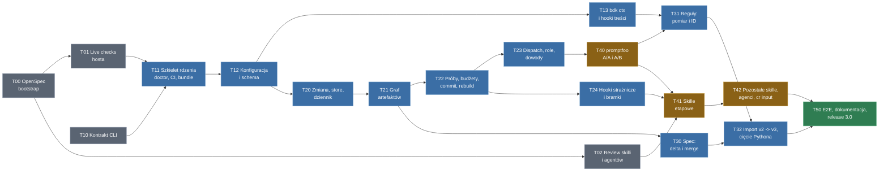

# BDK v3 - plan wdrożenia (taski)

**Źródła**: `.bdk/design/2026-09-23-0703-bdk-v3-change-centric-design.md` (design, verifier PASS iteracja 3, 2026-09-24) i `.bdk/design/2026-09-23-0703-bdk-v3-decisions.md` (rejestr decyzji D1-D5, S1-S8, Q1-Q5, K1-K4, A-*, R-*, T1-T6, P1-P11).
**Data**: 2026-09-24
**Status**: szkic planu, do prowadzenia w OpenSpec

## Jak czytać ten dokument

- Ten plik jest **mapą drogową i indeksem tasków**, nie specyfikacją. Każdy task poniżej dostaje **własny spec w OpenSpec** (`openspec/changes/<id>/` z `proposal.md`, `specs/`, `design.md`, `tasks.md`), pisany przed jego startem. Tu nie podejmujemy decyzji; sekcja "Do rozstrzygnięcia w specu" przy każdym tasku wylicza, co spec musi domknąć.
- Taski wykonuje AI, więc są **duże** - jeden task to spójny moduł rdzenia albo spójna grupa skilli, nie pojedynczy plik. Granica tasku biegnie tam, gdzie zmienia się kontrakt między komponentami (CLI, katalog Zmiany, hook, skill), bo tam spec ma co opisać.
- Kolumna **Wejście** wskazuje sekcje designu i ID decyzji, które spec ma przenieść; kolumna **Sygnał odbioru** to scenariusze z sekcji "Testing Strategy" designu, które muszą przejść, żeby task był zamknięty.
- Kolejność faz jest zależnościowa, nie czasowa. Taski w jednej fazie bez strzałki między nimi mogą iść równolegle (osobne Zmiany OpenSpec, osobne gałęzie).

## Prowadzenie projektu w OpenSpec

Konwencja (do potwierdzenia w T00):

| Element planu | Odpowiednik w OpenSpec |
|---|---|
| Ten dokument | `docs/V3-IMPLEMENTATION-PLAN.md`, linkowany z `openspec/config.yaml` jako kontekst projektu |
| Jeden task `Tnn` | jedna Zmiana `openspec/changes/v3-Tnn-<slug>/` |
| Kolumna "Wejście" | `proposal.md` (dlaczego i co) plus `design.md` (jak), z cytatami sekcji designu v3 |
| Kolumna "Sygnał odbioru" | `specs/<capability>/spec.md` jako `Requirement` / `#### Scenario:` WHEN / THEN |
| Podział pracy w tasku | `tasks.md` (`## sekcja`, `- [ ] N.M`) - pisany przez AI w `/opsx:propose` lub `/opsx:ff`, nie tu |
| Zamknięcie tasku | `/opsx:verify` potem `/opsx:archive`; żywy spec BDK rośnie w `openspec/specs/` |

Uwaga na styk: BDK v3 sam wprowadza żywy spec w formacie OpenSpec pod `.bdk/specs/` (D2). Do czasu cięcia v2 -> v3 projekt BDK jest prowadzony narzędziem OpenSpec (`openspec/`), a po T50 spec BDK może zostać zmigrowany do własnego mechanizmu (`bdk import` albo ręcznie). Czy i kiedy - to decyzja spoza tego planu, zapisana w T50 jako pytanie.

## Graf zależności

Kolory: szary = przygotowanie bez kodu rdzenia; niebieski = rdzeń i dane; bursztynowy = warstwa skilli, zależna od wyniku A/B (ryzyko z rejestru: fallback do podejścia B z tym samym rdzeniem); zielony = zamknięcie.

---

## Faza 0 - Przygotowanie

### T00 Bootstrap OpenSpec w repozytorium BDK

**Cel**: repo BDK prowadzone w OpenSpec; ten plan jest indeksem Zmian.

**Zakres**:
- `openspec init` w repo, `openspec/config.yaml` z kontekstem (link do tego planu, do designu v3 i rejestru decyzji).
- Konwencja nazw Zmian `v3-Tnn-<slug>`, szablon `proposal.md` odsyłający do sekcji designu i ID decyzji.
- Rozstrzygnięcie, gdzie żyją dokumenty designu v3 na czas wdrożenia (dziś nieśledzone przez `/.bdk/` w `.gitignore`, decyzja V-tracking): kopia do `openspec/changes/` albo `docs/`, albo pozostawienie.
- Wpis w `CLAUDE.md` / `CONTRIBUTING.md`: jak startować task z tego planu (`/opsx:propose` z ID tasku).

**Wejście**: sekcja "Prowadzenie projektu w OpenSpec" powyżej; D2 (format OpenSpec jako docelowy format specu BDK); V-tracking.

**Sygnał odbioru**: `openspec validate` przechodzi na pustym drzewie Zmian; pierwsza Zmiana (`v3-T01-...`) utworzona przez `/opsx:propose` linkuje ten dokument.

**Do rozstrzygnięcia w specu**: schemat OpenSpec dla tasków rdzenia (domyślny spec-driven czy tdd); czy design v3 wchodzi do gita teraz; czy `openspec/specs/` po v3 zostaje, czy migruje do `.bdk/specs/`.

**Zależności**: brak.

### T01 Live checks hosta i nagrane payloady hooków

**Cel**: fakty o Claude Code, od których zależy T1-T3, sprawdzone na żywo **przed** szkieletem rdzenia; payloady hooków nagrane jako fikstury do E2E.

**Zakres** (lista "Live checks" z "What We Did NOT Decide" i rejestru):
- `UserPromptExpansion`: skill pluginu BDK przychodzi jako `command_name: plan`, `command_source: plugin`; kształt `prompt`, `command_args`; czy `disable-model-invocation: true` blokuje też wywołanie przez narzędzie `Skill`.
- `PreToolUse`: czy komendy `!` użytkownika (bash mode) przechodzą przez hook; czy subagenci pluginu w tle dostają `agent_id` jak w foreground; kształt `tool_input` dla `Bash`, `Edit`, `Write`, `MultiEdit`, `NotebookEdit`.
- `SessionEnd`: czy odpala się przy zabiciu sesji i przy `/clear`; payload.
- `allowed-tools`: czy reguła `Bash(node ${CLAUDE_PLUGIN_ROOT}/dist/bdk.mjs *)` pre-approvuje złożoną formę `node ... || echo ...` (V2-4).
- `disallowed-tools` w skillu: potwierdzenie, że kasuje się na następnej wiadomości użytkownika (P9).
- `node:sqlite`: minimalna wersja Node bez flagi, status stabilności; wersja Node u użytkownika (nvm).
- Każdy pomiar zapisany jako nagrany JSON payload w katalogu fikstur (np. `tests/fixtures/host-payloads/`), z wersją Claude Code w nazwie.

**Wejście**: "Existing Codebase Context" akapit "Host facts verified"; NFR wiersz "Host"; ryzyko "Host hook semantics move under us"; T1-T3.

**Sygnał odbioru**: dokument `docs/HOST-FACTS.md` z tabelą fakt / wynik / wersja hosta / fikstura; każda pozycja z listy ma wynik TAK / NIE / NIE DOTYCZY; przy NIE dla `UserPromptExpansion` opisany fallback `bdk stage enter` do ujęcia w T10 i T24.

**Do rozstrzygnięcia w specu**: sposób nagrywania (skrypt hooka zapisujący stdin do pliku); czy fikstury trzymamy w `tests/` czy `openspec/`.

**Zależności**: T00 (formalnie); merytorycznie żadne.

### T02 Review inwentarza skilli, meta-skilli i agentów

**Cel**: świadoma dyspozycja dla każdego z dzisiejszych 19 skilli użytkownika, 13 meta-skilli i 13 agentów: **zostaje / łączy się / redesign / znika**. Inwentarz z designu (15 skilli, 5 meta per klasa roli, 13 agentów) jest oznaczony jako PoC / TODO, więc ten task go weryfikuje, nie przyjmuje.

**Zakres**:
- Dla każdego skilla: rozmiar (dziś 8-661 linii, S1 = 200), co robi naprawdę, które kroki to "proces" do przeniesienia do grafu / rdzenia, które to "wiedza domenowa" do zostawienia w skillu, jakie ma `!` bloki, hooki we frontmatterze, `allowed-tools`.
- Kandydaci do łączenia z designu: `create-plan` + `verify-plan` -> `plan`; `add-rule` + `refine-rules` -> `rules`; `design` + `create-adr` (export decyzji); rename `test-driven-development` -> `tdd`, `update-docs` -> `docs`. Dla każdego: za / przeciw / rekomendacja.
- Meta-skille `bdk-tier-*`, `bdk-rules-*`, `bdk-lint-tools`, `bdk-test-tools`, `bdk-implementer-return-contract` -> 5 `bdk-role-<klasa>` (worker / reader / reviewer / verifier / runner): mapowanie agent -> klasa, co każdy agent traci lub zyskuje.
- Agenci: `tools:` bez zmian (T2), ale kontrakt wejścia / wyjścia się zmienia (ścieżka pakietu, envelope, blok `bdk-entries`); wskazać, które agenty mają dziś zapisy niezgodne z P3 (wypowiedzi o zgodzie) i T3 (brak zakazu destrukcyjnego gita).
- `cr` i `pr-review`: poza zakresem redesignu (decyzja użytkownika), ale spisać, jak mają przyjąć pakiet dispatchu jako wejście.
- Wybór skilla (lub dwóch) do A/B "cienki vs długi" w T40 - rekomendacja, którym mierzymy.
- Dev-time `.claude/skills/skill-lint`, `agent-lint`: co z nich staje się testem treści CI (A3).

**Wejście**: "Skill inventory (PoC / TODO)", "Users & Personas", "TSH revision grounding", `README.md` sekcja Skills i Agents, `STARTUP_INSTRUCTIONS.md`.

**Sygnał odbioru**: `docs/V3-SKILL-INVENTORY.md` z tabelą: skill / linie dziś / dyspozycja / uzasadnienie / task docelowy (T41 lub T42); to samo dla agentów i meta-skilli; lista otwartych decyzji dla użytkownika, każda z rekomendacją.

**Do rozstrzygnięcia w specu**: to task recenzyjny, spec opisuje format wyników i kryteria (np. "proces vs wiedza"). Decyzje o losie skilli podejmuje użytkownik na wyniku tasku; T41 / T42 dostają je jako wejście.

**Zależności**: T00.

### T10 Kontrakt CLI rdzenia (dokument pierwszej klasy)

**Cel**: pełny kontrakt `node ${CLAUDE_PLUGIN_ROOT}/dist/bdk.mjs <args>` zanim powstanie kod; design nazywa go "pierwszym artefaktem planu".

**Zakres**:
- Wszystkie grupy komend z designu: `change`, graf (`next`, `explain`, `validate`, `done`), `part`, `attempt`, `log` (w tym `ingest`), `dispatch`, `evidence`, `spec`, `config`, `ctx`, `rules`, `query`, `commit`, `hooks`, serwisowe (`doctor`, `rebuild`, `import`, `version`).
- Dla każdej komendy: argumenty, `--json` kształt wyjścia (JSON Schema), exit code (0 ok, 2 refusal, 3 input error, 4 corrupted state, 5 missing runtime), kształt odmowy (`refused`, `rule`, `why`, `instead[]`), limity (<= 100 linii, `--for`, `--all`).
- Dwa tryby wyjścia: **inject** (`ctx`, `next`: zawsze exit 0, błędy jako blok "BDK STOP") i **command**; jedna dopuszczalna forma wrappera `!` z gałęzią `|| echo "BDK STOP..."` oraz forma `|| exit 2` dla hooków strażniczych.
- Podział komend: orkiestrator-only (`commit`, `attempt`, `part`, `change`, `log ingest`, `spec merge`, `hooks`) vs dostępne subagentom (`log add`, `log show`, `dispatch show`, `evidence record`, `ctx`).
- Jawnie: brak `approve`, brak `gate pass`; `source: user` wyłącznie ze ścieżki `hooks prompt-expansion`. Jeśli T01 wykaże brak `UserPromptExpansion` dla skilli pluginu, kontrakt dostaje `stage enter` jako jedyny zapisujący `!`.
- Format tego dokumentu tak, by testy kontraktu w T11 mogły go czytać maszynowo (np. schematy wyjścia obok prozy).

**Wejście**: "CLI contract (outline)", "Key boundaries", "UX Touchpoints - Failure surface", założenia wejściowe do 2A ("kontrakt CLI dokumentem pierwszej klasy"), Q3, T1-T3.

**Sygnał odbioru**: `docs/CLI-CONTRACT.md` (lub katalog) pokrywa każdą komendę z designu; każdy przykład odmowy ma cztery pola; recenzja krzyżowa: każda komenda wołana w sekcjach designu (diagram sekwencji, tabela hooków, inwentarz skilli) istnieje w kontrakcie.

**Do rozstrzygnięcia w specu**: składnia argumentów (`attempt close ok` vs `--outcome ok`), wersjonowanie kontraktu (`kernel-version` w pakiecie, P10), czy schematy wyjścia trzymamy w `schema/cli/`.

**Zależności**: T01 (wynik live checks wpływa na `hooks` i ewentualne `stage enter`).

---

## Faza 1 - Fundament rdzenia

### T11 Szkielet rdzenia Node / TypeScript, bundel, CI, `doctor`

**Cel**: działający rdzeń z komendami `version` i `doctor`, pełnym łańcuchem build / test / lint i CI, tak by każdy następny task dopisywał moduł, nie infrastrukturę.

**Zakres**:
- Struktura `kernel/` (nazwa do ustalenia) w TS, pnpm tylko dev, esbuild -> jeden ESM `dist/bdk.mjs` **commitowany** i pilnowany `git diff --exit-code` na CI; Biome; `node --test` dla unitów.
- Zależności runtime: tylko `node:` plus zbundlowane, przypięte zod i parser YAML; `pnpm audit` na CI (V1-8).
- Harness E2E: fikstura repozytorium (tworzona w `tmp`, z gitem), helper uruchamiający `bdk.mjs` i asertujący exit code / JSON; testy kontraktu czytające `docs/CLI-CONTRACT.md` z T10 (każda komenda ma handler albo jawny stub zwracający `refused`).
- `bdk version`; `bdk doctor`: wersja Node (min z T01), `uv` / `uvx` obecność, wykrycie układu v2 (`settings.json`, `.bdk/runs/`, `.bdk/plans/`) z instrukcją `bdk import` **jako treść**, nigdy exit != 0 w trybie inject.
- Wspólne moduły: obsługa błędów -> kształt odmowy; tryb inject vs command; `--json`; ograniczenie <= 100 linii.
- Aktualizacja ADR 0001 w git-identity (konsekwencja "bdk stays in Python" nieaktualna; reguła 9 dla bundla) - tekst amendmentu jako część tasku albo osobny PR w tamtym repo.
- Formalne ADR-y dla decyzji już podjętych (D5 runtime, A-podejście graf artefaktów, R-format YAML + Markdown, R-store Markdown + SQLite) przez `/bdk:create-adr` - tu, bo to pierwszy task, w którym te decyzje stają się kodem.

**Wejście**: D5, Q3, NFR "Runtime", "Security", ryzyko "SPOF: the kernel", "Testing and CI", "Next Steps".

**Sygnał odbioru**: CI zielone z krokami build, `git diff --exit-code dist/`, lint, unit, E2E; `bdk doctor` na fiksturze v2 drukuje instrukcję importu; `bdk doctor` bez `uv` drukuje dokładną komendę instalacji; wywołanie z Node poniżej minimum kończy się exit 5 z instrukcją.

**Do rozstrzygnięcia w specu**: minimalna wersja Node (na podstawie T01); layout katalogów rdzenia; polityka pinowania i kadencja aktualizacji zależności; czy CI to GitHub Actions obok istniejącego release-please.

**Zależności**: T10, T01.

### T12 Konfiguracja warstwowa, rejestr zod, JSON Schema, `prompts/`

**Cel**: `bdk config` jako jedyne źródło ustawień dla rdzenia i skilli; koniec `get_settings.py` i ręcznego `settings.schema.json`.

**Zakres**:
- Cztery warstwy: defaults w bundlu < `~/.config/bdk/settings.yaml` (XDG) < `.bdk/settings.yaml` < `.bdk/settings.local.yaml`; deep-merge, tablice łączone po `id`; pełne nadpisanie dozwolone (D4).
- Rejestr schematów per moduł (zod); nieznany klucz = błąd z nazwą klucza (S6); klucz bez konsumenta = błąd; zrzut rozwiązanej konfiguracji do `.machine/`; lista lokalnie nadpisanych kluczy (nazwy, bez wartości) do zapisu w Zmianie (D4b; sam zapis w Zmianie dochodzi w T20).
- `prompts/<key>.md` i `prompts.local/<key>.md` jako wartości Markdown z frontmatterem `mode: extends|replace`, `applies`.
- Eksport JSON Schema z rejestru zod do `schema/` na CI, `git diff --exit-code`; modeline `# yaml-language-server: $schema=<versioned raw URL>` dopisywany przez setup; kopia offline w `.machine/schema/`.
- Komendy: `config show | check | schema | set --global | --local`.
- Usunięcie `hooks/check-bdk-config/settings.schema.json` i `scripts/get_settings.py` (fizyczne kasowanie może poczekać do T32, ale nic nie może już ich czytać).

**Wejście**: "Configuration (A-warstwy, R-format, D4, B7-B10)", S6, R-format (warunek użytkownika: JSON Schema dla IDE), "What We Did NOT Decide" (Windows path dla XDG).

**Sygnał odbioru**: E2E "config layering with unknown key" (błąd nazywa klucz i warstwę); lokalne nadpisanie widoczne w zrzucie; `schema/*.json` zgodne z rejestrem (CI); IDE z yaml-language-server podpowiada klucze w `settings.yaml` fikstury (ręczne potwierdzenie raz).

**Do rozstrzygnięcia w specu**: pełna lista kluczy v3 (migracja z dzisiejszego `settings.json`: `features.*`, `tools.*`, `quality.*`, `languages`), ścieżka XDG na Windows, format wersjonowanego URL schematu, jak wygląda "klucz bez konsumenta" technicznie (rejestracja konsumentów).

**Zależności**: T11.

### T13 `bdk ctx` i hooki treści (zastąpienie skryptów Python injection)

**Cel**: jeden kompozytor kontekstu promptów zamiast `inject.py`, `inject-rules.py`, `inject-language-rules.py`, `render_startup.py`; STARTUP renderowany przez rdzeń.

**Zakres**:
- `ctx skill <name>`: fragmenty warunkowe i łańcuchy tool-tier (`exclusive` / `additive` z `if` / `prefer`, semantyka z `.claude/rules/fragment-system.md`), reguły jakości (na tym etapie po pliku; po ID od T31), reguły językowe z `languages`, wartości z `prompts/`.
- `ctx role <klasa>`: treść dla meta-skilli `bdk-role-*` (worker / reader / reviewer / verifier / runner); klasa w nazwie, bo skill nie wie, który agent go preloaduje.
- `ctx startup`: STARTUP_INSTRUCTIONS z rozwiązanymi łańcuchami oraz **tabelą agentów generowaną z frontmattera `agents/*.md`** (P11, zamyka dryf T6); test treści: tabela w repo bajt-w-bajt równa wyjściu.
- Hooki treści w `hooks.json`: `hooks session-start` (STARTUP, `config check`, detekcja układu v2, snapshot dryfu reguł, rejestracja repo w grafie - jeden proces zamiast czterech), `hooks stop` (dryf reguł), `hooks skill-exists <name>` (dla `commit`); wrapper `|| echo "BDK STOP..."` (zawsze exit 0). Linie `uvx` bez zmian.
- Test treści A3: każdy `!` blok w `skills/` woła tylko `ctx` lub `next` w dokładnej formie wrappera; `allowed-tools` niesie regułę `Bash(node ${CLAUDE_PLUGIN_ROOT}/dist/bdk.mjs *)` (forma potwierdzona w T01).
- Migracja istniejących `fragments/` i `rules/` do formatu czytanego przez `ctx` bez zmiany treści (zmiana treści reguł = T31).

**Wejście**: "Configuration" (akapit o `ctx`), "Hooks (V1-1, V1-2)", P11, T6, `docs/INJECTION-FLOWS.md`, `.claude/rules/fragment-system.md`, ryzyko "SPOF" (skille bezstanowe tracą tier guidance, widoczny BDK STOP).

**Sygnał odbioru**: E2E "`!`-block error rendering" (brak Node -> linia BDK STOP w treści skilla, exit 0); `ctx skill debug` na fiksturze z `features.code-review-graph` daje tier graph, bez flag daje fallback; `ctx startup` zawiera `bdk:design-verifier`; `hooks.json` bez `python3` dla SessionStart i Stop.

**Do rozstrzygnięcia w specu**: czy `fragments/` zostają plikami czy wchodzą do `prompts/` defaults w bundlu; los `check-rules-drift` (snapshot w `.machine/`); format frontmattera agentów wymagany do generowania tabeli.

**Zależności**: T12.

---

## Faza 2 - Zmiana, dziennik, graf, próby

### T20 Katalog Zmiany, moduł `store`, dziennik, ID, profil

**Cel**: Zmiana jako trwały obiekt na dysku z dziennikiem append-only, jedynym punktem dostępu `store` i odbudowywalnym indeksem.

**Zakres**:
- Układ `.bdk/changes/<id>/` z designu (`change.md`, `log/`, `design.md`, `plan/`, `spec-delta/`, `attempts/`, `evidence/`, `dispatch/`, `reports/`, `archive/`); `.machine/` gitignorowane; **naprawa `ensure_ignored()`**: `/.bdk/.machine/` i `/.bdk/settings.local.yaml` zamiast `/.bdk/`.
- Moduł `store` (R-store): Markdown prawdą, indeks SQLite (`node:sqlite`) w `.machine/` odbudowywany leniwie; świeżość = `stat` katalogów `log/` i `attempts/` plus liczba plików, pełny rehash tylko po zmianie (V1-9); busy timeout; fallback indeks JSON jako furtka, jeśli `node:sqlite` niedostępny (decyzja z T01 / T11).
- Dziennik (K1-K4): plik per wpis, frontmatter `id`, `type` (9 typów + `transition`), `summary` <= 120, `status`, `source`, `author`, `at`, `refs` >= 1, `supersedes`, `review`; walidator na `log add`; dedup po kluczu; limit `observation` per dispatch (limit egzekwowany w T23, tu pole); P1: `id`, `at`, `author`, `source` stemplowane przez rdzeń, nigdy z argumentów; `source: user` nieosiągalne z `log add`.
- Alokacja ID `L-nnnn` per Zmiana: maksimum z commitowanych plików + markery `mkdir .bdk/.machine/ids/<changeId>/L-nnnn` (V1-6, V2-3); referencje między Zmianami `<changeId>/L-0042`.
- Komendy: `change new "<intent>" | status | list | resume | park`, `log add | list | show | resolve`, `query` (read-only SQL). `change takeover`, `change close`, `log route`, `log ingest` dochodzą w T22 / T30 / T50.
- Rozwiązywanie aktywnej Zmiany z bieżącej gałęzi (jedna aktywna Zmiana per gałąź).
- Profil (R-profil, S7): `change new` mierzy (heurystyka do kalibracji), proponuje `tiny | small | large`, zapisuje jako wpis `assumption`; `--profile` nadpisuje; zmiana w trakcie tylko w górę.
- Zapis listy nadpisanych kluczy (D4b) do Zmiany przy starcie.
- Telemetria czasu `log list` w `.machine/` od pierwszego dnia.

**Wejście**: "Change directory", "Ledger entry", R-store, K1-K4, V1-6, V1-9, V2-3, P1, R-profil, D4b, NFR "Scale" i "Latency", ryzyko "Bottleneck: ledger index".

**Sygnał odbioru**: E2E: 15 równoległych `log add` bez kolizji ID; świeży klon startuje od commitowanego maksimum; `log list` < 200 ms przy 1 000 wpisów; `log add` z `--source user` odrzucone (exit 3); `change status` <= 100 linii; skasowany indeks odbudowany bez utraty danych; `.gitignore` fikstury zawiera dokładnie dwie ścieżki `.bdk`.

**Do rozstrzygnięcia w specu**: heurystyka profilu i progi (pliki z intencji, impact z grafu kodu, moduły); klucz dedupu per typ wpisu; format `change.md`; czy `query` ma białą listę tabel; schemat indeksu.

**Zależności**: T12.

### T21 Silnik grafu artefaktów (`pipeline.yaml`, rodzaje w TS, `next`, `explain`, bramka)

**Cel**: proces Zmiany jako dane; rdzeń liczy ready / blocked / done i podaje skillowi następny artefakt z instrukcją; skille nie znają kolejności etapów.

**Zakres**:
- `pipeline.yaml` w bundlu plus `policy` projektu (część `settings.yaml`), walidacja zod; **żadnych wyrażeń poza `if: features.X`**, brak pętli i referencji poza katalog Zmiany; test treści odrzuca nieznane klucze.
- Rodzaje artefaktów w TS z walidatorami: `intent`, `design`, `plan-part`, `plan-verify`, `gate`, `execute-part`, `post-task-step`, `review`, `spec-delta`, `close`; `done` tylko po walidatorze (schema, niepustość, hash wejść) - obrona przed ryzykiem OpenSpec `existsSync`.
- P2: każdy walidator zapisuje sha256 wejść; werdykt dla innego hasha = `stale`, węzeł nie jest `done`.
- Rodzaj `gate` (T1, S8): `done` gdy w dzienniku jest wpis `transition` ze `source: user` dla tej bramki, **nowszy niż ostatnie przejście węzła w stan ready** (loop-back unieważnia wcześniejsze); bramka sprawdza pochodzenie i gotowość, nigdy treść; brak hashy, brak `approvals/`. Sam zapis wpisu robi hook w T24; tu rdzeń tylko go uznaje.
- Profile `tiny | small | large` jako warianty grafu (co pomijają).
- Komendy: `next` (artefakt + instrukcja + status bramki z listą `review: true`), `explain <artifact>` (łańcuch `requires`, obowiązkowy od pierwszego wydania), `validate`, `done`; `change status` rozszerzone o graf.
- Instruction builder: szablon + reguły + kontekst przez `ctx`.
- Rozszerzalność: test dowodzący, że nowy rodzaj (fałszywy, testowy) to klasa TS + węzeł YAML, bez zmian w skillach (obietnica podejścia A; wykorzystane ponownie w T23 dla prymitywów dowodów).

**Wejście**: "Approach A", "Selected Approach", A-podejście, A-drabina (tylko stany), D3, S7, P2, ryzyka "pipeline.yaml grows conditions" i "process documentation moves into a graph".

**Sygnał odbioru**: E2E: nowa Zmiana `small` -> `next` zwraca `design`; po zapisaniu designu i wpisie `transition source: user` (wstawionym fiksturą) `next` zwraca `plan`; wpis `log add` udający zgodę nie otwiera bramki; ponowne otwarcie bramki po loop-backu wymaga nowszego wpisu; `explain plan-verify` drukuje łańcuch; YAML z `when:` odrzucony przez test treści; profil `tiny` nie ma węzła `design`.

**Do rozstrzygnięcia w specu**: dokładny schemat `pipeline.yaml` i `policy`; jakie pola są per węzeł (budżety, `if`, profil); format instrukcji zwracanej przez `next`; co dokładnie liczy się jako "wejścia" hasha per rodzaj.

**Zależności**: T20.

### T22 Próby, budżety, drabina eskalacji, części planu, `commit`, `rebuild`, checkpoint

**Cel**: każda pętla ma budżet w stanie, wyczerpanie jest zdefiniowanym stanem, postęp odtwarzalny z gita (S2, S5).

**Zakres**:
- `attempt open <loop> <target>` -> bilet `A-nnnn` (alokacja jak `L-nnnn`) albo odmowa (budżet / oscylacja); `attempt close ok | fail | not-run`; `attempt list`; rekordy append-only w `changes/<id>/attempts/<loop>-<target>.md` (commitowane, V1-4).
- Budżety per rodzaj pętli w policy: re-dispatch tasku, verify-fix per część, review-fix per Zmiana, iteracje weryfikatora (domyślnie 2), kolejne `not-run`.
- `not-run` (P4): nie zużywa budżetu pętli, własny budżet, po wyczerpaniu prosto do `Question`.
- Odciski findingów `(type, file, symbol, normalised problem)`; ta sama para dwa razy po fixie = oscylacja, skraca drabinę; próg w policy.
- Drabina A-drabina: zwężony zakres (`full -> high+ -> blockers`, N+1 podzbiorem N, to co wypada staje się `finding`) -> eskalacja (świeży kontekst, mocniejszy model, 1x, wyłączalne) -> `question` na bramkę -> `parked` z opcjami i jedną komendą wznowienia (`change resume`).
- Części planu (P6, S1): `part list | start | done | split`; walidatory: <= 8 KB, <= 8 tasków, pola `goal`, `success-measure`, `do-not-touch`, opcjonalny `stop-rule` w tasku; `do-not-touch` przecinające `Files:` = błąd; placeholdery w polach wykonywalnych = błąd; `Depends on` między częściami; `spec-impact: none` albo delta wymagana (walidacja treści delty w T30).
- `commit <task>`: staguje kod i katalog Zmiany, trailery `BDK-Change` / `BDK-Part` / `BDK-Task`, porównuje realny diff z `Files:` i `do-not-touch` (zakazana ścieżka: odmowa; plik spoza `Files:`: `finding`); ten sam check przy `attempt close`. `part done`: każdy task ma commit z trailerem.
- `log ingest --ticket <A-nnnn>` (T2): blok `bdk-entries` YAML, walidacja jak `log add`, pochodzenie z biletu, odmowa całości ze wskazaniem linii; licznik wpisów na bilecie; `attempt close` odmawia, gdy envelope deklaruje wpisy, których nie ma.
- `rebuild`: postęp z trailerów + próby z commitowanych plików; obowiązkowa ścieżka naprawy przy exit 4.
- `change checkpoint`: `git commit --only -- .bdk/changes/<id>/` jako `chore(bdk): checkpoint <change>`; pomijany przy rebase / merge / cherry-pick i przy otwartych biletach; wołany przy park / eskalacji; hook `session-end` woła go w T24; włączony domyślnie, wyłączalny w policy.
- `change takeover` (przejęcie runu po martwej sesji, dzisiejsze `--force`).

**Wejście**: "Loop protection (A-drabina)", "Attempt durability (V1-4)", "Plan part fields and plan-quality rules (P6, P7)", P4, T2 (`log ingest`), S1, S2, S5, "Key boundaries" (IDs, working tree), `scripts/bdk_run_state.py` jako zalążek (manifest-as-cache, trailers-as-truth, Refusal, `deferred_findings`, `reconcile`).

**Sygnał odbioru**: E2E: wyczerpanie budżetu -> `parked` z wpisem `question` i opcjami; oscylacja na fiksturze skraca drabinę; `attempt close not-run` x3 zostawia budżet pętli i tworzy `question`; diff dotykający `do-not-touch` odrzucony przy `attempt close`; zabita sesja + `rebuild` odtwarza postęp i próby; checkpoint nie zamiata plików stagowanych przez użytkownika; część 9 KB odrzucona z odmową; blok `bdk-entries` z błędnym typem odrzucony z numerem linii.

**Do rozstrzygnięcia w specu**: model eskalacji i limit kosztu per Zmiana (otwarte w designie); dokładna normalizacja "problem" w odcisku; domyślne wartości budżetów; squash checkpointów przy `close` (otwarte); format pliku części planu (dzisiejszy szablon `create-plan` jako punkt wyjścia); czy `takeover` zostaje osobną komendą.

**Zależności**: T21.

### T23 Pakiety dispatchu, kontrakty ról, envelope, prymitywy dowodów

**Cel**: komunikacja orkiestrator <-> subagent wyłącznie plikami: pakiet wchodzi, envelope wychodzi; dowody weryfikacji mają świeżość i cytowania.

**Zakres**:
- `dispatch build <task> <role> <ticket>`: pakiet `changes/<id>/dispatch/<task>-<role>-<n>.md`; frontmatter `ticket`, `task`, `role`, `attempt n/N`, `scope`, `kernel-version`, `template-hash` (P10); sekcje: streszczenie intencji, pełny tekst tasku z `do-not-touch` i `stop-rule`, pełne `decision(accepted)` i `blocker`, streszczenia `finding` / `observation` / `assumption` po `refs`, wycinek reguł po ID dla roli (po pliku do T31), kontrakt zwrotu; odmowa > 12 KB; odmowa przy placeholderach; brak otwartego biletu = brak pakietu. `dispatch show`.
- Klasy ról i kontrakty: worker (implementer, fixer), reader (explorer, log-analyzer, dead-code, duplicate, web-researcher), reviewer (code-reviewer, architecture-reviewer), verifier (plan-verifier, design-verifier), runner (static-analyse, test-runner). Kanał zapisu wg klasy (T2): worker / runner `log add`; reader / reviewer / verifier blok `bdk-entries` na końcu raportu. P3: verifier i reviewer nie wypowiadają się o zgodzie ani przejściu dalej. T3: jedno zdanie zakazu destrukcyjnego gita w kontrakcie workera z powodem.
- Envelope <= 15 linii: `status`, `ticket`, `files`, `log ids`, `report path` (ewolucja dzisiejszego `return-contract.md` o `ticket` i `log`); raport pełny w `changes/<id>/reports/`.
- Zamknięta lista kategorii blokujących dla verifierów (P8, sześć domyślnych) i jawna lista "to nie jest FAIL"; kategorie w policy; rdzeń degraduje bloker bez kategorii do `observation` + `review: true` z oryginalnym tekstem w ciele.
- Prymitywy dowodów (T4, P5): `evidence record` (manifest: rodzaj, hash drzewa, lista plików z hashami, cytowania; binaria w `.machine/evidence/`), `evidence check` (dowód starszy niż ostatnia zmiana kodu = odrzucony); walidator cytowań (PASS musi wskazać wartości istniejące w dowodzie: JSON pointer albo linia snapshotu); fałszywy rodzaj artefaktu w E2E ćwiczący manifest, `not-run` i cytowania razem. Nic specyficznego dla UI (`ui-verify` = osobna Zmiana po v3).
- Post-task steps jako węzły grafu (`tests-scoped`, `lint`, `simplify`) - kolejność w YAML, nie w skillu.
- Treść 5 meta-skilli `bdk-role-*` (po jednej linii `!` wołającej `ctx role <klasa>`); podpięcie do agentów przez `skills:` (samą zmianę agentów robi T42, tu istnieją i działają).
- Archiwizacja przy `close` (V1-9): `dispatch/` i `reports/` przycięte do indeksu hashy, o ile nie `archive.keep-evidence`.

**Wejście**: "Dispatch package (K3, K4)", "Verifier contracts (P8)", "Verification evidence primitives (T4, P4, P5)", T2, P3, P10, K2, `skills/subagent-execute-plan/references/return-contract.md`, ryzyka "Reader entries relayed" i "Primitives without a consumer".

**Sygnał odbioru**: E2E: pakiet 13 KB odrzucony; pakiet z `TODO` w polu wykonywalnym odrzucony; bloker verifiera bez kategorii z listy staje się `observation review: true`; manifest starszy niż hash drzewa odrzucony; PASS bez cytowań odrzucony; werdykt dla starszego hasha części = `stale`, `plan-verify` nie `done`; fałszywy rodzaj przechodzi manifest + `not-run` + cytowania; `dispatch build` bez biletu odrzucony.

**Do rozstrzygnięcia w specu**: dokładny szablon pakietu per rola; normalizacja `template-hash`; format cytowań per rodzaj dowodu; czy limit `observation` per dispatch jest w policy; forma bloku `bdk-entries` (klucze, escaping).

**Zależności**: T22.

### T24 Hooki strażnicze i bramki (`PreToolUse`, `UserPromptExpansion`, `SessionEnd`)

**Cel**: gwarancje T1 i T3 w kodzie, nie w prozie; prefiltr w shellu, rdzeń fail-closed.

**Zakres**:
- `hooks.json` v3: `PreToolUse` z matcherem `Edit|Write|MultiEdit|NotebookEdit|Bash` i **prefiltrem shell per narzędzie** (Bash: `agent_id` obecne i tekst zawiera `git` lub `bdk.mjs`, albo dowolny wątek i tekst zawiera `.bdk/specs` lub `bdk.mjs hooks`; narzędzia edycji: `file_path` pod `.bdk/specs/`); reszta wraca bez startu Node (< 5 ms). Guardy z `|| exit 2` (fail-closed).
- `hooks pre-tool`: strażnik specu (V1-7); strażnik gita dla subagentów: `stash`, `reset`, `clean`, `checkout -- <path>`, `checkout .`, `restore`, `switch --discard-changes`, `commit`, `add`, `merge`, `rebase`, `cherry-pick`, `push`; strażnik komend orkiestratora dla subagentów (`bdk.mjs commit|attempt|part|change|log ingest|spec merge|hooks`); deny `bdk.mjs hooks` z Basha w każdym wątku; powód deny nazywa dopasowany verb i każe zwrócić `blocked`. Wątek główny nietknięty.
- `UserPromptExpansion` z matcherem `plan|execute|close`: `hooks prompt-expansion` rozwiązuje Zmianę z gałęzi, woła `next`; bramka gotowa -> wpis `transition source: user` (zegar rdzenia, `session_id`, treść komendy, `refs` = węzeł bramki i artefakty, flaga `--skip-verify` dla `execute`, P2); bramka niegotowa -> block "gate not ready: <co brakuje>"; bramka już przeszła -> pass bez wpisu (S5); bramki brak w profilu -> pass ze zwykłym wpisem etapu; brak aktywnej Zmiany -> block z podpowiedzią; brak rdzenia -> block "kernel unavailable". Stdout jako kontekst dla modelu (status bramki).
- Jeśli T01 wykazał brak `UserPromptExpansion` dla skilli pluginu: fallback `stage enter` z `!` bloku skilla + deny `bdk.mjs stage` z narzędzi; wyjątek w teście treści.
- `SessionEnd`: `hooks session-end` -> `change checkpoint`.
- Cele p95 (NFR "Latency"): prefiltr < 5 ms, `pre-tool` z rdzeniem < 150 ms, `prompt-expansion` < 150 ms - mierzone w E2E.
- E2E na **nagranych payloadach** z T01; nieznany kształt payloadu = "no transition" (fail-closed).
- Frontmatter skilli etapowych (`disable-model-invocation: true`, `disallowed-tools`) opisany tu jako wymaganie, wprowadzony w T41.

**Wejście**: "Hooks (V1-1, V1-2)" tabela, "Key boundaries" (human gate provenance, working tree guard, prefilter and failure mode), T1, T3, P2, P9, S8, NFR "Latency" i "Security", ryzyka "Host hook semantics", "Guard latency and false positives", "Gate binds to time, not content".

**Sygnał odbioru**: E2E (scenariusze TSH z "Testing Strategy"): payload wpisanej komendy tworzy wpis `source: user` i bramka jest `done`; payload bez markera użytkownika nie tworzy wpisu; `/bdk:plan` przy niegotowym designie zablokowane z powodem, bez wpisu; subagent `git stash` deny, wątek główny ten sam tekst pass; subagent `bdk.mjs commit` deny; rdzeń usunięty: subagent `git commit` -> exit 2, wątek główny `bdk.mjs hooks` -> exit 2, wątek główny `git status` -> pass bez startu Node; `Edit` pod `.bdk/specs/` deny; pomiar p95 poniżej progów na fiksturze 750 wywołań.

**Do rozstrzygnięcia w specu**: dokładny regex strażnika gita (fałszywe pozytywy: `git reset` w stringu commit message); czy `ask` w wątku głównym pozostaje "gotowym rozszerzeniem" (tak wg designu); treść komunikatów block / deny; jak hook rozpoznaje `--skip-verify` w `command_args`.

**Zależności**: T22, T01.

---

## Faza 3 - Spec, reguły, migracja

### T30 Żywy spec: delta, walidacja semantyki, deterministyczny merge

**Cel**: spec zachowania w formacie OpenSpec pod `.bdk/specs/`, pisany wyłącznie przez rdzeń przy `close`.

**Zakres**:
- Format: `Requirement` SHALL + `#### Scenario:` WHEN / THEN; delta w `changes/<id>/spec-delta/<capability>.md` z sekcjami ADDED / MODIFIED / REMOVED.
- `spec delta check`: dokładny prefiks `Scenario:`, WHEN / THEN obecne, utrata scenariuszy = ERROR, słowo normatywne konfigurowalne; każda część planu deklaruje deltę lub `spec-impact: none` (walidator części z T22 woła ten check).
- `spec merge` przy `close`: deterministyczny, przez `node:fs` (strukturalnie poza hookiem); konflikt = odmowa z obiema deltami, model konsultowany tylko wtedy, `close` zablokowane do rozwiązania; `bdk-merge-hash` we frontmatterze każdego pliku specu; `doctor` i `close` odmawiają przy różnicy hasha (wykrycie ręcznej edycji, best effort dla obejścia przez Bash).
- `spec diff`.
- Rodzaj `spec-delta` w grafie (T21) dostaje walidator z tego tasku.

**Wejście**: "Spec handling (D2, D2a, D2b, C1-C3)", D2, D2a, raport C1-C3, V1-7, ryzyko "Spec merge conflicts", ryzyko "Behaviour-only spec leaves patterns to rules".

**Sygnał odbioru**: E2E: delta bez WHEN odrzucona; delta usuwająca scenariusz bez REMOVED = ERROR; dwie Zmiany edytujące tę samą capability -> merge odmawia i pokazuje obie; ręczna edycja `spec.md` po merge -> `doctor` zgłasza; merge jest idempotentny (dwa razy = ten sam plik).

**Do rozstrzygnięcia w specu**: algorytm merge (po nazwie Requirement, po kolejności?), obsługa MODIFIED, format `bdk-merge-hash`, czy spec BDK samego (z `openspec/specs/`) migruje tym mechanizmem (patrz T00 / T50).

**Zależności**: T21 (rodzaj `spec-delta`), T22 (walidacja części).

### T31 Reguły: pomiar no-op i ablacja, ID `[PREFIX-n]`, `rules check`, reguły planu `PL`

**Cel**: reguły z trwałymi ID sprawdzane po ID przez verifier i reviewer (S4), ale dopiero po pomiarze, które z 162 bulletów w ogóle wnoszą wiedzę (T5).

**Zakres**:
- Pomiar 1: test no-op wiedzy na `rules/*.md` i `rules/languages/*.md` - claims wyodrębnione, Haiku i Sonnet na ślepo, fakty zweryfikowane, jeden sędzia; wynik COVERED / MISSED / WRONG per bullet.
- Pomiar 2: ablacja zadaniowa w promptfoo (harness z T40): fikstura diffów z zasianymi naruszeniami, review z plikiem reguł i bez, podłoga szumu A/A.
- Reguła COVERED w obu pomiarach usuwana **przed** nadaniem numeru (bez nagrobka). Pozostałe: `kind: house | knowledge`; `knowledge` z faktem lub wersją wymaga `source` i `verified: <data>`.
- ID `[PREFIX-n]` z prefiksem z pliku (`CQ`, `ARCH`, `DP`, `SEC`, `TQ`, `EJ`, `PL`, języki własne), numer nadany raz, nigdy nieużywany ponownie; usunięta reguła zostaje jako `[CQ-4] (removed: reason)`.
- `rules check` (unikalność, format, `source` / `verified` dla `knowledge`, duplikaty po równoległym `close`), `rules show <ID>`; `.bdk/rules/*.md` projektu z frontmatterem `id` / `mode`; przydział numerów projektu przy `close` przez właściciela Zmiany.
- `rules/plan.md` z prefiksem `PL` (P7): DoD tylko warunki sprawdzalne w review, brak placeholderów, każda część ma `success-measure`.
- `ctx` (T13) i `dispatch build` (T23) przechodzą na wycinki po ID i per rola; plan-verifier tick-lista ID; findingi reviewera cytują ID; `learning` proponuje nowe.
- Procedura pomiaru jako obowiązkowa dla każdego nowego pliku `rules/languages/` (dokument + test treści na `kind`).
- Dzisiejsze `.claude/rules/quality-rules.md` (konwencja autorska) zaktualizowane do formatu z ID.

**Wejście**: "Rules with IDs (R-rule-id, S4)" wraz z "Measure before numbering (T5)", P7, D2a (reguły muszą móc być konkretne dla systemu), ryzyko "Measurement delays the rule migration", `rules/` (9 plików, 162 bullety).

**Sygnał odbioru**: raport pomiaru w `docs/` z tabelą per bullet i decyzją; `rules check` zielone na CI; test treści: `rules/plan.md` istnieje z `PL`, każda `knowledge` z faktem ma `source` i `verified`; E2E: reguła usunięta zostaje nagrobkiem, `rules show CQ-4` drukuje treść; dispatch dla roli reviewer zawiera tylko ID z listy roli.

**Do rozstrzygnięcia w specu**: progi "COVERED" (zgodność obu modeli? sędzia?); mapowanie rola -> zestawy reguł; format frontmattera reguły projektu; czy pomiar jest jednorazowy czy skrypt do powtarzania.

**Zależności**: T13, T40 (harness promptfoo), T23 (dispatch po ID).

### T32 Import v2 -> v3, cięcie Pythona, porządki

**Cel**: twarde cięcie (Q1): plugin bez Pythona, jednorazowy `bdk import`, usunięte defekty z listy side items.

**Zakres**:
- `bdk import`: `settings.json` -> `settings.yaml` (mapowanie kluczy z T12), stare `.bdk/design/*.md` -> intencje nowych Zmian (`change new` z treścią), `.bdk/runs/`, `.bdk/plans/`, `.bdk/verify-plan/` -> raport co zostało zignorowane; `hooks session-start` wykrywa układ v2 i drukuje instrukcję (treść, exit 0); `doctor` to samo na żądanie.
- Kasowanie: `scripts/*.py`, `hooks/*/check.py` i `register.py`, `hooks/check-bdk-config/settings.schema.json`, `hooks/is-command-exists/` (niewołane), `tests/unit/` (pytest), `pyproject.toml`, `uv.lock` (o ile nie potrzebny do MCP), `__pycache__` w `skills/execute-plan`, `skills/create-fixture`, `skills/refine-rules/scripts`; `tests/evals/` po zastąpieniu przez promptfoo (T40).
- Side items: `ensure_ignored()` (jeśli nie wcześniej w T20), `features.caveman` (#39: konsument albo usunięcie klucza; w v3 klucz bez konsumenta to błąd, więc musi zniknąć albo działać), merge lub zamknięcie `fix/38`, `fix/39` (#38: dokumentacja hooka Serena w `setup`).
- `.gitignore` repo BDK: `/.bdk/` -> dwie ścieżki v3; `/.lavish/` bez zmian (decyzja użytkownika).
- `plugin.json` 3.0.0 (breaking, release-please), `CHANGELOG` przez release-please (nie ręcznie).
- Dokumentacja: `README.md` (instalacja z wymaganiem Node, sekcja pipeline v3, tabela skilli z T41 / T42), `CLAUDE.md` (Development Commands: pnpm, node --test), `CONTRIBUTING.md`, `docs/INJECTION-FLOWS.md` (oznaczyć jako historyczny albo przepisać), `STARTUP_INSTRUCTIONS.md` generowany.

**Wejście**: "Migration (Q1)", Q1, D5 (konsekwencje: porting testów), "Defects found on the way", "Side items to schedule", issues #38, #39.

**Sygnał odbioru**: E2E "v2 import" na fiksturze v2 (dzisiejsze `settings.json` z BDK) -> `settings.yaml` przechodzi `config check`, design -> Zmiana z intencją; `grep -r python3` w `hooks/` i `skills/` puste; CI bez kroku pytest; issue #39 zamknięte; `git ls-files | grep __pycache__` puste.

**Do rozstrzygnięcia w specu**: co robić z `.bdk/verify-plan/` i `.bdk/runs/` (ignorować / raport); czy `uv.lock` zostaje dla MCP; los `docs/INJECTION-FLOWS.md`.

**Zależności**: T30, T31, T42 (dokumentacja tabeli skilli), praktycznie ostatni przed T50.

---

## Faza 4 - Skille i agenci

### T40 Harness promptfoo: A/A podłoga szumu, A/B cienki vs długi skill

**Cel**: zmierzyć nieudowodnione założenie designu (model sterowany wyjściem CLI działa nie gorzej niż 300-linijkowy SKILL.md) **zanim** przepiszemy skille; zastąpić `tests/evals/`.

**Zakres**:
- promptfoo z providerem Claude Agent SDK na fiksturze repo; `repeat` dla podłogi szumu A/A; `llm-rubric` oceniany względem kontraktu CLI (T10) i envelope (T23).
- A/B na skillu wskazanym w T02 (rekomendacja designu: etapowy, np. `execute` lub `design`): wariant "cienki" (`next` -> do -> report, <= 200 linii) vs dzisiejszy długi; metryki: kompletność kroków, poprawność wywołań CLI, długość envelope, liczba odmów rdzenia.
- Kryterium decyzji zapisane z góry (co znaczy "nie gorzej"); jeśli cienki przegrywa: fallback do podejścia B z tym samym rdzeniem (skille znają kolejność, wołają komendy etapowe) - to zmienia zakres T41, więc wynik A/B jest **bramką** dla T41.
- Harness gotowy do ponownego użycia w T31 (ablacja reguł) i w T50 (regresja zachowań).
- Uruchamianie: lokalnie i opcjonalnie w CI (koszt); wyniki z wersją modelu i `template-hash`.

**Wejście**: "Testing Strategy - Skill behaviour", "Evals" w kryteriach sukcesu, założenie B4 (A/A), ryzyko "Unconfirmed assumption: thin skills", T5 (ablacja), P10.

**Sygnał odbioru**: raport A/B w `docs/` z podłogą szumu i decyzją (cienkie skille / fallback B); `tests/evals/` oznaczone do usunięcia w T32; harness uruchamia się jedną komendą na czystej maszynie z kluczem API.

**Do rozstrzygnięcia w specu**: który skill mierzymy; liczba powtórzeń; rubryki; próg decyzji; czy promptfoo wchodzi do CI czy tylko lokalnie.

**Zależności**: T23 (rdzeń daje `next`, `dispatch`, envelope), T02 (wybór skilla).

### T41 Skille etapowe: `setup`, `change`, `design`, `plan`, `execute`, `close`

**Cel**: sześć skilli etapowych jako cienkie pętle "next, do, report" (albo wariant B, jeśli T40 tak zdecydował), każdy <= 200 linii, z gwarancjami T1 / P9 we frontmatterze.

**Zakres**:
- `setup`: nowy projekt lub import; pisze `settings.yaml` z modeline schematu, `.gitignore` (dwie ścieżki), sprawdza `doctor`; bez pytań o rzeczy, które rdzeń mierzy.
- `change` (`new`, status, resume, park): wejście do Zmiany, profil jako `assumption`.
- `design`: dzisiejszy `design` (Lavish, 2+ podejścia, self-critique, design-verifier z zamkniętą listą P8) plus export decyzji do dziennika (absorbuje `create-adr`, zgodnie z dyspozycją T02); kończy renderem statusu bramki (`next`: komenda do wpisania + wpisy `review: true`).
- `plan`: `create-plan` + `verify-plan`; części <= 8 KB z polami P6; pętla plan-verifier z budżetem i listą P8; tick-lista ID reguł z `PL`; werdykt związany z hashem części (P2); `disable-model-invocation: true`.
- `execute`: `subagent-execute-plan` (dziś 661 linii) jako pętla per część: `attempt open`, `dispatch build`, Agent tool z **samą ścieżką pakietu**, envelope, `log ingest` dla ról read-only, `attempt close`, post-task steps z grafu, `commit <task>`, `part done`; strategia fal (w tym `features.workflow` jako opcja); `disable-model-invocation: true`, `disallowed-tools: Edit Write NotebookEdit` (P9); kończy statusem bramki review.
- `close`: `spec merge`, routing `learning` (reguła / spec / nic), archiwum, podsumowanie PR z dziennika (intencja, decyzje, założenia, otwarte findingi); `disable-model-invocation: true`, `disallowed-tools` (P9).
- Każdy skill: `!` bloki wyłącznie `ctx` / `next` w formie wrappera; `allowed-tools` z regułą node; nazwa przestrzeni `/bdk:`; brak nazw modeli w prozie (P11).
- Testy treści CI (A3): limity linii, wrapper, `allowed-tools`, `disable-model-invocation` na `plan` / `execute` / `close`, `disallowed-tools` na `execute` / `close`, `mcp__plugin_bdk_` w nazwach narzędzi.
- Eval promptfoo per skill (z T40) na fiksturze: przejście happy path oraz reakcja na odmowę rdzenia.

**Wejście**: "Skill inventory", "UX Touchpoints", "Data flow (happy path)", diagram sekwencji w "Selected Approach", T1, P8, P9, P11, S1, wyniki T02 i T40, dzisiejsze `skills/design`, `create-plan`, `verify-plan`, `subagent-execute-plan`, `setup`, `create-adr`.

**Sygnał odbioru**: E2E pełny na fiksturze: `change new` -> `design` -> wpisane `/bdk:plan` -> `plan` -> `execute` (z prawdziwymi subagentami na małej fiksturze) -> `cr` -> wpisane `/bdk:close`; wszystkie testy treści zielone; żaden skill etapowy > 200 linii; wywołanie `plan` przez narzędzie `Skill` odrzucone przez hosta (fakt z T01).

**Do rozstrzygnięcia w specu**: szczegóły strategii fal i miejsce Workflow (design zostawia otwarte); jak `design` prowadzi Lavish w wersji cienkiej; treść instrukcji zwracanych przez `next` per artefakt (współdzielona z T21 - kto jest właścicielem szablonów); czy `change` to skill czy tylko komendy CLI wołane przez inne skille.

**Zależności**: T02, T24, T40, T30 (dla `close`), T31 (tick-lista ID w `plan`).

### T42 Pozostałe skille, agenci, meta-skille ról, wejście pakietowe dla `cr` / `pr-review`

**Cel**: reszta inwentarza zgodnie z dyspozycjami T02; agenci na nowym kontrakcie wejścia / wyjścia bez zmiany `tools:`.

**Zakres**:
- Skille: `commit` (hook `skill-exists` przez rdzeń), `debug`, `rules` (`add-rule` + `refine-rules` wg T02), `tdd`, `docs`, `mermaid-drawer`, `explain-complex-code`; każdy <= 200 linii, `!` przez `ctx`; skille bezstanowe działają bez Zmiany (z widocznym BDK STOP, gdy rdzenia brak).
- `cr` i `pr-review`: wnętrza nietknięte; **wejście** rozszerzone o pakiet dispatchu (intencja, decyzje, założenia), findingi do dziennika przez `bdk-entries` (reviewer = rola read-only wg klasy, mimo Basha), cytowanie ID reguł; pętla review-fix z budżetem z policy.
- Agenci (13): wejście = ścieżka pakietu, wyjście = envelope + (`log add` dla worker / runner | blok `bdk-entries` dla reader / reviewer / verifier); preload `skills: bdk-role-<klasa>` zamiast 13 meta-skilli (w tym `web-researcher`, dziś bez preloadu); kontrakty P3 (brak wypowiedzi o zgodzie) i T3 (zdanie o gicie) w treści; `plan-verifier` i `design-verifier` z zamkniętą listą P8 i self-checkiem autora; `tools:` bez zmian (T2).
- Usunięcie 13 starych meta-skilli po przepięciu; test treści: każdy agent preloaduje dokładnie jeden `bdk-role-*`; tabela agentów w STARTUP bajt-w-bajt z `ctx startup` (P11); brak nazw modeli w prozie agentów i skilli.
- Aktualizacja `README.md` tabel Skills / Agents / Removed skills (finalizacja w T32).

**Wejście**: "Skill inventory" (agenci, meta-skille per klasa), T2, T3, P3, P8, P11, "Out of scope" (`cr` / `pr-review` tylko pakiet jako wejście), "What We Did NOT Decide" (jak `cr` konsumuje pakiet - do domknięcia w specu tego tasku), wyniki T02.

**Sygnał odbioru**: testy treści zielone dla wszystkich `skills/` i `agents/`; E2E: `cr` na fiksturze z pakietem zapisuje findingi do dziennika przez `log ingest`, każdy z ID reguły; reader bez Basha kończy raport blokiem `bdk-entries`, który `log ingest` przyjmuje; implementer wywołujący `git stash` dostaje deny i zwraca `blocked`.

**Do rozstrzygnięcia w specu**: dokładny kształt wejścia pakietowego dla `cr` (jak łączy się z `--full`, `--base`, `--inline`); podział `rules` na tryby; czy `debug` tworzy Zmianę `tiny` czy działa bezstanowo.

**Zależności**: T41, T02.

---

## Faza 5 - Zamknięcie

### T50 E2E akceptacyjne, NFR, dokumentacja v3, wydanie 3.0

**Cel**: wszystkie scenariusze z "Testing Strategy" designu przechodzą jako jeden zestaw; wydanie 3.0 z instrukcją migracji.

**Zakres**:
- Konsolidacja E2E: pełna lista scenariuszy akceptacyjnych i TSH z designu jako jedna suita nazwana po scenariuszach; pomiary NFR (`log list` 1 000 wpisów, p95 hooków, ~200 wywołań rdzenia per Zmiana) raportowane w CI.
- Przypadki brzegowe użytkownika: brak rdzenia (fail-closed z instrukcją), uszkodzony stan (`rebuild` obowiązkowy), dwie Zmiany na dwóch gałęziach równolegle, lokalne nadpisanie wyłączające eskalację widoczne w D4b, usunięta reguła jako nagrobek, komenda etapu przy braku rdzenia, blok `bdk-entries` odrzucony -> re-dispatch raz -> `blocker`.
- Dokumentacja użytkownika: README v3 (instalacja z Node, pipeline Zmiany, bramki, profile, konfiguracja warstwowa, migracja z v2), `docs/CLI-CONTRACT.md` zsynchronizowany z kodem (test kontraktu), `docs/` architektury rdzenia przez `/bdk:explain-complex-code` (z Mermaid wg standardu).
- Wydanie: release-please 3.0.0, wpis marketplace, instrukcja migracji krok po kroku; ogłoszenie breaking change.
- Decyzja o żywym specu BDK po v3: czy `openspec/specs/` (z tego wdrożenia) migruje do `.bdk/specs/` mechanizmem z T30 i czy repo BDK dalej prowadzi się OpenSpec-em czy własnym `/bdk:change` (pytanie do użytkownika, nie do tego tasku).
- Uruchomienie pierwszej Zmiany po v3 własnym narzędziem: `ui-verify` na prymitywach z T23 (poza zakresem tego planu, tu tylko `change new`).

**Wejście**: "Testing Strategy" (Acceptance, Edge cases), "Constraints & NFRs", "Risk Register" (każde ryzyko ma mieć E2E lub pomiar), S1-S8.

**Sygnał odbioru**: każdy punkt S1-S8 z designu ma odhaczony test lub pomiar w raporcie; CI zielone; `plugin.json` 3.0.0; instalacja z marketplace na czystym projekcie -> `/bdk:setup` -> `change new` działa.

**Do rozstrzygnięcia w specu**: co z `openspec/` po wydaniu; czy promptfoo w CI; polityka wsparcia v2 (brak, twarde cięcie).

**Zależności**: T32, T42.

---

## Po v3.0 - osobne Zmiany (poza tym planem)

Zgodnie z "Out of scope" i "What We Did NOT Decide" designu, nie planowane tutaj, wymienione by ich nie zgubić:

- `ui-verify` jako pierwszy moduł po rdzeniu (T4): runner capture, reviewer porównanie z Figma MCP lub referencją; pierwszy żywy dowód obietnicy podejścia A (nowy rodzaj + węzeł YAML, zero zmian w skillach).
- Strategia Workflow dla fal pod `features.workflow` (Q4).
- Wąski serwer MCP dla ról read-only (alternatywa A z T2), jeśli przekaźnik przez orkiestratora mierzalnie gubi wpisy.
- Strażnik working tree w wątku głównym (`ask` z etykietą `[plugin:bdk]`), pełny wariant T3.
- Bramki związane z treścią (`policy.gates.bind: content`) - odrzucone dla v3, znane rozszerzenie.
- Walidator konfliktów dziennika i przejmowanie części dla zespołów (Q2b).
- Globalne findingi między Zmianami na indeksie SQLite i `bdk query` (R-store, uwaga użytkownika).
- Spec architektoniczny, jeśli reguły `house` okażą się za ogólne dla S4 (ryzyko D2a).
- Redesign `cr` / `pr-review` (użytkownik: osobna kategoria problemu).

## Otwarte pytania spoza tasków

Rzeczy, które trzeba rozstrzygnąć, ale nie należą do żadnego jednego specu; do zamknięcia przy T00 albo w rozmowie:

1. Gdzie żyje design v3 na czas wdrożenia (dziś nieśledzony) - patrz T00.
2. Czy wynik A/B (T40) może zmienić zakres T41 na wariant B - tak, i to jest jedyna zaplanowana bramka decyzyjna w środku planu.
3. Kolejność T31 względem T41: `plan` potrzebuje reguł `PL` z ID do tick-listy; jeśli pomiar reguł się przeciągnie, `plan` może wystartować z regułami po pliku i dostać ID później (tymczasowy tryb w `ctx`).
4. Czy repo BDK po v3 prowadzi się dalej OpenSpec-em czy własnym `/bdk:change` - patrz T50.
