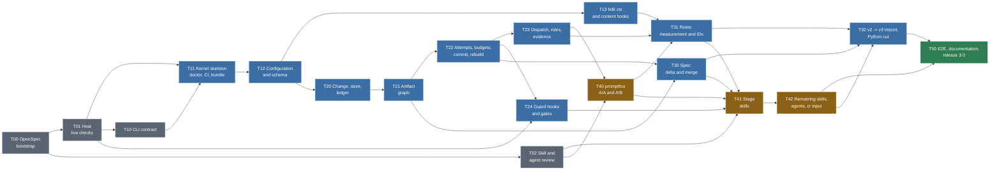

# BDK v3 - implementation plan (tasks)

**Sources**: `.bdk/design/2026-09-23-0703-bdk-v3-change-centric-design.md` (design, verifier PASS iteration 3, 2026-09-24) and `.bdk/design/2026-09-23-0703-bdk-v3-decisions.md` (decision register D1-D5, S1-S8, Q1-Q5, K1-K4, A-*, R-*, T1-T6, P1-P11).
**Date**: 2026-09-24
**Status**: draft plan, to be run in OpenSpec

## How to read this document

- This file is a **roadmap and task index**, not a specification. Each task below gets **its own spec in OpenSpec** (`openspec/changes/<id>/` with `proposal.md`, `specs/`, `design.md`, `tasks.md`), written before it starts. No decisions are made here; the "To resolve in the spec" section of each task lists what the spec must settle.
- Tasks are executed by AI, so they are **large** - one task is a coherent kernel module or a coherent group of skills, not a single file. A task boundary runs where the contract between components changes (CLI, Change directory, hook, skill), because that is where the spec has something to describe.
- The **Input** column points to the design sections and decision IDs the spec must carry over; the **Acceptance signal** column lists the scenarios from the design's "Testing Strategy" section that must pass for the task to be closed.
- Phase order follows dependencies, not time. Tasks in one phase with no arrow between them can run in parallel (separate OpenSpec Changes, separate branches).

## Running the project in OpenSpec

Convention (to be confirmed in T00):

| Plan element | OpenSpec counterpart |
|---|---|
| This document | `docs/V3-IMPLEMENTATION-PLAN.md`, linked from `openspec/config.yaml` as project context |
| One task `Tnn` | one Change `openspec/changes/v3-Tnn-<slug>/` |
| "Input" column | `proposal.md` (why and what) plus `design.md` (how), with citations of v3 design sections |
| "Acceptance signal" column | `specs/<capability>/spec.md` as `Requirement` / `#### Scenario:` WHEN / THEN |
| Work breakdown within a task | `tasks.md` (`## section`, `- [ ] N.M`) - written by AI in `/opsx:propose` or `/opsx:ff`, not here |
| Closing a task | `/opsx:verify` then `/opsx:archive`; the BDK living spec grows in `openspec/specs/` |

Status across tasks is tracked on GitHub, not in this file: every `Tnn` has one issue in the [`v3.0` milestone](https://github.com/broneq/bdk/milestone/1), labelled `v3:phase-N`, with native "blocked by" links that mirror the **Dependencies** line of each task. The [BDK v3 project board](https://github.com/users/broneq/projects/1) shows every issue with its `Status` (Todo / In progress / Done) and `Phase`. The issue holds status only; scope stays here and detail stays in the OpenSpec Change, whose `proposal.md` links the issue. The PR that archives the Change closes the issue with `Closes #N`. When a task's dependencies change, update this file and the issue links together.

Note on the seam: BDK v3 itself introduces a living spec in OpenSpec format under `.bdk/specs/` (D2). Until the v2 -> v3 cut, the BDK project is run with the OpenSpec tool (`openspec/`), and after T50 the BDK spec may be migrated to BDK's own mechanism (`bdk import` or by hand). Whether and when is a decision outside this plan, recorded in T50 as a question.

## Dependency graph

Colours: grey = preparation without kernel code; blue = kernel and data; amber = skill layer, dependent on the A/B result (risk from the register: fallback to approach B with the same kernel); green = closing.

---

## Phase 0 - Preparation

### T00 Bootstrap OpenSpec in the BDK repository

**Goal**: the BDK repo is run in OpenSpec; this plan is the index of Changes.

**Scope**:
- `openspec init` in the repo, `openspec/config.yaml` with context (link to this plan, to the v3 design and the decision register).
- Change naming convention `v3-Tnn-<slug>`, a `proposal.md` template that points to design sections and decision IDs.
- Settle where the v3 design documents live during implementation (today untracked because of `/.bdk/` in `.gitignore`, decision V-tracking): copy to `openspec/changes/` or `docs/`, or leave as is.
- Entry in `CLAUDE.md` / `CONTRIBUTING.md`: how to start a task from this plan (`/opsx:propose` with the task ID).

**Input**: the "Running the project in OpenSpec" section above; D2 (OpenSpec format as the target format of the BDK spec); V-tracking.

**Acceptance signal**: `openspec validate` passes on an empty Change tree; the first Change (`v3-T01-...`) created by `/opsx:propose` links this document.

**To resolve in the spec**: OpenSpec schema for kernel tasks (default spec-driven or tdd); whether the v3 design goes into git now; whether `openspec/specs/` stays after v3 or migrates to `.bdk/specs/`.

**Dependencies**: none.

### T01 Host live checks and recorded hook payloads

**Goal**: facts about Claude Code that T1-T3 depend on, checked live **before** the kernel skeleton; hook payloads recorded as fixtures for E2E.

**Scope** (the "Live checks" list from "What We Did NOT Decide" and the register):
- `UserPromptExpansion`: a BDK plugin skill arrives as `command_name: plan`, `command_source: plugin`; shape of `prompt`, `command_args`; whether `disable-model-invocation: true` also blocks invocation through the `Skill` tool.
- `PreToolUse`: whether user `!` commands (bash mode) go through the hook; whether background plugin subagents get `agent_id` like foreground ones; shape of `tool_input` for `Bash`, `Edit`, `Write`, `MultiEdit`, `NotebookEdit`.
- `SessionEnd`: whether it fires when the session is killed and on `/clear`; payload.
- `allowed-tools`: whether the rule `Bash(node ${CLAUDE_PLUGIN_ROOT}/dist/bdk.mjs *)` pre-approves the compound form `node ... || echo ...` (V2-4).
- `disallowed-tools` in a skill: confirm that it is cleared on the next user message (P9).
- `node:sqlite`: minimum Node version without a flag, stability status; the user's Node version (nvm).
- Every measurement saved as a recorded JSON payload in a fixtures directory (e.g. `tests/fixtures/host-payloads/`), with the Claude Code version in the name.

**Input**: "Existing Codebase Context" paragraph "Host facts verified"; NFR row "Host"; risk "Host hook semantics move under us"; T1-T3.

**Acceptance signal**: a `docs/HOST-FACTS.md` document with a fact / result / host version / fixture table; every item on the list has a result YES / NO / NOT APPLICABLE; on NO for `UserPromptExpansion`, the `bdk stage enter` fallback is described for inclusion in T10 and T24.

**To resolve in the spec**: recording method (a hook script writing stdin to a file); whether fixtures live in `tests/` or `openspec/`.

**Dependencies**: T00 (formally); none in substance.

### T02 Review of the skill, meta-skill and agent inventory

**Goal**: a deliberate disposition for each of today's 19 user skills, 13 meta-skills and 13 agents: **stays / merges / redesign / removed**. The design's inventory (15 skills, 5 meta-skills per role class, 13 agents) is marked PoC / TODO, so this task verifies it rather than adopting it.

**Scope**:
- For each skill: size (today 8-661 lines, S1 = 200), what it really does, which steps are "process" to move into the graph / kernel, which are "domain knowledge" to keep in the skill, what `!` blocks, frontmatter hooks and `allowed-tools` it has.
- Merge candidates from the design: `create-plan` + `verify-plan` -> `plan`; `add-rule` + `refine-rules` -> `rules`; `design` + `create-adr` (decision export); rename `test-driven-development` -> `tdd`, `update-docs` -> `docs`. For each: for / against / recommendation.
- Meta-skills `bdk-tier-*`, `bdk-rules-*`, `bdk-lint-tools`, `bdk-test-tools`, `bdk-implementer-return-contract` -> 5 `bdk-role-<class>` (worker / reader / reviewer / verifier / runner): agent -> class mapping, what each agent loses or gains.
- Agents: `tools:` unchanged (T2), but the input / output contract changes (package path, envelope, `bdk-entries` block); identify which agents today contain text that conflicts with P3 (statements about approval) and T3 (no ban on destructive git).
- `cr` and `pr-review`: out of redesign scope (user decision), but write down how they should accept the dispatch package as input.
- Choice of the skill (or two) for the "thin vs long" A/B in T40 - recommendation of which one we measure.
- Dev-time `.claude/skills/skill-lint`, `agent-lint`: what of them becomes a CI content test (A3).

**Input**: "Skill inventory (PoC / TODO)", "Users & Personas", "TSH revision grounding", `README.md` Skills and Agents sections, `STARTUP_INSTRUCTIONS.md`.

**Acceptance signal**: `docs/V3-SKILL-INVENTORY.md` with a table: skill / lines today / disposition / rationale / target task (T41 or T42); the same for agents and meta-skills; a list of open decisions for the user, each with a recommendation.

**To resolve in the spec**: this is a review task; the spec describes the output format and criteria (e.g. "process vs knowledge"). Decisions about the fate of skills are made by the user on the task's output; T41 / T42 receive them as input.

**Dependencies**: T00.

### T10 Kernel CLI contract (first-class document)

**Goal**: the full contract of `node ${CLAUDE_PLUGIN_ROOT}/dist/bdk.mjs <args>` before any code exists; the design calls it "the first plan artifact".

**Scope**:
- All command groups from the design: `change`, graph (`next`, `explain`, `validate`, `done`), `part`, `attempt`, `log` (including `ingest`), `dispatch`, `evidence`, `spec`, `config`, `ctx`, `rules`, `query`, `commit`, `hooks`, service commands (`doctor`, `rebuild`, `import`, `version`).
- For each command: arguments, `--json` output shape (JSON Schema), exit code (0 ok, 2 refusal, 3 input error, 4 corrupted state, 5 missing runtime), refusal shape (`refused`, `rule`, `why`, `instead[]`), limits (<= 100 lines, `--for`, `--all`).
- Two output modes: **inject** (`ctx`, `next`: always exit 0, errors as a "BDK STOP" block) and **command**; one allowed form of the `!` wrapper with a `|| echo "BDK STOP..."` branch, and the `|| exit 2` form for guard hooks.
- Command split: orchestrator-only (`commit`, `attempt`, `part`, `change`, `log ingest`, `spec merge`, `hooks`) vs available to subagents (`log add`, `log show`, `dispatch show`, `evidence record`, `ctx`).
- Explicitly: no `approve`, no `gate pass`; `source: user` only from the `hooks prompt-expansion` path. If T01 shows no `UserPromptExpansion` for plugin skills, the contract gets `stage enter` as the only writing `!`.
- Format this document so that the contract tests in T11 can read it by machine (e.g. output schemas next to the prose).

**Input**: "CLI contract (outline)", "Key boundaries", "UX Touchpoints - Failure surface", input assumptions for 2A ("CLI contract as a first-class document"), Q3, T1-T3.

**Acceptance signal**: `docs/CLI-CONTRACT.md` (or a directory) covers every command from the design; every refusal example has four fields; cross-review: every command called in the design sections (sequence diagram, hooks table, skill inventory) exists in the contract.

**To resolve in the spec**: argument syntax (`attempt close ok` vs `--outcome ok`), contract versioning (`kernel-version` in the package, P10), whether output schemas live in `schema/cli/`.

**Dependencies**: T01 (the live checks result affects `hooks` and a possible `stage enter`).

---

## Phase 1 - Kernel foundation

### T11 Node / TypeScript kernel skeleton, bundle, CI, `doctor`

**Goal**: a working kernel with the `version` and `doctor` commands, a full build / test / lint chain and CI, so that every following task adds a module, not infrastructure.

**Scope**:
- A `kernel/` structure (name to be decided) in TS, pnpm dev-only, esbuild -> one ESM `dist/bdk.mjs`, **committed** and guarded by `git diff --exit-code` on CI; Biome; `node --test` for units.
- Runtime dependencies: only `node:` plus bundled, pinned zod and a YAML parser; `pnpm audit` on CI (V1-8).
- E2E harness: a repository fixture (created in `tmp`, with git), a helper that runs `bdk.mjs` and asserts exit code / JSON; contract tests that read `docs/CLI-CONTRACT.md` from T10 (every command has a handler or an explicit stub that returns `refused`).
- `bdk version`; `bdk doctor`: Node version (minimum from T01), `uv` / `uvx` presence, detection of the v2 layout (`settings.json`, `.bdk/runs/`, `.bdk/plans/`) with a `bdk import` instruction **as content**, never exit != 0 in inject mode.
- Shared modules: error handling -> refusal shape; inject vs command mode; `--json`; the <= 100 lines limit.
- Update of ADR 0001 in git-identity (the consequence "bdk stays in Python" is outdated; rule 9 for the bundle) - amendment text as part of the task or a separate PR in that repo.
- Formal ADRs for decisions already made (D5 runtime, A-podejście artifact graph, R-format YAML + Markdown, R-store Markdown + SQLite) via `/bdk:create-adr` - here, because this is the first task in which these decisions become code.

**Input**: D5, Q3, NFR "Runtime", "Security", risk "SPOF: the kernel", "Testing and CI", "Next Steps".

**Acceptance signal**: CI green with the steps build, `git diff --exit-code dist/`, lint, unit, E2E; `bdk doctor` on a v2 fixture prints the import instruction; `bdk doctor` without `uv` prints the exact install command; a call from Node below the minimum ends with exit 5 and an instruction.

**To resolve in the spec**: minimum Node version (based on T01); kernel directory layout; pinning policy and dependency update cadence; whether CI is GitHub Actions next to the existing release-please.

**Dependencies**: T10, T01.

### T12 Layered configuration, zod registry, JSON Schema, `prompts/`

**Goal**: `bdk config` as the single source of settings for the kernel and skills; the end of `get_settings.py` and the hand-written `settings.schema.json`.

**Scope**:
- Four layers: defaults in the bundle < `~/.config/bdk/settings.yaml` (XDG) < `.bdk/settings.yaml` < `.bdk/settings.local.yaml`; deep-merge, arrays merged by `id`; full override allowed (D4).
- Schema registry per module (zod); unknown key = error naming the key (S6); key without a consumer = error; resolved configuration snapshot to `.machine/`; list of locally overridden keys (names, no values) to record in the Change (D4b; the recording in the Change itself arrives in T20).
- `prompts/<key>.md` and `prompts.local/<key>.md` as Markdown values with `mode: extends|replace`, `applies` frontmatter.
- JSON Schema export from the zod registry to `schema/` on CI, `git diff --exit-code`; a `# yaml-language-server: $schema=<versioned raw URL>` modeline added by setup; offline copy in `.machine/schema/`.
- Commands: `config show | check | schema | set --global | --local`.
- Removal of `hooks/check-bdk-config/settings.schema.json` and `scripts/get_settings.py` (physical deletion can wait until T32, but nothing may read them any more).

**Input**: "Configuration (A-warstwy, R-format, D4, B7-B10)", S6, R-format (user condition: JSON Schema for the IDE), "What We Did NOT Decide" (Windows path for XDG).

**Acceptance signal**: E2E "config layering with unknown key" (the error names the key and the layer); local override visible in the snapshot; `schema/*.json` consistent with the registry (CI); an IDE with yaml-language-server suggests keys in the fixture's `settings.yaml` (manual confirmation once).

**To resolve in the spec**: full list of v3 keys (migration from today's `settings.json`: `features.*`, `tools.*`, `quality.*`, `languages`), XDG path on Windows, format of the versioned schema URL, what a "key without a consumer" looks like technically (consumer registration).

**Dependencies**: T11.

### T13 `bdk ctx` and content hooks (replacing the Python injection scripts)

**Goal**: one prompt context composer instead of `inject.py`, `inject-rules.py`, `inject-language-rules.py`, `render_startup.py`; STARTUP rendered by the kernel.

**Scope**:
- `ctx skill <name>`: conditional fragments and tool-tier chains (`exclusive` / `additive` with `if` / `prefer`, semantics from `.claude/rules/fragment-system.md`), quality rules (by file at this stage; by ID from T31), language rules from `languages`, values from `prompts/`.
- `ctx role <class>`: content for the `bdk-role-*` meta-skills (worker / reader / reviewer / verifier / runner); the class is in the name, because a skill does not know which agent preloads it.
- `ctx startup`: STARTUP_INSTRUCTIONS with resolved chains and an **agents table generated from the `agents/*.md` frontmatter** (P11, closes the T6 drift); content test: the table in the repo is byte-identical to the output.
- Content hooks in `hooks.json`: `hooks session-start` (STARTUP, `config check`, v2 layout detection, rule drift snapshot, graph repo registration - one process instead of four), `hooks stop` (rule drift), `hooks skill-exists <name>` (for `commit`); `|| echo "BDK STOP..."` wrapper (always exit 0). The `uvx` lines unchanged.
- A3 content test: every `!` block in `skills/` calls only `ctx` or `next` in the exact wrapper form; `allowed-tools` carries the rule `Bash(node ${CLAUDE_PLUGIN_ROOT}/dist/bdk.mjs *)` (form confirmed in T01).
- Migration of the existing `fragments/` and `rules/` to the format read by `ctx` without changing content (changing rule content = T31).

**Input**: "Configuration" (the paragraph about `ctx`), "Hooks (V1-1, V1-2)", P11, T6, `docs/INJECTION-FLOWS.md`, `.claude/rules/fragment-system.md`, risk "SPOF" (stateless skills lose tier guidance, visible BDK STOP).

**Acceptance signal**: E2E "`!`-block error rendering" (no Node -> a BDK STOP line in the skill content, exit 0); `ctx skill debug` on a fixture with `features.code-review-graph` gives the graph tier, without flags gives the fallback; `ctx startup` contains `bdk:design-verifier`; `hooks.json` without `python3` for SessionStart and Stop.

**To resolve in the spec**: whether `fragments/` stay files or go into `prompts/` defaults in the bundle; the fate of `check-rules-drift` (snapshot in `.machine/`); agent frontmatter format required for generating the table.

**Dependencies**: T12.

---

## Phase 2 - Change, ledger, graph, attempts

### T20 Change directory, `store` module, ledger, IDs, profile

**Goal**: the Change as a durable on-disk object with an append-only ledger, `store` as the single access point and a rebuildable index.

**Scope**:
- The `.bdk/changes/<id>/` layout from the design (`change.md`, `log/`, `design.md`, `plan/`, `spec-delta/`, `attempts/`, `evidence/`, `dispatch/`, `reports/`, `archive/`); `.machine/` gitignored; **fix `ensure_ignored()`**: `/.bdk/.machine/` and `/.bdk/settings.local.yaml` instead of `/.bdk/`.
- `store` module (R-store): Markdown as truth, SQLite index (`node:sqlite`) in `.machine/` rebuilt lazily; freshness = `stat` of the `log/` and `attempts/` directories plus file count, full rehash only after a change (V1-9); busy timeout; fallback JSON index as an escape hatch if `node:sqlite` is unavailable (decision from T01 / T11).
- Ledger (K1-K4): one file per entry, frontmatter `id`, `type` (9 types + `transition`), `summary` <= 120, `status`, `source`, `author`, `at`, `refs` >= 1, `supersedes`, `review`; validator on `log add`; dedup by key; `observation` limit per dispatch (limit enforced in T23, here only the field); P1: `id`, `at`, `author`, `source` stamped by the kernel, never from arguments; `source: user` unreachable from `log add`.
- Allocation of `L-nnnn` IDs per Change: maximum from committed files + `mkdir .bdk/.machine/ids/<changeId>/L-nnnn` markers (V1-6, V2-3); references between Changes `<changeId>/L-0042`.
- Commands: `change new "<intent>" | status | list | resume | park`, `log add | list | show | resolve`, `query` (read-only SQL). `change takeover`, `change close`, `log route`, `log ingest` arrive in T22 / T30 / T50.
- Resolving the active Change from the current branch (one active Change per branch).
- Profile (R-profil, S7): `change new` measures (heuristic to be calibrated), proposes `tiny | small | large`, records it as an `assumption` entry; `--profile` overrides; a change mid-flight only upward.
- Recording the list of overridden keys (D4b) into the Change at start.
- `log list` timing telemetry in `.machine/` from day one.

**Input**: "Change directory", "Ledger entry", R-store, K1-K4, V1-6, V1-9, V2-3, P1, R-profil, D4b, NFR "Scale" and "Latency", risk "Bottleneck: ledger index".

**Acceptance signal**: E2E: 15 parallel `log add` without ID collisions; a fresh clone starts from the committed maximum; `log list` < 200 ms at 1 000 entries; `log add` with `--source user` rejected (exit 3); `change status` <= 100 lines; a deleted index rebuilt without data loss; the fixture's `.gitignore` contains exactly two `.bdk` paths.

**To resolve in the spec**: profile heuristic and thresholds (files from the intent, impact from the code graph, modules); dedup key per entry type; `change.md` format; whether `query` has a table allowlist; index schema.

**Dependencies**: T12.

### T21 Artifact graph engine (`pipeline.yaml`, kinds in TS, `next`, `explain`, gate)

**Goal**: the Change process as data; the kernel computes ready / blocked / done and gives the skill the next artifact with an instruction; skills do not know the stage order.

**Scope**:
- `pipeline.yaml` in the bundle plus the project `policy` (part of `settings.yaml`), zod validation; **no expressions beyond `if: features.X`**, no loops and no references outside the Change directory; a content test rejects unknown keys.
- Artifact kinds in TS with validators: `intent`, `design`, `plan-part`, `plan-verify`, `gate`, `execute-part`, `post-task-step`, `review`, `spec-delta`, `close`; `done` only after the validator (schema, non-emptiness, input hash) - defence against the OpenSpec `existsSync` risk.
- P2: every validator records the sha256 of its inputs; a verdict for a different hash = `stale`, the node is not `done`.
- The `gate` kind (T1, S8): `done` when the ledger holds a `transition` entry with `source: user` for this gate, **newer than the node's last transition into the ready state** (a loop-back invalidates earlier ones); the gate checks provenance and readiness, never content; no hashes, no `approvals/`. Writing the entry itself is done by the hook in T24; here the kernel only recognises it.
- Profiles `tiny | small | large` as graph variants (what they skip).
- Commands: `next` (artifact + instruction + gate status with the list of `review: true`), `explain <artifact>` (the `requires` chain, mandatory from the first release), `validate`, `done`; `change status` extended with the graph.
- Instruction builder: template + rules + context via `ctx`.
- Extensibility: a test proving that a new kind (fake, for testing) is a TS class + a YAML node, with no changes in skills (the promise of approach A; reused in T23 for the evidence primitives).

**Input**: "Approach A", "Selected Approach", A-podejście, A-drabina (states only), D3, S7, P2, risks "pipeline.yaml grows conditions" and "process documentation moves into a graph".

**Acceptance signal**: E2E: new `small` Change -> `next` returns `design`; after the design is written and a `transition source: user` entry (inserted by a fixture) `next` returns `plan`; a `log add` entry faking approval does not open the gate; reopening the gate after a loop-back requires a newer entry; `explain plan-verify` prints the chain; YAML with `when:` rejected by the content test; the `tiny` profile has no `design` node.

**To resolve in the spec**: exact schema of `pipeline.yaml` and `policy`; which fields are per node (budgets, `if`, profile); format of the instruction returned by `next`; what exactly counts as hash "inputs" per kind.

**Dependencies**: T20.

### T22 Attempts, budgets, escalation ladder, plan parts, `commit`, `rebuild`, checkpoint

**Goal**: every loop has a budget in state, exhaustion is a defined state, progress is reconstructible from git (S2, S5).

**Scope**:
- `attempt open <loop> <target>` -> ticket `A-nnnn` (allocated like `L-nnnn`) or a refusal (budget / oscillation); `attempt close ok | fail | not-run`; `attempt list`; append-only records in `changes/<id>/attempts/<loop>-<target>.md` (committed, V1-4).
- Budgets per loop kind in policy: task re-dispatch, verify-fix per part, review-fix per Change, verifier iterations (default 2), consecutive `not-run`.
- `not-run` (P4): does not consume the loop budget, has its own budget, when exhausted goes straight to `Question`.
- Finding fingerprints `(type, file, symbol, normalised problem)`; the same pair twice after a fix = oscillation, shortens the ladder; threshold in policy.
- A-drabina: narrowed scope (`full -> high+ -> blockers`, N+1 a subset of N, what drops out becomes a `finding`) -> escalation (fresh context, stronger model, 1x, can be switched off) -> `question` at the gate -> `parked` with options and one resume command (`change resume`).
- Plan parts (P6, S1): `part list | start | done | split`; validators: <= 8 KB, <= 8 tasks, fields `goal`, `success-measure`, `do-not-touch`, optional `stop-rule` in a task; `do-not-touch` intersecting `Files:` = error; placeholders in executable fields = error; `Depends on` between parts; `spec-impact: none` or a delta required (validation of the delta content in T30).
- `commit <task>`: stages code and the Change directory, trailers `BDK-Change` / `BDK-Part` / `BDK-Task`, compares the real diff with `Files:` and `do-not-touch` (forbidden path: refusal; file outside `Files:`: `finding`); the same check at `attempt close`. `part done`: every task has a commit with a trailer.
- `log ingest --ticket <A-nnnn>` (T2): a YAML `bdk-entries` block, validation as for `log add`, provenance from the ticket, refusal of the whole block pointing to the line; entry counter on the ticket; `attempt close` refuses when the envelope declares entries that do not exist.
- `rebuild`: progress from trailers + attempts from committed files; mandatory repair path on exit 4.
- `change checkpoint`: `git commit --only -- .bdk/changes/<id>/` as `chore(bdk): checkpoint <change>`; skipped during rebase / merge / cherry-pick and with open tickets; called on park / escalation; the `session-end` hook calls it in T24; enabled by default, can be switched off in policy.
- `change takeover` (taking over a run after a dead session, today's `--force`).

**Input**: "Loop protection (A-drabina)", "Attempt durability (V1-4)", "Plan part fields and plan-quality rules (P6, P7)", P4, T2 (`log ingest`), S1, S2, S5, "Key boundaries" (IDs, working tree), `scripts/bdk_run_state.py` as a seed (manifest-as-cache, trailers-as-truth, Refusal, `deferred_findings`, `reconcile`).

**Acceptance signal**: E2E: budget exhaustion -> `parked` with a `question` entry and options; oscillation on a fixture shortens the ladder; `attempt close not-run` x3 leaves the loop budget and creates a `question`; a diff touching `do-not-touch` rejected at `attempt close`; killed session + `rebuild` reconstructs progress and attempts; checkpoint does not sweep in files staged by the user; a 9 KB part rejected with a refusal; a `bdk-entries` block with a wrong type rejected with a line number.

**To resolve in the spec**: escalation model and cost limit per Change (open in the design); exact normalisation of "problem" in the fingerprint; default budget values; squashing checkpoints at `close` (open); plan part file format (today's `create-plan` template as a starting point); whether `takeover` stays a separate command.

**Dependencies**: T21.

### T23 Dispatch packages, role contracts, envelope, evidence primitives

**Goal**: orchestrator <-> subagent communication through files only: the package goes in, the envelope comes out; verification evidence has freshness and citations.

**Scope**:
- `dispatch build <task> <role> <ticket>`: package `changes/<id>/dispatch/<task>-<role>-<n>.md`; frontmatter `ticket`, `task`, `role`, `attempt n/N`, `scope`, `kernel-version`, `template-hash` (P10); sections: intent summary, full task text with `do-not-touch` and `stop-rule`, full `decision(accepted)` and `blocker`, summaries of `finding` / `observation` / `assumption` by `refs`, rules excerpt by ID for the role (by file until T31), return contract; refusal > 12 KB; refusal on placeholders; no open ticket = no package. `dispatch show`.
- Role classes and contracts: worker (implementer, fixer), reader (explorer, log-analyzer, dead-code, duplicate, web-researcher), reviewer (code-reviewer, architecture-reviewer), verifier (plan-verifier, design-verifier), runner (static-analyse, test-runner). Write channel by class (T2): worker / runner `log add`; reader / reviewer / verifier a `bdk-entries` block at the end of the report. P3: verifier and reviewer make no statements about approval or moving on. T3: one sentence banning destructive git in the worker contract, with the reason.
- Envelope <= 15 lines: `status`, `ticket`, `files`, `log ids`, `report path` (evolution of today's `return-contract.md` with `ticket` and `log`); full report in `changes/<id>/reports/`.
- A closed list of blocking categories for verifiers (P8, six defaults) and an explicit "this is not a FAIL" list; categories in policy; the kernel downgrades a blocker without a category to `observation` + `review: true` with the original text in the body.
- Evidence primitives (T4, P5): `evidence record` (manifest: kind, tree hash, list of files with hashes, citations; binaries in `.machine/evidence/`), `evidence check` (evidence older than the last code change = rejected); citation validator (PASS must point to values that exist in the evidence: JSON pointer or snapshot line); a fake artifact kind in E2E exercising the manifest, `not-run` and citations together. Nothing UI-specific (`ui-verify` = a separate Change after v3).
- Post-task steps as graph nodes (`tests-scoped`, `lint`, `simplify`) - order in YAML, not in the skill.
- Content of the 5 `bdk-role-*` meta-skills (one `!` line each calling `ctx role <class>`); attaching them to agents via `skills:` (the agent change itself is done in T42; here they exist and work).
- Archiving at `close` (V1-9): `dispatch/` and `reports/` pruned to an index of hashes, unless `archive.keep-evidence`.

**Input**: "Dispatch package (K3, K4)", "Verifier contracts (P8)", "Verification evidence primitives (T4, P4, P5)", T2, P3, P10, K2, `skills/subagent-execute-plan/references/return-contract.md`, risks "Reader entries relayed" and "Primitives without a consumer".

**Acceptance signal**: E2E: a 13 KB package rejected; a package with `TODO` in an executable field rejected; a verifier blocker without a category from the list becomes `observation review: true`; a manifest older than the tree hash rejected; PASS without citations rejected; a verdict for an older part hash = `stale`, `plan-verify` not `done`; the fake kind passes manifest + `not-run` + citations; `dispatch build` without a ticket rejected.

**To resolve in the spec**: exact package template per role; `template-hash` normalisation; citation format per evidence kind; whether the `observation` limit per dispatch is in policy; form of the `bdk-entries` block (keys, escaping).

**Dependencies**: T22.

### T24 Guard hooks and gates (`PreToolUse`, `UserPromptExpansion`, `SessionEnd`)

**Goal**: the T1 and T3 guarantees in code, not in prose; a shell prefilter, the kernel fail-closed.

**Scope**:
- `hooks.json` v3: `PreToolUse` with the matcher `Edit|Write|MultiEdit|NotebookEdit|Bash` and a **shell prefilter per tool** (Bash: `agent_id` present and text contains `git` or `bdk.mjs`, or any thread and text contains `.bdk/specs` or `bdk.mjs hooks`; edit tools: `file_path` under `.bdk/specs/`); the rest returns without starting Node (< 5 ms). Guards with `|| exit 2` (fail-closed).
- `hooks pre-tool`: spec guard (V1-7); git guard for subagents: `stash`, `reset`, `clean`, `checkout -- <path>`, `checkout .`, `restore`, `switch --discard-changes`, `commit`, `add`, `merge`, `rebase`, `cherry-pick`, `push`; orchestrator command guard for subagents (`bdk.mjs commit|attempt|part|change|log ingest|spec merge|hooks`); deny `bdk.mjs hooks` from Bash in every thread; the deny reason names the matched verb and tells the agent to return `blocked`. Main thread untouched.
- `UserPromptExpansion` with the matcher `plan|execute|close`: `hooks prompt-expansion` resolves the Change from the branch, calls `next`; gate ready -> a `transition source: user` entry (kernel clock, `session_id`, command text, `refs` = the gate node and artifacts, `--skip-verify` flag for `execute`, P2); gate not ready -> block "gate not ready: <what is missing>"; gate already passed -> pass without an entry (S5); no gate in the profile -> pass with a plain stage entry; no active Change -> block with a hint; no kernel -> block "kernel unavailable". Stdout as context for the model (gate status).
- If T01 showed no `UserPromptExpansion` for plugin skills: `stage enter` fallback from the skill's `!` block + deny `bdk.mjs stage` from tools; an exception in the content test.
- `SessionEnd`: `hooks session-end` -> `change checkpoint`.
- p95 targets (NFR "Latency"): prefilter < 5 ms, `pre-tool` with the kernel < 150 ms, `prompt-expansion` < 150 ms - measured in E2E.
- E2E on the **recorded payloads** from T01; an unknown payload shape = "no transition" (fail-closed).
- Frontmatter of the stage skills (`disable-model-invocation: true`, `disallowed-tools`) described here as a requirement, introduced in T41.

**Input**: "Hooks (V1-1, V1-2)" table, "Key boundaries" (human gate provenance, working tree guard, prefilter and failure mode), T1, T3, P2, P9, S8, NFR "Latency" and "Security", risks "Host hook semantics", "Guard latency and false positives", "Gate binds to time, not content".

**Acceptance signal**: E2E (TSH scenarios from "Testing Strategy"): the payload of a typed command creates a `source: user` entry and the gate is `done`; a payload without the user marker creates no entry; `/bdk:plan` with a design that is not ready is blocked with a reason, no entry; subagent `git stash` deny, main thread with the same text pass; subagent `bdk.mjs commit` deny; kernel removed: subagent `git commit` -> exit 2, main thread `bdk.mjs hooks` -> exit 2, main thread `git status` -> pass without starting Node; `Edit` under `.bdk/specs/` deny; p95 measurement below the thresholds on a fixture of 750 calls.

**To resolve in the spec**: exact git guard regex (false positives: `git reset` inside a commit message string); whether `ask` in the main thread stays a "ready extension" (yes, per the design); text of the block / deny messages; how the hook recognises `--skip-verify` in `command_args`.

**Dependencies**: T22, T01.

---

## Phase 3 - Spec, rules, migration

### T30 Living spec: delta, semantic validation, deterministic merge

**Goal**: a behaviour spec in OpenSpec format under `.bdk/specs/`, written only by the kernel at `close`.

**Scope**:
- Format: `Requirement` SHALL + `#### Scenario:` WHEN / THEN; delta in `changes/<id>/spec-delta/<capability>.md` with ADDED / MODIFIED / REMOVED sections.
- `spec delta check`: exact `Scenario:` prefix, WHEN / THEN present, scenario loss = ERROR, configurable normative word; every plan part declares a delta or `spec-impact: none` (the part validator from T22 calls this check).
- `spec merge` at `close`: deterministic, through `node:fs` (structurally outside the hook); conflict = refusal showing both deltas, the model consulted only then, `close` blocked until resolved; `bdk-merge-hash` in the frontmatter of every spec file; `doctor` and `close` refuse on a hash mismatch (detects manual edits, best effort for bypass through Bash).
- `spec diff`.
- The `spec-delta` kind in the graph (T21) gets its validator from this task.

**Input**: "Spec handling (D2, D2a, D2b, C1-C3)", D2, D2a, report C1-C3, V1-7, risk "Spec merge conflicts", risk "Behaviour-only spec leaves patterns to rules".

**Acceptance signal**: E2E: a delta without WHEN rejected; a delta removing a scenario without REMOVED = ERROR; two Changes editing the same capability -> merge refuses and shows both; manual edit of `spec.md` after merge -> `doctor` reports it; merge is idempotent (twice = the same file).

**To resolve in the spec**: merge algorithm (by Requirement name, by order?), handling of MODIFIED, `bdk-merge-hash` format, whether BDK's own spec (from `openspec/specs/`) migrates through this mechanism (see T00 / T50).

**Dependencies**: T21 (the `spec-delta` kind), T22 (part validation).

### T31 Rules: no-op measurement and ablation, `[PREFIX-n]` IDs, `rules check`, `PL` plan rules

**Goal**: rules with durable IDs checked by ID by the verifier and reviewer (S4), but only after measuring which of the 162 bullets add any knowledge at all (T5).

**Scope**:
- Measurement 1: knowledge no-op test on `rules/*.md` and `rules/languages/*.md` - claims extracted, Haiku and Sonnet blind, facts verified, one judge; result COVERED / MISSED / WRONG per bullet.
- Measurement 2: task ablation in promptfoo (harness from T40): a fixture of diffs with seeded violations, review with and without the rules file, A/A noise floor.
- A rule COVERED in both measurements is removed **before** a number is assigned (no tombstone). The rest: `kind: house | knowledge`; a `knowledge` rule with a fact or version requires `source` and `verified: <date>`.
- `[PREFIX-n]` IDs with the prefix from the file (`CQ`, `ARCH`, `DP`, `SEC`, `TQ`, `EJ`, `PL`, languages their own), number assigned once, never reused; a removed rule stays as `[CQ-4] (removed: reason)`.
- `rules check` (uniqueness, format, `source` / `verified` for `knowledge`, duplicates after a parallel `close`), `rules show <ID>`; project `.bdk/rules/*.md` with `id` / `mode` frontmatter; project number assignment at `close` by the Change owner.
- `rules/plan.md` with the `PL` prefix (P7): DoD only conditions checkable in review, no placeholders, every part has a `success-measure`.
- `ctx` (T13) and `dispatch build` (T23) switch to excerpts by ID and per role; plan-verifier tick list of IDs; reviewer findings cite IDs; `learning` proposes new ones.
- The measurement procedure as mandatory for every new `rules/languages/` file (document + content test on `kind`).
- Today's `.claude/rules/quality-rules.md` (authoring convention) updated to the format with IDs.

**Input**: "Rules with IDs (R-rule-id, S4)" together with "Measure before numbering (T5)", P7, D2a (rules must be able to be system-specific), risk "Measurement delays the rule migration", `rules/` (9 files, 162 bullets).

**Acceptance signal**: a measurement report in `docs/` with a per-bullet table and decision; `rules check` green on CI; content test: `rules/plan.md` exists with `PL`, every `knowledge` rule with a fact has `source` and `verified`; E2E: a removed rule stays as a tombstone, `rules show CQ-4` prints the text; a dispatch for the reviewer role contains only IDs from the role's list.

**To resolve in the spec**: "COVERED" thresholds (agreement of both models? judge?); role -> rule set mapping; project rule frontmatter format; whether the measurement is one-off or a repeatable script.

**Dependencies**: T13, T40 (promptfoo harness), T23 (dispatch by ID).

### T32 v2 -> v3 import, Python cut, cleanup

**Goal**: hard cut (Q1): a plugin without Python, a one-off `bdk import`, the defects from the side items list removed.

**Scope**:
- `bdk import`: `settings.json` -> `settings.yaml` (key mapping from T12), old `.bdk/design/*.md` -> intents of new Changes (`change new` with the content), `.bdk/runs/`, `.bdk/plans/`, `.bdk/verify-plan/` -> a report of what was ignored; `hooks session-start` detects the v2 layout and prints the instruction (content, exit 0); `doctor` does the same on demand.
- Deletion: `scripts/*.py`, `hooks/*/check.py` and `register.py`, `hooks/check-bdk-config/settings.schema.json`, `hooks/is-command-exists/` (not called), `tests/unit/` (pytest), `pyproject.toml`, `uv.lock` (unless needed for MCP), `__pycache__` in `skills/execute-plan`, `skills/create-fixture`, `skills/refine-rules/scripts`; `tests/evals/` after replacement by promptfoo (T40).
- Side items: `ensure_ignored()` (if not done earlier in T20), `features.caveman` (#39: a consumer or removal of the key; in v3 a key without a consumer is an error, so it must either go or work), merge or close `fix/38`, `fix/39` (#38: documentation of the Serena hook in `setup`).
- BDK repo `.gitignore`: `/.bdk/` -> the two v3 paths; `/.lavish/` unchanged (user decision).
- `plugin.json` 3.0.0 (breaking, release-please), `CHANGELOG` via release-please (not by hand).
- Documentation: `README.md` (installation with the Node requirement, v3 pipeline section, skills table from T41 / T42), `CLAUDE.md` (Development Commands: pnpm, node --test), `CONTRIBUTING.md`, `docs/INJECTION-FLOWS.md` (mark as historical or rewrite), `STARTUP_INSTRUCTIONS.md` generated.

**Input**: "Migration (Q1)", Q1, D5 (consequences: porting tests), "Defects found on the way", "Side items to schedule", issues #38, #39.

**Acceptance signal**: E2E "v2 import" on a v2 fixture (today's `settings.json` from BDK) -> `settings.yaml` passes `config check`, design -> Change with an intent; `grep -r python3` in `hooks/` and `skills/` empty; CI without a pytest step; issue #39 closed; `git ls-files | grep __pycache__` empty.

**To resolve in the spec**: what to do with `.bdk/verify-plan/` and `.bdk/runs/` (ignore / report); whether `uv.lock` stays for MCP; the fate of `docs/INJECTION-FLOWS.md`.

**Dependencies**: T30, T31, T42 (skills table documentation), in practice the last one before T50.

---

## Phase 4 - Skills and agents

### T40 promptfoo harness: A/A noise floor, A/B thin vs long skill

**Goal**: measure the design's unproven assumption (a model steered by CLI output does no worse than a 300-line SKILL.md) **before** we rewrite the skills; replace `tests/evals/`.

**Scope**:
- promptfoo with the Claude Agent SDK provider on a repo fixture; `repeat` for the A/A noise floor; `llm-rubric` graded against the CLI contract (T10) and the envelope (T23).
- A/B on the skill chosen in T02 (design recommendation: a stage skill, e.g. `execute` or `design`): a "thin" variant (`next` -> do -> report, <= 200 lines) vs today's long one; metrics: step completeness, correctness of CLI calls, envelope length, number of kernel refusals.
- Decision criterion written down up front (what "no worse" means); if thin loses: fallback to approach B with the same kernel (skills know the order, call stage commands) - this changes the scope of T41, so the A/B result is a **gate** for T41.
- Harness ready for reuse in T31 (rule ablation) and in T50 (behaviour regression).
- Running: locally and optionally in CI (cost); results with the model version and `template-hash`.

**Input**: "Testing Strategy - Skill behaviour", "Evals" in the success criteria, assumption B4 (A/A), risk "Unconfirmed assumption: thin skills", T5 (ablation), P10.

**Acceptance signal**: an A/B report in `docs/` with the noise floor and a decision (thin skills / fallback B); `tests/evals/` marked for removal in T32; the harness runs with one command on a clean machine with an API key.

**To resolve in the spec**: which skill we measure; number of repetitions; rubrics; decision threshold; whether promptfoo goes into CI or stays local.

**Dependencies**: T23 (the kernel provides `next`, `dispatch`, envelope), T02 (skill choice).

### T41 Stage skills: `setup`, `change`, `design`, `plan`, `execute`, `close`

**Goal**: six stage skills as thin "next, do, report" loops (or the B variant, if T40 decided so), each <= 200 lines, with the T1 / P9 guarantees in the frontmatter.

**Scope**:
- `setup`: new project or import; writes `settings.yaml` with the schema modeline, `.gitignore` (two paths), checks `doctor`; no questions about things the kernel measures.
- `change` (`new`, status, resume, park): entry into a Change, profile as an `assumption`.
- `design`: today's `design` (Lavish, 2+ approaches, self-critique, design-verifier with the closed P8 list) plus decision export to the ledger (absorbs `create-adr`, per the T02 disposition); ends with a render of the gate status (`next`: the command to type + `review: true` entries).
- `plan`: `create-plan` + `verify-plan`; parts <= 8 KB with the P6 fields; plan-verifier loop with a budget and the P8 list; tick list of rule IDs from `PL`; verdict bound to the part hash (P2); `disable-model-invocation: true`.
- `execute`: `subagent-execute-plan` (661 lines today) as a per-part loop: `attempt open`, `dispatch build`, Agent tool with **only the package path**, envelope, `log ingest` for read-only roles, `attempt close`, post-task steps from the graph, `commit <task>`, `part done`; wave strategy (including `features.workflow` as an option); `disable-model-invocation: true`, `disallowed-tools: Edit Write NotebookEdit` (P9); ends with the review gate status.
- `close`: `spec merge`, `learning` routing (rule / spec / nothing), archive, PR summary from the ledger (intent, decisions, assumptions, open findings); `disable-model-invocation: true`, `disallowed-tools` (P9).
- Every skill: `!` blocks only `ctx` / `next` in the wrapper form; `allowed-tools` with the node rule; `/bdk:` namespace; no model names in the prose (P11).
- CI content tests (A3): line limits, wrapper, `allowed-tools`, `disable-model-invocation` on `plan` / `execute` / `close`, `disallowed-tools` on `execute` / `close`, `mcp__plugin_bdk_` in tool names.
- promptfoo eval per skill (from T40) on a fixture: happy path pass and reaction to a kernel refusal.

**Input**: "Skill inventory", "UX Touchpoints", "Data flow (happy path)", the sequence diagram in "Selected Approach", T1, P8, P9, P11, S1, results of T02 and T40, today's `skills/design`, `create-plan`, `verify-plan`, `subagent-execute-plan`, `setup`, `create-adr`.

**Acceptance signal**: full E2E on a fixture: `change new` -> `design` -> typed `/bdk:plan` -> `plan` -> `execute` (with real subagents on a small fixture) -> `cr` -> typed `/bdk:close`; all content tests green; no stage skill > 200 lines; invoking `plan` through the `Skill` tool rejected by the host (fact from T01).

**To resolve in the spec**: details of the wave strategy and the place of Workflow (the design leaves it open); how `design` drives Lavish in the thin version; content of the instructions returned by `next` per artifact (shared with T21 - who owns the templates); whether `change` is a skill or only CLI commands called by other skills.

**Dependencies**: T02, T24, T40, T30 (for `close`), T31 (ID tick list in `plan`).

### T42 Remaining skills, agents, role meta-skills, package input for `cr` / `pr-review`

**Goal**: the rest of the inventory according to the T02 dispositions; agents on the new input / output contract without changing `tools:`.

**Scope**:
- Skills: `commit` (`skill-exists` hook through the kernel), `debug`, `rules` (`add-rule` + `refine-rules` per T02), `tdd`, `docs`, `mermaid-drawer`, `explain-complex-code`; each <= 200 lines, `!` through `ctx`; stateless skills work without a Change (with a visible BDK STOP when the kernel is missing).
- `cr` and `pr-review`: internals untouched; **input** extended with the dispatch package (intent, decisions, assumptions), findings to the ledger via `bdk-entries` (reviewer = read-only role by class, despite Bash), citing rule IDs; review-fix loop with a budget from policy.
- Agents (13): input = package path, output = envelope + (`log add` for worker / runner | `bdk-entries` block for reader / reviewer / verifier); preload `skills: bdk-role-<class>` instead of 13 meta-skills (including `web-researcher`, today without a preload); P3 contracts (no statements about approval) and T3 (the git sentence) in the content; `plan-verifier` and `design-verifier` with the closed P8 list and an author self-check; `tools:` unchanged (T2).
- Removal of the 13 old meta-skills after the switch; content test: every agent preloads exactly one `bdk-role-*`; the agents table in STARTUP byte-identical to `ctx startup` (P11); no model names in agent and skill prose.
- Update of the `README.md` Skills / Agents / Removed skills tables (finalised in T32).

**Input**: "Skill inventory" (agents, meta-skills per class), T2, T3, P3, P8, P11, "Out of scope" (`cr` / `pr-review` only the package as input), "What We Did NOT Decide" (how `cr` consumes the package - to settle in this task's spec), results of T02.

**Acceptance signal**: content tests green for all of `skills/` and `agents/`; E2E: `cr` on a fixture with a package writes findings to the ledger through `log ingest`, each with a rule ID; a reader without Bash ends its report with a `bdk-entries` block that `log ingest` accepts; an implementer calling `git stash` gets a deny and returns `blocked`.

**To resolve in the spec**: exact shape of the package input for `cr` (how it combines with `--full`, `--base`, `--inline`); split of `rules` into modes; whether `debug` creates a `tiny` Change or runs stateless.

**Dependencies**: T41, T02.

---

## Phase 5 - Closing

### T50 Acceptance E2E, NFRs, v3 documentation, 3.0 release

**Goal**: all scenarios from the design's "Testing Strategy" pass as one suite; release 3.0 with migration instructions.

**Scope**:
- E2E consolidation: the full list of acceptance and TSH scenarios from the design as one suite named after the scenarios; NFR measurements (`log list` at 1 000 entries, hook p95, ~200 kernel calls per Change) reported in CI.
- User edge cases: no kernel (fail-closed with an instruction), corrupted state (`rebuild` mandatory), two Changes on two branches in parallel, a local override disabling escalation visible in D4b, a removed rule as a tombstone, a stage command with no kernel, a `bdk-entries` block rejected -> re-dispatch once -> `blocker`.
- User documentation: README v3 (installation with Node, Change pipeline, gates, profiles, layered configuration, migration from v2), `docs/CLI-CONTRACT.md` synchronised with the code (contract test), kernel architecture `docs/` via `/bdk:explain-complex-code` (with Mermaid per the standard).
- Release: release-please 3.0.0, marketplace entry, step-by-step migration instructions; breaking change announcement.
- Decision on the BDK living spec after v3: whether `openspec/specs/` (from this implementation) migrates to `.bdk/specs/` with the mechanism from T30 and whether the BDK repo keeps being run with OpenSpec or with its own `/bdk:change` (a question for the user, not for this task).
- Launch of the first Change after v3 with BDK's own tool: `ui-verify` on the primitives from T23 (outside the scope of this plan, here only `change new`).

**Input**: "Testing Strategy" (Acceptance, Edge cases), "Constraints & NFRs", "Risk Register" (every risk must have an E2E or a measurement), S1-S8.

**Acceptance signal**: every item S1-S8 from the design has a ticked test or measurement in the report; CI green; `plugin.json` 3.0.0; installation from the marketplace on a clean project -> `/bdk:setup` -> `change new` works.

**To resolve in the spec**: what happens to `openspec/` after the release; whether promptfoo is in CI; v2 support policy (none, hard cut).

**Dependencies**: T32, T42.

---

## After v3.0 - separate Changes (outside this plan)

Per the design's "Out of scope" and "What We Did NOT Decide", not planned here, listed so they are not lost:

- `ui-verify` as the first module after the kernel (T4): runner capture, reviewer comparison with Figma MCP or a reference; the first live proof of approach A's promise (new kind + YAML node, zero changes in skills).
- Workflow strategy for waves under `features.workflow` (Q4).
- A narrow MCP server for read-only roles (alternative A from T2), if relaying through the orchestrator measurably loses entries.
- Working tree guard in the main thread (`ask` with the `[plugin:bdk]` label), the full T3 variant.
- Content-bound gates (`policy.gates.bind: content`) - rejected for v3, a known extension.
- Ledger conflict validator and part takeover for teams (Q2b).
- Global findings across Changes on the SQLite index and `bdk query` (R-store, user note).
- An architectural spec, if `house` rules turn out too general for S4 (risk D2a).
- Redesign of `cr` / `pr-review` (user: a separate problem category).

## Open questions outside the tasks

Things that must be settled but belong to no single spec; to be closed at T00 or in conversation:

1. Where the v3 design lives during implementation (untracked today) - see T00.
2. Whether the A/B result (T40) can change the scope of T41 to variant B - yes, and this is the only planned decision gate in the middle of the plan.
3. Order of T31 relative to T41: `plan` needs `PL` rules with IDs for the tick list; if the rule measurement drags on, `plan` can start with rules by file and get IDs later (temporary mode in `ctx`).
4. Whether the BDK repo keeps being run with OpenSpec after v3 or with its own `/bdk:change` - see T50.
