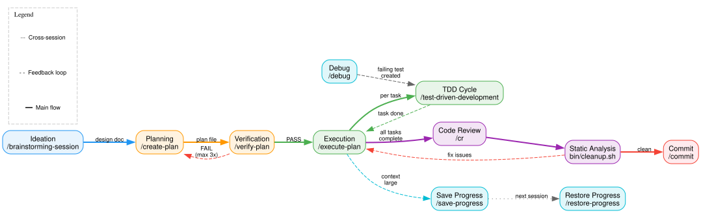
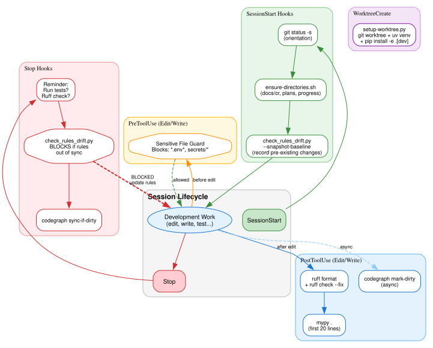
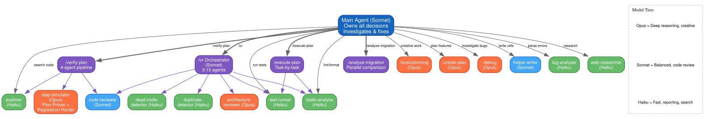
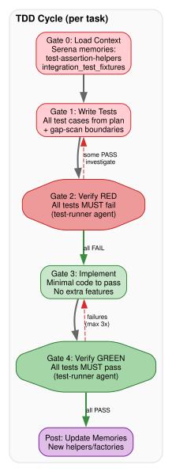
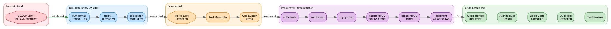
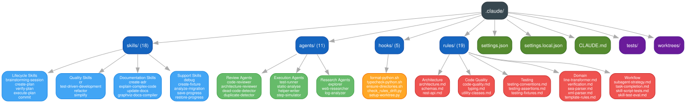
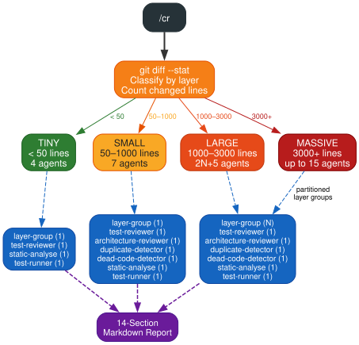
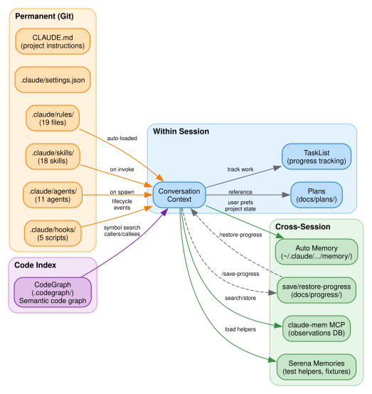
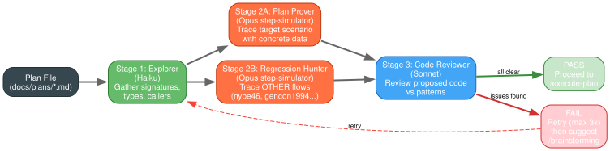

# AI-Assisted Development Workflow Analysis

**Project:** or-migrator | **Date:** 2026-04-02 | **Stack:** Claude Code + custom skills, agents, hooks, rules

---

## 1. Development Lifecycle

The full feature development pipeline — from idea to commit.

| Phase | Skill | Model | Purpose |
|-------|-------|-------|---------|
| Ideation | `/brainstorming-session` | Opus | Structured dialogue: requirements, alternatives, design |
| Planning | `/create-plan` | Opus | 5-phase TDD plan with code scaffolds |
| Verification | `/verify-plan` | Opus+Haiku | 4-agent dry-run before any code is written |
| Execution | `/execute-plan` | Sonnet | Task-by-task with automatic TDD per task |
| Quality | `/cr` + `bin/cleanup.sh` | Dynamic | 3-15 agent code review + static analysis |
| Delivery | `/commit` | Haiku | Conventional commit from diff analysis |

---

## 2. Hook Lifecycle

Automated quality enforcement at every session event.

| Event | Hooks | Blocking? |
|-------|-------|-----------|
| **SessionStart** | git status, ensure dirs, drift baseline | No |
| **PreToolUse** | Block `.env*` / `secrets/*` edits | Yes |
| **PostToolUse** | ruff format + check, mypy, codegraph mark-dirty | No (advisory) |
| **Stop** | Test reminder, rules drift detection, codegraph sync | Yes (drift blocks) |
| **WorktreeCreate** | git worktree + uv venv + pip install | No |

The **drift detector** (`check_rules_drift.py`) prevents stopping when code changes match path-scoped rule files that haven't been reviewed.

---

## 3. Agent Hierarchy & Model Selection

11 agents with deliberate model-tier assignment.

| Tier | Model | Agents | Use For |
|------|-------|--------|---------|
| Deep | **Opus** | brainstorming, create-plan, debug, step-simulator, architecture-reviewer | Creative work, deep reasoning, adversarial testing |
| Balanced | **Sonnet** | code-reviewer, helper-writer, main agent | Code review, implementation, orchestration |
| Fast | **Haiku** | test-runner, static-analyse, explorer, log-analyzer, dead-code, duplicate, web-researcher | Reporting, searching, fast triage |

**Key principle:** Main agent owns all decisions. Subagents report and execute — they never investigate root causes or make architectural choices.

---

## 4. TDD Cycle

Rigid 4-gate process enforced by `/test-driven-development` skill.

Gate 2 (RED verification) is the critical gate — tests **must fail** before implementation begins. If any test passes unexpectedly, the cycle stops for investigation.

---

## 5. Quality Gates

Multi-layered quality enforcement from edit-time to review-time.

| Layer | Tools | When |
|-------|-------|------|
| **Real-time** | ruff, mypy, codegraph | Every `.py` edit |
| **Pre-edit** | Sensitive file guard | Before any edit/write |
| **Session end** | Rules drift, test reminder | Before stopping |
| **Pre-commit** | `bin/cleanup.sh` (ruff, mypy, radon MI/CC, actionlint) | Before commit |
| **Code review** | `/cr` (3-15 agents: code, arch, dead-code, duplicates, tests) | Before merge |

---

## 6. `.claude/` Directory Map

The full configuration structure — 53 files across 5 categories.

| Directory | Count | Purpose |
|-----------|-------|---------|
| `skills/` | 18 | Slash commands (workflows + orchestrators) |
| `rules/` | 19 | Auto-loaded context (code standards + domain knowledge) |
| `agents/` | 11 | Subagent definitions with model + tool assignments |
| `hooks/` | 5 | Lifecycle automation scripts |
| `tests/` | — | Skill eval benchmarks |

---

## 7. Code Review Scaling (`/cr`)

Dynamic agent dispatch based on change size.

| Tier | Lines Changed | Agents | Composition |
|------|---------------|--------|-------------|
| Tiny | < 50 | 4 | 1 layer-group + test-reviewer + static + test-runner |
| Small | 50-1000 | 7 | + architecture + duplicate + dead-code |
| Large | 1000-3000 | 2N+5 | N layer-group reviewers + 5 specialized |
| Massive | 3000+ | up to 15 | Partitioned layer groups |

---

## 8. Persistence & Memory

Four layers of state persistence across sessions.

| Scope | Mechanism | Examples |
|-------|-----------|---------|
| **Within session** | TaskList, Plans, Context | Progress tracking, plan reference |
| **Cross-session** | save/restore-progress, claude-mem, Serena, auto-memory | Observations, test helpers, user prefs |
| **Permanent (Git)** | rules, skills, agents, hooks, CLAUDE.md | Standards, workflows, agent definitions |
| **Code index** | CodeGraph (.codegraph/) | Semantic symbol graph, callers/callees |

---

## 9. Plan Verification Pipeline (`/verify-plan`)

4-stage adversarial verification before any implementation.

Two parallel Opus simulators trace concrete data through the plan:
- **Plan Prover** — traces the target scenario with real values
- **Regression Hunter** — traces existing flows (nype46, gencon1994...) through changed code

Auto-retries up to 3 times on failure before suggesting a return to brainstorming.

---

## 10. Key Design Principles

1. **Main agent owns all decisions** — subagents report, orchestrators dispatch
2. **Context protection** — heavy work delegated to subagents to preserve main context window
3. **Documentation-code sync** — drift detection blocks session end when rules are stale
4. **TDD is structural** — Gate 2 (RED) is mandatory, not optional
5. **Plan-verify-execute** — no implementation without verified plan
6. **Model-tier optimization** — Opus for reasoning, Sonnet for code, Haiku for speed
7. **Progress persistence** — save/restore enables multi-session work
8. **Automated quality gates** — every edit triggers format + typecheck automatically
