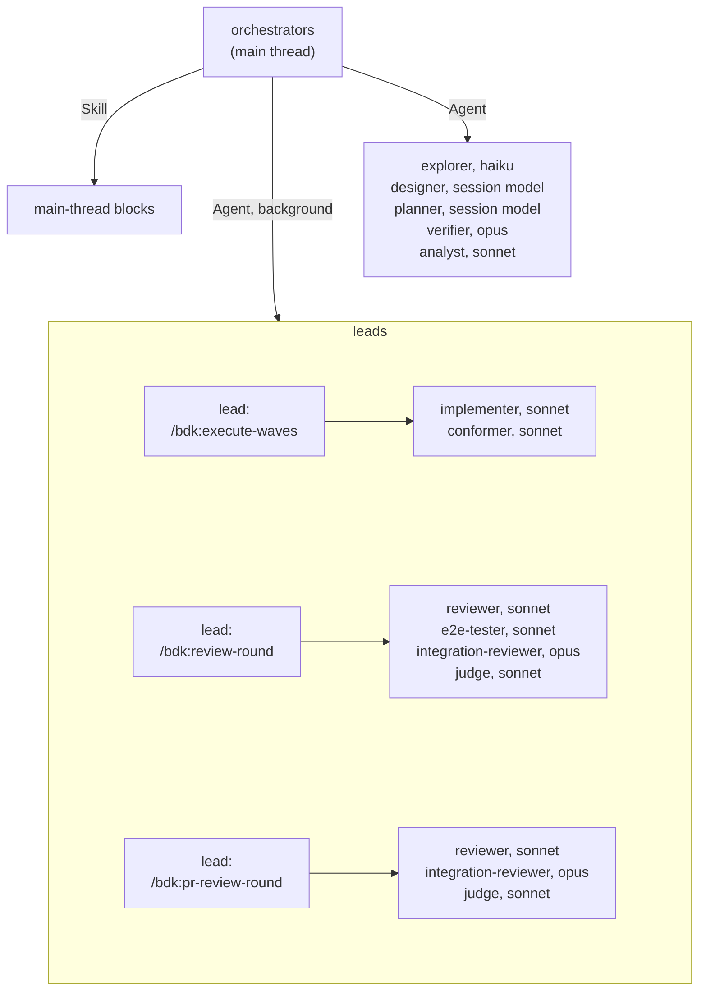

# Blocks and agents - who writes, who checks, who composes

One block, one job: an author block writes, a verifier block checks, an orchestrator or a lead composes. This page shows which agent runs which block and on which model.

Notation in the diagrams: see the [glossary](./glossary.md#notation-in-the-diagrams).

## Who starts whom

The main thread (an orchestrator) starts leads and single agents; a lead starts workers as foreground `Agent` calls. Every `Agent` call a BDK skill makes names its run mode: `run_in_background: false` for an agent the caller waits for, so the host never starts a worker in the background and a lead never waits on one by polling; only a lead started under `execution.lead: background` gets `run_in_background: true`. A block that runs in the main thread is called with the `Skill` tool.

`bdk:reviewer`, `bdk:integration-reviewer`, `bdk:judge` and `bdk:e2e-tester` have their skill preloaded through the `skills:` frontmatter; the other agents call the skill their prompt names with the `Skill` tool. Every block skill that is typed by a user in the main thread starts its own agent instead of doing the work (its step 0), so the author never checks its own work.

## Roles

| Block | Role | Runs on (default model) | Writes | Reads |
|---|---|---|---|---|
| `/bdk:explore` | author (map) | `bdk:explorer` (haiku) | `R/design/explore.md` | proposal, code |
| `/bdk:design-draft` | author | `bdk:designer` (session's model) | `C/specs/**/spec.md`, `C/design.md` | proposal, explore map, last `verify-N.md` |
| `/bdk:verify-design` | verifier | `bdk:verifier` (opus) | `R/design/verify-N.md` | proposal, specs, design, explore map, code |
| `/bdk:plan-draft` | author | `bdk:planner` (session's model) | `C/plan/parts/NN.md` | proposal, specs, design, code, last `verify-N.md` |
| `/bdk:verify-plan` | verifier | `bdk:verifier` (opus) | `R/plan/verify-N.md` | parts, specs, design, code |
| `/bdk:execute-waves` | lead | `bdk:lead` (sonnet) | `R/state.json`, `R/execute/result.md`, commits, merges | parts, worker reports |
| `/bdk:implement-part` | author (code) | `bdk:implementer` (sonnet) | product code and tests, `R/execute/part-NN.md` | part, specs, design, rules, `CLAUDE.md` |
| `/bdk:conform-part` | verifier that fixes without changing behaviour | `bdk:conformer` (sonnet) | `R/execute/conform-NN.md`, behaviour-neutral edits | diff, rules, instructions, tasks |
| `/bdk:resolve-conflict` | author | `bdk:implementer` (sonnet) | conflicted files, `R/execute/merge-NN.md` | both sides, parts |
| `/bdk:review-round` | lead | `bdk:lead` (sonnet) | `round-N/groups.json`, `round.md` | worker replies |
| `/bdk:review-group` | verifier | `bdk:reviewer` (sonnet) | finding events | group files, part, scenarios, review rules, project instructions |
| `/bdk:review-integration` | verifier | `bdk:integration-reviewer` (opus) | finding events | whole Change, group findings |
| `/bdk:e2e-check` | verifier | `bdk:e2e-tester` (sonnet) | `R/review/round-N/e2e/` (`R/e2e/` alone), finding events | the proposal, the running product |
| `/bdk:judge` | verifier | `bdk:judge` (sonnet) | level events, `round-N/review.md` | findings, code, scenarios, cited rules and instructions |
| `/bdk:triage` | decider | main thread | decision events, `review.md` refresh | judged findings |
| `/bdk:plan-fixes` | author | main thread | `round-N/fixes/parts/NN.md`, `fixes/index.md` | fix decisions, code |
| `/bdk:spec-conformance` | verifier | `bdk:verifier` (opus) | `R/close/spec-conformance.md` | spec deltas, main specs, diff, E2E results |
| `/bdk:diagnose-run` | verifier (of a finished run) | `bdk:analyst` (sonnet) | `R/diagnostics.md` | run files, host transcripts through `bdk diagnostics report` |
| `/bdk:diagnose-bug` | author | main thread | fix Change, `R/debug/*.md` | bug report, product, code |
| `/bdk:commit` | tool | main thread | git commits | diff, commit convention |
| `/bdk:adr` | tool | main thread | one ADR file | design decision or text |

The model and effort of each agent can be overridden with `models.<role>.model` and `models.<role>.effort`, where the role is the agent's name (`lead`, `explorer`, `designer`, `planner`, `verifier`, `implementer`, `conformer`, `reviewer`, `integration-reviewer`, `e2e-tester`, `judge`, `analyst`); every stage that starts the agent passes them, so `models.verifier` sets the verifier of `/bdk:design`, `/bdk:plan` and `/bdk:close` alike. See [CLI, configuration and hooks](./cli-config-hooks.md#configuration-bdk-settings-yaml).

## Sources

- `plugins/bdk/agents/*.md` (frontmatter `model`, `skills`, `tools`)
- `plugins/bdk/skills/*/SKILL.md` (step 0 of each block)
