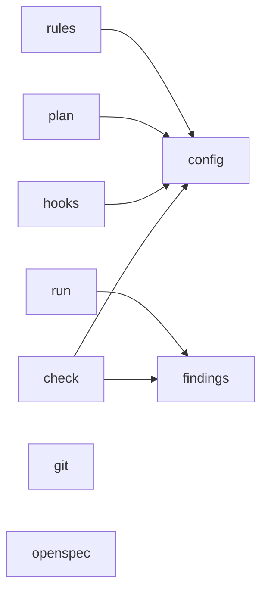
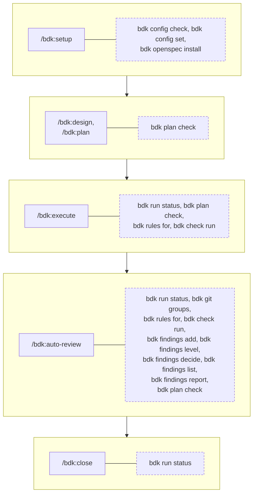
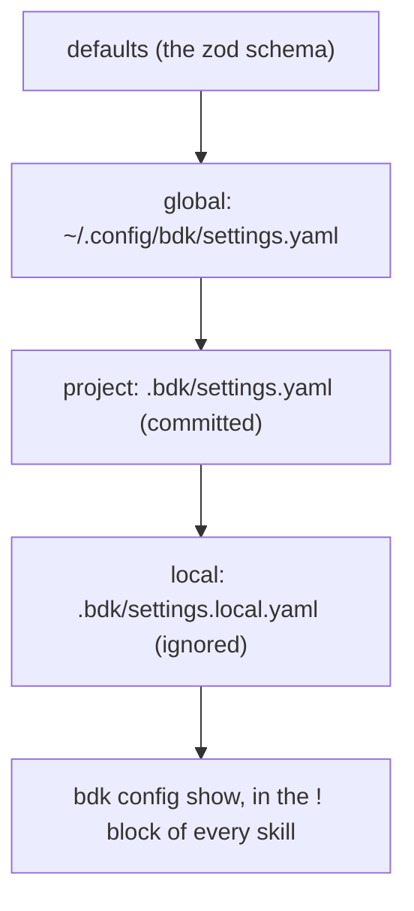
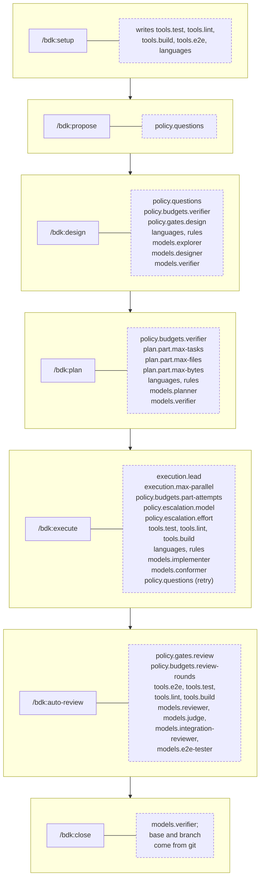
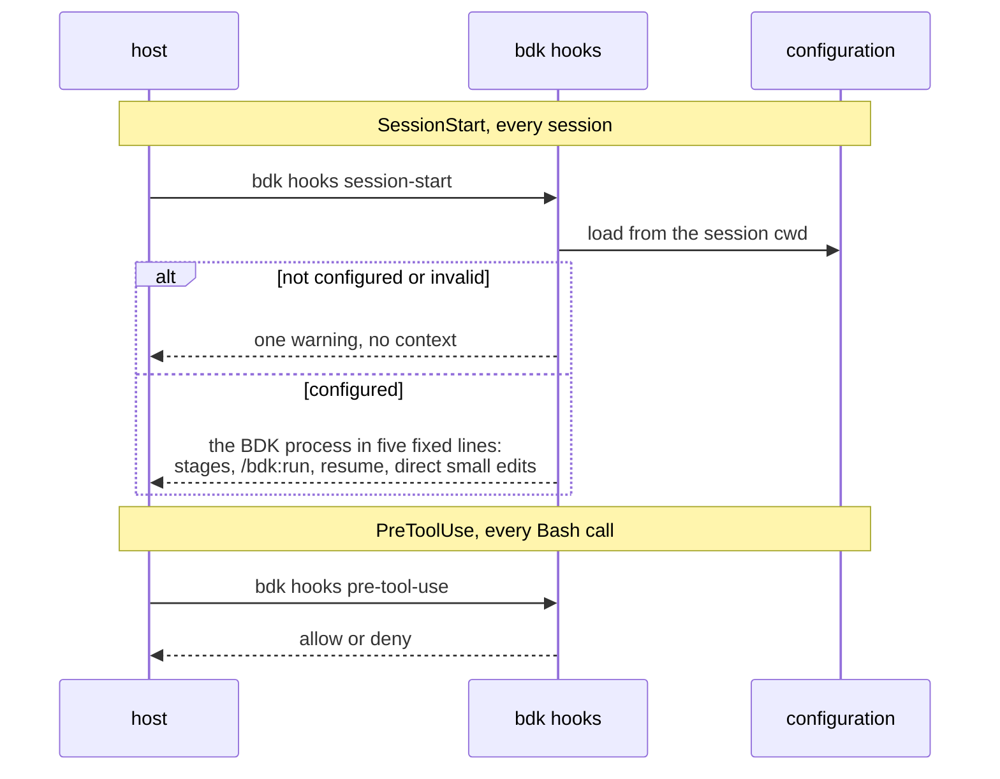
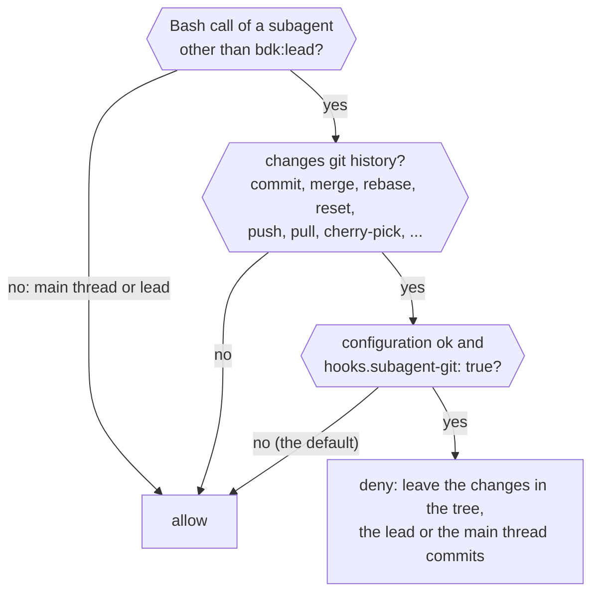

# CLI, configuration and hooks - how the helpers serve the skills

The skills hold the logic; the `bdk` CLI computes and saves turns, `.bdk/settings.yaml` steers the stages, and two hooks add context and an optional guard. This page maps them onto the workflow; the full lists are in the reference: [CLI](/reference/bdk/cli), [settings](/reference/bdk/settings), [hooks](/reference/bdk/hooks).

Notation in the diagrams: see the [glossary](./glossary.md#notation-in-the-diagrams).

## The `bdk` CLI

The CLI computes and saves turns; it never decides the order of the work. Each command group is one vertical slice under `src/`, and a slice may import only the slices listed in `src/slices.ts`:

Which skill calls which command. Every skill that reads the configuration also runs `bdk config show` in its `!` block; `/bdk:commit` and `/bdk:adr` read none. What each command does and its options are in the [CLI reference](/reference/bdk/cli). The main session reaches the read commands through `/bdk:cli`, a thin skill that maps a question to the command and sends work to the stage skill; a test (`scripts/cli-skill.test.ts`) fails when a command is added, renamed or removed without the skill following.

| Command | Called by |
|---|---|
| `bdk config show` | every skill but `/bdk:commit` and `/bdk:adr` |
| `bdk config check`, `bdk config set` | `/bdk:setup` |
| `bdk openspec install` | `/bdk:setup` |
| `bdk run status` | `/bdk:run`, `/bdk:execute`, `/bdk:auto-review`, `/bdk:close` |
| `bdk plan check` | `/bdk:plan`, `/bdk:plan-draft`, `/bdk:verify-plan`, `/bdk:plan-fixes`, `/bdk:diagnose-bug`, `/bdk:execute-waves` |
| `bdk rules for` | `/bdk:design-draft`, `/bdk:verify-design` (stage `design`); `/bdk:plan-draft`, `/bdk:verify-plan` (stage `plan`); `/bdk:implement-part`, `/bdk:conform-part` (stage `execute`); `/bdk:review-group`, `/bdk:judge` (stage `review`) |
| `bdk check run` | `/bdk:implement-part`, `/bdk:conform-part`, `/bdk:resolve-conflict`, `/bdk:review-round` |
| `bdk git groups` | `/bdk:review-round`, `/bdk:pr-review-round`; `/bdk:review-group` and `/bdk:review-integration` for a manual round |
| `bdk git scope` | no skill (`bdk git groups` uses the same range logic) |
| `bdk findings add` | `/bdk:review-group`, `/bdk:review-integration`, `/bdk:e2e-check` |
| `bdk findings level` | `/bdk:judge` |
| `bdk findings decide` | `/bdk:triage` |
| `bdk findings list` | `/bdk:judge`, `/bdk:triage`, `/bdk:plan-fixes`, `/bdk:auto-review`, `/bdk:review-round`, `/bdk:pr-review`, `/bdk:review-group`, `/bdk:review-integration`, `/bdk:implement-part` and `/bdk:conform-part` (fix parts) |
| `bdk findings report` | `/bdk:judge`, `/bdk:triage` |
| `bdk hooks session-start`, `bdk hooks pre-tool-use` | `hooks/hooks.json` only |

The same calls along the stages (a stage box stands for its orchestrator and every block it runs; dashed boxes are `bdk` commands):

## Configuration `.bdk/settings.yaml`

Three layers merge, later over earlier; arrays of items merge by `id`. `bdk config show` prints each value with the layer it came from.

Which key steers which stage (dashed boxes hold the keys a stage reads, its blocks included):

The same as a list, key by key; types, defaults and allowed values are in the [settings reference](/reference/bdk/settings).

| Key | Read by |
|---|---|
| `tools.test`, `tools.lint`, `tools.build` | `bdk check run` (in `/bdk:implement-part`, `/bdk:conform-part`, `/bdk:resolve-conflict`, `/bdk:review-round`); `/bdk:setup` writes them |
| `tools.e2e` | `/bdk:e2e-check`, `/bdk:diagnose-bug`; `/bdk:setup` writes it |
| `languages`, `rules` | `bdk rules for` (in the design, plan, execute and review blocks above) |
| `policy.gates.design` | `/bdk:design` (design gate), `/bdk:debug` (fix gate) |
| `policy.gates.review` | `/bdk:triage` |
| `policy.questions` | `/bdk:propose`, `/bdk:design-draft`, `/bdk:execute` (retry), `/bdk:pr-review` (post) |
| `policy.budgets.verifier` | `/bdk:design`, `/bdk:plan` |
| `policy.budgets.part-attempts` | `/bdk:execute-waves` |
| `policy.budgets.review-rounds` | `/bdk:auto-review`, `/bdk:triage` |
| `policy.escalation.model`, `policy.escalation.effort` | `/bdk:execute-waves` |
| `plan.part.max-tasks`, `plan.part.max-files`, `plan.part.max-bytes` | `bdk plan check`, `/bdk:plan-draft`, `/bdk:plan-fixes`, `/bdk:diagnose-bug` |
| `execution.lead` | `/bdk:execute`, `/bdk:auto-review`, `/bdk:pr-review` |
| `execution.max-parallel` | `/bdk:execute-waves`, `/bdk:review-round`, `/bdk:pr-review-round` |
| `models.<role>.model`, `models.<role>.effort` for the roles `lead`, `explorer`, `designer`, `planner`, `verifier`, `implementer`, `conformer`, `reviewer`, `integration-reviewer`, `e2e-tester`, `judge` | the `Agent` call that starts that role (`model` and `effort`) |
| `hooks.subagent-git` | `bdk hooks pre-tool-use` |

## Hooks

Both hooks run the bundled CLI, `node "${CLAUDE_PLUGIN_ROOT}/dist/bdk.mjs" hooks <event> -`, with the host's payload on stdin and a 10 second timeout. The [hooks reference](/reference/bdk/hooks) lists their input and output.

In a configured project the session start context tells the main session how work is done there, before any skill runs: work with behaviour to specify goes through the stages `/bdk:propose`, `/bdk:design`, `/bdk:plan`, `/bdk:execute`, `/bdk:auto-review` and `/bdk:close`; `/bdk:run` carries it to a pull request, `/bdk:debug` fixes a bug that needs diagnosis and `/bdk:pr-review` reviews a pull request; a stage that stopped continues when its command runs again; a small edit you can see whole is done directly. The text is the same in every project and reads neither the settings nor the run state. How to use the `bdk` CLI itself is not in it.

The `PreToolUse` guard denies only when all four hold, checked cheapest first so most calls never touch the file system:

Without the guard, the rule still holds by instruction: the `implementer`, `conformer` and other worker agents are told never to run `git commit`, `add`, `stash`, `reset`, `merge` and the like, and `/bdk:execute-waves` stops when a worker wrote outside its work directory.

## Sources

- `plugins/bdk/src/main.ts`, `plugins/bdk/src/slices.ts`, `plugins/bdk/src/*/commands/`
- `plugins/bdk/src/config/domain/settings.ts` (the settings schema)
- `plugins/bdk/hooks/hooks.json`, `plugins/bdk/src/hooks/`
- `plugins/bdk/skills/*/SKILL.md` (the commands and keys each skill uses)
