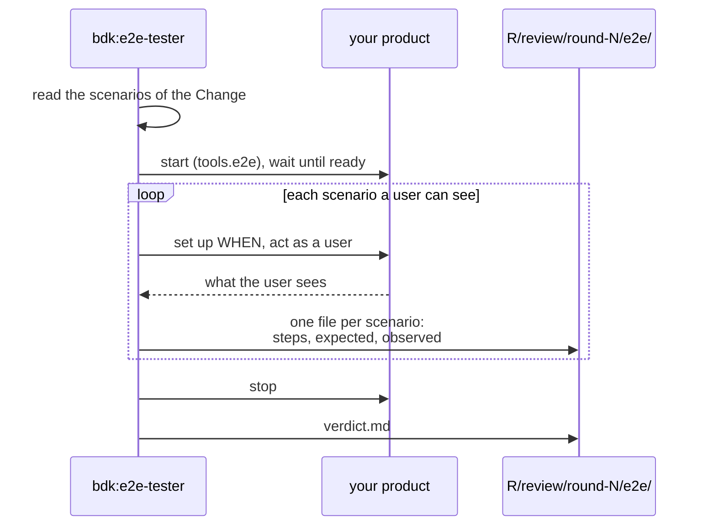

# E2E checks - BDK uses your product the way its user would

Code review and tests show that the code is sound. They do not show that the product does what the Change promised. The E2E check does: an agent, `bdk:e2e-tester`, starts your product, uses it through its real interface, and compares what it sees with every spec scenario of the Change. It acts as a manual tester: it changes no product file and writes no test.

## When it runs

- In every review round of `/bdk:auto-review`, next to the reviewers and your checks. A broken scenario becomes a finding, usually a `blocker` ([findings](./findings.md)).
- `/bdk:diagnose-bug` in `/bdk:debug` starts the product the same way, through a `tools.e2e` item, to reproduce a bug before any fix.
- On its own: `/bdk:e2e-check <change>`.

`/bdk:close` reads its verdict when it checks the product against the specs.

## How it reaches your product

`/bdk:setup` writes one `tools.e2e` item per runnable product. Each says how to start it, when it is ready and how a user reaches it:

```yaml
tools:
  e2e:
    - id: web
      start: pnpm dev                 # runs in the background
      ready: http://localhost:5173    # a URL that answers, or a command that exits 0
      driver: browser                 # cli, http or browser
```

| Driver | The tester | Evidence |
|---|---|---|
| `cli` | runs the commands in a fresh temporary directory, as a user in their own folder | each command with its exit code and output |
| `http` | sends the requests with `curl` | status, headers that matter, body |
| `browser` | drives a browser with small Playwright scripts it writes and runs one at a time (or with `chrome-devtools-mcp`, by `tools.e2e.<id>.browser`), then replays each scenario once with video on | what the page shows, a screenshot at each THEN, a video |

Before it starts a server, the tester checks the `ready` URL: when something already answers on that port, it does not start or drive anything and reports the run as blocked, so it never tests the wrong process. It stops everything it started when it is done.

## A run



A scenario about code structure or internals, which no user sees, is marked `not-driven` with the reason. Each scenario gets one result: `pass`, `fail`, `blocked` or `not-driven`. Every `fail` and every product that does not start becomes one finding with the evidence file.

## Reading the result

The evidence lands in `.bdk/runs/<change>/review/round-N/e2e/` when a review round runs the check, and in `.bdk/runs/<change>/e2e/` when you run it alone; `/bdk:close` and `/bdk:spec-conformance` read the latest. `verdict.md` holds the verdict (`PASS`, `FAIL`, `BLOCKED` or `SKIPPED`) and one line per scenario; each `<scenario>.md` holds the steps, what was expected and what was observed, and for a browser the screenshots and the video.

For a browser item the tester uses your project's own Playwright when it resolves, otherwise it installs Playwright 1.63.0 for the run into the run directory; it launches Playwright's Chromium, else your system Chrome. `/bdk:setup` checks for both and offers to install `@playwright/test` and Chromium.

The check is `SKIPPED` when the project has no `tools.e2e` item or the Change has no scenarios. Add an item with `/bdk:setup add the e2e entry`.

## Sources

- `plugins/bdk/skills/e2e-check/` (and its `references/drivers.md`), `plugins/bdk/agents/e2e-tester.md`
- `plugins/bdk/skills/setup/references/e2e.md`
