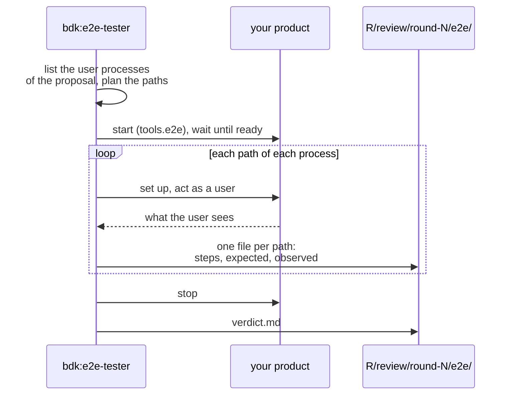

# E2E checks - BDK uses your product the way its user would

Code review and tests show that the code is sound. They do not show that the product does what the Change promised. The E2E check does: an agent, `bdk:e2e-tester`, starts your product, uses it through its real interface, and confirms as a user that the change works the way its proposal says. It acts as a manual tester: it changes no product file and writes no test.

The spec scenarios of the Change are not replayed here: the implementer writes one test per acceptance scenario, so your own test suite proves them. The tester asks what a test cannot: does the change work when someone uses it, and what happens when they use it wrong?

## What it drives

The tester reads the Change's `proposal.md` and lists the **user processes** it adds or changes: one goal a user sets out to reach and sees the result of (`export-notes`, `see-the-total`). A line of the proposal that changes nothing a user does (a refactor, a module, a dependency) is listed under `## Not a user process` with its reason and is not driven. `design.md` and the spec deltas are read only to make the expected values exact: the text, the exit code, the status.

Per process it drives up to 5 **paths**, with no cap over the whole Change, so a larger Change gets more processes, not thinner ones:

| Kind | What it is |
|---|---|
| `main` | the process as the proposal describes it |
| variant | another state or input the proposal, the design or a delta names, or a user plainly meets: nothing there yet, many items, a second run |
| `break` | at least one per process: wrong or missing input, wrong order, a repeated, quick or interrupted action |

Every path names the proposal line it comes from. A `break` path whose outcome the Change does not state is held to what every user expects: the product refuses or handles it visibly (a message that names the problem, a non-zero exit, a 4xx status, an error on the page), shows no crash or stack trace, loses no data, and still works afterwards.

## When it runs

- In every review round of `/bdk:auto-review`, after the reviewers and your checks of the `review` point have ended, so your suites and the started product never compete for the same ports or browsers. A broken path becomes a finding, usually a `blocker` ([findings](./findings.md)).
- `/bdk:diagnose-bug` in `/bdk:debug` starts the product the same way, through a `tools.e2e` item, to reproduce a bug before any fix.
- On its own: `/bdk:e2e-check <change>`.

`/bdk:close` reads its verdict when it checks the product against the specs.

## How it reaches your product

`/bdk:setup` writes one `tools.e2e` item per runnable product. Each says how to start it, when it is ready and how a user reaches it:

```yaml
tools:
  e2e:
    - id: web
      start: pnpm dev                 # runs in the background
      ready: http://localhost:5173    # a URL that answers, or a command that exits 0
      driver: browser                 # cli, http or browser
```

| Driver | The tester | Evidence |
|---|---|---|
| `cli` | runs the commands in a fresh temporary directory, as a user in their own folder; for a Claude Code plugin (item `plugin`, `ready: claude plugin validate <dir>`), a session there: `claude -p "<what the user types>" --plugin-dir <dir>`, one model call per path | each command with its exit code and output |
| `http` | sends the requests with `curl` | status, headers that matter, body |
| `browser` | drives a browser with small Playwright scripts it writes and runs one at a time (or with `chrome-devtools-mcp`, by `tools.e2e.<id>.browser`), then replays each path once with video on | what the page shows, a screenshot at each expected outcome, a video |

Before it starts a server, the tester checks the `ready` URL: when something already answers on that port, it does not start or drive anything and reports the run as blocked, so it never tests the wrong process. It stops everything it started when it is done.

## A run



A process that no `tools.e2e` item reaches is marked `not-driven` with the reason. Each path gets one result: `pass`, `fail`, `blocked` or `not-driven`. Every `fail` becomes one finding that points at the proposal line the path comes from (`proposal.md:7`), with the evidence file; a product that does not start is one finding too.

## Reading the result

The evidence lands in `.bdk/runs/<change>/review/round-N/e2e/` when a review round runs the check, and in `.bdk/runs/<change>/e2e/` when you run it alone; `/bdk:close` and `/bdk:spec-conformance` read the latest. A later review round whose fixes changed only test files does not run the check again after a `PASS` or `SKIPPED` verdict: it writes no `e2e/`, so the latest verdict stays the one that checked this product, and its `round.md` says so. `verdict.md` holds the verdict (`PASS`, `FAIL`, `BLOCKED` or `SKIPPED`), then one section per process with one line per path, and the proposal lines that are not a user process:

```markdown
Verdict: FAIL

## export-notes
- pass: main (main, proposal.md:7) - export-notes--main.md
- fail: empty-notebook (variant, proposal.md:7) - export-notes--empty-notebook.md
- pass: unknown-format (break, proposal.md:8) - export-notes--unknown-format.md

## Not a user process
- proposal.md:9 - the serializer moves into one module; no user sees it
```

Each `<process>--<path>.md` holds the proposal line, the steps, what was expected (and from where) and what was observed, and for a browser the screenshots and the video.

For a browser item the tester uses your project's own Playwright when it resolves, otherwise it installs Playwright 1.63.0 for the run into the run directory; it launches Playwright's Chromium, else your system Chrome. `/bdk:setup` checks for both and offers to install `@playwright/test` and Chromium.

The check is `SKIPPED` when the project has no `tools.e2e` item, or when the proposal changes nothing a user does. Add an item with `/bdk:setup add the e2e entry`.

## Sources

- `plugins/bdk/skills/e2e-check/` (and its `references/drivers.md`), `plugins/bdk/agents/e2e-tester.md`
- `plugins/bdk/skills/setup/references/e2e.md`
