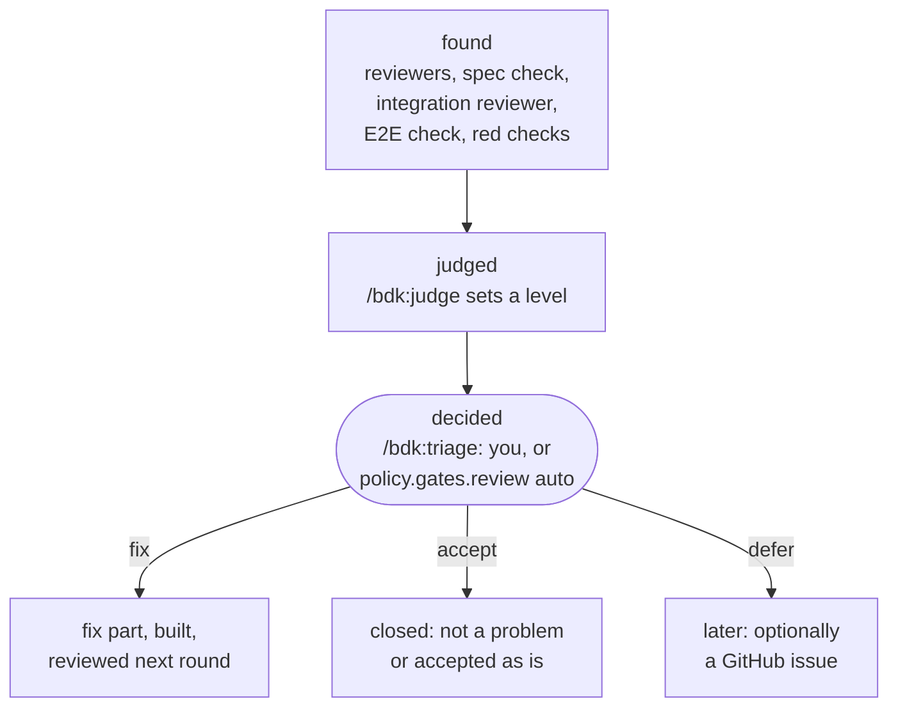

# Findings - what a review round reports, how it is judged and decided

A finding is one problem a review round found: a place, a summary, the evidence, and what it breaks when it breaks a rule or an instruction: a [rule](./rules.md) id, or the path of a project instruction file such as `CLAUDE.md`. Every finding goes through three steps, each by a different role: found, judged, decided.

## Where findings come from

| Source | Looks at |
|---|---|
| `/bdk:review-group` on `bdk:reviewer`, one per group of files | the diff of its group, against the rules for those files (`bdk rules for`), your project instructions on the way to them, and the Change |
| `/bdk:spec-conformance --round` on `bdk:verifier` | the spec deltas against the product, as `/bdk:close` checks them before the archive: a scenario or requirement the code breaks, behaviour (an error message, an option) no delta describes; the finding sits where the fix goes, in the code or in the delta |
| `/bdk:review-integration` on `bdk:integration-reviewer` | the whole diff: what breaks between the groups |
| `/bdk:e2e-check` on `bdk:e2e-tester` | the running product, along the paths of each user process the proposal adds or changes; a finding points at the proposal line |
| `bdk check run` | your test, lint and build commands; a red check is a finding |

Reviewers only report: they change no code and decide nothing.

## Levels

`/bdk:judge` traces each finding through the code and sets one level, by what the product does:

| Level | When |
|---|---|
| `blocker` | the product breaks a spec scenario or the intent of the Change; the specs would not describe the product after archive (a spec check finding that holds, even when the product works: close would refuse it); a check is red; a security hole; data loss; a regression |
| `should-fix` | the product works, but the change breaks a rule or a project instruction, or has a concrete maintenance cost |
| `nice-to-have` | an improvement whose absence costs nothing concrete |
| `not-a-problem` | the failure scenario does not hold, it is out of the Change's scope, already handled, or a duplicate |

A rule broken alone is never a `blocker`. A finding whose failure does not hold is `not-a-problem`, not a lower level.

## Decisions

`/bdk:triage` gives each judged finding one decision: `fix`, `accept` or `defer` (a deferred finding can carry a GitHub issue, an existing one or one BDK creates). The policy below is what BDK recommends; with `policy.gates.review: auto` it decides that way without asking.

| Level | Recommended decision | In the last round the budget allows |
|---|---|---|
| `blocker` | `fix` | `fix` |
| `should-fix` | `fix` | `defer` |
| `nice-to-have` | `defer` | `defer` |
| `not-a-problem` | `accept` | `accept` |

With `policy.gates.review: manual` (the default) BDK asks you about every finding in one go, blockers first, each with its evidence, the judge's reason and the recommendation preselected. It opens a page where you pick per finding; when it cannot open one, it asks in the terminal. A finding you do not answer stays undecided, and the review waits for it.

## After the decisions

Findings decided `fix` become fix parts (`/bdk:plan-fixes`), built by the execute lead like any plan part. A finding that only asks for a missing test of something the code already does becomes a part that adds the test, with its scenario marked ` (behaviour present)`, so the implementer expects the test to pass at once instead of failing first. A fix part may change a spec delta, when the proposal or the design already settles what it must say: the implementer writes no test for it, and the next round's spec check verifies it; a fix that needs a new product decision is left to you. The next round reviews only those fix commits, so a round never re-reviews what was already accepted. The review ends when a round has no `fix` decision; with a `fix` left after `policy.budgets.review-rounds` rounds it ends as blocked.

## Read them yourself

Each round keeps its findings in `.bdk/runs/<change>/review/round-N/`: `findings.jsonl` is the event log every role appends to ([run state](./run-state.md#review-the-findings-event-log)), and `review.md` is the judged round, written by `bdk findings report`. `bdk findings list <log>` prints the current view, and filters such as `--level blocker` narrow it.

## Sources

- `plugins/bdk/skills/review-group/`, `review-integration/`, `e2e-check/`, `judge/`, `triage/`, `plan-fixes/`, `auto-review/`
- `plugins/bdk/src/findings/` (`bdk findings`)
