# Orchestrators - what each BDK command runs, in which order

Each orchestrator composes blocks and agents; the diagrams show the order, the parallel work, the loops, the budgets, the retries and the model escalation.

Notation in the diagrams: see the [glossary](./glossary.md#notation-in-the-diagrams).

Every orchestrator runs in the main thread, starts with a `!` block that runs `bdk config show`, and stops with "BDK not configured: run /bdk:setup" when there is no configuration. Each one writes only its own gate or result file; the blocks write everything else.

## `/bdk:setup`

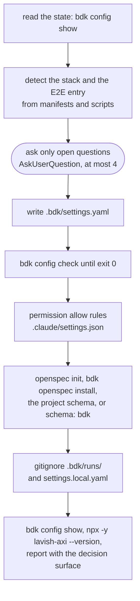

A re-run keeps every value a layer sets and fills only what is missing; an argument such as "add the e2e entry" limits the run to that change.

## `/bdk:propose`

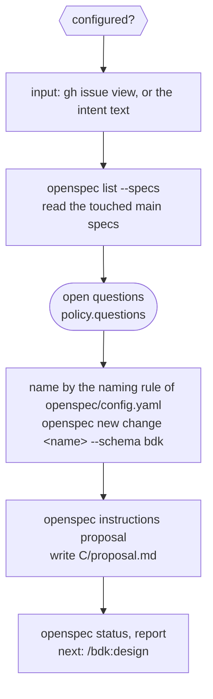

It never commits, branches or writes to GitHub. A Change of no behaviour sets `skip_specs: true` in `.openspec.yaml`.

## `/bdk:design`

Three blocks and a gate. The verifier is one agent continued with `SendMessage` across passes, so it keeps the context of what it checked.

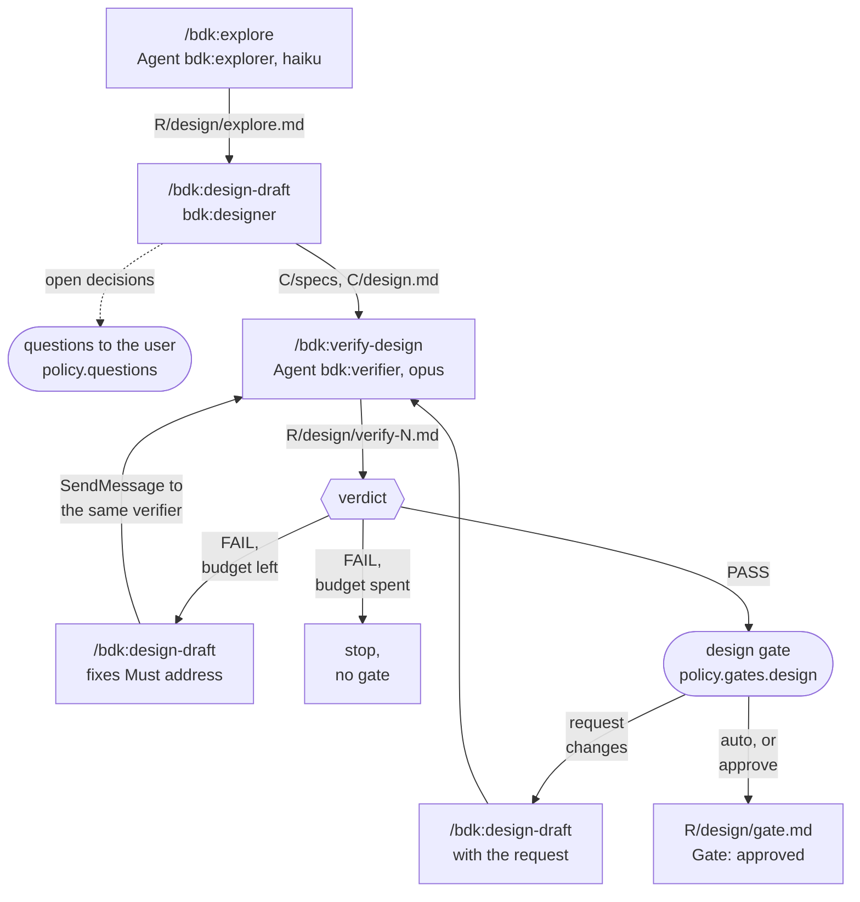

Every block runs in the foreground: `/bdk:design` waits for each one before the next step.

Questions come in rounds, at most three. The designer writes the round's Lavish page, opens it and hands back; `/bdk:design` waits on the page (`lavish-axi poll`) and passes your answers to the same designer. A note on the page that asks for something new opens a decision for the next round; an answered decision is never asked again. When you stop the wait (for a summary, say), the answers you give on the page stay queued, and `/bdk:design <change>` picks them up. Without Lavish the questions come through `AskUserQuestion`, or in the reply.

An answer that adds or drops a capability changes `proposal.md` too: the designer owns that edit and records it in `design.md` as `Scope changed by the user:`. An answer against the issue's acceptance signal or a project rule (`CLAUDE.md`, `.claude/rules/`, the rules of `openspec/config.yaml`) is asked once more, quoting the rule; when you keep it, `design.md` records a `Deviation:` line, which the gate and the report name so you update the issue. BDK does not edit the issue.

The manual gate ends on exactly one question: approve, or say what to change.

The verifier budget is `policy.budgets.verifier` (default 3) passes per run. On a new start, `/bdk:design` skips every step whose file exists:

| Files found | Starts at |
|---|---|
| `gate.md` approved for the last report | nothing: reports the approved design |
| no `explore.md`, no `design.md` | explore |
| no `design.md` | `/bdk:design-draft` |
| no `verify-N.md` | `/bdk:verify-design` |
| last `verify-N.md` is `FAIL` | `/bdk:design-draft` fix, then `/bdk:verify-design` |
| last `verify-N.md` is `PASS` | the gate |

## `/bdk:plan`

"Design finished" means `proposal.md`, at least one spec delta and `design.md` exist, and the last `design/verify-N.md`, when there is one, passes. A later pass continues the same verifier with `SendMessage`. The verifier runs each `bdk` call as a Bash command of its own, so your permission rule for `bdk` covers it; when a call it needs is still denied, it writes no report, and `/bdk:plan` stops and shows the denied command instead of a verdict. On a new start, `/bdk:plan` starts at the draft (no part), the check (parts, no report), the fix (last report `FAIL`) or the report (last report `PASS`).

A gap of the design is a choice about what the product does that the specs and the design leave open: a case a new requirement reaches counts even when no scenario names it, when its answers differ in a way you would care about, such as whether `--out <path>` overwrites a file that already exists. Ordinary input handling that the Change's error rules settle by analogy is the planner's choice, not a gap. `/bdk:plan-draft` names each gap in its reply and decides none; `/bdk:plan` then stops before any verifier pass, quotes the gaps and names `/bdk:design <change>`. Behaviour no requirement of the Change touches is not a gap and stays as the code has it.

## `/bdk:execute` and the `/bdk:execute-waves` lead

`/bdk:execute` is thin: it starts one `bdk:lead` with the stage skill `/bdk:execute-waves` and passes the result on. The lead is the only writer of `state.json` and the only agent that commits and merges.

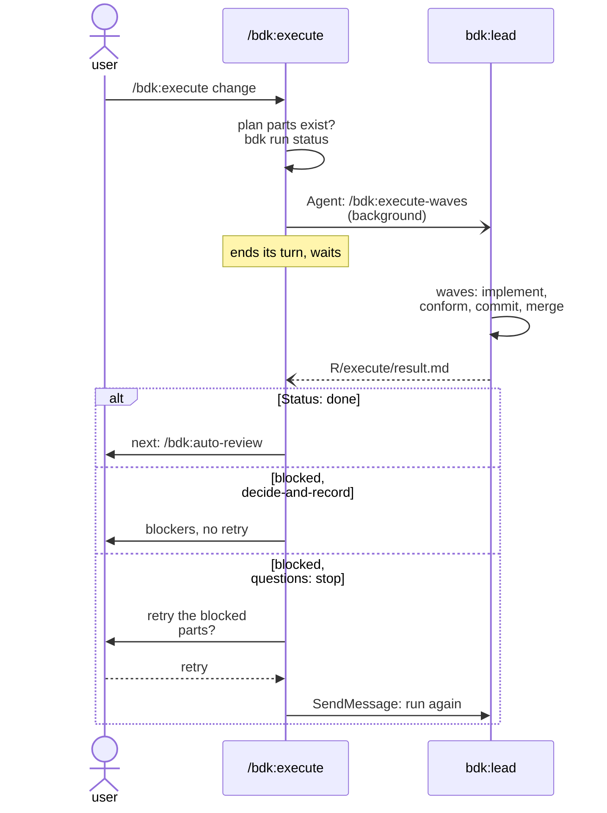

Inside the lead, waves run in order and the parts of a wave run in parallel batches of `execution.max-parallel` (default 10):

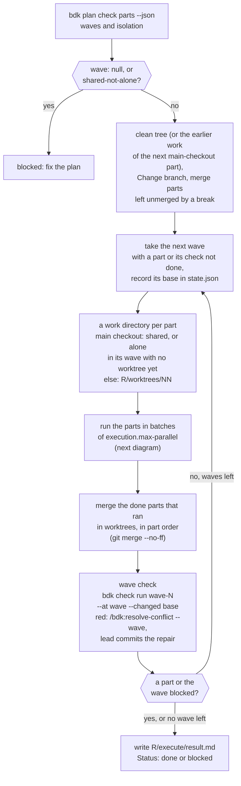

A worktree isolates parts that run at the same time, so only a wave with two or more parts to run uses them. A part that is the only one not done in its wave runs in the main checkout, whatever its `isolation` says: no checkout to make, the project's installed dependencies and warm tool caches, and its commit lands on the Change branch with no merge commit. A part whose worktree or `bdk/<change>/part-NN` branch is left from an earlier run keeps running there, so its earlier work is kept. A part that ran in the main checkout and did not finish leaves its files uncommitted there; the next `/bdk:execute` continues from them, and stops only on changes outside that part's `files`.

Each part of a batch goes through these attempts; the implementers of a batch start in one message, then its conformers. The checks each worker runs are in the boxes; [Where execute runs your checks](#where-execute-runs-your-checks) has the details:

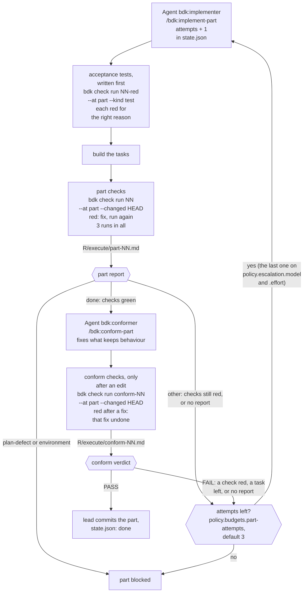

Merging a part that ran in a worktree into the Change branch:

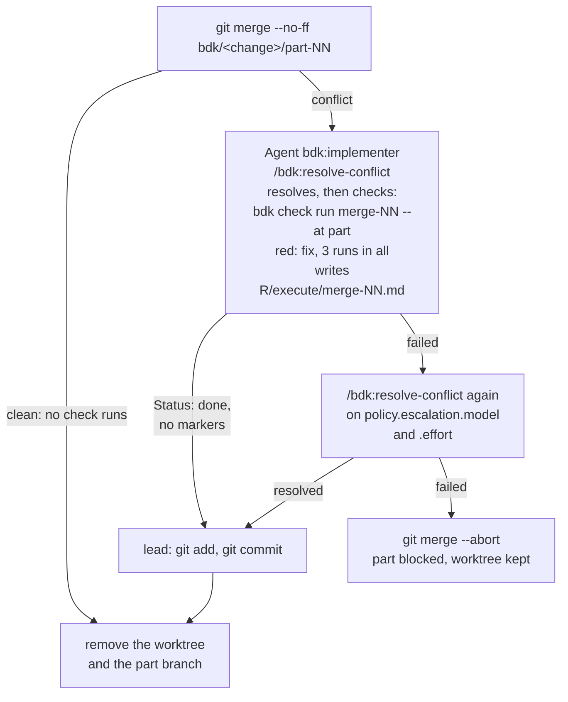

One part, step by step inside its two worker agents:

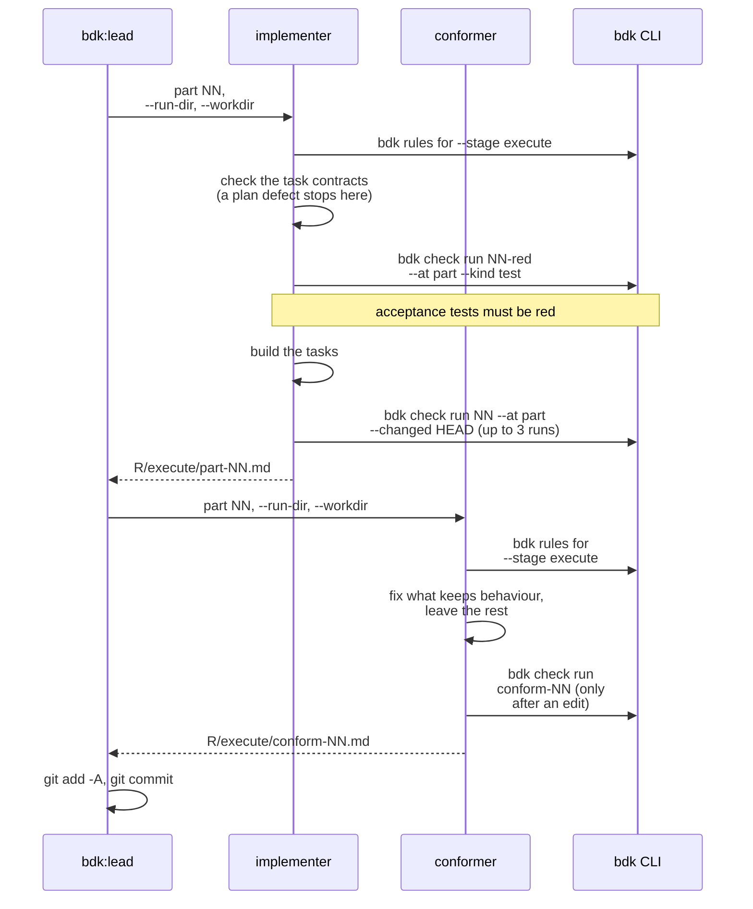

### Where execute runs your checks

Every check of the execute stage is a `bdk check run`, which runs your `tools.test`, `tools.lint` and `tools.build` commands (the [`tools`](/reference/bdk/settings#tools) items) and writes their output and the result under `R/checks/`. No agent runs a test, linter or build command itself. Each run names its check point with `--at`, and runs only the items whose `when` holds that point, plus the items without `when` ([check points](/guide/configuration#a-web-app-with-a-browser-e2e-check)). Five runs, in this order:

| Run | Who, when | Point, files | When it is red |
|---|---|---|---|
| `NN-red` test only | `bdk:implementer`, [`/bdk:implement-part`](/reference/bdk/skills#implement-part) step 4, before any code | `part`, the new acceptance tests | expected: each test must fail because the behaviour is missing, its own failure seen, in the output file when the last 20 lines printed under the red check do not show it; a broken test is fixed and run again. No `tools.test` item at `part` for these files blocks the part (`environment`) |
| `NN` | `bdk:implementer`, step 6, once the tasks are built | `part`, the files changed against `HEAD` | fix and run again, three runs in all; still red, the run ends as a blocker (`other`) and the lead retries the part. No `Status: done` without a green run |
| `conform-NN` | `bdk:conformer`, [`/bdk:conform-part`](/reference/bdk/skills#conform-part) step 5, only when it edited a file | `part`, the files changed against `HEAD` | a fix that broke it is undone; still red, the verdict is `FAIL` and the lead retries the part. With no edit it runs nothing and names `NN` unchanged |
| `merge-NN` | `bdk:implementer`, [`/bdk:resolve-conflict`](/reference/bdk/skills#resolve-conflict), only after a merge conflict | `part`, the conflicted files and the `files` of each part behind them | fix and run again, three runs in all; still red, one more resolve on `policy.escalation.model`, then the merge is aborted and the part blocked |
| `wave-N` | `bdk:lead`, [`/bdk:execute-waves`](/reference/bdk/skills#execute-waves) step 7, once every part of the wave is on the Change branch | `wave`, the files changed since the wave's base | `/bdk:resolve-conflict --wave N` repairs what two parts broke together and the lead commits it; still red, one more repair on `policy.escalation.model`, then the wave is blocked and no later wave starts |

**Which files a run covers.** `--changed <ref>` hands the run the files git reports changed against `<ref>`, untracked ones included. An item whose `command` holds `{files}` gets the changed files its `paths` match, and is skipped when none matches; an item with `paths` and no `{files}` runs its whole command only when one of its files changed; any other item runs its whole command ([configuration](/guide/configuration#examples)). A part that runs in a worktree runs its checks there, on the Change branch as it was when the wave started plus this part; the wave check is the first run on all the parts of a wave together.

**Where a slow suite runs.** Keep the fast checks of the changed files at `part`, the main test suite and the type check at `wave`, and the slow suites, a whole Playwright suite and the build at `review`: the first round of [`/bdk:auto-review`](#bdk-auto-review) runs them (`bdk check run round-N --at review`), where a red check is a `blocker` finding. A Change you take from `/bdk:execute` straight to a pull request has passed its part and wave checks only.

## `/bdk:auto-review`

Rounds and fix passes each run in a fresh `bdk:lead`; triage and fix planning run in the main thread. Round 1 reviews the whole Change, a later round only the fix commits of the round before.

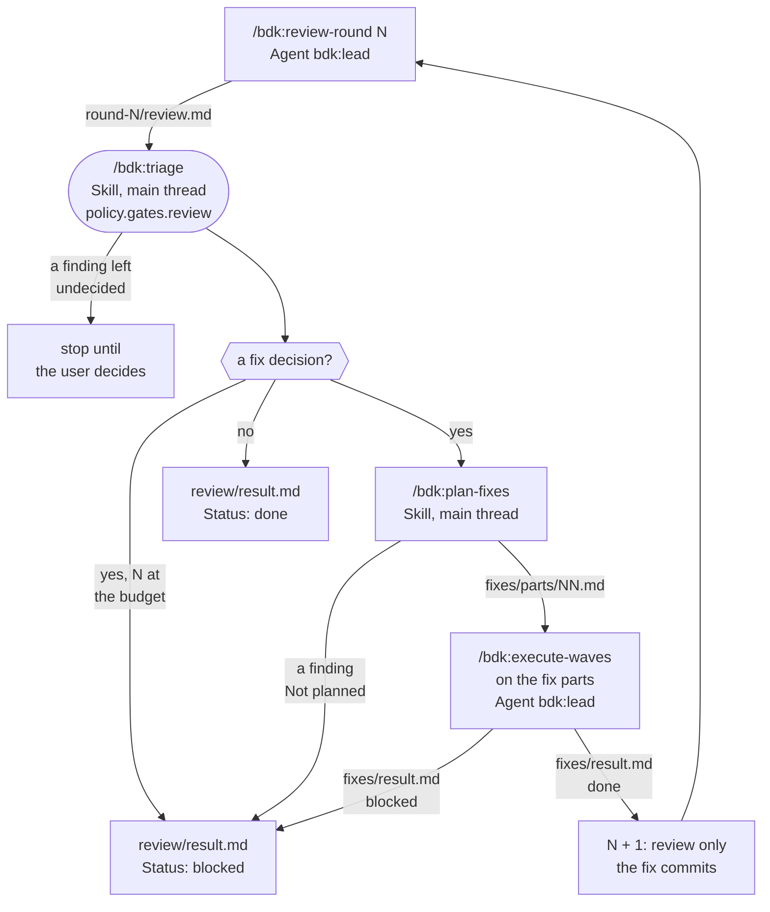

The budget is `policy.budgets.review-rounds` (default 3); at the last round triage runs with `--last-round`.

On a new start, `/bdk:auto-review` finds its place from the files of the last round: no round or a round without `review.md` runs the round, an undecided finding runs triage, a round without `fixes/index.md` plans the fixes, and an unfinished `fixes/result.md` runs the fix pass again.

Triage policy, which decides in auto mode and is the preselected recommendation in manual mode:

| Level (set by the judge) | Decision | With `--last-round` |
|---|---|---|
| `blocker` | `fix` | `fix` |
| `should-fix` | `fix` | `defer` |
| `nice-to-have` | `defer` | `defer` |
| `not-a-problem` | `accept` | `accept` |

## `/bdk:review-round` (lead skill)

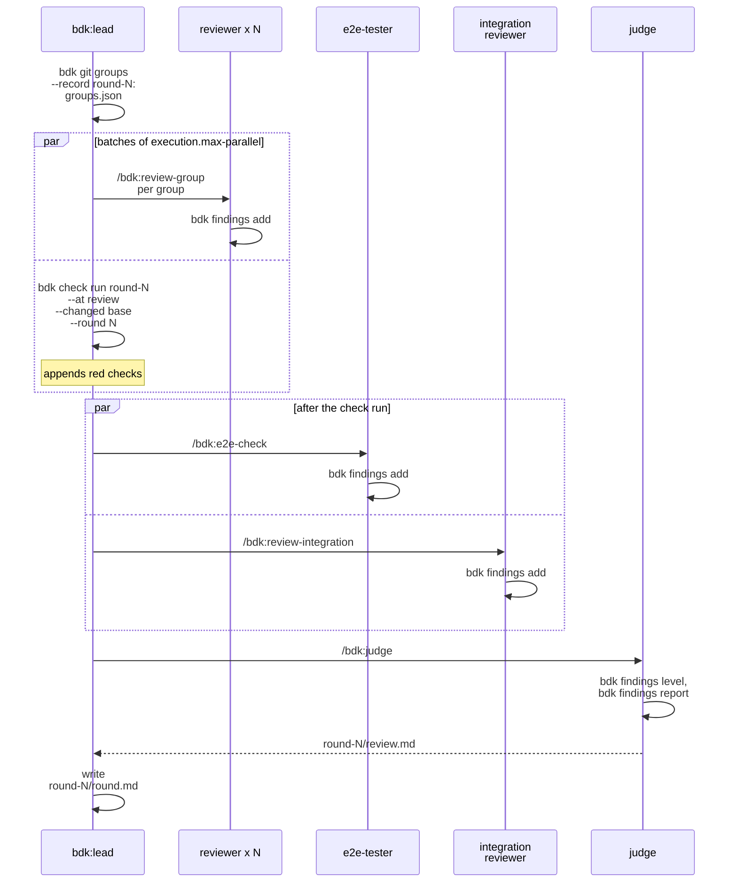

`bdk git groups` gets `--rounds R/review`, so a later round covers only what changed since the round before, and `--plan` with the plan parts (round 1) or the fix parts of the round before, so each group is one part. Every finding lands in `round-N/findings.jsonl`. The E2E tester starts only after the check run has ended, so your suites and the started product never compete for the same ports or browsers. A worker that fails is started once more with the same prompt; a second failure goes under `Gaps` in `round.md`.

## `/bdk:close`

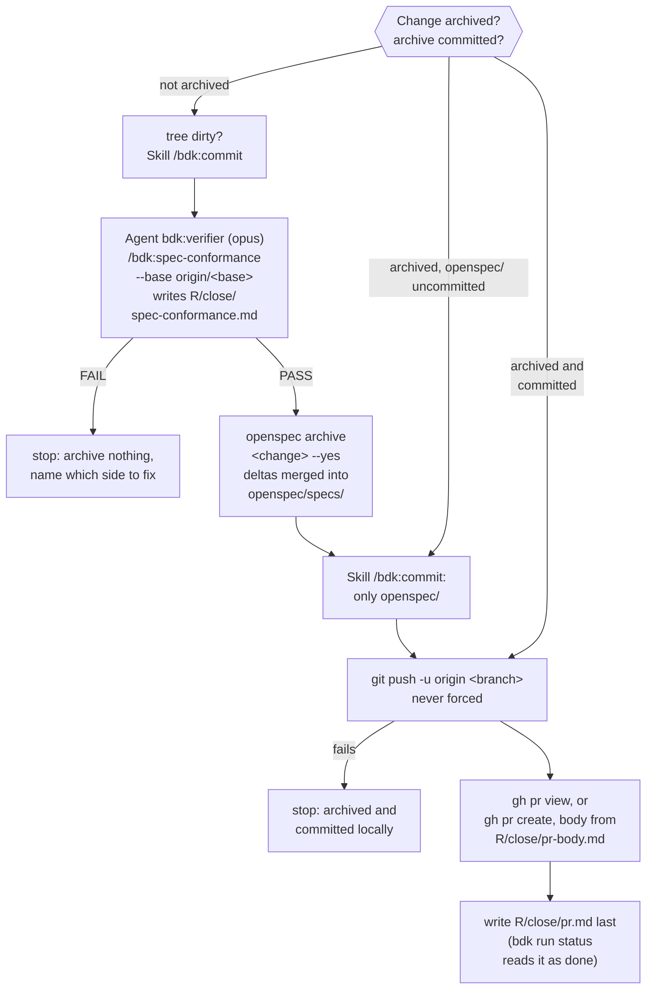

## `/bdk:pr-review` and the `/bdk:pr-review-round` lead

Reviews any open pull request in a detached worktree. It runs no checks and no E2E; nothing reaches GitHub before the user confirms.

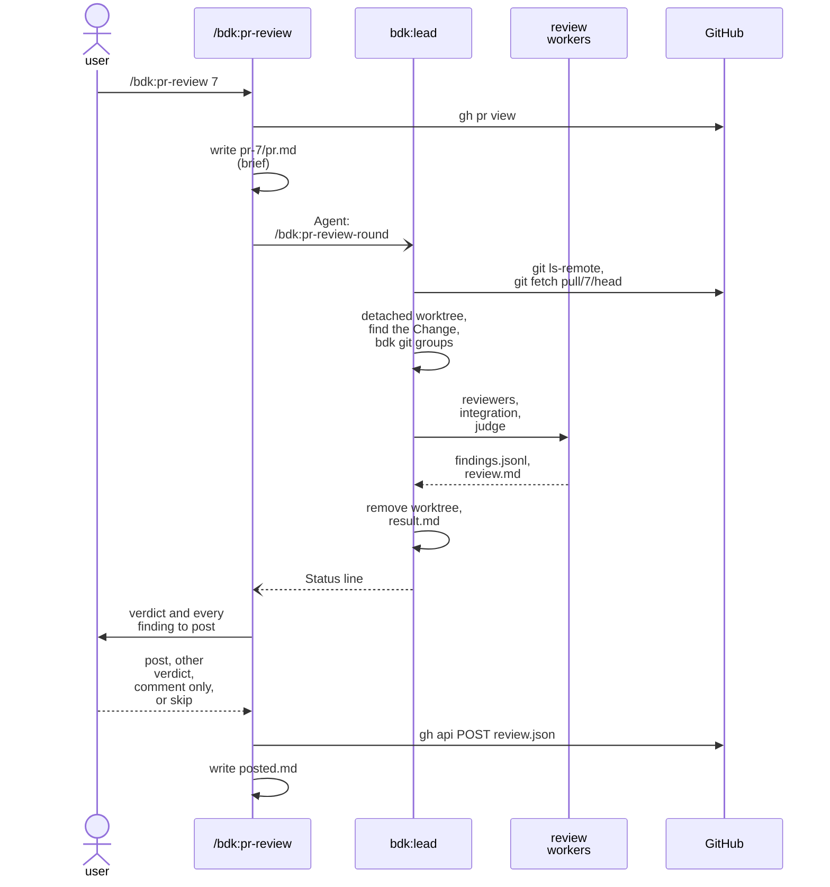

The workers get `--workdir`, `--change` (or `none`) and `--intent pr.md`. The question is skipped under `policy.questions: decide-and-record` or when the request says to post without asking; on your own pull request the review is posted as `COMMENT`.

Several pull requests (`/bdk:pr-review 7 8`) start one lead each in one message, at most `execution.max-parallel`; the reviews are shown when every lead has returned, and one question covers all of them. A lead checks the head with `git ls-remote` and fetches without `FETCH_HEAD`, so leads in one repository do not read each other's head.

`--verify` re-checks your previous review and reviews only the commits added since it:

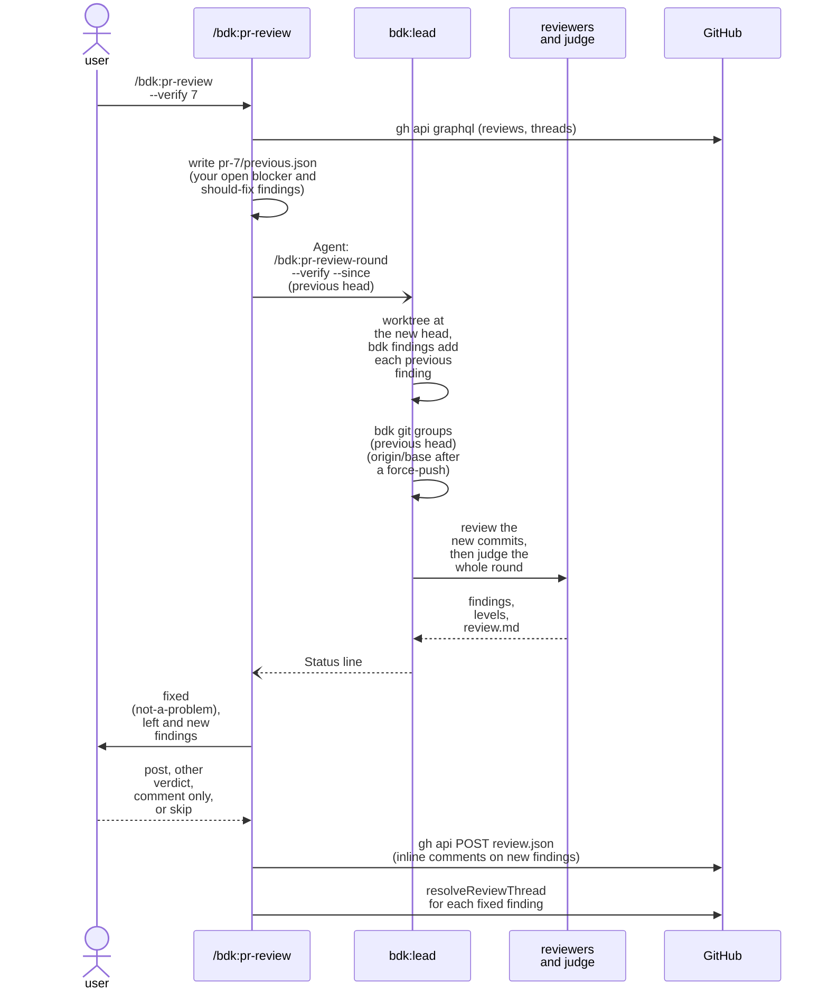

The previous findings go into the round's log before any reviewer starts, and the reviewers, the integration reviewer and the judge then run on the range from the previous review's head to the new head; after a force-push (the previous head is no longer an ancestor) they review the whole pull request. The judge levels the previous and the new findings together, and of two findings that repeat each other it keeps the earlier one. A previous finding the judge now levels `not-a-problem` is fixed; any other level is left. New `blocker` and `should-fix` findings inside the diff become inline comments, as in a review. A left or new `blocker` requests changes. Only threads you opened are resolved, and only after the review is posted.

## `/bdk:debug`

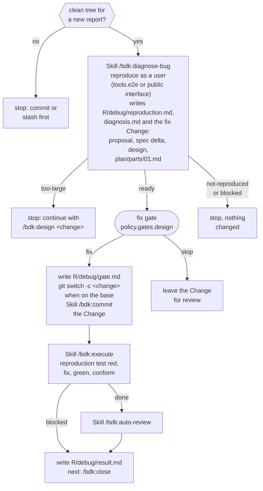

## Sources

- `plugins/bdk/skills/{setup,propose,design,plan,execute,execute-waves,implement-part,conform-part,resolve-conflict,auto-review,review-round,triage,plan-fixes,close,pr-review,pr-review-round,debug,diagnose-bug}/SKILL.md`
- `plugins/bdk/agents/*.md`
