# Orchestrators - what each BDK command runs, in which order

Each orchestrator composes blocks and agents; the diagrams show the order, the parallel work, the loops, the budgets, the retries and the model escalation.

Notation in the diagrams: see the [glossary](./glossary.md#notation-in-the-diagrams).

Every orchestrator runs in the main thread, starts with a `!` block that runs `bdk config show`, and stops with "BDK not configured: run /bdk:setup" when there is no configuration. Each one writes only its own gate or result file; the blocks write everything else.

## `/bdk:setup`

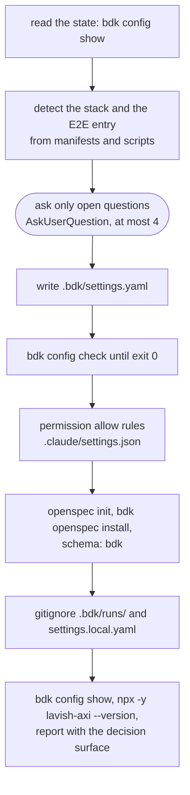
```mermaid
flowchart TB
  S1["read the state: bdk config show"] --> S2["detect the stack and the E2E entry<br/>from manifests and scripts"]
  S2 --> S3(["ask only open questions<br/>AskUserQuestion, at most 4"])
  S3 --> S4["write .bdk/settings.yaml"]
  S4 --> S5["bdk config check until exit 0"]
  S5 --> S6["permission allow rules<br/>.claude/settings.json"]
  S6 --> S7["openspec init, bdk openspec install,<br/>schema: bdk"]
  S7 --> S8["gitignore .bdk/runs/ and settings.local.yaml"]
  S8 --> S9["bdk config show, npx -y lavish-axi --version,<br/>report with the decision surface"]
```

A re-run keeps every value a layer sets and fills only what is missing; an argument such as "add the e2e entry" limits the run to that change.

## `/bdk:propose`

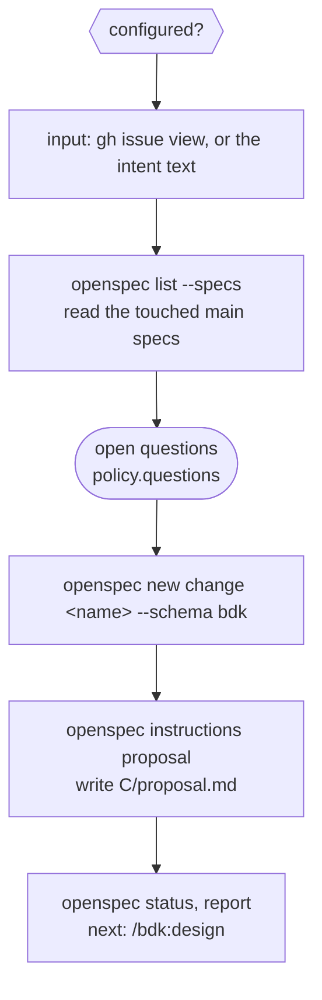
```mermaid
flowchart TB
  P1{{"configured?"}} --> P2["input: gh issue view, or the intent text"]
  P2 --> P3["openspec list --specs<br/>read the touched main specs"]
  P3 --> P4(["open questions<br/>policy.questions"])
  P4 --> P5["openspec new change &lt;name&gt; --schema bdk"]
  P5 --> P6["openspec instructions proposal<br/>write C/proposal.md"]
  P6 --> P7["openspec status, report<br/>next: /bdk:design"]
```

It never commits, branches or writes to GitHub. A Change of no behaviour sets `skip_specs: true` in `.openspec.yaml`.

## `/bdk:design`

Three blocks and a gate. The verifier is one agent continued with `SendMessage` across passes, so it keeps the context of what it checked.

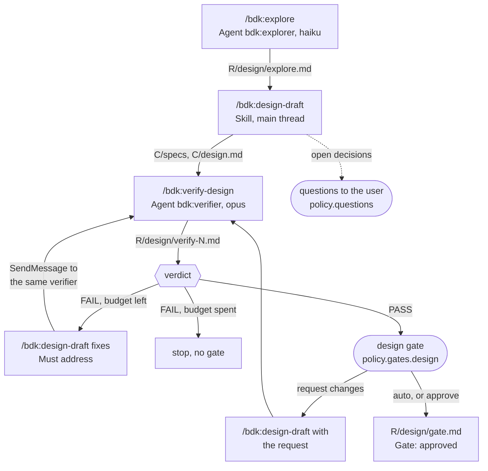
```mermaid
flowchart TB
  EX["/bdk:explore<br/>Agent bdk:explorer, haiku"] -->|"R/design/explore.md"| DR
  DR["/bdk:design-draft<br/>Skill, main thread"] -->|"C/specs, C/design.md"| VER
  DR -.->|"open decisions"| Q(["questions to the user<br/>policy.questions"])
  VER["/bdk:verify-design<br/>Agent bdk:verifier, opus"] -->|"R/design/verify-N.md"| V{{"verdict"}}
  V -->|"FAIL, budget left"| FIX["/bdk:design-draft fixes<br/>Must address"]
  FIX -->|"SendMessage to<br/>the same verifier"| VER
  V -->|"FAIL, budget spent"| STOPB["stop, no gate"]
  V -->|"PASS"| GATE(["design gate<br/>policy.gates.design"])
  GATE -->|"request changes"| REV["/bdk:design-draft with<br/>the request"] --> VER
  GATE -->|"auto, or approve"| GF["R/design/gate.md<br/>Gate: approved"]
```

The verifier budget is `policy.budgets.verifier` (default 3) passes per run. On a new start, `/bdk:design` skips every step whose file exists:

| Files found | Starts at |
|---|---|
| `gate.md` approved for the last report | nothing: reports the approved design |
| no `explore.md`, no `design.md` | explore |
| no `design.md` | `/bdk:design-draft` |
| no `verify-N.md` | `/bdk:verify-design` |
| last `verify-N.md` is `FAIL` | `/bdk:design-draft` fix, then `/bdk:verify-design` |
| last `verify-N.md` is `PASS` | the gate |

## `/bdk:plan`

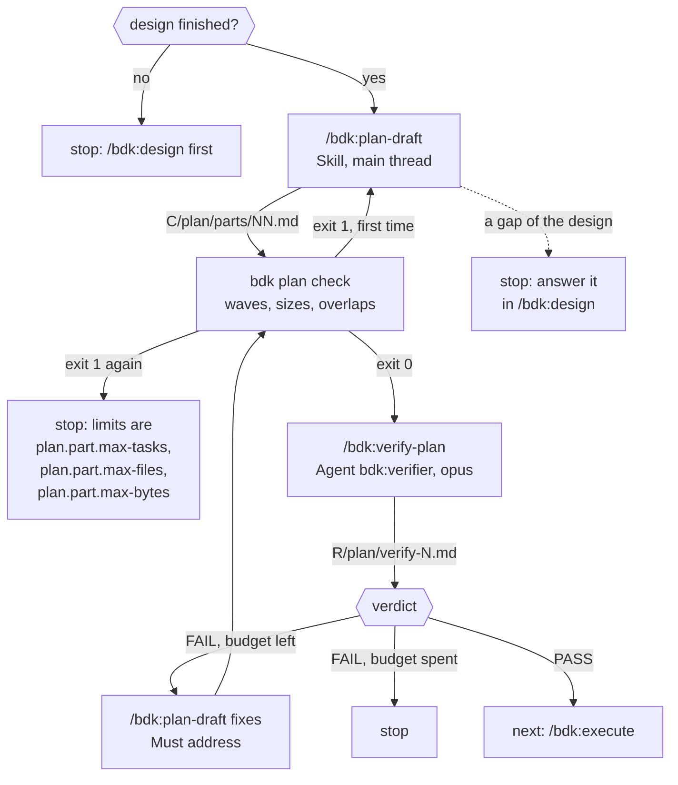
```mermaid
flowchart TB
  L0{{"design finished?"}} -->|"no"| LS0["stop: /bdk:design first"]
  L0 -->|"yes"| DRAFT["/bdk:plan-draft<br/>Skill, main thread"]
  DRAFT -->|"C/plan/parts/NN.md"| CHECK["bdk plan check<br/>waves, sizes, overlaps"]
  DRAFT -.->|"a gap of the design"| LS1["stop: answer it<br/>in /bdk:design"]
  CHECK -->|"exit 1, first time"| DRAFT
  CHECK -->|"exit 1 again"| LS2["stop: limits are<br/>plan.part.max-tasks,<br/>plan.part.max-files,<br/>plan.part.max-bytes"]
  CHECK -->|"exit 0"| VP["/bdk:verify-plan<br/>Agent bdk:verifier, opus"]
  VP -->|"R/plan/verify-N.md"| V{{"verdict"}}
  V -->|"FAIL, budget left"| FIXP["/bdk:plan-draft fixes<br/>Must address"] --> CHECK
  V -->|"FAIL, budget spent"| LS3["stop"]
  V -->|"PASS"| DONE["next: /bdk:execute"]
```

"Design finished" means `proposal.md`, at least one spec delta and `design.md` exist, and the last `design/verify-N.md`, when there is one, passes. A later pass continues the same verifier with `SendMessage`. On a new start, `/bdk:plan` starts at the draft (no part), the check (parts, no report), the fix (last report `FAIL`) or the report (last report `PASS`).

## `/bdk:execute` and the `/bdk:execute-waves` lead

`/bdk:execute` is thin: it starts one `bdk:lead` with the stage skill `/bdk:execute-waves` and passes the result on. The lead is the only writer of `state.json` and the only agent that commits and merges.

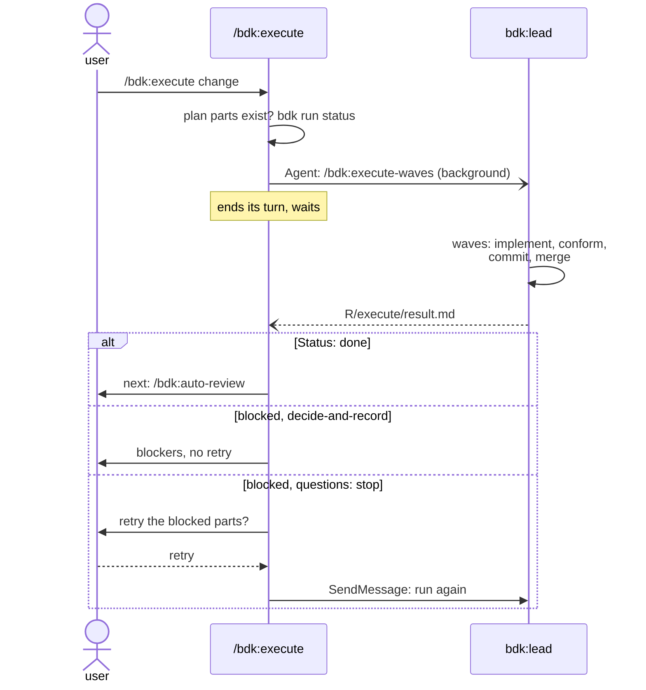
```mermaid
sequenceDiagram
  actor U as user
  participant M as /bdk:execute
  participant L as bdk:lead
  U->>M: /bdk:execute change
  M->>M: plan parts exist? bdk run status
  M-)L: Agent: /bdk:execute-waves (background)
  Note over M: ends its turn, waits
  L->>L: waves: implement, conform,<br/>commit, merge
  L--)M: R/execute/result.md
  alt Status: done
    M->>U: next: /bdk:auto-review
  else blocked, decide-and-record
    M->>U: blockers, no retry
  else blocked, questions: stop
    M->>U: retry the blocked parts?
    U-->>M: retry
    M->>L: SendMessage: run again
  end
```

Inside the lead, waves run in order and the parts of a wave run in parallel batches of `execution.max-parallel` (default 10):

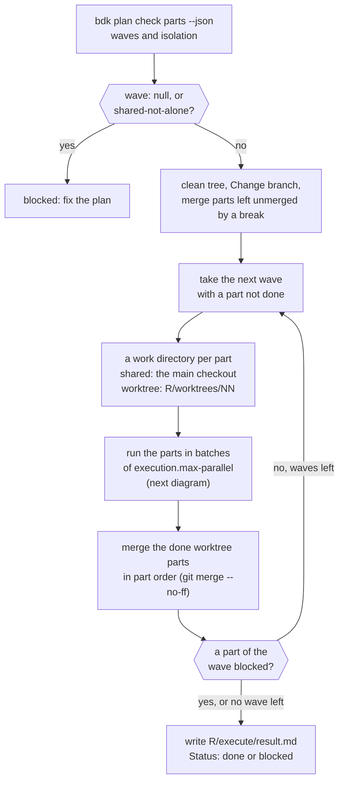
```mermaid
flowchart TB
  W0["bdk plan check parts --json<br/>waves and isolation"] --> W1{{"wave: null, or<br/>shared-not-alone?"}}
  W1 -->|"yes"| BL0["blocked: fix the plan"]
  W1 -->|"no"| W2["clean tree, Change branch,<br/>merge parts left unmerged by a break"]
  W2 --> W3["take the next wave<br/>with a part not done"]
  W3 --> W4["a work directory per part<br/>shared: the main checkout<br/>worktree: R/worktrees/NN"]
  W4 --> W5["run the parts in batches<br/>of execution.max-parallel<br/>(next diagram)"]
  W5 --> W6["merge the done worktree parts<br/>in part order (git merge --no-ff)"]
  W6 --> NW{{"a part of the<br/>wave blocked?"}}
  NW -->|"no, waves left"| W3
  NW -->|"yes, or no wave left"| RES["write R/execute/result.md<br/>Status: done or blocked"]
```

Each part of a batch goes through these attempts; the implementers of a batch start in one message, then its conformers:

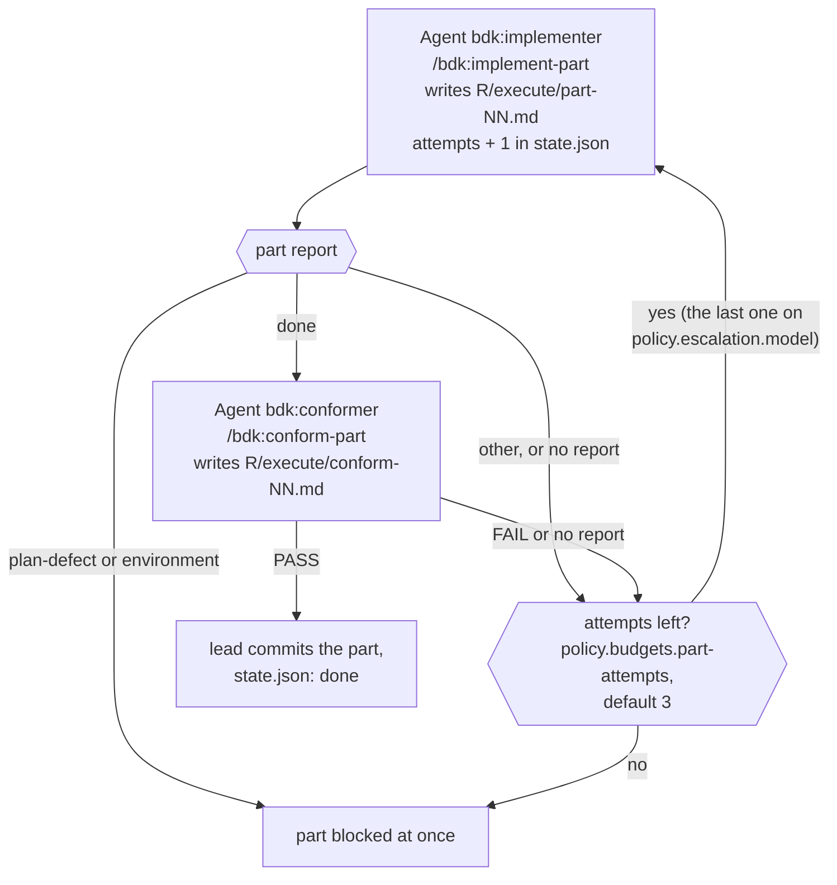
```mermaid
flowchart TB
  IMP["Agent bdk:implementer<br/>/bdk:implement-part<br/>writes R/execute/part-NN.md<br/>attempts + 1 in state.json"]
  IMP --> RI{{"part report"}}
  RI -->|"plan-defect or environment"| PB["part blocked at once"]
  RI -->|"other, or no report"| RETRY
  RI -->|"done"| CONF["Agent bdk:conformer<br/>/bdk:conform-part<br/>writes R/execute/conform-NN.md"]
  CONF -->|"FAIL or no report"| RETRY{{"attempts left?<br/>policy.budgets.part-attempts,<br/>default 3"}}
  RETRY -->|"yes (the last one on<br/>policy.escalation.model)"| IMP
  RETRY -->|"no"| PB
  CONF -->|"PASS"| COM["lead commits the part,<br/>state.json: done"]
```

Merging a worktree part into the Change branch:

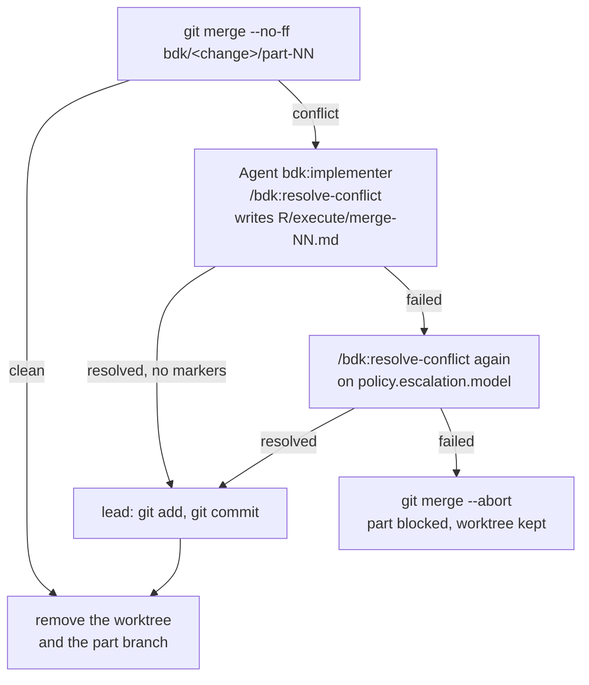
```mermaid
flowchart TB
  MER["git merge --no-ff bdk/&lt;change&gt;/part-NN"]
  MER -->|"clean"| MC["remove the worktree<br/>and the part branch"]
  MER -->|"conflict"| RC["Agent bdk:implementer<br/>/bdk:resolve-conflict<br/>writes R/execute/merge-NN.md"]
  RC -->|"resolved, no markers"| CM["lead: git add, git commit"] --> MC
  RC -->|"failed"| RC2["/bdk:resolve-conflict again<br/>on policy.escalation.model"]
  RC2 -->|"resolved"| CM
  RC2 -->|"failed"| AB["git merge --abort<br/>part blocked, worktree kept"]
```

One part, step by step inside its two worker agents:

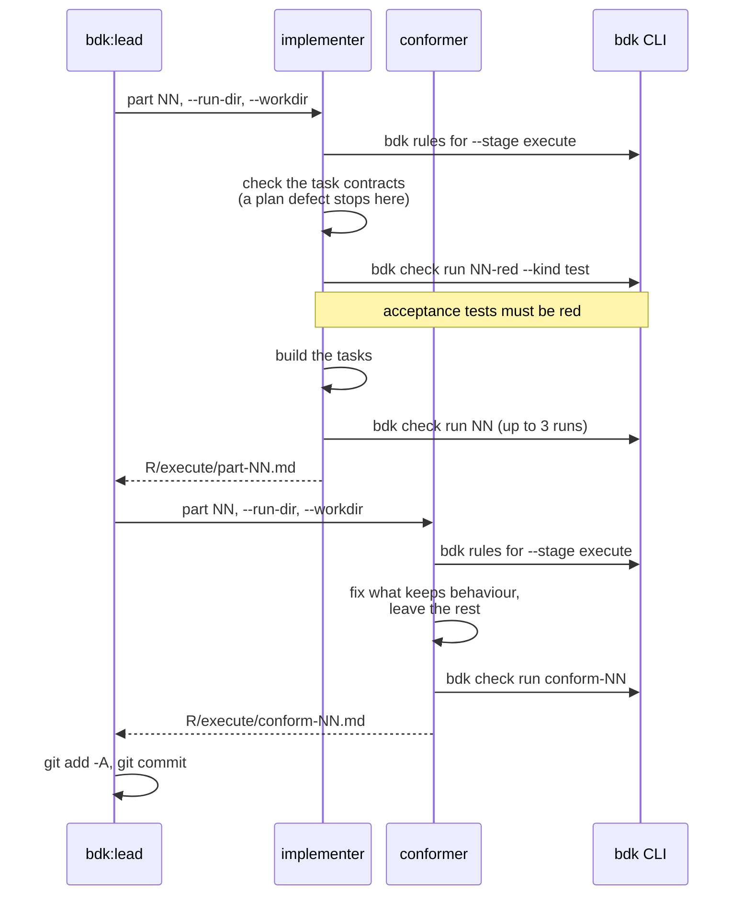
```mermaid
%%{init: {"sequence": {"actorMargin": 16, "width": 100}}}%%
sequenceDiagram
  participant L as bdk:lead
  participant I as implementer
  participant F as conformer
  participant B as bdk CLI
  L->>I: part NN, --run-dir, --workdir
  I->>B: bdk rules for --stage execute
  I->>I: check the task contracts<br/>(a plan defect stops here)
  I->>B: bdk check run NN-red --kind test
  Note over I,B: acceptance tests must be red
  I->>I: build the tasks
  I->>B: bdk check run NN (up to 3 runs)
  I-->>L: R/execute/part-NN.md
  L->>F: part NN, --run-dir, --workdir
  F->>B: bdk rules for --stage execute
  F->>F: fix what keeps behaviour,<br/>leave the rest
  F->>B: bdk check run conform-NN
  F-->>L: R/execute/conform-NN.md
  L->>L: git add -A, git commit
```

## `/bdk:auto-review`

Rounds and fix passes each run in a fresh `bdk:lead`; triage and fix planning run in the main thread. Round 1 reviews the whole Change, a later round only the fix commits of the round before.

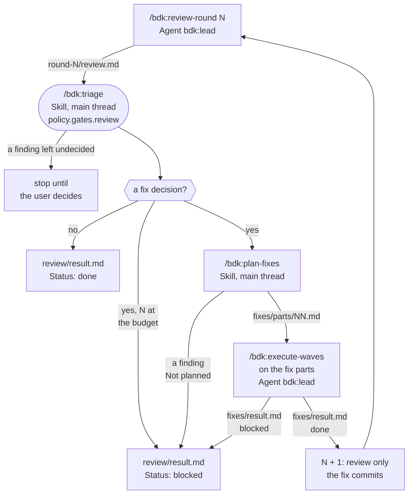
```mermaid
flowchart TB
  RND["/bdk:review-round N<br/>Agent bdk:lead"] -->|"round-N/review.md"| TRI
  TRI(["/bdk:triage<br/>Skill, main thread<br/>policy.gates.review"])
  TRI -->|"a finding left undecided"| WAITU["stop until<br/>the user decides"]
  TRI --> FIX{{"a fix decision?"}}
  FIX -->|"no"| OK["review/result.md<br/>Status: done"]
  FIX -->|"yes, N at<br/>the budget"| BLK["review/result.md<br/>Status: blocked"]
  FIX -->|"yes"| PF["/bdk:plan-fixes<br/>Skill, main thread"]
  PF -->|"a finding<br/>Not planned"| BLK
  PF -->|"fixes/parts/NN.md"| FP["/bdk:execute-waves<br/>on the fix parts<br/>Agent bdk:lead"]
  FP -->|"fixes/result.md<br/>blocked"| BLK
  FP -->|"fixes/result.md<br/>done"| NEXT["N + 1: review only<br/>the fix commits"]
  NEXT --> RND
```

The budget is `policy.budgets.review-rounds` (default 3); at the last round triage runs with `--last-round`.

On a new start, `/bdk:auto-review` finds its place from the files of the last round: no round or a round without `review.md` runs the round, an undecided finding runs triage, a round without `fixes/index.md` plans the fixes, and an unfinished `fixes/result.md` runs the fix pass again.

Triage policy, which decides in auto mode and is the preselected recommendation in manual mode:

| Level (set by the judge) | Decision | With `--last-round` |
|---|---|---|
| `blocker` | `fix` | `fix` |
| `should-fix` | `fix` | `defer` |
| `nice-to-have` | `defer` | `defer` |
| `not-a-problem` | `accept` | `accept` |

## `/bdk:review-round` (lead skill)

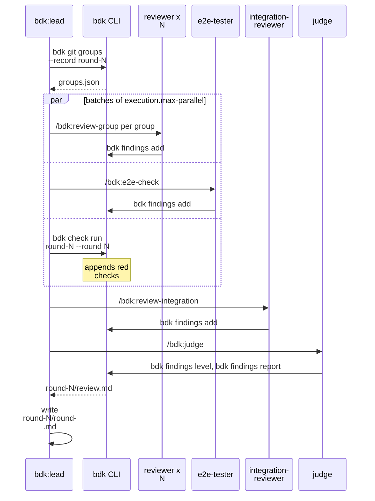
```mermaid
%%{init: {"sequence": {"actorMargin": 12, "width": 96, "noteMargin": 6, "wrap": true}}}%%
sequenceDiagram
  participant L as bdk:lead
  participant B as bdk CLI
  participant R as reviewer x N
  participant E as e2e-tester
  participant I as integration-<br/>reviewer
  participant J as judge
  L->>B: bdk git groups --record round-N
  B-->>L: groups.json
  par batches of execution.max-parallel
    L->>R: /bdk:review-group per group
    R->>B: bdk findings add
  and
    L->>E: /bdk:e2e-check
    E->>B: bdk findings add
  and
    L->>B: bdk check run round-N --round N
    Note over B: appends red checks
  end
  L->>I: /bdk:review-integration
  I->>B: bdk findings add
  L->>J: /bdk:judge
  J->>B: bdk findings level, bdk findings report
  B-->>L: round-N/review.md
  L->>L: write round-N/round.md
```

`bdk git groups` gets `--rounds R/review`, so a later round covers only what changed since the round before, and `--plan` with the plan parts (round 1) or the fix parts of the round before, so each group is one part. Every finding lands in `round-N/findings.jsonl`. A worker that fails is started once more with the same prompt; a second failure goes under `Gaps` in `round.md`.

## `/bdk:close`

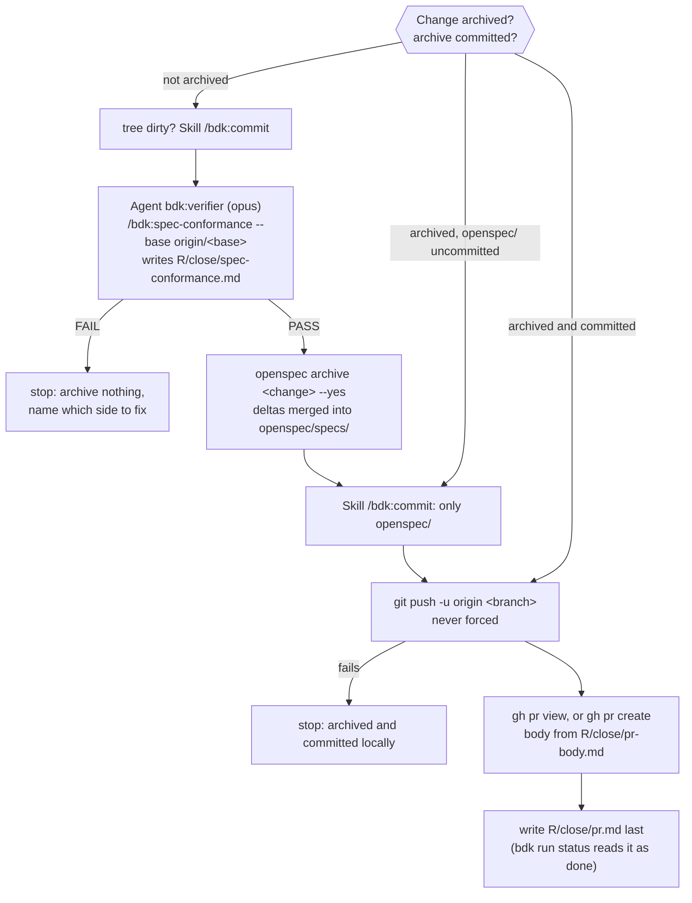
```mermaid
flowchart TB
  C0{{"Change archived?<br/>archive committed?"}}
  C0 -->|"not archived"| C1
  C0 -->|"archived, openspec/ uncommitted"| C4
  C0 -->|"archived and committed"| C5
  C1["tree dirty? Skill /bdk:commit"] --> C2
  C2["Agent bdk:verifier (opus)<br/>/bdk:spec-conformance --base origin/&lt;base&gt;<br/>writes R/close/spec-conformance.md"]
  C2 -->|"FAIL"| CS["stop: archive nothing,<br/>name which side to fix"]
  C2 -->|"PASS"| C3["openspec archive &lt;change&gt; --yes<br/>deltas merged into openspec/specs/"]
  C3 --> C4["Skill /bdk:commit: only openspec/"]
  C4 --> C5["git push -u origin &lt;branch&gt;<br/>never forced"]
  C5 -->|"fails"| CP["stop: archived and committed locally"]
  C5 --> C6["gh pr view, or gh pr create<br/>body from R/close/pr-body.md"]
  C6 --> C7["write R/close/pr.md last<br/>(bdk run status reads it as done)"]
```

## `/bdk:pr-review` and the `/bdk:pr-review-round` lead

Reviews any open pull request in a detached worktree. It runs no checks and no E2E; nothing reaches GitHub before the user confirms.

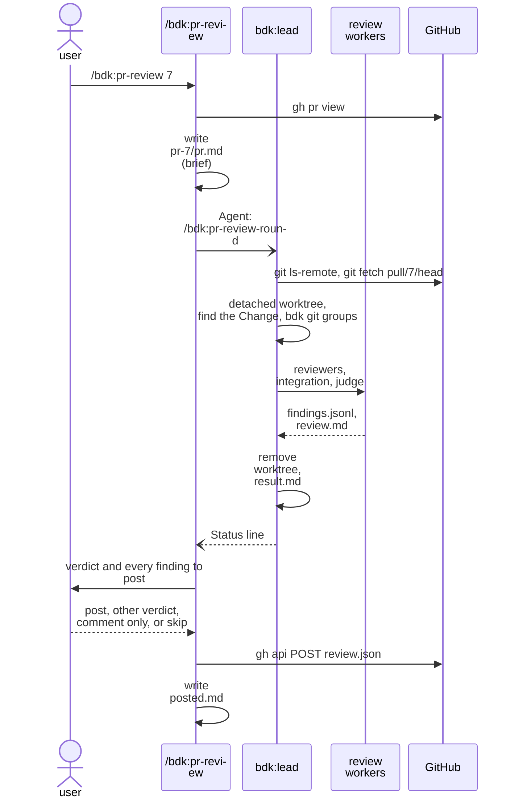
```mermaid
%%{init: {"sequence": {"actorMargin": 12, "width": 96, "noteMargin": 6, "wrap": true}}}%%
sequenceDiagram
  actor U as user
  participant M as /bdk:pr-review
  participant L as bdk:lead
  participant W as review workers
  participant G as GitHub
  U->>M: /bdk:pr-review 7
  M->>G: gh pr view
  M->>M: write pr-7/pr.md (brief)
  M-)L: Agent: /bdk:pr-review-round
  L->>G: git ls-remote, git fetch pull/7/head
  L->>L: detached worktree,<br/>find the Change, bdk git groups
  L->>W: reviewers, integration, judge
  W-->>L: findings.jsonl, review.md
  L->>L: remove worktree, result.md
  L--)M: Status line
  M->>U: verdict and every finding to post
  U-->>M: post, other verdict,<br/>comment only, or skip
  M->>G: gh api POST review.json
  M->>M: write posted.md
```

The workers get `--workdir`, `--change` (or `none`) and `--intent pr.md`. The question is skipped under `policy.questions: decide-and-record` or when the request says to post without asking; on your own pull request the review is posted as `COMMENT`.

Several pull requests (`/bdk:pr-review 7 8`) start one lead each in one message, at most `execution.max-parallel`; the reviews are shown when every lead has returned, and one question covers all of them. A lead checks the head with `git ls-remote` and fetches without `FETCH_HEAD`, so leads in one repository do not read each other's head.

`--verify` re-checks your previous review instead of reviewing again:

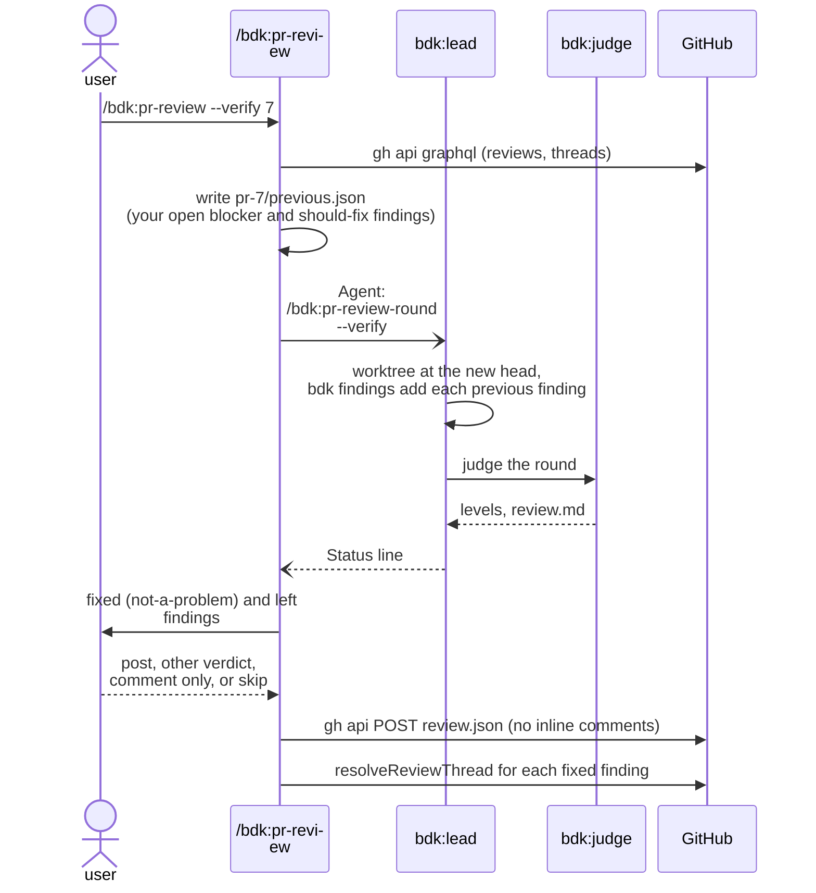
```mermaid
%%{init: {"sequence": {"actorMargin": 12, "width": 96, "noteMargin": 6, "wrap": true}}}%%
sequenceDiagram
  actor U as user
  participant M as /bdk:pr-review
  participant L as bdk:lead
  participant J as bdk:judge
  participant G as GitHub
  U->>M: /bdk:pr-review --verify 7
  M->>G: gh api graphql (reviews, threads)
  M->>M: write pr-7/previous.json<br/>(your open blocker and should-fix findings)
  M-)L: Agent: /bdk:pr-review-round --verify
  L->>L: worktree at the new head,<br/>bdk findings add each previous finding
  L->>J: judge the round
  J-->>L: levels, review.md
  L--)M: Status line
  M->>U: fixed (not-a-problem) and left findings
  U-->>M: post, other verdict,<br/>comment only, or skip
  M->>G: gh api POST review.json (no inline comments)
  M->>G: resolveReviewThread for each fixed finding
```

A finding the judge now levels `not-a-problem` is fixed; any other level is left, and a left `blocker` requests changes. Only threads you opened are resolved, and only after the review is posted. The commits since the previous review are checked only against its findings; `/bdk:pr-review 7` reviews the whole pull request again.

## `/bdk:debug`

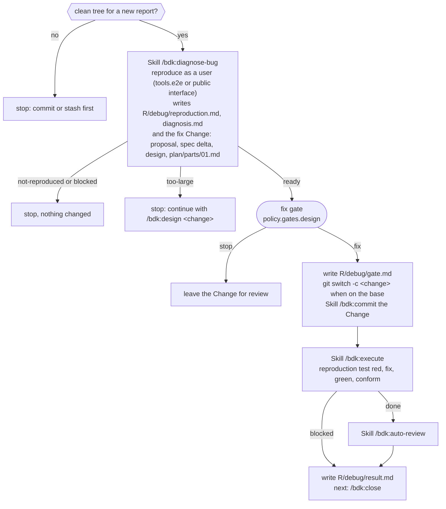
```mermaid
flowchart TB
  G0{{"clean tree for a new report?"}} -->|"no"| GS["stop: commit or stash first"]
  G0 -->|"yes"| G1
  G1["Skill /bdk:diagnose-bug<br/>reproduce as a user (tools.e2e or public interface)<br/>writes R/debug/reproduction.md, diagnosis.md<br/>and the fix Change: proposal, spec delta, design, plan/parts/01.md"]
  G1 -->|"not-reproduced or blocked"| GX["stop, nothing changed"]
  G1 -->|"too-large"| GL["stop: continue with /bdk:design &lt;change&gt;"]
  G1 -->|"ready"| G2(["fix gate<br/>policy.gates.design"])
  G2 -->|"stop"| GT["leave the Change for review"]
  G2 -->|"fix"| G3["write R/debug/gate.md<br/>git switch -c &lt;change&gt; when on the base<br/>Skill /bdk:commit the Change"]
  G3 --> G4["Skill /bdk:execute<br/>reproduction test red, fix, green, conform"]
  G4 -->|"blocked"| G6
  G4 -->|"done"| G5["Skill /bdk:auto-review"]
  G5 --> G6["write R/debug/result.md<br/>next: /bdk:close"]
```

## Sources

- `plugins/bdk/skills/{setup,propose,design,plan,execute,execute-waves,implement-part,conform-part,resolve-conflict,auto-review,review-round,triage,plan-fixes,close,pr-review,pr-review-round,debug,diagnose-bug}/SKILL.md`
- `plugins/bdk/agents/*.md`
