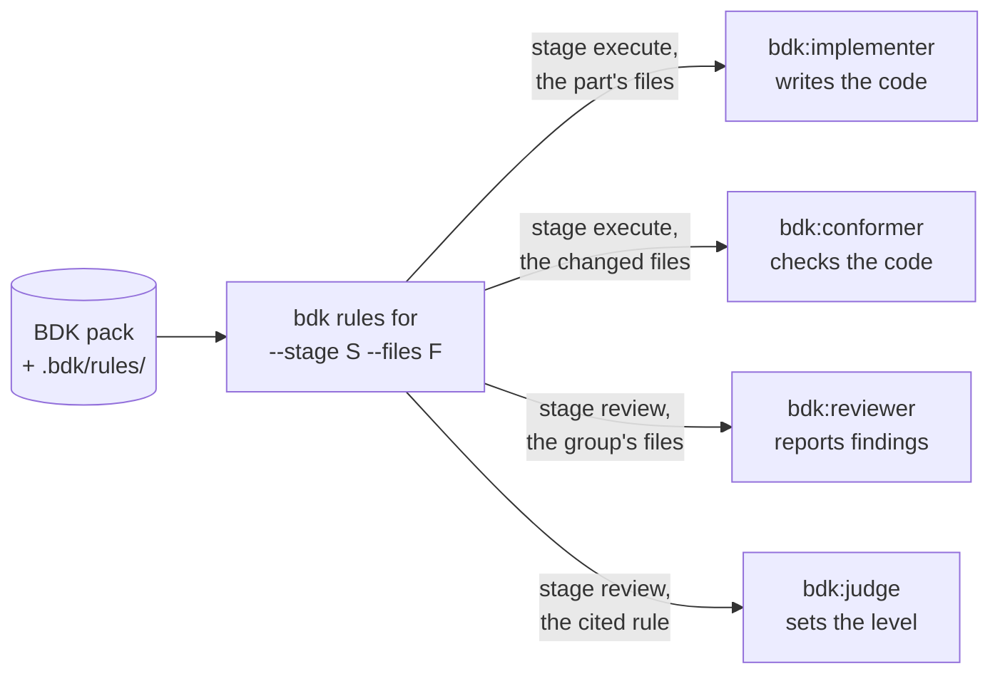

# Rules - the coding rules implementers follow and reviewers check

A rule is one short, concrete coding choice or fact, such as "descriptive identifiers, no abbreviations" or "avoid `enum`, use `as const` objects or unions". BDK puts the rules that apply into the prompt of the agents that write and review code, so the code follows them without you repeating them in every request. BDK ships a small rule pack and reads your project's own rules beside it.

## Two kinds of rule

| Kind | What it says | Extra fields |
|---|---|---|
| `house` | a choice among valid alternatives, so the codebase stays consistent | none |
| `knowledge` | a fact about a library, language or tool that a model may get wrong or outdated | `source` (a link) and `verified` (the date it was last checked) |

## Why the pack is small

A rule costs prompt space in every agent that reads it, and many rules a model already follows by itself. So the BDK pack holds a rule only while a measurement shows it changes the outcome: a review with the rule in its prompt finds a seeded violation measurably more often than without it, or a model answers the rule's question wrongly without it. The pack holds a few architecture, code quality and design pattern rules for every language, and packs for JavaScript, TypeScript and React; the [rules reference](/reference/bdk/rules) lists each one with its id.

Your project's rules need no measurement: they are your team's choices.

## Who reads them, and when



| Stage | Role | What it does with the rules |
|---|---|---|
| execute | `bdk:implementer` in `/bdk:implement-part` | writes the part's code following them |
| execute | `bdk:conformer` in `/bdk:conform-part` | checks each changed line against them and fixes what it can without changing behaviour |
| review | `bdk:reviewer` in `/bdk:review-group` | reports a changed line that breaks one, as a finding that names the rule's id |
| review | `bdk:judge` in `/bdk:judge` | reads the rule a finding cites before it sets the level |

A rule file can also name the stages `design` and `plan`, and some pack rules do. No design or plan step asks for rules yet ([#272](https://github.com/broneq/bdk/issues/272)), so today a rule reaches only the execute and review roles above.

A broken rule alone is never a blocker: the judge levels it `should-fix` at most, because a rule is a choice and the product still works. Triage then fixes it, or defers it in the last review round ([findings](./findings.md)).

Rules are not the only instructions the code agents read. `bdk:implementer` and `bdk:conformer` also read your project's `CLAUDE.md`, `AGENTS.md` and `.claude/rules/*.md` on the way to the files they change. The reviewers do not read those instruction files yet ([#273](https://github.com/broneq/bdk/issues/273)): put a convention in a rule when you want a reviewer to report the line that breaks it.

## How a role's rules are chosen

`bdk rules for --stage <stage> --files <file>...` selects, from the pack and your project rules, every rule that:

1. is not switched off in `rules.disabled`;
2. belongs to no language pack, or to a pack that `languages` lists (`languages: [typescript, react]`);
3. names the stage in its `stages`;
4. matches at least one of the files in its `paths` globs (`**` is every file, `**/*.tsx` every TSX file).

To see what a reviewer of a file would get, ask Claude to run `bdk rules for --stage review --files src/api/users.ts`.

## Add your own rule

Put a Markdown file under `.bdk/rules/` in your project, in any subdirectory. The file name is the rule's id; it may not start with `BDK-`, which the pack reserves. Commit it, and every implementer and reviewer of the team reads it.

```markdown
---
kind: house
paths: ["src/api/**"]
stages: [execute, review]
---

**Validate input at the edge.** Every handler under `src/api/` parses its request body with the
schema in `src/api/schemas/` before it touches the data; no handler reads `req.body` directly.
```

Saved as `.bdk/rules/api/API-1.md`, this is the rule `API-1`: an implementer of a part that changes `src/api/users.ts` follows it, and a reviewer reports a handler that reads `req.body` with the finding's rule set to `API-1`.

A knowledge rule adds where the fact comes from and when it was checked:

```markdown
---
kind: knowledge
paths: ["**/*.py"]
stages: [execute, review]
source: "https://docs.pydantic.dev/latest/migration/"
verified: 2026-10-01
---

**Pydantic v2 validators.** Use `@field_validator` and `@model_validator`; `@validator` and
`@root_validator` are deprecated in v2 and removed in v3.
```

For a rule of one language, put it under `.bdk/rules/languages/<name>/`: it applies only while `languages` lists `<name>`, as the pack's language rules do. That is also how you add rules for a language the pack has none for, such as `python`.

Each rule should be one choice the code can follow or break on a given line. Describe what to do, not a value judgement, and keep it short: the text goes into prompts as it is.

## Switch a rule off, or change one

Name its id in `rules.disabled`:

```yaml
rules:
  disabled: [BDK-DP-2, BDK-REACT-10]
```

A BDK rule cannot be edited in place. To change one, switch it off and add your own version under `.bdk/rules/` with an id of your own. An id in `rules.disabled` that names no rule gives a warning with the closest id, not an error.

`rules.disabled` follows the configuration layers like every other key: a later layer replaces the whole list ([configuration](/guide/configuration)). The team's list lives in `.bdk/settings.yaml`. A developer's `.bdk/settings.local.yaml` that sets `rules.disabled` replaces that list for their runs, so a team rule cannot be locked on. Review the effective list with `bdk config show rules`.

## Sources

- `plugins/bdk/rules/` (the pack and its README), `plugins/bdk/src/rules/` (`bdk rules for`)
- `plugins/bdk/skills/implement-part/`, `conform-part/`, `review-group/`, `judge/`
