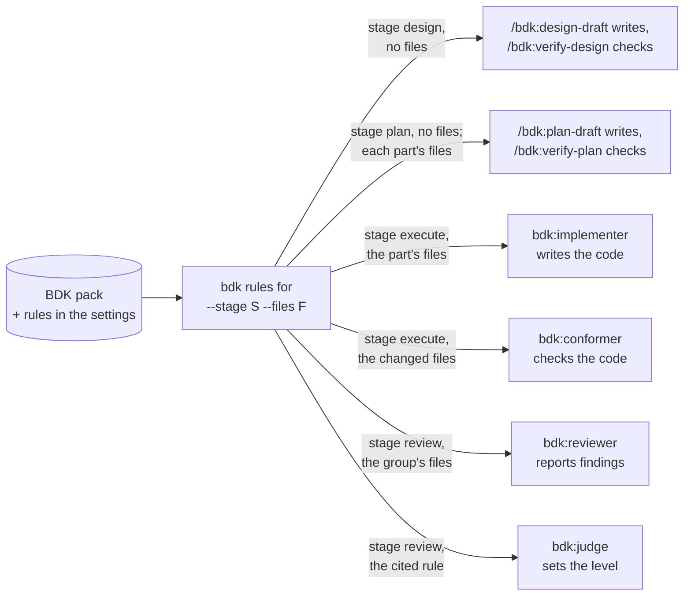

# Rules - the rules designers, planners, implementers and reviewers follow

A rule is one short, concrete coding choice or fact, such as "descriptive identifiers, no abbreviations" or "avoid `enum`, use `as const` objects or unions". BDK puts the rules that apply into the prompt of the roles that design, plan, write and review a Change, so the work follows them without you repeating them in every request. BDK ships a small rule pack and reads your project's own rules, declared in the settings, beside it.

## Two kinds of rule

| Kind | What it says | Extra fields |
|---|---|---|
| `house` | a choice among valid alternatives, so the codebase stays consistent | none |
| `knowledge` | a fact about a library, language or tool that a model may get wrong or outdated | `source` (a link) and `verified` (the date it was last checked) |

## Why the pack is small

A rule costs prompt space in every agent that reads it, and many rules a model already follows by itself. So the BDK pack holds a rule only while a measurement shows it changes the outcome: a review with the rule in its prompt finds a seeded violation measurably more often than without it, or a model answers the rule's question wrongly without it. The pack holds a few architecture, code quality and design pattern rules for every language, and packs for JavaScript, TypeScript and React; the [rules reference](/reference/bdk/rules) lists each one with its id.

Your project's rules need no measurement: they are your team's choices.

## Who reads them, and when



| Stage | Role | What it does with the rules |
|---|---|---|
| design | `/bdk:design-draft` | treats each rule as a constraint on the design, and names the rule's id in the decision that follows it |
| design | `bdk:verifier` in `/bdk:verify-design` | fails a design that breaks a rule, unless a decision records your agreement to depart from it |
| plan | `/bdk:plan-draft` | follows the rules when it cuts the parts and writes the tasks, and names the id in the part or task that follows one |
| plan | `bdk:verifier` in `/bdk:verify-plan` | checks each part against the rules selected for its `files`, and fails a part that breaks one |
| execute | `bdk:implementer` in `/bdk:implement-part` | writes the part's code following them |
| execute | `bdk:conformer` in `/bdk:conform-part` | checks each changed line against them and fixes what it can without changing behaviour |
| review | `bdk:reviewer` in `/bdk:review-group` | reports a changed line that breaks one, as a finding that names the rule's id (`bdk findings add --rule`) |
| review | `bdk:judge` in `/bdk:judge` | reads the rule a finding cites before it sets the level |

A design or a plan has no file set yet, so the drafts ask for the rules of their stage without files: every rule of the stage applies. The plan verifier knows each part's `files` and asks per part, so a rule for `src/**` holds only for the parts that touch `src/`.

In the code stages a broken rule alone is never a blocker: the judge levels it `should-fix` at most, because a rule is a choice and the product still works. Triage then fixes it, or defers it in the last review round ([findings](./findings.md)). In the design and plan stages a broken rule fails the verification, which is cheap to fix before any code exists.

Rules are not the only instructions the code agents read. Your project's instructions bind the code too: `CLAUDE.md` and `AGENTS.md` in the project root and in each directory on the way to a file, and each `.claude/rules/*.md` whose `paths` match the file (or that has no `paths`).

| Role | What it does with your instructions |
|---|---|
| `bdk:implementer` in `/bdk:implement-part` | writes the part's code following the ones on the way to its files |
| `bdk:conformer` in `/bdk:conform-part` | checks each changed line against them and fixes what it can without changing behaviour |
| `bdk:reviewer` in `/bdk:review-group` | reports a changed line that breaks one, as a finding that names the instruction file in place of a rule id (`--rule CLAUDE.md`, `--rule .claude/rules/testing.md`) and quotes the instruction |
| `bdk:judge` in `/bdk:judge` | reads the cited file, checks that it says what the finding quotes and binds the finding's file, then levels it like a broken rule: `should-fix` at most, or `not-a-problem` when the file does not say it |

`bdk:integration-reviewer` does not read them: an instruction binds the lines of a file, and every changed file has a group reviewer that reads it whole. A convention you want checked in every project that uses BDK, or switched off per project, belongs in a rule; one that holds only for your project can stay in your instruction files.

## How a role's rules are chosen

`bdk rules for --stage <stage> --files <file>...` selects, from the pack and your project rules, every rule that:

1. is not switched off with `enabled: false`;
2. is your project's rule, or belongs to no language pack, or to a pack that `languages` lists (`languages: [typescript, react]`);
3. names the stage in its `stages`;
4. matches at least one of the files in its `paths` globs (`**` is every file, `**/*.tsx` every TSX file); without files this condition is dropped.

To see what a reviewer of a file would get, ask Claude to run `bdk rules for --stage review --files src/api/users.ts`.

## Add your own rule

Declare it under `rules` in `.bdk/settings.yaml`, keyed by its id. The id is letters, digits and `-`, keeps its case, and may not start with `BDK-`, which the pack reserves. Commit the file, and every role of the team reads the rule.

```yaml
rules:
  API-1:
    paths: ["src/api/**"]
    text: >-
      **Validate input at the edge.** Every handler under `src/api/` parses its request body
      with the schema in `src/api/schemas/` before it touches the data; no handler reads
      `req.body` directly.
```

This is the rule `API-1`: an implementer of a part that changes `src/api/users.ts` follows it, and a reviewer reports a handler that reads `req.body` with the finding's rule set to `API-1`.

A rule holds exactly one of `text` (the rule inline) and `file` (a Markdown file holding the text, such as a convention document you already keep). A leading `---` frontmatter block in the file is skipped. Every other field has a default:

| Field | Value | Default |
|---|---|---|
| `kind` | `house` or `knowledge` | `house` |
| `paths` | globs of the files the rule governs, relative to the project root | `["**"]` |
| `stages` | among `design`, `plan`, `execute`, `review` | `[execute, review]` |
| `source`, `verified` | where a `knowledge` fact is documented, and the date it was last checked | required for `knowledge` |
| `enabled` | `false` switches the rule off | `true` |

A design rule takes `stages: [design]`, and points to a document the team already has:

```yaml
rules:
  IO-1:
    stages: [design]
    file: docs/conventions/io.md
```

A knowledge rule adds where the fact comes from and when it was checked:

```yaml
rules:
  PY-1:
    kind: knowledge
    paths: ["**/*.py"]
    source: "https://docs.pydantic.dev/latest/migration/"
    verified: 2026-10-01
    text: >-
      **Pydantic v2 validators.** Use `@field_validator` and `@model_validator`; `@validator`
      and `@root_validator` are deprecated in v2 and removed in v3.
```

Your rules belong to no language pack: their `paths` choose the files they govern, so a rule for `**/*.py` is how you add rules for a language the pack has none for.

Each rule should be one choice the work can follow or break. Describe what to do, not a value judgement, and keep it short: the text goes into prompts as it is.

## Rules in the configuration layers

`rules` is a map, so its entries merge across the configuration layers ([configuration](/guide/configuration)) field by field: `~/.config/bdk/settings.yaml` (yours, in every project), `.bdk/settings.yaml` (the team's) and `.bdk/settings.local.yaml` (yours, in this project). A rule in your global file is a personal rule; its `file` is read relative to that file's directory. In the project files, `file` is relative to the project root.

`bdk config check` checks every entry, and `bdk config show rules` shows the resolved rules with the layer that set each field. `bdk rules for` names a rule's origin: `bdk` for a pack rule, or the layer that sets its `text` or `file`.

## Switch a rule off, or change one

Set `enabled: false` under its id, in any layer:

```yaml
rules:
  BDK-DP-2:
    enabled: false
```

A local layer that switches one rule off leaves every other rule of the team in force. An entry whose id starts with `BDK-` changes the pack rule of that id, and may set only `enabled`, `paths` and `stages`; the text stays the pack's:

```yaml
rules:
  BDK-REACT-10:
    paths: ["apps/web/**/*.tsx"]
```

To reword a BDK rule, switch it off and add your own version with an id of your own. A `BDK-` entry that names no pack rule gives a warning with the closest id, not an error.

## Sources

- `plugins/bdk/rules/` (the pack and its README), `plugins/bdk/src/rules/` (`bdk rules for`), `plugins/bdk/src/config/` (the `rules` settings)
- `plugins/bdk/skills/design-draft/`, `verify-design/`, `plan-draft/`, `verify-plan/`, `implement-part/`, `conform-part/`, `review-group/`, `judge/`
