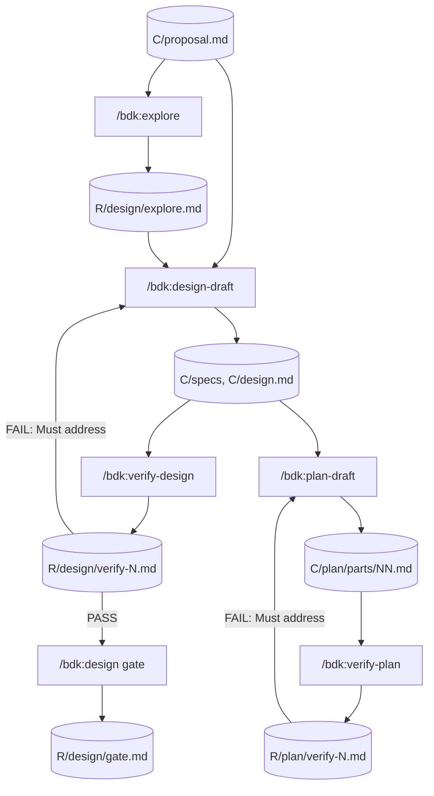
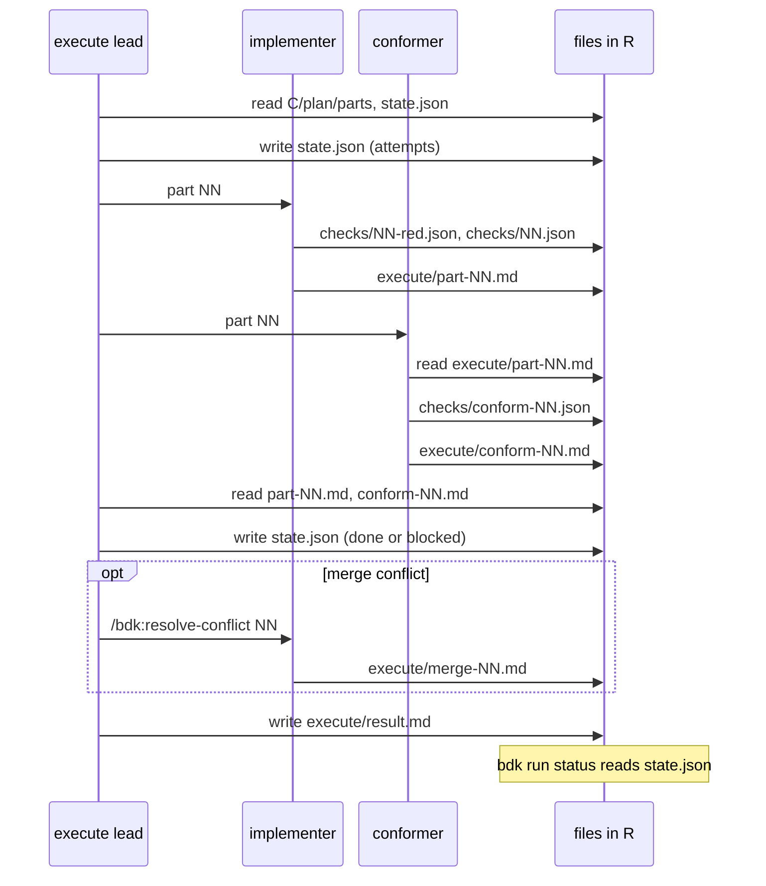
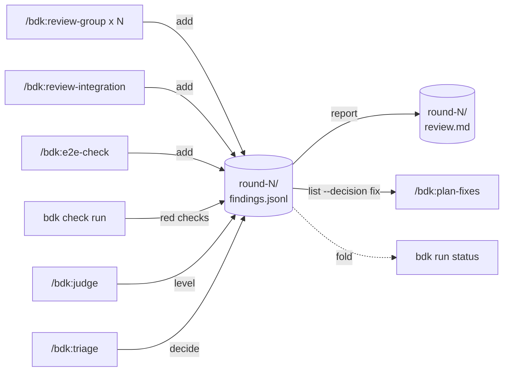
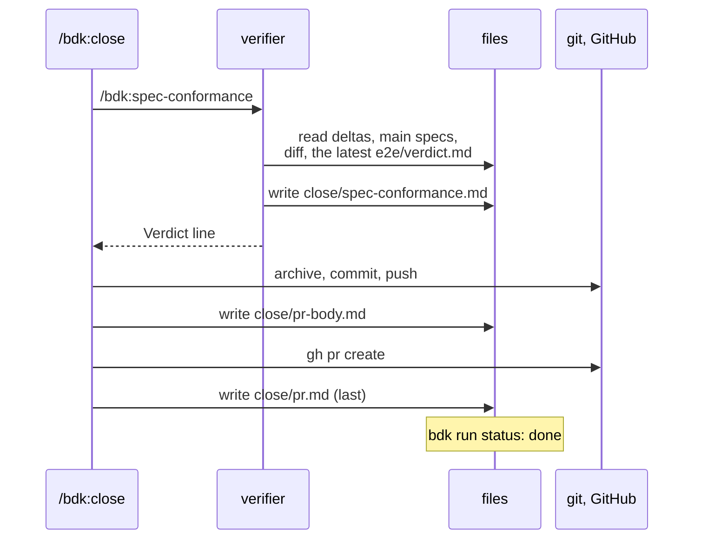
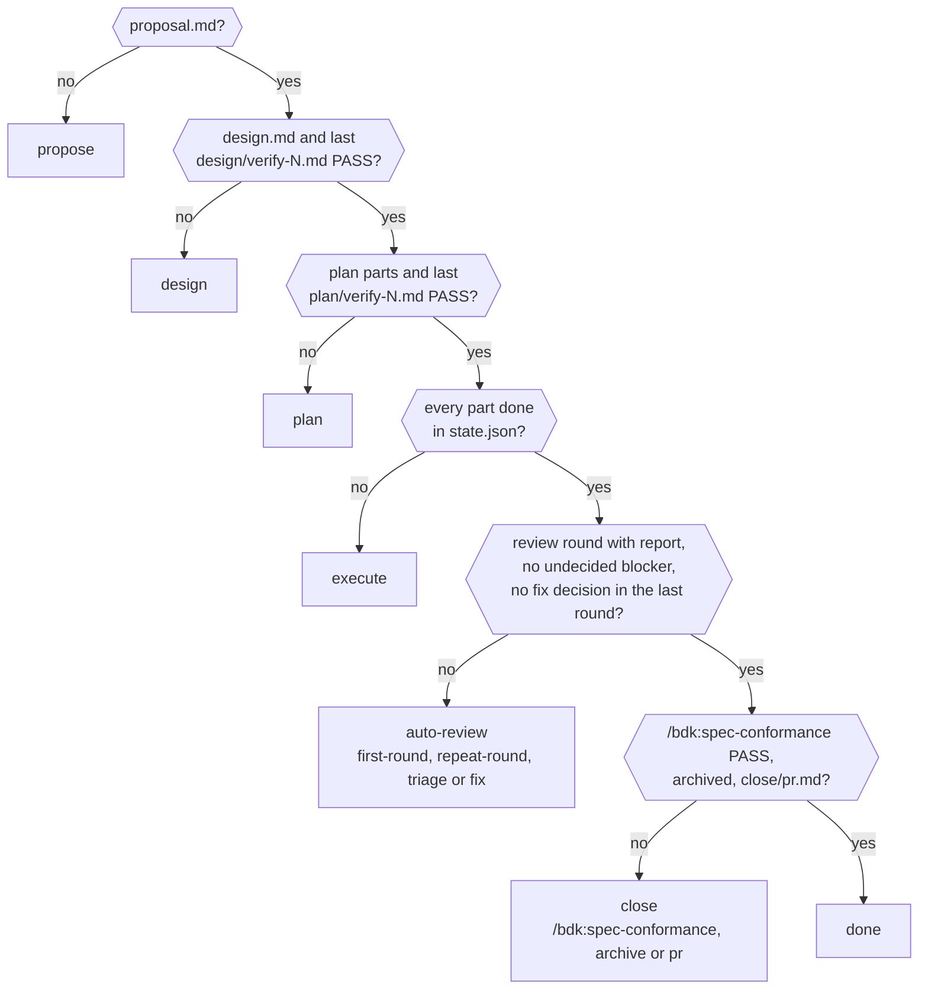

# Run state and artifacts - the files every stage writes and reads

Every step writes a file, so a stage can resume and a later stage can read an earlier one. This page shows what lands in `openspec/changes/<change>/` and `.bdk/runs/<change>/`, who writes it and who reads it.

Notation in the diagrams: see the [glossary](./glossary.md#notation-in-the-diagrams).

## Why every stage writes files

BDK keeps no memory between commands: everything a later step needs is a file. That buys four things:

- **Resume.** A stage starts at its first missing file, so a break, a crash, a closed laptop or a stop for your decision costs nothing: run the same command again. `/bdk:run` resumes a whole queue the same way.
- **Hand-off.** Each agent starts on a fresh context and gets its input from files the previous one wrote: the explorer's map feeds the design, the implementer's report feeds the conformer, the findings log feeds the judge and triage. Nothing depends on a conversation that is gone.
- **One writer per file.** Every file has one writer (the findings log has many, but each only appends), so parallel agents never overwrite each other, and the state of a Change is never the guess of one agent.
- **A record of why.** Verifier reports, gate files, the findings log and the results keep what was checked, what was decided and by whom (you, or a setting); `/bdk:run`'s final report and the pull request body are built from them.

`openspec/changes/<change>/` is the Change itself and is committed with it. `.bdk/runs/` is run state: git-ignored, local to your checkout.

## Where files live

```text
openspec/changes/<change>/            C - committed with the Change
  .openspec.yaml                      propose (skip_specs for no-behaviour Changes)
  proposal.md                         propose / /bdk:diagnose-bug
  specs/<capability>/spec.md          /bdk:design-draft / /bdk:diagnose-bug
  design.md                           /bdk:design-draft / /bdk:diagnose-bug
  plan/parts/NN.md                    /bdk:plan-draft / /bdk:diagnose-bug (01 only)
openspec/changes/archive/<date>-<change>/   openspec archive, in /bdk:close
openspec/specs/<capability>/spec.md   main specs: openspec archive merges the deltas

.bdk/runs/                            git-ignored run state
  run.json                            /bdk:run (only writer)
  <change>/                           R
    state.json                        execute lead (only writer)
    design/explore.md                 explore
    design/verify-N.md                /bdk:verify-design
    design/gate.md                    /bdk:design
    plan/verify-N.md                  /bdk:verify-plan
    execute/part-NN.md                /bdk:implement-part
    execute/conform-NN.md             /bdk:conform-part
    execute/merge-NN.md               /bdk:resolve-conflict
    execute/wave-N.md                 /bdk:resolve-conflict --wave
    execute/result.md                 execute lead
    worktrees/NN/                     execute lead (git worktree per part)
    checks/<id>.json, checks/<id>/    bdk check run
    e2e/<process>--<path>.md          /bdk:e2e-check run alone (and verdict.md)
    review/round-N/groups.json        bdk git groups --record
    review/round-N/findings.jsonl     reviewers, e2e, checks, judge, triage
    review/round-N/e2e/               /bdk:e2e-check in the round
    review/round-N/review.md          bdk findings report (judge, triage)
    review/round-N/round.md           /bdk:review-round lead
    review/round-N/fixes/parts/NN.md  /bdk:plan-fixes
    review/round-N/fixes/index.md     /bdk:plan-fixes
    review/round-N/fixes/state.json   execute lead (fix pass)
    review/round-N/fixes/result.md    execute lead (fix pass)
    review/result.md                  /bdk:auto-review
    close/spec-conformance.md         /bdk:spec-conformance
    close/pr-body.md, pr.md           /bdk:close
    debug/reproduction.md, diagnosis.md, scratch/   /bdk:diagnose-bug
    debug/gate.md, result.md          /bdk:debug
    diagnostics.md                    /bdk:diagnose-run (after the run)
  pr-<N>/                             /bdk:pr-review
    pr.md, previous.json (--verify), result.md, worktree/, review/round-k/{groups.json, previous.json, findings.jsonl, review.md, review.json, posted.md}
```

## Who reads each file later, and why

| File | Written by | Read later by | Why it exists | If you delete it |
|---|---|---|---|---|
| `run.json` | `/bdk:run` only | `/bdk:run` to continue the queue, `bdk run status`, `/bdk:execute`, `/bdk:auto-review` and `/bdk:close` to check the queued stage | the queue and its current Change | `/bdk:run` without arguments asks what to run; the stages skip their queue check |
| `state.json` | the execute lead only | the lead on a restart, `bdk run status` | each part's status (`pending`, `done`, `blocked`) and attempts, and each started wave's base commit and wave check status | every part counts as pending again, so the next `/bdk:execute` builds the done parts again too |
| `design/explore.md` | `/bdk:explore` | `/bdk:design-draft`, `/bdk:verify-design` | the code map the design is grounded in | not regenerated once `design.md` exists; the drafter reads the code itself |
| `design/verify-N.md`, `plan/verify-N.md` | `bdk:verifier` (a new number per pass) | `bdk run status` (the last one's `Verdict:` line), the drafter (a `FAIL` puts it in fix mode), `/bdk:plan` (needs the last design report to pass) | the check's verdict with evidence; their count is the `policy.budgets.verifier` budget | the previous report becomes the last one |
| `design/gate.md` | `/bdk:design` only, on approval | `/bdk:design` (nothing left to run), `/bdk:run` (the design is approved) | the record of who approved which verified design | the gate is asked again |
| `execute/part-NN.md` | `bdk:implementer` | the lead, `/bdk:conform-part`, the implementer's retry | what was built, the checks, a blocker with its evidence | the conformer refuses the part; a retry starts without the hint |
| `execute/conform-NN.md` | `bdk:conformer` | the lead (commits only on `PASS`), the implementer's retry | the gate before a part's commit | the part is conformed again |
| `execute/wave-N.md` | `bdk:implementer` repairing a red wave check | the lead (commits the repair only on `Status: done`), `/bdk:execute` (a wave blocker) | what two parts broke together and how it was repaired | the lead runs the wave check again on the next `/bdk:execute` |
| `execute/result.md` | the execute lead | `/bdk:execute`, `/bdk:debug` | the stage's outcome and its blockers | `/bdk:execute` resumes from `state.json` |
| `worktrees/NN/` | the execute lead | the lead on a restart (it reuses the work in it) | an isolated checkout per part of a wave with two or more parts to run (a part alone in its wave runs in the main checkout); removed after the merge, kept for a blocked part | the part's earlier work in it is lost |
| `checks/<id>.json`, `checks/<id>/` | `bdk check run` | implementers (the output of a red check), `/bdk:plan-fixes`, the round summary | the record of every test, lint and build run, with its check point, the revision it compared against, and its output | nothing reads it to decide |
| `review/round-N/e2e/` (`e2e/` when run alone): `<process>--<path>.md`, screenshots and video, `verdict.md` | `bdk:e2e-tester` | the review round, `/bdk:spec-conformance`, `/bdk:close` (the verdict goes into the PR body) | the evidence of each path on the running product | spec conformance has no E2E evidence |
| `review/round-N/groups.json` | `bdk git groups` | the round's reviewers, and the next round, which reviews only the commits after this round's head | the reviewed range and its groups | the next round falls back to the whole branch |
| `review/round-N/findings.jsonl` | reviewers, E2E, red checks, judge, triage (append only) | `bdk run status`, `/bdk:auto-review`, `/bdk:plan-fixes` | the [findings](./findings.md), their levels and decisions | the round has no findings |
| `review/round-N/review.md` | `bdk findings report` | `bdk run status`, `/bdk:auto-review` | marks the round finished | the round counts as unfinished and runs again |
| `review/round-N/fixes/` | `/bdk:plan-fixes`, then the execute lead | `/bdk:auto-review`, the next round's grouping | the fix parts and their build | the fixes are planned again |
| `review/result.md` | `/bdk:auto-review` only | `/bdk:run` (decisions for the final report), `/bdk:debug`, `/bdk:close` (deferred findings in the PR) | the review's outcome | the final report loses the review's decisions |
| `close/spec-conformance.md` | `bdk:verifier` (replaced per pass) | `bdk run status`, `/bdk:close` | the check that the specs match the product before the archive | the check runs again |
| `close/pr.md` | `/bdk:close`, last | `bdk run status` (the Change is done), `/bdk:run` (done; a blocker merged) | the pull request's URL, base and branch | the Change is not done; `/bdk:close` finds the open PR again |
| `diagnostics.md` | `bdk:analyst` (replaced per run of `/bdk:diagnose-run`) | you | where the run's time and cost went, and its waste, each cited | nothing reads it; run `/bdk:diagnose-run` again |

Once a Change's pull request is merged and no `/bdk:run` queue still holds it, nothing reads its directory any more: keep it as the record of why, or delete it.

## Design and plan



Cylinders are files, boxes are the blocks that write or read them. `bdk run status` reads the last `verify-N.md` of both loops; `/bdk:run` reads `gate.md`.

## Execute



## Review: the findings event log

`round-N/findings.jsonl` is an append-only event log. Every writer appends through `bdk findings`, so parallel reviewers never rewrite each other's lines; `bdk findings list` folds it into the current view.



`/bdk:plan-fixes` writes `round-N/fixes/parts/NN.md` and `fixes/index.md`; the execute lead builds those parts (`fixes/state.json`, `fixes/result.md`), and `bdk git groups` of round N+1 groups the review by the same fix parts.

`/bdk:auto-review` sums up every round in `R/review/result.md`; `/bdk:run` reads its decisions taken without the user for the final report.

## Close



## How `bdk run status` derives the stage

`/bdk:run`, `/bdk:execute`, `/bdk:auto-review` and `/bdk:close` read the stage of a queued Change from `bdk run status`. The rows are checked in order and the first match wins (`src/run/domain/status.ts`).



## Recover from a stop

| Situation | What to do |
|---|---|
| A stage stopped for your decision, or after a break | Run the same command again (`/bdk:design <change>`, `/bdk:execute <change>`, ...) or `/bdk:run`: it starts at the first missing file. |
| A part is blocked | Read `## Blockers` in `execute/result.md` and the part's `execute/part-NN.md`. Fix the cause (a plan defect: `/bdk:plan <change>`; a missing tool: install it), then run `/bdk:execute <change>`: each part gets a fresh attempt budget per run. |
| You changed the design by hand after it was approved | Run `/bdk:design <change>`: a new verification is written, and the gate asks again because its `Report:` no longer names the last report. |
| You want a review round again from scratch | Delete `review/round-N/review.md` of the last round, or the whole round directory, and run `/bdk:auto-review <change>`. |
| `/bdk:run` was given a new queue while one is unfinished | It refuses and shows the queue: finish it with `/bdk:run`, or delete `run.json` to drop it. |
| A worktree of a blocked part is in the way | Leave it until the part is done: the lead reuses the work in it and removes it after the merge. |
| A part blocked in the main checkout left uncommitted files | Leave them: the next `/bdk:execute` continues the part from them, as long as every changed path is one of that part's `files`. |

Approve a gate by running its command, not by writing `gate.md` yourself: the file records an approval, it does not grant one.

## Sources

- `plugins/bdk/skills/*/SKILL.md` (the files each skill names)
- `plugins/bdk/src/run/` (`bdk run status`), `plugins/bdk/src/findings/` (`bdk findings`)
