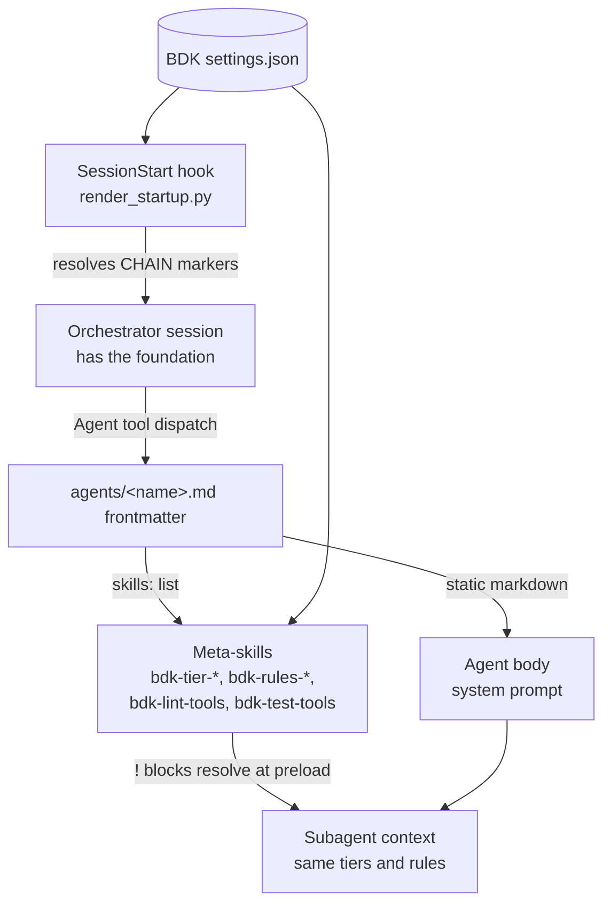

# The shared foundation

Every BDK skill starts with the same line: *relies on BDK foundation (`STARTUP_INSTRUCTIONS.md`)*. That file is the contract each skill inherits instead of restating. It is what makes a plain session, with no BDK skill invoked at all, still behave like a BDK session.

## What gets injected, and when

`STARTUP_INSTRUCTIONS.md` is delivered by a `SessionStart` hook that runs `scripts/render_startup.py`. The rendered text reaches the model before your first prompt, so it is in context for the whole session.

It carries five things:

| Section | What it settles |
|---|---|
| Tool Tier System | Which search, exploration, and impact tools to reach for first. See [Tool tiers](tool-tiers.md). |
| Agents | The subagent fleet, each one's model, and when to continue one rather than spawn a new one. See [Agents](agents.md). |
| Verification Proportionality | How much checking a change of a given size deserves. See [Verification scoping](verification-scoping.md). |
| Quality Rules | That BDK ships language-agnostic rule sets and how to override them. See [Quality and language rules](quality-and-language-rules.md). |
| Capture Conventions | Where a lesson or convention belongs, including the case where the answer is "nowhere". |

Everything else that could vary per project, including the test runner, the lint command, and the build tool, is deliberately absent. Skills never name a runner. The commands live in `.bdk/settings.json` and reach the agents that need them through preloaded meta-skills, which is what keeps a single skill body correct in a Python repo and a TypeScript repo at once.

## Why it is rendered rather than concatenated

The tool-tier sections are not fixed text. They are marker lines:

```markdown
<!-- CHAIN: explore.chain.json -->
```

An earlier design had the hook simply print `STARTUP_INSTRUCTIONS.md`. That does not work: Claude Code evaluates dynamic `` !`...` `` blocks in skill bodies only, never in hook output, so the markers would have arrived at the model as literal comments. `render_startup.py` therefore resolves each marker itself, substituting the tier content that matches your project's feature flags, before the hook returns.

Two consequences worth knowing:

- The path in a marker is resolved relative to `fragments/tool-tiers/`, and the whole marker line is replaced by the chain's resolved content.
- When `.bdk/settings.json` is missing, markers expand to nothing and the file is still emitted, so the prose-only sections reach the model anyway. You get the verification, agent, and capture conventions even in an unconfigured project.

!!! note
    A missing `.bdk/settings.json` is also what the `check-bdk-config` hook blocks on, which is why an unconfigured project sends you to `/bdk:setup` first. See [Hooks](../reference/hooks.md).

## Subagents do not inherit it

This is the part that surprises people. Skills are not inherited from the parent conversation, so a subagent spawned by `/bdk:cr` or `/bdk:subagent-execute-plan` starts without the foundation the orchestrator received. A reviewer that does not know the tool tiers falls back to grep in a repo with a knowledge graph, and nothing errors.

Plugin subagents cannot fix this with their own hook: the `hooks`, `mcpServers`, and `permissionMode` frontmatter fields are ignored when an agent ships inside a plugin. The supported field is `skills:`, which preloads full skill content into the subagent's context at startup.

So BDK ships a set of internal meta-skills whose only job is to be preloaded. Each is a frontmatter block plus a single dynamic line, for example:

```markdown
!`python3 ${CLAUDE_PLUGIN_ROOT}/scripts/inject.py --chain ${CLAUDE_PLUGIN_ROOT}/fragments/tool-tiers/search.chain.json`
```

Because that line lives in a skill body, it does resolve at preload time, and the subagent receives exactly the tier guidance the orchestrator got.



The meta-skills are marked `user-invocable: false`. They are listed in [Skills](../reference/skills.md) as a group rather than individually, because you never call them.

## Capture conventions

The last section of the foundation is a routing table for knowledge. Before recording a convention or a lesson anywhere, decide where it belongs:

| The knowledge | Where it goes |
|---|---|
| Cross-cutting invariant whose violation fails silently | `.claude/rules/`, scoped by the narrowest path glob that covers it |
| Trap visible at the code site where the mistake happens | a doc comment there |
| Something a test or a linter already enforces | one line naming the enforcer |
| Anything else | nothing |

A line that a rename or a file move would force you to edit is a mirror of the code, not a rule. The fourth row is the frequent and correct answer: never write something down just to have written it. `/bdk:add-rule` runs this routing properly and `/bdk:refine-rules` cleans up what accumulated anyway; see [Rules hygiene](../workflows/rules-hygiene.md).

This table is in the foundation rather than in those two skills because the decision usually happens in the middle of other work, at the moment you notice something, and not while you are running a rules skill.

## What this buys you

- **One place to change a convention.** Edit the foundation and every existing skill, plus every skill written afterwards, inherits the change.
- **A safe trivial tier.** Built-in plan mode plus a hand edit is still governed by verification proportionality and the tool tiers, which is why [the trivial workflow](../workflows/trivial.md) needs no BDK skill at all.
- **No prompt drift between orchestrator and subagent.** Both read the same fragments, resolved from the same settings file.

!!! warning
    The foundation occupies context in every single session. Keep additions to it short, and prefer putting detail in a skill that loads on demand.
