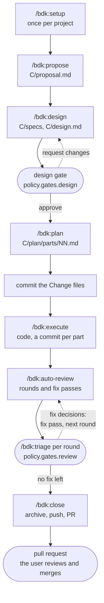
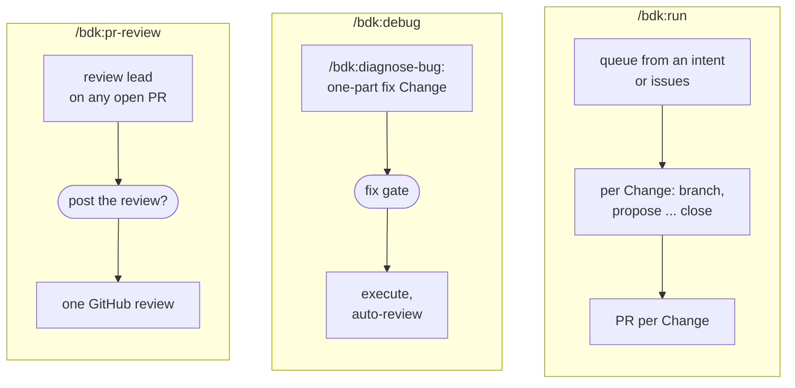
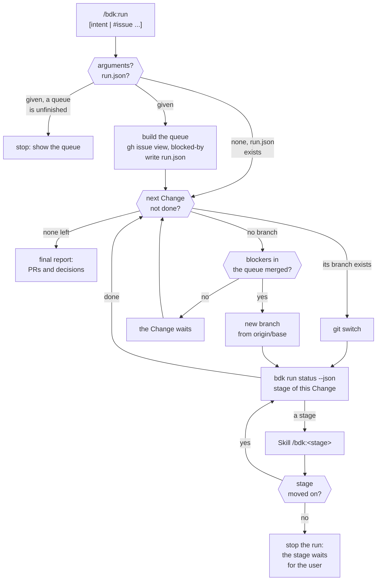

# The BDK workflow - from an intent to a pull request

How the BDK v3 stages chain into one workflow, where the user decides, and how the autopilot `/bdk:run` drives a queue of Changes.

Notation in the diagrams: see the [glossary](./glossary.md#notation-in-the-diagrams).

## From intent to pull request

Each stage is a command of its own, and each one ends its turn with a report that names the next command. A stage writes its result to files and starts at its first missing file, so any stage can be run again after a break.

Propose, design and plan leave the Change files uncommitted for review; `/bdk:run` commits them before execute, otherwise the user does. Three more entry points reuse these stages:

Points where the user decides, and the setting that skips them:

| Point | Skill | Asked when | Skipped when |
|---|---|---|---|
| Open questions of the intent | `/bdk:propose` | two readings change the scope | `policy.questions: decide-and-record` (recorded under `## Decided without the user`) |
| Open design decisions, data-model changes | `/bdk:design-draft` | a decision the proposal, code or conventions do not settle | `policy.questions: decide-and-record` (recorded as `Decided without the user:`) |
| Design gate | `/bdk:design` | after a passing `verify-N.md` | `policy.gates.design: auto` |
| Retry blocked parts | `/bdk:execute` | the lead returns `Status: blocked` | never retried under `decide-and-record`: the stage stops |
| Triage of findings | `/bdk:triage` | every round with undecided findings | `policy.gates.review: auto` (fixed policy table) |
| Fix gate | `/bdk:debug` | after a `ready` diagnosis | `policy.gates.design: auto` |
| Post the PR review | `/bdk:pr-review` | before anything reaches GitHub | `policy.questions: decide-and-record`, or "post without asking" in the request |

## Autopilot: `/bdk:run` over a queue

`/bdk:run` writes only `.bdk/runs/run.json`. It calls the same stage skills a user would, one Change at a time, each Change on its own branch from the base (no stacking). It stops whenever a stage ends without moving its Change on.

- A Change is done when `R/close/pr.md` exists. A blocker counts as merged only when `gh pr view` of its pull request says `MERGED`; a blocker outside the queue never makes a Change wait.
- The stage stays `design` while `R/design/gate.md` is not approved, whatever `bdk run status` says.
- Before `execute`, `/bdk:run` commits the uncommitted Change files with `/bdk:commit`: the execute lead builds only on a clean tree.
- A stage stops the run when it waits for the user: a gate or a question, a blocked part, a spent budget, a failing `/bdk:spec-conformance` report, a failed push.

## Sources

- `plugins/bdk/skills/*/SKILL.md`, in particular `run`, `propose`, `design`, `plan`, `execute`, `auto-review`, `close`, `debug`, `pr-review`
- `plugins/bdk/src/run/domain/status.ts` (`bdk run status`)
