# BDK v3 architecture - Design

**Date**: 2026-10-07
**Status**: Approved
**Branch**: Architecture
**Authors**: Claude + User

> Design doc only. It describes the target shape of BDK v3: what runs, in what order, who calls whom, and where state lives. It prescribes no files or code. The repository layout and release flow it builds on are in [ADR-0002](../adr/0002-v3-repo-structure-and-release.md).

---

## Problem

BDK v2 is slow, checks code rather than the product, keeps no living documentation and cannot be adapted by teams. The first v3 attempt (`draft/v3-1`) moved the process into a TypeScript kernel of 41,873 lines that held the stage order, dispatched one agent per task and turned distrust of the agent into bookkeeping. It failed on speed and on product-level correctness ([findings](../v3-draft1/run-b1/2026-10-07-bdk-v3-findings.md)).

v3 needs an architecture where the logic lives in skills that a team can read, change and measure, where the CLI only helps, and where a run proves that the product works.

**In scope:**
- How orchestration works: orchestrator skills, building-block skills, agents, the subagent tree.
- Stages, their loops and their order, for manual stages and for the autopilot.
- Change artifacts (OpenSpec), run state, run artifacts, findings, resume.
- Configuration and extension points, the CLI surface, hooks, rules.
- How skills are evaluated and the development rule for new skills.

**Out of scope:**
- Repository layout, CI and releases (ADR-0002).
- The content of each skill, its prompts and its eval cases.
- Living architecture documentation for user projects (dropped for now, see "What We Did NOT Decide").
- Run diagnostics from transcripts (later).

---

## Existing Codebase Context

- **Already present:** `staging/v3` holds v2.7.0: thin language-agnostic skills (`skills/`), 13 agents, `hooks/hooks.json`, `rules/`, `STARTUP_INSTRUCTIONS.md` injected at session start. `openspec/` is not initialised on this branch yet.
- **Draft 1 (`draft/v3-1`), what worked and stays:** design verification and plan verification each found real defects; the implementer stopped on a plan defect instead of working around it; the integration review after the group reviews found the only product blocker that 27 green tasks missed; the judge leveled findings; triage of 52 entries on one Lavish page; parallel waves of 5 agents; one plan part per agent with a `conform` step after it; plan parts as separate files with `depends-on` and `isolation`; three configuration layers with arrays merged by `id`; a rule pack with `paths`, `stages` and language packs selected per role.
- **Draft 1, root causes not to repeat:** process order held by the kernel (`pipeline/pipeline.yaml`, `bdk next`); the flow of one stage spread over six places; a ledger, tickets and guards around every agent; the kernel duplicating the host (`log ingest` = Agent result, `dispatch build` = Agent prompt, `agents wait` = task notifications); one agent per task (96 agents for 27 tasks); a main opus thread of 1,037 turns and 199 M cache-read tokens; 1,349 of 1,808 Bash calls were `bdk`; a run of 11 h of which about 7 h 20 min was waiting for the user.
- **Measurements that still hold:** a thin stage skill performed no worse than a long one (n=5); 8 of 9 craft skills changed the outcome, `data-modeling` did not; of 131 rule bullets 13 were effective and 62 no-ops, while whole rule files in a reviewer prompt raised detection.
- **Host facts** ([HOST-FACTS](../v3-draft1/host/HOST-FACTS.md), current docs for [skills](https://code.claude.com/docs/en/skills), [sub-agents](https://code.claude.com/docs/en/sub-agents), [workflows](https://code.claude.com/docs/en/workflows), [plugin evals](https://code.claude.com/docs/en/plugin-evals)):
  - No skill calls another skill directly; the model calls the `Skill` tool, and an agent can preload skills with `skills:`.
  - A skill with `context: fork` and `agent: <plugin>:<agent>` runs on that agent (`fork-plugin-agent`); forks run in the foreground and not concurrently in `claude -p` (`fork-concurrency`).
  - Subagents nest up to 3 levels under the main thread. How many run at once is not probed; the design assumes a wave of about 5.
  - A subagent that ends its turn does not wait for its background children (`lead-detach`); several foreground `Agent` calls in one message run in parallel, and the caller receives nothing until all of them return (`lead-fg`).
  - A skill with a `!` block needs `allowed-tools` covering the command (`Bash(bdk *)`); otherwise the invocation aborts in default permission mode and nothing reaches the model (`allowed-control`, `plugin-bin-skill`). `!` resolution is probed for the `Skill` tool and for forks, not for skills preloaded with `skills:`.
  - `Stop` and `SubagentStop` hooks can block the end of a turn and send the thread back (`stop-block`). `SubagentStop` carries `last_assistant_message` and fires for background agents, but not on `maxTurns` or `TaskStop`.
  - Plugin `bin/` is on the `PATH` of Bash, subagents and skill `!` blocks, not of command hooks.
  - Dynamic workflows run JS scripts with `agent()`, `parallel()`, `pipeline()`; no user input mid-run, no file access from the script, can be disabled by an organisation.
  - `claude plugin eval` runs cases with and without the plugin, with `regex`, `tool_used`, `tool_order`, `file_exists`, `llm` and `baseline` graders; every run is paid.
  - OpenSpec 1.13.2 supports project schemas (`openspec schema init|fork`, experimental); an artifact may generate a glob of files; `apply.tracks` is optional; `openspec archive` merges only requirement deltas into `openspec/specs/`.

---

## Constraints & NFRs

| Dimension | Value | Source |
|---|---|---|
| Logic placement | Logic in skills; the CLI helps and never blocks; models change week to week | User |
| Development order | A new skill starts as a plain skill; a CLI helper, hook or workflow is added only when an eval or measurement shows a concrete need | User |
| Composition | Many small skills composed by orchestrators; each block usable and evaluable alone | User |
| Scope of v3.0 | Change pipeline (propose, design, plan, execute, review, close), auto review, living specs, debug, PR review, setup, craft skills, tools (commit, ADR, rules) | User, Q P1 |
| Modes | Manual stage commands and the autopilot `run`; gates, budgets, escalation and questions set by configuration | User, Q P2 |
| Scale of a run | A queue of Changes; thousands of tasks over a run; the whole queue in one session, relying on compaction and resume from files | User, S1 |
| Speed | A change the size of B1 (27 tasks, 62 files): execute <= 15 min; approved plan to PR <= 45 min of machine time with `auto` gates (user waits measured apart). Rough budget: execute 15, two review rounds of about 10 each, close 5 | User, Q R2, V2 |
| Correctness | Before "done": acceptance tests from the spec, E2E run as a user would, integration review of intent and spec against code, spec conformance | User, Q R2 |
| Priority on conflict | Quality, then speed, then token cost | User, Q R2 |
| Living documentation | OpenSpec with a BDK schema, required in a BDK project; no architecture sync | User, Q D2 |
| Configurability | Settings, own orchestrators from BDK blocks, block replacement, project rules, installing a subset of plugins | User, Q P4 |
| Without configuration | Every BDK skill except `/bdk:setup` stops with a warning to run setup | User |
| Repository of a user project | Code and the Change artifacts (proposal, specs, design, plan); run artifacts stay local, outside git | User, Q P3 |
| Permissions of the autopilot | Auto permission mode; `/bdk:setup` adds allow rules for `Bash(bdk *)`, the `tools.*` commands, and `git` and `gh` for the main thread; `hooks.subagent-git` is on in an autopilot run, so workers never change git history; only the lead and the main thread commit | User, V3 |
| E2E | The product is started and driven from configuration (`tools.e2e`), detected by `/bdk:setup`; without an entry E2E is skipped and the report says so | User, V1 |
| Runtime | Node only, no Python | ADR-0002 |

---

## Considered Approaches

### D1 - Where orchestration lives

All three diagrams show the same example, one auto-review round.

#### A - Orchestrator skill in the main thread

The orchestrator is a skill the main thread follows; blocks are skills called with the `Skill` tool or preloaded into a subagent.

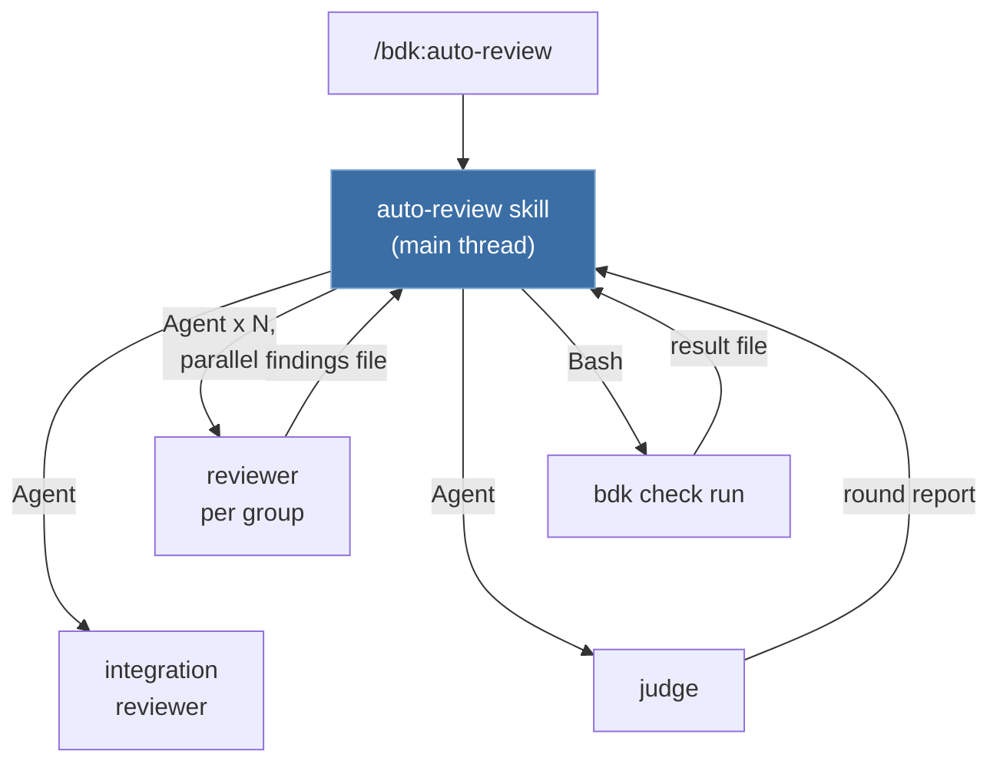

- Pros: the user can be asked directly; simplest; logic is plain skill text.
- Cons: every agent result and every step is a main-thread turn, often on opus; long stages fill the context. That was the largest cost of B1.

#### B - Workflow orchestrator

Mechanical orchestrators are plugin dynamic workflows; interactive stages stay skills.

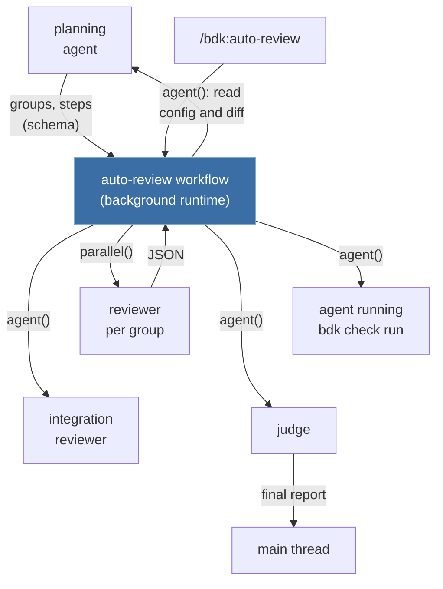

- Pros: deterministic loop; intermediate results stay out of every context.
- Cons: no user input mid-run; the script cannot read configuration files; an organisation can disable workflows; a launch needs approval outside auto and bypass modes; orchestration moves from skill text into JS.

#### C - Lead agent per stage

The stage skill runs in one lead subagent that starts the workers and returns a summary.

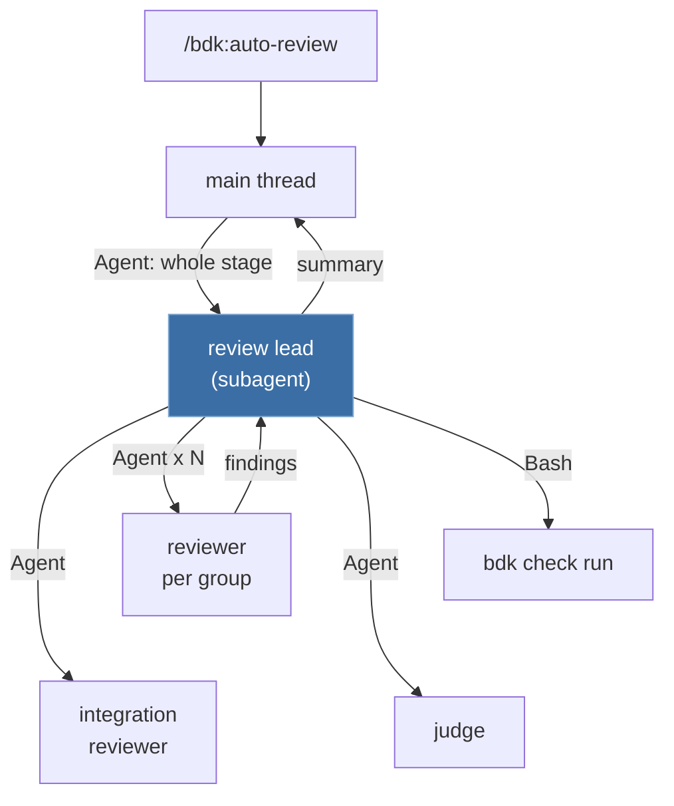

- Pros: the main thread gets one summary per stage; the lead can run on a cheaper model; each stage starts with a fresh context.
- Cons: the lead cannot hold a conversation with the user; the tree uses all 3 levels (main, lead, worker, helper); the lead must start its workers as blocking calls (`lead-detach`).

**Decision: A and C together (hybrid), B later.** In A and C the orchestrator is the same skill; only where it runs differs. Stages that talk to the user run in the main thread; long mechanical stages run in a lead. B stays an option for a lead that measurements show to be purely mechanical.

### D2 - Living documentation

| Option | Shape | Outcome |
|---|---|---|
| D2-1 | OpenSpec as is, plus `docs/architecture` kept current by a skill | Rejected: architecture sync dropped |
| **D2-2** | **OpenSpec with a BDK schema: Change artifacts match BDK stages** | **Selected** |
| D2-3 | Own lightweight format and merge in BDK | Rejected: own parser, validation and merge to maintain, as in draft 1 |

`openspec archive` merges only requirement deltas, so no option gave architecture sync for free. Specs describe behaviour; the BDK schema shapes the Change around BDK stages. OpenSpec is required in a BDK project, and `/bdk:setup` initialises it.

### D3 - Run state

| Option | Shape | Outcome |
|---|---|---|
| **D3-0** | **One writer of the state, run artifacts by naming convention** | **Selected, with the execute lead as the writer** |
| D3-1 | Plan file as the source of truth, CLI helpers from the start | Rejected: helpers before a measured need |
| D3-2 | The CLI holds all state; skills report every transition through commands | Rejected: a skipped command means a false state; the draft 1 path |

Several writers make any state drift, file or CLI alike. The part state has one writer: the execute lead, one process that records each part after its conform report, one part at a time. The state is JSON, easy to edit by a program; the context gets a rendered view in any format. A hook as the writer was considered and deferred with the hook engine (see "Autopilot continuation").

---

## Selected Architecture

### Principles

1. **A skill holds the logic.** The text of a skill says what happens and in what order. Nothing outside the skill text decides the order of the work.
2. **One block, one job.** An author block writes, a verifier block checks, an orchestrator only composes. Each block runs alone with its own command and has its own eval cases.
3. **The agent works on a plan part, never on a task.**
4. **Every step writes a file.** Results pass between steps as files with fixed names, so a run can resume and later steps can read earlier ones.
5. **One writer per piece of state.** Agents append their own results; only the execute lead writes the part state, and only `/bdk:run` writes the queue.
6. **The CLI computes, it does not govern.** A command is deterministic or saves a model turn; none changes the process; a skill states what to do when a helper is missing.
7. **Plain skill first.** A helper, hook or workflow is added only for a concrete, recorded problem.

### Layers

Calls go down only. A lead returns its summary or blocker to its caller.

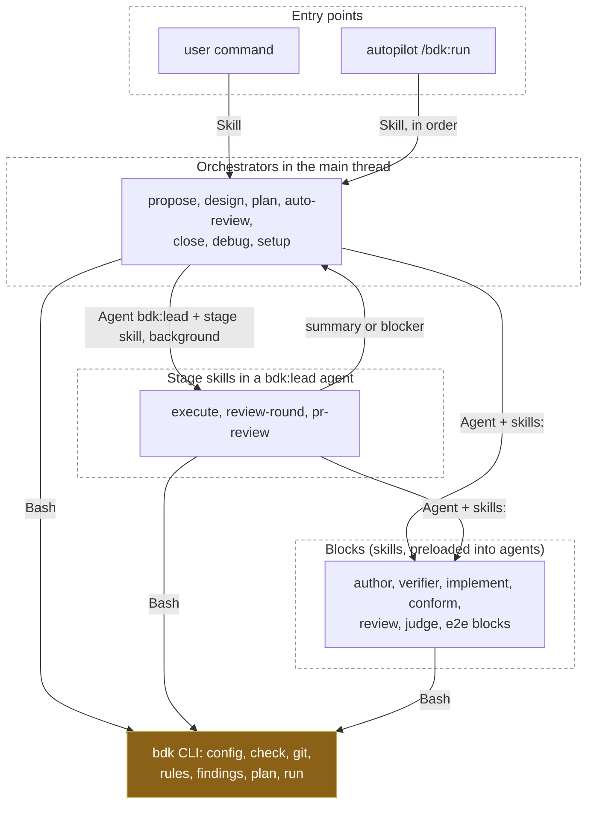

`/bdk:execute` and `/bdk:pr-review` are thin main-thread skills: they start a `bdk:lead` agent with the stage skill preloaded, so the lead can be continued with `SendMessage`. `review-round` is only a lead skill, started by `/bdk:auto-review`.

The tree under the main thread: lead (level 1), worker such as an implementer or reviewer (level 2), helper such as an explorer (level 3, the host limit). A lead starts its workers as foreground `Agent` calls, several in one message, so it waits for them in every mode. In an interactive session the main thread starts the lead in the background and gets its result as a notification; in non-interactive mode (`claude -p`, evals) it starts the lead in the foreground (`execution.lead`).

### Plugins

| Plugin | Holds |
|---|---|
| `bdk` | Orchestrators, blocks, agents, the BDK OpenSpec schema, the rule pack, hooks, the `bdk` CLI |
| `bdk-craft` | Craft knowledge skills (TDD, debugging, API design and others), each admitted by a with/without eval |
| `git-identity`, `bdk-skill-kit` | Unchanged in scope, moved per ADR-0002 |

### Stages and units of work

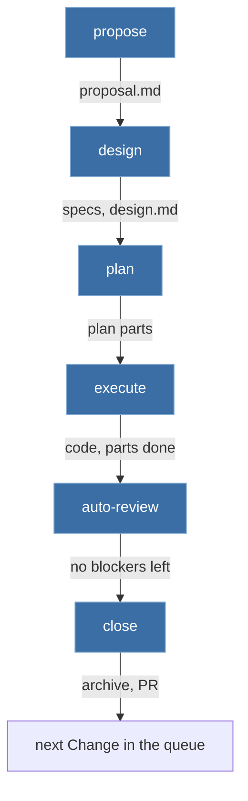

- A **run** works through a queue of Changes. Each Change gets its own fresh leads.
- A **Change** has plan **parts**, and one agent implements a part whole. Part limits are configuration (`plan.part.*`), with draft 1 defaults: at most 5 tasks, 10 distinct files and 8 KB per part file; the prompt an agent receives (part, rules, instructions) stays under 160 KiB. B1 had 7 parts, 27 tasks and 62 files, about 4 tasks and 9 files per part, so the defaults fit what a real plan produced.
- **Wave depth decides the duration, not part size.** B1's parts formed a chain (01, then 02 and 03, then 04, 05, 06, 07): 6 waves, one of them with two parts. With one agent per part, execute time is roughly the number of waves times the time of the slowest part, so the 15 minute target needs a plan of 2-3 waves. `plan-draft` keeps chains short (parts split by independent files, shared contracts first), and `bdk plan check` reports the wave count next to the sizes.
- Each stage is also a manual command (`/bdk:design` and so on). `run` has no stage logic of its own; it calls the same skills.

### Catalog

Names are working names. Models are defaults that configuration overrides per role.

**Orchestrators (user commands)**

| Skill | Runs in | Composes | Writes |
|---|---|---|---|
| `/bdk:run` | main thread | the stages in order over a queue of Changes; gates by `policy.gates` | `run.json` |
| `/bdk:propose` | main thread | intent or GitHub issue, `openspec new change` | `proposal.md` with capabilities |
| `/bdk:design` | main thread | `explore`, `design-draft`, `verify-design` loop, gate | `specs/`, `design.md` |
| `/bdk:plan` | main thread | `plan-draft`, `bdk plan check`, `verify-plan` loop | `plan/parts/NN.md` |
| `/bdk:execute` | main thread, starts a lead | `implement-part`, `conform-part` and merge-back per part, in waves | code; part reports; `state.json` |
| `/bdk:auto-review` | main thread | `review-round` (lead) rounds, `triage`, fixes through `execute` | `review/round-N/` |
| `/bdk:close` | main thread | `spec-conformance`, `openspec archive`, `commit`, PR | PR |
| `/bdk:debug` | main thread | E2E reproduction, failing test, fix, `auto-review` of the fix scope | fix with its test |
| `/bdk:pr-review` | main thread, starts a lead | `review-group`, `review-integration`, `judge` on a GitHub PR | PR comments |
| `/bdk:setup` | main thread | stack detection incl. `tools.e2e`, `.bdk/settings.yaml`, permission allow rules, OpenSpec init with the BDK schema | configuration |

**Blocks**

| Block | Agent (default model) | Does |
|---|---|---|
| `explore` | `bdk:explorer` (haiku) | Maps the code a proposal touches |
| `design-draft` | main thread | Approaches, questions (Lavish or policy), specs and design |
| `verify-design`, `verify-plan` | `bdk:verifier` (opus) | Checks the design or plan against the code; continued with `SendMessage` across iterations |
| `plan-draft` | main thread | Parts with tasks as contracts, `depends-on`, `isolation`, acceptance scenarios from the specs |
| `implement-part` | `bdk:implementer` (sonnet) | One part: acceptance tests first, code, part checks; stops on a plan defect |
| `conform-part` | `bdk:conformer` (sonnet) | Checks the part's diff against rules, project instructions and tasks; fixes without changing behaviour |
| `review-round` | `bdk:lead` (sonnet) | Lead skill of one review round, see "Flows" |
| `review-group` | `bdk:reviewer` (sonnet) | Reviews one group of files against the `review` rules |
| `review-integration` | `bdk:integration-reviewer` (opus) | Intent and spec against the whole change; seams between parts |
| `e2e-check` | `bdk:e2e-tester` (sonnet) | Starts the product from `tools.e2e` and drives it as a user would, per spec scenario |
| `judge` | `bdk:judge` (sonnet) | Sets the level of each finding |
| `triage` | main thread | Lavish page of the findings, or policy in auto mode; writes decisions |
| `spec-conformance` | `bdk:verifier` (opus) | Do the spec deltas describe the product after the change? |
| `run-checks` | none | How to call `bdk check run` and read its result |

Tools: `commit`, `adr`, `add-rule`, `refine-rules`, `mermaid-drawer`.

### Flows

#### Autopilot

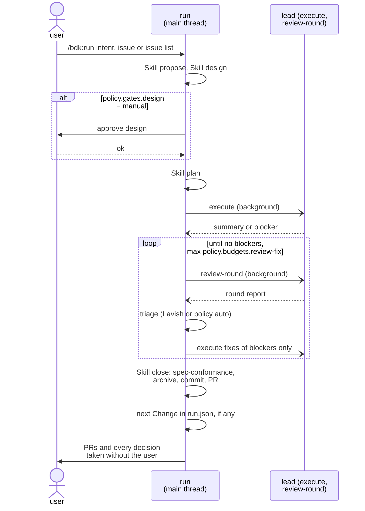

With several Changes, each Change gets its own branch from the base branch and its own PR; Changes are not stacked ([D9](./2026-10-07-v3-skills-decisions.md#d9-no-stacked-prs)).

#### Design

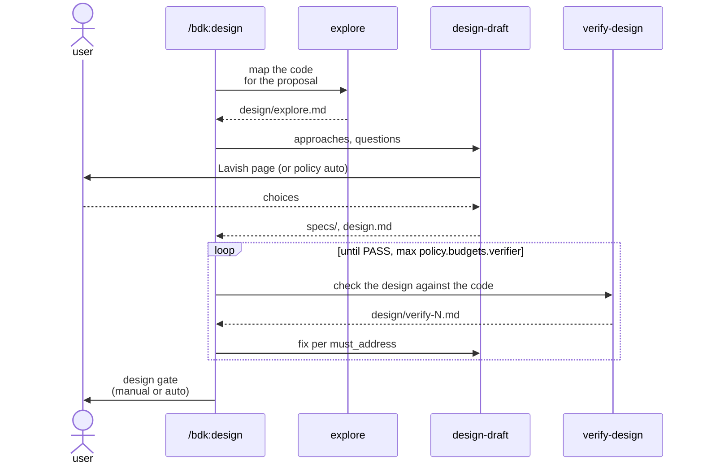

#### Plan

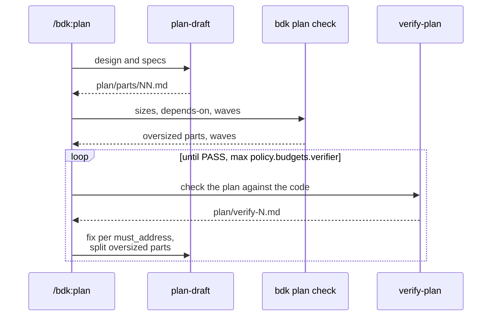

#### Execute

Parts of one wave run in parallel, each in its own worktree when its `isolation` asks for it. Waves follow `depends-on`. Every agent gets the absolute path of the Change's run directory, so a part working in a worktree writes its reports where the lead reads them. Workers edit files and never touch git history; the lead commits each part in its worktree and merges the worktrees into the Change branch. A wave holds either one `shared` part, which works in the Change checkout and is committed by the lead first, or only worktree parts; `bdk plan check` enforces this.

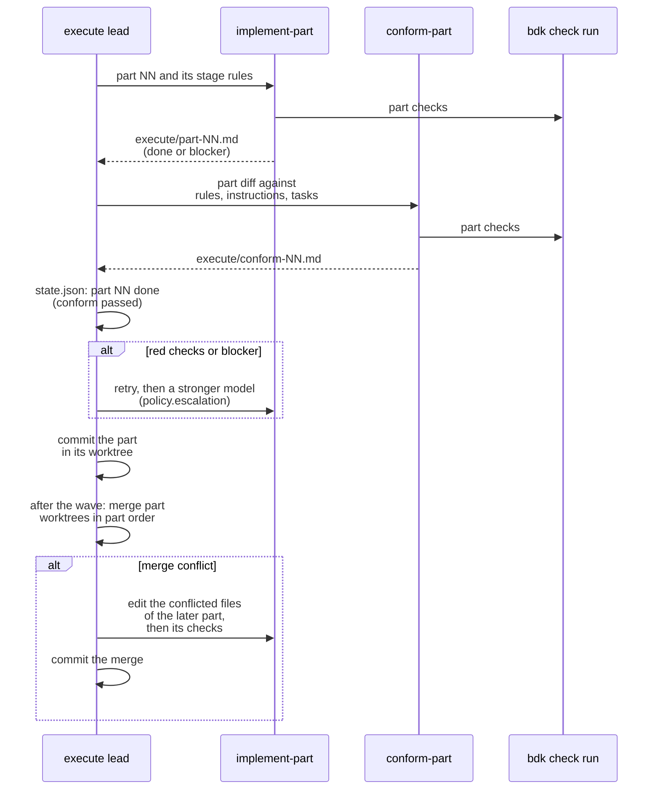

A blocker left after the retries and the escalation goes back to the main thread. In auto mode the main thread decides by policy and records the decision; otherwise it asks the user, then continues the lead with `SendMessage`.

#### Review round

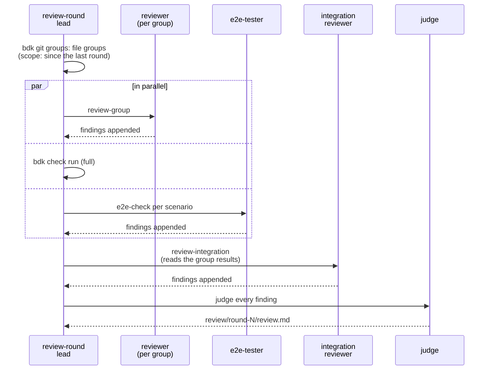

From draft 1: integration after the groups, the judge, a report for the user. New: a later round covers only the scope of the fixes (B1 ran full rounds 3 and 4 for one or two minor entries), and E2E runs in every round.

### Change artifacts: the BDK OpenSpec schema

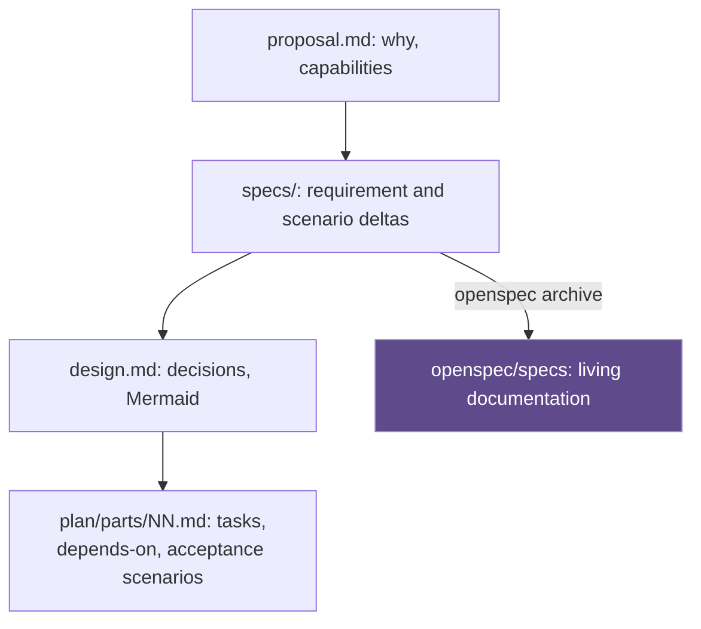

- The schema ships in the `bdk` plugin; `/bdk:setup` installs it into the project's `openspec/schemas/`.
- The `plan` artifact generates one file per part. Each part's frontmatter holds `id`, `depends-on`, `isolation` (`worktree` or `shared`) and `files`.
- The schema has no `apply.tracks`: progress is run state, not a checklist in the Change.
- The Change is committed. `openspec status` reports which artifacts exist.

### Run state, run artifacts and resume

Run state and run artifacts live in `.bdk/runs/`, outside git.

| File | Written by | Read by |
|---|---|---|
| `run.json` (queue of Changes, current Change, mode) | `/bdk:run` | `run` after a break |
| `<change>/state.json` (parts: pending, done, blocked; attempts) | execute lead only | lead, `bdk run status`, resume |
| `<change>/design/explore.md`, `design/verify-N.md` | explorer, verifier | `design-draft`, resume |
| `<change>/plan/verify-N.md` | verifier | `plan-draft`, resume |
| `<change>/execute/part-NN.md`, `execute/conform-NN.md` | implementer, conformer | lead, resume |
| `<change>/checks/<id>.json` | `bdk check run` | implementer, review |
| `<change>/review/round-N/findings.jsonl`, `review.md` | reviewers, judge, triage | fixes, next round, PR |
| `<change>/e2e/<scenario>.md` | e2e-tester | review, close |

**Resume.** After a break or a compaction, a stage reads `run.json`, `state.json`, `openspec status` and its own directory, and starts at the first missing file. Example: `design/verify-2.md` says FAIL and there is no `verify-3.md`, so the design is fixed and verified again. The number of review rounds is the number of `round-N` directories; turns and time come from transcripts.

### Autopilot continuation

In v3.0 `/bdk:run` drives itself: its skill text runs the stages in order and, after `close`, takes the next Change from `run.json`. No hook keeps the thread going. If the session stops (a break, a question, a crash), `/bdk:run` started again reads `run.json` and derives the open stage of the current Change from files. The rows are checked in order and the first match wins; a state no row describes falls back to the earliest stage whose output is missing, never to close.

| # | Missing or open | Stage to run |
|---|---|---|
| 1 | no `proposal.md` | propose |
| 2 | no `design.md`, or the last `design/verify-N.md` is not PASS | design |
| 3 | no `plan/parts/`, or the last `plan/verify-N.md` is not PASS | plan |
| 4 | a part not done in `state.json` | execute |
| 5 | no `review/round-N/` yet | auto-review, first round |
| 6 | a round directory without `review.md` (the round crashed) | auto-review, that round again |
| 7 | blockers in the last report without a decision | auto-review, triage |
| 8 | `fix` decisions in the last round that no later round covers | auto-review, fixes then a round on their scope |
| 9 | no spec-conformance report, or the Change not archived, or no PR | close, from its first missing step |

- **One session for the whole queue** (user decision). The run relies on compaction: what a stage needs is in files, so a compacted main thread loses nothing it cannot read again. `/bdk:run` started in a new session continues the same queue.
- In an interactive session the main thread starts a lead in the background and waits for its notification; nothing pushes it while it waits.
- A part is done when its conform report passes, not when the implementer reports; a crash between the two re-runs the conform.

**Deferred: a `Stop`/`SubagentStop` hook engine.** A hook could record part results and block the end of a turn to push a run on. Validation showed how it goes wrong: it can wake a main thread that waits for a background lead, send a worker on to a part that is not its own, and lose updates when parallel hook processes write one file. That is the kind of process control that sank draft 1, so it is not built in v3.0. It is added only when measurement shows autopilot runs stopping without a reason, and its design then starts from the cases above.

### Findings and triage

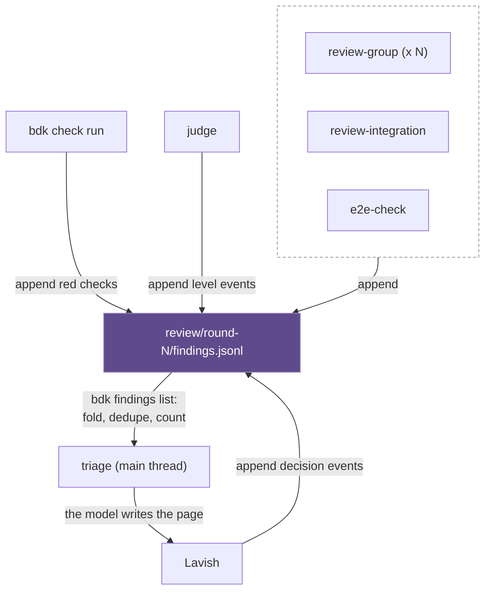

- The file is an event log. A `finding` line holds `id`, `source`, `file`, `line`, `rule`, `summary`, `evidence`. A `level` line (judge: blocker, should-fix, nice-to-have, not-a-problem) and a `decision` line (triage: fix, accept, defer, with an issue only when the user chose one) name a finding id. `bdk findings list` folds the log into the current view; the event schema and the dedupe key are in spec `bdk-cli/findings`.
- Writers append through `bdk findings add|level|decide`, which opens the file in append mode and writes one line per call, so parallel reviewers never rewrite each other's lines. `bdk check run` appends red checks itself.
- In draft 1 a kernel ledger held findings (`bdk log add|list|triage`); here the file and `bdk findings` replace it.
- The model writes the triage page from the merged findings, following the `lavish-axi` playbooks. In auto mode the judge's levels and the policy decide.

### Configuration and extension points

Three layers as in draft 1: global (`~/.config/bdk/settings.yaml`), project (`.bdk/settings.yaml`, committed) and local (`.bdk/settings.local.yaml`). Arrays merge by `id`. Every BDK skill that reads the configuration starts with a `!` block running `bdk config show` and lists `Bash(bdk *)` in `allowed-tools`, which the host requires for the block to run in default mode. The block injects the resolved configuration before the model's first turn. Without a configuration or without OpenSpec, the block prints one line, "BDK not configured: run /bdk:setup", and the skill's first instruction is to stop and pass it on. Only `/bdk:setup` and the tools that read no configuration (`commit`, `adr`) run without one.

| Key | Purpose |
|---|---|
| `tools.test`, `tools.lint`, `tools.build` | Check commands, with a `scoped` variant taking `{files}` |
| `tools.e2e` | Entries by `id`: `start` (command), `ready` (URL or command), `driver` (`cli`, `http`, `browser`), `env`; read by `e2e-check` |
| `languages`, `rules.disabled` | Rule language packs, rules switched off; project rules in `.bdk/rules/` |
| `models.<role>` | Model per role |
| `policy.gates.design`, `policy.gates.review` | `manual` or `auto` |
| `policy.questions` | `decide-and-record` (autopilot default) or `stop` |
| `policy.budgets.*`, `policy.escalation.*` | Attempts per part and round, model escalation on a blocker |
| `plan.part.max-tasks`, `plan.part.max-files`, `plan.part.max-bytes` | Part limits; defaults 5, 10 and 8 KB |
| `steps.<orchestrator>` | The blocks of an orchestrator; an entry can be switched off or replaced by a project skill or agent |
| `execution.lead` | `background` (interactive default) or `foreground` (non-interactive) |
| `hooks.subagent-git` | Refuse git history changes in worker subagents (every agent type except `bdk:lead`); on by default in an autopilot run |

Extension points: settings; an own orchestrator as a project skill calling BDK blocks; block replacement through `steps`; project rules; installing a subset of the plugins.

### CLI

| Command | Helps with |
|---|---|
| `bdk config show`, `check`, `set` | Resolved configuration with origins; validation |
| `bdk check run [--scope]` | Runs `tools.*`, writes `checks/<id>.json` |
| `bdk git groups`, `scope` | Splits a change into review groups; scope since the last round |
| `bdk rules for --stage --files` | The rules for a stage and a set of files |
| `bdk plan check` | Part sizes, `depends-on` cycles, waves |
| `bdk findings add\|level\|decide\|list` | Appends finding, level and decision events; folds, dedupes and counts; lists what to fix (spec `bdk-cli/findings`) |
| `bdk run status` | Renders `run.json`, the part states and the derived stage for the context |
| `bdk hooks session-start` | The hook below |

Hooks call `node "${CLAUDE_PLUGIN_ROOT}/dist/<cli>.mjs"`; everything else calls `bdk` from `bin/` (ADR-0002).

### Hooks

| Hook | Behaviour |
|---|---|
| `SessionStart` | Short BDK context; without a configuration, one warning and nothing injected |
| `PreToolUse` | `hooks.subagent-git`: refuses git history changes in worker subagents; the lead commits and merges (on in autopilot runs) |

Removed from draft 1: process-order guards, write-scope guards, agent-tree guards, the agent registry and run journal, the stage gate on `UserPromptExpansion` (a stage skill checks its own input and warns), the `SessionEnd` checkpoint.

### Rules

The BDK rule pack works as in draft 1: one file per rule with `kind`, `paths` and `stages`; language packs enabled by `languages`; project rules beside them. `bdk rules for` selects the rules for a role's stage and files, and the orchestrator puts them into the agent's prompt. A rule stays in the pack only while a measurement shows that it changes the outcome.

### Evals and the development rule

- **Block:** `claude plugin eval` cases under `plugins/bdk/evals/<block>-<case>/`, fixtures through `scaffold_script`, `llm` and `file_exists` graders, with and without the plugin. A block stays when it changes the outcome.
- **Orchestrator:** `--ablation none`, `tool_order` graders for the order of blocks, `file_exists` for the run artifacts, `llm` for the outcome; time and turns from the report.
- **Speed target:** a B1-sized fixture measures the 15 and 45 minute targets; it runs by hand because it is paid.
- **Development rule (recorded in `CLAUDE.md`):** a new skill starts as a plain skill with an eval. A CLI helper, hook or workflow is added only when an eval or a measurement shows a concrete problem, and the problem is recorded.

---

## Risk Register (Devil's Advocate)

| Risk | When it bites | Mitigation |
|---|---|---|
| Bottleneck: the main thread runs propose, design, plan, triage and close for every Change in one context | A queue of several Changes; B1 needed 3 compactions for one | Leads return a few lines and a file path; findings and reports stay in files; after a compaction every stage resumes from `run.json`, `state.json` and the run files, not from memory; Changes per session and quality per Change are measured, and a drop is the trigger for one session per Change (`/bdk:run` ending after each PR, restarted by the user or a shell loop) |
| Bottleneck: a review lead holds every finding of a round | Rounds with dozens of findings | The judge writes the report to a file; the lead reads counts and paths only |
| SPOF: the model skips a step of an orchestrator, such as E2E | Model change, long context | Every step writes a file the next step needs; `tool_order` and `file_exists` eval graders catch regressions |
| SPOF: the model leaves the `/bdk:run` loop early | Long runs, compaction | `run` resumes from `run.json` and files; a measured pattern of early stops is the trigger for the deferred hook engine |
| Lost updates in run state | A second writer appears (a manual edit, a parallel lead) | One writer per file: the execute lead for `state.json`, `/bdk:run` for `run.json`; one execute lead per Change |
| Guard blocks the merge-back | `subagent-git` scoped too wide | The guard exempts `bdk:lead` by `agent_type`; workers only edit files; an eval covers a wave with two worktree parts |
| Worktree merge conflicts | Parallel parts touch the same file despite `files` in the plan | `bdk plan check` flags overlapping `files` within a wave; the lead merges in part order; the implementer of the later part resolves a conflict and reruns its checks |
| Hidden cost: a blocker crosses two levels (worker, lead, main) | A lead resolves a blocker silently | The lead records every decision taken without the user in its report; an eval checks that blockers reach the main thread |
| Hidden cost: every block and orchestrator needs paid eval cases | Each model change | A small case set per block; the B1 fixture runs by hand |
| Hidden cost: the tree uses all 3 levels under the main thread | A helper of an implementer needs its own helper | Helpers do not spawn; the limit is configurable by the host but not relied on |
| Experimental dependency: OpenSpec project schemas | An OpenSpec release changes schema handling | Pin the OpenSpec version in setup; `bdk config check` validates the schema; fall back to `spec-driven` plus BDK plan files |
| Assumption: 15 min execute is reachable | B1 took 47 min for 6 waves with one agent per task; the time of one part agent is not measured | Measure the time per part on the B1 fixture; `bdk plan check` reports waves; keep plans to 2-3 waves. Measured (#208, archived Change `v3-208-measure-speed-b1`): execute 7.6-7.8 min in 3 waves, plan to PR 22.9-26.5 min |
| Assumption: a background lead works in interactive sessions and a foreground lead in `-p` | Host changes in background task handling | `execution.lead` switch; probe both modes before building the leads |

---

## What We Did NOT Decide

- [ ] Living architecture documentation for user projects: dropped for v3.0. Specs cover behaviour only; a `docs-sync` block can be added later without changing the rest.
- [ ] Whether a subagent can use `AskUserQuestion` itself (probe); today a lead returns a blocker and the main thread asks.
- [x] Whether the main thread in `claude -p` keeps running while a background lead works: yes, it waits for the lead's notification (probed on Claude Code 2.1.294 in #200); `execution.lead: foreground` stays a switch.
- [ ] Exact JSON schemas of `run.json` and a part state (the finding events are in spec `bdk-cli/findings`).
- [x] Probe: does `!` resolve in a skill preloaded into an agent with `skills:`? Yes, and `${CLAUDE_PLUGIN_ROOT}` is substituted too (probed on Claude Code 2.1.293 in #193).
- [ ] The `Stop`/`SubagentStop` hook engine for the autopilot: deferred until measured; probes of the `Stop` payload (`background_tasks`, `last_assistant_message`) belong to that work.
- [x] How many subagents run at once: 19 workers under one lead ran at once in the probe of #200, the host refusing the 20th (20 running subagents per session); `execution.max-parallel` defaults to 10 ([D8](./2026-10-07-v3-skills-decisions.md#d8-wave-size-limit)).
- [ ] When one session for the whole queue degrades quality: measured; the fallback is one session per Change.
- [x] Stacked PR upkeep: no stacking ([D9](./2026-10-07-v3-skills-decisions.md#d9-no-stacked-prs)).
- [x] Lavish in user projects: optional, `AskUserQuestion` without it ([D4](./2026-10-07-v3-skills-decisions.md#d4-lavish)).
- [ ] The file contract a replacement block in `steps.<orchestrator>` must meet (inputs, the file it writes, its return line).
- [ ] How `run` orders a queue built from a GitHub milestone; v3.0 takes an intent, an issue or an issue list (ordered by "blocked by").
- [ ] `bdk run next` and transcript diagnostics (`bdk diag`): added only after a measured need.
- [ ] Workflow (B) versions of `execute` or `review-round`: only after the skill versions are measured.
- [ ] Final skill and agent names.

---

## Loop-back History

| Iteration | Gap surfaced | Looped to | Outcome |
|---|---|---|---|
| 1 | Hooks of draft 1 unclear | Phase 1 | Hook list reviewed; `SessionStart` kept, `subagent-git` optional |
| 1 | Approach A rejected C on draft 1 evidence that concerned per-task leads and background waits | Phase 2 | A and C compared fairly; hybrid selected |
| 1 | Architecture cannot be merged by `openspec archive` | Phase 2 | Architecture sync dropped; D2-2 selected |
| 1 | Several writers make run state drift | Phase 2 | One writer per state file; state in JSON |
| 1 | Stages were single skills; no proposal step; no conform step; findings had no owner | Phase 2 | Author and verifier loops; `propose`; `conform-part`; `findings.jsonl` with `bdk findings` |
| 1 | Runs over thousands of tasks; resume after a break | Phase 2 | Queue of Changes, parts as files, every step writes a file |
| 1 | Part size limits questioned (8 KB or 160 KiB?) | Phase 2 | 160 KiB was the agent prompt limit; part limits 5 tasks, 10 files, 8 KB kept as configuration; wave depth named as the driver of execute time |
| 2 (verifier) | Stop hook engine blocked a thread waiting for a background lead, could redirect workers and lose parallel writes | Phase 2, user | Hook engine deferred ("too risky, everything could stall again"); `/bdk:run` drives itself; the execute lead writes `state.json` |
| 2 (verifier) | Worktree parts wrote run files outside the main checkout; no merge-back | Phase 2 | Absolute run directory for every agent; merge in part order after each wave |
| 2 (verifier) | Findings writers rewrote the file; judge and triage edited lines | Phase 2 | Event log appended through `bdk findings add\|level\|decide` |
| 3 (verifier) | Resume table sent a Change without a review round to close | Phase 2 | Nine ordered rows, earliest missing stage as the default |
| 3 (verifier) | `subagent-git` would refuse the lead's commits and merges | Phase 2 | Guard limited to workers; the lead commits and merges |
| 3 (verifier) | Queue scale without a session reset | Phase 1, user | Whole queue in one session with compaction; session per Change as the measured fallback |

---

## Next Steps

- [ADR-0003](../adr/0003-v3-architecture-skills-first.md) records the decisions D1, D2 and D3.
- GitHub issues for the v3.0 milestone, in order: OpenSpec init and the BDK schema; `bdk config` and `/bdk:setup`; `bdk check run`; plain skills for each block with their eval cases; orchestrators; host probes listed above. The `Stop`/`SubagentStop` hook engine is not in v3.0; its trigger is a measured pattern of autopilot runs stopping without a reason.
