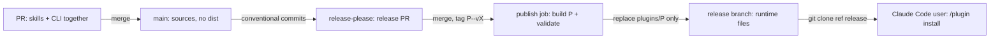
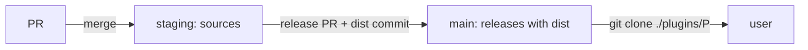
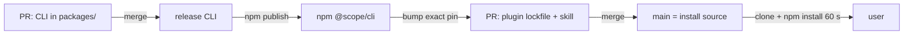
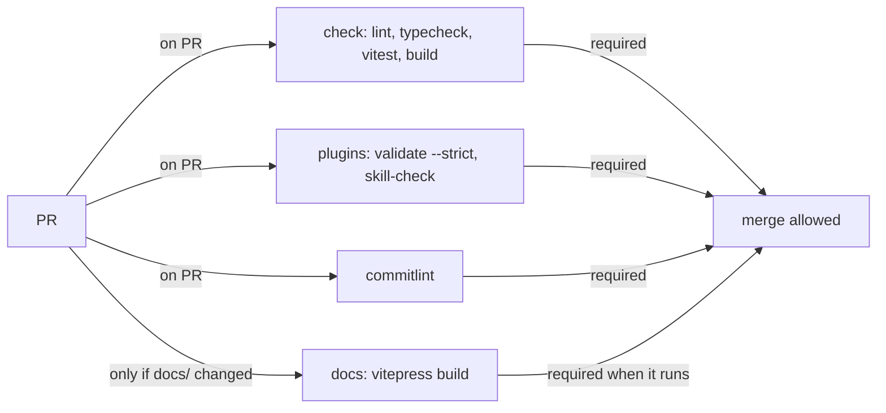
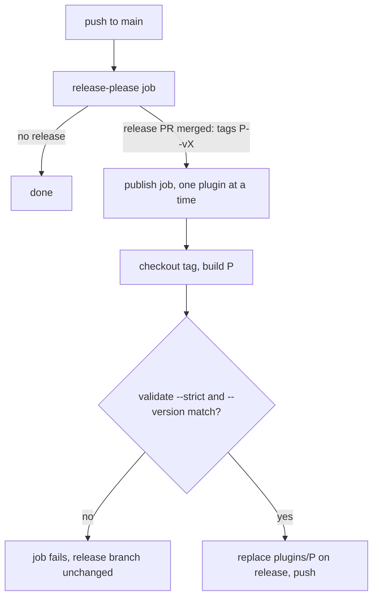

# BDK v3 repository structure and CI/CD - Design

**Date**: 2026-10-07
**Status**: Approved
**Branch**: Architecture
**Authors**: Claude + User

> Design doc only. It describes the target; nothing moves as part of it. The decision is recorded in [ADR-0002](../adr/0002-v3-repo-structure-and-release.md).

---

## Problem

BDK v3 will ship several Claude Code plugins and at least two CLIs from one repository, on Node only. The repository needs a layout and a CI/CD pipeline that fit many plugins, built CLIs and per-plugin releases, without extra machinery that does not pay for itself.

**In scope:**
- Directory layout of the repository.
- How a built CLI reaches an installed plugin.
- PR CI, release flow and versioning.
- Plugins: `bdk` (core), `bdk-craft`, `git-identity`, `bdk-skill-kit`; the VitePress docs site; plugin evals.

**Out of scope:**
- Moving v2 content into the new layout (separate follow-up task).
- `bdk-bench`.
- npm publishing (deferred, see "What We Did NOT Decide").
- What the plugins and CLIs do.

---

## Existing Codebase Context

- **Already present:** `staging/v3` is v2.7.0: one plugin at the repository root (`.claude-plugin/plugin.json`, `marketplace.json`), skills, agents, hooks, rules, Python hooks (`hooks/check-rules-drift/check.py`, `hooks/check-bdk-config/check.py`) and a pytest job in `.github/workflows/tests.yml`. No Node toolchain.
- **Closest existing pattern:** draft 1 (`draft/v3-1`) bundled a TypeScript kernel with esbuild into `dist/bdk.mjs` and published it on a `release` branch from a release job; `dist/` never appeared in PRs. Toolchain: pnpm, vitest, eslint, prettier, knip, husky, commitlint, VitePress, release-please (one component).
- **Integration points:** root `marketplace.json` lists `bdk` (`./`) and `git-identity`, `bdk-skill-kit` as github sources `broneq/git-identity`, `broneq/bdk-skill-kit`. `git-identity` uses Node `.mjs` hooks, biome and `node --test`.
- **Host facts** (plugins-reference and `docs/v3-draft1/host/HOST-FACTS.md`):
  - An installed plugin is copied to `cache/<marketplace>/<plugin>/<version>/`; files outside the plugin directory are not copied.
  - Node dependencies auto-install only with `package.json` plus `package-lock.json`, `npm-shrinkwrap.json` or `bun.lock`; `pnpm-lock.yaml` is skipped; exact registry pins only; 60 s timeout.
  - `bin/` is on the `PATH` of the Bash tool, of plugin subagents and of skill `!` blocks (rows `plugin-bin-bash`, `plugin-bin-subagent`, `plugin-bin-skill`), but **not** of `command` hooks (row `plugin-bin-hook`, Claude Code 2.1.289).
  - `version` in `plugin.json` pins users to that version. `claude plugin tag` creates `<name>--v<version>` tags, against which plugin dependency ranges resolve.
  - `claude plugin validate <dir> --strict` validates one plugin directory; a marketplace run does not open plugins in other directories.
  - `claude plugin eval` reads `<plugin>/evals/` and makes paid model calls.
- **Measured locally:** cold `npm i @anthropic-ai/claude-code` 5.7 s; `claude plugin validate <dir> --strict` 2.4 s. It already rejects v2: `hooks.json` uses `${CLAUDE_PLUGIN_ROOT}` without quotes.

---

## Constraints & NFRs

| Dimension | Value | Source |
|---|---|---|
| Plugins | `bdk`, `bdk-craft`, `git-identity`, `bdk-skill-kit` | User |
| Independence | every plugin installs and works without the core | User |
| CLI outside Claude Code | wanted later; no npm publishing for now | User |
| Runtime | Node >= 22.18, no Python; runtime npm dependencies allowed | User |
| Versioning | separate version and tag per plugin; release-please release PRs; no test channel | User |
| CI | Linux only; <= 5 min per PR; paid evals only locally | User |
| Parallel work | 5-10 agent sessions open PRs at once: no generated files in PRs | User |
| Simplicity | "do not over-engineer" | User |
| Old repos | `git-identity`, `bdk-skill-kit` merged with history, then archived | User |

---

## Considered Approaches

### Approach A - Module per directory, builds on a `release` branch

**Essence:** each plugin owns one directory with skills, CLI source, tests and evals; a release job writes built runtime files of the released plugin onto a `release` branch, which the marketplace installs from.

**Components & responsibilities:**
- `plugins/<name>/` - everything of one plugin: manifest, skills, agents, hooks, `bin/`, CLI source, tests, evals.
- Root toolchain - one pnpm workspace, TypeScript, eslint, prettier, vitest for all plugins.
- `release.yml` - release-please plus the publish job.
- `release` branch - runtime files only; written only by CI.

**Data flow (happy path):**
1. A PR changes a skill and its CLI together; CI checks it; it merges to `main`.
2. release-please opens or updates the release PR for the touched plugin.
3. Merging the release PR tags `<plugin>--vX` and creates the GitHub release.
4. The publish job checks out the tag, builds that plugin, validates the snapshot and replaces only `plugins/<plugin>/` on `release`.
5. A user's `/plugin install` clones `plugins/<plugin>` at `ref: release`.

**Tradeoffs:**
- One PR and one release per change of CLI and skill.
- Install needs only git: no npm in the cache, no 60 s limit.
- A fresh install always gets a released version.
- Users get runtime files only.
- Cost: a second branch that only CI writes; `pnpm build` before `claude --plugin-dir`.



---

### Approach A2 - `main` receives only releases

**Essence:** work lands on `staging`; the release job commits `dist/` into the release PR, so `main` only ever holds released, built content and the marketplace uses `./plugins/<name>`.

**Tradeoffs:**
- No third branch.
- Cost: `dist/` is tracked, so a local build changes tracked files and CI must reject PRs touching it.
- Users get sources, tests and evals in their cache.



---

### Approach B - CLIs as npm packages, thin plugins

**Essence:** each CLI is a package in `packages/` published to npm; a plugin carries `package.json` plus `package-lock.json` with an exact CLI pin, and Claude Code installs it at plugin install.

**Tradeoffs:**
- No generated files in git, no second branch.
- Cost: a change of CLI and skill needs two releases (CLI, then plugin bump).
- Install depends on the npm registry with a 60 s limit; on failure the plugin loads without its CLI.
- A fresh install gets `HEAD` of `main`, unreleased skills included.
- Two package managers: pnpm in the repository, npm lockfiles in plugins.
- `--plugin-dir` does not install dependencies, so dev mode needs manual linking.



---

### Approach C - zip archives in GitHub Releases

**Essence:** each plugin release is a zip in a GitHub release; the marketplace entry uses an `archive` source with `sha256`.

**Tradeoffs:** same benefits as A plus an immutable artifact, but every release commits a new URL and hash to `marketplace.json`, and the zip must be reproducible. More moving parts for the same effect. Kept as the fallback if the `release` branch causes trouble.

---

## Selected Approach: A - Module per directory, builds on a `release` branch

**Why:** every plugin must work alone, so it carries its built CLI inside and does not depend on npm at install time. Runtime dependencies are allowed, and esbuild inlines them into one file, so nothing installs in the cache. Per-plugin versions map onto "one plugin = one directory = one release-please component = one tag prefix". Generated files never enter PRs, which keeps 5-10 parallel sessions free of conflicts, and the release work stays off the 5-minute PR path. The rejected alternatives either track `dist/` in git (A2), split one change into two releases and add an install-time network dependency (B), or add per-release manifest commits (C).

### Layout

```
.claude-plugin/marketplace.json   # name bdk; entries: git-subdir plugins/<name>, ref: release
plugins/
  bdk/
    .claude-plugin/plugin.json    # version: the single source of the plugin's version
    skills/  agents/  hooks/
    bin/bdk                       # launcher
    src/  tests/                  # CLI source (TypeScript) and tests
    evals/                        # claude plugin eval cases, local only
    package.json                  # private: true, no version
  bdk-craft/                      # skills only, no package.json
  git-identity/                   # .mjs hooks, no build
  bdk-skill-kit/                  # skills + skill-check CLI
docs/                             # VitePress site, ADRs, archives
openspec/                         # SDLC specs and changes
.github/workflows/                # pr.yml, release.yml, docs.yml
package.json  pnpm-workspace.yaml # workspace: plugins/*, docs
release-please-config.json  .release-please-manifest.json
```

- Directory name = plugin name = release-please component = tag prefix.
- Shared dev toolchain at the root: pnpm workspace, TypeScript, eslint, prettier, vitest, commitlint. `git-identity` moves from biome and `node --test` onto it.
- No Python anywhere.
- `dist/` is in `.gitignore`. Dev mode: `pnpm build`, then `claude --plugin-dir plugins/<name>`.

### CLI invocation

- `bin/<cli>` resolves its own real path (dirname of the realpath of `$0`) and runs `node <that dir>/../dist/<cli>.mjs`, so it works from any working directory and from the cache path.
- The Bash tool, plugin subagents and skill `!` blocks call `<cli>` through `bin/` (HOST-FACTS rows `plugin-bin-bash`, `plugin-bin-subagent`, `plugin-bin-skill`).
- Hooks call `node "${CLAUDE_PLUGIN_ROOT}/dist/<cli>.mjs"`, quoted, because `bin/` is not on a hook's `PATH` (row `plugin-bin-hook`) and `validate --strict` rejects an unquoted placeholder.
- The build injects the version from `.claude-plugin/plugin.json` into the bundle (esbuild `define`), so `<cli> --version` reports the plugin version.

### PR CI (`pr.yml`)

Jobs run in parallel on `ubuntu-latest`:

| Job | Steps | Target |
|---|---|---|
| `check` | pnpm install (cached), lint, format check, typecheck, vitest, build | <= 3 min |
| `plugins` | install Claude Code (~6 s), `claude plugin validate --strict` on the marketplace and on each changed plugin (~2.5 s each), skill-check from the built `bdk-skill-kit` | <= 2 min |
| `commitlint` | PR title / commits follow Conventional Commits | < 30 s |
| `docs` | VitePress build, only when `docs/` changes | <= 2 min |

`check`, `plugins` and `commitlint` are required checks. `docs` is required only when it runs (path filter). If installing Claude Code becomes slow or breaks, cache the npm package by version; `validate` stays mandatory.



### Releases (`release.yml`)

- Trigger: push to `main`.
- Job `release-please`: manifest mode, one component per `plugins/<name>`, release type `simple` with an `extra-files` json updater on `.claude-plugin/plugin.json` (`$.version`), `tag-separator: "--"` so tags read `bdk--v3.0.0`, matching `claude plugin tag`. It runs with a GitHub App token, so its release PRs and tags trigger normal PR CI.
- Job `publish`: needs `release-please`, runs only when a release was created, iterates over the released paths **in one job, one plugin after another** (no matrix legs competing in a concurrency group, which would cancel pending legs). Workflow-level `concurrency: release`, without cancel-in-progress. For each released plugin `P`:
  1. Check out tag `P--vX` and build `P`.
  2. Copy the runtime files of `P` (manifest, skills, agents, hooks, `bin/`, `dist/`; no `src/`, `tests/`, `evals/`, `version.txt`) into a snapshot.
  3. Run `claude plugin validate --strict` on the snapshot and compare `bin/<cli> --version` with `X`.
  4. Fetch the head of `release`, replace only `plugins/P/`, commit, push fast-forward with the App token.
- A ruleset on `release` allows pushes only from that GitHub App.
- Each `plugins/P/` on `release` always equals the build of `P`'s latest tag; other plugins are untouched by a release of `P`.



### Docs and evals

- Docs site: VitePress in `docs/`, built on PRs that touch it, deployed to GitHub Pages from `main` by `docs.yml`.
- Evals: `plugins/<name>/evals/`, run locally with `claude plugin eval`; never in CI, because every run is a paid model call.

### Migration of users and old repositories

- Root `marketplace.json` keeps the name `bdk`; its entries switch to git-subdir `plugins/<name>` with `ref: release`. Plugin names stay the same, so users only refresh the marketplace.
- `git-identity` and `bdk-skill-kit` merge in with history (`git filter-repo --to-subdirectory-filter plugins/<name>`, then a merge with `--allow-unrelated-histories`). Afterwards both repositories are archived, with a README pointing to `broneq/bdk`.

**Key boundaries:**

- Plugin directory - nothing outside `plugins/<name>/` is needed at runtime; plugins never import from each other.
- `main` / `release` - sources cross into `release` only through the publish job, built and validated.
- Repository / user cache - only runtime files of a released plugin cross.

---

## Risk Register (Devil's Advocate)

| Risk | When it bites | Mitigation |
|---|---|---|
| Bottleneck: release writes are serial | Several plugins released at once or two release runs close together | One job iterates over released plugins; workflow `concurrency: release` without cancel-in-progress; fast-forward push after fetching the branch head |
| SPOF: `release` branch is what every user installs | A broken snapshot is pushed | Validate the snapshot and check `--version` before push; only the GitHub App may push; failure leaves the branch unchanged |
| Hidden cost: tags point at `main` commits without `dist/` | Plugins start depending on each other with version ranges, which Claude Code resolves against `<plugin>--v*` tags | Today plugins are independent; if this changes, tag the `release` commits instead |
| Hidden cost: `pnpm-lock.yaml` is a generated file in PRs | Parallel PRs change dependencies | Accepted exception; dependency changes go in their own PR |
| Assumption: Claude Code installs quickly in CI | Upstream package grows or the registry is slow | Measured 5.7 s locally; cache the package by version if it grows |

---

## What We Did NOT Decide

- [ ] npm publishing of the CLIs: which ones, the npm scope, and authentication (prefer trusted publishing with OIDC and provenance).
- [ ] Exact release-please config, confirmed by a dry run: the `extra-files` updater and whether `version.txt` is produced.
- [ ] Bootstrap of the `release` branch: a one-off run of the App or a manual first commit, before the first plugin release.
- [ ] How release-please relates to `staging/v3` while v3 is in progress (target: runs on `main` only; v3 lands through the merge of `staging/v3`).
- [ ] Re-probe `plugin-bin-hook` on newer Claude Code versions.
- [ ] Follow-up task (phase 0): migrate v2 into the layout (move the core to `plugins/bdk/`, remove or port the Python hooks and the pytest job, quote `${CLAUDE_PLUGIN_ROOT}`), before CI switches to the new jobs.
- [ ] Follow-up task (phase 0): merge `git-identity` and `bdk-skill-kit` with history, then archive both repositories.

---

## Loop-back History

| Iteration | Gap surfaced | Looped to | Outcome |
|---|---|---|---|
| 1 | Release snapshot copied all plugins from `main` HEAD | Phase 2 | Per-plugin snapshot from the plugin's own tag |
| 1 | Hook `PATH` listed as unknown | Phase 0 | Decided from HOST-FACTS `plugin-bin-hook` |
| 1 | v2 Python hooks and pytest | Phase 1 | Out of scope; follow-up migration task |
| 1 | Release trigger, token, version source, CI budget, migration | Phase 1 / 2 | GitHub App token, `plugin.json` as the only version, measured CI budget, old repos archived, no npm for now |
| 2 | Matrix under one concurrency group cancels pending legs | Phase 2 | One publish job iterates over released plugins |

---

## Next Steps

- Implementation plan: `/bdk:create-plan`
- Formal decision record: `/bdk:create-adr`
- Deeper exploration of a specific component: re-run `/bdk:design` scoped to that component
