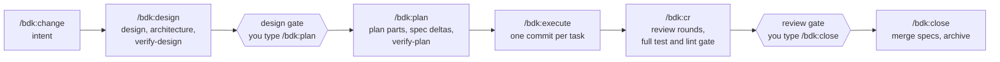

# The Change pipeline

BDK 3 does every piece of work as a **Change**: one feature, fix or review on
one branch. The kernel keeps its state in committed files, decides which step
is next, counts every retry and refuses what the pipeline does not allow. The
skills do the work each step needs and report back through kernel commands, so
the state never lives in a conversation.



Each stage skill ends by naming the command to type next. You type it, so
every stage starts from your decision, or let [`/bdk:run`](../reference/skills.md#bdk-run)
type them for you.

## The Change

`bdk change new` writes `.bdk/changes/<id>/change.md` with the intent, the
kind and the starting profile, and binds the Change to the current branch. A
branch holds one active Change. Everything the Change produces stays in that
directory and is committed with the work:

| Path                                              | What it holds                                                              |
| ------------------------------------------------- | -------------------------------------------------------------------------- |
| `change.md`                                       | The intent, kind (`feature`, `bug`, `review`) and starting profile         |
| `design.md` or `design/parts/`                    | The design                                                                 |
| `architecture.md`                                 | The modules, boundaries and data flow the design touches                   |
| `plan/parts/<nn>-<slug>.md`                       | The plan, one file per part                                                |
| `spec-delta/<capability>.md`                      | What the Change does to each living spec                                   |
| `log/`                                            | The ledger: one file per decision, question, finding, learning, transition |
| `attempts/`, `dispatch/`, `reports/`, `evidence/` | Tickets, agent packages, agent reports and check results                   |

One file per ledger entry means two branches that both touched a Change merge
without conflicts. What each machine derives (the SQLite index, the branch
bindings, worktrees) lives in `.bdk/.machine/`, which git ignores; `bdk rebuild`
recreates it from the committed files. The full map is in
[Artifacts](../reference/artifacts.md).

```sh
bdk change status        # stage, profile, every node and gate
bdk change list          # every Change with its branch
bdk change park --reason "waiting for the API team"
bdk change resume <id>   # bind a fresh clone's branch to its Change
```

## Profiles

The profile decides how much process a Change gets. `/bdk:change` picks it
from the code the intent touches, and the kernel only ever raises it.

| Profile | When                                                                                                     | Nodes                                                                                           |
| ------- | -------------------------------------------------------------------------------------------------------- | ----------------------------------------------------------------------------------------------- |
| `tiny`  | No user-visible behaviour, data model, schema, configuration or spec change; at most 2 files in 1 module | intent, plan, execute, review, close                                                            |
| `small` | The default                                                                                              | adds `design.md`, `architecture.md`, design verification, the design gate and plan verification |
| `large` | A design that spans three or more subsystems                                                             | the design is split into `design/parts/`, and parts can run as a tree with one lead each        |

A `bug` Change skips the design and is planned from its reproduction: one part
with the failing test and the fix. A `review` Change, opened by `/bdk:cr` on a
branch without one, has only the review. Opening a Change `tiny` needs a
reason; when its commits later exceed 2 files, 1 module or 50 lines, the kernel
records a finding for the review gate. A design that `/bdk:design` splits into
parts raises a `small` Change to `large`. The [workflow pages](../workflows/tiny.md)
walk through each profile.

## The artifact graph

Which artifact a Change needs next is data, not skill logic: the plugin's
`pipeline/pipeline.yaml` declares the stages and the nodes, and the profile
and the kind select the nodes that exist. A node is `blocked`, `ready`, `done`,
`stale` (its inputs changed after it was done) or `skipped`.

| Command                     | What it does                                                                                                                                                    |
| --------------------------- | --------------------------------------------------------------------------------------------------------------------------------------------------------------- |
| `bdk next`                  | Prints the instruction for the next artifact: its template, the paths to write, the rules and the relevant ledger entries. Or says the Change waits for a gate. |
| `bdk done <artifact>`       | Marks a node done after its checks pass, recording the hash of its files. The only way an artifact becomes done.                                                |
| `bdk validate [<artifact>]` | Runs the node's checks and writes nothing.                                                                                                                      |
| `bdk explain <artifact>`    | Explains a node's state through its chain of requirements, with both hashes of a stale node.                                                                    |

Because a node records the hash of what it checked, an edit after the fact is
visible: a plan part edited after its verification makes `plan-verify` stale,
and the next `bdk next` says so. Each artifact kind has a template, the prompt
value `pipeline/<kind>`, which a project extends or replaces like any other
[prompt](../reference/configuration.md#prompts).

## Gates

Two gates stop a Change for a human decision: after the design, and after the
review. A gate opens only on a transition written for you, never by a command
the model can run. When you type `/bdk:plan` or `/bdk:close`, the
`UserPromptExpansion` hook checks that everything before the gate is done and
passes it, or blocks the command with what is missing. The hook acts only on a
command you typed, so the model cannot pass a gate by invoking the skill.

`policy.gates.design` and `policy.gates.review` set to `auto` let the pipeline
pass a ready gate itself, and `/bdk:run --auto` passes every ready gate for one
run. Either way the transition records `source: policy`, and `/bdk:close`
lists every gate passed without you in the PR summary.

## Plan parts

A plan is split into parts, `plan/parts/<nn>-<slug>.md`, each small enough for
one agent: at most 8 tasks and 8 KB. The frontmatter holds the goal, the
success measure, `do-not-touch` globs, `depends-on`, `spec-impact` and
optionally `isolation: worktree`; the body holds the tasks:

```markdown
## 02-3 Reject an expired link

**Files:**

- Modify: `src/auth/login.ts`
- Test: `src/auth/login.test.ts`

**Test cases:**

- an expired link answers 401

**Depends on:** 02-2
```

`**Files:**` is required. A task needs `**Test cases:**`, or
`**Verification:** none` when every file is non-executable content, pure wiring
or a refactor already covered by tests
([Verification scoping](verification-scoping.md#verification-none)).
`bdk done plan` and `bdk part start` refuse a part that is too large, names a
file under its `do-not-touch`, holds a placeholder (`TODO`, `TBD`, `...`), or
lacks the spec delta of a capability its `spec-impact` names. Parts without a
dependency between them run in the same wave.

Progress lives in git, not in the plan: a task is done when a commit reachable
from `HEAD` carries its trailers, which `bdk commit` writes:

```
BDK-Change: 2026-10-06-users-log-in
BDK-Part: 02
BDK-Task: 02-3
```

## Tickets and the escalation ladder

Every dispatch runs under a ticket, a committed record under `attempts/`, so
the counts are the same on any clone. A loop has a budget per round
(`policy.budgets`), and every ladder ends in a named state:

1. **Attempts in a narrowing scope.** The first attempt fixes everything, the
   second only blockers and high findings, the rest only blockers. What a
   narrower scope drops is recorded for the review gate.
2. **One escalation ticket** with a fresh context and a stronger model
   (`policy.escalation.model`), when the budget is used up or the same finding
   comes back (`policy.oscillation.threshold`).
3. **A question to you.** The kernel parks the Change with the options: retry
   with a fresh budget, accept as debt, or split the part.
   `bdk change resume <id> --option <n>` answers it.

A check that could not run closes `not-run`, which uses no budget; too many in
a row end the ladder at once.

## Evidence

A task is done only with evidence. After the implementer, the same ticket runs
the post-task steps in pipeline order: `simplify`, then `tests-scoped` and
`lint`, scoped to the task's executable files. The runner records each result
with `bdk evidence record`, citing the output line that shows the pass, and
`bdk attempt close` refuses a missing step, a failure, a pass without a
citation, or evidence recorded on a different working tree. Before the review
verdict, `tests-full` and `lint-full` run the whole suite once against the whole
Change. [Verification scoping](verification-scoping.md) explains how the kernel
decides that evidence is still fresh.

## Roles and dispatch packages

The orchestrating skills never write code. Each piece of work goes to a role
agent whose whole prompt is one file, the dispatch package:
`bdk dispatch build <target> <role> <ticket>` writes it with the task, its files and
`do-not-touch`, the decisions and blockers on it, the role's contract, and the
commands that fetch its rules and store its report. The agent stores its report
with `bdk log ingest` and records findings with `bdk log add`; the
orchestrator closes the ticket with `bdk attempt close`, which compares the
real diff with the plan. See [Context](context.md) and
[Agents](agents.md).

## Living specs

The behaviour a project has shipped lives in `.bdk/specs/<capability>/spec.md`,
one file per capability, in the OpenSpec format. A Change never edits a spec:
the plan writes a delta, `spec-delta/<capability>.md`, with `ADDED`,
`MODIFIED` and `REMOVED` requirements, each requirement stated with the
normative word (`spec.normative-word`, default `SHALL`) and followed by its
`WHEN` / `THEN` scenarios. `bdk spec delta check` holds the delta to that
grammar, and a `MODIFIED` requirement that drops a scenario must list it under
`REMOVED`.

At close the kernel merges the deltas deterministically and stamps each spec
with a hash of its body. A spec edited by hand no longer matches its hash: the
merge refuses it, and `bdk doctor` reports it with the command that restores
the file. When another Change closed in the meantime and changed the same
requirement differently, the merge refuses with both versions, and you rewrite
the delta on top of the current spec.

```sh
bdk spec diff                 # preview what the merge will do
bdk change close --dry-run    # check the close without writing
```

## Two Changes at once

A Change is bound to its branch, so two Changes run side by side in two
worktrees, one Claude Code session in each:

```sh
git worktree add ../myproject-login -b feat/login
git worktree add ../myproject-digest -b feat/digest
```

Merge them the way you merge any two branches. The ledger merges without
conflicts, and `bdk rebuild --all` re-reads every Change the merge brought in.
Inside one Change, a plan part marked `isolation: worktree` gets its own
worktree too; see [Worktree parts](worktree-parts.md).
