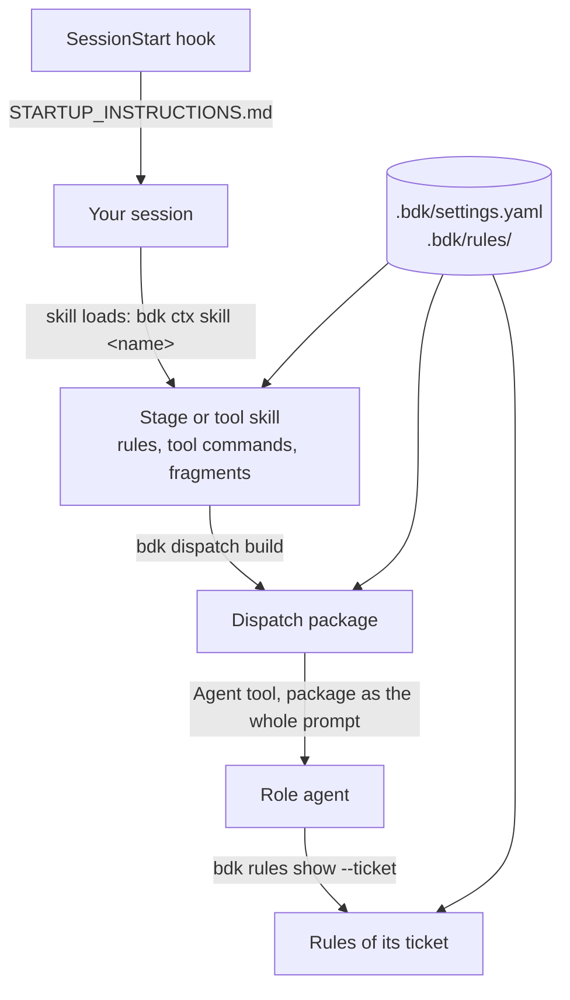

# Context

A skill body is the same text in every project, and an agent file is static
Markdown. Yet a skill must know your test command, and a reviewer must know
your rules. BDK delivers everything that varies per project through the
kernel, at the moment it is needed, in three channels:



## The session foundation

The `SessionStart` hook (`bdk hooks session-start`) prints
`STARTUP_INSTRUCTIONS.md` into every session, before your first prompt. It
holds what is true in every project:

| Section                      | What it settles                                                                                                              |
| ---------------------------- | ---------------------------------------------------------------------------------------------------------------------------- |
| Agents                       | The subagents BDK ships, with their models; the table is generated from the agent files, and a test keeps the two identical. |
| Verification Proportionality | How much checking a change of a given kind deserves; see [Verification scoping](verification-scoping.md).                    |
| Quality Rules                | That rules have ids, where a project adds its own, and that an agent cites the ids it applied.                               |
| Capture Conventions          | Where a lesson belongs, including the frequent answer "nowhere".                                                             |

In a BDK project the hook adds one line per settings problem, and a warning
when one role would receive more than `rules.warn-above` rules. It never
blocks the session.

The file is static on purpose: Claude Code evaluates `` !`...` `` blocks in
skill bodies only, never in hook output, so a dynamic block there would reach
the model as literal text. It also occupies context in every session, so it
stays short; detail belongs in a skill that loads on demand.

## Skill context lines

Every stage and tool skill opens with two lines:

```markdown
!`bdk ctx skill plan 2>&1 || echo "BDK STOP: kernel unavailable (exit $?). Install Node >= 22.13 and run /bdk:setup."`

If no "BDK context: plan" heading appears above, run `bdk ctx skill plan` first and apply its output; on a `BDK STOP` line, stop and report it.
```

Claude Code runs the `!` line when the skill loads and puts its output in
place: a `BDK context: plan` section with the rules of the skill's stage, the
shipped and your project's together, selected over the files of the work tree,
the decision fragment (Lavish or `AskUserQuestion`), the
configured tool commands and any plugin file the skill reads. The second line
covers a host that did not run the first. Which parts a skill receives is
declared once, in the kernel's manifest, so a skill body never names a test
runner and stays correct in a Python repository and a TypeScript one alike.

`BDK STOP: kernel unavailable` means the kernel could not start; see
[Troubleshooting](../troubleshooting.md).

## Dispatch packages

A subagent does not inherit your session: it starts without the foundation,
and an agent file cannot run a context line. So a role agent gets everything
from one file. `bdk dispatch build <target> <role> <ticket>` writes the
dispatch package under the Change's `dispatch/`, and the orchestrating skill
passes it as the agent's whole prompt:

| Section | What it holds                                                                                                    |
| ------- | ---------------------------------------------------------------------------------------------------------------- |
| Target  | The task text, its `Files:`, `do-not-touch` and test cases, or the artifact to verify                            |
| Ledger  | The accepted decisions and open blockers on the target in full; other entries only counted                       |
| Role    | The contract of the role, from its role skill under `skills/roles/`                                              |
| Rules   | The command that prints the rules of the ticket                                                                  |
| Checks  | For a runner, the project's commands scoped to the task's executable files                                       |
| Craft   | For an implementer with `bdk-craft` installed, the craft skills to read (`tdd`, and `debugging` on a bug Change) |
| Return  | How to record entries and store the report                                                                       |

A verifier's, a reviewer's and the judge's package add the blocking
categories, the integration reviewer's the risks of `review.risks`, and a
merge ticket's the project's conflict instruction. The judge's package lists
the entries of the round to triage, by id, refs and writer, and holds no
entry body: the judge reads each with `bdk log show`.

The kernel refuses a package above 160 KiB, naming its largest section, so a
package never grows into a context dump. The agent reads its rules with
`bdk rules show --ticket <ticket>`: the rules for its role and for the files
its target touches, resolved from the same settings your session uses, and
recorded as read. An implementer that closes its ticket without reading them
gets a finding for review.

## Capture conventions

The last section of the foundation routes a lesson when you notice it, in the
middle of other work:

| The knowledge                                           | Where it goes                                               |
| ------------------------------------------------------- | ----------------------------------------------------------- |
| Cross-cutting invariant whose violation fails silently  | a project rule, scoped by the narrowest glob that covers it |
| Trap visible at the code site where the mistake happens | a doc comment there                                         |
| Something a test or a linter already enforces           | one line naming the enforcer                                |
| Anything else                                           | nothing                                                     |

A line that a rename or a file move would force you to edit mirrors the code
and is not a rule. `/bdk:rules capture` runs this routing and adopts a rule
with `bdk rules accept`; see [Rules hygiene](../workflows/rules-hygiene.md).
