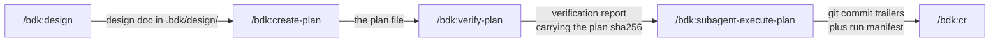

# The plan pipeline

!!! warning "Describes BDK v2"

    This page describes BDK v2. The v3 documentation replaces it (T50).

Four skills form one chain, each stage consuming the previous stage's output:



Every edge label is a file. Nothing is carried in conversation state, which is why any stage can run in a fresh session, on another machine, or days later. The full walkthrough is in [The full pipeline](../workflows/full-pipeline.md); this page explains why the seams look like that.

## The plan is immutable once verified

The plan's sha256 is the run's identity. `/bdk:verify-plan` stamps that hash into its report, and the executor re-hashes the file at startup and compares:

| Stamp | Meaning | What the executor does |
|---|---|---|
| Present, hash matches | this exact plan was verified | proceeds, reports `stamped` |
| Present, hash differs | the plan changed after verification | warns, reports `stale`, proceeds |
| Absent | never verified | warns, reports `missing`, proceeds |

So edit **before** verifying, never after. The verdict appears on the `Verification:` line of the executor's opening summary rather than being buried in a warning.

Note that a stale or missing stamp warns and continues. Blocking would make the executor unusable on a hand-written plan, and skipping verification is the user's call. The cost is real, though: a plan executed unverified spends subagent time discovering what one verification pass would have found.

To change course mid-run, stop, edit, re-verify, and start a new run. Already-committed groups stay committed, and the new run picks up from the commit trailers.

## Two records of progress, one of them authoritative

Progress is recorded per group in two places:

- **Git commit trailers** (`BDK-Run:`, `BDK-Group:`) are the durable ground truth. They survive a crash, a fresh session, a deleted `.bdk/`, and a rebase.
- **A run manifest** at `.bdk/runs/<run-id>.json` is a cache that makes resume cheap.

Every read cross-checks the trailers on the branch and corrects the manifest in place when they disagree. Git always wins. After a rebase or a squash, `rebuild` throws the manifest away and re-derives it from trailers alone.

!!! warning
    Never hand-edit a file under `.bdk/runs/`. `scripts/bdk_run_state.py` is the only reader and writer; an edit git does not agree with is discarded on the next read. For a human-readable view, run the script's `print` subcommand. See [Artifacts](../reference/artifacts.md).

## Resume, session guard, and `--force`

Registering a run is the same call as resuming one: it is idempotent, and it reports whether the run resumed, how many groups are already done, and any notes worth printing (a `.gitignore` that had to be written, a changed plan file, groups recovered from git that the manifest had lost).

A run is held by the session that registered it. A second session gets a refusal naming the owner:

```
run '<run-id>' is held by session <owner>. If that session is gone, take it over with --force.
```

There is no timeout heuristic behind this. A stale-session timeout would have to be longer than the slowest plausible group, which means a genuine crash would be indistinguishable from slow progress for that whole window. `--force` replaces that tuning with an explicit human decision, and it prints exactly what it took over so the takeover is visible rather than silent.

## Parallel runs are parallel worktrees

Two plans that touch the same files cannot run in one checkout: the executor requires a clean tree at startup, and its per-group commits would interleave. Give each run its own worktree and open one session in each.

This needs no coordination machinery because the run id is `<plan-slug>--<branch-slug>`. Different branches mean different run ids, different manifests, and trailers that never match each other's `git log`. The two runs are merged the way any two branches are merged.

One session per worktree. Two sessions in one worktree contend for the same run, and the second is refused by the session guard above.

## Waves are computed at plan time

`/bdk:create-plan` designs for parallelism: every task declares `Files:` and `Depends on:`, and the plan closes with an `## Execution Waves` section derived from that DAG. The planning summary reports the shape it achieved, for example the number of waves, the widest one, and the critical path, because the executor's wall clock is bounded by the critical path rather than by task count.

The executor prefers those declared waves and spawns an explorer subagent once, only to validate them: no same-wave file collision, no missing dependency edge. If validation passes, it uses them as-is. If it fails, or the plan predates the section, the waves are re-derived from scratch.

Grouping never degrades silently. A malformed result, low confidence, or a group naming an undefined task drops the run into full serial mode (every task its own group), and the reason is printed and carried into the opening summary.

## One commit per group

The coordinator holds plan state and dispatches subagents. It never edits files, runs tests, or reads source. Each task gets a fresh subagent with its own context, which returns a structured envelope and then discards that context; the coordinator's own context stays small enough to run a long plan.

Committing at each group boundary is what makes the run resumable at all. There is nothing extra to save at a pause, because the last commit and its group record already are the checkpoint.

## Stopping cleanly

Two stop paths exist, both at group boundaries and never mid-group, because in-flight subagents are never abandoned.

**Context stop.** When the coordinator has used 50% or more of its own context at a boundary, it finishes the in-flight group, commits it, prints a paused summary block naming the plan, run id, manifest, groups committed, groups remaining, and the command to resume, and stops. Half is chosen so the coordinator still has room to *finish* a group after the check, including an unanticipated fix round.

**User interrupt.** If you send a message mid-run, in-flight subagents are allowed to finish, the next group is not dispatched, and a completed and verified group is committed. Work that did not pass verification is left in the tree and named file by file rather than being discarded for you, because the clean-tree precondition means the next run cannot start until you either keep it or drop it.

Resuming is always the same command on the same plan path. A resume in a new session hits the session guard, so pass `--force` once the old session is gone.

See [Agents](agents.md) for the fleet the coordinator dispatches, and [Verification scoping](verification-scoping.md) for what runs at each boundary.
