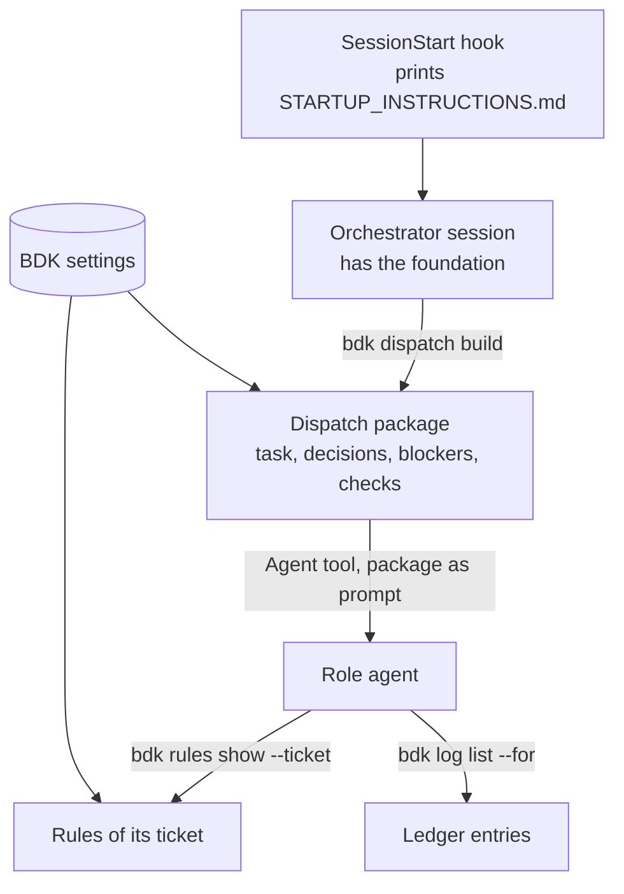

# The shared foundation

::: warning Describes BDK v2
This page describes BDK v2. The v3 documentation replaces it (T50).
:::

Every BDK skill carries the same line: _relies on BDK foundation (`STARTUP_INSTRUCTIONS.md`)_. That file is the contract each skill inherits instead of restating. It is what makes a plain session, with no BDK skill invoked at all, still behave like a BDK session.

## What gets injected, and when

`STARTUP_INSTRUCTIONS.md` is delivered by the `SessionStart` hook `bdk hooks session-start`, which prints the file as is and, in a BDK project, appends one line per settings problem. The text reaches the model before your first prompt, so it is in context for the whole session.

It carries four things:

| Section                      | What it settles                                                                                                                                                                                                                                             |
| ---------------------------- | ----------------------------------------------------------------------------------------------------------------------------------------------------------------------------------------------------------------------------------------------------------- |
| Agents                       | The subagent fleet, each one's model, and when to continue one rather than spawn a new one. The agents table is generated from the agent files by `bdk ctx startup`, and a test keeps the committed file identical to that output. See [Agents](agents.md). |
| Verification Proportionality | How much checking a change of a given size deserves. See [Verification scoping](verification-scoping.md).                                                                                                                                                   |
| Quality Rules                | That BDK ships language-agnostic rule sets and how to override them. See [Quality and language rules](quality-and-language-rules.md).                                                                                                                       |
| Capture Conventions          | Where a lesson or convention belongs, including the case where the answer is "nowhere".                                                                                                                                                                     |

Everything else that could vary per project, including the test runner, the lint command, and the build tool, is deliberately absent. Skills never name a runner. The commands live in `.bdk/settings.yaml` and reach skills and agents through `bdk ctx skill` (see below), which is what keeps a single skill body correct in a Python repo and a TypeScript repo at once.

## Why it is static

The hook prints the file without evaluating it. Claude Code evaluates dynamic `` !`...` `` blocks in skill bodies only, never in hook output, so a dynamic block in `STARTUP_INSTRUCTIONS.md` would reach the model as literal text. Everything in the file is therefore plain prose that holds for every project, and it reaches the model even in an unconfigured project.

## Subagents do not inherit it

This is the part that surprises people. A subagent spawned by `/bdk:execute` or `/bdk:cr` starts without the foundation the orchestrator received, and an agent file is static markdown: it cannot run the `!` context lines a skill has, and plugin agents ignore the `hooks`, `mcpServers` and `permissionMode` frontmatter fields. A reviewer that does not know the project's quality rules reviews against none, and nothing errors.

So a role agent reads its context through the kernel instead. Its whole prompt is a dispatch package from `bdk dispatch build`, and the package names the commands that give it the rest:

The rules an agent reads are those of its role and of the files its ticket touches, resolved from the same settings the orchestrator works by. A runner's package carries the project's commands in its `Checks` section. No preloaded skill is involved: BDK 3 removed the `bdk-*` meta-skills that carried this content in BDK 2.

## Capture conventions

The last section of the foundation is a routing table for knowledge. Before recording a convention or a lesson anywhere, decide where it belongs:

| The knowledge                                           | Where it goes                                                      |
| ------------------------------------------------------- | ------------------------------------------------------------------ |
| Cross-cutting invariant whose violation fails silently  | `.claude/rules/`, scoped by the narrowest path glob that covers it |
| Trap visible at the code site where the mistake happens | a doc comment there                                                |
| Something a test or a linter already enforces           | one line naming the enforcer                                       |
| Anything else                                           | nothing                                                            |

A line that a rename or a file move would force you to edit is a mirror of the code, not a rule. The fourth row is the frequent and correct answer: never write something down just to have written it. `/bdk:rules capture` runs this routing, and `/bdk:rules audit` turns recurring lessons into rules and prunes what no longer applies; see [Rules hygiene](../workflows/rules-hygiene.md).

This table is in the foundation rather than in that skill because the decision usually happens in the middle of other work, at the moment you notice something, and not while you are running a rules skill.

## What this buys you

- **One place to change a convention.** Edit the foundation and every existing skill, plus every skill written afterwards, inherits the change.
- **A safe trivial tier.** Built-in plan mode plus a hand edit is still governed by verification proportionality and the quality rules, which is why [the trivial workflow](../workflows/trivial.md) needs no BDK skill at all.
- **No prompt drift between orchestrator and subagent.** Both read the same rules, resolved from the same settings.

::: warning
The foundation occupies context in every single session. Keep additions to it short, and prefer putting detail in a skill that loads on demand.
:::
