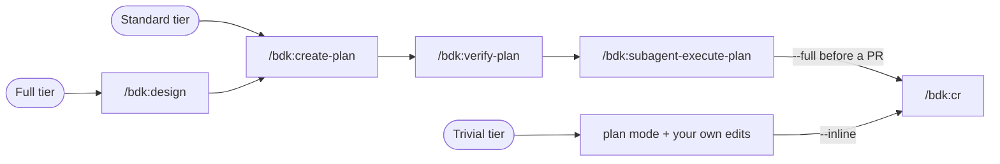

# BDK - Broneq Dev Kit

!!! warning "Describes BDK v2"

    This page describes BDK v2. The v3 documentation replaces it (T50).

BDK is a Claude Code plugin that packages one complete development workflow - design, planning, plan verification, autonomous execution, and code review - into a single installable unit. Nothing in it is tied to a language or a stack: your project's test, lint, and build commands live in `.bdk/settings.json`, and every skill reads them from there.

## Why BDK

- **[Language-agnostic by construction](concepts/shared-foundation.md).** Skills never name a test runner; commands live in `.bdk/settings.json` and reach agents through preloaded meta-skills.
- **[Verification proportional to the change](concepts/verification-scoping.md).** Fast and e2e tiers with scoped, related, failed, and incremental forms; the full suite runs once per plan, not after every edit.
- **[Crash-safe, resumable execution](concepts/plan-pipeline.md).** The plan is immutable once verified (sha256 stamp), git commit trailers are the ground truth, the run manifest is only a cache - resume from any session, or run plans in parallel worktrees.
- **[Coordinator-only executor](concepts/plan-pipeline.md).** Every task gets a fresh subagent context, parallel waves are computed at plan time, and each group lands as one commit.
- **[Independent verifiers](concepts/agents.md).** `bdk:plan-verifier` and `bdk:design-verifier` are separate Opus agents critiquing the author's draft; reviewers are read-only mechanically - by a `tools:` allowlist that grants no editing tools, and by `disallowed-tools` on the skills that spawn them - not by promise.
- **[Delta code review](workflows/code-review.md).** Reviews only what changed since the last review by default, scales 3-13 agents to the size of the change, and remembers deferred findings.
- **Nothing to install beyond Claude Code.** Skills and agents explore, search and trace code with the built-in tools; BDK ships no MCP server and starts no background process.
- **[Every seam is a file](workflows/full-pipeline.md).** Design docs, plans, verification reports, and commit trailers carry the state between stages, so any stage of the pipeline runs in a fresh session.
- **[Rules hygiene built in](workflows/rules-hygiene.md).** [`/bdk:add-rule`](reference/skills.md#bdkadd-rule) and [`/bdk:refine-rules`](reference/skills.md#bdkrefine-rules) plus a drift hook keep `.claude/rules/` from turning into a changelog.

## How you work with it

There is one pipeline, and three tiers differ only in where you enter it.

| Tier     | When                                                        | Flow                                                                                                          |
| -------- | ----------------------------------------------------------- | ------------------------------------------------------------------------------------------------------------- |
| Full     | new feature, architecture or schema change, ambiguous scope | `/bdk:design` -> `/bdk:create-plan` -> `/bdk:verify-plan` -> `/bdk:subagent-execute-plan` -> `/bdk:cr --full` |
| Standard | clear scope, several files, no design questions             | `/bdk:create-plan` -> (`/bdk:verify-plan`) -> `/bdk:subagent-execute-plan` -> `/bdk:cr`                       |
| Trivial  | one or two files, obvious change                            | Claude Code built-in plan mode -> edit -> `/bdk:cr --inline`                                                  |

The trivial tier needs no BDK skill at all: the SessionStart hook injects the [shared foundation](concepts/shared-foundation.md) - the agent fleet, verification proportionality, quality rules, capture conventions - into every session.

## Where to start

- **[Installation](getting-started/installation.md)** - prerequisites, the two install commands, and what the first session looks like.
- **[Your first feature](getting-started/first-feature.md)** - one small change carried through the full tier, step by step, with the output to expect.
- **[How you work with it](#how-you-work-with-it)** - the tier table above: which of full, standard, and trivial fits the change.

Looking for a specific flag, setting, or artifact path? Go straight to the [skill reference](reference/skills.md), or [troubleshooting](troubleshooting.md).
