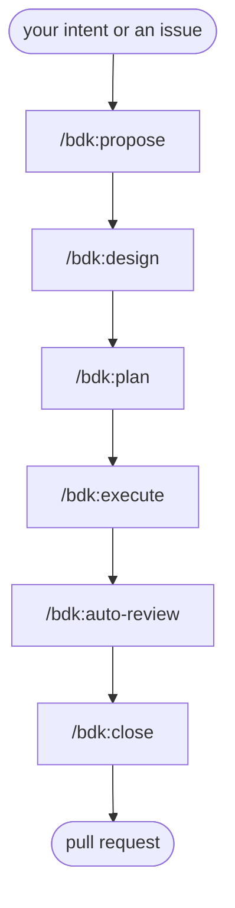

# What BDK is - Claude Code plugins that take an idea to a reviewed pull request

BDK (Broneq Dev Kit) is a set of [Claude Code](https://code.claude.com/docs) plugins. The main one, `bdk`, gives Claude Code a workflow for changing a project: you describe what you want, and BDK writes down the intent, designs it, plans it, builds it, reviews it as a user of the product would, and opens a pull request. Every stage writes files you can read, and every stage can stop for your decision or run on its own.

## Quick start

In Claude Code, in your project:

```text
/plugin marketplace add broneq/bdk
/plugin install bdk@bdk
```

Restart Claude Code, then:

```text
/bdk:setup
/bdk:run "users can export the order list as CSV"
```

`/bdk:setup` configures the project once. `/bdk:run` takes the intent through every stage to a pull request, and stops where it needs your decision: the design gate and each review triage, by default. The rest of this Guide explains each step; new words are in the [glossary](/concepts/glossary).

## The plugins

| Plugin | What it gives you | Reference |
|---|---|---|
| `bdk` | The workflow: `/bdk:setup`, `/bdk:propose`, `/bdk:design`, `/bdk:plan`, `/bdk:execute`, `/bdk:auto-review`, `/bdk:close`, the autopilot `/bdk:run`, plus `/bdk:debug` for bugs and `/bdk:pr-review` for any open pull request | [skills](/reference/bdk/skills), [agents](/reference/bdk/agents), [CLI](/reference/bdk/cli), [settings](/reference/bdk/settings), [hooks](/reference/bdk/hooks) |
| `bdk-craft` | Engineering skills Claude picks up by itself: test-driven development, debugging, refactoring, testing strategy, Mermaid diagrams. Works without `bdk` | [bdk-craft](/reference/bdk-craft) |
| `bdk-skill-kit` | A validator and authoring guidance for Agent Skills and subagent files | [bdk-skill-kit](/reference/bdk-skill-kit) |
| `git-identity` | Binds a project to one GitHub account and one commit identity, so every `gh` call and commit in it uses the right one | [git-identity](/reference/git-identity) |

Each plugin installs and works on its own. You need `bdk` for the workflow; the others are optional.

## How a change flows


```mermaid
flowchart TB
  I(["your intent or an issue"]) --> P["/bdk:propose"]
  P --> D["/bdk:design"]
  D --> PL["/bdk:plan"]
  PL --> E["/bdk:execute"]
  E --> R["/bdk:auto-review"]
  R --> C["/bdk:close"]
  C --> PR(["pull request"])
```

Each box is a command you can run yourself, one at a time, or let `/bdk:run` run them all. The [workflow page](./workflow.md) walks through one change; [Concepts](/concepts/workflow) explains what happens inside each stage.

## What makes it different

- **It checks the product, not only the code.** Each Change carries spec scenarios, and the review starts your product and drives those scenarios as a user would ([E2E checks](/concepts/e2e)), next to code review and your project's tests and linters.
- **It keeps living documentation.** Every Change ends by merging its spec deltas into `openspec/specs/`, so the specs always say what the product does ([OpenSpec Changes](/concepts/openspec-changes)).
- **You choose how much it asks.** By default BDK stops at the design gate and asks you about review findings; a few settings let it run unattended ([gates and budgets](/concepts/gates-and-budgets)).
- **Everything is a file.** A stage that stops can be run again and picks up where it left off ([run state](/concepts/run-state)).

## Where to go next

1. [Install](./install.md) the plugins.
2. [Set up a project](./first-run.md) with `/bdk:setup`.
3. [Take one idea to a pull request](./workflow.md).
4. [Change the configuration](./configuration.md) when the defaults do not fit.
5. Know [what a run costs and what it touches](./footprint.md).
6. [Diagnose a finished run](./diagnostics.md): where its time and money went.

This site documents BDK v3. For BDK v2 (`v2.7.0`), read the [v2 README](https://github.com/broneq/bdk/blob/v2.7.0/README.md).
