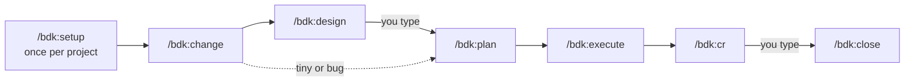

# BDK - Broneq Dev Kit

BDK is a Claude Code plugin that carries a piece of work from intent to a
reviewed, mergeable branch: design, plan, execution by role agents, review and
close. A small TypeScript kernel keeps the state of that work in committed
files, decides what comes next and refuses what the process does not allow, so
nothing depends on what a conversation remembers. Nothing in it is tied to a
language: your test, lint and build commands live in `.bdk/settings.yaml`, and
every skill and agent gets them from the kernel.

## Why BDK

- **[State in files, not in the conversation](concepts/change-pipeline.md).**
  Every piece of work is a Change under `.bdk/changes/`, committed with the
  code. Close the session after any step and continue in a fresh one, on
  another machine, or after a teammate pulls the branch.
- **[Process sized to the change](concepts/change-pipeline.md#profiles).** A
  `tiny` Change goes straight to a plan; a `small` one gets a design and two
  verifications; a `large` one splits its design into parts and runs its plan
  parts as a tree of agents.
- **[You decide at the gates](concepts/change-pipeline.md#gates).** The design
  and the review each end at a gate that only a command you type passes. The
  model cannot pass it for you.
- **[Independent verifiers](concepts/agents.md).** The design and the plan are
  checked against the code by an Opus agent that knows only its package, and
  that may block only on the categories you allow.
- **[Verification proportional to the change](concepts/verification-scoping.md).**
  Each task runs the tests related to its own files; the whole suite runs once,
  before the review verdict. The kernel, not an agent, decides when a result is
  stale.
- **[Retries that end](concepts/change-pipeline.md#tickets-and-the-escalation-ladder).**
  Every retry has a budget, one escalation to a stronger model, and then a
  question to you. No loop runs until the context is gone.
- **[Review in rounds](workflows/code-review.md).** A reviewer per group of the
  change and an integration reviewer over all of it; blocking findings are fixed
  in the next round, and you decide the rest.
- **[Living specs](concepts/change-pipeline.md#living-specs).** What the project
  ships is described in `.bdk/specs/`; each Change carries a delta that the
  close merges.
- **[Rules that earn their place](concepts/quality-and-language-rules.md).**
  Rules have ids, agents cite the ones they applied, and
  [`/bdk:rules`](reference/skills.md#bdk-rules) turns recurring lessons into
  rules and prunes the ones nobody cites.
- **Nothing to run beside Claude Code but Node.** No MCP server, no background
  process; agents use Claude Code's built-in tools.

## How you work with it

```mermaid
flowchart LR
    S["/bdk:setup<br/>once per project"] --> C["/bdk:change"]
    C --> D["/bdk:design"]
    D -->|"you type"| P["/bdk:plan"]
    P --> X["/bdk:execute"]
    X --> R["/bdk:cr"]
    R -->|"you type"| Z["/bdk:close"]
    C -. "tiny or bug" .-> P
```

Each stage ends by naming the command to type next. Type it yourself, or let
[`/bdk:run`](reference/skills.md#bdk-run) type them for you: it stops at each
gate, and with `--auto` it passes those too.

| Profile                       | When                                                                      | Stages                                                   |
| ----------------------------- | ------------------------------------------------------------------------- | -------------------------------------------------------- |
| [`tiny`](workflows/tiny.md)   | At most 2 files in 1 module, no behaviour, schema or configuration change | change, plan, execute, review, close                     |
| [`small`](workflows/small.md) | Most work; the default                                                    | change, design, plan, execute, review, close             |
| [`large`](workflows/large.md) | A design across three or more subsystems                                  | the same, with design parts and plan parts run as a tree |

A bug fix is a `bug` Change: no design, a plan with the failing test and the
fix. See [Debugging](workflows/debugging.md).

## Where to start

- **[Installation](getting-started/installation.md)**: Node, the two install
  commands, and what changes in your sessions.
- **[Project setup](getting-started/setup.md)**: `/bdk:setup` writes your
  commands into `.bdk/settings.yaml`.
- **[Your first feature](getting-started/first-feature.md)**: one `small`
  Change from `/bdk:change` to `/bdk:close`.
- **[Migration from v2](getting-started/migration-from-v2.md)**: you used BDK 2.

Looking for a setting, a skill or a file? Go to
[Configuration](reference/configuration.md), [Skills](reference/skills.md),
[Artifacts](reference/artifacts.md) or [Troubleshooting](troubleshooting.md).
