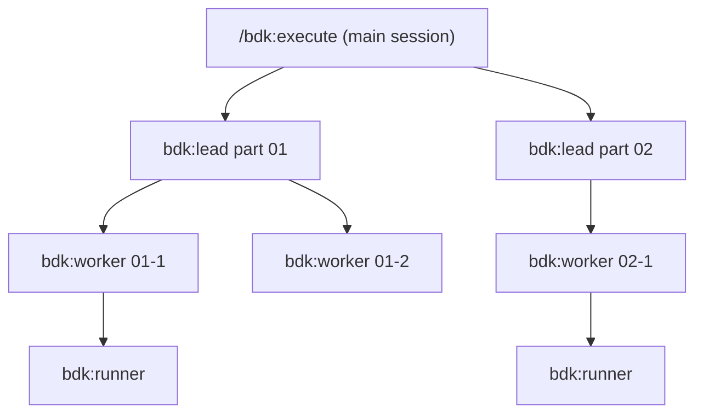

# Large changes

A `large` Change is a feature whose design spans three or more subsystems. It
runs the same stages as a [`small`](small.md) one, with two differences: the
design is split into parts, and the plan parts can run as a tree of agents,
one lead per part.

## How a Change becomes large

`/bdk:change` opens most features `small`. `/bdk:design` splits the design into
`design/parts/<nn>-<slug>.md` when it spans three or more subsystems, and the
first `bdk done design` on those parts raises the Change to `large`; the kernel
records that as a decision in the ledger. You can also raise it yourself:

```sh
bdk change resume <id> --profile large
```

## The design

Each design part covers one concern and stays small enough to verify. When the
parts are done, the kernel generates `design/index.md` from them (never edit
it), then `architecture.md` and the design verification follow as for a
`small` Change. The design verifier reads every part, and the gate opens when
you type `/bdk:plan`.

## The plan

A `large` plan must declare `spec-impact` on every part, `none` or the
capabilities it changes, so no spec change goes unplanned. Parts without a
dependency between them form a wave. A part that would share state outside its
`Files:` with another part of its wave, such as a lockfile both regenerate, is
marked `isolation: worktree`; see [Worktree parts](../concepts/worktree-parts.md).

## Execution as a tree

When at least `execution.tree.min-parts` (default 2) independent parts are
ready, `bdk next` marks them `tree`, and `/bdk:execute` starts one `bdk:lead`
agent per part instead of dispatching every task itself:



A lead dispatches its part's tasks to background agents, waits for them with
`bdk agents wait`, closes each ticket and commits each task. At most
`execution.concurrency` (default 5) dispatches of one wave run at once.
`bdk agents list` shows the tree while it runs. Set `execution.tree.enabled` to
`false` to run every part flat from the main session.

## The review

The review groups the range by plan part, so each reviewer reads one part's
work, plus `unplanned` files no task names and an integration reviewer over the
whole range. A group more than a third above `review.group.max-files` is split by directory.

## Two large Changes at once

Each Change is bound to its branch, so two of them run in two worktrees, one
Claude Code session each, and merge like any two branches. See
[The Change pipeline](../concepts/change-pipeline.md#two-changes-at-once).
