# BDK SDLC Architecture — Workflow Map & Improvement Targets

> **Purpose:** End-to-end visualization of every SDLC workflow shipped by BDK (Broneq Dev Kit). Use this document to (1) audit current orchestration, (2) identify slowness / token waste / portability gaps, (3) plan the next iteration toward faster, more accurate, more language-agnostic, more token-efficient skills.

---

## 0. Top-Level Flow

The full BDK SDLC moves a feature from a vague idea to a committed change through five phases. Each phase has its own skill set; phases are loosely coupled by file artifacts in `.bdk/`.

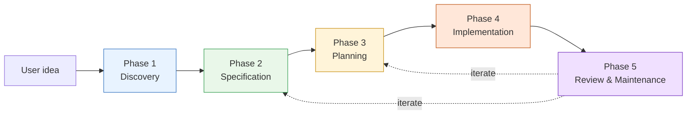

| Phase | Skills | Output artifact |
|---|---|---|
| 1. Discovery | `design` | `.bdk/design/*.md` |
| 2. Specification | `create-tasks`, `create-adr` | `.bdk/create-tasks/*.md`, `docs/adr/NNNN-*.md` |
| 3. Planning | `create-plan`, `verify-plan` | `.bdk/plans/<ts>-<slug>.md`, `.bdk/verify-plan/*-verification.md` |
| 4. Implementation | `execute-plan`, `subagent-execute-plan`, `test-driven-development` | Code changes + commits |
| 5. Review & Maintenance | `cr`, `refactor`, `debug`, `commit`, `audit-prompt` | `.bdk/cr/*/report.md`, fix commits, ADRs |

---

## 1. Foundation Substrate (loaded into every session)

Before any phase runs, the SessionStart hook injects ~1150 tokens of shared context.

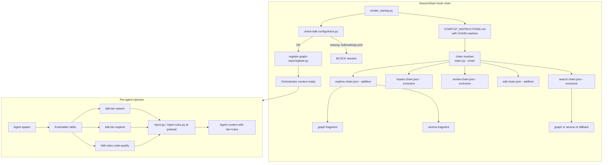

**Key mechanics**
- `<!-- CHAIN: x.chain.json -->` markers resolved **before** hook stdout returns (not via Claude Code dynamic injection — that doesn't apply to hook output).
- Plugin agents cannot use `hooks:` frontmatter (Claude Code restriction). Workaround: meta-skills (`bdk-tier-*`, `bdk-rules-*`) listed in agent `skills:` preload the same tier guidance.
- Settings discovery walks upward from `cwd` for `.bdk/settings.json` — works in monorepos.

### Foundation pain points

- ✅ **Hook chain warmup reduced** (2026-05-26) — `fragments/tool-tiers/*.md` trimmed of redundant prose while preserving tool tables and policy rules. Chain mechanism unchanged (CHAIN markers still in `STARTUP_INSTRUCTIONS.md`, still feature-conditional). Measured: 10140 → 7502 bytes across 11 tier fragments (~30%); rendered STARTUP drops from ~8930 → 6293 bytes with both features on (~660 tokens/session saved).
- 🟡 **Chain content is static** — `explore.chain.json` (additive) injects both graph + serena even when one is enough for the task.
- ✅ **`agents/test-runner.md` portability fixed (2026-05-22)** — now resolves commands via `bdk-test-tools` meta-skill from `.bdk/settings.json`. Same pattern applied to lint via `bdk-lint-tools`. No hardcoded `pytest`/`go test`/`cargo test` left.
- 🟢 **Settings-driven gating** is clean: missing `.bdk/settings.json` blocks the session with a clear setup pointer.

---

## 2. Phase 1 — Discovery (brainstorming & brainstorm-architecture)

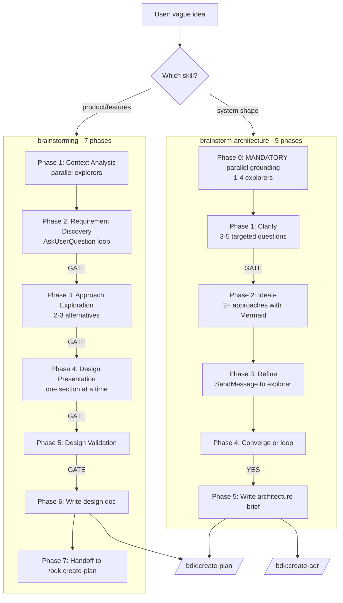

### Per-skill notes

**`brainstorming`** — 7 sequential phases with 4 hard user-gate stops. Phase 1 spawns parallel explorers (haiku); later phases can reuse the same agent via `SendMessage`.

**`brainstorm-architecture`** — Phase 0 mandatory parallel explorer grounding (1–4 agents, ≤300 words each). Outputs Mermaid diagrams per approach, plus an explicit "What we did NOT decide" section pointing to ADR.

### Discovery pain points

- ✅ **Per-section gating dropped** (2026-05-22) — `/bdk:design` Phase 2 runs branch dimensions in one turn; gates collapsed into Phase 3 validation.
- ✅ **Two-skill split resolved** (2026-05-22) — `/bdk:design` unifies product / architecture / combined behind one classify question.
- 🟡 **Explorer-first still mandatory** in Phase 0 of `/bdk:design`. Tradeoff preserved: cheaper-than-rework cost when user hasn't volunteered codebase context; revisit if greenfield use cases dominate.
- 🟢 **`SendMessage` reuse pattern** prevents duplicate explorer spawns within ~5 min cache window.
- 🟢 **Both skills inject `architecture` rules via marker** — no token cost when user disables.

---

## 3. Phase 2 — Specification (create-tasks & create-adr)

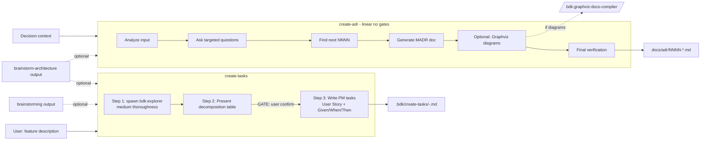

### Spec pain points

- 🟡 **`create-tasks` requires a decomposition confirmation gate** — useful for large epics, overkill for one-task fixes.
- 🟢 **`create-adr` has no gates** — linear and fast. Right choice for narrow scope.
- 🟢 **No language assumptions** in either skill.
- 🔴 **No skill exists that goes brainstorming → create-tasks → create-plan in one shot** — each must be invoked manually, user re-explains context.

---

## 4. Phase 3 — Planning (create-plan & verify-plan)

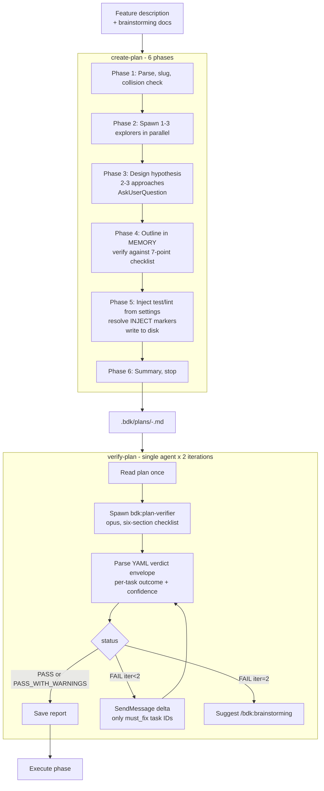

### Planning pain points

- ✅ **`verify-plan` collapsed to a single Opus agent (2026-05-22)** — was the most expensive operation per task (2× opus simulators + 1× sonnet reviewer + explorer, up to 3 iterations, ~330 k tokens worst case). Replaced by `bdk:plan-verifier` driven by a six-section structured checklist, iterating via `SendMessage` against a warm `agent_id`, capped at 2 iterations. See §7.6.1.
- ✅ **Explorer in `verify-plan` no longer re-runs from scratch** — the single agent retains plan + iteration-1 findings; iteration 2 receives only the must-fix delta.
- 🟡 **`create-plan` Phase 2 spawns 1–3 explorers serially-after the parse phase** — could pipeline parse + first explorer.
- 🟡 **Plan template is read fresh** at Phase 5 of `create-plan` and re-resolved with `inject-rules.py` even for repeated calls.
- 🟢 **No code re-reads** in `create-plan` after Phase 2 — outline lives in orchestrator memory until disk write.
- 🟢 **`verify-plan` is opt-in** — user can skip directly to execute.

---

## 5. Phase 4 — Implementation (execute-plan & subagent-execute-plan)

Two execution modes: **interactive** (`execute-plan`, human-paced) and **autonomous** (`subagent-execute-plan`, full fleet orchestration).

```mermaid
flowchart TB
    PLAN[.bdk/plans/<ts>-<slug>.md] --> MODE{Mode?}
    MODE -- interactive --> EP[/bdk:execute-plan/]
    MODE -- autonomous --> SEP[/bdk:subagent-execute-plan/]

    subgraph EP[execute-plan - per task loop]
      EP0[Create TaskList] --> EP1{Has Test cases:?}
      EP1 -- YES --> TDD[Invoke /bdk:test-driven-development]
      EP1 -- NO --> IMPL[Implement inline]
      TDD --> VER[Step 2: PARALLEL verify]
      IMPL --> VER
      VER --> V1[test-runner haiku]
      VER --> V2[static-analyse haiku]
      V1 --> FIX{Pass?}
      V2 --> FIX
      FIX -- NO + cycles<3 --> IMPL
      FIX -- YES --> NEXT[Next task]
      FIX -- NO + cycles=3 --> ASK[Ask user]
    end

    subgraph SEP[subagent-execute-plan - fleet]
      S0[Step 0: Validate + branch + BASE_SHA<br/>bdk:explorer returns JSON groups] --> S1[Step 2: Build TaskList<br/>with group membership]
      S1 --> S3[Step 3: Per-group loop]
      S3 --> S3B[3b: Dispatch implementers PARALLEL background<br/>1 per task in group<br/>haiku/sonnet/opus auto-pick]
      S3B --> S3C[3c: Collect YAML returns]
      S3C --> S3D{Status?}
      S3D -- DONE --> S3E[3e: Spawn verifiers PARALLEL<br/>test-runner + static-analyse]
      S3D -- NEEDS_CONTEXT --> SM[SendMessage warm cache]
      S3D -- BLOCKED --> ESC[Escalate model tier]
      SM --> S3C
      ESC --> S3B
      S3E --> S3F{Pass?}
      S3F -- FAIL --> FIXER[Spawn bdk:fixer]
      FIXER --> S3E
      S3F -- PASS --> S3G[3g: Commit group]
      S3G --> S3
      S3 -- all groups done --> S4[Step 4: End-of-plan review]
      S4 --> S4A[4a: code-reviewer sonnet]
      S4A --> S4B[4b: Triage CRIT/HIGH -> fixer]
      S4B --> S4C{>=3 modules?}
      S4C -- YES --> S4ARC[architecture-reviewer opus]
      S4C -- NO --> S4D
      S4ARC --> S4D[4d: test-runner full suite]
      S4D --> S4E[4e: Summary block]
    end
```

### Implementer agent (subagent-execute-plan calls it)

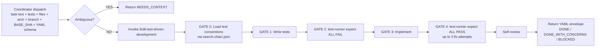

### Implementation pain points

- ✅ **`subagent-execute-plan` end-of-plan review (Step 4) parallelized** (2026-05-26, commit `d95b741`) — Phase A (code-reviewer + triage) stays sequential; Phase B fans out `architecture-reviewer` and full `test-runner` in a single coordinator message with `run_in_background: true`. Anti-pattern added forbidding sequencing.
- 🔴 **Verification re-spawns** test-runner and static-analyse on every fix cycle (no SendMessage reuse for verifiers).
- 🔴 **`execute-plan` blocks at 40% context usage** asking user to save progress — interrupts flow on long plans.
- 🟡 **Group execution is parallel within a group, but groups are serial** — no pipelining of next group's prep while current commits.
- 🟡 **TDD agent spawns 2× test-runner per task** (RED + GREEN) — could pre-warm runner once at GATE 0.
- 🟢 **Implementer never reads plan file** — content passed inline. No re-parse cost.
- 🟢 **Model auto-escalation** (haiku → sonnet → opus) on `BLOCKED` is the right shape; just runs on a single retry budget.

---

## 6. Phase 5 — Review & Maintenance (`/bdk:cr`, refactor, debug, commit, audit-prompt)

### 6.1 Code review with dynamic scaling

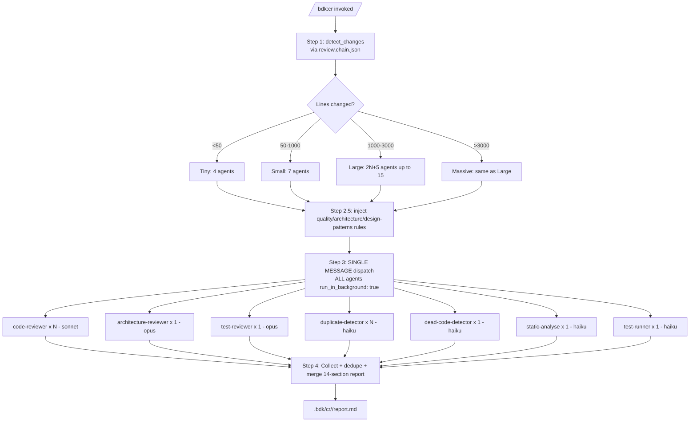

| Size | Agents spawned | Approx wall time |
|---|---|---|
| Tiny (< 50 LOC) | 4 | 30–60 s |
| Small (50–1000) | 7 | 60–120 s |
| Large (1000–3000) | up to 15 | 2–3 min |
| Massive (3000+) | up to 15 | 2–3 min (parallel) |

### 6.2 Refactor / Debug / Commit / Audit-prompt

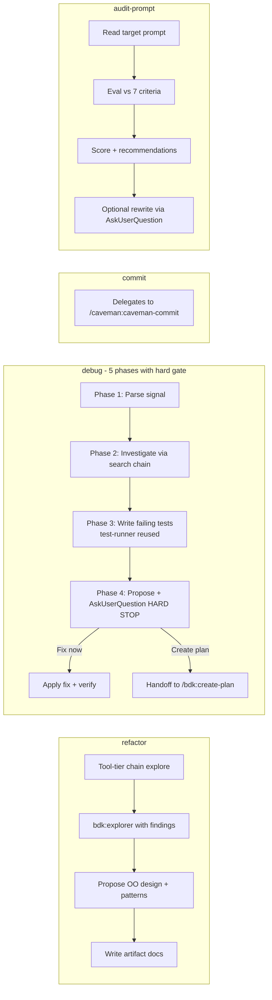

### Review & maintenance pain points

- 🔴 **`/bdk:cr` Step 4 collect-and-merge** runs sequentially in the orchestrator — 14 sections built one-by-one even though all inputs are already in hand.
- 🔴 **Quality rules preloaded per layer-group**, but a fresh review spawn doesn't share cache with prior `/bdk:cr` invocations — same ~1200 tokens per layer-group per run.
- 🔴 **`detect_changes` runs every `/bdk:cr` call** even on unchanged diffs (no memoization).
- 🟡 **Duplicate-detector partitioning** is symbol-disjoint within a single run but doesn't deduplicate findings across runs (re-runs find the same patterns).
- 🟡 **`debug` Phase 4 hard gate** is correct for ambiguous bugs, but adds latency to obvious one-line fixes.
- 🟢 **Single-message background fan-out** in `/bdk:cr` is the right pattern — no sequential queueing.
- 🟢 **All review agents use graph tools first** (`detect_changes`, `get_review_context`) — ~40% token savings vs raw file reads.

---

## 7. Cross-Cutting Improvement Targets

Mapped against the user's five goals.

### 7.1 Faster

| Where | Change |
|---|---|
| `verify-plan` iterations | Cache explorer report across iterations; only re-run explorer on plan-section delta. |
| `verify-plan` simulators | Run Stage 1 explorer + Stage 2A/2B simulators in 3-way parallel (Stage 2 doesn't strictly need full explorer output for some cases — pass partial). |
| ~~`subagent-execute-plan` Step 4~~ | ✅ **Done 2026-05-26** — Phase B runs architecture-reviewer ‖ full-suite test-runner via single background dispatch. |
| `/bdk:cr` collect-merge | Build sections in parallel from agent returns; merge step becomes pure concatenation. |
| `execute-plan` TDD | Pre-warm test-runner agent at GATE 0; reuse via `SendMessage` for GATE 2 and GATE 4. |
| ~~Foundation hook~~ | ✅ **Done 2026-05-26** — tier fragments trimmed of redundant prose (~30%), reducing rendered STARTUP size. `register-graph-repo` still runs unconditionally (separate optimization). |
| Verification cycles | Re-engage test-runner / static-analyse via `SendMessage` instead of fresh spawn on fix cycles. |

### 7.2 More accurate

| Where | Change |
|---|---|
| `create-plan` Phase 4 | Replace 7-point checklist with structured schema validation (e.g., JSON Schema for outline). Catches missing fields deterministically. |
| `verify-plan` Stage 3 | Code-reviewer should receive simulator outputs as **structured findings** (not free-form text) → reduces parse errors. |
| `subagent-execute-plan` BLOCKED handling | Currently relies on agent's self-report; add coordinator-side sanity check (file changed? test added? lint clean?) before accepting DONE. |
| `/bdk:cr` deduplication | Findings dedup currently text-based; switch to (file, line, category) tuple keys. |
| `debug` Phase 2 | Add "test-first" sub-step: write failing test before investigation completes, so the bug definition is locked in. |

### 7.3 Better output quality

| Where | Change |
|---|---|
| `brainstorming` Phase 4 | Drop per-section gates for small features (< X tokens of design); single review pass instead. Keep per-section for large designs. |
| `brainstorm-architecture` Phase 2 | Mandate ≥2 Mermaid diagrams per approach (currently optional after first). Forces concrete component sketches. |
| `verify-plan` verdict template | Add quantitative confidence (0.0–1.0) per task, not just PASS/FAIL. |
| `subagent-execute-plan` Step 4c | Always run architecture-reviewer (not just on ≥3 modules) — cheap relative to code-reviewer. |
| `/bdk:cr` report | Add executive summary section (currently 14 sections, no TL;DR). |
| `audit-prompt` | Add comparative score vs anchor prompts in BDK itself (use existing skills as references). |

### 7.4 Language and project agnostic

| Where | Change |
|---|---|
| `agents/test-runner.md` | ✅ **Done 2026-05-22.** Migrated to `bdk-test-tools` meta-skill resolution from `.bdk/settings.json`. Companion `bdk-lint-tools` covers `static-analyse`. |
| `STARTUP_INSTRUCTIONS.md` | Document the contract: "no skill may name a tool; tools come from `.bdk/settings.json`". Enforce via lint. |
| `/bdk:cr` Step 1 | `git diff HEAD~1` assumes Git. Externalize VCS layer to allow Jujutsu, Sapling, etc. |

### 7.5 Token consumption

| Where | Change | Estimated savings |
|---|---|---|
| ~~Foundation~~ | ✅ **Done 2026-05-26** — `fragments/tool-tiers/*.md` trimmed of redundant prose. Chain mechanism preserved (still feature-conditional). | **~660 tokens/session measured** (rendered STARTUP 8930 → 6293 bytes with both MCP features on; 11 fragments 10140 → 7502 bytes / ~30%) |
| `verify-plan` simulators | Pass only **changed plan sections** on iteration 2+, not full plan. | 30–50% per iteration |
| `/bdk:cr` rule preload | Share quality rule context across layer-groups via a single shared meta-skill mount, not N preloads. | ~1200 × (N−1) tokens per review |
| `subagent-execute-plan` implementer dispatch | Currently includes full task text + arch context + return schema (~3k tokens). Compress schema to a reference once at session start; pass only deltas. | ~1500 tokens per implementer spawn |
| `create-plan` Phase 5 | Cache `inject-rules.py` output between invocations (rules change rarely). | ~400 tokens/plan |
| `brainstorm-architecture` Phase 0 | Allow user to skip explorer grounding with `--greenfield` flag. | 1–4 spawns × ~2000 tokens |

---

## 7.6 Confirmed redesign directions (decided 2026-05-22)

Three architectural shifts approved by the user. Diagrams and rationale below.

### 7.6.1 Replace `verify-plan` with a single Opus subagent

**Status:** ✅ Implemented 2026-05-22. `agents/plan-verifier.md` ships with six-section checklist + YAML verdict envelope. `skills/verify-plan/SKILL.md` rewritten to single-agent flow, cap 2 iterations.

**Decision:** Drop the 4-stage pipeline (explorer + 2× step-simulator + code-reviewer). Replace with one Opus subagent driven by a structured checklist.

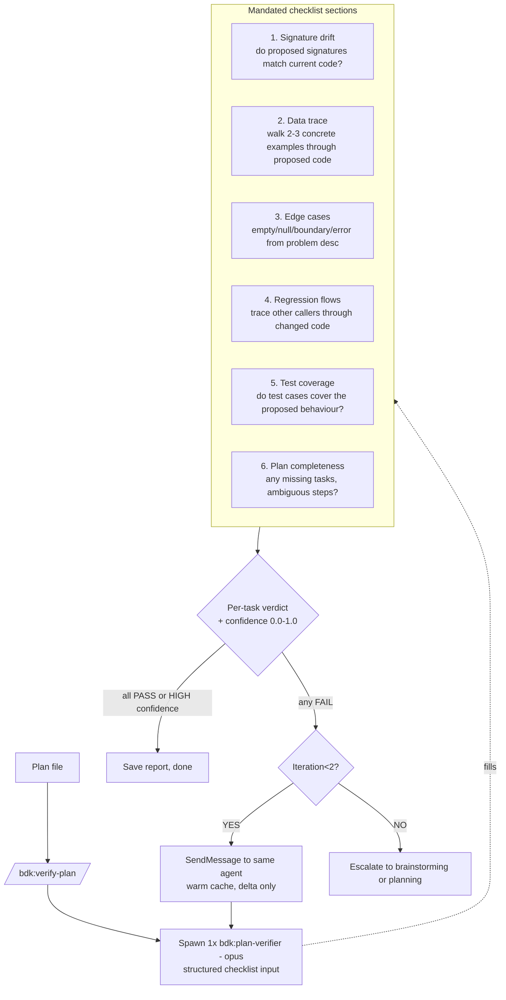

**Token math:**
- Current: ~330k tokens worst case (3 iterations × explorer + 2× opus + sonnet)
- New: ~80–120k tokens single pass; iteration 2 via SendMessage adds ~10–20k
- **Savings: 60–70%**

**Quality protection:** Structured checklist forces the agent to cover both "Plan Prover" (does it work?) and "Regression Hunter" (does it break others?) lenses without paying for two agents.

**Iteration cap:** Drop from 3 to 2. After two failures, escalate to brainstorming (plan is structurally wrong, not detail-wrong).

---

### 7.6.2 New coordinator skill: `/bdk:design-and-build`

**Decision:** Build a single coordinator that drives discovery → architecture → planning → verification as warm subagents with back-edges. Existing skills stay invokable standalone.

```mermaid
flowchart TB
    USER[User: feature description] --> COORD[/bdk:design-and-build<br/>coordinator]

    COORD --> D[design subagent<br/>opus]
    D --> COORD

    COORD --> P[planner subagent<br/>sonnet]
    P --> COORD

    COORD --> V[plan-verifier subagent<br/>opus]
    V --> COORD

    COORD -- design unclear or missing requirements --> D
    COORD -- plan revealed design gap --> D
    COORD -- verify failed: detail issue --> P
    COORD -- verify failed: structural issue --> D
    COORD -- verify passed --> HANDOFF[Handoff to /bdk:execute-plan or /bdk:subagent-execute-plan]

    COORD -.back-edge gate.-> ASKU[AskUserQuestion before looping<br/>prevents infinite loop]
```

**Mechanics:**
- **Warm subagents** — coordinator keeps each subagent's `agentId`; uses `SendMessage` for back-edges. Within 5-min cache window, deltas only (~5–10k tokens per loop-back).
- **Back-edge gate** — coordinator never silently loops. Always asks user via `AskUserQuestion` ("verify failed at task 3.2 — drop to planner refinement, or reopen design?"). Cap: 3 total loop-backs per session.
- **Standalone skills still work** — power users can still invoke `/bdk:create-plan` directly. The coordinator is opt-in for end-to-end flow.

**Token math:**
- Single linear pass (no loop-backs): ~50–60k tokens total
- 1 loop-back to planner: +10k
- 1 loop-back to design + replanner: +20k
- vs current siloed flow (~150k+ when user manually re-invokes each skill and re-primes context)

**Risk & mitigation:**
| Risk | Mitigation |
|---|---|
| Coordinator decides wrong (loops when it shouldn't) | Hard back-edge gate via AskUserQuestion |
| Subagent cache expires mid-flow (>5 min) | Coordinator detects stale agentId, spawns fresh; user is warned about lost warmth |
| User wants to abort mid-flow | `/bdk:save-progress` works at any coordinator stage |

**Order:** Build this AFTER (1) verify-plan rework and (3) brainstorming merger — those are dependencies.

#### Artifact exposure (decided)

Coordinator writes every intermediate artifact to disk as if the standalone skill had run. User can stop, inspect, edit, and resume from any phase.

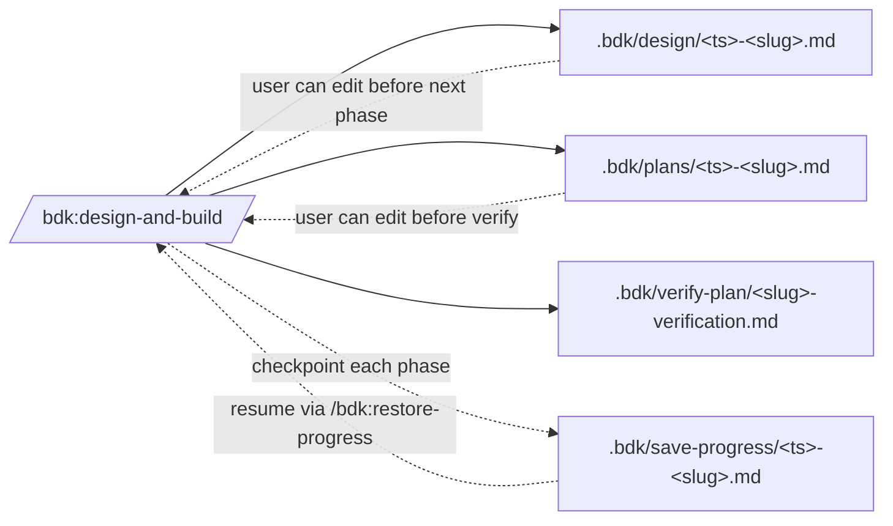

**Rules:**
- **Every phase writes its artifact before the next subagent spawns** — no in-memory-only state across phase boundaries.
- **Coordinator re-reads the artifact** at the start of the next phase, not its own memory. Lets the user edit the design doc before planning runs.
- **Checkpoint after each phase** to `.bdk/save-progress/` with the slug + current phase. `/bdk:restore-progress` picks up exactly where we stopped, including any user edits to artifacts.
- **Back-edge edits are versioned** — when the coordinator loops back to design after verify failure, it writes `.bdk/design/<ts>-<slug>-v2.md` (not overwrite). User can diff what changed.

**Token cost of exposure:** ~1 disk write per phase (negligible) + ~2k tokens to re-read artifact at next phase (vs ~0 if kept in memory). Worth it for inspectability.

---

### 7.6.3 Merge `brainstorming` + `brainstorm-architecture` → `/bdk:design`

**Status:** ✅ Implemented 2026-05-22. `skills/design/SKILL.md` ships with 5-phase shape (Ground → Classify → Branch → Validate → Write), Phase 3 validation loop with warm-explorer reuse via `SendMessage`, hard 3-loop cap. Old skills deleted; output directory unified at `.bdk/design/`. Cross-refs in `create-plan`, `verify-plan`, `setup`, `README`, `INJECTION-FLOWS.md`, `.claude/rules/artifacts.md` updated.

**Decision:** Single skill with up-front classification, then product or architecture or combined branch. Deprecate the two existing skills.

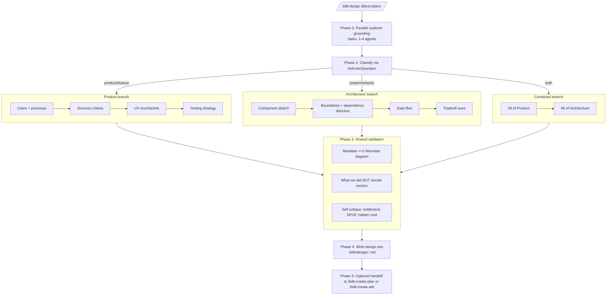

**Classification heuristic (Phase 1 AskUserQuestion):**
- "Is this about **what to build** for **whom** (product, feature, UX)?" → Product
- "Is this about **how it's shaped** (components, boundaries, data flow)?" → Architecture
- "Both" → Combined

**Key changes from current state:**
- Drop `brainstorming` Phase 4's one-section-at-a-time review (was deliberate slowness, now collapsed into Phase 3 validation pass)
- Always mandate ≥1 Mermaid diagram (currently only `brainstorm-architecture` enforced it)
- Always include "What we did NOT decide" section (was only in `brainstorm-architecture`)
- Single output directory: `.bdk/design/` (deprecate `.bdk/brainstorming/` and `.bdk/brainstorm-architecture/`)

**Migration path:**
1. Build `/bdk:design` alongside existing two skills
2. Mark `brainstorming` and `brainstorm-architecture` deprecated in README with redirect note
3. Remove after one release cycle

**`create-adr` stays separate** — it formalizes a *specific* decision, not the same space.

---

### 7.6.4 Sequencing of the three redesigns

```mermaid
gantt
    title Recommended build order
    dateFormat YYYY-MM-DD
    section Foundation
    Fix test-runner portability      :done, fix1, 2026-05-22, 1d
    section Verify rework
    /bdk:plan-verifier (Opus single) :done, v1, after fix1, 3d
    Replace verify-plan internals    :done, v2, after v1, 2d
    section Design merger
    /bdk:design skill                :d1, after v2, 4d
    Deprecate brainstorming + brainstorm-architecture :d2, after d1, 1d
    section Coordinator
    /bdk:design-and-build            :c1, after d2, 5d
    Back-edge gate + warm reuse      :c2, after c1, 2d
```

Reasoning:
- **Portability fix first** (1 day) — unblocks everything else. ✅ 2026-05-22
- **Verify rework second** — biggest token savings, independent of other changes. ✅ 2026-05-22
- **Design merger third** — clarifies the interface the coordinator will consume. ✅ 2026-05-22
- **Coordinator last** — depends on both prior shifts being stable. ← **next**

---

## 8. Quick-Wins Backlog (priority order)

1. ~~**Fix `agents/test-runner.md` portability**~~ ✅ **Done 2026-05-22** — meta-skills `bdk-test-tools` / `bdk-lint-tools` resolve commands from `.bdk/settings.json`.
2. ~~**Cache `verify-plan` explorer between iterations**~~ ✅ **Done 2026-05-22** — subsumed by §7.6.1: the single `bdk:plan-verifier` agent retains plan + iter-1 findings; iter 2 receives only the must-fix delta via `SendMessage`.
3. ~~**Trim tier fragments**~~ ✅ **Done 2026-05-26** — `fragments/tool-tiers/*.md` trimmed of redundant prose (duplicate budgets, repeated coverage-check lines, verbose tool descriptions). Chain mechanism preserved — STARTUP still uses feature-conditional `<!-- CHAIN: ... -->` markers and `inject.py --chain` resolves them against `.bdk/settings.json`. Skills using inline chains (`cr`, `debug`, `refactor`, `design`, `execute-plan`, `explain-complex-code`, `test-driven-development`, `update-docs`) inherit the smaller fragments transparently. Measured: 11 fragments 10140 → 7502 bytes (~30%); rendered STARTUP 8930 → 6293 bytes (~660 tokens/session with both MCP features on). Earlier "remove CHAIN markers + thin hint" approach rejected — hardcoded tool prefixes (`mcp__plugin_bdk_code-review-graph__*`, `mcp__plugin_bdk_serena__*`) violated configurability.
4. ~~**Parallelize `subagent-execute-plan` Step 4**~~ ✅ **Done 2026-05-26** (commit `d95b741`) — Step 4 split into Phase A (code-review + triage, sequential) and Phase B (architecture-reviewer || full test-runner, parallel via single message with `run_in_background: true`). Anti-pattern added forbidding sequential dispatch.
5. ~~**Add `--quick` flag to `brainstorming`**~~ ✅ **Subsumed 2026-05-22** — §7.6.3 `/bdk:design` removes per-section gates structurally; no flag needed.
6. **Memoize `detect_changes`** in `/bdk:cr` against git SHA + diff hash.
7. ~~**Structured verdicts in `verify-plan`**~~ ✅ **Done 2026-05-22** — the new YAML envelope (per-task `outcome` + `confidence` + per-section `checks` + `must_fix`) is structured and machine-parseable.
8. **Shared rules mount** for `/bdk:cr` layer-groups — preload once, reference N times.

---

## 9. Key Open Questions

- Should there be an **all-in-one super-skill** (`/bdk:ship`) that chains discovery → spec → plan → execute → review with sensible defaults and minimal gates? Currently the user must invoke each, re-priming context each time.
- ~~Is the **3-iteration cap on `verify-plan`** too generous?~~ **Answered 2026-05-22** — cap dropped to 2 in the §7.6.1 rework. After two failures the plan is treated as structurally wrong and `/bdk:design` is recommended.
- Should `/bdk:cr` **always include a test-reviewer** (currently only for Tiny+), since test coverage gaps are the most common high-severity finding?
- ~~Can we **drop the brainstorming/brainstorm-architecture split** and have a single `/bdk:design` skill?~~ **Answered 2026-05-22** — done; see §7.6.3.

---

## 10. Reference: Agent registry

| Agent | Model | Owner | Spawned by | Purpose |
|---|---|---|---|---|
| `explorer` | haiku | direct | `design`, `create-tasks`, `create-plan`, `verify-plan`, `subagent-execute-plan`, `refactor`, `debug` | Codebase exploration |
| `log-analyzer` | haiku | direct | manual | Stderr/log triage |
| `web-researcher` | haiku | direct | manual | External docs |
| `static-analyse` | haiku | direct | `execute-plan`, `subagent-execute-plan`, `/bdk:cr` | Lint/format/typecheck |
| `test-runner` | haiku | direct | `execute-plan`, `subagent-execute-plan`, `/bdk:cr`, `debug`, `test-driven-development` | Run tests |
| `dead-code-detector` | haiku | direct | `/bdk:cr` | Unused code |
| `duplicate-detector` | haiku | direct | `/bdk:cr` | Duplication patterns |
| `code-reviewer` | sonnet | internal | `/bdk:cr`, `subagent-execute-plan` Step 4 | Layer-group code review |
| `implementer` | sonnet | internal | `subagent-execute-plan` | Implement a task TDD |
| `fixer` | sonnet | internal | `subagent-execute-plan` | Apply findings |
| `architecture-reviewer` | opus | direct | `/bdk:cr`, `subagent-execute-plan` Step 4 | Cross-cutting architecture |
| `plan-verifier` | opus | direct | `verify-plan` | One-pass plan verification with structured six-section checklist; resumable via `SendMessage` |
| `design-verifier` | opus | direct | `design` | One-pass design verification with five-section checklist + gap-type routing (codebase/requirement/shape/honesty); resumable via `SendMessage` |

---

## 11. Diagram Conventions

### Canonical format: Mermaid

All workflow, decision-flow, and architecture diagrams embedded inside skill bodies, agent bodies, and design docs MUST use ```` ```mermaid ```` fenced blocks. Mermaid renders natively in every surface BDK targets (GitHub, the Claude Code UI, IDE markdown previews) without a compile step.

Use Mermaid for:
- Skill `## Decision Flow` and `## Process` diagrams (`flowchart TB/LR`)
- Phase / coordinator orchestration diagrams in architecture docs (this file)
- State machines, sequence diagrams, Gantt charts

### Legacy format: Graphviz (`.dot` / `.graphviz`)

ASCII boxes (`┌── ── ──┐`) and ```` ```dot ```` / ```` ```graphviz ```` fenced blocks embedded inline inside a skill or agent body are **legacy**. If you encounter one while editing a file, convert it to Mermaid in the same change. Don't leave mixed-format files behind.

Inline conversion pattern:

```
```dot                            ```mermaid
digraph foo {            →        flowchart TB
    A -> B [label="x"]                A --> |x| B
}                                 ```
```
```

### Exception: Graphviz remains canonical for compiled documentation

The Graphviz format is **deliberately preserved** in three places — do NOT convert these:

| Location | Why |
|---|---|
| `skills/explain-complex-code/`, `skills/graphviz-docs-compiler/`, `skills/update-docs/`, `skills/create-adr/` (skill bodies that reference `.dot` semantics) | These skills generate or compile Graphviz blocks to SVG. Removing the `dot`/`graphviz` keyword would break their detection logic. |
| `skills/explain-complex-code/references/graphviz-patterns.md` | Reference patterns the docs compiler reads. |
| `docs/adr/NNNN-*.md` files containing ```` ```dot ```` blocks compiled to SVG by `/bdk:graphviz-docs-compiler` | ADRs use Graphviz-to-SVG as the durable, version-stable diagram format. Mermaid in ADRs would re-render differently across viewers over time. |

**Rule of thumb:** if the diagram is rendered live for the reader (skill instructions, design docs, architecture overviews) → Mermaid. If it's compiled once into an SVG checked into the repo (ADRs, generated explainers) → Graphviz.

### Enforcement

No automated check yet — convert opportunistically when touching legacy files. Candidate for a future `/bdk:skill-lint` rule: flag ```` ```dot ```` blocks in `skills/*/SKILL.md` and `agents/*.md` outside the four exception skills above.

---

*Generated 2026-05-22 from a four-explorer parallel sweep of skills/, agents/, scripts/, fragments/, hooks/, rules/. Source explorer findings cached as ephemeral context; see git blame on this file for refresh date.*
