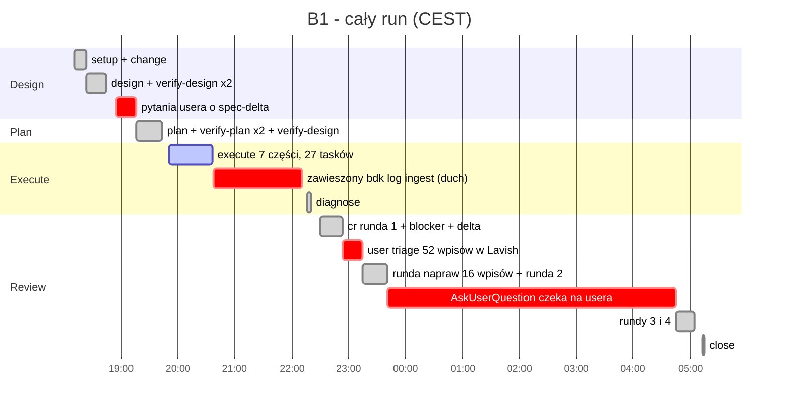
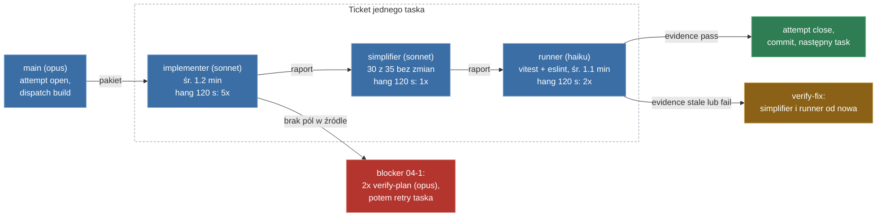
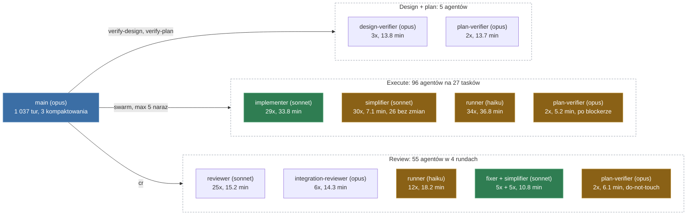
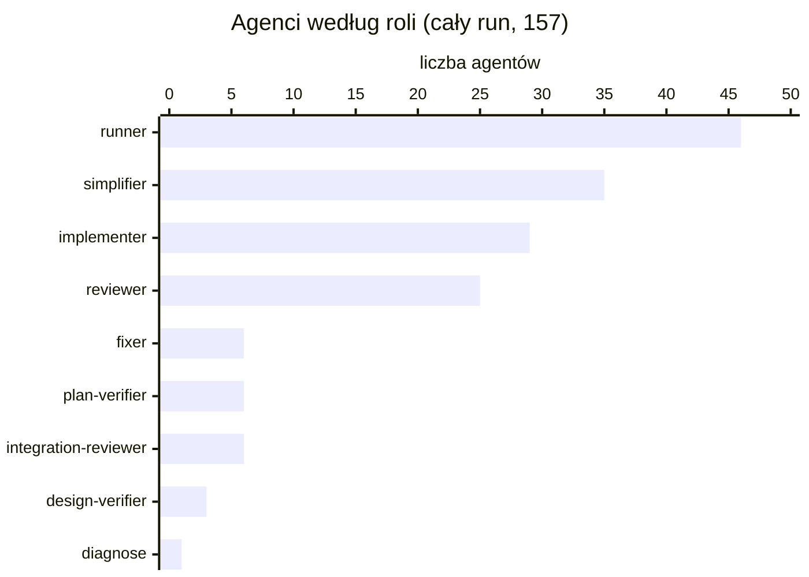
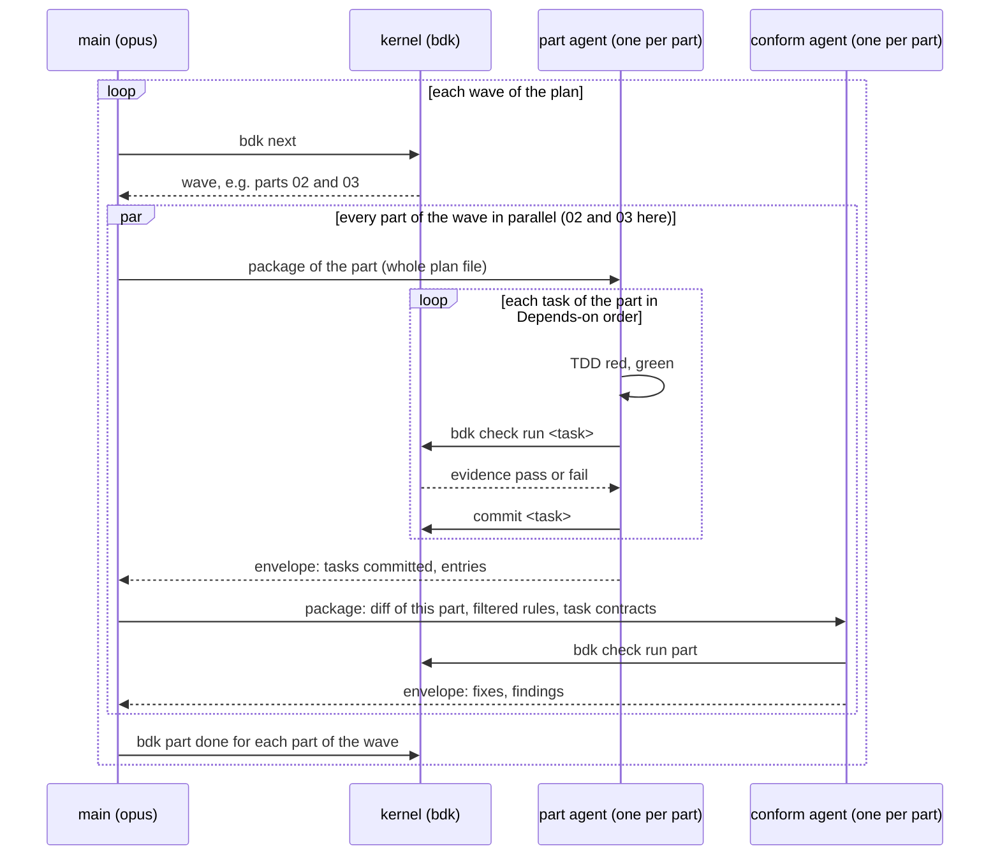

# Raport runu: 2026-10-06-b1-repository-bootstrap-harness

Źródła: `.bdk/changes/archive/2026-10-06-b1-repository-bootstrap-harness/log/` (229 wpisów), git log gałęzi `b01-bootstrap-harness`, transkrypt sesji `f1aa07bd` i 156 transkryptów subagentów. Czas lokalny (CEST).

## Liczby

| | |
|---|---|
| Wall clock całego runu | 18:11 - 05:14, **11 h 03 min** |
| Praca maszyny (bez czekania na usera) | około **3 h** |
| Execute (od `/bdk:execute` do raportu "Execute skończony") | 19:50:51 - 20:38:07, **47 min** |
| Pliki produktu | 62 pliki (bez lockfile), 5 924 linie; razem z `.bdk/` 634 pliki |
| Subagenci | 156: execute 96, review 55, design/plan 5 (+1 diagnose) |
| Główny wątek (opus) | 1 037 tur, 199 M tokenów cache-read, 3 kompaktowania kontekstu |
| Komendy zawieszone na 120 s (timeout Bash) | 14 w całym runie, 8 w execute |

## Oś czasu całego runu

Czerwone paski to czekanie, nie praca: razem około 7 h 20 min z 11 h.

## Przepływ execute (jeden task)

## Jacy subagenci byli odpalani

Zielone węzły piszą kod produktu. Żółte to role, które w tym runie w większości powtarzały pracę albo robiły coś, co mogłaby zrobić deterministyczna komenda. Pozostałe weryfikują.

| Rola | Model | Agentów | Agent-min | Cache-read | Uwagi |
|---|---|---|---|---|---|
| main | opus | 1 | cały run | 199 M | 1 037 tur, 3 kompaktowania |
| runner | haiku | 46 | 55 | 29.4 M | odpala `vitest` i `eslint`, które trwają sekundy |
| simplifier | sonnet | 35 | 11 | 3.9 M | 30 bez żadnej zmiany |
| implementer | sonnet | 29 | 34 | 11.8 M | 27 tasków, 2 retry |
| reviewer | sonnet | 25 | 15 | 6.6 M | jeden na grupę części w każdej rundzie |
| plan-verifier | opus | 6 | 25 | 27.7 M | 2 przed execute, 2 po blockerze 04-1, 2 tylko dla `do-not-touch` |
| integration-reviewer | opus | 6 | 14 | 10.3 M | złapał jedyny blocker produktu (L-dzhorbso) |
| fixer | sonnet | 6 | 7 | 3.5 M | naprawy z review |
| design-verifier | opus | 3 | 14 | 10.0 M | złapał fałszywe twierdzenie o kodzie |
| diagnose | opus | 1 | 4 | 1.9 M | |

Wnioski:

- **Tylko 35 ze 157 agentów (22%) pisze kod** (implementer i fixer). Pozostałe 122 to weryfikacja i ceremonia.
- **81 agentów (52%) to runner i simplifier.** Runner robi pracę deterministyczną, a simplifier w 86% przypadków nic nie zmienia. Odpowiadają za to `skills/stages/execute` (sekcja "Flat": `steps` po każdym tasku), kernel `bdk attempt open` (każdy ticket dostaje `simplify`, `tests-scoped`, `lint`) i `bdk:cr` (gate runner w każdej rundzie).
- **Na task przypada 3.5 agenta w execute**, a każdy z nich to zimny start, czytanie pakietu z 51 regułami, `bdk rules show` i `bdk log ingest`. Do tego co najmniej 4 tury maina na task.
- **Opus weryfikuje dużo, ale trafnie.** 15 agentów opus zużyło około 50 M cache-read. design-verifier, plan-verifier przed execute i integration-reviewer znalazły wszystkie istotne defekty. Natomiast 4 z 6 plan-verifierów to koszt naprawiania wcześniejszych błędów procesu: pakiet bez źródła (2) i `do-not-touch` w review (2).
- **Main jest najdroższym "agentem":** 199 M cache-read, więcej niż wszyscy subagenci razem (około 106 M). Każde powiadomienie subagenta budzi opus z pełnym kontekstem. Mniej subagentów oznacza mniej tur maina, więc oszczędność mnoży się dwa razy.
- **Review uruchamia pełną deltę w każdej rundzie:** rundy 3 i 4 to 2 i 1 drobne wpisy, ale każda odpaliła gate runner, integration-reviewer i reviewery grup (`bdk:cr`).

## Execute: gdzie poszło 47 minut

| Odcinek | Czas | Co się działo |
|---|---|---|
| Część 01 | 19:50 - 19:54, 3.5 min | 01-3 lint fail na `.gitignore` (prettier bez `--ignore-unknown`), redispatch runnera |
| Części 02 + 03 | 19:54 - 20:03, 8.8 min | 4 hangi po 120 s (02-2 `find /`, 03-1 implementer, 03-1 runner, 03-4 simplifier); 4 runnery powtórzone przez stale evidence i wspólne pliki checków |
| Część 04 | 20:03 - 20:18, 15 min | 04-1 blocker (SeriesPlan, `expandTests`), 2 rundy verify-plan (opus, 5.3 min), retry 04-1; 04-3 `find /`, 04-4 hang |
| Część 05 | 20:18 - 20:24, 5.7 min | 05-2 hang 120 s (`cat > /tmp/r.md` bez wejścia) |
| Część 06 | 20:24 - 20:27, 3.3 min | czysto |
| Część 07 | 20:27 - 20:31, 4.3 min | 07-2 odpalił płatny `pnpm bench smoke --probe` 2x bez zgody; 07-4 redispatch |
| verify-fix 01, 01, 02 | 20:31 - 20:38, 6.2 min | evidence nagrane na starszym drzewie; runner 02 znów hang 120 s |

Szacunek ścieżki krytycznej: około 10 min to hangi, około 8 min blocker planu, około 6 min verify-fix po stale evidence. Pozostaje około 23 min, z czego większość to narzut potoku 3 agentów na task.

## Dlaczego execute wyglądał na "kilka godzin"

1. **Sam execute trwał 47 min**, raport "Execute skończony" przyszedł o 20:38.
2. **Duch od 20:38 do 22:14.** Runner części 02 wywołał `cat /tmp/lint-report.txt | cd /Users/broneq/projects/bdk-bench && bdk log ingest ...`. Pipe idzie do `cd`, a `bdk log ingest` czyta stdin dziedziczony bez EOF i wisi w nieskończoność. Proces (PID 65097) żył 93 min, UI pokazywało działający shell i subagenta. Nic nie pracowało. Zabity dopiero na pytanie "ja widzę, że shell jakiś chodzi".
3. **Spóźnione powiadomienia** implementerów 02-2 (20:57) i 04-3 (20:54) z `find / -name series.ts`, który skanował cały dysk przez około godzinę.
4. Cały run to 11 h, ale około 7 h 20 min to czekanie na usera (w tym 5 h 04 min nocnego `AskUserQuestion`).

Mimo to 47 min na 62 pliki skopiowane ze znanego źródła to za dużo. Szacunek dla proponowanego modelu jest w sekcji "Proponowany model execute".

## Co działa dobrze

- **Bramki design i plan łapią prawdziwe defekty.** design-verifier znalazł fałszywe twierdzenie o kodzie (L-fw9ettz8: `main.ts` statycznie importuje suite), verify-plan znalazł zadania bez właściciela (L-yy53yb9x). Skille: `bdk:verify-design` (`skills/roles/design-verifier`), `bdk:verify-plan` (`skills/roles/verifier`).
- **Implementer zatrzymuje się na defekcie planu** zamiast łamać `do-not-touch` (L-fgzdjjq2 w 04-1), a main naprawia plan decyzją i rundą weryfikacji. Skille: `skills/roles/implementer`, `skills/stages/execute` (tabela statusów).
- **Kernel odrzuca stale evidence**: żaden task nie zamknął się na dowodzie starszym niż kod. Kernel `bdk evidence record` / `bdk attempt close`.
- **Integration review w `/bdk:cr` złapał blocker, którego 27 zielonych tasków nie widziało**: L-dzhorbso, wyrenderowane configi omijają `harness/provider.ts`, więc żaden smoke run nie dostaje swojego wiersza. Skill: `bdk:cr` (`skills/tools/cr`, rola `skills/roles/integration-reviewer`).
- **Triage review w Lavish**: 52 wpisy rozstrzygnięte jedną stroną zamiast 13 serii pytań. Skill: `bdk:cr`.
- **Równoległość fal**: 5 agentów naraz, części 02 i 03 razem. Skill: `bdk:swarm`.
- **`bdk:close`**: dry-run, archiwum, merge spec-delta `bench-runner` i commit w 6 s.

## Co działa źle

### 1. Komendy, które wiszą na stdin (największy pojedynczy koszt czasu)

- **Co:** 14 komend na timeoucie 120 s w całym runie, 8 w execute. Wzorce: `cat X | cd dir && bdk log ingest` (6x, runnery haiku), `cat > /tmp/r.md 2>/dev/null;` bez wejścia (2x), heredoc + `bdk log ingest < $R` (4x), `find /` (2x).
- **Koszt:** około 10 min ścieżki krytycznej execute, 93 min ducha po execute, dezorientacja usera.
- **Odpowiedzialne:**
  - kernel `bdk log ingest`: czyta stdin bez sprawdzenia, czy stdin to TTY albo pipe, i bez timeoutu. Powinien przyjmować `--file <path>` i odmawiać przy pustym stdin.
  - `skills/roles/runner/SKILL.md`, `skills/roles/implementer/SKILL.md:46`, `skills/roles/simplifier`, `skills/roles/reviewer`, `skills/roles/design-verifier/SKILL.md:50`: "Pipe the full report to `bdk log ingest`" zostawia składanie shella modelowi. Haiku składa to źle. Rola powinna podawać jedną dokładną formę: `bdk log ingest --ticket <t> --file <path>`.

### 2. Pakiet dispatch gubi kontekst części

- **Co:** linia z nagłówka części 02 "Source of every copied file: `git -C /Users/broneq/projects/bdk show 825455dd:evals/harness/<name>.ts`" nie trafiła do pakietu taska 02-2. Implementer szukał źródła `find /` (hang), a potem przeczytał `~/projects/bdk/evals/harness/series.ts` z working tree na `staging/v3`, czyli wersję T40.
- **Koszt:** dryf `expandTests` i `SeriesPlan` (L-fgzdjjq2, L-edh9mnuy), blocker 04-1, 2 dodatkowe rundy verify-plan opus, retry 04-1, około 8 min execute. Ten sam brak dotyczył 04-3 (`find / -name providers.ts`).
- **Odpowiedzialne:** kernel `bdk dispatch build` (szablon pakietu implementera: wkleja blok taska, pomija preambułę części). Do tego `bdk:plan`: zasady wspólne dla części powinny być w każdym tasku albo w polu, które szablon kopiuje.

### 3. Potok 3 agentów na task jest za ciężki

- **Co:** każdy task to implementer, simplifier, runner, każdy z zimnym startem, czytaniem pakietu, `bdk rules show` (51 reguł w każdym pakiecie) i `bdk log ingest`. W execute 96 agentów na 27 tasków.
  - Simplifier: 35 wywołań w całym runie, **30 bez żadnej zmiany**.
  - Runner (haiku): 34 agentów w execute, średnio 1.1 min i 670 k tokenów cache-read, żeby odpalić `vitest` i `eslint`, które trwają sekundy.
  - Main (opus) robi między agentami po 3-6 wywołań `bdk` (attempt open, dispatch build, attempt close, commit), 1 037 tur w sesji i 3 kompaktowania kontekstu (19:20, 20:23, 23:15).
- **Odpowiedzialne:** `skills/stages/execute/SKILL.md` (sekcja "Flat": implementer, potem `steps` pod tym samym ticketem), `bdk:swarm`, kernel (`attempt open` zwraca `steps: simplify, tests-scoped, lint` dla każdego taska).
- **Kierunek:** runner jako deterministyczna komenda kernela (`bdk check run <ticket>` zapisuje output i evidence bez LLM); simplifier raz na część albo tylko przy diffie powyżej progu; implementer kończy task własnym `bdk check run`.

### 4. Wspólne drzewo i wspólne pliki checków przy równoległych taskach

- **Co:** runnery równoległych tasków pisały do tych samych `.bdk/.machine/checks/tests-scoped.txt` i `lint.txt`; runner weryfikował drzewo, w którym inny implementer jeszcze edytował.
- **Koszt:** 26 odmów missing-citation, evidence co najmniej 6 ticketów cytuje cudzy run, 4 powtórzone runnery, verify-fix części 01 (2x) i 02 na końcu, około 6 min.
- **Odpowiedzialne:** `skills/roles/runner/SKILL.md:25-27` (generyczna ścieżka `.bdk/.machine/checks/tests.txt`), kernel `bdk evidence record` (nie sprawdza, że plik należy do ticketu), `skills/stages/execute/SKILL.md` ("Parts share one working tree", brak bariery między implementerem a runnerem).

### 5. Acceptance planu odpaliło płatne komendy

- **Co:** 07-2 acceptance "uruchom każdą komendę `pnpm bench` oprócz tych z credentials"; implementer odpalił `pnpm bench smoke --probe` 2x bez zgody, ledger zarezerwował 2 x 15 USD.
- **Odpowiedzialne:** `bdk:plan` (acceptance przez wykluczenie zamiast listy komend), `bdk:verify-plan` (`skills/roles/verifier`: L-zfku9tci zgłoszony jako finding, nie blocker), `skills/roles/implementer` (brak reguły "nie uruchamiaj kosztownych komend bez decyzji w ledgerze"). Narusza też CLAUDE.md "Cost".

### 6. `do-not-touch` z planu blokuje naprawy z review

- **Co:** naprawy review dotykały plików z `do-not-touch` części. Trzy edycje planu (L-geqc05p3, L-b4ha6o0l, L-rsuxpabu) i 2 rundy verify-plan opus w środku review, tylko żeby poluzować listy.
- **Koszt:** około 10 min i pytania do usera.
- **Odpowiedzialne:** `bdk:cr` (`skills/tools/cr`) i kernel: `do-not-touch` ma sens w execute, w review powinien wygasać.

### 7. Review: dużo rund na drobne wpisy

- **Co:** 7 ticketów review w 4 rundach, 55 agentów (25 reviewerów sonnet, 8 integration-reviewerów opus, 12 runnerów, 10 workerów). Rundy 3 i 4 to 2 + 1 wpisy `should-fix` i `nice-to-have`.
- **Odpowiedzialne:** `bdk:cr` (każda runda napraw uruchamia pełną deltę: gate runner, integration review, reviewer na grupę).

### 8. Pytanie bez odpowiedzi blokuje cały run

- **Co:** `AskUserQuestion` o 23:41 czekał 5 h 04 min; wpisy były `should-fix` i `nice-to-have`, bez blockera.
- **Odpowiedzialne:** `bdk:cr` (decision tier). Wpisy bez blockera mogą dostać domyślną dyspozycję (`defer`) i run idzie dalej do close; user decyduje w PR.

### 9. Mniejsze

- `bdk:setup`: scoped prettier bez `--ignore-unknown` i eslint bez `--no-warn-ignored` (2 redispatche, poprawione dopiero w verify-fix).
- `bdk:diagnose`: transkrypt bieżącej sesji raportowany jako `missing`, brak tokenów i kosztu (poprzedni raport `.bdk/.machine/diagnostics/...f1aa07bd...md`).
- `bdk log add`: 8 odmów za długie summary; limit nie jest podany w rolach.
- `bdk:close`: archiwum zmiany to 570 plików w repo (issue już założone).
- `bdk:design`: pytania usera "dlaczego change.md jest pusty" i "kiedy powstaje spec-delta" (21 min) pokazują, że stage nie mówi, co tworzy i kiedy (issue już założone).

### 10. Lead nie uruchomił się ani razu

- **Co:** wszystkie 7 części poszły w trybie `flat`, więc main (opus) sam rozsyłał 96 agentów i budził się po każdym z nich.
- **Przyczyna 1, profil:** kernel daje `tree` tylko Change o profilu `large` (`kernel/src/graph/domain/wave.ts:98`: `profile === "large" && tree.enabled && fresh >= min-parts`). Ten Change ma `profile: small` z domyślnej wartości (L-5pya8uu5: "the caller passed no --profile"). `skills/stages/change/SKILL.md:39` opisuje tylko `small` i `tiny`, o `large` nie wspomina. Nic później nie podnosi profilu, choć plan urósł do 7 części, 27 tasków i 62 plików: ani `bdk:plan`, ani `verify-plan` nie zapisują decyzji `profile`, a kernel by ją uwzględnił (`change/domain/change.ts:150`: profil to największy z `change.md` i decyzji `profile`).
- **Przyczyna 2, kształt planu:** części tworzą łańcuch 01 → (02, 03) → 04 → 05 → 06 → 07. Przy `min-parts: 2` nawet profil `large` dałby `tree` tylko fali 2 (02 i 03). Pozostałe fale mają po jednej części.
- **Koszt:** cały ruch idzie przez opus maina: 1 037 tur, 199 M cache-read, 3 kompaktowania.
- **Uruchomienie leada nie byłoby jednak poprawką.** Lead też rozsyła subagenta per task (patrz punkt 12), więc zdjąłby tury z maina, ale nie zmniejszyłby liczby agentów.
- **Odpowiedzialne:** `bdk:change` (brak `large` w wyborze profilu), `bdk:plan` i `bdk:verify-plan` (brak podniesienia profilu po rozmiarze planu), kernel `executeWave` (`tree` zależy od profilu i liczby równoległych części). Właściwa poprawka jest w sekcji "Proponowany model execute".

### 11. Simplifier upraszcza, ale nie sprawdza reguł

- **Co:** simplifier wczytuje wszystkie 51 reguł (`bdk rules show --ticket`, krok 2 w `skills/roles/simplifier/SKILL.md`), ale jego "Work" zleca tylko uproszczenie diffu. 30 z 35 wywołań nic nie zmieniło. Naruszenia reguł widoczne w diffie jednego taska wyszły dopiero w `/bdk:cr`, każde za cenę rundy napraw (fixer, simplifier, runner, delta review) i poluzowania `do-not-touch`.
- **Przykłady z review, do wyłapania przy tasku:**
  - BDK-TQ-1: testy, które nie mogą się wywalić (asercja z OR w teście probe, guard `cacheHome` zależny od puli forków vitesta, test "without an injected fallback");
  - BDK-CQ-4, BDK-CQ-7: funkcje bez testów (`stats.ts` format*, `tools.ts` evaluate/view, `smokeRunner.check()`, `loadSuiteHooks`, `RunProvider`), komentarze, które opisują kod krok po kroku w `tree.test.ts`;
  - BDK-ARCH-5 w obrębie taska: smoke runner definiuje własny `resultsFile` zamiast użyć helpera z `paths.ts`;
  - reguły projektu (CLAUDE.md): komentarz w `judge.ts` z wewnętrzną proweniencją BDK ("M1 judgements");
  - kontrakt taska z planu: zmieniona sygnatura `resultsFile`, `perCell` zamiast `perWorkflow`.
- **Propozycja:** simplifier znajduje i poprawia też naruszenia reguł.
  - Wejście: diff, reguły odfiltrowane do dotkniętych plików i języków (nie wszystkie 51), reguły projektu (`.claude/rules`, CLAUDE.md), kontrakt taska z planu.
  - Praca: dla każdej reguły odpowiedź tak lub nie z cytatem `file:line` przy naruszeniu. Poprawia to, co mieści się w jego kontrakcie (uproszczenie, nazwy, komentarze, brakujący test, użycie istniejącego helpera).
  - To, czego nie wolno mu ruszyć (zmiana zachowania, plik spoza `Files:`), zapisuje jako `finding` z identyfikatorem reguły do poprawy przed zamknięciem części.
  - Poza zakresem: naruszenia, które wymagają widoku na kilka części (np. katalog raw serii wyliczany w smoke suite i w regrade w `main.ts`), zostają w integration review. To, co da się sprawdzić deterministycznie (identyfikatory BDK w komentarzach, `Date.now()` w nazwach katalogów tymczasowych), idzie do lintu przez `/bdk:add-rule`.
- **Odpowiedzialne:** `skills/roles/simplifier` (kontrakt "Work"), kernel `bdk dispatch build` (filtrowanie reguł do plików taska), `skills/stages/execute` (krok uruchamiany raz na część, patrz "Proponowany model execute").

### 12. Subagent per task, w trybie flat i w trybie lead

- **Zasada, którą trzeba wprowadzić:** nigdy nie uruchamiamy subagenta per task. Jednostką pracy agenta jest część planu, czyli jeden fizyczny plik `plan/parts/NN-*.md`.
- **Tryb flat (ten run):** main otwiera ticket per task i rozsyła per task implementera, simplifiera i runnera (`skills/stages/execute/SKILL.md`, sekcja "Flat"). W B1 dało to 96 agentów na 27 tasków.
- **Tryb tree (lead) działa źle tak samo.** Lead nie wykonuje części, tylko ją rozsyła: `skills/roles/lead/SKILL.md` każe mu dla każdego gotowego taska zrobić `bdk attempt open task-redispatch <task>`, `bdk dispatch build <task> implementer <ticket>` i `Agent`, a potem rozesłać `steps` ticketu (simplifier, runner) pod tym samym ticketem. Lead to więc dodatkowa warstwa nad tym samym potokiem 3 agentów na task: liczba agentów rośnie o 1 na część, a koszty zimnego startu, `bdk rules show` i `bdk log ingest` per task zostają.
- **Skutki per task:** zimny start każdego agenta, 51 reguł w każdym pakiecie, preambuła części gubiona w pakiecie taska (blocker 04-1), runnery i implementery mijające się we wspólnym drzewie (stale evidence), main lub lead budzony po każdym agencie.
- **Odpowiedzialne:** `skills/stages/execute` (sekcje "Flat" i "Tree"), `skills/roles/lead`, `bdk:swarm`, kernel `bdk attempt open` (ticket i `steps` per task) i `bdk dispatch build` (pakiet per task).

## Proponowany model execute

**Zasada:** jeden subagent na jedną część planu (jeden plik `plan/parts/NN-*.md`), nigdy na task. Części jednej fali idą równolegle. Agent widzi tylko swój plik części, więc kontekst jest ograniczony z góry.

**Dlaczego część, a nie fala:** fala może mieć kilka części (w B1 fala 2 to części 02 i 03). Agent na falę miałby w kontekście kilka plików planu i robiłby je po kolei; agent na część daje równoległość i mniejszy kontekst.

**Przebieg:**

1. `bdk next` zwraca falę, np. części 02 i 03.
2. Main uruchamia jednego agenta na każdą część fali, równolegle. Pakiet to cały plik części razem z preambułą (źródło `git -C ... show 825455dd`, zasady kopiowania).
3. Agent części robi taski po kolei, w kolejności `Depends on:`. Po każdym tasku:
   - TDD: test czerwony, potem zielony;
   - `bdk check run <task>`: deterministyczna komenda kernela zamiast agenta runnera; kernel uruchamia testy i lint, zapisuje output per ticket i sam rejestruje evidence;
   - `bdk commit <task>`: commit per task zostaje.
4. Agent wraca z envelope: zakommitowane taski i wpisy w logu.
5. Agent `conform` (simplifier z punktu 11, świeże spojrzenie) dostaje diff części, reguły odfiltrowane do jej plików i kontrakty tasków. Poprawia, co mieści się w kontrakcie, resztę zapisuje jako `finding`, kończy `bdk check run part`.
6. Main: `bdk part done` dla każdej części fali, `bdk next`, następna fala. `conform` działa raz na każdą część, zaraz po jej agencie, a nie raz na falę ani raz na cały execute.

**B1 w tym modelu:** 7 agentów części i 7 agentów `conform`, razem 14 zamiast 96. Main budzi się około 15 razy zamiast kilkuset.

`conform` części 02 musi skończyć przed falą z częścią 04: jego poprawki mogą zmienić pliki, których 04 używa, więc bez osobnego worktree nie może nachodzić na następną falę.

**Wymagane zmiany:**

| Zmiana | Gdzie |
|---|---|
| Ticket i pakiet per część zamiast per task; retry, `narrow` i `escalate` na poziomie części | kernel `bdk attempt open`, `bdk dispatch build` |
| Rola agenta części zamiast leada i implementera per task | `skills/roles/lead` lub nowa rola, `skills/roles/implementer` |
| `bdk check run <task>` i `bdk check run part`: testy i lint uruchamiane przez kernel, output per ticket, evidence bez LLM | kernel, zastępuje `skills/roles/runner` w execute |
| `bdk commit <task>` dozwolony dla agenta części (guardy blokują dziś subagentom git) | kernel `hooks/domain/guards.ts` |
| Krok `conform` raz na część, po commitach jej tasków | `skills/stages/execute`, `skills/roles/simplifier` |
| Tryby flat i tree zastąpione jednym modelem; `tree` przestaje zależeć od `profile: large` | `skills/stages/execute`, kernel `graph/domain/wave.ts` |
| Limit rozmiaru części (np. do 5 tasków i około 10 plików), większą część plan dzieli | `bdk:plan`, `bdk:verify-plan` |

**Ryzyka i odpowiedzi:**

- **Kontekst rośnie z każdym taskiem części:** limit rozmiaru części w planie.
- **Brak równoległości wewnątrz części** (w B1 taski 04-2 do 04-5 szły równolegle): plan może rozbić taką część na dwie części jednej fali.
- **Agent sam sprawdza swoją pracę:** evidence pochodzi z `bdk check run` (kernel, nie relacja agenta), a `conform` jest osobnym agentem.
- **Blocker w połowie części:** agent kończy z listą zakommitowanych tasków, main poprawia plan, nowy agent dostaje tę samą część z gotowymi taskami oznaczonymi jako committed (pakiet leada już to dziś obsługuje).

**Czas dla B1 (szacunek, nie pomiar):** 6 fal, każda około 4-6 min razem z `conform`, czyli około 25-30 min zamiast 47; mniej po usunięciu hangów i blockera 04-1. Główny zysk to nie czas, tylko 14 agentów zamiast 96 i kilkanaście tur maina zamiast kilkuset.

## Co dałoby najwięcej czasu w execute

| Poprawka | Gdzie | Zysk na execute |
|---|---|---|
| `bdk log ingest --file`, odmowa przy stdin bez danych, jedna forma w rolach | kernel + `skills/roles/*` | około 10 min, zero duchów |
| Preambuła części w pakiecie taska | kernel `bdk dispatch build` | około 8 min (brak blockera 04-1) |
| Plik checków per ticket + bariera albo worktree per task | `skills/roles/runner`, `skills/stages/execute`, kernel | około 6 min |
| Agent per część zamiast per task, runner jako `bdk check run`, `conform` raz na część (sekcja "Proponowany model execute") | kernel + `skills/stages/execute` + `skills/roles/*` | 14 agentów zamiast 96, kilkanaście tur maina zamiast kilkuset |

Czas execute: około 25-30 min w nowym modelu (szacunek), mniej po usunięciu hangów i blockera planu.
