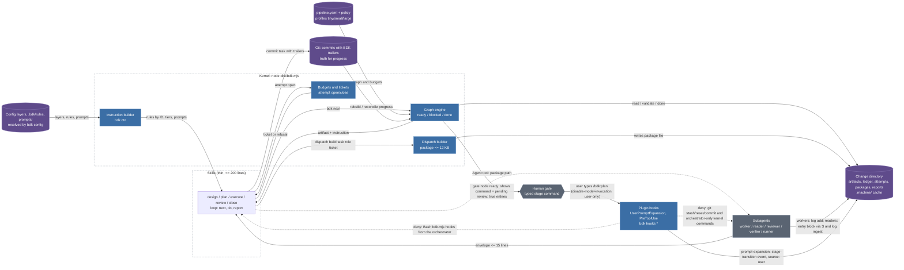
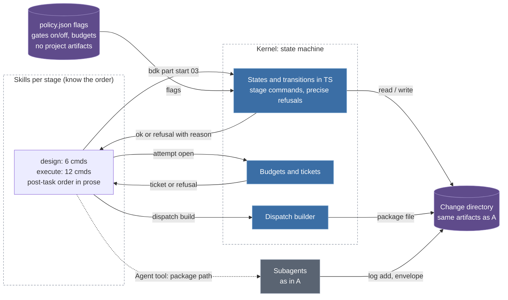
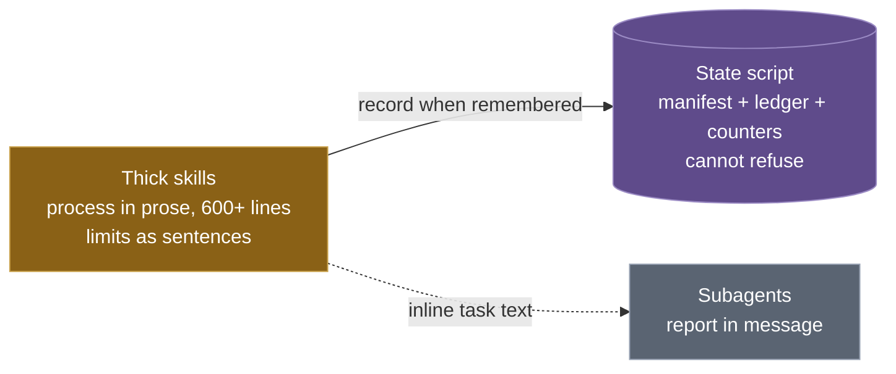
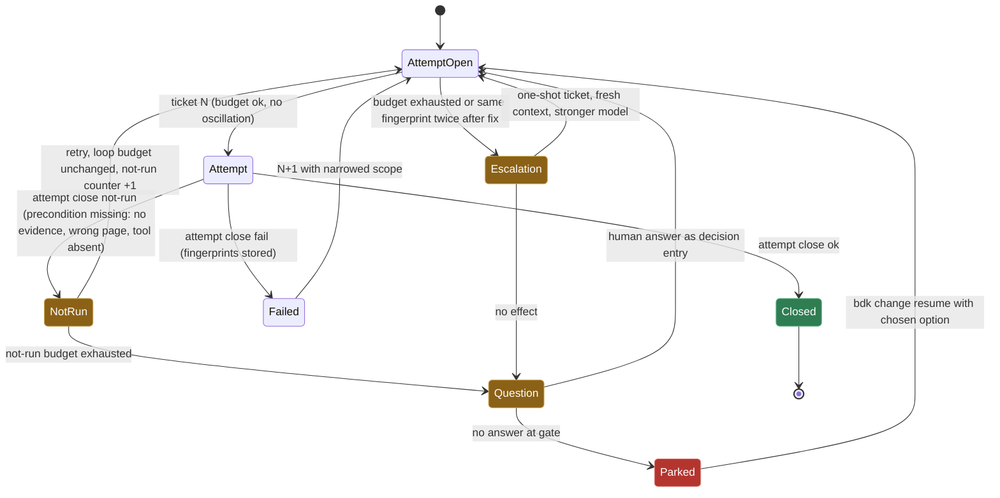

# BDK v3 - Change-centric architecture - Design

**Date**: 2026-09-23
**Status**: Approved (design), verifier PASS_WITH_WARNINGS accepted by user 2026-09-23; TSH revision (T1-T6, P1-P11) decided 2026-09-24, formal approval removed on page 08, verifier PASS at iteration 3 (2026-09-24)
**Branch**: Combined
**Authors**: Claude + User

> Design doc only. To translate into an implementation plan, run `/bdk:create-plan`. To formalize a single decision from this doc, run `/bdk:create-adr`.

All decisions below were taken in Lavish review sessions (`.lavish/bdk-v3-design-01..08-*.html`). Decision IDs (D1-D5, S1-S8, Q1-Q5, K1-K4, A-*, R-*, and the TSH revision T1-T6 / P1-P11 from pages 06-08) refer to those pages and to the decision register `.bdk/design/2026-09-23-0703-bdk-v3-decisions.md`, written together with this document. **Tracking status (V2-5):** this repository's `.gitignore` lists `/.bdk/` and `/.lavish/` (the `ensure_ignored()` defect named below) and `/bdk:setup` tells users to ignore `.bdk/design/`, so today neither document nor the review pages are tracked. Where design documents live in v3 (tracked `.bdk/changes/<id>/design.md` per D2b, with `.bdk/.machine/` and `settings.local.yaml` as the only ignored paths) is part of this design; the user decided at the Phase 3 gate to leave these v2-era files untracked until the v3 Change itself moves design documents into tracked Change directories (V-tracking). Items marked **V1-n** were raised by the design verifier in iteration 1 and resolved in iteration 2.

---

## Problem

BDK v2 keeps run state only for plan execution, enforces loop caps only in prose, loses the *why* between design and final review, has five prompt-injection scripts and one settings reader with no layering, and produces plans of ~50 KB (`05-workflows.md` 50 725 B, parent plan 38 947 B with 11 tasks) that a fresh agent cannot hold. The `sdd-analysis` report (external repository `~/projects/sdd-analysis`, file `docs/bdk-raport-koncowy.md`, 64.5 KB, not part of this repo) documents these failures and proposes principles (script computes / model decides, A3 mechanical skill tests, A11 15-line reports, B7-B10 config layering, C1-C6 spec handling). v3 is a breaking redesign around one durable object, the **Change**, with a Node kernel that owns every state transition.

**TSH revision (2026-09-24).** The analysis of The Software House Copilot Collections (`~/projects/sdd-analysis/docs/analiza/12-copilot-collections.md`) showed a mature process whose guarantees live almost entirely in prose and whose authors admit it: a Human Approval protocol repeated in 186 places and rewritten five times in two weeks, model-written timestamps validated by another model, a plan reviewer that only converged after a closed blocker list, and a UI verification contract stronger than anything BDK has. The first draft of this design repeated three of those weaknesses without noticing (gate passes on a model-written approval entry, K2 forces Bash onto read-only agents, verifiers have no closed blocker list) and did not address two gaps at all (working-tree safety with 15 agents in one tree, UI verification). Sections marked **T1-T6** and **P1-P11** carry the corrections; the control question from the aggregate report applies to each: *what happens when the model ignores the instruction?* If the failure is silent, the item needs a gate in code, not a sentence.

**In scope:**
- Change as the central object: intent, decision ledger, design, plan-part graph, attempts, review, spec delta, archive
- Node/TypeScript kernel (single committed ESM bundle) with a first-class CLI contract
- Data-driven artifact graph (`pipeline.yaml`) with typed artifact kinds in code
- Loop protection: budgets, oscillation detection, narrowing, escalation ladder
- Inter-agent communication via ledger entries and file-based dispatch packages
- Layered configuration (4 layers, YAML + Markdown prompt files, JSON Schema for IDEs)
- Rules with stable IDs; OpenSpec-style behavioural spec with deterministic merge
- Skill inventory reduction (marked PoC / TODO)
- TSH revision: human-gate provenance (T1), agent write channel without new privileges (T2), working-tree guard for subagents (T3), verification-evidence primitives and a `not-run` outcome (T4, P4, P5), closed blocker lists for verifiers (P8), plan scope fields checked by diff (P6, P7), kernel-stamped provenance and hash-bound verdicts (P1, P2), reviewer-is-not-authorizer (P3), orchestrator without edit tools (P9), package version markers (P10), generated agent tables (P11), rule measurement before IDs (T5)
- Hard v2 to v3 cut with one-shot import
- Testing: `node --test` for kernel and E2E on a fixture repo, promptfoo for skill-behaviour evals

**Out of scope:**
- `/bdk:cr` and `/bdk:pr-review` internals (user: "review is a separate category of problem"); they only gain the dispatch package as input
- Multi-writer conflict resolution on one Change (Q2b: "format yes, functions no")
- Dolt or any external database (R-store)
- Hosts other than Claude Code (Q4)
- Future modules: design assistance, artifact search, pattern recognition, global finding discovery (R-store note), and `ui-verify` (T4: the first module after the kernel, its own Change). The design must not fight them; it does not build them. For `ui-verify` it ships the three primitives it needs (evidence manifest, `not-run` outcome, citation validator) and nothing UI-specific.

---

## Existing Codebase Context

From Phase 0 exploration and direct reads (`scripts/`, `skills/`, `agents/`, `fragments/`, `hooks/`, `tests/`).

- **Already present:** `scripts/bdk_run_state.py` (39.4 KB; manifest `.bdk/runs/<plan>--<branch>.json` as cache, git trailers `BDK-Run`/`BDK-Group` as truth, `reconcile()`, `rebuild`, `deferred_findings` with dedupe key `(severity, category, file, symbol|line, problem)`, Refusal mechanism, 18 subcommands); YAML return envelope (`status, files_changed, concerns, needs, blocker`) preloaded via `skills/bdk-implementer-return-contract` from `skills/subagent-execute-plan/references/return-contract.md`; `scripts/inject.py` (conditional fragments and tool-tier chains against `features.*`), `scripts/inject-rules.py`, `scripts/inject-language-rules.py`, `scripts/get_settings.py` (tools tiers full/scoped/related/failed/incremental), `scripts/render_startup.py`; 13 meta-skills (`bdk-tier-*`, `bdk-rules-*`, `bdk-lint-tools`, `bdk-test-tools`, `bdk-implementer-return-contract`) preloaded through agent `skills:` frontmatter; 13 agents; `fragments/tool-tiers/*.chain.json` exclusive/additive chains; `rules/*.md` bullet lists without IDs; `tests/unit/` 5 442 lines pytest; `tests/evals/` LLM-graded skill evals; stdlib-only Python, `requires-python >= 3.12`; MCP servers via `uvx`.
- **Closest existing abstraction:** `bdk_run_state.py` is the seed of the kernel: manifest-as-cache, trailers-as-truth, Refusal, `deferred_findings` (becomes the `finding` ledger entry type), `rebuild` (becomes mandatory fail-closed recovery). The YAML envelope becomes the v3 envelope with `ticket` and `log` fields.
- **Hooks today (all `python3`, V1-1):** `hooks/hooks.json` SessionStart runs six commands (`scripts/render_startup.py`, a `uvx` presence warning, `uvx code-review-graph status`, `hooks/check-rules-drift/check.py --snapshot-baseline`, `hooks/check-bdk-config/check.py` which validates `.bdk/settings.json` against `hooks/check-bdk-config/settings.schema.json`, `hooks/register-graph-repo/register.py`); Stop runs `check-rules-drift/check.py` and `uvx code-review-graph update`. Skill-frontmatter hooks: `commit` (`UserPromptSubmit`, `hooks/is-skill-exist/check.py caveman-commit`), `create-plan` (`UserPromptSubmit`, plain `mkdir -p .bdk/plans`), `update-docs` and `explain-complex-code` (`Stop` hooks of type `prompt`, no script). `hooks/is-command-exists/check.py` is referenced by no skill. Every one of these is a v3 kernel subcommand or a plain shell line (see "Hooks" below); `python3` disappears from the plugin.
- **Closest existing neighbours the design absorbs (V1-2):** `check-bdk-config/settings.schema.json` (hand-written JSON Schema, today's only schema) is superseded by the JSON Schema exported from the kernel's zod registry; `check-rules-drift` (rule-file drift snapshot at SessionStart, check at Stop) is superseded by `bdk rules check` plus the drift snapshot inside `bdk hooks session-start`/`stop`. There is one schema source in v3, and the migration plan must delete the old file in the same release.
- **Integration points:** `!` blocks in `SKILL.md` (host drops output and inserts a placeholder when the command exits non-zero, verified live on Claude Code 2.1.280, `scratchpad/bang-test/`); `hooks/hooks.json` SessionStart (renders STARTUP), the `PreToolUse` event (new: spec-dir guard, git guard, kernel-command guard) and the `UserPromptExpansion` event (new: user-typed stage transitions, T1); agent `skills:` frontmatter (plugin agents ignore `hooks`, `mcpServers`, `permissionMode`); `.mcp.json` for serena and code-review-graph; commit trailers.
- **Conventions to follow:** Refusal-with-instead pattern; trailers as source of truth; fragment chain semantics (exclusive vs additive, fallback guarded by `prefer`); `mcp__plugin_bdk_<server>__<tool>` naming; Mermaid palette from `/bdk:mermaid-drawer`; verification scoping (source vs non-executable); git-identity ADR 0001 rules 1-16 except rule 9 (D5).
- **TSH revision grounding (2026-09-24, direct reads):** 7 of 13 agents have read-only core tools (architecture-reviewer, dead-code-detector, design-verifier, duplicate-detector, log-analyzer, plan-verifier, web-researcher); code-reviewer, explorer, test-runner, implementer and fixer have Bash; static-analyse has no `tools:` field (all tools). implementer and fixer carry no prohibition of destructive git commands; the only protection is the clean-tree check at run start (`skills/subagent-execute-plan/SKILL.md:88`); no `PreToolUse` hook exists anywhere in the plugin. Plan verification `stale` and `missing` "warn and continue" (`:101`); there is no approval record, the human is the gate only by launching each stage skill. `plan-verifier` has partial exclusions (padding for `Verification: none`, decision gates in tasks) but no closed non-blocker list; `design-verifier` has none; `verify-plan` caps at 2 iterations; attempt outcomes are binary. The plan template has `Goal` and per-task `Success criterion` but no do-not-touch, stop rule, Definition of Done rule or placeholder ban. No UI verification exists (playwright appears only as a test-runner name in setup). Rules: 9 files, 182 lines, 162 bullets, no sources or verification dates. **Drift found:** the hand-written agents table in `STARTUP_INSTRUCTIONS.md` omits `bdk:design-verifier` and no test guards the table (T6: fixed in v3 only, by generation).
- **Host facts verified against the raw Claude Code docs (`hooks.md`, `skills.md`, downloaded 2026-09-24):** `UserPromptExpansion` fires only for commands the user types ("a PreToolUse hook matching the Skill tool fires only when Claude calls the tool, but typing /skillname directly bypasses PreToolUse. UserPromptExpansion fires on that direct path"); its input carries `command_name`, `command_args`, `command_source` (`plugin`) and `prompt`, and it can return `decision: "block"` with a `reason` shown to the user. Hook input inside a subagent carries `agent_id` and `agent_type`; the main thread has neither. `PreToolUse` decisions are `allow | deny | ask | defer`; the `deny` reason goes to Claude, the `ask` reason to the user, and `ask` forces a prompt even in auto mode with a `[plugin:<name>]` label. Skill frontmatter `disallowed-tools` removes tools from the pool while the skill is active and clears on the user's next message. `SubagentHandback` (the tool that carries a subagent report since v2.1.271) exists only in auto mode. Re-read live on 2026-09-24 at the user's request (https://code.claude.com/docs/en/hooks#userpromptexpansion, byte-identical to the downloaded copy): the doc's own example is a **plugin** command (`command_source: "plugin"`) with a bare `command_name` (`example-skill`), so plugin skills do pass through the event and the expected matcher for BDK is `plan|execute|close`; the doc's first use case is exactly the gate pattern ("a hook matching `deploy` can block `/deploy` unless an approval file is present"); "a hook that blocks by exiting 2 routes the same way as `reason`: the block message shows the stderr text to the user", so the fail-closed exit 2 is documented; plain-text stdout of this event is added as context Claude can see, so the hook can also emit the gate status for the model; a block ends the turn with the reason as a warning line regardless of `continue`. Still not documented: whether the user's `!` bash-mode commands pass `PreToolUse`.
- **Defects found on the way (to fix in v3, tracked as side items):** `ensure_ignored()` writes `/.bdk/` while setup asks to commit `settings.json`; `features.caveman` collected but read by nothing (issue #39); branches `fix/38`, `fix/39` unmerged; leftover `__pycache__` in `skills/execute-plan`, `skills/create-fixture` (both skills already have no `SKILL.md`; only residue remains) and `skills/refine-rules/scripts`. `skill-lint` and `agent-lint` live in `.claude/skills/` (dev-time, not shipped) and are not part of the user inventory. `agents/web-researcher.md` has no `skills:` preload today.

---

## Users & Personas

| Persona | Trigger | Context | Success looks like |
|---|---|---|---|
| Rules owner (tech lead) | Recurring review findings, new project convention | Owns `.bdk/rules/`, `.bdk/settings.yaml`, policy gates | A rule with an ID is cited by plan verifier and reviewer; `learning` entries route to rules at Change close |
| Developer | Feature or fix to deliver | Runs `/bdk:change new` with an intent; resumes on another machine | Never rewrites context by hand; `bdk change status` shows where they are in under 100 lines |
| Final reviewer | PR ready | Reads the review package: intent, accepted decisions, assumptions, open findings | Knows *why* each change exists without reading the transcript |
| AI agents (implementer, fixer, reviewer, verifier, explorer) | Dispatched by a skill | Receive a file-based package <= 12 KB; workers write ledger entries via CLI, read-only roles return an entry block the orchestrator ingests (T2) | Envelope <= 15 lines; no pasted history; no role gains a tool it does not need |
| BDK maintainer | New module (design assistance, artifact search, pattern check) | Adds an artifact kind in TypeScript and a node in `pipeline.yaml` | No skill changes; CI tests catch contract drift |

## Success Criteria

- [ ] **S1 size limits enforced by CI and kernel**: plan part <= 8 KB and <= 8 tasks; `SKILL.md` <= 200 lines; any single state query response <= 100 lines by default.
- [ ] **S2 budgets in state**: every loop (task re-dispatch, verify-fix, review-fix, verifier iterations, consecutive `not-run` verifications) has a budget in policy; exhaustion is a defined state (`parked` / escalated), never a prose cap. A verification that could not run is a named outcome (`not-run`, P4) with its own budget, never a silent skip and never a consumed retry.
- [ ] **S3 reason chain**: every task links to a part, a part to a plan, a plan to a design, a design to an intent; every decision has ID, rationale, source (user / inferred / agent), status, supersession history.
- [ ] **S4 rules checked at plan time**: plan verifier ticks a checklist of rule IDs; reviewer findings cite rule IDs.
- [ ] **S5 resume anywhere**: any stage resumes in a fresh session or another machine from git plus `bdk rebuild`.
- [ ] **S6 config hygiene**: unknown key = error naming the key; local overrides visible in the resolved snapshot and listed (keys only) in the Change.
- [ ] **S7 proportional process**: a tiny change skips design and plan verification via the `tiny` profile; profile is proposed from measurement and recorded as an `assumption` entry.
- [ ] **S8 gate provenance (T1)**: a human gate passes only on a stage-transition event that the kernel stamped `source: user` from a command the user typed (host `UserPromptExpansion` path, stage skills user-only through `disable-model-invocation: true`); a model-written entry never opens a gate. The gate binds to the moment of typing, not to the content of the artifact: no hashes, no approval records, no re-approval after edits (user decision, page 08).
- [ ] **Dispatch size**: kernel refuses a dispatch package over 12 KB; no agent prompt contains pasted history.
- [ ] **Evals**: promptfoo suite with A/A noise floor (B4) and A/B for thin-skill vs long-skill before rewriting all skills.

## UX Touchpoints

- **Entry:** `/bdk:setup` (new project or v2 import, detected by the SessionStart hook which prints, never fails, a "run `bdk import`" instruction), then `/bdk:change new "<intent>"`.
- **Key flow:** `change new` -> profile proposed -> `/bdk:design` (Lavish conversation, decisions to ledger, verifier) -> gate -> `/bdk:plan` (parts <= 8 KB, verifier loop with budget) -> `/bdk:execute` (per part: ticket, package, subagent, post-task steps, commit with trailers) -> `/bdk:cr` (package with intent and decisions) -> gate -> `/bdk:close` (spec merge, learning routing, archive, PR summary).
- **Gates (T1, A-lite, no formal approval):** a gate is passed by the user typing the next stage command: `/bdk:plan` after the design gate, `/bdk:close` after the final-review gate (the two default gates of D3). `/bdk:execute` is not a gate; it is a user-only command like the others and records nothing but the `--skip-verify` flag when present (P2). **Nothing is typed beyond the command itself: no hash, no dispositions, no `approve`.** The stage skills carry `disable-model-invocation: true`, the host's own field that keeps a skill user-only, so the model cannot open a gate by calling the skill; the host's `UserPromptExpansion` hook, which fires only for user-typed commands, lets the kernel stamp the stage transition `source: user`. The user sees pending `review: true` entries **before** typing: the previous stage skill ends by rendering the gate status (`next` output: the command to type plus the pending entries with IDs and summaries), and `bdk change status` shows the same at any time. Typing the command is the acknowledgement, and the entries stay in the ledger as history. The next stage skill's own `!` block restates the same status for the model, after the transition has been written. If the design changes after the user typed `/bdk:plan`, nothing blocks: the gate binds to the act of typing, not to content (user decision, page 08: "żadnych hashy z potwierdzeniem", "nie chcę formalnego zatwierdzania"). Checkpoint commits keep such later edits visible in git history.
- **Failure surface:** every refusal has the same shape (`refused`, `rule`, `why`, `instead`); in `!` blocks errors appear as a "BDK STOP" block in the loaded skill text because the host drops non-zero output; budget exhaustion produces a `parked` state with a `question`/`blocker` entry and concrete options, never a silent stop.
- **Exit:** `close` merges the spec delta, routes `learning` entries, archives the Change directory to `changes/archive/<date>-<id>/`, and emits a PR summary from the ledger.

## Testing Strategy

- **Acceptance:** E2E scenarios in `node --test` on a fixture repository: new Change through close; resume after killed session; budget exhaustion to `parked`; oscillation detection; v2 import; spec delta merge and conflict; config layering with unknown key; dispatch size refusal; `!`-block error rendering (exit 0 + BDK STOP). TSH revision scenarios: a user-typed stage command (recorded hook payload) produces a `source: user` stage-transition event and the gate node becomes done; a `log add` entry claiming user approval leaves the gate not done; a hook payload without the user-typed marker produces no event; `/bdk:plan` typed while the design is unfinished (gate not ready) is blocked with the reason shown and writes no event, and a later loop-back that reopens the design gate needs a fresh typed command; a subagent Bash call of `bdk.mjs commit` is denied; a guard hook with the kernel removed exits 2 for a subagent `git commit` and for a main-thread `bdk.mjs hooks` call, while a main-thread `git status` passes untouched; a subagent `git stash` is denied while the same command in the main thread passes untouched; `attempt close not-run` three times leaves the loop budget intact and produces a `question` entry; a verdict recorded for an older input hash is `stale` and does not complete `plan-verify`; an evidence manifest older than the tree hash is rejected; a diff touching a `do-not-touch` path is refused at `attempt close`; a verifier blocker without a listed category is downgraded to `observation` with `review: true`; a fake artifact kind exercising manifest, `not-run` and citation validator together (T4 primitives have no real consumer inside this Change).
- **Kernel unit tests:** artifact-graph readiness, validators per kind, refusal shapes, trailer rebuild, ledger validation and dedupe, schema export up to date (`git diff --exit-code` on `schema/` and `dist/`).
- **Skill behaviour:** promptfoo with the Claude Agent SDK provider; `repeat` for noise floor; `llm-rubric` graded against the CLI contract; A/B matrix thin vs long skill before the mass rewrite (devil's advocate assumption 1).
- **Edge cases the user cares about:** kernel absent (fail-closed with exact install instruction); state file corrupted (`rebuild` from trailers mandatory); two Changes in parallel on different branches; local override that disables model escalation (must appear in D4b list); a rule deleted (ID stays as tombstone); a stage command typed while the kernel is missing (blocked with "kernel unavailable" shown to the user, T1); a read-only agent whose entry block fails validation (`log ingest` refuses with the offending line, the orchestrator re-dispatches once, then the block becomes a `blocker` entry, T2).

---

## Constraints & NFRs

| Dimension | Value | Source |
|---|---|---|
| Scale | Hundreds of ledger entries per Change, thousands per project; <= 15 concurrent agents per wave; ~200 kernel invocations per Change | Measured on current plans; Q2 |
| Latency | Kernel call 30-50 ms (Node start) + read of Change dir; `log list` must stay under 200 ms at 1 000 entries (SQLite index); guard prefilter (no Node) under 5 ms; kernel-reaching `pre-tool` call p95 under 150 ms; `prompt-expansion` on a typed stage command p95 under 150 ms (writes one ledger entry, no hashing) | Estimate; verified in E2E timing, T3 |
| Consistency | Git is truth for progress (trailers); Change directory is truth for knowledge; `.machine/` is a rebuildable cache; fail-closed on mismatch | D2b, Q3 |
| Availability | Kernel is a single point: absent or broken kernel stops stateful skills and, through the fail-closed guard hooks, blocks guarded tool calls (git in subagents, spec edits, `bdk.mjs` calls, typed stage commands) while leaving ordinary work untouched. Stateless skills (`debug`, `tdd`, `docs`) keep working on plain tools but **lose tier and tool guidance** (their `!` blocks call `bdk ctx`); the loss is visible as a BDK STOP line in the loaded skill (V1-5) | Q3 |
| Security | Runtime imports are `node:` modules plus a bundled, pinned set of third-party libraries (zod, a YAML parser), audited on CI (`pnpm audit`) and updated on a fixed cadence; hooks import nothing but the bundle (V1-8). One `PreToolUse` entry point (`bdk hooks pre-tool`) blocks tool-driven edits under `.bdk/specs/`, denies destructive and history-writing git commands to subagents (T3), denies subagents the orchestrator-only kernel commands and denies Bash invocations of `bdk.mjs hooks` from any thread (T1, T3); stage skills are user-only through `disable-model-invocation: true` (T1); guard hooks fail closed (exit 2); spec files carry a merge hash so manual edits are detected at `doctor`/`close`. Least privilege stays the host's `tools:` list: no agent gains Bash, Edit or Write for BDK's sake (T2); `/bdk:execute` and `/bdk:close` drop Edit/Write/NotebookEdit while active (P9). Threat model: a careless model, not an adversarial one; a deliberate forgery of the hook path through Bash is denied by `pre-tool` on a best-effort basis and is otherwise not audited (no transcript audit; user decision, page 08). No secrets in config layers | ADR 0001 rule 9 reinterpreted, C3, T1-T3, P9 |
| Autonomy | Policy per project; default human gates at design and final review; a gate passes only on a `source: user` stage-transition event stamped by the kernel from a typed command (S8), never on content approval; unsupervised decisions flagged `review: true` are listed in the gate status the user sees when typing the next stage command and stay in the ledger as history, with no disposition mechanism | D3, T1 |
| Runtime | Node (user has nvm; `node:sqlite` requires Node >= 22.13 unflagged, to confirm), uv for MCP servers; pnpm for BDK dev only, no npm lockfile | D5, ADR 0001 |
| Host | Claude Code only; `!` block semantics as tested; plugin agents cannot use `hooks:`; `UserPromptExpansion` fires only on typed commands; `agent_id` present only in subagent hook input; `PreToolUse` `deny` reason goes to the model, `ask` to the user; skill `disallowed-tools` clears on the next user message (all four from the raw docs, 2026-09-24; live checks listed under "What We Did NOT Decide") | Q4, live test, T1-T3 |
| Team | One owner per Change; format ready for a team, functions deferred. Up to 15 agents write ledger entries concurrently inside one Change (workers directly, readers through `log ingest`); IDs are allocated atomically per Change (V1-6). The same 15 agents share one working tree, which is why history-writing and destructive git verbs are denied to subagents (T3) | Q2, Q2b, K2, T2, T3 |
| Sizes | Plan part <= 8 KB / 8 tasks; SKILL.md <= 200 lines; query <= 100 lines; dispatch <= 12 KB; envelope <= 15 lines; summary <= 120 chars | S1, K2-K4 |

---

## Considered Approaches

The three approaches share one foundation (kernel bundle, Change directory layout, ledger and packages, spec handling, config layering). They differ only in **where the knowledge "what is next" lives**.

### Approach A - Data-driven artifact graph (selected, with B's spine)

**Essence:** the Change process is a declarative graph of artifacts (`pipeline.yaml` shipped by BDK, extended by the project); the kernel computes ready / blocked / done from the Change directory and hands skills an instruction per artifact; skills never know stage order.

**Components & responsibilities:**
- Graph engine (kernel) - loads BDK `pipeline.yaml` plus project `policy`, validates with zod, computes the ready front; **artifact kinds and transitions are coded in TypeScript** (`intent, design, plan-part, plan-verify, gate, execute-part, post-task-step, review, spec-delta, close`); YAML only says which kinds, in which order, with which budgets; no expressions beyond `if: features.X`. Every kind's validator records the sha256 of its inputs; a verdict whose input hash no longer matches is `stale` and does not make the node done (P2)
- Gate kind (T1) - done only when the ledger holds a `source: user` transition event for that gate that was written **while the gate node was ready**; the event is written exclusively by `bdk hooks prompt-expansion` from a user-typed stage command, which first calls `next` and, when the gate is not ready, blocks the command with "gate not ready: <missing artifact or failing validation>" shown to the user instead of writing anything; a transition counts only if it is newer than the gate's latest transition to ready, so a loop-back that reopens the gate supersedes earlier events; the kind checks origin and readiness, never content
- Hook adapter (`bdk hooks *`) - the same bundle behind `UserPromptExpansion` (user-typed stage transitions, T1) and `PreToolUse` (spec guard, git guard and orchestrator-only command guard for subagents, `bdk.mjs hooks` deny; T3); a per-tool shell prefilter in `hooks.json` starts Node only for subagent Bash text mentioning `git` or `bdk.mjs`, for any-thread text mentioning `.bdk/specs` or `bdk.mjs hooks`, and for edit paths under `.bdk/specs/`, so ~750 hook firings per wave stay cheap; guard hooks fail closed
- Evidence primitives (T4, P4, P5) - an evidence manifest per verification artifact carrying the working-tree hash it was produced from; a third attempt outcome `not-run` with its own budget; a citation validator that requires a PASS verdict to reference values that exist in the recorded evidence (JSON pointer into a measured file). Generic; the first consumer is the `ui-verify` kind in the next Change
- Instruction builder - template + rules by ID + project context + ledger summaries, resolved through `bdk ctx`
- Thin skills - each is the same loop "next, do, report" with a role; `/bdk:change` shows status and resumes anywhere
- Profiles - `tiny` / `small` / `large` chosen from measurement (R-profil), realising S7
- `bdk explain <artifact>` - prints the `requires` chain; mandatory from the first release (mitigates the debuggability weakness)

**Data flow (happy path):**
1. `bdk change new` records intent, measures, proposes profile as an `assumption` entry
2. `/bdk:design` calls `next`, gets `design` with instruction; writes design, decisions as entries; `validate`; the gate status shows `/bdk:plan` and any pending `review: true` entries; the user types the command; `bdk hooks prompt-expansion` writes the `source: user` stage-transition event and the gate node is done (T1)
3. `/bdk:plan` writes parts (`Depends on`, `goal`, `success-measure`, `do-not-touch`, optional per-task `stop-rule`; P6), size and placeholder validators; `plan-verify` node with budget, closed blocker list (P8), rule-ID checklist including `[PL-n]` plan-quality rules (P7); the verdict is bound to the part hash (P2)
4. `/bdk:execute` per part (Edit/Write disabled for the orchestrator, P9): `attempt open`, `dispatch build` (kernel version and template hash stamped, P10), subagent, envelope (workers wrote entries themselves; readers return an entry block that the orchestrator passes to `log ingest`, T2), `attempt close ok | fail | not-run` with the diff checked against `Files:` and `do-not-touch` (P6) and evidence checked for freshness (P5), post-task steps from the graph, commit with trailers, `part done`
5. `/bdk:cr` receives a package with intent, decisions, assumptions; findings to ledger; fix loop with budget
6. `/bdk:close` merges spec delta, routes `learning`, archives, summarises

**Tradeoffs:**
- Extensibility: best; a new module is a new kind in the kernel plus a YAML node, no skill changes
- Project policy (D3): a gate is a graph node the project adds in YAML
- Debuggability: weaker than B; "why is X blocked" needs `bdk explain`
- Kernel complexity: 15-25 % more code than B (graph engine + per-kind validators), but smaller skills and process docs
- Known OpenSpec risk: status from `existsSync`; defence: `done` only after the kind's validator (schema, non-emptiness, input hash)
- Time-to-build: largest of the three; does not drive the recommendation (engineering-judgment rule)



---

### Approach B - Explicit state machine in code

**Essence:** the Change lifecycle is a TypeScript state machine with fixed states (`intent, designed, planned, verified, executing, reviewing, closing, parked, abandoned`) and transitions; each stage skill calls stage-specific commands (`bdk design done`, `bdk part start 03`, `bdk review open`); policy is flags (gates on/off, numeric budgets) with no project-defined artifacts.

**Components & responsibilities:**
- State machine of Change and parts with typed transitions and refusals
- 40-50 stage-specific subcommands (today's `bdk_run_state.py` has 18 and grows per feature)
- Stage skills know the order and call the right commands; post-task steps live in the execute skill

**Data flow:** identical to A on the happy path. Divergence on process change: adding a post-plan gate for a high-risk project (D3) needs a new kernel flag and a new branch in the skill; adding a `pattern-check` post-task step edits the execute skill and the kernel.

**Tradeoffs:**
- Extensibility: weaker; every new module touches the kernel and at least one skill; three announced modules = three rounds of skill edits
- Project policy: only what BDK anticipated as a flag
- Loop protection: same mechanism as A
- Debuggability: best; refusal says "part 03 cannot start because part 02 is not done"
- Skill size: execute stays largest (wave strategy and post-task order inside), realistically 250-300 lines, above S1
- Time-to-build: smallest of the kernel-based approaches



---

### Approach C - Evolved monolith (baseline, rejected)

**Essence:** today's architecture ported to Node: skills orchestrate in prose, `run_state` extended with a ledger, counters and config layers. Shown because this is what accumulates without an architectural decision.

**Tradeoffs:** fails S1 (executor 600+ lines), S2 (budgets in prose; the kernel cannot refuse because it does not know the process), S3 (intent has no home). Every "quick fix" in v2 converges here.



**Also rejected (Q4):** Workflow as the orchestration core: paid-plan dependency, budgets enforced by the host runtime outside BDK's control, unavailable in other run modes. Workflow stays an execution strategy for waves under `features.workflow`.

---

## Selected Approach: A with B's spine

**Why:** D3 requires a project to add a gate without a BDK release, which B cannot do. The three announced modules (design assistance, artifact search, pattern recognition) are new artifact kinds and graph nodes in A, three rounds of skill edits in B. S1 (skill <= 200 lines) is realistic only when post-task order and wave strategy leave the skill for the graph; in B execute stays over the limit. Q3 fail-closed behaves identically in both. Q4 (Workflow under a flag) is a node attribute in A, a skill branch in B. A's weakness, debuggability, is closed by requirements: `bdk explain` exists and is tested from the first release, and YAML carries no expressions beyond `if: features.X` so it never becomes a programming language. If the promptfoo A/B (thin skills driven by CLI output vs long skills) fails, the fallback is B with the same kernel, because the difference is in skills, not in data.

**Final component map:** see Approach A diagram. Ledger and dispatch detail:

```mermaid
sequenceDiagram
  participant O as Orchestrator skill (execute)
  participant K as Kernel CLI
  participant C as Change directory
  participant W as Subagent (worker)
  O->>K: attempt open task-redispatch 02-3
  K-->>O: ticket A-0007 (or refusal: budget / oscillation)
  O->>K: dispatch build 02-3 worker A-0007
  K->>C: read task, intent, entries matched by refs, rules for role
  K->>C: write dispatch/02-3-worker-1.md (<= 12 KB, else refuse; kernel-version and template-hash in frontmatter, P10)
  K-->>O: package path
  O->>W: Agent tool with package path only
  W->>C: read package; optional log show L-0042
  W->>K: log add finding/observation/... (validated, deduped; id, at, author, source stamped by K, P1)
  W->>K: evidence record (scoped tests, lint; manifest with tree hash, P5)
  W-->>O: envelope <= 15 lines: status, ticket, files, log ids, report path
  Note over O,W: verifier, reviewer and reader roles end with an entry block instead of log add (T2)
  O->>K: log ingest --ticket A-0007 (entry block from a verifier dispatched under the same ticket; validated or refused with the line)
  O->>K: attempt close A-0007 ok | fail | not-run (attempt record + fingerprints in changes/<id>/attempts/; diff vs Files and do-not-touch, P6; evidence freshness, P5)
  K-->>O: next scope (full -> high+ -> blockers) or escalation step
  O->>K: post-task steps from graph (tests-scoped, lint, simplify)
  O->>K: bdk commit 02-3 (stages code + Change dir, trailers BDK-Change/BDK-Part/BDK-Task)
  O->>K: part done 02 (validator: every task has a trailer commit)
```

**Loop protection (A-drabina):**



Budgets per loop kind live in policy (task re-dispatch, verify-fix per part, review-fix per Change, verifier iterations, consecutive `not-run` verifications). The kernel issues no dispatch package without an open ticket. `not-run` (P4, from TSH's `VERIFICATION NOT RUN`) is the outcome for "the check could not be performed": it never consumes the loop budget, it has a small budget of its own, and exhausting it goes straight to `Question`, because retrying a check that cannot start is not progress.

**Attempt durability (V1-4).** Tickets, attempt open/close records and finding fingerprints are **committed files** under `changes/<id>/attempts/<loop>-<target>.md` (append-only records), not `.machine/` cache. They travel with every BDK commit: a task commit stages the Change directory together with the code, and `bdk change checkpoint` creates a `chore(bdk): checkpoint <change>` commit with `git commit --only -- .bdk/changes/<id>/` (a pathspec commit, so files the user staged are never swept in) when a part is parked or escalated and on the **SessionEnd** hook (not Stop, which fires after every main-agent turn; V2-2). The checkpoint is skipped while a rebase, merge or cherry-pick is in progress and while a wave has open tickets (subagents may still be writing), in which case the next task commit carries the files. A killed session therefore loses at most the attempts since the last checkpoint on the same machine. `bdk rebuild` recomputes progress from trailers and reads attempts from the committed files; budgets never reset silently. **Automatic checkpoint commits are enabled by default** (user decision at the Phase 3 gate, V-checkpoint): `bdk hooks session-end` performs the pathspec commit on SessionEnd and at park/escalation, skipped during rebase/merge and with open tickets, switchable off in policy; squash at close is a policy option. Whether squash is the default is an open item. Finding fingerprint = `(type, file, symbol, normalised problem)`; the same fingerprint returning twice after a fix is oscillation and shortens the ladder regardless of remaining budget. Scope N+1 is a subset of scope N; what drops out becomes a `finding` entry for the human. `Parked` is a state with a `question`/`blocker` entry, a list of options (accept as debt, change decision X, split part) and one resume command.

**Key boundaries:**
- Skills <-> kernel: only CLI; skills never read `.bdk/` files directly; `!` blocks call only `ctx` and `next` (read-only, always exit 0)
- Kernel <-> Change directory: single `store` module (swappable; R-store); Markdown files are truth, `.machine/` SQLite index is a rebuildable cache
- Orchestrator <-> subagent: package path in, envelope out; no inline task text, no pasted history
- Knowledge vs machine state: `changes/`, `specs/`, `rules/`, `prompts/`, settings are committed; `.machine/` and `settings.local.yaml` are gitignored via `/.bdk/.machine/` and `/.bdk/settings.local.yaml` (fixes the `/.bdk/` defect)
- Spec (V1-7): written only by `bdk spec merge` at close through `node:fs`, which no tool hook sees, so the exception for the kernel is structural. The `PreToolUse` hook matches `Edit|Write|MultiEdit|NotebookEdit` with a path under `.bdk/specs/` and `Bash` commands whose text references `.bdk/specs` (regex, best effort); the residual bypass (an indirect Bash write) is accepted and caught later: every spec file carries `bdk-merge-hash` in its frontmatter, and `bdk doctor` / `bdk close` refuse when the content hash differs from the recorded one
- Human gate provenance (T1, S8): the only writer of `source: user` stage-transition events is `bdk hooks prompt-expansion`, invoked by the host for commands the user typed. The event holds the gate name, the kernel clock, `session_id`, the command text, `refs` to the gate node and its gated artifacts, and the `--skip-verify` flag when present (P2). It counts only when the gate node was ready at typing time: the hook calls `next` first and blocks an early command with "gate not ready" shown to the user, so a `/bdk:plan` typed mid-design cannot pre-pass a gate that becomes ready later, and a loop-back that reopens a gate needs a fresh typed command. The stage skills `plan`, `execute`, `close` carry `disable-model-invocation: true` (host field, user-only invocation, documented in `skills.md` and in this repo's skill-creation rules), which is the primary guard against the model opening a gate; the CLI has no `approve` command and no `gate pass` command; a Bash invocation of `bdk.mjs hooks` is denied by `bdk hooks pre-tool` (defence in depth, best effort). There are **no artifact hashes in the gate, no approval records and no re-approval after edits**: the user rejected them on page 08 as friction without value for solo work. Consequence stated plainly: the gate proves *who* moved the Change forward and *when*, not *what* they saw; an edit to `design.md` after the user typed `/bdk:plan` is visible only through checkpoint commits. If a live check shows `UserPromptExpansion` does not fire for plugin skills, the fallback is the skill's `!` block calling `bdk stage enter <gate>` (user-only by `disable-model-invocation`) with `pre-tool` denying `bdk.mjs stage` from tool calls; that fallback needs an explicit exception to the "`!` blocks call only `ctx` and `next`" boundary and its content test, recorded under live checks
- `review: true` entries at the gate (T1): the display point is the closing status of the previous stage skill (rendered from `next`, shown to the user in the conversation) and `bdk change status`; both list pending `review: true` entries with IDs and summaries. The next stage skill's `!` block restates them for the model after the transition is written, so it is not what the user sees before typing. There is no disposition step and no ledger status change on typing. A human answer relayed by the model is recorded `source: agent:<role>` plus `review: true` (P1), which keeps the ledger honest about who wrote it and ends the earlier regress by removing the notion of a disposition record altogether
- Agent write channel (T2, K2 narrowed): the channel follows the **role class**, not Bash availability. Worker and runner roles write entries themselves with `log add`. Verifier, reviewer and reader roles (including code-reviewer and explorer, which have Bash for other reasons) end their report with a fenced `bdk-entries` YAML block; the orchestrator passes that block verbatim to `bdk log ingest --ticket <A-nnnn>`, which validates every entry like `log add`, stamps provenance from the ticket, and refuses the whole block naming the offending line. No agent gains a tool for BDK's sake; no MCP server is added. Revisit trigger: if relaying reader entries through the orchestrator context measurably hurts (envelope growth, lost entries), the kernel can expose the same four operations as a narrow MCP server without changing the contract
- Working tree guard (T3, minimal): `bdk hooks pre-tool` denies subagents (hook input carries `agent_id`; this covers every agent with Bash, including code-reviewer and explorer) the commands `git stash`, `git reset`, `git clean`, `git checkout -- <path>`, `git checkout .`, `git restore`, `git switch --discard-changes`, and the history-writing `git commit`, `git add`, `git merge`, `git rebase`, `git cherry-pick`, `git push` (commits belong to `bdk commit`). The same hook denies subagents the **orchestrator-only kernel commands** through Bash (`bdk.mjs commit|attempt|part|change|log ingest|spec merge|hooks`); subagents may call only `log add`, `log show`, `dispatch show`, `evidence record` and `ctx`. Without this the kernel's own `child_process` git would let a worker commit through `bdk commit`, since the kernel cannot see `agent_id` itself. The deny reason tells the model to return `blocked` with the cause instead of reverting. Main-thread git commands are untouched. The worker role contract repeats the rule in one sentence with the reason: a narrowed scope never means "discard other people's changes"
- Prefilter and failure mode of the guards: the `hooks.json` entry is a shell line that calls the kernel only when the matched input can be affected: for `Bash`, when the input JSON carries `agent_id` (a subagent) and the command text contains `git` or `bdk.mjs`, or, from any thread, when the text contains `.bdk/specs` or `bdk.mjs hooks`; for `Edit|Write|MultiEdit|NotebookEdit`, when `tool_input.file_path` is under `.bdk/specs/`; everything else returns immediately without starting Node. Because the `agent_id` test happens in the shell prefilter, a missing or broken kernel can never block main-thread git. Guard hooks are **fail-closed**: when the kernel is missing or crashes, the hook exits 2, which the host treats as a blocking error for that one tool call, so a broken kernel blocks only guarded commands (git in subagents, spec edits, `bdk.mjs` calls), never ordinary work. `UserPromptExpansion` is fail-closed the same way: without a kernel the stage command is blocked and the user sees "kernel unavailable" instead of a stage transition that was never recorded. This differs from the `!` wrapper (exit 0 plus a BDK STOP line), which is right for content injection and wrong for a guard
- Orchestrator tools (P9): `/bdk:execute` and `/bdk:close` declare `disallowed-tools: Edit Write NotebookEdit`; the host removes them while the skill is active **and gives them back on the user's next message** (documented behaviour), so the guarantee holds for one uninterrupted run and lapses after any user message. The backstop is the diff check at `attempt close` and `bdk commit` (P6), whose own limit is that an orchestrator edit inside a task's declared `Files:` is indistinguishable from the worker's. Both residuals are accepted and listed under "What We Did NOT Decide"
- Reviewer is not an authorizer (P3): verifier and reviewer role contracts forbid statements about approval or proceeding; the gate kind accepts only a user-typed stage transition, so a `PASS` cannot structurally act as consent
- Provenance (P1): `id`, `at` (kernel clock), `author` (git config) and `source` are stamped by the kernel from the ticket and role, never taken from arguments; `source: user` exists only on the stage-transition path; a model-relayed human answer is recorded with `source: agent:<role>` plus `review: true`
- IDs and concurrency (V1-6): ledger IDs `L-nnnn` and ticket IDs `A-nnnn` are sequential **per Change**; the allocator first reads the highest ID from the committed `log/` and `attempts/` frontmatter and from the local markers, then takes the race lock with `mkdir .bdk/.machine/ids/<changeId>/L-nnnn` (atomic on POSIX and Windows; failure means taken, retry with the next number). Markers live under gitignored `.machine/`, so a fresh clone starts from the committed maximum and never reuses an ID (V2-3); 15 concurrent `log add` calls never collide. Cross-Change references are qualified `<changeId>/L-0042`. Different Changes on different branches own different directories, so their files never conflict on merge. Rule numbers `[PREFIX-n]` are allocated only at `close` by the Change owner from the current branch; a duplicate introduced by two Changes closing in parallel is detected by `bdk rules check` on CI after merge and the later Change must renumber its new rule (numbers are never reused, so the tombstone rule still holds). The SQLite index is a cache with a busy timeout; a lost index write is repaired by the lazy rebuild

### Change directory (knowledge committed, machine state local)

```
.bdk/
  settings.yaml              project, committed; first line: yaml-language-server $schema modeline
  settings.local.yaml        person, gitignored (D4 full override; D4b key list recorded in Change)
  rules/*.md                 project rules with IDs [PREFIX-n], frontmatter id/mode
  prompts/<key>.md           Markdown config values, frontmatter mode/applies
  prompts.local/<key>.md     personal overrides
  specs/<capability>/spec.md living behavioural spec (OpenSpec format)
  changes/<id>/
    change.md                intent, scope, source (user/inferred), profile
    log/<ts>-<type>-<slug>.md  one file per ledger entry (K4)
    design.md
    plan/index.md            part graph and waves
    plan/parts/NN-*.md       <= 8 KB, <= 8 tasks
    spec-delta/<capability>.md
    attempts/<loop>-<target>.md      committed append-only attempt records and fingerprints (V1-4); outcomes ok | fail | not-run (P4)
    (no approvals/ directory: stage transitions are ledger entries of type `transition`, `source: user`, written by the hook; T1)
    evidence/<task>-<n>.md           evidence manifests: kind, tree hash at capture, file list with hashes, verdict citations (T4, P5); binary captures live in .machine/evidence/
    dispatch/<task>-<role>-<n>.md   packages kept as evidence during the Change (B10)
    reports/<task>-<role>-<n>.md    full agent reports
  changes/archive/<date>-<id>/  ledger, design, plan, attempts kept; dispatch/ and reports/ bodies pruned to an index of hashes unless policy archive.keep-evidence (V1-9)
  .machine/                  gitignored: SQLite index, attempt ledger cache, timings, session, resolved config snapshot, schema copy, evidence/ binaries (screenshots, computed-style dumps) referenced by hash from committed manifests
~/.config/bdk/settings.yaml  personal global layer (XDG)
```

### Ledger entry (K1-K4, R-rule-id)

Frontmatter: `id` (L-nnnn), `type` (decision | finding | observation | blocker | question | assumption | risk | learning | report | transition), `summary` (<= 120 chars), `status` (proposed | accepted | superseded | resolved | routed), `source` (user | agent:<role> | kernel), `author`, `at`, `refs` (files / symbols / parts / tasks / rules, >= 1 required), `supersedes`, `review` (true = "to be reviewed" at a gate, D3). `id`, `at`, `author` and `source` are **kernel-stamped** (P1): `log add` and `log ingest` derive them from the clock, git config and the ticket's role; a caller cannot set them; `source: user` is produced only by the stage-transition path. Body: free Markdown. Validator on `log add` / `log ingest`; dedupe by key; per-dispatch cap on `observation`. A verifier or reviewer item marked blocking without a category from the closed list (P8) is stored as `observation` with `review: true` and the original category text in the body. At a gate, pending `review: true` entries are listed in the gate status the user sees when typing the next stage command; they are not dispositioned and keep their flag as history (TSH's per-item accept / reject / defer at discovery gate 1.5 was dropped with formal approval on page 08). At close, `learning` entries are routed: rule / spec / nothing.

### Dispatch package (K3, K4)

Frontmatter: `ticket`, `task`, `role`, `attempt n/N`, `scope` (full | high+ | blockers), `kernel-version`, `template-hash` (P10: so promptfoo A/B and post-mortems can attribute behaviour to a prompt version). Sections: intent summary (3-5 lines), full task text including `do-not-touch` and `stop-rule` (P6), accepted decisions (full text), blockers (full text), summaries of finding/observation/assumption matched by refs, rules excerpt by ID for the role, return contract (envelope for all roles; entry block instead of `log add` for read-only roles, T2). `dispatch build` refuses a package whose executable fields contain placeholders (`TODO`, `<fill in>`, `...`) and refuses above 12 KB.

### Plan part fields and plan-quality rules (P6, P7)

A plan part carries `goal`, `success-measure` (what a reviewer can observe, from TSH's WIG + Success Measure) and `do-not-touch` (path globs); a task may carry `stop-rule` (a condition under which the worker stops and returns `blocked` with a named reason, routed straight to `Question`). The kernel checks: `do-not-touch` intersecting a task's `Files:` is a validation error at `plan` time; at `attempt close` and `bdk commit` the real diff is compared with `Files:` and `do-not-touch`: a touched forbidden path is refused, an undeclared path becomes a `finding` for the human. This generalises today's step 3g reconciliation and rule A2 "no self-grading": the coordinator never trusts the envelope's file list, the kernel reads the diff. Plan-quality rules live in `rules/plan.md` with prefix `PL` and are ticked by the plan verifier like any other rule set (S4); the first ones: Definition of Done contains only conditions a reviewer can check in review (no deployment steps, no manual QA, no "the test used to fail"), executable fields contain no placeholders, every part names its `success-measure`.

### Verifier contracts (P8)

`plan-verifier` and `design-verifier` receive a **closed list of blocking categories** (BDK defaults, adapted from TSH's six: (1) materially invalid architecture or contradiction with an accepted decision; (2) security, privacy or authentication risk; (3) an irreversible or high-cost step without justification, such as a migration or data loss; (4) a critical integration, data, rollout or rollback failure; (5) an execution-critical unresolved decision or omitted requirement; (6) a claim about the real code that is false, which is plan-verifier's signature and data-trace strength and design-verifier's grounding check) and an explicit list of what is never a blocker (style, template conformance, `Files:` bookkeeping, wording, report length; a verification defect blocks only when it removes the only real evidence of the change's safety). The author role runs a self-check on the same categories before submitting. TSH went from an unbounded review loop to two passes, then revision-bound, then one call after introducing this list; BDK keeps its budgeted loop (default 2 iterations) but stops the loop feeding on uncategorised items: the kernel downgrades them (see Ledger entry). Categories are policy, so a project can extend them.

### Verification evidence primitives (T4, P4, P5)

Three generic mechanisms ship in the kernel; nothing UI-specific does. **Evidence manifest:** every verification artifact (scoped test report, lint output, UI capture) is registered with `bdk evidence record`, which stores the working-tree hash at capture and the hashes of the evidence files; a kind's validator rejects evidence older than the last code change, so a fix is never closed on pre-fix evidence (TSH: "fresh capture after every fix"). **`not-run` outcome:** see Loop protection. **Citation validator:** a verdict of PASS must cite measured values that resolve inside the recorded evidence (a JSON pointer into a measured file or a line in a recorded snapshot); a PASS "by impression" is refused. The `ui-verify` kind (runner role captures `actual.png`, `computed-styles.json` and an accessibility snapshot with a configurable tool; reviewer role compares against EXPECTED from Figma MCP or a committed reference capture; PNGs in `.machine/evidence/`, manifest and verdict committed) is the first module after the kernel, designed in its own Change on these primitives, which makes it the first live proof of Approach A's promise: a new kind and a YAML node, no skill changes.

### Configuration (A-warstwy, R-format, D4, B7-B10)

Four layers, higher wins, full override allowed: BDK defaults (in bundle) < `~/.config/bdk/settings.yaml` < `.bdk/settings.yaml` < `.bdk/settings.local.yaml`. `bdk config` deep-merges (arrays merged by `id`), validates against a per-module schema registry, rejects unknown keys naming them, writes the resolved snapshot to `.machine/` and the list of locally overridden keys (names only) into the Change. `bdk ctx skill <name> | role <class> | startup` composes prompt context (tool-tier chains, fragments by flags, rules by ID, language rules, Markdown prompt values) and replaces `inject.py`, `inject-rules.py`, `inject-language-rules.py`, `render_startup.py`; `bdk config` replaces `get_settings.py`. Structured keys in YAML; Markdown values as files in `prompts/` where the file name is the key and frontmatter carries `mode: extends|replace` and `applies`. JSON Schema is exported from the zod registry on CI, committed under `schema/`, referenced by a `# yaml-language-server: $schema=<versioned raw URL>` modeline written by setup, with an offline copy in `.machine/schema/`. `userConfig` of the plugin is used only for values the kernel needs before it starts; `${CLAUDE_PLUGIN_DATA}` only for caches.

### Rules with IDs (R-rule-id, S4)

Each bullet carries `[PREFIX-n]` where PREFIX derives from the file (`CQ`, `ARCH`, `DP`, `SEC`, `TQ`, `EJ`, `PL`; project files choose their own). Numbers are assigned once and never reused; a removed rule stays as `[CQ-4] (removed: reason)`. `bdk rules check` enforces uniqueness and format; `bdk rules show CQ-4` prints the text. Plan verifier ticks IDs; reviewer findings cite IDs; `learning` entries propose new ones.

**Measure before numbering (T5).** TSH's no-op test showed that for a Sonnet-class model a per-language knowledge base is almost entirely redundant (55 of 74 claims COVERED, 0 MISSED, 12 where the skill was wrong and the model right) and that the real value sits in team decisions (HOUSE units). BDK's 162 bullets were never measured. Before the ID migration: (1) the same no-op test on `rules/*.md` and `rules/languages/*.md` (claims split out, Haiku and Sonnet blind, facts verified, one judge); (2) a promptfoo task ablation for rules read by reviewers (fixture diffs with seeded violations, with and without the rule file, A/A noise floor), because a question is not a task (TSH §13.5). A rule COVERED in both tests is deleted before it receives a number, so no tombstone is created for knowledge the model already has. Every remaining rule carries `kind: house | knowledge`; a `knowledge` rule that states a fact or a version carries `source` and `verified: <date>`, enforced by `bdk rules check`; the procedure is mandatory for every new `rules/languages/` file. The D2a risk note stands: `house` rules are what make S4 catch pattern violations.

### Spec handling (D2, D2a, D2b, C1-C3)

Living spec is behaviour only (Requirement SHALL + `#### Scenario:` WHEN/THEN). Every plan part declares a spec delta or `spec-impact: none`. `bdk spec delta check` validates semantics: exact `Scenario:` prefix, WHEN/THEN present, scenario loss = ERROR, normative word configurable. `bdk spec merge` at close is deterministic; the model is consulted only on conflict. `PreToolUse` hook refuses tool-driven writes under `.bdk/specs/` (matchers and the hash check are in Key boundaries); the kernel's own merge is exempt structurally because it writes through `node:fs`.

### CLI contract (outline; the full contract is the first plan artifact)

Groups: `change` (new, status, list, resume, park, takeover, close), graph (`next`, `explain`, `validate`, `done`), `part` (list, start, done, split), `attempt` (open, `close ok|fail|not-run`, list), `log` (add, `ingest` (T2), list, show, resolve, route), `dispatch` (build, show), `evidence` (record, check; T4), `spec` (delta check, merge, diff), `config` (show, check, schema, set --global|--local), `ctx` (skill, role, startup; `startup` generates the agents table from agent frontmatter, P11), `rules` (check, show), `query` (read-only SQL over the index), `commit <task>` (stages code and Change directory, writes trailers, checks the diff against `Files:` and `do-not-touch`, P6), `hooks` (session-start, session-end, stop, `prompt-expansion` (T1), `pre-tool` (T3, spec guard, git guard, kernel-command guard), skill-exists; the only entry points `hooks.json` and skill frontmatter call), service (`doctor`, `rebuild`, `import`, `version`). The only supported invocation is `node ${CLAUDE_PLUGIN_ROOT}/dist/bdk.mjs <args>`; `bdk <args>` in this document is shorthand, no PATH shim is installed, and the `pre-tool` prefilter matches `bdk.mjs` for that reason. There is deliberately **no `approve` command and no `gate pass` command**: a `source: user` transition exists only through the `prompt-expansion` hook path. Every command has `--json`. Two output modes: **inject** (`ctx`, `next` from `!` blocks): the kernel itself always exits 0 and reports errors as a "BDK STOP: <why> <instead>" block in content, and because a missing Node, a wrong version or a crash before the top-level handler still exits non-zero at shell level (which the host drops silently), every `!` block uses one fixed wrapper form enforced by a content test (V1-5):

```
!`node "${CLAUDE_PLUGIN_ROOT}/dist/bdk.mjs" ctx skill debug 2>&1 || echo "BDK STOP: kernel unavailable (exit $?). Install Node >= <min> and run /bdk:setup."`
```

The `||` branch runs in the same shell, so the block as a whole exits 0 and the STOP line is visible in the loaded skill. Today's skills pre-approve `Bash(python3 ${CLAUDE_PLUGIN_ROOT}/scripts/*)` in `allowed-tools`; v3 replaces it with `Bash(node ${CLAUDE_PLUGIN_ROOT}/dist/bdk.mjs *)`, and whether that rule pre-approves the compound `node ... || echo ...` form is on the live-host check list before the skill rewrite (V2-4). Content hooks in `hooks.json` (`session-start`, `stop`, `session-end`) use the same wrapper; guard hooks (`pre-tool`, `prompt-expansion`) use `|| exit 2` instead, because a guard must fail closed (see Key boundaries); **command** (from Bash): exit 0 ok, 2 refusal, 3 input error, 4 corrupted state (points at `rebuild`), 5 missing runtime or version. Refusal shape everywhere: `refused`, `rule`, `why`, `instead[]`. List commands return <= 100 lines by default and take `--for <task|part|file>`; full text only via `show <id>`; dumping the whole state requires `--all`.

### Skill inventory (PoC / TODO, not a final decision)

User-invocable (15): `setup`, `change` (new), `design` (absorbs `create-adr` as decision export), `plan` (create-plan + verify-plan), `execute` (subagent-execute-plan), `cr` (unchanged), `pr-review` (unchanged), `close` (new), `commit`, `debug`, `rules` (add-rule + refine-rules), `tdd` (rename of `test-driven-development`), `docs` (rename of `update-docs`), `mermaid-drawer`, `explain-complex-code`. `create-fixture` and `execute-plan` are already gone (only `__pycache__` residue). The dev-time `.claude/skills/skill-lint` and `agent-lint` are replaced by CI content tests (A3) and are not user inventory. Meta-skills preloaded to agents: 5 per role class instead of 13 (`bdk-role-worker` for implementer/fixer, `-reader` for explorer/log-analyzer/dead-code/duplicate/web-researcher (which has no preload today), `-reviewer` for code-reviewer/architecture-reviewer, `-verifier` for plan-verifier/design-verifier, `-runner` for static-analyse/test-runner); each body is one `!` line calling `bdk ctx role <class>`; the role must be in the name because a skill cannot know which agent preloaded it. Agents (13) unchanged in list and unchanged in `tools:` (T2); input becomes a package path, output an envelope plus ledger entries (workers) or an envelope plus an entry block (read-only roles). `execute` and `close` declare `disallowed-tools: Edit Write NotebookEdit` (P9). `plan`, `execute` and `close` declare `disable-model-invocation: true` (T1): only the user can invoke them; typing `plan` passes the design gate, typing `close` passes the review gate, and `execute` records only `--skip-verify`; the user sees the gate status with pending `review: true` entries in the previous stage skill's closing output and in `bdk change status`; the next stage skill's `!` block only restates it for the model.

### Hooks (V1-1, V1-2)

| Today (`python3`) | v3 owner |
|---|---|
| SessionStart `render_startup.py` | `bdk hooks session-start`: renders STARTUP via `ctx startup`, runs `config check` (schema, unknown keys, layout/version detection -> import instruction as content), snapshots rule drift, registers the graph repo; one process instead of four |
| SessionStart `uvx` presence warning, `uvx code-review-graph status` | unchanged plain shell lines (no runtime needed) |
| SessionStart `check-rules-drift --snapshot-baseline`, `check-bdk-config/check.py` + `settings.schema.json`, `register-graph-repo/register.py` | absorbed into `bdk hooks session-start`; `settings.schema.json` deleted, replaced by the exported schema under `schema/` |
| Stop `check-rules-drift/check.py` | `bdk hooks stop`: rule drift check only |
| (new) SessionEnd | `bdk hooks session-end`: Change checkpoint commit (pathspec commit of `.bdk/changes/<id>/`, skipped during rebase/merge or with open tickets), enabled by default, switchable off in policy |
| Stop `uvx code-review-graph update` | unchanged plain shell line |
| (new) UserPromptExpansion, matcher on the stage skills, fail-closed with exit 2 | `bdk hooks prompt-expansion` (T1): resolves the Change from the current branch (one active Change per branch, as `next` does), calls `next`; for a typed `/bdk:plan` or `/bdk:close` with the gate node ready writes the `source: user` transition entry for the gate (kernel clock, `session_id`, command text, `refs` = the gate node and its gated artifacts); for `/bdk:execute` writes a `transition` entry for the execute stage that is not a gate and carries the `--skip-verify` flag when present (P2); no hashes, no content check; blocks with "gate not ready" when the gate is not ready and with "kernel unavailable" when the kernel is missing; gate already done (resume in a new session or on another machine, S5): passes without writing a new event; gate absent in the profile (`tiny` skips design, S7): passes and writes a plain `transition` entry for the stage; no active Change on the current branch: blocks with "no active Change on <branch>: run `/bdk:change new` or `bdk change resume`" |
| (new) PreToolUse, matcher `Edit\|Write\|MultiEdit\|NotebookEdit\|Bash`, shell prefilter per tool (Bash: `agent_id` present and text contains `git` or `bdk.mjs`, or any thread and text contains `.bdk/specs` or `bdk.mjs hooks`; edit tools: path under `.bdk/specs/`), fail-closed with exit 2 | `bdk hooks pre-tool`: spec-dir guard (V1-7); git guard and orchestrator-only kernel command guard for subagents when `agent_id` is present (T3, `deny`); `deny` of Bash invocations of `bdk.mjs hooks` from any thread (T1, defence in depth behind `disable-model-invocation`); main-thread git commands untouched |
| Skill frontmatter `UserPromptSubmit` in `commit`: `is-skill-exist/check.py caveman-commit` | `bdk hooks skill-exists <name>` (plugin-level and skill-level hooks are supported; only agent-level hooks are stripped) |
| Skill frontmatter `UserPromptSubmit` in `create-plan`: `mkdir -p .bdk/plans` | removed; the v3 layout has no `.bdk/plans/`, `bdk change new` creates the Change directory |
| Skill frontmatter `Stop` hooks of type `prompt` in `update-docs` and `explain-complex-code` (LLM completeness checks) | unchanged; no runtime involved |
| `hooks/is-command-exists/check.py` | used by no skill (only its unit test); deleted, not ported |

Consequence: the plugin ships no Python; the two user runtimes are Node (kernel) and uv (MCP servers), which makes the runtime risk row accurate.

### Migration (Q1)

Hard cut. `bdk import` converts `settings.json` to the v3 schema and old `.bdk/design/*.md` into intents of new Changes. `bdk hooks session-start` detects a v2 layout (`settings.json`, `.bdk/runs/`, `.bdk/plans/`) and prints the import instruction as content (never a non-zero exit); `bdk doctor` reports the same on demand. git-identity ADR 0001 needs an amendment: its consequence "bdk stays in Python" is invalidated by D5; rule 9 (`hooks import only node:`) is relaxed for the kernel bundle only in the sense that the bundle is the single import.

### Testing and CI

`node --test` for kernel units and E2E on a fixture repo; Biome; esbuild bundle and JSON Schema committed and checked with `git diff --exit-code`; content tests for skills and agents (line limits, `!` blocks call only `ctx`/`next` and use the exact wrapper form with the `|| echo "BDK STOP` branch, `allowed-tools` carries the node rule, MCP tool names carry `plugin_bdk_`, `execute` and `close` carry `disallowed-tools` (P9), `plan`, `execute`, `close` carry `disable-model-invocation: true` (T1), no model name appears in skill or agent prose and the STARTUP agents table is byte-identical to `bdk ctx startup` output from agent frontmatter (P11, closes the T6 drift), `rules/plan.md` exists with `PL` IDs, every `knowledge` rule with a fact has `source` and `verified` (T5)); rule measurement (no-op test plus promptfoo ablation) as a prerequisite task of the rule migration (T5); promptfoo for skill behaviour with A/A noise floor and A/B thin vs long skill; `pytest` retired with the Python scripts.

---

## Risk Register (Devil's Advocate)

| Risk | When it bites | Mitigation |
|---|---|---|
| **Bottleneck: ledger index.** Each kernel call costs 30-50 ms Node start plus a Change read; ~200 calls per Change is seconds. The real hot path is `log list` over hundreds of entries built from Markdown files on every call. | Changes with > 300 entries or projects with many archived Changes queried together | SQLite index in `.machine/` rebuilt lazily by directory hash; `log list` timing recorded in `.machine/` telemetry from day one; E2E asserts < 200 ms at 1 000 entries |
| **SPOF: the kernel.** Fail-closed means a kernel bug stops every stateful skill for every user; a missing Node or wrong version stops setup. | Any kernel release with a regression; a machine without Node >= required | Bundle versioned with the plugin; kernel unit and E2E tests; `bdk doctor`; `rebuild` from trailers; stateless skills keep working on plain tools but without tier and tool guidance (a visible BDK STOP line); exit code 5 with exact install instruction. Accepted consciously in Q3 |
| **Hidden cost: `pipeline.yaml` grows conditions.** "Data" tends to acquire `when`, loops and file references until it is a programming language without tests. | First project that wants "gate only if part touches `src/billing/**`" | Hard boundary: no loops, no expressions beyond `if: features.X`, no references outside the Change directory; anything needing logic becomes a kind in TypeScript with tests; content test rejects unknown YAML keys |
| **Hidden cost: process documentation moves from readable skills into a graph nobody reads.** | New contributor asks why execute waits; user asks why design was skipped | `bdk explain <artifact>` and `bdk change status` are first-release requirements with tests; profile choice recorded as an `assumption` entry |
| **Unconfirmed assumption: a model driven by CLI output ("next artifact: X, instruction: ...") performs as well as one driven by a 300-line SKILL.md.** OpenSpec runs this way but its skills average ~230 lines, not 100. | During the skill rewrite, if thin skills lose steps | promptfoo A/B on the fixture **before** rewriting all skills; fallback is Approach B with the same kernel |
| **Unconfirmed assumption: `node:sqlite` availability.** Unflagged from Node 22.13 / 23.4 (to confirm) and still marked experimental-stability in the docs. | Users on older Node; API change in a minor release | Minimum Node version set in `bdk doctor` and documented; the `store` module isolates SQLite; fallback JSON index if the API moves |
| **Second version axis avoided, but two runtimes remain.** Users need Node for the kernel and uv for MCP servers. | Fresh machine setup; CI | `bdk doctor` checks both and prints exact commands; user stated in review that a second runtime "does not hurt" |
| **Oscillation detection false positives.** Fingerprint normalisation too coarse flags distinct findings as the same and escalates early; too fine misses loops. | First real review-fix loops | Fingerprint = `(type, file, symbol, normalised problem)` as today's `deferred_findings` key; threshold "twice after a fix"; tunable in policy; E2E scenario with a real oscillating fixture |
| **Spec merge conflicts.** Two Changes edit the same capability; deterministic merge cannot decide. | Parallel Changes touching one spec | Merge refuses with both deltas shown; model consulted only then; close blocked until resolved |
| **Hidden cost: committed evidence grows history (V1-9).** Packages up to 12 KB per task per attempt per role plus full reports, kept forever including `archive/`. | Projects with many Changes after a year | Evidence committed during the Change; at archive, `dispatch/` and `reports/` bodies pruned to an index of hashes unless `archive.keep-evidence: true`; ledger and attempts always kept |
| **Hidden cost: index freshness check on every call (V1-9).** Hashing every log file on ~200 calls per Change would exceed the 30-50 ms budget. | Changes with hundreds of entries | Freshness = one `stat` of `log/` and `attempts/` directory mtime plus file count; full rehash only when they changed; measured in E2E |
| **Checkpoint commits add noise (V1-4).** `chore(bdk): checkpoint` commits at park/escalate/session end appear in history. | Long-running Changes with many sessions | Only `.bdk/changes/<id>/` is staged; squash policy at close is an open item |
| **Host hook semantics move under us (T1-T3).** The gate path depends on `UserPromptExpansion` firing only for typed commands, on `agent_id` marking subagent hook input, and on the exact `command_name` form for plugin skills, which the docs do not pin. | A Claude Code release changes hook payloads; the live checks fail | Live checks before the kernel skeleton (listed below); E2E tests feed recorded hook payloads so a payload change fails CI, not a user; the kernel treats an unknown payload shape as "no transition" (fail-closed); `disable-model-invocation` is a documented frontmatter field independent of hook payloads, so the primary T1 guard survives a payload change |
| **Gate binds to time, not content (T1).** After the user types `/bdk:plan`, the model can still edit `design.md` and the kernel does not notice at the gate. | Model "polishes" the design after the gate | Accepted by the user on page 08 in exchange for zero friction; checkpoint commits make later edits visible in git history; `validate` still refuses a design that fails schema; revisit only if a post-gate edit causes a real incident |
| **Guard latency and false positives (T3).** `PreToolUse` fires on every Bash and edit call; ~750 firings per wave at 30-50 ms each. A regex on command text can deny a harmless command mentioning `git reset` in a string. | Large waves; commit messages or docs quoting git commands | Shell prefilter in `hooks.json` calls the kernel only for subagent Bash text containing `git` or `bdk.mjs`, any-thread text containing `.bdk/specs` or `bdk.mjs hooks`, or an edit path under `.bdk/specs/`; main-thread git commands never reach the kernel, so they are never denied even when it is broken; deny reason names the matched verb so the model can rephrase; p95 targets in the Latency row, measured in E2E |
| **Reader entries relayed through the orchestrator (T2).** The orchestrator can drop or mangle a verifier's entry block. | Long review rounds | `log ingest` validates the block and refuses with the offending line; the ticket records the count of ingested entries and `attempt close` refuses when the envelope claims entries that do not exist; revisit trigger for a narrow MCP channel recorded below |
| **Primitives without a consumer (T4).** Evidence manifest, `not-run` and the citation validator are designed before `ui-verify` exists and may not fit it. | First `ui-verify` Change | E2E scenario with a fake kind exercising all three; `ui-verify` is the very next Change so the feedback loop is short |
| **Measurement delays the rule migration (T5).** The no-op test and ablation are a prerequisite of assigning IDs. | Plan for the rules part | Bounded: two runs on 162 bullets; the ablation reuses the promptfoo harness already required for the skill A/B |
| **Behaviour-only spec (D2a) leaves architecture patterns to rules.** If project rules stay generic, S4 cannot catch pattern violations at plan time. | First plan that violates a layering rule the spec cannot express | Project rules with IDs must be concrete for the system; design archive is searchable; revisit "architectural spec" if rules prove too generic (listed below) |

---

## What We Did NOT Decide

- [ ] **D2a risk:** whether behaviour-only specs plus project rules are enough for S4; trigger to revisit: a pattern violation that passes plan verification because no rule expresses it.
- [ ] **Skill inventory** is a PoC / TODO (user's words); merges of plan+verify-plan, add-rule+refine-rules, design+create-adr and the five role-class meta-skills need validation during planning and the promptfoo A/B.
- [ ] **Profile heuristic** (files from intent, code-graph impact, touched modules) and its thresholds; to calibrate on the fixture; a wrong `tiny` skips design.
- [ ] **Exact CLI contract** (JSON shapes, error codes, examples) is the first plan artifact, not part of this design.
- [ ] **Minimum Node version** and the stability status of `node:sqlite`; fallback JSON index if needed.
- [ ] **Escalation model choice** for the "stronger model" step and its cost cap per Change.
- [ ] **Ledger conflict validator and part takeover** for teams on one Change (Q2b: format ready, functions deferred).
- [ ] **Global finding discovery across Changes** (user: may extend later using the SQLite index and `bdk query`).
- [ ] **ADR 0001 amendment text** in git-identity (consequence "bdk stays in Python" invalidated by D5).
- [ ] **Windows path for the XDG layer** (`%APPDATA%\bdk` as the equivalent).
- [ ] **Workflow strategy details** for waves under `features.workflow` (Q4 kept it optional; no design of the Workflow script itself).
- [ ] **How `cr` and `pr-review` consume the dispatch package** beyond "intent and decisions in the input"; user excluded review internals from this Change.
- [ ] **Checkpoint squash default:** automatic checkpoints are on by default (decided); whether `close` squashes them by default or keeps them as history is open (V1-4, V2-2).
- [ ] **Bash bypass of the spec guard:** accepted as best effort with hash detection at `doctor`/`close`; revisit if a real bypass slips through (V1-7).
- [ ] **Rule renumbering on parallel close:** the later Change renumbers; no automatic resolution (V1-6).
- [ ] **Degraded mode of stateless skills without the kernel:** they run without tier and tool guidance; whether to ship static fallback fragments for that case (V1-5).
- [ ] **Bundled dependency policy:** exact pin and audit cadence for zod and the YAML parser (V1-8).
- [ ] **Live checks for the TSH revision (before the kernel skeleton):** confirm live that a BDK plugin skill arrives in `UserPromptExpansion` as `command_name: plan` with `command_source: plugin`, as the doc example shows (fallback if not: `!` block calling `bdk stage enter`, see Key boundaries; taking it means adding `stage enter` as the one write-capable `!` command to the content test); whether the user's `!` bash-mode commands pass `PreToolUse`; whether `disable-model-invocation: true` on a plugin skill also blocks the model's `Skill` tool call (docs describe the effect, not the tool path); whether background plugin subagents see hook input `agent_id` the same way foreground ones do. Resolved by the doc re-read: exit 2 from a `UserPromptExpansion` hook shows stderr to the user.
- [ ] **P9 residual:** `disallowed-tools` lapses on the user's next message and the P6 diff check cannot see an orchestrator edit inside a task's declared `Files:`; accepted, revisit if an orchestrator edit slips into a commit.
- [ ] **Content-bound gates:** rejected for v3 by the user (page 08: no hashes, no formal approval). A future opt-in (`policy.gates.bind: content`) that hashes gated artifacts and blocks the stage command after an edit is a known extension, not a plan.
- [ ] **Narrow MCP channel for read-only agents (T2 alternative A):** not built; revisit if relaying entry blocks through the orchestrator measurably loses or bloats entries.
- [ ] **Working tree guard in the main thread (T3 full variant):** not built; revisit on the first lost wave or on user request; the `ask` decision with the `[plugin:bdk]` label is the ready extension.
- [ ] **Threat model:** careless model, not adversarial; a deliberate forgery of the hook path is denied by `pre-tool` best-effort and otherwise not detected (no transcript audit). Revisit if BDK ever runs unattended.
- [ ] **`ui-verify` design** (capture tool, EXPECTED source, tolerance table, iteration budget): its own Change on the T4 primitives.
- [ ] **Plan-quality rule set contents** beyond the three initial `[PL-n]` rules; grows from `learning` entries.
- [ ] **Not taken from TSH, consciously:** the prose Human Approval protocol; progress kept in the plan file; "one reviewer call per lifecycle" as dogma (unmeasured, per their own changelog; BDK keeps a budget, default 2); multi-vendor model arrays and per-role model configuration (a Copilot host feature; the cross-vendor plan review it enabled is lost and can be revisited); 25 roles including A/B variants; broad per-language knowledge bases (T5 instead); the BA-to-Jira discovery pipeline; self-configuring installation; naming conventions enforced by an instruction file.
- [ ] **Side items to schedule, not designed here:** STARTUP agents table drift (`bdk:design-verifier` missing) is left as is in v2 and disappears with generation in v3 (T6 = B); `ensure_ignored()` `/.bdk/` defect; `features.caveman` (#39); unmerged `fix/38`, `fix/39`; leftover `__pycache__` dirs in `skills/execute-plan`, `skills/create-fixture`, `skills/refine-rules/scripts`.

---

## Loop-back History

| Iteration | Gap surfaced | Looped to | Outcome |
|---|---|---|---|
| 1 | Python hooks and `settings.schema.json` unaccounted for (codebase); attempts only in gitignored cache vs S5; `!` blocks cannot print STOP when Node is missing; no ID allocation for 15 concurrent writers; spec guard misses Bash; bundled deps vs `node:`-only claim; diagrams missing Git trailers, gates, config sources | Phase 0 (own re-inventory of `hooks/`, `skills/`, `agents/`) and Phase 2 | Hooks table, committed `attempts/`, checkpoint commits, fixed `!` wrapper with content test, per-Change atomic IDs, hash-guarded specs, NFR rows corrected, diagrams extended, decision register written with the design |
| 2 | Checkpoint on Stop (fires every turn) and unsafe for the user's index; `mkdir` ID markers lost on a fresh clone; register under gitignored `/.bdk/`; hooks table wrong for create-plan, update-docs, explain-complex-code, is-command-exists; wrapper not in inline-bang syntax; stale sentences | Phase 0 (hooks re-check) and Phase 2 | SessionEnd pathspec checkpoint with skip rules and a user gate; allocator reads committed maximum, markers under `.machine/`; tracking status stated and gated; hooks table corrected; wrapper and `allowed-tools` rule fixed; stale sentences swept. Verdict PASS_WITH_WARNINGS accepted at the user gate; user decided: automatic checkpoints on by default, v2-era design files stay untracked |
| TSH | External analysis (`12-copilot-collections.md`) plus a re-read of agents, skills and the raw hook docs surfaced: gate passes on a model-written entry; K2 forces Bash onto 7 read-only agents; no working-tree protection for 15 agents in one tree; no closed blocker list; binary attempt outcomes; no evidence freshness or UI verification; plan template without scope fields; rules unmeasured before permanent IDs; STARTUP table drift | Phase 0 (grounding) and Phase 2 (Lavish pages 06 and 07; page 06 was too dense, page 07 re-explained T1-T3 and P1-P11 in plain language with a "skip" option each) | User decisions: T1 = A-lite (typed stage command passes the gate; page 08 removed hashes, approval records and dispositions: "żadnych hashy z potwierdzeniem", "nie chcę formalnego zatwierdzania"), T2 = D (K2 narrowed: workers write via CLI, readers return an entry block for `log ingest`, no MCP), T3 = minimal (subagent-only git deny), T4 = A (primitives in kernel, `ui-verify` next Change), T5 = A (measure before IDs, `house`/`knowledge`), T6 = B (drift fixed by generation in v3 only); P1-P11 all accepted. Verification of the revised draft: fresh `bdk:design-verifier`, iteration 1 FAIL (9 must-address: hash typed or not, disposition path, prefilter vs Skill guard, fail-open guards, missed `disable-model-invocation`, P9 residual, `doctor --audit` reach, orchestrator-only kernel commands from Bash subagents, gate count); resolved inline (shown-hash binding, dispositions in typed arguments, `disable-model-invocation` as primary guard, per-tool prefilter, fail-closed exit 2, subagent kernel-command deny, residuals listed) with the two requirement items put to the user on page 08; user answers: no hash and no formal approval anywhere, `/bdk:execute` is not a gate; gate rewritten as a `source: user` transition event bound to time, not content; iteration 2 PASS_WITH_WARNINGS (readiness condition, prefilter by `agent_id`, display point of `review: true` entries; fixed inline), iteration 3 PASS (two LOW items applied: reopen-supersedes rule, hook outcomes for done gate, absent gate, no active Change) |

---

## Next Steps

- Implementation plan: `/bdk:create-plan` (first part: CLI contract document and kernel skeleton with `doctor`, `config`, `ctx`; second: Change directory and ledger; then graph engine, attempts, dispatch, spec, import, skills rewrite behind the promptfoo A/B)
- Formal decision records: `/bdk:create-adr` for D5 (runtime), A-podejście (artifact graph with typed spine), R-format (YAML + Markdown files), R-store (Markdown truth + SQLite index)
- Amend git-identity ADR 0001
