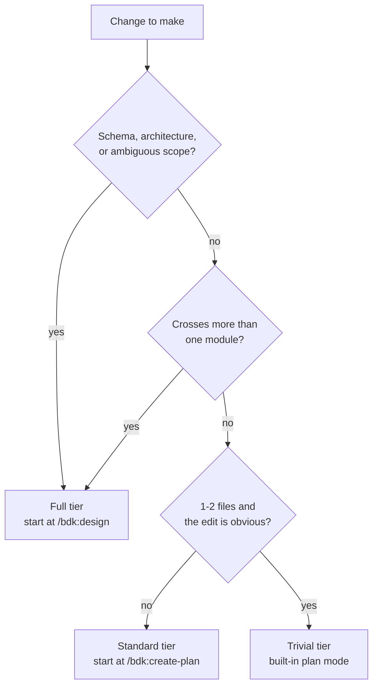

# Choosing a tier

BDK does not have one workflow. It has three, and picking the wrong one is the most
common way to waste time with it: a full pipeline on a two-line fix costs more than the
fix, and a trivial edit on a schema change ships a bug.

Pick by the *shape of the uncertainty*, not by how many lines you expect to write.

## The three tiers

| Tier | When | Flow |
|---|---|---|
| Full | New feature, architecture or schema change, ambiguous scope | `/bdk:design` -> `/bdk:create-plan` -> `/bdk:verify-plan` -> `/bdk:subagent-execute-plan` -> `/bdk:cr --full` |
| Standard | Clear scope, several files, no design questions left | `/bdk:create-plan` -> (`/bdk:verify-plan`) -> `/bdk:subagent-execute-plan` -> `/bdk:cr` |
| Trivial | One or two files, the change is obvious | Claude Code built-in plan mode -> edit -> `/bdk:cr --inline` |

## Concrete triggers

Go **full** when any one of these is true:

- The database schema moves. `/bdk:design` runs a non-skippable Schema-Change Gate that
  shows the current shape and makes you approve the new one before anything is written.
- The change crosses more than one module, or introduces a new boundary between modules.
- Scope is ambiguous. If you cannot write the success criterion in one testable sentence,
  you are not ready to plan, let alone edit.
- There are two viable shapes and you have not chosen. `/bdk:design` always offers 2+
  approaches and will not present a single solution silently.

Go **standard** when scope is clear and design questions are already settled, but the
work still spans several files, has real test cases, and benefits from parallel execution
and a review pass.

Go **trivial** when the change touches one or two files, the correct edit is obvious
before you start, and you can name what would break if you got it wrong.

!!! note
    Tiers are not a ladder you must climb. A standard run does not need a design doc,
    and a trivial edit does not need a plan. What every tier keeps is the closing review.

## Decision flow

## What every tier has in common

Whatever tier you pick, the same foundation is already in the session: tool tiers,
verification proportionality, quality rules, and capture conventions are injected at
SessionStart from `STARTUP_INSTRUCTIONS.md`. That is why the trivial tier is safe without
invoking a single skill - see [Trivial changes](trivial.md) and
[The shared foundation](../concepts/shared-foundation.md).

And every tier ends in a review. Delta by default, `--full` before a pull request. See
[Code review](code-review.md).

## Escalating mid-flight

Tiers are a starting guess, not a contract:

- Trivial turned out to touch five files -> stop editing, run `/bdk:create-plan`.
- Standard hit a design question -> stop, run `/bdk:design`, then re-plan.
- Full verification failed twice -> `/bdk:verify-plan` stops and recommends `/bdk:design`,
  because after two failed iterations the plan is structurally wrong, not detail-wrong.

Escalating costs one command. Not escalating costs a rewrite.

## What you get

Nothing on disk - this page is a decision, not a run. The artifacts start with the tier
you pick:

| Tier | First artifact |
|---|---|
| Full | `.bdk/design/<ts>-<slug>-design.md` |
| Standard | `.bdk/plans/<ts>-<slug>.md` |
| Trivial | The edit itself, then `.bdk/cr/<stamp>-<branch-slug>-delta.md` |

## Next step

Go to the tier you picked: [Full pipeline](full-pipeline.md),
[Standard workflow](standard.md), or [Trivial changes](trivial.md).
