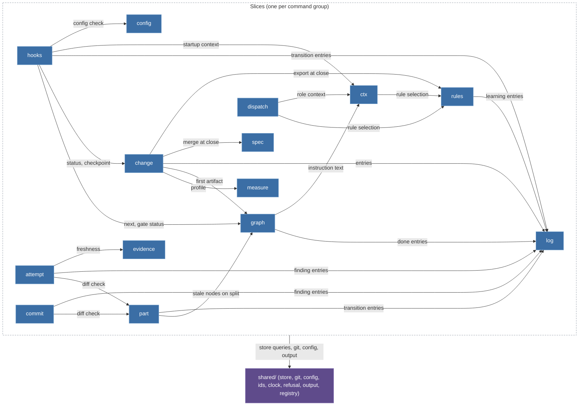

# Spec Delta

## MODIFIED Requirements

### Requirement: Vertical slices

The kernel source SHALL be organised as one slice per command group plus `shared/`; the set of `slice` values in `schema/cli/commands.json` SHALL equal this module list.

| Slice | Commands | Owner tasks | One sentence |
|---|---|---|---|
| `change` | `change new`, `status`, `list`, `resume`, `park`, `takeover`, `checkpoint`, `close` | T20, T22, T30 | Lifecycle of the one Change per branch; `close` composes `spec`, `log route` and `rules export`. |
| `measure` | `measure` | T20 | Size heuristic for an intent or a diff; separate because `change new` and `/bdk:cr` both call it and its calibration changes independently. |
| `graph` | `next`, `explain`, `validate`, `done` | T21 | The artifact graph from `pipeline.yaml`: node states, input hashes, kind validators, gate status. |
| `part` | `part list`, `start`, `done`, `split` | T22 | Plan parts, their validators (S1, P6) and the diff check against `Files:` and `do-not-touch`. |
| `attempt` | `attempt open`, `close`, `list` | T22 | Tickets, budgets, the escalation ladder and oscillation detection (P4, A-drabina). |
| `log` | `log add`, `ingest`, `list`, `show`, `resolve`, `route` | T20, T22, T31 | The append-only ledger and its provenance rules (K2, P1); the leaf every writing slice depends on. |
| `dispatch` | `dispatch build`, `show`, `run` | T23 | Dispatch packages (K3, K4) and the headless runner. |
| `evidence` | `evidence record`, `check` | T23 | Evidence manifests, tree hashes, citations and freshness (T4, P5). |
| `spec` | `spec delta check`, `merge`, `diff` | T30 | Spec deltas and the deterministic merge (D2b, V1-7). |
| `config` | `config show`, `check`, `schema`, `set` | T12 | The commands over the layered configuration; the layering itself is `shared/config`. |
| `ctx` | `ctx skill`, `role`, `startup` | T13 | Prompt context composition: fragments, rules, prompt values, the agents table. |
| `rules` | `rules check`, `show`, `add`, `explain`, `prune`, `import`, `stats`, `export` | T31 | Rule files, ids, `applies` selection and the learning funnel. |
| `query` | `query` | T20 | Read-only SQL over the index. |
| `commit` | `commit` | T22 | The task commit with BDK trailers. |
| `hooks` | `hooks session-start`, `session-end`, `prompt-expansion`, `pre-tool`, `skill-exists` | T24 | Host payload parsing, guard decisions, the only writer of `source: user`. |
| `service` | `doctor`, `rebuild`, `import`, `version` | T11, T22, T32 | Diagnosis, index rebuild, the v2 import and the version; reads every other slice, writes none. |
| `export` | `export agents` | T23 | Host projections generated from the role skills. |

The one relationship the map shows is *who may import whom*. Arrows point from the importing slice to the imported one; every slice may import `shared/`, drawn as one edge from the slice boundary. `service` (imports every slice, read-only), `query` and `export` (import nothing but `shared/`) are left out of the drawing to stay within the node budget; the matrix below is complete.

#### Scenario: slice parity

- **WHEN** a record in `schema/cli/commands.json` names a slice that this list does not contain, or a listed slice has no record
- **THEN** the contract test fails
