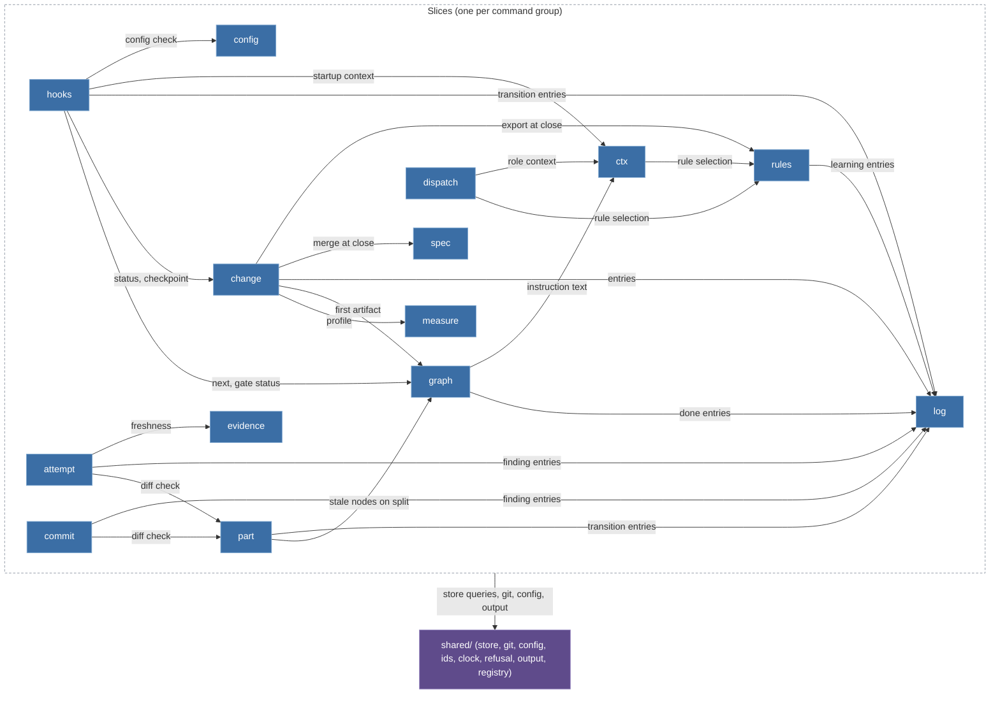

# Spec Delta

## MODIFIED Requirements

### Requirement: Vertical slices

The kernel source SHALL be organised as one slice per command group plus `shared/`; the set of `slice` values in `schema/cli/commands.json` SHALL equal this module list.

| Slice      | Commands                                                                             | Owner tasks   | One sentence                                                                                                                                |
| ---------- | ------------------------------------------------------------------------------------ | ------------- | ------------------------------------------------------------------------------------------------------------------------------------------- |
| `change`   | `change new`, `status`, `list`, `resume`, `park`, `takeover`, `checkpoint`, `close`  | T20, T22, T30 | Lifecycle of the one Change per branch; `close` composes `spec`, `log route` and `rules export`.                                            |
| `measure`  | `measure`                                                                            | T20           | Size heuristic for an intent or a diff; separate because `change new` and `/bdk:cr` both call it and its calibration changes independently. |
| `graph`    | `next`, `explain`, `validate`, `done`                                                | T21           | The artifact graph from `pipeline.yaml`: node states, input hashes, kind validators, gate status.                                           |
| `part`     | `part list`, `start`, `done`, `split`                                                | T22           | Plan parts, their validators (S1, P6) and the diff check against `Files:` and `do-not-touch`.                                               |
| `attempt`  | `attempt open`, `close`, `list`                                                      | T22           | Tickets, budgets, the escalation ladder and oscillation detection (P4, A-drabina).                                                          |
| `log`      | `log add`, `ingest`, `list`, `show`, `resolve`, `route`                              | T20, T22, T31 | The append-only ledger and its provenance rules (K2, P1); the leaf every writing slice depends on.                                          |
| `dispatch` | `dispatch build`, `show`, `run`                                                      | T23           | Dispatch packages (K3, K4) and the headless runner.                                                                                         |
| `evidence` | `evidence record`, `check`                                                           | T23           | Evidence manifests, tree hashes, citations and freshness (T4, P5).                                                                          |
| `spec`     | `spec delta check`, `merge`, `diff`                                                  | T30           | Spec deltas and the deterministic merge (D2b, V1-7).                                                                                        |
| `config`   | `config show`, `check`, `schema`, `set`                                              | T12           | The commands over the layered configuration; the layering itself is `shared/config`.                                                        |
| `ctx`      | `ctx skill`, `startup`                                                               | T13           | Prompt context composition: the skill manifest, rules, fragments, tool entries, the agents table.                                           |
| `rules`    | `rules check`, `show`, `add`, `explain`, `prune`, `import`, `stats`, `export`        | T31           | Rule files, ids, `applies` selection and the learning funnel.                                                                               |
| `query`    | `query`                                                                              | T20           | Read-only SQL over the index.                                                                                                               |
| `commit`   | `commit`                                                                             | T22           | The task commit with BDK trailers.                                                                                                          |
| `hooks`    | `hooks session-start`, `session-end`, `prompt-expansion`, `pre-tool`, `skill-exists` | T13, T24      | Host payload parsing, guard decisions, the only writer of `source: user`.                                                                   |
| `service`  | `doctor`, `rebuild`, `import`, `version`                                             | T11, T22, T32 | Diagnosis, index rebuild, the v2 import and the version; reads every other slice, writes none.                                              |
| `export`   | `export agents`                                                                      | T23           | Host projections generated from the role skills.                                                                                            |

The one relationship the map shows is _who may import whom_. Arrows point from the importing slice to the imported one; every slice may import `shared/`, drawn as one edge from the slice boundary. `service` (imports every slice, read-only), `query` and `export` (import nothing but `shared/`) are left out of the drawing to stay within the node budget; the matrix below is complete.

#### Scenario: slice parity

- **WHEN** a record in `schema/cli/commands.json` names a slice that this list does not contain, or a listed slice has no record
- **THEN** the contract test fails

### Requirement: Dependency matrix

A slice SHALL import another slice only through that slice's `index.ts` and only along a row of the matrix; the graph SHALL stay acyclic.

A slice imports another slice only through that slice's `index.ts`, and only along a row of this table. **Reads of committed state never need a slice import**: `shared/store` exposes typed queries over the index (open tickets of a Change, the `Files:` of a task, the manifests of a task, entry summaries) whose row shapes are T14's, so `evidence record` checks its ticket, `part done` checks for open tickets and `log add` checks its ticket without importing `attempt`. A slice import is for a use case or domain logic that another slice owns (the diff check owned by `part`, freshness owned by `evidence`, entry writing owned by `log`). This is what keeps the graph acyclic.

| From                                                              | May import                                 | Why                                                                                                                                                                                                 |
| ----------------------------------------------------------------- | ------------------------------------------ | --------------------------------------------------------------------------------------------------------------------------------------------------------------------------------------------------- |
| `change`                                                          | `measure`, `graph`, `log`, `spec`, `rules` | `new` measures and asks the graph for the first artifact; every verb writes entries; `close` merges specs and regenerates the rule projection.                                                      |
| `graph`                                                           | `log`, `ctx`                               | `done` writes the entry; `next` composes the instruction from the kind template and the skill context.                                                                                              |
| `part`                                                            | `graph`, `log`                             | `split` marks plan nodes stale; `start`, `done` and `split` write transition entries.                                                                                                               |
| `attempt`                                                         | `part`, `log`, `evidence`                  | `close` runs `part`'s diff check, `evidence`'s freshness check and writes findings.                                                                                                                 |
| `commit`                                                          | `part`, `log`                              | The same diff check as `attempt close`, and the finding for undeclared files.                                                                                                                       |
| `dispatch`                                                        | `rules`, `ctx`                             | Package sections come from rule selection and the skill context; the role body comes from the role skill.                                                                                           |
| `ctx`                                                             | `rules`                                    | Rule text and `applies` filtering.                                                                                                                                                                  |
| `rules`                                                           | `log`                                      | `add` writes the `learning` entry; `stats` reads through the store.                                                                                                                                 |
| `hooks`                                                           | `change`, `graph`, `log`, `ctx`, `config`  | `session-start` composes status, startup context, the config check and the v2 layout detection of `config`; `prompt-expansion` asks the graph and writes the transition; `session-end` checkpoints. |
| `service`                                                         | every slice (read-only)                    | `doctor` and `rebuild` inspect all state (`doctor` takes the v2 layout detection from `config`); `import` calls `rules import` and `config`.                                                        |
| `log`, `evidence`, `spec`, `config`, `query`, `measure`, `export` | `shared` only                              | Leaves.                                                                                                                                                                                             |

Edges not in the table are forbidden, including the reverse of every listed edge. The two structural tests below fail the build on a violation.

#### Scenario: import outside the matrix

- **WHEN** a file under `kernel/src/<slice>/` imports a slice that its matrix row does not list, imports a slice file other than its `index.ts`, or `shared/` imports a slice
- **THEN** the import scan fails the build
