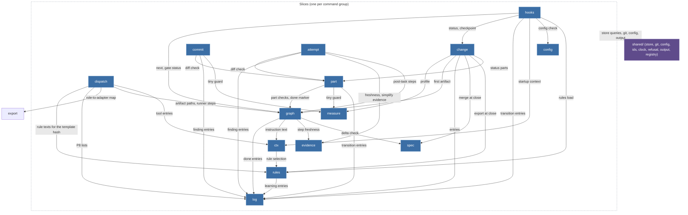

## MODIFIED Requirements

### Requirement: Vertical slices

The kernel source SHALL be organised as one slice per command group plus `shared/`; the set of `slice` values in `schema/cli/commands.json` SHALL equal this module list.

| Slice      | Commands                                                                             | Owner tasks   | One sentence                                                                                                                                                                     |
| ---------- | ------------------------------------------------------------------------------------ | ------------- | -------------------------------------------------------------------------------------------------------------------------------------------------------------------------------- |
| `change`   | `change new`, `status`, `list`, `resume`, `park`, `takeover`, `checkpoint`, `close`  | T20, T22, T30 | Lifecycle of the one Change per branch; `close` merges the spec deltas through `spec` and archives.                                                                              |
| `measure`  | `measure`                                                                            | T20           | Size heuristic for an intent or a diff; separate because `change new` and `/bdk:cr` both call it and its calibration changes independently.                                      |
| `graph`    | `next`, `explain`, `validate`, `done`                                                | T21           | The artifact graph from `pipeline.yaml`: node states, input hashes, kind validators, gate status.                                                                                |
| `part`     | `part list`, `start`, `done`, `split`                                                | T22           | Plan parts, their validators (S1, P6) and the diff check against `Files:` and `do-not-touch`.                                                                                    |
| `attempt`  | `attempt open`, `close`, `list`                                                      | T22           | Tickets, budgets, the escalation ladder and oscillation detection (P4, A-drabina).                                                                                               |
| `log`      | `log add`, `ingest`, `list`, `show`, `resolve`                                       | T20, T22, T31 | The append-only ledger and its provenance rules (K2, P1); the leaf every writing slice depends on.                                                                               |
| `dispatch` | `dispatch build`, `show`                                                             | T23           | Dispatch packages (K3, K4).                                                                                                                                                      |     |
| `evidence` | `evidence record`, `check`                                                           | T23           | Evidence manifests, tree hashes, citations and freshness (T4, P5).                                                                                                               |
| `spec`     | `spec delta check`, `merge`, `diff`                                                  | T30           | Spec deltas and the deterministic merge (D2b, V1-7).                                                                                                                             |
| `config`   | `config show`, `check`, `schema`, `set`                                              | T12           | The commands over the layered configuration; the layering itself is `shared/config`.                                                                                             |
| `ctx`      | `ctx skill`, `startup`                                                               | T13           | Prompt context composition: the skill manifest, rules, fragments, tool entries, the agents table.                                                                                |
| `rules`    | `rules check`, `show`, `accept`, `explain`, `prune`, `import`, `stats`, `export`     | T23, T31      | Rule files of the bundle and the project, their ids, `applies` selection per package, the audit view and adoption by `rules accept`; the rule texts `ctx` and `dispatch` read.   |
| `query`    | `query`                                                                              | T20           | Read-only SQL over the index.                                                                                                                                                    |
| `commit`   | `commit`                                                                             | T22           | The task commit with BDK trailers.                                                                                                                                               |
| `hooks`    | `hooks session-start`, `session-end`, `prompt-expansion`, `pre-tool`, `skill-exists` | T13, T24      | Host payload parsing, guard decisions, the only writer of `source: user`.                                                                                                        |
| `service`  | `doctor`, `rebuild`, `import`, `version`                                             | T11, T22, T32 | Diagnosis, index rebuild, the v2 import and the version; reads every other slice; `rebuild` writes only through the `shared/store` rebuild core, which `change takeover` shares. |
| `export`   | `export agents`                                                                      | T23           | Host projections: the adapter files generated from the adapter definitions and the per-host tool map.                                                                            |     |

The one relationship the map shows is _who may import whom_. Arrows point from the importing slice to the imported one; every slice may import `shared/`, drawn as one edge from the slice boundary. `service` (imports every slice, read-only), `query` and `export` (import nothing but `shared/`) are left out of the drawing to stay within the node budget; the matrix below is complete.

#### Scenario: slice parity

- **WHEN** a record in `schema/cli/commands.json` names a slice that this list does not contain, or a listed slice has no record
- **THEN** the contract test fails

#### Scenario: T22 slices registered

- **WHEN** the kernel's registrations are listed after T22
- **THEN** the `attempt`, `part` and `commit` slices register handlers for every record whose slice they are, and none answers `kernel/not-implemented`

#### Scenario: T23 part B slices registered

- **WHEN** the kernel's registrations are listed after T23 part B
- **THEN** `dispatch build`, `dispatch show`, `log ingest` and `rules show` have handlers, and of the `rules` records only the other verbs and the `<id>` form of `rules show` answer `kernel/not-implemented`

#### Scenario: T23 part C slices registered

- **WHEN** the kernel's registrations are listed after T23 part C
- **THEN** the `evidence` slice registers handlers for `evidence record` and `evidence check`, and neither answers `input/unknown-command` or `kernel/not-implemented`

#### Scenario: T30 slices registered

- **WHEN** the registry is listed after T30
- **THEN** `spec delta check`, `spec merge`, `spec diff` and `change close` have handlers, the `spec` and `archive` config modules are registered with consumers `spec` and `change`, and no import of `kernel/src/spec/` reaches another slice

### Requirement: Dependency matrix

A slice SHALL import another slice only through that slice's `index.ts` and only along a row of the matrix; the graph SHALL stay acyclic.

A slice imports another slice only through that slice's `index.ts`, and only along a row of this table. **Reads of committed state never need a slice import**: `shared/store` exposes typed queries over the index (open tickets of a Change, the `Files:` of a task, the manifests of a task, entry summaries, a ticket's active package) whose row shapes are T14's, so `evidence record` checks its ticket, `part done` checks for open tickets and `log add` checks its ticket without importing `attempt`. Behaviour several slices share without an edge between them lives in `shared/store` as well: the checkpoint (`change`, `attempt`, and `hooks` from T24) and the rebuild core (`service`, `change`). A slice import is for a use case or domain logic that another slice owns (the diff check owned by `part`, freshness owned by `evidence`, entry writing owned by `log`). This is what keeps the graph acyclic.

| From                                                              | May import                                         | Why                                                                                                                                                                                                                                                                                                                                                                  |
| ----------------------------------------------------------------- | -------------------------------------------------- | -------------------------------------------------------------------------------------------------------------------------------------------------------------------------------------------------------------------------------------------------------------------------------------------------------------------------------------------------------------------- |
| `change`                                                          | `measure`, `graph`, `part`, `log`, `spec`          | `new` measures and asks the graph for the first artifact; `status` lists the plan parts as `part list` does; every verb writes entries; `close` merges specs.                                                                                                                                                                                                        |
| `graph`                                                           | `log`, `ctx`, `evidence`, `spec`                   | `done` writes the entry; `next` composes the instruction from the kind template and the skill context; a post-task step node's state comes from `evidence`'s freshness of its latest covering manifest; the `spec-delta` and `plan-part` validators run `spec`'s delta check.                                                                                        |
| `part`                                                            | `graph`, `log`, `measure`                          | `start`, `done` and `split` run the `plan-part` and `execute-part` checks and write transition and decision entries; `done` of a `tiny` Change measures its commits (tiny guard).                                                                                                                                                                                    |
| `attempt`                                                         | `part`, `log`, `evidence`, `graph`                 | `close` runs `part`'s diff check, `evidence`'s freshness check, records the `simplify` manifest through `evidence` and writes findings; `open` and `close` read the post-task step nodes and their order from `graph`.                                                                                                                                               |
| `commit`                                                          | `part`, `log`, `measure`                           | The same diff check as `attempt close`, the finding for undeclared files, and the tiny guard.                                                                                                                                                                                                                                                                        |
| `dispatch`                                                        | `rules`, `log`, `export`, `graph`, `ctx`           | The template hash covers the rule texts `rules` selects; a verifier's package lists the P8 categories `log` enforces; `adapter` comes from `export`'s role-to-adapter map; an artifact target's paths and a runner's steps come from `graph`; a runner's `Checks` come from the tool entries `ctx` owns. The role body is a plugin file read through `shared/store`. |
| `ctx`                                                             | `rules`                                            | Rule text: `rules` owns the rule store and `languages` (`kernel-settings`), and `ctx` renders a skill's rule parts from it by id.                                                                                                                                                                                                                                    |
| `rules`                                                           | `shared` only                                      | Rule files are read from the bundle and `.bdk/rules/`; `stats`, `prune` and `accept` read the index, and `show --ticket` reads the package and stamps `rules-read`, all through `shared/store`.                                                                                                                                                                      |
| `hooks`                                                           | `change`, `graph`, `log`, `ctx`, `config`, `rules` | `session-start` composes status, startup context, the config check and the v2 layout detection of `config`, and the rules load of `rules`; `prompt-expansion` asks the graph and writes the transition; `session-end` checkpoints.                                                                                                                                   |
| `service`                                                         | every slice (read-only)                            | `doctor` and `rebuild` inspect all state (`doctor` takes the v2 layout detection from `config`); `rebuild` writes through the `shared/store` rebuild core, not through a slice; `import` calls `rules import` and `config`.                                                                                                                                          |
| `log`, `evidence`, `spec`, `config`, `query`, `measure`, `export` | `shared` only                                      | Leaves.                                                                                                                                                                                                                                                                                                                                                              |

Edges not in the table are forbidden, including the reverse of every listed edge. The two structural tests below fail the build on a violation.

#### Scenario: import outside the matrix

- **WHEN** a file under `kernel/src/<slice>/` imports a slice that its matrix row does not list, imports a slice file other than its `index.ts`, or `shared/` imports a slice
- **THEN** the import scan fails the build

#### Scenario: checkpoint without a slice edge

- **WHEN** the import scan reads `kernel/src/attempt/`
- **THEN** it finds no import of `kernel/src/change/`, and the escalation checkpoint is reached through `shared/store`

#### Scenario: rules read without an attempt edge

- **WHEN** the import scan reads `kernel/src/rules/`
- **THEN** it finds no import of `kernel/src/attempt/`, and the `rules-read` stamp is written through `shared/store`

#### Scenario: evidence stays a leaf

- **WHEN** the import scan reads `kernel/src/evidence/`
- **THEN** it finds no import of another slice, and `graph`, `attempt` and no other slice import `evidence`

#### Scenario: rules is a leaf

- **WHEN** the import scan reads `kernel/src/rules/`
- **THEN** it finds no import of another slice
