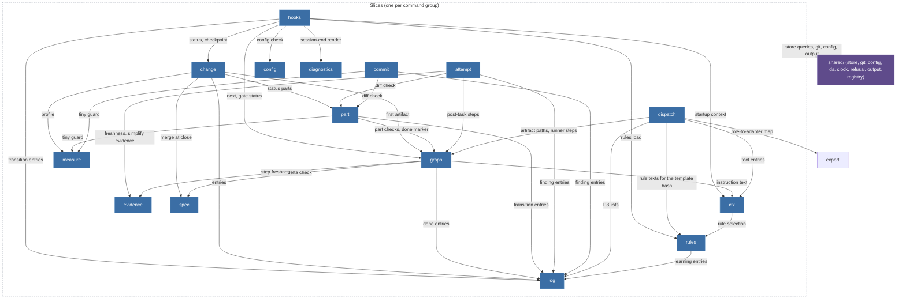

# Spec Delta

## MODIFIED Requirements

### Requirement: Vertical slices

The kernel source SHALL be organised as one slice per command group plus `shared/`; the set of `slice` values in `schema/cli/commands.json` SHALL equal this module list.

| Slice         | Commands                                                                                                                                     | Owner tasks   | One sentence                                                                                                                                                                                                                    |
| ------------- | -------------------------------------------------------------------------------------------------------------------------------------------- | ------------- | ------------------------------------------------------------------------------------------------------------------------------------------------------------------------------------------------------------------------------- |
| `change`      | `change new`, `status`, `list`, `resume`, `park`, `takeover`, `checkpoint`, `close`                                                          | T20, T22, T30 | Lifecycle of the one Change per branch; `close` merges the spec deltas through `spec` and archives.                                                                                                                             |
| `measure`     | `measure`                                                                                                                                    | T20           | Size heuristic for an intent or a diff; separate because `change new` and `/bdk:cr` both call it and its calibration changes independently.                                                                                     |
| `graph`       | `next`, `explain`, `validate`, `done`                                                                                                        | T21           | The artifact graph from `pipeline.yaml`: node states, input hashes, kind validators, gate status.                                                                                                                               |
| `part`        | `part list`, `start`, `done`, `split`                                                                                                        | T22           | Plan parts, their validators (S1, P6) and the diff check against `Files:` and `do-not-touch`.                                                                                                                                   |
| `attempt`     | `attempt open`, `close`, `list`                                                                                                              | T22           | Tickets, budgets, the escalation ladder and oscillation detection (P4, A-drabina).                                                                                                                                              |
| `log`         | `log add`, `ingest`, `list`, `show`, `resolve`                                                                                               | T20, T22, T31 | The append-only ledger and its provenance rules (K2, P1); the leaf every writing slice depends on.                                                                                                                              |
| `dispatch`    | `dispatch build`, `show`                                                                                                                     | T23           | Dispatch packages (K3, K4).                                                                                                                                                                                                     |     |
| `evidence`    | `evidence record`, `check`                                                                                                                   | T23           | Evidence manifests, tree hashes, citations and freshness (T4, P5).                                                                                                                                                              |
| `spec`        | `spec delta check`, `merge`, `diff`                                                                                                          | T30           | Spec deltas and the deterministic merge (D2b, V1-7).                                                                                                                                                                            |
| `config`      | `config show`, `check`, `schema`, `set`                                                                                                      | T12           | The commands over the layered configuration; the layering itself is `shared/config`.                                                                                                                                            |
| `ctx`         | `ctx skill`, `startup`, `craft`                                                                                                              | T13, T42      | Prompt context composition: the skill manifest, rules, fragments, tool entries, the agents table, and the installed `bdk-craft` skills.                                                                                         |
| `rules`       | `rules check`, `show`, `accept`, `explain`, `prune`, `stats`                                                                                 | T23, T31      | Rule files of the bundle and the project, their ids, the selection by `paths` and `stages` for a role, a skill or a pipeline node, the audit view and adoption by `rules accept`; the rule texts `ctx` and `dispatch` read.     |
| `query`       | `query`                                                                                                                                      | T20           | Read-only SQL over the index.                                                                                                                                                                                                   |
| `commit`      | `commit`                                                                                                                                     | T22           | The task commit with BDK trailers.                                                                                                                                                                                              |
| `review`      | `review plan`                                                                                                                                | T42           | The range and the reviewer groups of a review round, from the plan parts, the ledger and git.                                                                                                                                   |
| `hooks`       | `hooks session-start`, `session-end`, `prompt-expansion`, `pre-tool`, `post-tool`, `subagent-start`, `subagent-stop`, `stop`, `skill-exists` | T13, T24, T41 | Host payload parsing, guard decisions, the only writer of `source: user`.                                                                                                                                                       |
| `service`     | `doctor`, `rebuild`, `version`                                                                                                               | T11, T22      | Diagnosis, index rebuild and the version; reads every other slice; `rebuild` writes Change state only through the `shared/store` rebuild core, which `change takeover` shares, and settles part worktrees through `part` (T45). |
| `export`      | `export agents`                                                                                                                              | T23           | Host projections: the adapter files generated from the adapter definitions and the per-host tool map.                                                                                                                           |     |
| `agents`      | `agents list`, `show`, `wait`                                                                                                                | T41           | The agent registry (T41-D6): its database, the derived states, the delivery cursor and the queries the agent hooks and the guard use.                                                                                           |     |
| `diagnostics` | `diagnostics report`, `log`, `slice`, `write`                                                                                                | T47           | The run journal and host transcripts read into a deterministic report, the verbose render, bounded slices, and the checked store of an analysis (T47-D3, D6, D9).                                                               |     |

The one relationship the map shows is _who may import whom_. Arrows point from the importing slice to the imported one; every slice may import `shared/`, drawn as one edge from the slice boundary. `service` (imports every slice, read-only), `query`, `export` and `agents` (import nothing but `shared/`; `hooks` imports `agents`) are left out of the drawing to stay within the node budget; the matrix below is complete.

#### Scenario: slice parity

- **WHEN** a record in `schema/cli/commands.json` names a slice that this list does not contain, or a listed slice has no record
- **THEN** the contract test fails

#### Scenario: T22 slices registered

- **WHEN** the kernel's registrations are listed after T22
- **THEN** the `attempt`, `part` and `commit` slices register handlers for every record whose slice they are, and none answers `kernel/not-implemented`

#### Scenario: T23 part B slices registered

- **WHEN** the kernel's registrations are listed after T23 part B
- **THEN** `dispatch build`, `dispatch show`, `log ingest` and `rules show` have handlers, and of the `rules` records only the other verbs and the `<id>` form of `rules show` answer `kernel/not-implemented`

#### Scenario: T23 part C slices registered

- **WHEN** the kernel's registrations are listed after T23 part C
- **THEN** the `evidence` slice registers handlers for `evidence record` and `evidence check`, and neither answers `input/unknown-command` or `kernel/not-implemented`

#### Scenario: T30 slices registered

- **WHEN** the registry is listed after T30
- **THEN** `spec delta check`, `spec merge`, `spec diff` and `change close` have handlers, the `spec` and `archive` config modules are registered with consumers `spec` and `change`, and no import of `kernel/src/spec/` reaches another slice

#### Scenario: review slice is registered

- **WHEN** the structural test compares the `slice` values of `schema/cli/commands.json` with the slice table
- **THEN** `review` is in both, owning `review plan`

#### Scenario: diagnostics slice registered

- **WHEN** the structural test compares the `slice` values of `schema/cli/commands.json` with the slice table
- **THEN** `diagnostics` is in both, owning `diagnostics report`, `log`, `slice` and `write`, and none answers `kernel/not-implemented`

#### Scenario: one selection for every reader

- **WHEN** the kernel source is searched for tables that map a role, a skill or a pipeline node to rule prefixes or pack categories
- **THEN** none is found: `dispatch`, `ctx` and `graph` select rules only through the `rules` slice and the stage table of `shared/vocabulary`
