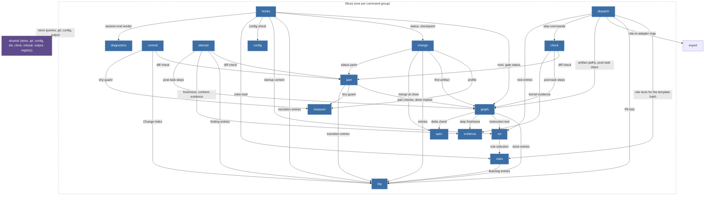

## MODIFIED Requirements

### Requirement: Vertical slices

The kernel source SHALL be organised as one slice per command group plus `shared/`; the set of `slice` values in `schema/cli/commands.json` SHALL equal this module list.

| Slice         | Commands                                                                                                                                     | Owner tasks   | One sentence                                                                                                                                                                                                                    |
| ------------- | -------------------------------------------------------------------------------------------------------------------------------------------- | ------------- | ------------------------------------------------------------------------------------------------------------------------------------------------------------------------------------------------------------------------------- |
| `change`      | `change new`, `status`, `list`, `resume`, `park`, `takeover`, `checkpoint`, `close`                                                          | T20, T22, T30 | Lifecycle of the one Change per branch; `close` merges the spec deltas through `spec` and archives.                                                                                                                             |
| `measure`     | `measure`                                                                                                                                    | T20           | Size heuristic for an intent or a diff; separate because `change new` and `/bdk:cr` both call it and its calibration changes independently.                                                                                     |
| `graph`       | `next`, `explain`, `validate`, `done`                                                                                                        | T21           | The artifact graph from `pipeline.yaml`: node states, input hashes, kind validators, gate status.                                                                                                                               |
| `part`        | `part list`, `start`, `done`, `split`                                                                                                        | T22           | Plan parts, their validators (S1, P6) and the diff check against `Files:` and `do-not-touch`.                                                                                                                                   |
| `attempt`     | `attempt open`, `close`, `list`                                                                                                              | T22           | Tickets, budgets, the escalation ladder and oscillation detection (P4, A-drabina).                                                                                                                                              |
| `log`         | `log add`, `ingest`, `list`, `show`, `resolve`                                                                                               | T20, T22, T31 | The append-only ledger and its provenance rules (K2, P1); the leaf every writing slice depends on.                                                                                                                              |
| `dispatch`    | `dispatch build`, `show`                                                                                                                     | T23           | Dispatch packages (K3, K4).                                                                                                                                                                                                     |     |
| `evidence`    | `evidence record`, `check`                                                                                                                   | T23           | Evidence manifests, tree hashes, citations and freshness (T4, P5).                                                                                                                                                              |
| `spec`        | `spec delta check`, `merge`, `diff`                                                                                                          | T30           | Spec deltas and the deterministic merge (D2b, V1-7).                                                                                                                                                                            |
| `config`      | `config show`, `check`, `schema`, `set`                                                                                                      | T12           | The commands over the layered configuration; the layering itself is `shared/config`.                                                                                                                                            |
| `ctx`         | `ctx skill`, `startup`, `craft`                                                                                                              | T13, T42      | Prompt context composition: the skill manifest, rules, fragments, tool entries, the agents table, and the installed `bdk-craft` skills.                                                                                         |
| `rules`       | `rules check`, `show`, `accept`, `explain`, `prune`, `stats`                                                                                 | T23, T31      | Rule files of the bundle and the project, their ids, the selection by `paths` and `stages` for a role, a skill or a pipeline node, the audit view and adoption by `rules accept`; the rule texts `ctx` and `dispatch` read.     |
| `query`       | `query`                                                                                                                                      | T20           | Read-only SQL over the index.                                                                                                                                                                                                   |
| `commit`      | `commit`                                                                                                                                     | T22           | The review-fix commit with BDK trailers; a part agent commits a task with plain `git` (#166).                                                                                                                                   |
| `check`       | `check run`                                                                                                                                  | T22           | The post-task checks of a task, a part or a review round's fix: the diff check, the project's commands run with stdin closed and a timeout, and the kernel's own `tests-scoped` and `lint` evidence (#166).                     |
| `review`      | `review plan`                                                                                                                                | T42           | The range and the reviewer groups of a review round, from the plan parts, the ledger and git.                                                                                                                                   |
| `hooks`       | `hooks session-start`, `session-end`, `prompt-expansion`, `pre-tool`, `post-tool`, `subagent-start`, `subagent-stop`, `stop`, `skill-exists` | T13, T24, T41 | Host payload parsing, guard decisions, the only writer of `source: user`.                                                                                                                                                       |
| `service`     | `doctor`, `rebuild`, `version`                                                                                                               | T11, T22      | Diagnosis, index rebuild and the version; reads every other slice; `rebuild` writes Change state only through the `shared/store` rebuild core, which `change takeover` shares, and settles part worktrees through `part` (T45). |
| `export`      | `export agents`                                                                                                                              | T23           | Host projections: the adapter files generated from the adapter definitions and the per-host tool map.                                                                                                                           |     |
| `agents`      | `agents list`, `show`, `wait`                                                                                                                | T41           | The agent registry (T41-D6): its database, the derived states, the delivery cursor and the queries the agent hooks and the guard use.                                                                                           |     |
| `diagnostics` | `diagnostics report`, `log`, `slice`, `write`                                                                                                | T47           | The run journal and host transcripts read into a deterministic report, the verbose render, bounded slices, and the checked store of an analysis (T47-D3, D6, D9).                                                               |     |

The one relationship the map shows is _who may import whom_. Arrows point from the importing slice to the imported one; every slice may import `shared/`, drawn as one edge from the slice boundary. `service` (imports every slice, read-only), `query`, `export`, `agents` (import nothing but `shared/`; `hooks` imports `agents`) and `check` (imports `part`, `graph` and `evidence`; `dispatch` imports it) are left out of the drawing to stay within the node budget; the matrix below is complete.

#### Scenario: slice parity

- **WHEN** a record in `schema/cli/commands.json` names a slice that this list does not contain, or a listed slice has no record
- **THEN** the contract test fails

#### Scenario: T22 slices registered

- **WHEN** the kernel's registrations are listed after T22
- **THEN** the `attempt`, `part` and `commit` slices register handlers for every record whose slice they are, and none answers `kernel/not-implemented`

#### Scenario: T23 part B slices registered

- **WHEN** the kernel's registrations are listed after T23 part B
- **THEN** `dispatch build`, `dispatch show`, `log ingest` and `rules show` have handlers, and of the `rules` records only the other verbs and the `<id>` form of `rules show` answer `kernel/not-implemented`

#### Scenario: T23 part C slices registered

- **WHEN** the kernel's registrations are listed after T23 part C
- **THEN** the `evidence` slice registers handlers for `evidence record` and `evidence check`, and neither answers `input/unknown-command` or `kernel/not-implemented`

#### Scenario: T30 slices registered

- **WHEN** the registry is listed after T30
- **THEN** `spec delta check`, `spec merge`, `spec diff` and `change close` have handlers, the `spec` and `archive` config modules are registered with consumers `spec` and `change`, and no import of `kernel/src/spec/` reaches another slice

#### Scenario: review slice is registered

- **WHEN** the structural test compares the `slice` values of `schema/cli/commands.json` with the slice table
- **THEN** `review` is in both, owning `review plan`

#### Scenario: diagnostics slice registered

- **WHEN** the structural test compares the `slice` values of `schema/cli/commands.json` with the slice table
- **THEN** `diagnostics` is in both, owning `diagnostics report`, `log`, `slice` and `write`, and none answers `kernel/not-implemented`

#### Scenario: one selection for every reader

- **WHEN** the kernel source is searched for tables that map a role, a skill or a pipeline node to rule prefixes or pack categories
- **THEN** none is found: `dispatch`, `ctx` and `graph` select rules only through the `rules` slice and the stage table of `shared/vocabulary`

### Requirement: Dependency matrix

A slice SHALL import another slice only through that slice's `index.ts` and only along a row of the matrix; the graph SHALL stay acyclic.

A slice imports another slice only through that slice's `index.ts`, and only along a row of this table. **Reads of committed state never need a slice import**: `shared/store` exposes typed queries over the index (open tickets of a Change, the `Files:` of a task, the manifests of a task, entry summaries, a ticket's active package, a group's package, the Change base that `review plan` and `evidence coverage` share) whose row shapes are T14's, so `evidence record` checks its ticket, `part done` checks for open tickets and `log add` checks its ticket without importing `attempt`. Behaviour several slices share without an edge between them lives in `shared/store` as well: the checkpoint (`change`, `attempt`, and `hooks` from T24) and the rebuild core (`service`, `change`). A slice import is for a use case or domain logic that another slice owns (the diff check owned by `part`, freshness owned by `evidence`, entry writing owned by `log`). This is what keeps the graph acyclic.

| From                                                                                       | May import                                                                  | Why                                                                                                                                                                                                                                                                                                                                                                                                                                                                                                                                                                        |
| ------------------------------------------------------------------------------------------ | --------------------------------------------------------------------------- | -------------------------------------------------------------------------------------------------------------------------------------------------------------------------------------------------------------------------------------------------------------------------------------------------------------------------------------------------------------------------------------------------------------------------------------------------------------------------------------------------------------------------------------------------------------------------- |
| `change`                                                                                   | `measure`, `graph`, `part`, `log`, `spec`                                   | `new` measures and asks the graph for the first artifact; `status` lists the plan parts as `part list` does; every verb writes entries; `close` merges specs.                                                                                                                                                                                                                                                                                                                                                                                                              |
| `graph`                                                                                    | `log`, `ctx`, `evidence`, `spec`                                            | `done` writes the entry; `next` composes the instruction from the kind template and the skill context; a post-task step node's state comes from `evidence`'s freshness of its latest covering manifest; the `spec-delta` and `plan-part` validators run `spec`'s delta check.                                                                                                                                                                                                                                                                                              |
| `part`                                                                                     | `graph`, `log`, `measure`                                                   | `start`, `done` and `split` run the `plan-part` and `execute-part` checks and write transition and decision entries; `done` of a `tiny` Change measures its commits (tiny guard).                                                                                                                                                                                                                                                                                                                                                                                          |
| `attempt`                                                                                  | `part`, `log`, `evidence`, `graph`                                          | `close` runs `part`'s diff check, `evidence`'s freshness check, records the `conform` manifest through `evidence` and writes findings; `open` and `close` read the post-task step nodes and their order from `graph`.                                                                                                                                                                                                                                                                                                                                                      |
| `commit`                                                                                   | `part`, `log`, `measure`                                                    | The diff check of the Change target, and the tiny guard.                                                                                                                                                                                                                                                                                                                                                                                                                                                                                                                   |
| `check`                                                                                    | `part`, `graph`, `evidence`, `log`                                          | `run` runs `part`'s diff check under the Change index `log` opens, takes the step kinds and the target's executable files from `graph`, and records its manifests through `evidence`'s record core; the commands run through `shared/git`.                                                                                                                                                                                                                                                                                                                                 |
| `dispatch`                                                                                 | `rules`, `log`, `export`, `graph`, `ctx`, `review`, `check`                 | The template hash covers the rule texts `rules` selects; a verifier's package lists the P8 categories `log` enforces; `adapter` comes from `export`'s role-to-adapter map; an artifact target's paths and a part's steps come from `graph`; the commands a part package's `Checks` names come from `check`, which composes them from the tool entries, and a gate runner's `Checks` from the tool entries `ctx` owns. The role body is a plugin file read through `shared/store`. The integration reviewer's risks come from the `review.risks` module that `review` owns. |
| `ctx`                                                                                      | `rules`, `log`                                                              | Rule text: `rules` owns the rule store and `languages` (`kernel-settings`), and `ctx` renders a skill's rule parts from it by id; the `verifier-policy` part renders the P8 lists `log` resolves and enforces (T42).                                                                                                                                                                                                                                                                                                                                                       |
| `rules`                                                                                    | `shared` only                                                               | Rule files are read from the bundle and `.bdk/rules/`; `stats`, `prune` and `accept` read the index, and `show --ticket` reads the package and stamps `rules-read`, all through `shared/store`.                                                                                                                                                                                                                                                                                                                                                                            |
| `hooks`                                                                                    | `change`, `graph`, `log`, `ctx`, `config`, `rules`, `agents`, `diagnostics` | `session-end` renders the verbose log through `diagnostics`; `session-start` composes status, startup context, the config check and the v2 layout detection of `config`, and the rules load of `rules`; `prompt-expansion` asks the graph and writes the transition; `session-end` checkpoints; the agent hooks, the message guard and the continuation check read and write the registry of `agents`, and the continuation check asks `graph` for ready work.                                                                                                             |
| `service`                                                                                  | every slice (read-only)                                                     | `doctor` and `rebuild` inspect all state (`doctor` takes the v2 layout detection from `config`); `rebuild` writes Change state through the `shared/store` rebuild core, not through a slice; its worktree recovery is `part`'s, since `part` owns the worktree and its setup (T45).                                                                                                                                                                                                                                                                                        |
| `review`                                                                                   | `measure`                                                                   | `plan` reads the module signals of `measure`; `render` reads the same signals for its diagram; the plan parts, the `merge` reports, the entries, the evidence and the Change base come from `shared/store`.                                                                                                                                                                                                                                                                                                                                                                |
| `log`, `evidence`, `spec`, `config`, `query`, `measure`, `export`, `agents`, `diagnostics` | `shared` only                                                               | Leaves; `agents` reads ledger entries and task `Files:` for `--affected-by` through `shared/store`; `diagnostics` reads the journal, the registry and the ledger through `shared/store`.                                                                                                                                                                                                                                                                                                                                                                                   |

Edges not in the table are forbidden, including the reverse of every listed edge. The two structural tests below fail the build on a violation.

#### Scenario: import outside the matrix

- **WHEN** a file under `kernel/src/<slice>/` imports a slice that its matrix row does not list, imports a slice file other than its `index.ts`, or `shared/` imports a slice
- **THEN** the import scan fails the build

#### Scenario: checkpoint without a slice edge

- **WHEN** the import scan reads `kernel/src/attempt/`
- **THEN** it finds no import of `kernel/src/change/`, and the escalation checkpoint is reached through `shared/store`

#### Scenario: rules read without an attempt edge

- **WHEN** the import scan reads `kernel/src/rules/`
- **THEN** it finds no import of `kernel/src/attempt/`, and the `rules-read` stamp is written through `shared/store`

#### Scenario: evidence stays a leaf

- **WHEN** the import scan reads `kernel/src/evidence/`
- **THEN** it finds no import of another slice, and `graph`, `attempt`, `check` and no other slice import `evidence`

#### Scenario: rules is a leaf

- **WHEN** the import scan reads `kernel/src/rules/`
- **THEN** it finds no import of another slice

#### Scenario: agents is a leaf

- **WHEN** the import scan reads `kernel/src/agents/`
- **THEN** it finds no import of another slice, and only `hooks` and `service` import `agents`

#### Scenario: review imports only measure

- **WHEN** the import test reads `kernel/src/review/`
- **THEN** it imports no slice but `measure`, and no slice but `dispatch` imports `review`

### Requirement: shared/ admission rule

Something SHALL enter `shared/` only as an OS boundary or when three or more slices use it, and the `node:` modules SHALL appear only in the files the inventory names.

Something enters `shared/` for one of two reasons and each entry states which: **(a)** it is an OS boundary (file system, child process, clock, terminal), or **(b)** three or more slices use it. Anything else lives in the slice that needs it, even if a second slice later copies three lines.

| Module              | Admitted by                                 | Holds                                                                                                                                                                                                                                                                                                                                                                                      |
| ------------------- | ------------------------------------------- | ------------------------------------------------------------------------------------------------------------------------------------------------------------------------------------------------------------------------------------------------------------------------------------------------------------------------------------------------------------------------------------------ |
| `shared/store`      | (a) file system; (b) every slice            | The single access point of R-store: Change directory IO, frontmatter, the SQLite index (`node:sqlite`), lazy rebuild, typed read queries, and the state schemas of `kernel-state` (zod, validation on every read and write, fingerprints, migrations).                                                                                                                                     |
| `shared/git`        | (a) child process                           | Wrapper over `git` (`node:child_process`): diff, trailers, pathspec commit, work tree state, the part worktree operations (add, merge-tree, commit-tree, fast-forward, remove) the bounded run of the worktree setup command in a part worktree (T45) and of a project check command with stdin closed (`check run`, #166); the `runtime/git-missing` and `policy/git-in-progress` checks. |
| `shared/config`     | (a) file system, user home; (b) every slice | The four layers and the global layer path, deep merge, the zod module registry and its JSON Schema export, prompt values, the resolved snapshot, comment-preserving edits of a layer file.                                                                                                                                                                                                 |
| `shared/ids`        | (b) `change`, `log`, `attempt`, `evidence`  | Merge-safe id generation (`kernel-state`, Identifiers) and parsing of qualified references.                                                                                                                                                                                                                                                                                                |
| `shared/vocabulary` | (b) `change`, `log`, `attempt`, `graph`     | The closed value lists of `kernel-state` (entry types, statuses, profiles, change kinds and sources, provenance values and the `source` pattern, ticket scopes) as plain constants. It imports nothing, so `domain/`, `render/` and `schema/` may read it and `shared/store` builds the state schemas from it.                                                                             |
| `shared/clock`      | (a) system clock                            | The one source of `at`; injectable in tests.                                                                                                                                                                                                                                                                                                                                               |
| `shared/refusal`    | (b) every slice                             | The four-field error object, the rule id catalogue as a typed enum, the class-to-exit mapping (`kernel-cli`, Exit codes and the error object).                                                                                                                                                                                                                                             |
| `shared/output`     | (b) every slice                             | Text and JSON writers, list pages and the 100-item cap, the STOP block renderer (`kernel-cli`, Output modes).                                                                                                                                                                                                                                                                              |
| `shared/registry`   | (b) every slice                             | Command registration from `schema/cli/commands.json`, dispatch by argv, `--help`, mode handling (inject always exits 0, guard fail-closed), the active-Change resolution for `changeScoped` records, the `kernel/not-implemented` stub for unregistered handlers.                                                                                                                          |

A content test allows `node:fs` only in `shared/store`, `shared/config` and `shared/git`, `node:child_process` only in `shared/git`, and `node:sqlite` only in `shared/store`. `shared/` never imports a slice; the composition root (`kernel/src/main.ts`) wires the slices into the registry.

#### Scenario: node module outside its boundary

- **WHEN** `node:fs` appears outside `shared/store`, `shared/config` and `shared/git`, `node:child_process` outside `shared/git`, or `node:sqlite` outside `shared/store`
- **THEN** the `node:` boundary test fails the build

#### Scenario: worktree setup runs through shared/git

- **WHEN** the content test reads the files that import `node:child_process`
- **THEN** only files under `kernel/src/shared/git/` do, the runner of `execution.worktree.setup.command` and of the `check run` commands among them
