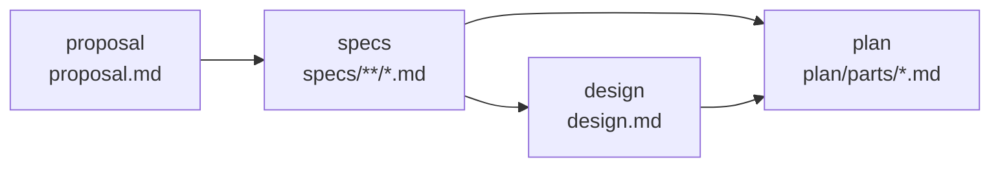

# Design

## Context

ADR-0003 (D2-2) and the design section "Change artifacts: the BDK OpenSpec schema" fix what the schema is; this design decides how it is built and shipped. Facts checked against OpenSpec 1.13.2 (the version `CLAUDE.md` and PR CI pin):

- A project schema is resolved from `<project>/openspec/schemas/<name>/schema.yaml` before the user directory (`$XDG_DATA_HOME/openspec/schemas`) and the package's built-in schemas. `openspec schema which|validate|fork|init` are marked experimental.
- `schema.yaml` is `name`, `version`, `description`, `artifacts` (each `id`, `generates`, `description`, `template`, `instruction`, `requires`) and an optional `apply` (`requires`, `tracks`, `instruction`). `generates` may be a glob; an artifact is complete when a file matches it.
- A prototype schema with `plan` generating `plan/parts/*.md` and no `apply` section worked end to end in a temporary project: `openspec new change --schema bdk`, `status` (blocked artifacts named), `validate --strict`, and `archive`, which merged the delta, printed "Task status: No tasks" and moved `plan/parts/` into the archive with the rest. Without `apply`, `applyRequires` defaults to every artifact.
- OpenSpec's change validator expects `## Why` and `## What Changes` in `proposal.md` and warns without them.
- `scripts/publish-plugin.ts` ships every path of a plugin directory outside `src`, `tests`, `evals` and `node_modules` (and root `tsconfig*.json`).
- `.prettierignore` skips `*.md`; YAML is formatted by prettier.

## Goals / Non-Goals

**Goals:**

- A schema `/bdk:setup` (#181) installs with one copy and the stage skills write against.
- A part format that `bdk plan check` (#185), `bdk git groups --plan` (#186) and `bdk run status` (#188) read without guessing.
- A version bump of OpenSpec that breaks the schema fails `pnpm test`.

**Non-Goals:**

- No `bdk` command and no `src/` slice: nothing in this Change needs to compute anything at run time.
- No parser or validator of part frontmatter in the CLI; `bdk plan check` (#185) owns reading parts.
- This repository keeps `spec-driven` for its own work (`openspec/config.yaml`).

## Decisions

### D1. The schema lives at `plugins/bdk/openspec/schemas/bdk/`

The directory mirrors its install target, `openspec/schemas/bdk/` of a project, so the install is `cp -R "${CLAUDE_PLUGIN_ROOT}/openspec/schemas/bdk" openspec/schemas/bdk` and nobody has to remember a mapping. Layout:

```
plugins/bdk/openspec/schemas/bdk/
  schema.yaml
  templates/
    proposal.md
    spec.md
    design.md
    part.md
```

Alternatives: `plugins/bdk/schemas/bdk/` - lost, it reads like the CLI's `schema/` layer (zod schemas of `--json` results) and breaks the mirror. Generating the schema from code at setup time - lost, two sources of one text. `claude plugin validate plugins/bdk --strict` passes with the extra top-level directory (checked in task 2.1). The plugins-reference "Standard layout" (fetched for this Change) gives default locations only for components and shows a plugin with its own `scripts/` folder next to them, so a non-component directory is plain plugin content; "Environment variables" says `${CLAUDE_PLUGIN_ROOT}` is substituted in skill content, so `/bdk:setup` can name the source path in its text.

### D2. Installation is a copy, done by `/bdk:setup`; no CLI command

`/bdk:setup` (#181) copies the directory into the project and runs the OpenSpec init. This Change only guarantees that the directory is complete and released.

Alternatives: a `bdk openspec install` command - lost, a CLI helper needs a measured problem (`CLAUDE.md`, "Building skills (v3)"; `.claude/rules/bdk-cli.md`), and a copy is one shell line. `openspec schema fork` - lost, it forks a schema that OpenSpec already resolves, not a directory path. Installing into the user data directory (`$XDG_DATA_HOME/openspec/schemas`) - lost, it is per machine and not committed, so team members and CI would resolve different schemas; the project copy is committed with the Changes that use it (design section "Change artifacts": "The Change is committed").

### D3. Four artifacts, one chain

`proposal` -> `specs` -> `design` -> `plan`, with `plan` also requiring `specs` (its acceptance scenarios come from the spec deltas):



Alternative: `design` requiring only `proposal`, as in `spec-driven` - lost, the architecture diagram orders specs before design, `/bdk:design` writes the specs first and design decisions cite requirements, and `verify-design` checks both together.

### D4. Templates and instructions

Each instruction says what the artifact is for in the BDK flow, what it must hold and what it must not hold; each template is the section skeleton with HTML-comment placeholders, the convention of the stock schema.

| Artifact | Template sections | Instruction highlights |
|---|---|---|
| `proposal` | Why, What Changes, Capabilities (New, Modified), Out of scope, Impact | Capabilities are the contract with `specs`; reuse existing capability paths (`openspec list --specs`); `skip_specs: true` only when no behaviour changes; why over how |
| `specs` | Purpose (new capabilities only), ADDED/MODIFIED/REMOVED/RENAMED Requirements, `####` scenarios in WHEN/THEN | The stock delta format, unchanged, because `openspec archive` parses it; every scenario is something `e2e-check` or a test can drive, since parts take their acceptance scenarios from here |
| `design` | Context, Goals / Non-Goals, Decisions (each with alternatives and why they lost), Diagrams (Mermaid), Risks / Trade-offs, Open Questions | Mermaid for any flow, structure or state that prose would leave ambiguous; open questions only when deferring them changes neither specs nor plan |
| `plan` | Part frontmatter (D5), Goal, Acceptance scenarios, Tasks (contract: change, done when) | One file per part; size a part for one implementer; `depends-on` only where a part needs another's result; `files` exact; `shared` only when a part cannot run in a worktree |

The proposal keeps `## Why` and `## What Changes` so OpenSpec's validator stays silent. "Out of scope" is added to the stock proposal because BDK's propose stage names what another Change owns.

Alternative: reuse the stock templates verbatim for `proposal`, `specs` and `design` by reference - lost, a project schema cannot reference another schema's templates, and copies drift silently from the BDK stages they are meant to match.

### D5. The part format

```markdown
---
id: "01"
depends-on: []
isolation: worktree
files:
  - src/feature/thing.ts
  - src/feature/thing.test.ts
---
```

- `id` is the file stem, quoted: unquoted `01` is the integer 1 in YAML 1.2, and a reader comparing ids to file stems would then disagree with itself.
- `depends-on` names other parts' ids; cycles and waves are `bdk plan check`'s job (#185), not the schema's.
- `isolation`: `worktree` (default; the part runs in its own worktree, in parallel with others of its wave) or `shared` (the part runs in the Change checkout, alone in its wave; design section "Execute").
- `files` lists exact repository-relative file paths, new files included; no globs and no directories, so overlap between parts of a wave is a set intersection (`bdk plan check`, design section "Risks", worktree merge conflicts) and `bdk git groups --plan` (#186) maps changed files to parts without a matcher. Agreed with the #186 and #188 agents during this Change.

Alternatives: a single `plan.md` with a section per part - lost, the architecture decides one file per part so that a part agent reads only its own file. `tasks.md` with checkboxes - lost, progress is run state (D6). JSON or YAML part files - lost, tasks are prose for a model; frontmatter keeps the machine-read fields and the prose in one file. `files` as globs - lost, overlap of two globs is not decidable by simple comparison and a plan names the files it touches anyway.

### D6. No `apply` section

The schema has no `apply` block, so `apply.tracks` is absent and `applyRequires` is every artifact. `/bdk:execute` (#200) reads the parts and keeps progress in `state.json`; OpenSpec's apply flow is not part of the BDK process.

Alternative: `apply` with `tracks: null` and an instruction naming `/bdk:execute` - lost, it adds a section that no BDK skill reads; `openspec instructions apply` is not called by BDK.

### D7. Pinned OpenSpec, an integration test, and the fallback

`@fission-ai/openspec` 1.13.2 becomes an exact dev dependency of `plugins/bdk` (the package that owns the schema), and `plugins/bdk/tests/openspec-schema.test.ts` runs that CLI against the shipped directory in a temporary project, covering every scenario of `bdk-openspec-schema` that needs OpenSpec. The test runs the CLI from the dev dependency's link, `plugins/bdk/node_modules/@fission-ai/openspec/bin/openspec.js`, with `process.execPath`, and asserts that package's version is the pin (resolving through `require.resolve` fails: the package's `exports` hides `package.json`), and isolates it: `HOME`, `XDG_CONFIG_HOME` and `XDG_DATA_HOME` point into the temporary directory, `OPENSPEC_TELEMETRY=0` and `DO_NOT_TRACK=1`.

Fallback when a later OpenSpec release changes project schemas: the pin holds the version (PR CI and `CLAUDE.md` here, `/bdk:setup` in user projects, #181); a bump that breaks the schema fails this test and does not merge. If project schemas are dropped or changed beyond repair, BDK falls back to the architecture risk table's answer: the stock `spec-driven` schema for proposal, specs and design, and plan parts as plain files at the same `plan/parts/NN.md` path. Skills and the CLI read parts as files, never through OpenSpec, so the fallback changes the install and the proposal-to-design instructions, not the plan format or anything downstream.

Alternatives: test with the globally installed OpenSpec in the `openspec` job of PR CI - lost, `pnpm test` is what every contributor and agent runs, and a global install differs per machine. No test, only the CLAUDE.md pin - lost, the issue asks for a fallback, and the first line of a fallback is knowing that it is needed.

### D8. Tests

- `plugins/bdk/tests/openspec-schema.test.ts`: copy the shipped directory into a temporary project (`openspec/` with `changes/` and `specs/`); `schema which` and `schema validate`; `new change --schema bdk` then `status --json` (artifact order, `requires`, ready and blocked); `instructions plan --json` carries the part template; write a complete Change from the templates (filled in) and check `status` complete and `validate --strict`; `archive --yes` and check the merged main spec and the archived `plan/parts/01.md`.
- The same file reads `schema.yaml` and `templates/part.md` from disk: every template the schema names exists, no `apply` key, the part frontmatter has the four keys with a quoted `id` and a valid `isolation`. The checks use plain text matching, because `plugins/bdk` has no YAML dependency yet (#179 adds `yaml`); OpenSpec's own validation covers the YAML structure.
- The release snapshot scenario is covered by `scripts/publish-plugin.ts`'s existing rule (only `src`, `tests`, `evals`, `node_modules` are development-only) and checked by hand in the acceptance task: the files list of the snapshot rule is applied to `plugins/bdk/`.

## Risks / Trade-offs

- [Project schemas are experimental in OpenSpec] -> pinned version, integration test, documented fallback (D7).
- [`@fission-ai/openspec` adds packages to the install] -> dev dependency only; nothing ships in `dist/bdk.mjs` or the release snapshot.
- [Parallel Changes edit `plugins/bdk/package.json` and the lockfile (#179 adds zod and yaml)] -> the second PR keeps both and regenerates the lockfile with `pnpm install`.
- [The part format is fixed before its readers exist (#185, #186, #188)] -> the format was agreed with the agents building #186 and #188 while this Change ran; a change later is a delta to `bdk-openspec-schema`.

## Open Questions

None.
