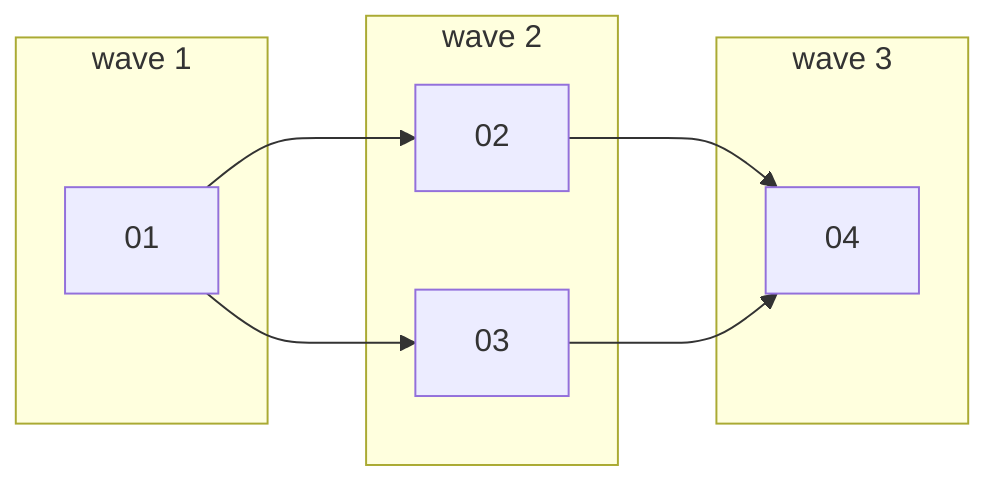

# Design

## Context

See proposal.md - Why. Facts this design builds on:

- The part format is `bdk-openspec-schema` (#180, design D5): `plan/parts/NN.md`, frontmatter `id` (quoted two-digit stem), `depends-on`, `isolation` (`worktree` or `shared`), `files` (exact repository-relative paths, no globs, no directories); the body has `## Goal`, `## Acceptance scenarios` and `## Tasks` with numbered tasks.
- The limits are settings of the `config` slice (#179): `plan.part.max-tasks` (5), `plan.part.max-files` (10), `plan.part.max-bytes` (8192). `config/index.ts` exports `loadConfig`, which returns the resolved settings, `not-configured` with what is missing, or `invalid` with the problems. No slice used it yet.
- Two slices already read part files, each for its own need: `git` (`git/domain/plan.ts`, `git/store/plan.ts`) reads `files` and turns an unreadable part into `env/plan-invalid`; `run` (`run/store/status.ts`) lists the part ids only.
- The CLI frame (`shared/cli`) gives commands positional arguments, string and boolean flags, `--json`, `CliError` codes and exit 1 for "the answer is no".

## Goals / Non-Goals

**Goals:**

- One call gives `/bdk:plan` every deterministic answer about a plan: sizes against limits, dependency faults, waves, overlap and `shared` placement, each tied to part ids.
- Output a model reads in one pass and a skill can branch on (`ok`, exit code).

**Non-Goals:**

- No fixing: the command never splits, reorders or rewrites parts, and never picks a wave for a `shared` part.
- No check of the part body beyond counting tasks (goal, acceptance scenarios and task wording are `verify-plan`'s job).
- No check that listed files exist: a part may create them.

## Decisions

### D1. A new slice `plan`, importing `config`

`src/plan/` with the standard layers, one file per command: `commands/check.ts`, `use-cases/check.ts`, `domain/part.ts` (parse and measure one part), `domain/check.ts` (the plan checks and waves), `store/parts.ts` (reads the directory), `render/check.ts`, `schema/check.ts`, `tests/`. Its matrix row imports `config`, for `loadConfig`, a use case the `config` slice owns (`bdk-cli` spec, "Import matrix"). `main.ts` passes `{ files, cwd, home, env }`, the `ConfigDeps` that `loadConfig` needs.

Alternatives: a verb in `git` or `run` - lost, a plan check is neither review scope nor run state, and a group per noun is the slice rule (`.claude/rules/bdk-cli.md`). Reading `.bdk/settings.yaml` in the `plan` slice - lost, it would skip the global and local layers and duplicate the validation the `config` slice owns.

### D2. The slice keeps its own part reader

`plan/domain/part.ts` parses the full frontmatter with `yaml` and returns problems as values. It does not reuse `git/domain/plan.ts` and does not move part parsing into `shared/`.

Alternatives: import `git`'s reader through `git/index.ts` - lost, `git` reads only `files` and throws `env/plan-invalid`, while `plan check` must validate every key and report each fault as a check result; the readers share the file name rule and the frontmatter split, a few lines. Move a part reader into `shared/` - lost, the `shared/` admission needs three importers of the same code, and `run` reads only file names. When a third slice needs the full frontmatter, the `plan` reader is the candidate to move.

### D3. `<dir>` is a required argument, the `plan/parts/` directory

`bdk plan check openspec/changes/<change>/plan/parts`. The same directory `bdk git groups --plan <dir>` takes; it works for an active Change, an archived one and a fixture, and the skill already knows the path because it wrote the parts there.

Alternative: a Change name resolved to `openspec/changes/<name>/plan/parts` - lost, it ties the command to one layout, needs name validation against path injection (as `run` had to add) and cannot check a draft plan elsewhere.

### D4. Plan faults are the answer, not errors

Every fault in the parts, an unreadable frontmatter included, is a problem in the result with exit 1. Only what stops the command from checking anything is an error: a missing directory (`env/plan-missing`, the code and meaning `git groups` uses), an unconfigured project (`env/not-configured`, new) and an invalid configuration (`env/config-invalid`, the code `config set` already uses for the same condition).

Alternative: `env/plan-invalid` for an unreadable part, as in `git groups` - lost, there a broken part stops the grouping; here finding broken parts is the job, and stopping at the first one would hide the rest from `plan-draft`.

### D5. An unconfigured project is an error, not silent defaults

`plan check` calls `loadConfig`; `not-configured` and `invalid` become the errors of D4 with hints `/bdk:setup` and `bdk config check`.

Alternative: fall back to the default limits - lost, the `bdk-cli/config` spec says only `/bdk:setup` is meant to run without a configuration, and a broken settings file that silently yields defaults hides a team's chosen limits.

### D6. Waves by longest path; a `shared` part is reported, not placed

Wave of a part = 1 without dependencies, else 1 + the latest wave of its dependencies; computed only over parts whose dependency chain is complete (no frontmatter problem, no unknown id, no cycle). Cycles are the strongly connected components of the `depends-on` graph with more than one part, plus self-loops (Tarjan's algorithm, ids visited in order so output is stable).



A `shared` part that lands in a wave with other parts is a `shared-not-alone` problem. `plan-draft` resolves it by adding a `depends-on` edge, which keeps the waves the lead runs identical to the waves the plan states.

Alternative: the CLI moves a `shared` part into its own wave before or after its wave mates - lost, whether the `shared` part goes first or last is a plan decision (which contract the others build on), and the CLI never decides the order of work (ADR-0003 principle 6, `bdk-cli` "Commands help, they never govern").

### D7. The output format read by `plan-draft`

Text, for a model reading a Bash result, sections in a fixed order:

```
plan: 3 parts, 2 waves, 2 problems
waves:
  1: 01
  2: 02 03
parts:
  01  worktree  tasks 4/5  files 9/10  bytes 5120/8192  wave 1  depends-on -
  02  worktree  tasks 6/5  files 3/10  bytes 2100/8192  wave 2  depends-on 01
  03  shared    tasks 2/5  files 2/10  bytes 1300/8192  wave 2  depends-on 01
problems:
  max-tasks 02: 6 tasks, above plan.part.max-tasks 5
  shared-not-alone 03: shared part 03 runs in wave 2 with 02
```

The summary line answers the common case in one line; counts sit next to their limits, so `plan-draft` sees how much room a part has before splitting; a problem line starts with its check and part ids, so the next instruction (`split 02`) follows from the line alone. Columns are padded to the widest value, as `run status` does. `--json` (`schema/check.ts`, zod) carries `ok`, `limits`, `parts`, `waves`, `problems` for skills that branch on fields.

Alternative: problems only - lost, the architecture asks for the wave count next to the sizes ("Stages and units of work") so the plan is judged on depth even when it has no fault. The draft 1 format (`part list` items with state and done counts) - lost, state is run state (`bdk run status`), not a plan property.

### D8. Measuring a part

- Tasks: numbered list items (`^\d+[.)] `) in the `## Tasks` section up to the next `#` or `##` heading, outside fenced code blocks. Nested numbered sub-items are indented, so they do not count. The template writes tasks as `1. ...` under `## Tasks`.
- Files: distinct strings of `files`. A path is rejected when absolute, with a `..` segment, ending in `/`, or holding `*` or `?`; `[` and `]` stay allowed because route files like `app/[id]/page.tsx` use them.
- Bytes: the UTF-8 byte length of the file text as read (the file size).
- A value equal to the limit passes; the schema says "at most".

### D9. Tests

- Unit tests in `src/plan/tests/`: `part.test.ts` (frontmatter rules, task counting, measures), `check.test.ts` (limits, unknown ids, cycles, waves, overlap, `shared`, problem order), `use-cases.test.ts` against an in-memory `Files` (configuration states, missing directory, stray files, nothing written), `render.test.ts` (text format).
- `plugins/bdk/tests/plan.test.ts`: the frame, the slice and the real file system on a temporary configured project, the acceptance signal end to end: an oversized part, a cycle and an overlap each reported with the part id, waves in order, exit codes 0 and 1, `--json` valid against the schema, `env/plan-missing` and `env/not-configured`.

## Risks / Trade-offs

- [Two part readers (`git`, `plan`) can drift on the file name rule] -> both follow `bdk-openspec-schema`; `plan` is strict (two digits) because it validates the plan, `git` is lenient because it only groups. A later move to `shared/` is noted in D2.
- [Task counting depends on the template's `## Tasks` heading] -> the heading is part of the shipped template and instruction (#180); a part without it reports `no-tasks`, which points `plan-draft` at the cause.
- [`plan`, `check` (#183) and `rules` (#184) each turn `loadConfig`'s `not-configured` and `invalid` into the same two errors] -> the three agreed on the codes and hints while their Changes ran; if the mapping drifts, it moves into a `config` use case that every reader imports, not into `shared/`.
- [Parallel Changes edit `src/slices.ts` and `src/main.ts`] -> one row and one entry each; the rebase keeps every slice's row and entry.

## Open Questions

None.
