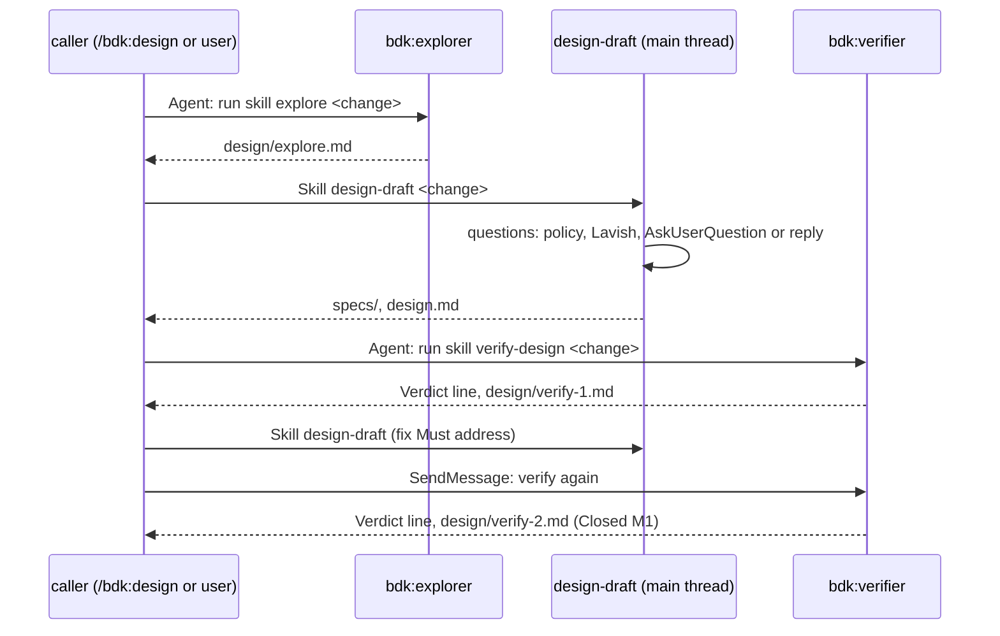

## Context

The design stage of the architecture ("Catalog", "Flows / Design") composes three blocks: `explore` on `bdk:explorer` (haiku), `design-draft` in the main thread, and `verify-design` on `bdk:verifier` (opus), "continued with `SendMessage` across iterations". `/bdk:design` (#198) runs the loop; this Change builds the blocks it composes. The skills decisions fix two contracts: D4 (Lavish optional, `AskUserQuestion` otherwise, eval cases for both) and D6 (verifier report body).

What exists in `plugins/bdk`: the CLI (`bdk config show` prints the resolved configuration or "BDK not configured: run /bdk:setup"), the BDK OpenSpec schema (`openspec/schemas/bdk/`, artifacts `proposal`, `specs`, `design`, `plan`), `bdk run status` (reads `design/verify-N.md` by its first verdict line), the eval harness (#189) and one skill, `setup` (#181). No `agents/` directory yet. The rule pack has no rule for the `design` stage (rules carry `stages: [execute, review]`), so no block of this Change loads rules.

Material read, not copied: v2 `skills/design` with `agents/design-verifier.md` and `agents/explorer.md` on `main` (a long interactive design partner, classify step, YAML verdict with confidences and loop-back routing); `draft/v3-1` `skills/stages/design`, `stages/verify-design`, `roles/design-verifier` (kernel `bdk next`, `attempt open`, dispatch packages, ledger entries, report envelope). What they got right and stays: ground in the code before asking, two or more approaches with diagrams and a concrete self-critique, a verifier on a fresh context that checks claims against the code, schema changes approved by the user. What goes: the kernel, the ledger, the envelope, the classify step, the confidence scores.

Probes run for this Change on Claude Code 2.1.293 (`claude -p --plugin-dir <probe>`, model haiku):

| Probe | Result |
|---|---|
| A `context: fork` skill with `agent: <plugin>:<agent>`, called by the main thread | Ran on the agent; the result was `Skill "..." completed (forked execution). Result: ...` with no agent ID, so the fork cannot be continued with `SendMessage` |
| `Agent(subagent_type: <plugin>:<agent>)` whose prompt calls a plugin skill through `Skill` | The skill's `!` block resolved inside the agent; the `Agent` result carried an `agentId`; `SendMessage` to it resumed the same agent, which checked again |
| Subagent `Write` of `report-1.md` | Refused by the host: "Subagents should return findings as text, not write report files." |
| Subagent `Write` of `.bdk/runs/demo/design/verify-1.md` and `design/explore.md` | Written |
| `AskUserQuestion` in `claude -p` | Not available: not in the tool list, `ToolSearch select:AskUserQuestion` finds nothing |
| `npx -y lavish-axi` in a directory whose `node_modules/.bin` holds a `lavish-axi` | The local binary runs, offline; without it `npx --no-install lavish-axi` finds a global install |

## Goals / Non-Goals

**Goals:**

- Three blocks that each run alone, each with one job, each writing one kind of file, each with eval cases that show an effect over no plugin (issue "Acceptance signal").
- A verifier that a caller can continue across iterations (issue "Scope"), with item IDs that stay stable (D6).
- Questions that never block an autopilot run and never ask what the code answers.

**Non-Goals:**

- The loop, its budget and the design gate: `/bdk:design` (#198).
- Any `bdk` command or hook: no eval or measurement shows a problem a helper would solve (CLAUDE.md "Building skills (v3)").
- Rules for the design stage: the rule pack has none; adding them is rule-pack work.

## Decisions

### D1. Three skills and two agents, flat under the plugin

`plugins/bdk/skills/explore/`, `skills/design-draft/`, `skills/verify-design/`, each a plain `SKILL.md` with at most one reference file; `plugins/bdk/agents/explorer.md` and `agents/verifier.md`. Skill names are the block names of the catalog, so the commands are `/bdk:explore`, `/bdk:design-draft`, `/bdk:verify-design`.

Every skill starts with the `!` block `"${CLAUDE_PLUGIN_ROOT}/bin/bdk" config show` and `allowed-tools: Bash(${CLAUDE_PLUGIN_ROOT}/bin/bdk *)` (architecture "Configuration and extension points"; the `bin/` path form from #181 D2, since `bin/` is not on `PATH` in eval runs). Its first instruction stops on "BDK not configured".

Alternatives: nested `skills/blocks/<name>/` - lost, needs a `skills` manifest key (HOST-FACTS `roles-nested-default`) for no gain. One `design` skill with three modes - lost, "one block, one job" and an eval case per block.

### D2. An agent block is started as an agent that runs the skill

The caller starts `Agent(subagent_type: "bdk:verifier", prompt: "Run the skill bdk:verify-design for the Change <name>.")`; the agent calls `Skill`, so the skill text, its `!` block included, reaches the agent, and the caller gets the agent ID for `SendMessage`. Each agent block's skill opens with a hand-off: when it runs anywhere but in its agent (a user typed the command in the main thread), it starts its agent that way, waits, and replies with the agent's result. The skill body is written for the agent.

Why: the issue requires `verify-design` to be continued with `SendMessage`, and the probe shows a `context: fork` skill returns no agent ID. A continued verifier keeps what it read of the code, so a second pass reads only what changed.

Alternatives: `context: fork` + `agent:` - lost, no agent ID (probe), and in `claude -p` forks run one at a time (HOST-FACTS `fork-concurrency`). Preloading the skill with `skills:` in the agent file - lost, `bdk:verifier` serves three blocks and would carry all three skills into every run; it also gives a user no way to run the block alone. The process in the agent's body - lost, logic lives in skills (architecture "Principles" 1). `explore` follows the same pattern as `verify-design` so the caller can continue the explorer with a follow-up question (v2 reused warm explorers the same way) and both agent blocks have one shape. #191 adopted this pattern for `verify-plan`.

### D3. Run files

| File | Writer | Content |
|---|---|---|
| `.bdk/runs/<change>/design/explore.md` | `bdk:explorer` | `## Touches`, `## Patterns`, `## Tests`, `## Gaps`, `## Unsure`; every claim with `file:line`; a continuation appends `## Follow-up <n>` |
| `.bdk/runs/<change>/design/verify-N.md` | `bdk:verifier` | D6 body, N one above the highest existing report |
| `openspec/changes/<change>/specs/**/spec.md`, `design.md` | `design-draft` (main thread) | Per the Change's OpenSpec schema |

The names are the ones `bdk run status` (spec `bdk-cli/run`, "Files the derivation reads") and the architecture's run-state table already use. The probe matters here: the host refuses a subagent's write to a file named like `report-1.md`, so no agent of this Change writes a file with "report" in its name. The reply to the caller is short (verdict line or path, at most three lines): the content is in the file, and the caller's context stays small (findings "The main thread is the most expensive agent").

Change resolution: the argument names the Change; without one, the only directory under `openspec/changes/` other than `archive/`; with several or none, the block names them and stops. No block writes `run.json` or `state.json` (one writer per state file, architecture "Principles" 5).

Alternatives: one report file per Change overwritten each pass - lost, resume reads the last `verify-N.md` and the stable IDs need the previous one.

### D4. Questions: policy first, then Lavish, then `AskUserQuestion`, then the reply

Per D4 of the skills decisions, and `policy.questions` from `bdk config show` (spec `bdk-cli/config`):

1. `decide-and-record`: ask nothing, take the recommended answer, and write `Decided without the user: <reason>` under the decision in `design.md`, so the user and `/bdk:run`'s final report see every such decision.
2. Otherwise collect every open question first, then ask once: write the page `.lavish/design-<change>.html` (a form per decision, recommended option first), open it with `npx -y lavish-axi <page>`, and wait with `npx -y lavish-axi poll <page>`.
3. When the open command exits non-zero (Lavish missing and no network, no browser): `AskUserQuestion`, at most four questions per call.
4. When `AskUserQuestion` is not available (`claude -p`, evals; probe): list the questions in the reply, recommended answer first, and end the turn. The user answers in the conversation; the skill continues from there.

Nothing decision-dependent is written before the answers; the code map and the reading are done once. A data-model change is always a question under `stop`, even with a clear recommendation (draft 1 `schema-gate.md`): approval of a design is not approval of a schema.

"When the session can open a browser review" (D4) is decided by trying: the open command either opens a page or fails. Alternatives: a configuration key choosing the path - lost, a config spec change without a measured need, and D4 says `/bdk:setup` reports, not configures, the path. Checking `command -v lavish-axi` - lost, Lavish runs through `npx -y` without an install, and an installed CLI says nothing about a browser. `AskUserQuestion` always - lost by D4; draft 1 showed one Lavish page beat 13 rounds of questions.

### D5. The schema decides the shape of specs and design

`design-draft` gets each artifact's instruction and template from `openspec instructions <artifact> --change <change> --json`, which also carries the project's `openspec/config.yaml` rules; when the OpenSpec CLI does not run, it reads `openspec/schemas/<schema>/schema.yaml` and its templates. It writes `specs` before `design` (the schema's order) and finishes with `openspec validate <change> --strict` when the CLI runs, fixing what it reports. The approach and self-critique guidance (what an approach holds, the four critique questions) is a reference file read when a decision branches.

Alternatives: restating the BDK schema's instruction in the skill - lost, two texts that drift, and a team's own schema or rules would be ignored.

### D6. What `verify-design` checks, and how it sorts

Checks, in the order a verifier reads: claims about the code (read the file and line); capability coverage (each capability in the proposal has a delta; each requirement has a WHEN / THEN scenario that can run against the product); design coverage (each requirement and each "What Changes" bullet has an answer; no contradiction); decisions with alternatives; constraints and NFRs met or deferred; diagrams present for flows and matching the prose; risks concrete; open questions honest; the design names the modules and interfaces plan parts will touch.

`Must address` = a defect that would make the plan or the product wrong: a false claim about the code, a requirement with no answer or a contradicted one, a capability without a delta, a scenario that cannot run, a failure path the spec implies and the design ignores, a decision against the proposal. Everything else is `Should consider`. This follows D2 of the skills decisions (behaviour decides the level) and keeps draft 1's lesson that a false code claim is the defect worth a round (L-fw9ettz8).

Report: D6 body as `agents/verifier.md` states it, with a `Closed: <IDs>` line under the verdict on later passes (agreed with #191); each `Must address` item has an `Evidence:` line. Stable IDs come from the previous report file, not from the agent's memory, so they hold whether the caller continued the agent or started a fresh one after a compaction.

Alternatives: v2's YAML verdict with confidences and loop-back routing - lost, D6 replaced it and the orchestrator decides the loop. A verifier that also fixes - lost, one block one job (the author block fixes).

### D7. Agents

| Agent | Model | Tools | Body |
|---|---|---|---|
| `bdk:explorer` | haiku | Read, Grep, Glob, Bash, Write, Skill | Read-only explorer; writes only the run file its block names |
| `bdk:verifier` | opus | Read, Grep, Glob, Bash, Write, Skill | Runs the named skill first; checks, never fixes; writes only its report; the D6 body with IDs and `Closed:` |

`Bash` is for read-only commands (`git log`, `ls`, a test run a claim needs); `Write` only for the run file. Neither has `Edit`. The bodies are short and generic, since the block's skill holds the work. `verifier.md` and the `bdk-verifier` spec are copied verbatim from #191, which wrote them first, so the two Changes merge without a conflict of intent.

### D8. Eval cases

Shared fixture `evals/fixtures/ledger-proposal.sh`: the `tiny-ledger` fixture plus a ledger store module, `.bdk/settings.yaml` (`languages`, `tools.test`), OpenSpec with the BDK schema copied from the plugin, and the Change `add-csv-export` whose proposal names the capability `ledger-export` and leaves the CSV delimiter and amount format open. Case scaffolds add what only they need.

| Case | Adds | Graders |
|---|---|---|
| `explore-csv-export` | - | `file_exists` explore.md; `regex` sections and a `src/...js:<n>` reference; `tool_used` Agent `bdk:explorer`; `tool_used` Skill |
| `design-draft-lavish` | explore.md; a `lavish-axi` stub in `node_modules` that opens and whose `poll` answers "semicolon, integer cents" | `file_exists` design.md and the spec delta; `regex` semicolon in the spec delta; `tool_used` Write of the page `.lavish/design-add-csv-export.html`; `tool_used` Skill |
| `design-draft-ask` | explore.md; a stub that exits 1 ("cannot open a browser") | `llm` reply says the review page could not open; `llm` reply lists the questions with a recommendation; `tool_used` Skill |
| `design-draft-auto` | explore.md; `policy.questions: decide-and-record` | `file_exists` design.md and spec delta; `regex` `Decided without the user:`, a mermaid block, `#### Scenario:`; `tool_order` Read explore.md before Write design.md; `tool_used` Skill |
| `verify-design-false-claim` | specs and a design that cites a missing `formatAmount` | `file_exists` verify-1.md; `regex` `^Verdict: FAIL` and `formatAmount` under `Must address`; `tool_used` Agent `bdk:verifier`; `tool_used` Skill |
| `verify-design-second-pass` | a fixed design and `verify-1.md` with `M1`, `S1` | `file_exists` verify-2.md; `regex` `^Verdict: PASS` and `Closed: M1`; `tool_used` Agent `bdk:verifier` |

The Lavish stub is a local `node_modules/lavish-axi` package: `npx -y` runs a local binary first and offline (probe), so the case is deterministic and needs no browser. Paid runs grant `Bash(*/bin/bdk *)`, `Bash(openspec *)`, `Bash(npx -y lavish-axi *)` and `Bash(git *)`; graders use only steps the free CI check can load with `Write Edit`.

Alternatives: grading the Lavish path by a real browser - lost, no browser in an eval run. One case per block - lost, D4 requires both question paths, and the second verifier pass is the only cheap check of stable IDs.

## Diagrams

## Risks / Trade-offs

- [The main thread does the agent block's work itself instead of handing off] -> the hand-off is the skill's first instruction; the eval cases grade `tool_used` Agent with the agent type.
- [A continued verifier remembers its first reading and misses a new defect] -> on each pass it rereads the files that changed and every file a `Must address` item names; the caller can start a fresh agent, and stable IDs come from the previous file either way.
- [The Lavish poll waits forever in a run nobody watches] -> auto mode (`decide-and-record`) shows no page (D4); a non-interactive run without that policy is a configuration error the reply makes visible.
- [haiku explorer reads too little or too much] -> the skill bounds it (the proposal's nouns first, then callers one level out) and the eval grades the sections and `file:line` references.
- [`verifier.md` written by two Changes at once] -> the same contract agreed with #191; the second merge keeps one file.
- [Eval cost] -> six cases; probes with `--runs 1`, results recorded in this Change.

## Open Questions

None.

## Results

Paid eval runs on 2026-10-08, Claude Code 2.1.292, `--runs 1`, with and without the plugin, grants per `evals/README.md`, clean `HOME`:

| Case | WITH | W/OUT | Δ | Cost with | Time with |
|---|---|---|---|---|---|
| `explore-csv-export` | 1.00 | 0.00 | +1.00 | $0.21 | 68 s |
| `design-draft-lavish` | 1.00 | 0.00 | +1.00 | $0.51 | 109 s |
| `design-draft-ask` | 1.00 | 0.50 | +0.50 | $0.20 | 30 s |
| `design-draft-auto` | 1.00 | 0.83 | +0.17 | $0.47 | 92 s |
| `verify-design-false-claim` | 1.00 | 0.00 | +1.00 | $0.32 | 41 s |
| `verify-design-second-pass` | 1.00 | 0.50 | +0.50 | $0.29 | 57 s |

Every block scores higher with the plugin. Without it, the model maps the code in the reply instead of a run file, never asks through a review page, decides silently, and starts no verifier agent.

Found while running them:

- In `design-draft-ask`, the block learns that Lavish cannot open from `npx -y lavish-axi playbook input` and never writes the page. The first grader (a `Write` of the page) failed both arms; it was replaced by an `llm` grader on the reply naming the failed review page.
- `claude plugin eval --case` takes one glob: no `{a,b}`, and a repeated `--case` keeps only the last. The README runs the three groups in a loop.
- Acceptance in a separate project (`claude -p --plugin-dir plugins/bdk`, tasks 4.1-4.2): explore 31 s and $0.20 on one `bdk:explorer`; design-draft under `decide-and-record` 91 s, six recorded decisions, `openspec validate --strict` passes; verify-design FAIL on a planted `formatAmount` (`M1`), design-draft fixed it, and `SendMessage` to the same verifier wrote the next report with `Verdict: PASS` and `Closed: M1, S2, S3, S4`, keeping `S1` and `S5` open.
