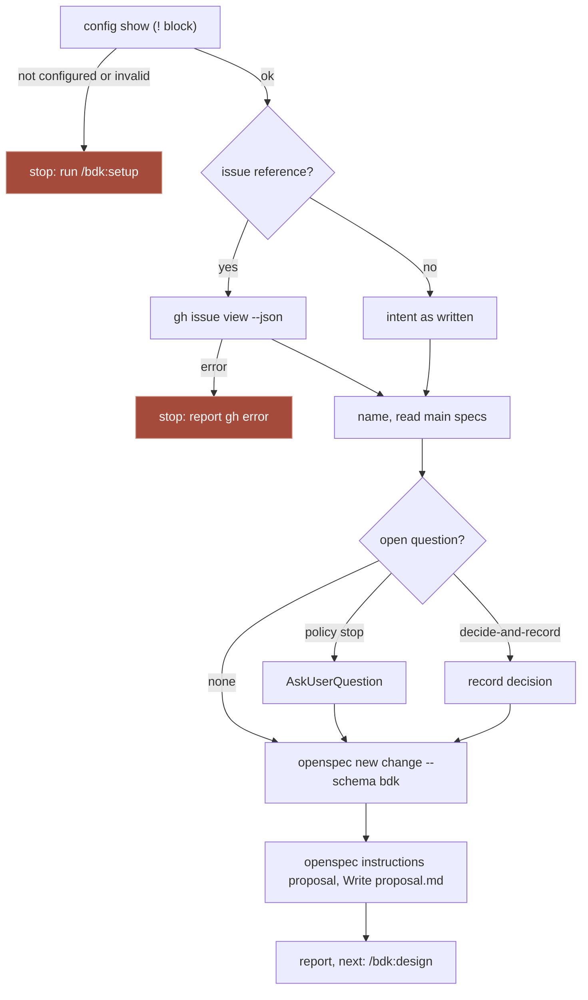

## Context

`/bdk:propose` is the first stage of a Change (design "Flows": propose, design, plan, execute, auto-review, close). It runs in the main thread (ADR-0003 "Orchestration": stages that talk to the user run there) and its output is `proposal.md` with capabilities (design "Catalog"). What it builds on:

- The BDK OpenSpec schema (#180, spec `bdk-openspec-schema`): its `proposal` artifact carries the full instruction and template (Why with the issue on the first line, What Changes, Capabilities, Out of scope, Impact; `skip_specs` for a Change with no behaviour change). `openspec instructions proposal --change <name>` prints both, with the project's `config.yaml` context and rules.
- `/bdk:setup` (#181): installs that schema and sets `schema: bdk`; it adds the allow rules `Bash(*/bin/bdk *)`, `Bash(openspec *)`, `Bash(gh *)` and `Bash(git *)` that propose needs.
- `bdk config show` (#179): exits 0 in every state and prints `BDK not configured: run /bdk:setup`, `BDK configuration invalid ...` or the resolved settings, including `policy.questions` (`stop` default, or `decide-and-record`).
- `bdk run status` (#188): resume row 1 sends a Change with no Change directory or no `proposal.md` to `propose`.
- The eval setup (#189, spec `skill-evals`): `block` cases graded on result and steps; the free CI check rejects a grader that cannot pass with the grants `Write Edit`, so step graders on `Bash` are not allowed (the setup cases grade Bash work through files and the trace instead).
- Inputs read, not copied: `draft/v3-1:skills/stages/change` (kernel `bdk change new`, branch question on every run, `--kind`, `--profile tiny` with a four-point check, refusal codes) and v2 on `main`, which had no proposal step (findings, "Stages were single skills; no proposal step"). Draft 1's skill described how to react to the kernel, not how to write a proposal (findings, "Architecture: root causes"); its branch question and profile choice have no counterpart in v3 (D9 of the skills decisions, no profiles).

Probes for this Change (OpenSpec 1.13.2, Claude Code 2.1.292):

| Probe | Result |
|---|---|
| `openspec new change csv-export --schema bdk` in a project with the schema | `.openspec.yaml` with `schema: bdk`; nothing else in the directory |
| `openspec new change 12-csv-export` | accepted: a name may start with a digit |
| `openspec validate <change> --strict` with only `proposal.md` | exit 1, "Change must have at least one delta": validate cannot check a proposal alone |
| `openspec status --change <change> --json` | `proposal` `done` once the file exists |
| eval run (`claude plugin eval`, clean `HOME`, `GH_TOKEN` exported, `Bash(gh *)` granted) running `gh issue view 197 --repo broneq/bdk` | exit 4, "To get started with GitHub CLI, please run: gh auth login": the run gets neither the caller's `gh` login nor `GH_TOKEN` |

## Goals / Non-Goals

**Goals:**

- One command turns an issue or an intent into an opened Change whose `proposal.md` the design stage can work from (issue, "Acceptance signal").
- Capabilities that match the project's main specs, so `openspec archive` later merges deltas into the right living spec.
- A fast stage: a few reads, one `openspec` call to open, one to read the instruction, one Write; questions only when needed.

**Non-Goals:**

- No branch, commit, PR or GitHub write (Out of scope in the proposal; skills decisions D9 and D3).
- No exploration of the code beyond what the Impact section needs: mapping the code is the `explore` block of the design stage (#190).
- No `bdk` command: no eval or measurement showed one is needed.

## Decisions

### D1. One plain skill in the main thread, model-invocable

`plugins/bdk/skills/propose/SKILL.md`, one file, no references: the proposal's sections and rules live in the schema, so the skill holds only the process (check, read the input, name, open, read specs, ask, write, check, report). It is model-invocable so that `/bdk:run` (#203) can call it with `Skill` and an eval prompt written as a user asks ("start a change for issue #42") fires it.

Alternatives: a `bdk:propose-author` agent - lost, the stage talks to the user (questions) and writes one small file, so an agent adds a cold start for nothing (findings, "Agents for work that takes seconds"); ADR-0003 puts propose in the main thread. Split into an author block and an orchestrator - lost, propose composes no other block; "one block, one job" holds with one skill whose job is the proposal.

### D2. The schema's instruction is the proposal's contract, read at run time

The skill runs `openspec instructions proposal --change <name>` and writes the file from its `<instruction>` and `<template>`, instead of repeating the sections in skill text. A project's `openspec/config.yaml` context and `rules.proposal` arrive in the same output, so a team's proposal rules reach the stage with no BDK setting.

Alternatives: the sections written into SKILL.md - lost, two sources that drift when the schema changes (it ships in the same plugin but is installed into the project, which may hold an older copy until setup re-runs). Reading `openspec/schemas/bdk/schema.yaml` directly - lost, it misses the project's context and rules.

### D3. Name: `<issue-number>-<slug>` from an issue, `<slug>` from an intent

Kebab-case, two to five words of the change. The issue number first keeps a Change findable from its issue and sorts Changes of a queue by issue. OpenSpec accepts a leading digit (probe). An existing Change of that name with a `proposal.md` is never overwritten: the skill reports it and stops, so a second call is safe; one without `proposal.md` (a crash between `openspec new change` and the Write, resume row 1) gets its proposal.

Alternatives: a date prefix (OpenSpec archive adds the date already). `issue-<n>` only - lost, says nothing in `openspec list`. Asking for a name - lost, a question the input answers.

### D4. Reading an issue: `gh issue view --json`, and nothing else on GitHub

`gh issue view <ref> --json number,title,body,labels,state,url`, one call, the fields the proposal needs. The skill passes the user's reference as given (`#42` is stripped to `42`; `owner/repo#42` becomes `42 --repo owner/repo`; a URL is passed as is). A failure stops the stage with the `gh` error: guessing an issue's content would write a wrong contract. Comments are not read: the issue body holds the scope in a BDK project (CLAUDE.md "SDLC", issue body sections), and comments add tokens without a measured gain.

Alternatives: `WebFetch` of the issue page - lost, private repositories and no structure. Reading comments too (`--comments`) - lost for v3.0, no case shows a need; a team whose scope lives in comments is the trigger to add it.

### D5. Capabilities checked against the main specs before writing

Before writing Capabilities, the skill lists the main specs (`openspec list --specs`) and reads in full each spec whose id or purpose touches the issue or intent (`openspec show <id> --type spec`). A Modified capability is an exact existing id; a New one is an id no spec has and that does not duplicate one; a Change that changes no behaviour sets `skip_specs: true`. This is the schema's instruction (D2); the skill makes it a checked step, because a wrong capability path is what the design stage and `openspec archive` cannot repair, and because the eval cases show it (a modified `ledger` spec instead of a near-duplicate new one).

Alternatives: leave capabilities to the design stage - lost, the schema makes the proposal the contract with the specs stage, and the design stage starts from it. Validate with `openspec validate` - lost, it rejects a Change with no deltas yet (probe).

### D6. Questions under `policy.questions`

Open questions are only those that change the scope: which of two readings of the intent is meant, a closed issue. Which capability holds a behaviour is not a question; the main specs settle it (D5). The first acceptance run asked exactly that, and the skill text now says so. With `stop` (the default) the skill asks them in one `AskUserQuestion` call before writing, the recommended answer first. With `decide-and-record`, or when `AskUserQuestion` is not available (`claude -p`, an eval run), it takes the recommended answer and records it in `## Decided without the user` in `proposal.md` and in the report. The section lives in the proposal because that is the file the design stage and a reviewer read; the schema template does not forbid sections, and OpenSpec ignores it.

Alternatives: always ask (draft 1 asked about the branch on every run) - lost, questions the input already answers are waiting time (design "Speed"). A run file under `.bdk/runs/<change>/` for the decisions - lost, a reader of the Change would not see them, and the run directory is local and uncommitted.

### D7. Configuration check by `!` block

The skill starts with `` !`"${CLAUDE_PLUGIN_ROOT}/bin/bdk" config show` `` (#181 D2: the variable is substituted, and bare `bdk` is not on `PATH` in eval runs) and stops on the "not configured" or "invalid" line before any other step. `allowed-tools` lists `Bash(${CLAUDE_PLUGIN_ROOT}/bin/bdk *)`, `Bash(openspec *)`, `Bash(gh issue view *)`, `Read`, `Write`, `Edit`, `Glob`, `Grep`, `AskUserQuestion`.

### D8. Offline `gh` stand-in for eval runs

Recorded problem: the probe in "Context" shows that an eval run cannot read a GitHub issue, so the acceptance signal ("an issue becomes a valid proposal") cannot be measured with the real `gh`. A case scaffold runs with only `PATH`, `HOME` and `TMPDIR` and its configuration is not loaded; the run inherits the caller's `PATH` (evals README, "Host limits"). So the suite ships `evals/fixtures/bin/gh`, a Node script (Node is always present where Claude Code runs) that answers `gh issue view` from `.git/bdk-eval/issues/<n>.json`, written by the case scaffold. `.git/` keeps the file out of the model's view of the project, so the case measures reading the issue through `gh`.

Where the stand-in lives was measured (Claude Code 2.1.292, `--scaffold` runs of the `bdk` plugin): with `plugins/bdk/evals/fixtures/bin` or a directory under `/private/tmp` first on `PATH`, `printenv PATH` in the run shows it first, yet `command -v gh` resolves `/opt/homebrew/bin/gh` and the case got "gh auth login": the run's sandbox does not let it execute a file outside its workspace. With the stand-in copied by the scaffold to `.git/bdk-eval/bin/gh` and the relative entry `.git/bdk-eval/bin` first on `PATH`, `command -v gh` resolves the stand-in and `gh issue view` answers from the issue file. So each case that reads issues copies the stand-in from its scaffold, and the README's run command puts `.git/bdk-eval/bin` first on `PATH`; the relative entry resolves only in a workspace that has it. It is a test double of the eval suite, not part of the plugin, and it is tested in `plugins/bdk/tests/evals.test.ts` with the cases.

Alternatives: a real public issue read with credentials - lost, the run gets no credential (probe), and network makes the case flaky. The issue pasted into the prompt - lost, it would not exercise the issue path the acceptance signal names. A `gh` shim in the workspace - lost, the run's `PATH` cannot include the workspace.

### D9. Eval cases and a shared configured fixture

| Case | Prompt (as a user writes it) | Graders |
|---|---|---|
| `propose-from-issue` | "Start a change for issue #42." | `file_exists` `openspec/changes/42-*/proposal.md`; `regex` on the trace: `gh issue view` ran, `openspec new change 42-... --schema bdk` ran, the written proposal names `#42` under Why, `ledger` under Modified Capabilities and `#40` under Out of scope; `tool_used` Skill |
| `propose-from-intent` | an intent about rejecting non-numeric amounts | `file_exists` `openspec/changes/*/proposal.md`; `regex` on the trace: `ledger` under Modified Capabilities; `tool_order` Read of the main spec before the Write of the proposal; `tool_used` Skill |
| `propose-not-configured` | the same intent in the plain `tiny-ledger` project | `file_exists` `openspec/changes/*/proposal.md` with `exists: false`; `llm` on the reply naming `/bdk:setup`; `tool_used` Skill |

Graders read the proposal through the trace (the `Write` call's content) because a `regex` file target is one fixed path and the Change name holds a slug the model chooses; `file_exists` takes a glob. Steps are graded with `tool_used`/`tool_order` on `Skill`, `Read` and `Write` only, and Bash steps through trace regexes, so the free CI check with the grants `Write Edit` loads the cases (#181 D9 did the same).

The shared fixture `evals/fixtures/tiny-ledger-bdk.sh` runs `tiny-ledger.sh`, then configures BDK as `/bdk:setup` leaves a project: `.bdk/settings.yaml` (languages, `tools.test`), `openspec/config.yaml` with `schema: bdk`, the schema copied from the plugin, and a main spec `openspec/specs/ledger/spec.md` describing the balance; then one commit. Other blocks that need a configured project (design, plan) can reuse it. The issue file is written by the case's own scaffold.

The issue and intent cases also have an `llm` grader on the short reply: it names the proposal path, the capabilities and `/bdk:design <name>` (spec "Report").

Measured on Claude Code 2.1.292, model sonnet, 3 runs per arm, grants and `PATH` as in the eval README ($1.77 for 18 runs):

| Case | WITH | W/OUT | Δ | Turns (with) | Seconds (with) |
|---|---|---|---|---|---|
| `propose-from-issue` | 1.00 | 0.58 | +0.42 | 12-13 | 27-86 |
| `propose-from-intent` | 1.00 | 0.33 | +0.67 | 11 | 18-24 |
| `propose-not-configured` | 1.00 | 0.33 | +0.67 | 3 | 7-10 |

Without the plugin, a model in a project that already uses the BDK schema often opens a reasonable Change by itself (it reads the schema files); what it misses is the issue-number name, the issue's out-of-scope references, the report naming the next stage, and, without configuration, it implements the code instead of stopping. The acceptance runs (`claude -p` with `--plugin-dir`, task 4.1) took 13 turns and 36 s from an issue and 10-12 turns and 37 s from an intent; a second `/bdk:propose #42` left the proposal byte-identical in 4 turns. Two acceptance findings changed the skill: the first issue run asked about where a capability belongs (now settled by the specs, not asked), and an intent run named decisions in the report but not in the proposal (now the report repeats exactly the recorded bullets).

Alternatives: run `/bdk:setup` in the scaffold - lost, a scaffold cannot run Claude, and 40 s per run. Tag the cases `orchestrator` - lost, propose runs no other block, and the with/without difference is the admission evidence for a new skill (ADR-0003).

## Diagrams

## Risks / Trade-offs

- [The model names a near-duplicate capability] -> D5 makes reading the main specs a step before the Write; the eval cases grade a Modified `ledger` capability.
- [Trace regexes break when the host changes the trace format] -> the free CI check loads the cases; a paid run before a release shows a grader that stopped matching; `file_exists` still grades the result.
- [The stand-in drifts from real `gh` output] -> it supports only `issue view` with `--json` and the text form, the fields the skill asks for; the acceptance run in a test project uses the same command shape; a real `gh` field change shows in a normal session first.
- [`## Decided without the user` is a section the schema template does not list] -> it appears only when a decision was taken without the user; OpenSpec does not parse the proposal's sections.
- [A Change directory without a proposal from another tool is reused] -> only the BDK schema's own `openspec new change` creates it; the skill writes into it only when `proposal.md` is missing.

## Open Questions

None.
