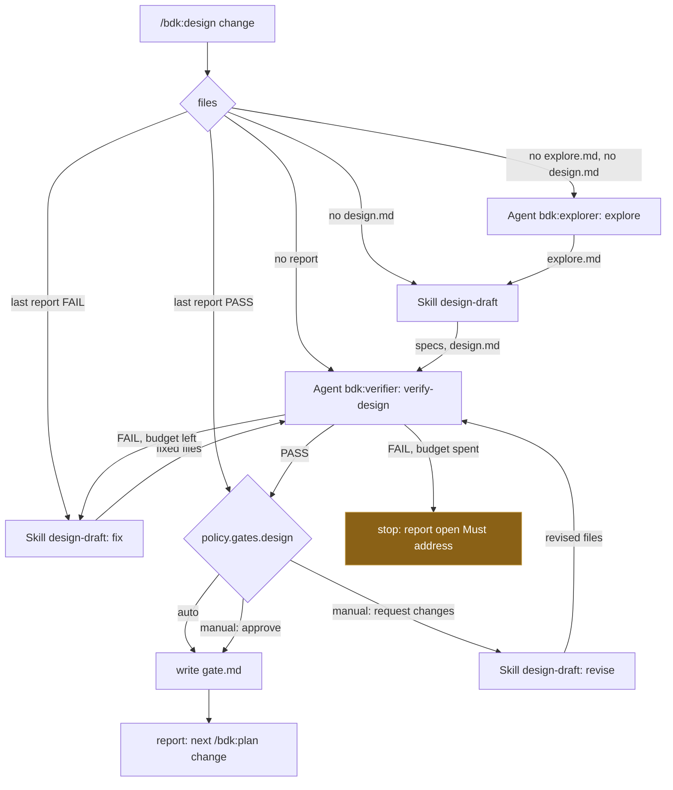

# Design

## Context

See proposal.md - Why. The architecture puts `/bdk:design` in the main thread as an orchestrator that "only composes" ("Principles" 2, "Catalog", "Flows / Design"; ADR-0003 D1, option A). What exists in `plugins/bdk` after #190:

- `skills/explore/` runs on `bdk:explorer` and writes `.bdk/runs/<change>/design/explore.md`; `skills/verify-design/` runs on `bdk:verifier` and writes `design/verify-N.md` (first line `Verdict: PASS|FAIL`, stable `M<n>`/`S<n>` IDs, `Closed:` from the second report). Both start their agent themselves when typed in the main thread, and an agent started with the prompt `Run the skill bdk:<block> with the arguments: <change>` can be continued with `SendMessage` (#190 D2, probe).
- `skills/design-draft/` runs in the main thread, asks per `policy.questions` (Lavish, `AskUserQuestion`, reply), writes the spec deltas and `design.md`, and switches to fix mode when the last `verify-N.md` says FAIL. Its `argument-hint` already reads `[change-name] [what to focus on]`, but the text never says what the second part does.
- `bdk config show` prints the resolved configuration; `policy.gates.design` (`manual`|`auto`, default `manual`) and `policy.questions` exist (`src/config/domain/settings.ts:55-56`). `policy.budgets` holds only `part-attempts` and `review-rounds` (`settings.ts:57-59`), so the `policy.budgets.verifier` the architecture names in "Flows / Design" and "Flows / Plan" does not exist yet. Spec `bdk-cli/config` lets the consumer of a key add its row.
- `bdk run status` derives the open stage from files: design is open while there is no `design.md` or the last `design/verify-N.md` does not pass (spec `bdk-cli/run`, row 2). It does not read a gate file.
- Eval harness (#189): orchestrator cases carry `tags: [orchestrator]`, run with `--ablation none`, and grade `tool_order` and `file_exists` (spec `skill-evals`, "Block and orchestrator cases"). No orchestrator case exists yet. Fixtures `ledger-proposal.sh`, `ledger-explored.sh`, `ledger-designed.sh` build the Change `add-csv-export` at each stage.

Material read, not copied: v2 `skills/design` on `main` (one long skill: ground, classify, branch, schema gate, YAML verdict parsing, back-edge routing with a hard cap of 3, warm `SendMessage` to the verifier), and draft 1 `skills/stages/design` (kernel `bdk next`/`bdk done`, ledger decisions, a final user review "accept or request changes"). What stays: the cap of 3 passes, the continued verifier, the final accept-or-change review. What goes: classification and routing inside the orchestrator (the blocks own that work now), the kernel and the ledger. Draft 1 finding "The stage does not say what it creates and when" (#149) shapes the progress lines (D6).

## Goals / Non-Goals

**Goals:**

- A design stage the user starts with one command that ends in a passed, approved design or a clear stop, without running any block's work in the main thread.
- Resume from files at any point, so a break, a compaction or a second `/bdk:design` continues where the run stopped.
- No question to the user in `auto` gate runs beyond what `design-draft` asks per `policy.questions`.

**Non-Goals:**

- Any `bdk` command for the loop: no eval or measurement shows a problem (CLAUDE.md "Building skills (v3)").
- `steps.design` block replacement (proposal, Out of scope).
- Teaching `bdk run status` about `gate.md`: `/bdk:run` owns its gates over a queue and reads what it needs when it is built.

## Decisions

### D1. One plain skill, blocks called by their own entry points

`plugins/bdk/skills/design/SKILL.md`, no references, no helper. It opens with the `!` block `"${CLAUDE_PLUGIN_ROOT}/bin/bdk" config show` and stops on "BDK not configured" (architecture "Configuration and extension points"; `bin/` path form from #181 D2).

- `explore`: `Agent(subagent_type: "bdk:explorer", prompt: "Run the skill bdk:explore with the arguments: <change>")`.
- `design-draft`: `Skill(bdk:design-draft, "<change>")` in the main thread, because it talks to the user (architecture "Catalog": main thread).
- `verify-design`: `Agent(subagent_type: "bdk:verifier", prompt: "Run the skill bdk:verify-design with the arguments: <change>")`; its agent ID is kept for the next pass.

Alternatives: calling `Skill(bdk:explore)` and `Skill(bdk:verify-design)` in the main thread and letting their hand-off start the agent - lost, it loads both block texts into the most expensive context only to forward them (findings "The main thread is the most expensive agent"), and the hand-off returns no agent ID to the orchestrator for `SendMessage`. Inlining the steps of the blocks - lost, one block one job, and the blocks' eval cases would no longer cover what runs.

### D2. Resume table read from files

| # | What the files say | Start with |
|---|---|---|
| 1 | no `proposal.md` | stop, name `/bdk:propose` |
| 2 | `design/gate.md` says `Gate: approved` for the last report | nothing; report the approved design |
| 3 | no `design/explore.md` and no `design.md` | `explore` |
| 4 | no `design.md` | `design-draft` |
| 5 | no `design/verify-N.md` | `verify-design` |
| 6 | the last report says `Verdict: FAIL` | `design-draft` (fix mode), then `verify-design` |
| 7 | the last report says `Verdict: PASS` | the gate |

Rows are checked in order and the first match wins, as in the architecture's "Autopilot continuation". Row 3 skips `explore` when a `design.md` exists without a map: the design was written by hand or by an earlier tool, and mapping the code again only for the verifier would cost a haiku run without a consumer (the verifier reads the code itself). The resume rows match `bdk run status` row 2, so `/bdk:run` and `/bdk:design` agree on when the design is open.

Alternatives: always starting from `explore` - lost, a second run would redo paid work and overwrite a map design-draft already used. A `bdk design next` helper computing the row - lost, seven rows read from four files are a model's work today, and no eval shows the model getting them wrong (principle 7).

### D3. `policy.budgets.verifier`, default 3, per run

A new key `policy.budgets.verifier` (integer, at least 1, default 3) counts the verifier passes one run of the orchestrator starts. The name is the architecture's (`max policy.budgets.verifier` in "Flows / Design" and "Flows / Plan"), so #199 reuses it for `/bdk:plan`. The default is v2's hard cap of 3 back-edges per session.

The count is per run, not per Change: a second `/bdk:design` after a spent budget gets a fresh budget and continues from row 6. The user deciding to run again is the escalation; a per-Change count would need a counter file and a reset command for no measured need.

On a spent budget the run stops before the gate, writes no gate file, and reports the last report and its open `Must address` IDs. A design that failed its last check is not ready for the plan, and the gate is not a place to wave a FAIL through: a user who disagrees with the verifier edits the design or runs again.

Alternatives: reusing `review-rounds` - lost, a different stage and agent; a separate `design-passes` and `plan-passes` - lost, the architecture names one key and nothing shows the two need different values. Asking the user at a spent budget whether to continue - lost, it blocks autopilot, and running the command again says the same thing.

### D4. Continue the verifier, fall back to a fresh one

After a fix, the orchestrator sends the kept `bdk:verifier` agent `Verify the design of <change> again: design-draft fixed it.` with `SendMessage`. When it has no ID (a resumed run, a compaction) or the tool is missing (it is a deferred tool in some sessions; load it with `ToolSearch select:SendMessage` first), it starts a new `bdk:verifier` agent the same way as the first pass. Both are correct because `verify-design` takes the report number and the open IDs from the files (#190 D6); the continued agent is only faster, as it does not reread unchanged code.

### D5. The design gate writes `design/gate.md`

`auto`: write the gate file and report. `manual`: one `AskUserQuestion` with two options, "Approve" (recommended) and "Request changes" (the user's words come through the free-text "Other" or a follow-up), naming `design.md`, the spec deltas and every `Decided without the user:` line, so the user sees what was decided for them before approving. A request for changes runs `design-draft` with `<change> <request>`, then a verifier pass within the same budget, then the gate again. Without `AskUserQuestion` (`claude -p`, evals) the reply asks for approval and the turn ends; the gate file is written when the user approves in the conversation, and a later `/bdk:design` comes back to the gate by row 7.

```markdown
Gate: approved
By: user
Report: design/verify-2.md
```

`By:` is `user` or `policy.gates.design auto`. `Report:` names the passing report the approval covers, which is how row 2 knows the approval is current: a later report (after a revision) makes it stale.

Why a file: principle 4 ("Every step writes a file"), resume needs to tell an approved design from one waiting at the gate, and `/bdk:run` can read it later. Lavish is not used for the gate: the decision is one yes/no over files the user can open in their editor, which `AskUserQuestion` does in one call; Lavish stays for `design-draft`'s many-option questions (skills decisions D4).

Alternatives: no file, the conversation is the record - lost, a resumed run would ask again for an approved design. Recording the gate in `run.json` - lost, `/bdk:run` is its only writer (principle 5). A gate that accepts a failed design - lost (D3).

### D6. Progress lines and the report

Before each block the orchestrator writes one line: which block runs and which file it writes (`Mapping the code: bdk:explorer writes .bdk/runs/<change>/design/explore.md`). After each verifier pass, the verdict line and the report path. The final report: the files written in this run, the last verdict and passes used of the budget, every `Decided without the user:` line of `design.md`, the gate outcome, and `/bdk:plan <change>` as the next stage after an approval. This answers draft 1's "the stage does not say what it creates and when".

### D7. `design-draft` revision request

One paragraph in `design-draft`: when `design.md` exists, the last report is not FAIL and the arguments hold text after the Change name, that text is a revision request; the block changes only what it needs, keeps the other decisions, asks only what the request leaves open, and replies with what changed. The fix-after-FAIL path keeps priority. This gives the existing `[what to focus on]` hint a defined meaning and keeps the fix in the author block (one block, one job) instead of the orchestrator editing `design.md`.

### D8. Eval cases

All three on the ledger fixtures, `tags: [orchestrator]`, `policy.questions: decide-and-record` so `design-draft` asks nothing in a run.

| Case | Scaffold | Graders |
|---|---|---|
| `design-fresh-auto-gate` | `ledger-proposal.sh`, `policy.gates.design: auto` | `tool_order` Agent `bdk:explorer` before Skill `design-draft`; `tool_order` Skill `design-draft` before Agent `bdk:verifier`; `file_exists` explore.md, design.md, spec delta, verify-1.md, gate.md; `regex` gate.md `^Gate: approved`; `tool_used` Skill `design`; `llm` reply names `/bdk:plan add-csv-export` |
| `design-resume-after-fail` | `ledger-designed.sh` with the false `formatAmount` claim and `verify-1.md` FAIL `M1`, `policy.gates.design: auto` | `tool_order` Skill `design-draft` before Agent `bdk:verifier`; `regex` on the trace: no Agent `bdk:explorer`; `file_exists` verify-2.md, gate.md; `regex` verify-2.md `Closed:` names `M1` |
| `design-manual-gate-no-ask` | `ledger-explored.sh`, gate default `manual` | `tool_order` Skill `design-draft` before Agent `bdk:verifier`; `regex` no Agent `bdk:explorer`; `file_exists` design.md, verify-1.md; `regex` no write of `gate.md`; `llm` reply asks to approve and names design.md |

The negative trace regexes match the JSON of a tool call (`"subagent_type":"bdk:explorer"`, `"file_path":"...gate.md"`), which skill text in the trace cannot match because its quotes are escaped. The budget-spent path has no case: forcing a second FAIL needs a design the fix cannot repair, which a model run does not make deterministic; it is checked by hand (tasks 4.2).

## Diagrams



## Risks / Trade-offs

- [Bottleneck: each verifier pass is an opus agent, and B1 measured 13.7 min for two plan passes] -> the budget caps passes at 3 by default; a continued verifier rereads only what changed; `Must address` holds only defects that make the plan or product wrong (#190 D6).
- [Failure mode: the main thread does a block's work itself, e.g. fixes `design.md` after a FAIL] -> the skill states that it never writes those files, and the eval grades `tool_order` of `design-draft` before the verifier and the trace for the agent types.
- [Failure mode: a manual gate in a non-interactive run waits for nobody] -> without `AskUserQuestion` the reply asks and the turn ends; autopilot sets `policy.gates.design: auto` or approves through `/bdk:run`.
- [Hidden cost: the orchestrator reads the passed design to list decisions for the gate] -> it reads only the `Decided without the user:` lines with Grep, not the whole file.
- [Unconfirmed assumption: a per-run budget is what users want, not a per-Change total] -> a second run is an explicit user action; if autopilot data shows runs looping across sessions, a per-Change count can follow.
- [Unconfirmed assumption: `design-draft` honours a revision request without redrafting] -> its new paragraph says to keep other decisions; the verifier pass after it catches a regression.

## Open Questions

None.

## Results

Paid eval run on 2026-10-08, Claude Code as pinned in the root `package.json`, `--ablation none --runs 1 --tag orchestrator -j 3`, grants per `evals/README.md`, clean `HOME` and the macOS git prefix:

| Case | Score | Graders | Turns | Cost |
|---|---|---|---|---|
| `design-fresh-auto-gate` | 1.00 | 10/10 (2 `tool_order`, 5 `file_exists`, gate regex, `tool_used`, `llm`) | 24 | $0.76 |
| `design-resume-after-fail` | 1.00 | 6/6 (`tool_order`, 2 `file_exists`, `Closed: M1`, no explorer, `tool_used`) | 16 | $0.49 |
| `design-manual-gate-no-ask` | 1.00 | 7/7 (`tool_order`, 2 `file_exists`, no explorer, no gate file, `tool_used`, `llm`) | 22 | $0.72 |

Three cases, 153 s wall time in parallel, $1.98. Every `tool_order` and `file_exists` grader passes (issue "Acceptance signal").

Found while running them:

- `SendMessage` cannot be granted to an eval run (`not granted (missing --allow-tools grant...)`), so the cases leave it out; a run then verifies with a new `bdk:verifier` agent, the fallback of D4. The continued agent stays covered by #190's manual check.
- `claude plugin eval` refuses an untrusted plugin directory without a terminal; a run started from a script needs `--trust-plugin`.

Acceptance in separate test projects (`claude -p --plugin-dir plugins/bdk`, tasks 4.1-4.2):

- Fresh Change, `decide-and-record`, `auto` gate: `bdk:explorer`, then `design-draft`, then `bdk:verifier`; `Verdict: PASS` on the first pass, `gate.md` with `By: policy.gates.design auto`, five decisions listed in the report, next stage `/bdk:plan add-csv-export`; `git status` shows only the run files, the spec delta and `design.md`. 159 s, $0.90, 15 turns.
- `policy.budgets.verifier: 1` and a design citing the missing `formatAmount`: one verifier pass, `Verdict: FAIL` with `M1`, no `design-draft` run, no `gate.md`, and the report names `verify-1.md`, `M1` and `/bdk:design add-csv-export` to continue. 44 s, $0.45.
- Revision request (D7): `/bdk:design-draft add-csv-export quote every label, not only those that need it` on the approved design changed D3 and the matching requirement and scenarios only, kept D1, D2 and D4-D6, and `openspec validate --strict` passed.
- Manual gate with a request for changes, in one conversation (`claude -p`, then `claude -p --continue`): the first run found the passing report, asked in its reply for approval and listed the five decisions taken without the user, with no `gate.md`; the answer "Request changes: quote every label" ran `design-draft` as a revision, a new verifier pass wrote `verify-2.md` (`Verdict: PASS`, 1 of 3 passes), and the gate asked again; "approve" wrote `gate.md` with `By: user` and `Report: design/verify-2.md`.
