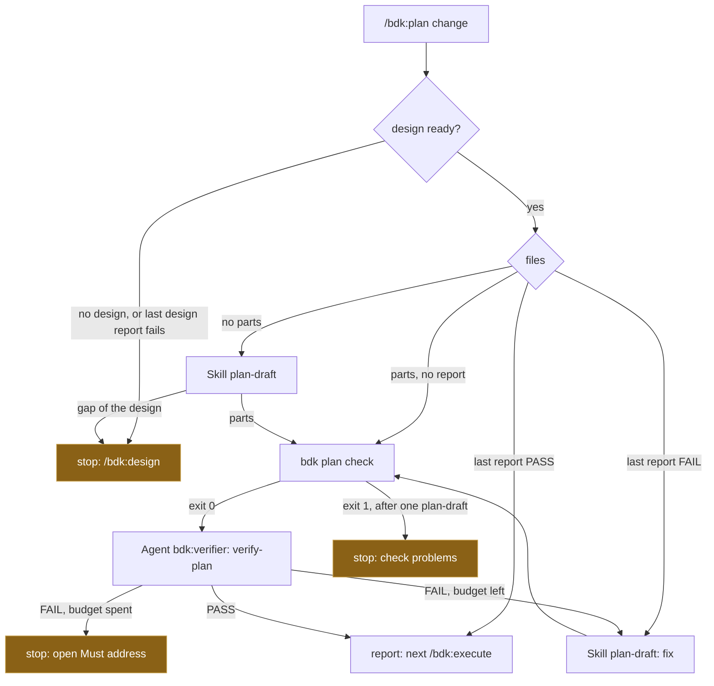

# Design

## Context

See proposal.md - Why. The architecture puts `/bdk:plan` in the main thread as an orchestrator that only composes ("Principles", "Catalog", "Flows / Plan"; ADR-0003 D1). What exists in `plugins/bdk`:

- `skills/plan-draft/` (#191) runs in the main thread, writes `openspec/changes/<change>/plan/parts/NN.md`, runs `bdk plan check` itself until it exits 0 (#191 D6), fixes the `Must address` items of a failed last `plan/verify-N.md` (#191 D7), and names gaps of the design without deciding them, writing no part for them (#191 D8).
- `skills/verify-plan/` (#191) runs in `bdk:verifier` (opus), started by `Agent(subagent_type: "bdk:verifier", prompt: "Run the skill bdk:verify-plan for the Change <change>.")` with `model` from `models.verifier`; it writes `.bdk/runs/<change>/plan/verify-N.md` (first line `Verdict: PASS|FAIL`, stable `M<n>`/`S<n>` IDs carried over through the previous report, `Closed:` from the second report on) and can be continued with `SendMessage` (#191 D2, D3).
- `bdk plan check <dir>` (#185, spec `bdk-cli/plan`): limits, `depends-on` cycles, waves, overlapping files, lonely `shared` parts; exit 0, 1 (problems listed under `problems:`) or 3 (environment).
- `policy.budgets.verifier` (#198 D3): integer, default 3, the verifier passes one design or plan orchestrator run spends.
- `bdk run status` row 3 (spec `bdk-cli/run`): the plan is open while there is no part, no `plan/verify-N.md`, or the last one does not pass. Row 2 keeps the design open while its last report does not pass.
- `/bdk:design` (#198): the pattern this skill follows - one plain skill, blocks called by their own entry points, a resume table from files, a per-run budget, a continued verifier with a fresh-agent fallback, progress lines, orchestrator eval cases on the ledger fixtures.

Material read, not copied: v2 `skills/create-plan` and `skills/verify-plan` on `main` (planning and verification in one long flow, two iterations through `SendMessage`, a plan hash), draft 1 `skills/stages/plan` (kernel `bdk next`/`bdk done`, ledger questions). What stays: the continued verifier and a hard cap on passes. What goes: the kernel, the ledger and the hash; the blocks own their work. B1 findings that shape it: two opus verify-plan rounds took 13.7 min, and three plan edits with two more rounds came from a part that lost facts (`docs/v3-draft1/run-b1/2026-10-07-bdk-v3-findings.md`), so no opus pass is spent on what a free check or the design must settle first.

## Goals / Non-Goals

**Goals:**

- A plan stage the user starts with one command that ends in a passed plan or a clear stop, without running a block's work in the main thread.
- Resume from files, so a break, a compaction or a second `/bdk:plan` continues where the run stopped.
- No opus pass on a plan that `bdk plan check` rejects or that rests on an open design question.

**Non-Goals:**

- A plan gate (proposal, Out of scope).
- Any `bdk` command for the loop: no eval or measurement shows a problem (CLAUDE.md "Building skills (v3)").
- Reading `run.json` or `design/gate.md`: `/bdk:run` (#203) calls the stages in order and owns its gates; a user typing `/bdk:plan` is the consent to plan.

## Decisions

### D1. One plain skill, blocks called by their own entry points

`plugins/bdk/skills/plan/SKILL.md`, no references, no helper. It opens with the `!` block `"${CLAUDE_PLUGIN_ROOT}/bin/bdk" config show` and stops on "BDK not configured" or "BDK configuration invalid".

- `plan-draft`: `Skill(bdk:plan-draft, "<change>")` in the main thread (architecture "Catalog": main thread). It may stop to name design gaps, which the orchestrator reads from its reply.
- `bdk plan check`: `"${CLAUDE_PLUGIN_ROOT}/bin/bdk" plan check openspec/changes/<change>/plan/parts`, a free command, no model turn.
- `verify-plan`: `Agent(subagent_type: "bdk:verifier", prompt: "Run the skill bdk:verify-plan for the Change <change>.", model: models.verifier when set)`, the prompt `verify-plan` itself uses when it dispatches (#191 D2); the agent ID is kept for the next pass.

Alternatives: `Skill(bdk:verify-plan)` in the main thread, letting it start the agent - lost, it loads the checklist into the most expensive context only to forward it, and its hand-off returns no agent ID for `SendMessage` (#198 D1). Inlining the blocks - lost, one block one job, and the blocks' eval cases would no longer cover what runs.

### D2. Input check: a designed Change whose design did not fail

The skill needs `proposal.md`, at least one `specs/**/spec.md` and `design.md`; otherwise it names `/bdk:design <change>`. It also stops when the last `.bdk/runs/<change>/design/verify-N.md` exists and does not pass: `bdk run status` row 2 keeps such a design open, and planning a design its verifier failed spends an opus pass on a plan that changes with the fix. A design without any design report (written by hand) is planned: the plan verifier reads the code itself, and the user's command is the consent.

The skill does not read `design/gate.md`. A manual gate waiting for approval in an interactive session is the user's own state; the user who types `/bdk:plan` approves by doing so, and `/bdk:run` (#203) does not call the plan stage before its gate.

Alternatives: require `gate.md` - lost, a user who designs by hand or with OpenSpec alone could never plan, and the gate belongs to the design stage. Delegate the check to `plan-draft` - it checks the files already, but it does not read design reports, and an orchestrator stop costs no model turn of a block.

### D3. Resume table read from files

| # | What the files say | Start with |
|---|---|---|
| 1 | no `plan/parts/*.md` | `plan-draft` |
| 2 | parts, no `plan/verify-N.md` | `bdk plan check`, then `verify-plan` |
| 3 | the last report says `Verdict: FAIL` | `plan-draft` (fix mode), check, then `verify-plan` |
| 4 | the last report passes | no block; one free `bdk plan check` for the waves of the report |

The first matching row wins. The rows match `bdk run status` row 3, so `/bdk:run` and `/bdk:plan` agree on when the plan is open. Row 4 runs nothing even when parts were edited after the report: the files do not tell an edit apart, and a user who changed a passed plan deletes the report or runs `/bdk:verify-plan`.

Alternatives: a `bdk plan next` helper - lost, four rows from two globs are a model's work and no eval shows the model getting them wrong (principle 7). Hashing the parts into the report to detect edits (v2) - lost, `bdk run status` would need the same rule and nothing measured the need.

### D4. `bdk plan check` before every verifier pass, one repair

The architecture runs the check between the draft and the verifier ("Flows / Plan"). `plan-draft` already ends on exit 0 (#191 D6), so the orchestrator's check matters when the parts did not come from `plan-draft` in this run: written by hand, a resumed run at row 2, or a limit changed in the configuration since. It also gives the waves for the report without reading the parts.

On exit 1 the orchestrator runs `plan-draft` once (it redrafts what fails and checks again) and checks again; still exit 1, it stops and lists the problems. Exit 3 stops with the message. The `verify-plan` checklist would list the same problems as `Must address` (item 1), but at the price of an opus pass; one repair bounds the loop without a second budget.

Alternatives: leave it to the verifier - lost, an opus pass to read a free command's output. Loop `plan-draft` until the check passes - lost, an unbounded loop of main-thread turns; a second failure means the author block cannot satisfy the limits, which a person decides (raise `plan.part.*` or change the design).

### D5. A design gap stops the run before the verifier

`plan-draft` names a gap of the design and writes no part for it (#191 D8). A plan without that part passes `verify-plan` (no design decision is left uncarried), and execute would build a product that misses the behaviour. So when the `plan-draft` reply names a gap, the orchestrator stops before the verifier, quotes the gap and names `/bdk:design <change>`; after the design answers it, `/bdk:plan <change>` redrafts (row 1 or 3 resumes, and `plan-draft` keeps what still holds).

Alternatives: verify anyway and report the gap - lost, it spends an opus pass and hands a plan that looks passed to `/bdk:run`. Ask the user from the orchestrator - lost, the plan stage does not decide what the product does (#191 D8), and autopilot cannot ask.

### D6. Budget per run, continued verifier, fresh fallback

`policy.budgets.verifier` (#198 D3) counts the verifier passes one run starts. After a FAIL with budget left: `plan-draft` (fix mode), the check of D4, then the kept agent gets `Verify the plan of <change> again: plan-draft fixed it.` through `SendMessage` (loaded with `ToolSearch select:SendMessage` when it is deferred). Without an ID or the tool, a new `bdk:verifier` agent starts; both are correct because `verify-plan` carries IDs over from the previous report (#191 D3).

On a spent budget the run stops: no further `plan-draft`, and the reply names the last report, its open `Must address` IDs and `/bdk:plan <change>` to continue with a new budget. Running `plan-draft` after the last pass would leave a fixed plan no verifier checked, and row 3 runs that fix first in the next run anyway.

Alternatives: per-Change budget, separate plan key, asking at a spent budget - lost for the reasons of #198 D3.

### D7. Progress lines and the report

Before each block one line names the block and the file it writes (`Drafting the plan: plan-draft writes openspec/changes/<change>/plan/parts/`, `Checking the plan: bdk:verifier writes .bdk/runs/<change>/plan/verify-2.md`). After each pass, the verdict line and the report path. The report: part files, waves and their count from the last `bdk plan check`, the last verdict and passes used of the budget, the choices `plan-draft` named inside the design's frame, and `/bdk:execute <change>` after a pass. It answers draft 1's "the stage does not say what it creates and when" (#149).

### D8. Eval cases

All on the `ledger-change` fixture (#191 D11) and the part sets of the plan-block cases, `tags: [orchestrator]`, one arm.

| Case | Scaffold | Graders |
|---|---|---|
| `plan-fresh` | `ledger-change.sh` | `tool_order` Skill `plan-draft` before Agent `bdk:verifier`; `regex` trace: `plan check` before `bdk:verifier`; `file_exists` `plan/parts/01.md`, `plan/verify-1.md`; `tool_used` Skill `plan`; `llm` reply names the waves and the verdict |
| `plan-resume-after-fail` | parts and `verify-1.md` FAIL of `plan-draft-fix-after-verify` | `tool_order` Skill `plan-draft` before Agent `bdk:verifier`; `file_exists` `plan/verify-2.md`; `regex` verify-2 `Closed:` names `M1`; `regex` `02.md` `depends-on: ["01"]`; `tool_used` Skill `plan` |
| `plan-budget-spent` | parts of `verify-plan-defects`, `policy.budgets.verifier: 1` | `tool_order` Skill `plan` before Agent `bdk:verifier`; `file_exists` `plan/verify-1.md`; `regex` verify-1 `^Verdict: FAIL`; `regex` trace: no Skill `plan-draft`, one `bdk:verifier`, no write of `verify-2.md`; `llm` reply names `verify-1.md`, open IDs and `/bdk:plan add-csv-export` |
| `plan-verify-written` | parts of `verify-plan-sound`, written by hand, no report | `tool_order` Skill `plan` before Agent `bdk:verifier`; `regex` trace: `plan check` before `bdk:verifier`, no Skill `plan-draft`; `file_exists` `plan/verify-1.md`; `regex` verify-1 `^Verdict: PASS`; `llm` reply names the waves and `/bdk:execute add-csv-export` |

Every orchestrator case needs a `tool_order` and a `file_exists` grader (spec `skill-evals`, enforced by `tests/evals.test.ts`). A run on a plan that already passed (resume row 4) starts no block and writes no file, so it has neither and is checked by hand (tasks 3.2); `plan-verify-written` covers the same reply, `/bdk:execute <change>`, after a pass. Negative trace regexes match tool-call JSON, as in #198 D8.

## Diagrams

## Risks / Trade-offs

- [Bottleneck: each verifier pass is an opus agent (B1: 13.7 min for two rounds)] -> the budget caps passes; the free check and the gap stop come before any pass; a continued verifier rereads only what changed.
- [Failure mode: the main thread fixes a part itself after a FAIL] -> the skill states that it writes no file, and the eval grades `plan-draft` before the verifier and that no Skill `plan-draft` runs after a spent budget.
- [Failure mode: the gap stop misses a gap `plan-draft` names in passing] -> `plan-draft`'s reply has a fixed place for gaps (#191 step 7); the orchestrator reads that part of the reply. Not covered by an eval: forcing a gap needs a design that leaves one open, which the ledger fixture does not; checked by hand (tasks 4.3).
- [Unconfirmed assumption: a passed plan stays passed until the report is removed] -> D3; `/bdk:verify-plan` checks an edited plan again.
- [Hidden cost: reading `plan-draft`'s full reply in the main thread] -> it is already there (the Skill runs in the main thread); no extra read.

## Open Questions

None.

## Results

Paid eval run on 2026-10-08, Claude Code as pinned in the root `package.json`, `--ablation none --runs 1 --tag orchestrator -j 4 --trust-plugin --allow-tools Write Edit "Bash(*/bin/bdk *)" --case 'plan-*'`, clean `HOME`, `PATH` without other plugins' `bin/`:

| Case | Score | Graders | Cost |
|---|---|---|---|
| `plan-fresh` | 1.00 | 6/6 (`tool_order`, check before verifier, 2 `file_exists`, `tool_used`, `llm`) | $0.57 |
| `plan-resume-after-fail` | 1.00 | 5/5 (`tool_order`, `file_exists` verify-2.md, `Closed: M1`, `depends-on: ["01"]`, `tool_used`) | $0.52 |
| `plan-budget-spent` | 1.00 | 7/7 (`tool_order`, `file_exists`, `Verdict: FAIL`, no `plan-draft`, one verifier pass, `tool_used`, `llm`) | $0.41 |
| `plan-verify-written` | 1.00 | 7/7 (`tool_order`, check before verifier, `file_exists`, `Verdict: PASS`, no `plan-draft`, `tool_used`, `llm`) | $0.43 |

Four cases, 136 s wall time in parallel. Every `tool_order` and `file_exists` grader passes (issue "Acceptance signal").

Found while running them: the first run scored `plan-budget-spent` 0.86 on the `one-pass` grader although the run made one `Agent` call. The trace repeats `"subagent_type":"bdk:verifier"` in every progress event of the running agent, so a regex counting that string counts events, not calls. The grader now matches `"name":"Agent","input":{...}` (checked offline against the kept trace and against the trace doubled), and the re-run of the case passed 7/7 ($0.41, 54 s).

Acceptance in separate test projects (`claude -p "/bdk:plan add-csv-export" --plugin-dir plugins/bdk`, outside this repository):

- Fresh designed Change (`ledger-change.sh`, tasks 3.1): `plan-draft`, `bdk plan check`, one `bdk:verifier` pass with `Verdict: PASS`; 2 parts, 2 waves (`1: 01`, `2: 02`), the choices inside the design's frame and the verifier's `Should consider` items listed, next stage `/bdk:execute add-csv-export`; `git status` shows only the two parts (run files are ignored). 79 s, $0.65, 9 turns. The design leaves open what `ledger` does without a subcommand; `plan-draft` did not stop on it and the verifier listed it under `Should consider` (S2), so a gap with no scenario behind it does not stop the plan.
- Last design report `Verdict: FAIL` (tasks 3.2): no block ran, the reply named `verify-1.md` and `/bdk:design add-csv-export`. 7 s, $0.21, 2 turns.
- Last plan report `Verdict: PASS` (tasks 3.2): no `plan-draft`, no verifier; one `bdk plan check` for the waves; reply with parts, 2 waves, 0 of 3 passes and `/bdk:execute add-csv-export`. 15 s, $0.24.
- A spec requirement `--out <path>` that the design does not cover (tasks 3.3): `plan-draft` wrote the parts it could, named the gap (overwrite or refuse an existing file, the error path, argument order), and the run stopped before the verifier: no `.bdk/runs/` written, reply with the gap, 0 of 3 passes, `/bdk:design add-csv-export` and then `/bdk:plan add-csv-export`. 78 s, $0.44.
