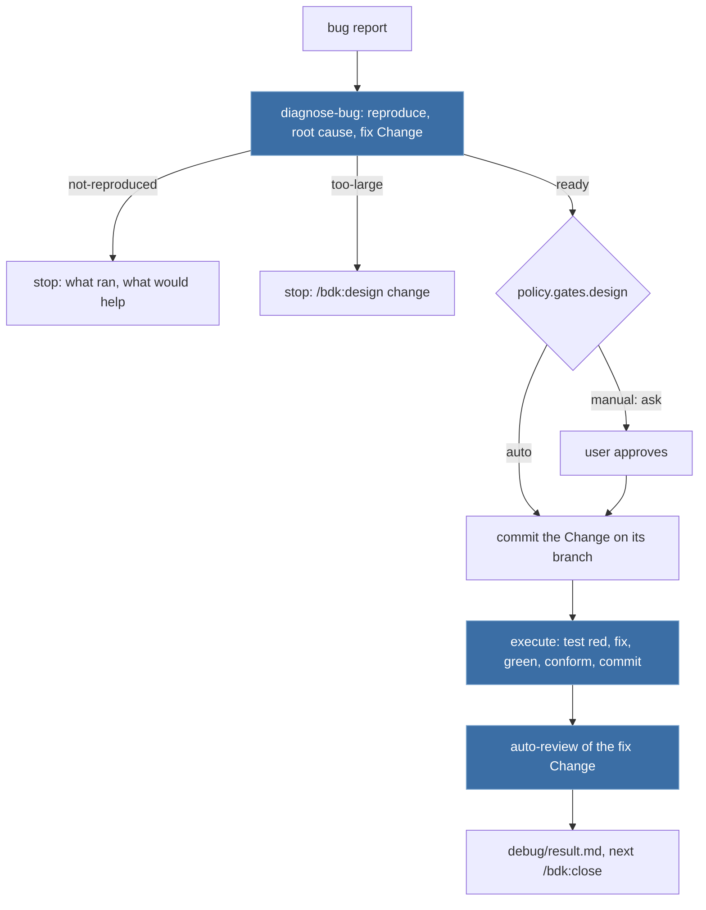

# Design

## Context

- Architecture (`docs/design/2026-10-07-v3-architecture.md`): "Catalog" lists `/bdk:debug` as a main-thread orchestrator composing "E2E reproduction, failing test, fix, `auto-review` of the fix scope" and writing "fix with its test"; "Principles" 1, 2, 4 and 7 (logic in skills, one block one job, every step writes a file, plain skill first); "Layers" puts `debug` with the main-thread orchestrators.
- Input read, not copied: v2 `skills/debug` (tag `v2.7.0`) parsed the report, investigated in the main thread, wrote failing tests, stopped hard for the user, then fixed inline or handed off to `/bdk:create-plan`; it never ran the product and no review followed the fix. `draft/v3-1:skills/tools/diagnose` analysed BDK run transcripts, a different job (the later `bdk diag`); only its rule "do not guess a cause the evidence does not show" carries over.
- What exists: the Change pipeline blocks and orchestrators. `/bdk:execute` (#200) builds `openspec/changes/<change>/plan/parts/` in a `bdk:lead` with `implement-part` (acceptance tests first, seen red, then the tasks, then the part checks) and `conform-part`, creates the Change branch when on the base, commits each part, and needs a clean tree. `/bdk:auto-review` (#201) reviews a Change in rounds; round 1 records `bdk git groups <base> --plan openspec/changes/<change>/plan/parts`, which exits 3 when the plan directory is missing (spec `bdk-cli/git`, `env/plan-missing`); its `bdk:e2e-tester` drives the scenarios of the Change's spec deltas. `commit` (#206) stages by path. `/bdk:close` (#202) checks the spec deltas, archives, pushes and opens the pull request. `policy.gates.design` (default `manual`) and `policy.questions` (default `stop`) exist (spec `bdk-cli/config`).
- The global user instruction behind this task: a bug fix starts with reproducing the bug end to end, as the user experiences it, so the fix solves the real problem.

## Goals / Non-Goals

**Goals:**
- A reported bug is reproduced on the product before any code is read for a cause, and a bug that does not reproduce gets no fix.
- The fix is test-first (the reproduction test seen red, then green), built, checked and reviewed by the same blocks as any Change, and the expected behaviour lands in the living specs.
- Each step writes a file, so `/bdk:debug <change>` resumes.

**Non-Goals:**
- The autopilot queue (#203), the pull request (`/bdk:close`), BDK transcript diagnostics.
- A CLI helper: no eval or measurement shows a need (CLAUDE.md "Building skills").

## Decisions

### D1. A fix is a small Change

The bug fix becomes an OpenSpec Change `fix-<slug>` (from an issue `<n>-fix-<slug>`, as `/bdk:propose` names issue Changes; a name the user gives wins, which also lets the eval cases grade files by path) with all four BDK artifacts: proposal, a spec delta holding the reproduction as a scenario, `design.md` with the root cause, and one plan part.

Why: every block downstream takes a Change. `execute` builds plan parts, `auto-review` needs `plan/parts` for round 1 and drives spec scenarios end to end, and `close` archives the spec delta and opens the pull request. A Change makes "auto-review of the fix scope" exactly the review of the fix, and the expected behaviour of the bug becomes a scenario of the living specs, so the next E2E run and the next reader see it (v3 goal 3).

Alternatives: a scope-only mode of `auto-review` without a Change - lost: it changes a merged stage and its lead, the E2E tester would have no scenario to drive, and nothing would document the behaviour; fixing on the current tree and reviewing with `/bdk:cr`-like plain review - lost, that is v2's code-only check v3 replaces; running `/bdk:propose`, `/bdk:design` and `/bdk:plan` for every bug - lost: an explorer and two opus verifier loops per one-line bug, with no step that reproduces anything.

### D2. Two skills: the orchestrator and an author block

| Skill | Runs in | Job |
|---|---|---|
| `diagnose-bug` | main thread | reproduce, find the root cause, write the fix Change and `debug/diagnosis.md` |
| `/bdk:debug` | main thread | compose `diagnose-bug`, the gate, `commit`, `execute`, `auto-review`; write `debug/result.md` |

Reproducing, diagnosing and writing the contract are one job: turning a report into a fix contract backed by evidence; the reproduction is what the root cause is checked against. It is authoring, so it is a block with its own eval cases (Principle 2), and a user can run it alone to get a diagnosis without a fix. It runs in the main thread like `design-draft` and `plan-fixes`: it may ask the user for a missing symptom, and its reading of the code is the work, not a side trip to delegate. The failing test and the fix belong to `implement-part`, which already writes acceptance tests first and must see them red (spec `bdk-execute-blocks`), so v3 gets "failing test, fix" from one existing block instead of a second implementation of test-first.

Alternatives: one `debug` skill doing everything in the main thread like v2 - lost: it would duplicate `implement-part`, `conform-part` and the commit rules, and an orchestrator that also authors breaks "one block, one job" (CLAUDE.md); `e2e-check` for the reproduction - lost: it drives the scenarios of an existing Change, while the reproduction comes before the Change, from a free-text report, and decides whether a Change is written at all (`diagnose-bug` reproduces with the same `tools.e2e` items and the same start, ready and stop order, and the review round's `e2e-check` later drives the scenario the reproduction became); a separate `reproduce-bug` block - lost: the root cause search needs the reproduction's evidence in the same context, and two blocks would pass it through a file only to read it back.

### D3. Reproduction first, and no Change without it

`diagnose-bug` reproduces before it reads code for a cause. With a `tools.e2e` item it drives the product as a user would, in a scratch directory under `.bdk/runs/<change>/debug/` when the product writes files to its working directory. Without one it reproduces through the closest public interface (the command or exported function the report names), and the result says so. `debug/reproduction.md` holds steps, expected, observed and the decisive output. When nothing reproduces, it writes `Status: not-reproduced` and creates no Change: a fix of an unreproduced bug is a guess (draft 1 lesson "evidence proves the agent's account, not the product").

### D4. The spec delta holds the reproduction as a scenario

The delta always holds a scenario with the reproduction's exact input and expected output: a new scenario in the existing requirement copied whole under `MODIFIED` (the BDK schema instruction requires the whole block), or the existing requirement copied unchanged when a scenario already states the case, or an `ADDED` requirement when no main spec covers it. Why always: the E2E tester of the review round drives only the Change's scenarios, so without one the fix is never checked as a user would see it; and `implement-part` writes its test per acceptance scenario.

Alternative: `skip_specs: true` for a bug against an existing scenario - lost: `e2e-check` then reports `SKIPPED`, and the review loses its product check.

### D5. One plan part, or hand over to the pipeline

The fix part is `plan/parts/01.md`: `isolation: shared`, `depends-on: []`, `files` with the code and the test, the reproduction scenario as its acceptance scenario, a task per change whose `Verified by:` names the reproduction test with its exact input. `bdk plan check` checks it, as `plan-fixes` checks fix parts. A fix beyond `plan.part.max-tasks` or `plan.part.max-files`, or one that needs a design choice the user should make (two ways to fix with different behaviour), is `too-large`: the proposal, spec delta and `design.md` are written, no part, and `/bdk:debug` names `/bdk:design <change>`, which explores, verifies and gates the design, then `/bdk:plan`. This replaces v2's "HIGH complexity, hand off to `/bdk:create-plan`".

No `verify-plan` pass on the one part: `implement-part` checks each task against its scenario before editing and stops on a plan defect, and the review round follows. Alternative: an opus verifier per bug fix - lost on speed for a one-part plan whose scenario the reproduction already proved.

### D6. Gate before the fix

v2 stopped hard before every fix. v3 makes it configuration: `/bdk:debug` applies `policy.gates.design` after the diagnosis (the diagnosis is the fix's design). `manual` (default) asks once, naming the root cause, the scenario and the part, and starts nothing before the answer; `auto` goes on and records `By: policy.gates.design auto` in `debug/gate.md`. A user who asks "fix it" still sees one question in manual mode; the autopilot and evals set `auto`.

### D7. Branch, commits and the fix scope

`execute` needs a clean tree, and the Change's files are new, so `/bdk:debug` stops at the start on a dirty tree (before any work, so nothing is lost), and after the gate commits the Change with `commit`, scoped to `openspec/changes/<change>/`. Before that commit it switches to the branch `<change>` when on the base branch, by the same rule as `execute-waves` and `close`: the Change's commits never land on the base. On another branch the fix stays on it (the user is fixing their feature branch), and the review covers that branch from the base, as for any Change on it. `execute` then commits the part; `auto-review` round 1 reviews the range from the merge base, which on a fix branch is exactly the Change and the fix.

`/bdk:debug` runs `git switch -c`; it never commits by itself (the `commit` block does), never rebases or pushes.

### D8. Result and resume

`debug/result.md` is the stage's file (a main-thread file, so the subagent name filter of #201 does not apply; `result.md` keeps the naming of the other stages). Resume order, first missing wins: `debug/diagnosis.md` (run `diagnose-bug`; `not-reproduced` and `too-large` stop again with the same reply), `debug/gate.md`, the Change committed (`git status --porcelain -- openspec/changes/<change>/` empty and `git log` holding it), `execute/result.md` with `Status: done`, `review/result.md`, `debug/result.md`. A blocked execute or review is passed on with its command (`/bdk:execute <change>`, `/bdk:auto-review <change>`), as those stages name them.

### D9. Eval cases

| Case | Tag | Fixture | Graders |
|---|---|---|---|
| `diagnose-bug-reproduced` | block | `tally-bug`: `add` stores the amount as text, so `total` crashes; the prompt names the Change `fix-total-crash` | trace runs `tally.js total`; `debug/diagnosis.md` `Status: ready`; `reproduction.md` exists; the part lists `bin/tally.js`; the spec delta has a scenario expecting `Total: 5.00`-style output; no `Edit` of `bin/`; skill fired |
| `diagnose-bug-not-reproduced` | block | same fixture, a report of a bug the product does not have | `diagnosis.md` `Status: not-reproduced`; no `proposal.md` under `openspec/changes/`; reply says it did not reproduce |
| `debug-fix` | orchestrator | `tally-bug`, `policy.gates.design: auto`, `policy.gates.review: auto`, `execution.lead: foreground` | `tool_order` `diagnose-bug` before `execute` before `auto-review`; `execute/part-01.md` with `red seen; green seen`; `review/result.md`; `debug/result.md`; the fixed `bin/tally.js` stores numbers; llm reply names `/bdk:close` |
| `debug-manual-gate` | orchestrator | `tally-bug`, default gate | `diagnosis.md` `Status: ready`; no `debug/gate.md`; no `bdk:lead` started; reply asks whether to fix |

`debug-fix` is the acceptance signal ("a reproduced bug is fixed with a test"). It starts an implementer, a conformer, reviewers, an E2E tester, an opus integration reviewer and a judge, so it runs once in "Measurements", not in CI.

## Risks / Trade-offs

- [A one-line bug runs a lead, an implementer, a conformer and a review round: minutes, not seconds] -> quality before speed (architecture NFR "Priority on conflict"); the round covers only the fix branch; the time is measured in "Measurements".
- [The reproduction drives a product that writes into the working directory and dirties the tree] -> `diagnose-bug` reproduces in a scratch directory under the ignored `.bdk/runs/` and checks `git status --porcelain` before it ends; anything it left is removed or named.
- [A fix branch on a feature branch reviews the whole branch] -> stated in D7; a user who wants only the fix reviewed runs `/bdk:debug` from the base.
- [The diagnosis names a wrong root cause] -> `implement-part` sees the reproduction test red first and green after the fix, and the review round's E2E tester drives the reproduction scenario on the product.
- [MODIFIED requirement copied unchanged when a scenario already states the case] -> harmless on archive (the block replaces itself); `spec-conformance` at close checks the delta against the product.

## Migration Plan

None: two new skills; no existing skill or CLI command changes.

## Open Questions

None.

## Measurements

Recorded 2026-10-08 with `claude plugin eval` (Claude Code 2.1.292), three runs per arm, clean `HOME` and the git shell prefix of the eval README's "Host limits":

| Case | Kind | With | Without | Δ | Time | Cost |
|---|---|---|---|---|---|---|
| `diagnose-bug-reproduced` | block | 1.00 (3/3) | 0.67 | +0.33 | 179 s together with the first not-reproduced run (12 runs, `-j 4`) | $2.31 |
| `diagnose-bug-not-reproduced` | block | 1.00 (3/3) | 0.58 | +0.42 | 48 s (6 runs, `-j 6`) | $1.46 |
| `debug-manual-gate` | orchestrator | 1.00 (3/3) | - | - | 68-81 s per run | $1.67 |
| `debug-fix` | orchestrator | 0.97 (2/3 at 1.00, 1 at 0.91) | - | - | 377-565 s per run | $6.29 |

The acceptance signal holds: in every `debug-fix` run the bug was reproduced, the fix Change was committed on `fix-total-crash`, `main` kept its one commit, `bin/tally.js` stores numbers, `review/result.md` and `debug/result.md` were written, and the reply named `/bdk:close fix-total-crash`. In two runs `execute/part-01.md` records the reproduction test `red seen; green seen`; in one run the grader did not match that line, and the run's temporary workspace was gone before it could be read, so the cause is not visible. A whole fix, from report to reviewed fix, takes 6 to 10 minutes.

Without the plugin, the graders that fail are the run files and steps: no `debug/reproduction.md` or `debug/diagnosis.md`, no `bdk plan check`,, and in some runs no reproduction on the CLI and a reply the judge failed.

What the tries changed before these runs:

- `diagnose-bug` and `/bdk:debug` were tried in scratch projects built from every scaffold (`claude -p --plugin-dir plugins/bdk`): reproduced (60 s), not reproduced (34 s), manual gate (215 s), the whole fix (275 s).
- A resumed `/bdk:debug fix-total-crash` stopped in `execute` with the blocker that `tools.test` `scoped: node --test {files}` ran `bin/tally.js` as a test (the part's `files` hold the code too). The orchestrator reported it as designed; the fixture `tally-bug.sh` now has no scoped test form.
- `diagnose-bug` left its empty `scratch/` directory after a refused delete; the skill now says it stays (it is under the ignored `.bdk/runs/`).
- The judge of `diagnose-bug-not-reproduced` failed a good reply that named other failing setups as hypotheses to ask about; the rubric now allows hypotheses and fails only a claimed reproduction or a written fix.

Not covered by an eval case: the scenarios "Not configured", "Dirty tree", "Fix too large for one part" and "Resume after the fix". The first two are a stop on the first step, the same as in every orchestrator; the resume was tried by hand (it stopped in `execute` on the fixture defect above, after it skipped the diagnosis and the gate as designed).
