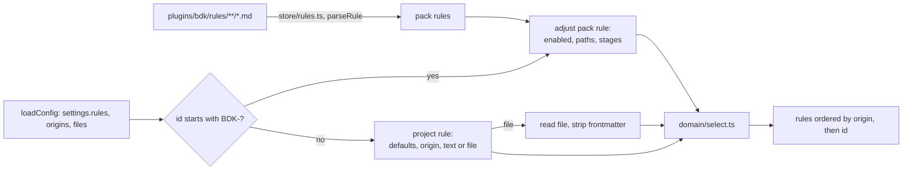

# Design

## Context

See proposal.md, "Why". The decisions on the shape of the settings, the layers, the migration and the stages were taken with the user on 2026-10-09 and are recorded in the body of #272; this design records how to build them and the alternatives that lost.

Current state the design builds on:

- `plugins/bdk/src/rules/use-cases/for.ts` reads the pack (`plugins/bdk/rules/`) and `.bdk/rules/` through `store/rules.ts`, parses both with `domain/rule.ts` (frontmatter, id from the file name, language from `languages/<name>/`), and selects with `domain/select.ts` using `languages` and `rules.disabled` from `loadConfig`.
- `plugins/bdk/src/config/domain/settings.ts` holds one strict zod schema; `rules` is `{disabled: string[]}`. Records already exist (`models`, `steps`): `domain/keys.ts` resolves a record segment with the record's key type, and `domain/merge.ts` merges mappings deeply, so a record keyed by rule id needs no new merge or key machinery.
- `domain/validate.ts` validates every prefix of the layers (`default`, then `+global`, `+project`, `+local`) and reports a missing required field only on the full merge, so a field a higher layer supplies is not a problem in a lower prefix.
- `loadConfig` (the only config use case other slices import, `src/slices.ts`) returns the resolved settings and the root, but no origins and no layer files.
- The slice matrix lets `rules` import `config`; `config` is a leaf and imports nothing. `shared/` admits only OS boundaries, the frame, or code three slices import (`.claude/rules/bdk-cli.md`).
- No design or plan skill calls `bdk rules for`; `implement-part`, `conform-part`, `review-group` and `judge` do.

## Goals / Non-Goals

**Goals:**

- Project rules and pack adjustments are configuration: validated by `bdk config check`, shown with their layer by `bdk config show`, set by `bdk config set`, described in the settings Reference.
- `bdk rules for` stays the one place that selects rules; skills keep calling it the same way.
- Every stage the rule format names has a role that reads it.

**Non-Goals:**

- No change to the pack's file format, its admission by measurement, or the execute and review blocks.
- No migration tool and no warning for `.bdk/rules/` (user decision; v3 is unreleased).
- No reading of `CLAUDE.md` or `.claude/rules/` by reviewers (#273); `file` may point at such a file, nothing more.
- No `models` roles for design or plan (#278).

## Decisions

### D1. `rules` is a record keyed by rule id

`rules` becomes `z.record(RuleId, RuleEntry)` with `RuleId = /^[A-Za-z0-9][A-Za-z0-9-]*$/`, the grammar `domain/rule.ts` already uses for pack ids.

```yaml
rules:
  API-1:
    paths: ["src/api/**"]
    text: Every handler under `src/api/` parses its body with the schema in `src/api/schemas/`.
  GATEWAY-1:
    stages: [design, plan, review]
    file: docs/conventions/gateway.md
  BDK-DP-2: { enabled: false }
```

- `keys.ts` resolves `rules.API-1.enabled` through the record's key type, so the id keeps its case with no special case in key resolution; the only spec-level exception to kebab-case keys is this key type.
- `merge.ts` merges the record deeply, so a `local` `API-1: {enabled: false}` lands on the project's `API-1` without replacing the map.

Alternatives:

- *List of items with `id`* (as `tools.*`): merges by id the same way, but `- id:` adds noise, a duplicate id needs its own check, and `merge.ts`, `keys.ts` and `keyOfPath` accept only kebab-case ids, so the case exception would spread into three modules. Lists by id fit where order matters (checks run in order); rules are ordered by id, so order carries nothing.
- *Settings point at rule files* (`rules.sources: [globs]`): the smallest change, but the metadata stays hidden in files and nothing becomes readable or layered, which is the point of the issue.
- *Text always in a file*: two places for every rule, even a one-line one. `file` stays as the second form (D2).

### D2. Entry fields optional in the schema; defaults applied by `bdk rules for`

`RuleEntry` is a strict object whose every field is optional: `text`, `file`, `kind`, `paths`, `stages`, `source`, `verified`, `enabled`. The defaults (`house`, `["**"]`, `[execute, review]`, `true`) are applied by the rules slice when it builds a project rule, and are stated in the field descriptions, so the settings Reference shows them.

Why not zod defaults: a `BDK-` entry `{enabled: false}` would resolve with `paths: ["**"]` and `stages: [execute, review]` and silently overwrite the pack rule's values; and `bdk config show` would print three default leaves for every rule entry.

Checks on the entry, as `superRefine` of `RuleEntry` keyed by the record key:

| Check | Runs on |
| --- | --- |
| a `BDK-` entry holds a field other than `enabled`, `paths`, `stages` | every prefix (a value is wrong wherever it is) |
| both `text` and `file` set | every prefix |
| `source` or `verified` set on a non-`knowledge` rule | every prefix |
| neither `text` nor `file`; `knowledge` without `source` or `verified` | the full merge only, like "required, missing" today |

The last row follows the existing rule of `validate.ts` that a lower layer may lack what a higher one supplies: its issues are reported at the field path (`rules.API-1.text`) and only for the full merge, like "required, missing" today. Whether the superRefine marks them so `issueProblems` recognizes them, or the check runs in `validate` after the last prefix, is chosen in the code; the observable behaviour is the spec's.

A leftover `rules: {disabled: [...]}` is an entry `disabled` whose value is a list, so `bdk config check` reports it under `rules.disabled` with no extra code.

### D3. The rule vocabulary lives twice, guarded by a test

`config` needs the stage and kind enums for the schema; `rules` needs them to parse pack files. `config` is a leaf and may not import `rules`; `shared/` does not admit code two slices use. So `settings.ts` declares its own `RULE_STAGES` and `RULE_KINDS`, exported through `config/index.ts`, and a test in `src/rules/tests/` asserts they equal `STAGES` and `KINDS` of `rules/domain/rule.ts`.

Alternatives: moving the enums to `shared/` breaks the admission rule; letting `config` import `rules` adds a cycle-prone edge and inverts the leaf; one copy in `config` imported by `rules/domain/` breaks the layer direction (a domain imports only its own slice).

### D4. `loadConfig` returns layer files and origins

The `ok` state of `ConfigState` gains `files` (the `LayerFile` list, as `show` already has) and `origins`, a map from every resolved leaf key to its layer name, computed with the existing `withOrigins`. `bdk rules for` uses them to:

- name a project rule's `origin`: the layer of `rules.<id>.text` or `rules.<id>.file`;
- resolve `file`: against the root for `project` and `local`, against the directory of the `global` `LayerFile.path` for `global`;
- fill `file` in the output: the layer file for an inline rule, the resolved path for a `file` rule (root-relative when under the root).

Alternative: `rules` re-reads the layer files itself. That duplicates `store/layers.ts` and the merge, and two readers of one file drift.

### D5. Building the rule list in `bdk rules for`



- `store/rules.ts` keeps only the pack walk; the `.bdk/rules/` read goes.
- A new pure function in `domain/` turns a resolved entry into a `Rule` (defaults, `origin`, `language: null`) and applies a `BDK-` entry to a pack `Rule`; it reuses the frontmatter `split` of `rule.ts` to strip a leading `---` block from a `file`.
- The use case reads `file`s through `shared/fs` only for enabled rules, so a disabled rule whose file is gone breaks nothing. A missing, unreadable or empty file is `env/invalid-rule` naming `rules.<id>.file` and the path.
- `select.ts` drops `disabled` and the language warning: `enabled` is a field of the `Rule` it gets, and the "names no rule" warning moves to the adjustment step, for `BDK-` entries only (a project entry always names a rule).
- `ORIGIN_ORDER` becomes `bdk`, `global`, `project`, `local`.

Why `bdk config check` does not check `file`: `bdk config show` runs in the `!` block of every skill, and an `invalid` state stops every skill; a missing convention document should stop only the roles that read rules, with an error that names it. `config` also stays free of reading arbitrary project files.

### D6. Design and plan blocks read rules

| Block | Call | Use |
| --- | --- | --- |
| `design-draft` | `bdk rules for --stage design` | constraints on the design; a decision that follows from a rule, or departs from one with the user's agreement, names the id |
| `verify-design` (on `bdk:verifier`) | `bdk rules for --stage design` | a broken rule is a `Must address` item naming the id |
| `plan-draft` | `bdk rules for --stage plan` | shapes the cut into parts and the tasks; a part or task that follows from a rule names the id |
| `verify-plan` (on `bdk:verifier`) | `bdk rules for --stage plan --files <part files>` per part | a part breaking a rule is a `Must address` item naming the id and the part |

The drafts call without files: a design has no file set, and a plan rule such as "every migration is its own part" must shape the cut before parts and their files exist. The verifier of a plan has the parts' `files`, so it can apply a path-scoped rule only where it holds.

Each skill is rewritten with `/skill-creator`, adding one step at the point where it already reads its inputs (design-draft step 2 "Ground in the code", verify-design step 1, plan-draft step 2 "Read", verify-plan step 1). The `allowed-tools` already hold `Bash(${CLAUDE_PLUGIN_ROOT}/bin/bdk *)`.

Alternatives (discussed with the user): drop both stages from the format (team decisions about architecture and about how work is cut would surface only in review, after the code exists), or connect design only and drop plan (loses rules about the shape of the work, which neither design nor execute can express).

### D7. Pack rules keep `plan` only where a plan decides

`BDK-ARCH-3` (interface segregation), `BDK-ARCH-4` (premature abstraction) and `BDK-CQ-1` (naming) keep `plan`: a part's `Interface:` lines fix interfaces and names. `BDK-CQ-4` (comments) and the nine language rules (`BDK-TS-7`, `BDK-JS-8`, `BDK-REACT-*`) drop it: they govern lines the implementer writes, and reach the implementer at `execute`. The pack's admission measured these rules in review only, so no stage assignment is measured either way; the cut follows what a plan part can express.

### D8. Eval cases on the existing ledger fixtures

| Case | Fixture | Rule declared in the scaffold's `.bdk/settings.yaml` | Graded |
| --- | --- | --- | --- |
| `design-draft-rules` | `ledger-explored.sh`, `policy.questions: decide-and-record` | `IO-1`, stage `design`, its text in `docs/conventions/io.md` (with frontmatter) named by `file`: every module that reads or writes a file format lives in `src/io/<format>.js` | `design.md` names `src/io/csv.js` and `IO-1` |
| `verify-design-rules` | `ledger-designed.sh`, whose design puts the writer into `src/export.js` | same | report `Verdict: FAIL`, a `Must address` item naming `IO-1` |
| `plan-draft-rules` | `ledger-change.sh` (the Change adds the exported `toCsv` in `src/csv.js`) | `API-DOC-1`, stage `plan`, paths `src/**`: a part that adds or changes an exported function under `src/` ends with a task documenting it in `docs/api.md` | part `01` holds `docs/api.md` in `files` and in a task, and names `API-DOC-1` |
| `verify-plan-rules` | `ledger-planned.sh`, whose part `01` has no `docs/api.md` task | same | report `Verdict: FAIL`, an `M` item naming `API-DOC-1` and part `01`, none naming part `02` (its files are outside `src/**`) |

Each case also grades that its skill fired. With and without results are recorded in this design after the run, as the block specs ask. The rules fit the ledger fixtures, which have no HTTP server and no database: neither the proposal nor the code hints at `src/io/` or `docs/api.md`, so a run that does not read the rules has a measurable reason to miss them. `verify-plan-rules` also grades the per-part scope: the rule's `src/**` matches part `01` and not part `02`. Graders read files only: the free loader check refuses a `tool_used: Bash` grader in a case that the check grants no `Bash`.

Measured on 2026-10-09 (Claude Code 2.1.292, default models, 3 runs per arm):

| Case | WITH | W/OUT | Δ | Cost |
| --- | --- | --- | --- | --- |
| `design-draft-rules` (inline `text`) | 1.00 | 1.00 | 0.00 | $3.56 |
| `design-draft-rules` (`file`, as committed) | 1.00 | 1.00 | 0.00 | $4.42 |
| `verify-design-rules` | 1.00 | 0.00 | +1.00 | $1.80 |
| `plan-draft-rules` | 1.00 | 0.89 | +0.11 | $2.81 |
| `verify-plan-rules` | 1.00 | 0.00 | +1.00 | $1.88 |

Reading of the results:

- `design-draft-rules` does not separate the arms: without the plugin the model explores the workspace, reads `.bdk/settings.yaml` and, in the `file` variant, follows `file` to `docs/conventions/io.md`, and puts the writer into `src/io/csv.js` every time. A rule declared in the settings is visible to any model that reads the project; the skill step makes reading it certain rather than likely. The case stays as the regression check that `design-draft` follows and cites a design rule; the `design-draft` block keeps its effect over no plugin through its other cases.
- `verify-design-rules` and `verify-plan-rules`: without the plugin no run wrote the report the cases grade, so the Δ measures the verifier block as a whole, as in the other `verify-*` cases. With it, every report failed and named the rule; in `verify-plan-rules` every report named part `01` and none named part `02`, so the per-part `--files` call scopes the rule.
- `plan-draft-rules`: one run without the plugin wrote the `docs/api.md` task without naming `API-DOC-1`; with it every run named the rule.

Regression of the existing cases of the four skills after the change (one arm, with the plugin): `design-draft-ask`, `design-draft-auto`, `verify-design-false-claim`, `verify-design-second-pass`, `plan-draft-fix-after-verify`, `verify-plan-defects`, `verify-plan-sound` 1.00. Two cases needed a look:

- `plan-draft-csv-export` failed its `design-before-parts` grader in 2 of 4 runs: the model read `design.md` with `cat` in Bash, which the grader does not see, and batched the reads beside the new `bdk rules for` call. Step 2 of `plan-draft` now says to read with Read and to run `bdk rules for` as a Bash command of its own (`design-draft` and both verifiers say the same); after that, 3 of 3 runs scored 1.00, and `plan-draft-rules` 3 of 3.
- `design-draft-lavish` scored 0.53 with this change and 0.47 with the skill of `staging/v3` (3 runs each): the Lavish stub reaches the npm registry in the sandbox and a compound `npx ...; echo` is denied, before any design work. It is not caused by this Change; #298 tracks it.

### D9. Docs and Reference

- `scripts/docs-reference/render.ts`: the intro of the rules Reference page names `rules` entries instead of `rules.disabled` and `.bdk/rules/`.
- The settings Reference renders `rules` as a record (as `models`), with the entry name `id` and an example holding an inline rule, a `file` rule and a `BDK-` adjustment.
- `scripts/docs-reference/names.ts` must accept `rules.<id>.<field>` keys in hand-written pages; checked while writing the Docs group, fixed there if it rejects them.

## Risks / Trade-offs

- [A higher layer cannot switch a rule from `text` to `file`: the merge keeps the lower `text`, and both set is a problem] → Documented in the settings description; to change form, change the layer that defines the rule.
- [Bottleneck: `bdk rules for` now reads the whole configuration plus every `file` on each call; `verify-plan` calls it once per part] → Files are small and few; measured in the eval runs, and only revisited if a call shows in a run's timing.
- [Single point of failure: one missing `file` of an enabled rule fails every `bdk rules for` call, so implement, conform, review and judge all stop] → The error names the key and the path, and `enabled: false` in the local layer unblocks a run at once.
- [Hidden cost: rule text now enters four more prompts (design, verify-design, plan, verify-plan); 16 pack rules become 2 in design and 3 in plan, plus project rules] → Project rules default to `[execute, review]`, so a team opts a rule into design or plan explicitly.
- [Assumption the user did not confirm: a draft that departs from a rule with the user's agreement records that in `design.md` and the verifier accepts it] → Stated in the spec delta of `design-blocks`; reopen if the user wants rules to be absolute.
- [Two copies of the stage and kind enums] → The equality test fails on drift (D3).
- [Rule ids in keys break the all-kebab-case convention] → Confined to the record key type of `rules`; `bdk config set` and `show` already pass keys through.

## Migration Plan

- One Conventional Commit `feat(bdk)!: ...` with `BREAKING CHANGE:` naming `rules.disabled` → `rules.<id>.enabled: false` and `.bdk/rules/<path>/<ID>.md` → `rules.<ID>` with `text` or `file`.
- No code migration: no released version reads `.bdk/rules/`. A test project that has it moves each file into a `rules` entry by hand, pointing `file` at the old file if wanted (its frontmatter is skipped).
- Rollback is reverting the commit; no stored state changes format.
