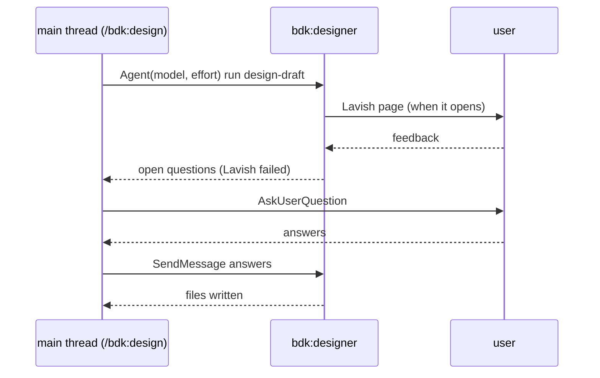

# Design

## Context

- `models` is `z.record(kebab, text)` (`plugins/bdk/src/config/domain/settings.ts`): any kebab-case key passes, the value is a model string. `policy.escalation` holds only `model` (default `opus`).
- Skills pass `model` to the `Agent` tool from `models.<role>` (e.g. `skills/execute-waves/SKILL.md` step "model: policy.escalation.model when this is the part's last run ... else models.implementer"). No skill passes `effort`.
- `design-draft` and `plan-draft` run in the main thread through the `Skill` tool (`skills/design/SKILL.md`, `skills/plan/SKILL.md`), on the session's model; `design-draft` stays there because it may ask the user.
- Claude Code (sub-agents docs, "Supported frontmatter fields", "Choose a model", "Choose an effort level"; model-config "Adjust effort level"): agent frontmatter accepts `model` (`sonnet`, `opus`, `haiku`, `fable`, a full ID, or `inherit`) and `effort` (`low`, `medium`, `high`, `xhigh`, `max`); the `Agent` tool accepts per-call `model` and `effort` (effort needs Claude Code 2.1.292, the version the repository pins); the per-call value beats the frontmatter, which beats the session; `CLAUDE_CODE_EFFORT_LEVEL` beats everything. `AskUserQuestion` is removed from every subagent. Skill frontmatter also takes `model` and `effort`, but statically.
- Key walking (`keys.ts` `resolveKey`) handles a `ZodRecord` by its `keyType`; validation (`validate.ts`) turns an `unrecognized_keys` issue into "unknown key; did you mean" through `knownUnder`.

## Goals / Non-Goals

**Goals:** model and effort per role; `designer` and `planner` roles that reach `design-draft` and `plan-draft`; effort for escalation; unknown roles and effort values rejected.

**Non-Goals:** validating model names against a list (the set of models changes faster than BDK; the `Agent` tool reports a bad one).

## Decisions

### D1. Object per role only, no short string form (BREAKING)

`models.<role>` is `{ model?, effort? }`. A string is a problem: "must be a mapping with model and effort".

- Why: one shape for every reader. `bdk config show` prints leaves, so skills read `models.implementer.model` / `.effort` in every project; with a union they would have to read two forms, and `show`'s origin per leaf would need a normalising transform that the layer data does not have. `policy.escalation` has the same shape.
- Alternatives: object plus string (the issue's "short form stays valid?"): keeps old files valid but every skill reads two shapes, and `bdk config set models.x opus` vs `models.x.model opus` both exist. Lost on simplicity. Pre-release: no `bdk--v*` release is published yet (#213), so the break touches only local test projects; the commit carries `BREAKING CHANGE:`.

### D2. Roles validated against a fixed list

`models` is `z.partialRecord(z.enum(MODEL_ROLES), RoleModel)`. `MODEL_ROLES` is exported from `settings.ts`: `lead`, `explorer`, `verifier`, `implementer`, `conformer`, `reviewer`, `integration-reviewer`, `e2e-tester`, `judge`, `designer`, `planner`. An unknown role is zod's `unrecognized_keys`, which `validate.ts` already reports as "unknown key; did you mean ..." once `resolveKey` returns the enum's options as the known names under `models`.

- Alternatives: `z.strictObject` with one optional key per role (also validated, but the settings Reference would list 10 x 3 keys instead of `models.<role>`, `.model`, `.effort`); keep `z.record(kebab, ...)` (a typo stays silent, the issue's complaint).
- Each role equals the `name` of its agent file; a test checks every role has `plugins/bdk/agents/<role>.md`. Agreed with #274, which made `explorer` a role; the list holds it.

### D3. Effort values and "not set"

`effort` is `low | medium | high | xhigh | max`, Claude Code's levels. A field not set is left out of the `Agent` call: the model falls back to the agent's frontmatter `model`, the effort to the session's level (no BDK agent sets `effort` in its frontmatter). BDK does not check which model supports which level: Claude Code maps an unsupported level itself (e.g. `xhigh` runs as `high` on Opus 4.6).

### D4. Designer and planner run on agents

New agents `bdk:designer` (runs `bdk:design-draft`) and `bdk:planner` (runs `bdk:plan-draft`), frontmatter `model: inherit`, so a project that sets nothing keeps today's model (the session's). Both blocks follow the pattern of `implement-part`: on their own agent they do the work; anywhere else they start the agent with `models.<role>` and pass on its reply. `/bdk:design` and `/bdk:plan` start the agents directly, as they already do for `verify-design` / `verify-plan`.

- Alternatives: skill frontmatter `model`/`effort` (static, a setting cannot reach it); run on an agent only when the role is set (two paths to test and document). A side gain: the draft's reading of the code no longer fills the main conversation (problem 1, speed of long runs).
- Cost: `design-draft` loses `AskUserQuestion` inside the agent (D5).

### D5. Designer questions reach the user through the main thread

The designer keeps Lavish (a Bash command, works in an agent). When Lavish fails, the designer lists its open questions (recommended first) and ends its turn, writing nothing (today's step 4.3). The main thread (the `design-draft` wrapper or `/bdk:design`) asks them with `AskUserQuestion`, then continues the same designer with `SendMessage` carrying the answers; without `SendMessage` or the agent ID it starts a new designer whose arguments carry the answers. Without `AskUserQuestion` the main thread lists the questions in its reply and ends its turn, as before.

### D6. Escalation effort

`policy.escalation.effort` is optional. The last implementer run uses `policy.escalation.model` and `policy.escalation.effort`, or `models.implementer.effort` when the escalation effort is not set (escalating the model must not drop a raised effort). The second `resolve-conflict` run uses the same pair.

### D7. One rule for every agent start

#274 added the requirement "Every agent is a models role" to `bdk-cli/config` with a workspace test (`plugins/bdk/tests/agent-models.test.ts`) that fails when a skill paragraph starting `bdk:<agent>` does not name `models.<agent>`. This Change extends that requirement (`designer`, `planner`, `effort`) instead of adding a second capability; the orchestrator specs refer to it. Each skill line reads "`model` `models.<role>.model` and `effort` `models.<role>.effort`, each when set". A first draft of this Change had its own capability `bdk-agent-models`; it was folded in when #274 merged.

### D8. What moving the drafts onto agents changed, found by the evals

The regression runs of the existing cases showed three changes of behaviour once `design-draft` and `plan-draft` ran on their own agents, each fixed in the skill or agent text:

- `plan-fresh` fell from 1.00 (2 runs on `staging/v3`) to 0.33 (4 runs): the planner, reporting to an orchestrator instead of being one, named behaviour the Change does not touch (what `ledger` does with no argument) as a gap of the design, and `/bdk:plan` stopped before verification as its gap rule says. `plan-draft` step 2 now says a gap is about behaviour the Change adds or changes (spec `bdk-plan-blocks`, scenario "Behaviour outside the Change is not a gap"). After it: `plan-fresh` 1.00 (2 runs), `plan-draft-household-book-gap` 1.00 (2 runs), so the in-scope gap still stops.
- `design-draft-ask`: the designer read the code with ad hoc Bash commands, which the run denies, concluded Bash was unavailable and skipped the Lavish page. `bdk:designer` now reads with Read, Grep and Glob and runs only the commands the skill names.
- The main thread relayed the designer's questions without saying the review page had not opened. `design-draft` step 0 and `/bdk:design` now say so when the designer does.

## Eval cases

Acceptance signal: a run's agent calls carry the configured model and effort. Four cases grade the `Agent` call input with `tool_used` `input_match` on `subagent_type`, `model` and `effort`:

- `implement-part-model-effort` (block): `models.implementer {sonnet, low}`; typed `/bdk:implement-part`.
- `design-draft-model-effort` (block): `models.designer {sonnet, high}`, `decide-and-record`; `design.md` written.
- `plan-model-effort` (orchestrator): `models.planner {sonnet, low}`, `models.verifier {sonnet, medium}`.
- `execute-escalation-model-effort` (orchestrator): `part-attempts: 1`, `policy.escalation {sonnet, low}`, `models.conformer.effort: low`.

The existing `design-draft-*`, `plan-draft-*`, `design-*` and `plan-*` cases gain `Agent` (and `SendMessage` and `ToolSearch` where the designer is continued) in `allowed_tools`.

Results (Claude Code 2.1.292, `--ablation none --runs 1`, sonnet, 2026-10-09):

| Case | Score | Cost |
|---|---|---|
| `implement-part-model-effort` | 1.00 (3/3 graders) | $0.33 |
| `design-draft-model-effort` | 1.00 (3/3) | $0.69 |
| `plan-model-effort` | 1.00 (6/6) | $0.50 |
| `execute-escalation-model-effort` | 1.00 (5/5) | $0.93 |

The execute case grades `Agent` calls started by `bdk:lead`, so the trace holds the nested calls of a subagent: the implementer call carried `"model": "sonnet"` and `"effort": "low"` from `policy.escalation`, the conformer call `"effort": "low"`.

Regression of the changed existing cases (1 run each unless named; after the D8 fixes where they apply): `design-draft-auto` 1.00, `design-draft-ask` 1.00, `design-draft-lavish` 1.00, `design-fresh-auto-gate` 1.00, `design-manual-gate-no-ask` 1.00, `design-resume-after-fail` 1.00, `design-models-per-role` 1.00, `plan-draft-csv-export` 1.00, `plan-draft-fix-after-verify` 1.00, `plan-draft-household-book-gap` 1.00 (2 runs), `plan-fresh` 1.00 (2 runs), `plan-resume-after-fail` 1.00, `plan-budget-spent` 1.00, `plan-models-verifier` 1.00, `explore-model-set` 1.00, `verify-design-model-set` 1.00, `spec-conformance-model-set` 1.00, `close-models-verifier` 1.00. `plan-verify-written` scored 0.29: its main thread's `bdk plan check` call was denied by the run's permissions and it stopped before verifying; the same case scores 0.64 on `staging/v3` (2 runs, same denial in the failing one), so it is not caused by this Change and is followed up in #292.

## Risks / Trade-offs

- Bottleneck: a designer waiting on a Lavish poll blocks the main thread for up to 10 minutes per poll, as the main thread did before; no change in wall time.
- Failure mode: a fresh designer started with answers (no `SendMessage`) re-reads the code: slower, same result.
- Hidden cost: `model: inherit` on the designer and planner keeps the session's (often opus) model; teams that want cheaper drafts must set `models.designer` / `models.planner`.
- Breaking change: settings files with `models.<role>: <model>` fail `bdk config check` until rewritten; the problem message names the `model` field.
- Assumption not confirmed by the user: the `Agent` tool of every supported Claude Code version accepts `effort`; older versions than 2.1.292 ignore or reject it.

## Migration Plan

Rewrite `models.<role>: <model>` as `models.<role>.model: <model>`. `bdk config check` names each key to change.

## Open Questions

None that change the specs or the plan.
