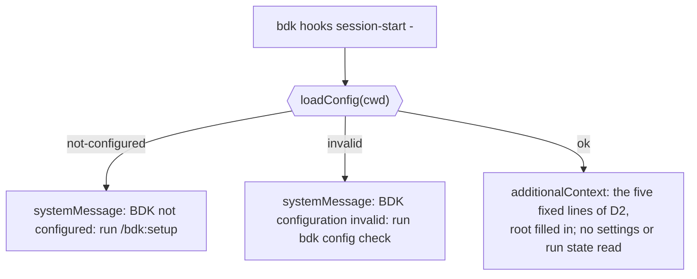

# Design

## Context

- The hook is registered once (`plugins/bdk/hooks/hooks.json:8`) and runs `sessionStart` (`plugins/bdk/src/hooks/use-cases/session-start.ts:14-32`). It branches on `loadConfig` (`plugins/bdk/src/config/use-cases/load.ts:65-73`): `not-configured` and `invalid` return one warning (`session-start.ts:16-21`), `ok` returns a context built as an array of lines joined with `\n` (`session-start.ts:22-31`).
- Today's context is three lines at most: BDK is configured with the root (`session-start.ts:23`), `bdk config show` and `bdk --help` (`:24`), and the `hooks.subagent-git` note naming `LEAD` (`:25-30`, `LEAD` from `plugins/bdk/src/hooks/domain/guard.ts:7`). None of them says what the main session should do with a request.
- What the host already puts into every session: the name and description of every skill (31 under `plugins/bdk/skills/`) and of every agent. The descriptions say when to use a skill ("Use when starting a feature or fix in a BDK project", `plugins/bdk/skills/propose/SKILL.md`), but nothing tells the model that the current project is a BDK project or how the stages follow each other. Each skill gets the resolved configuration from its own `bdk config show` block; workers get the rule pack from `bdk rules for`.
- The guard's deny reason already names the setting and what to do instead (`plugins/bdk/src/hooks/domain/guard.ts:14-19`), so a worker learns the rule on its first refused command.
- The tests of the context are `plugins/bdk/src/hooks/tests/commands.test.ts:199-224` (`toContain("bdk config show")`, the guard sentence, a line count `<= 6`).
- The command summary "SessionStart hook: a short BDK context, or one warning without a configuration" (`plugins/bdk/src/hooks/commands/session-start.ts:12`) feeds the generated Reference (`docs/reference/bdk/hooks.md:21`, `docs/reference/bdk/cli.md:386,423`) and stays true.
- Docs that describe the context: `docs/concepts/cli-config-hooks.md:148` (lists `bdk hooks session-start` as a reader of `hooks.subagent-git`) and `:165` (sequence diagram: "BDK context, and the guard notice when hooks.subagent-git is on"). `docs/guide/install.md:35` and `docs/guide/first-run.md:3` stay true.

## Goals / Non-Goals

**Goals:**

- The main session of a configured project knows, before any skill runs, how work is done there: which `/bdk:*` command carries which kind of work, in which order the stages run, that a stopped stage continues by running it again, and when to skip BDK.
- The context is one fixed text (apart from the root), cheap to read in every session, and owned by one spec requirement.

**Non-Goals:**

- No project state in the context (run, Change, failures).
- No `bdk` CLI guidance: that is the skill of #286.
- No measurement of the context's effect (D5).
- No change to the warnings without a configuration or with an invalid one, nor to the `PreToolUse` guard.

## Decisions

### D1. Purpose: the BDK process for the main session

The session start context exists to tell the main session how work is done in this project, which it cannot learn from anything else before a skill runs: the skill descriptions say what each skill does, but not that this project uses BDK nor how the stages chain. The hook is the only place that knows the project is configured (it resolves the configuration from the session `cwd`, `plugins/bdk/src/hooks/use-cases/payload.ts:28`), so the text appears exactly in BDK projects and nowhere else.

Alternatives:

- Keep today's pointers (`bdk config show`, `bdk --help`): they serve CLI use, which is #286's job, and say nothing about routing a request.
- A v2-style foundation (agents table, quality rules, capture conventions, verification proportionality, `STARTUP_INSTRUCTIONS.md` on `v2.7.0`): the host lists agents itself, the rule pack reaches workers through `bdk rules for`, and every line costs context in every session. Lost on cost and duplication.
- Nothing but the configured fact: leaves the model to guess the process from 31 descriptions. Lost: the user asked for the process to be explained.

### D2. Content: five fixed lines

The context is this text, with the project root filled in (spec `bdk-cli/hooks`, "Session start context", items 1 to 5):

```text
BDK (Broneq Dev Kit) is configured in this project, root <root>.
Work with behaviour to specify runs as an OpenSpec Change through the BDK stages: /bdk:propose, /bdk:design, /bdk:plan, /bdk:execute, /bdk:auto-review, /bdk:close.
/bdk:run carries an intent or a list of issues through every stage to a pull request; /bdk:debug fixes a reported bug that needs diagnosis; /bdk:pr-review reviews a pull request.
A stage that stopped resumes from its files (openspec/changes/, .bdk/runs/): run the same command again to continue it.
A small edit you can see whole (a typo, a version bump, a one-line fix) is done directly, without a Change.
```

The user approved this text in the design questions; the fourth line was then narrowed from "Every stage resumes" to "A stage that stopped resumes", because `/bdk:propose` stops on an existing proposal instead of resuming and `/bdk:pr-review` is not a stage. The third line says "a reported bug that needs diagnosis" so that a reported bug with a one-line fix seen whole falls under the last line, not under `/bdk:debug` (verify-1.md S1). The last line mirrors `docs/guide/footprint.md` ("A typo, a version bump or a one-line fix you can see whole is faster done directly") and keeps the routing line from pulling every small edit into a Change.

The lines stay in `sessionStart` as a constant array of strings; only the root is interpolated. The `LEAD` import and the read of `settings.hooks["subagent-git"]` leave `session-start.ts`.

Alternatives: generating the stage list from the skill directories was rejected: the order and the one-line roles are prose, not data any skill holds, and a test (D2a) catches drift at lower cost.

### D2a. A test keeps the named commands real

The end-to-end `plugins/bdk/tests/hooks.test.ts` asserts that every `/bdk:<name>` in the context has `plugins/bdk/skills/<name>/SKILL.md`. A renamed or removed skill fails the test instead of leaving the context stale. The docs name check of `pnpm check` reads only Guide and Concepts pages, not source strings, so it would not catch this.

### D3. Static: no project state

The context does not depend on settings or on `.bdk/runs/` and `openspec/changes/` (spec scenarios "Guard on" and "Same text whatever the run state"). The user chose this over a computed run line.

Alternatives (asked):

- Unfinished run from `run.json` plus open Changes: needs a `hooks -> run` edge in `plugins/bdk/src/slices.ts:21-24` and file reads in a 10 s hook whose failure shows in every session; `/bdk:run` already resumes from `run.json` when called.
- Only `run.json`: same edge, misses Changes run stage by stage.
- A static `bdk run status` pointer: a line in every session, and the command fails without `run.json`.

The fourth line of D2 gives the static form of the same help: run the command again.

### D4. Where the removed candidates go

| Candidate | Goes to |
|---|---|
| `bdk config show`, `bdk --help` | the `bdk` CLI skill of #286; the context names no CLI command and no settings key (spec "No CLI pointers") |
| `hooks.subagent-git` note | nowhere new: the deny reason (`guard.ts:14-19`) tells the refused worker; the main thread and `bdk:lead` are never refused |
| Rules for edits outside a skill | nowhere: the project's own `CLAUDE.md` and `.claude/rules` hold them; the BDK rule pack applies in execute and review through `bdk rules for` |
| Agents table (v2) | nowhere: the host lists agents with their descriptions |
| A `CLAUDE.md` block written by `/bdk:setup` | rejected: it would repeat the hook in a file the user owns, would not disappear when BDK is removed, and goes stale on a plugin update |

Boundary with #286: the session start context says which `/bdk:*` command carries which work; the #286 skill says how to use the `bdk` CLI. Neither repeats the other.

### D5. No with / without measurement

The user decided not to measure the context. Issue #285's acceptance signal asked for "a measurement showing the kept content changes behaviour", and `CLAUDE.md` asks for a measured problem before adding a hook; the hook already exists, and this Change replaces its text with a fixed description of the process that the user reviewed line by line. The issue's acceptance signal is updated to match (user agreed).

Had it been measured, `claude plugin eval --ablation with-without` would not have isolated the hook: it removes the whole plugin, skills included. That needed either a settings key to switch the context off or a plugin copy without the `SessionStart` entry.

### D6. Limit stays six lines

The requirement keeps "at most six lines" (user decision); the text uses five. A new line needs a change of the requirement, which lists the content item by item.

### D7. No settings key for the text

The text is fixed; there is no key to change, extend or switch it off (user decision). A team that wants its own session text has the project's `CLAUDE.md`, which the host loads in every session; a second channel for instructions next to it could contradict it.

## Diagrams



## Risks / Trade-offs

- [The text costs about 120 tokens in every session of a configured project, also in sessions that never run BDK] -> five lines, no state, limit six; a project that does not want it has no switch (D7), which is accepted.
- [A skill renamed or removed leaves the context naming a command that does not exist] -> D2a's test fails.
- [A new stage, or a change of the stage order, leaves the second line wrong; D2a checks names only, not order or completeness] -> the requirement lists the stages in order, so such a change is a change of the `bdk-cli/hooks` spec and of the test that copies its scenario; a reviewer of that Change sees the context requirement next to it.
- [The stage order and roles are now described twice: in the context and in the skill descriptions] -> the context names each command with a few words only; the descriptions stay the authority, and D2a checks the names.
- [Unconfirmed: that the text changes what the main session does; it is not measured (D5)] -> accepted by the user; a later issue can measure it with one of the two isolations of D5.
- [The routing line may pull small edits into a Change] -> the fifth line says when to edit directly.
- [Breaking for anything that read `bdk config show` from the context] -> no skill or agent reads the context by name (explore map, Gaps); skills run `bdk config show` themselves.

## Modules the plan touches

- `plugins/bdk/src/hooks/use-cases/session-start.ts`: the context lines (D2), drop `LEAD` and the guard read.
- `plugins/bdk/src/hooks/tests/commands.test.ts`: the session-start tests at `:199-224` rewritten to the spec scenarios.
- `plugins/bdk/tests/hooks.test.ts`: the configured-session case gains the D2a check.
- `openspec/specs/bdk-cli/hooks/spec.md`: through the delta on archive.
- Docs: `docs/concepts/cli-config-hooks.md:148` (`hooks.subagent-git` read only by `bdk hooks pre-tool-use`) and `:165` (the sequence diagram: "the BDK process, five fixed lines"); `pnpm docs:reference` (expected unchanged, the command summary stays).
