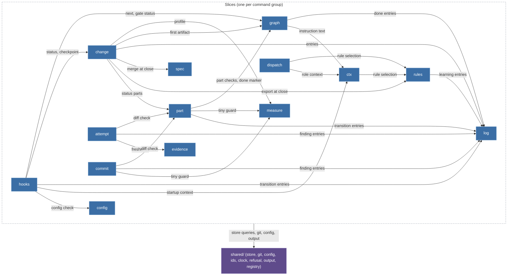

## MODIFIED Requirements

### Requirement: Vertical slices

The kernel source SHALL be organised as one slice per command group plus `shared/`; the set of `slice` values in `schema/cli/commands.json` SHALL equal this module list.

| Slice      | Commands                                                                             | Owner tasks   | One sentence                                                                                                                                                                     |
| ---------- | ------------------------------------------------------------------------------------ | ------------- | -------------------------------------------------------------------------------------------------------------------------------------------------------------------------------- |
| `change`   | `change new`, `status`, `list`, `resume`, `park`, `takeover`, `checkpoint`, `close`  | T20, T22, T30 | Lifecycle of the one Change per branch; `close` composes `spec`, `log route` and `rules export`.                                                                                 |
| `measure`  | `measure`                                                                            | T20           | Size heuristic for an intent or a diff; separate because `change new` and `/bdk:cr` both call it and its calibration changes independently.                                      |
| `graph`    | `next`, `explain`, `validate`, `done`                                                | T21           | The artifact graph from `pipeline.yaml`: node states, input hashes, kind validators, gate status.                                                                                |
| `part`     | `part list`, `start`, `done`, `split`                                                | T22           | Plan parts, their validators (S1, P6) and the diff check against `Files:` and `do-not-touch`.                                                                                    |
| `attempt`  | `attempt open`, `close`, `list`                                                      | T22           | Tickets, budgets, the escalation ladder and oscillation detection (P4, A-drabina).                                                                                               |
| `log`      | `log add`, `ingest`, `list`, `show`, `resolve`, `route`                              | T20, T22, T31 | The append-only ledger and its provenance rules (K2, P1); the leaf every writing slice depends on.                                                                               |
| `dispatch` | `dispatch build`, `show`                                                             | T23           | Dispatch packages (K3, K4).                                                                                                                                                      |     |
| `evidence` | `evidence record`, `check`                                                           | T23           | Evidence manifests, tree hashes, citations and freshness (T4, P5).                                                                                                               |
| `spec`     | `spec delta check`, `merge`, `diff`                                                  | T30           | Spec deltas and the deterministic merge (D2b, V1-7).                                                                                                                             |
| `config`   | `config show`, `check`, `schema`, `set`                                              | T12           | The commands over the layered configuration; the layering itself is `shared/config`.                                                                                             |
| `ctx`      | `ctx skill`, `startup`                                                               | T13           | Prompt context composition: the skill manifest, rules, fragments, tool entries, the agents table.                                                                                |
| `rules`    | `rules check`, `show`, `add`, `explain`, `prune`, `import`, `stats`, `export`        | T31           | Rule files, ids, `applies` selection and the learning funnel.                                                                                                                    |
| `query`    | `query`                                                                              | T20           | Read-only SQL over the index.                                                                                                                                                    |
| `commit`   | `commit`                                                                             | T22           | The task commit with BDK trailers.                                                                                                                                               |
| `hooks`    | `hooks session-start`, `session-end`, `prompt-expansion`, `pre-tool`, `skill-exists` | T13, T24      | Host payload parsing, guard decisions, the only writer of `source: user`.                                                                                                        |
| `service`  | `doctor`, `rebuild`, `import`, `version`                                             | T11, T22, T32 | Diagnosis, index rebuild, the v2 import and the version; reads every other slice; `rebuild` writes only through the `shared/store` rebuild core, which `change takeover` shares. |
| `export`   | `export agents`                                                                      | T23           | Host projections: the adapter files generated from the adapter definitions and the per-host tool map.                                                                            |     |

The one relationship the map shows is _who may import whom_. Arrows point from the importing slice to the imported one; every slice may import `shared/`, drawn as one edge from the slice boundary. `service` (imports every slice, read-only), `query` and `export` (import nothing but `shared/`) are left out of the drawing to stay within the node budget; the matrix below is complete.

#### Scenario: slice parity

- **WHEN** a record in `schema/cli/commands.json` names a slice that this list does not contain, or a listed slice has no record
- **THEN** the contract test fails

#### Scenario: T22 slices registered

- **WHEN** the kernel's registrations are listed after T22
- **THEN** the `attempt`, `part` and `commit` slices register handlers for every record whose slice they are, and none answers `kernel/not-implemented`

### Requirement: shared/ admission rule

Something SHALL enter `shared/` only as an OS boundary or when three or more slices use it, and the `node:` modules SHALL appear only in the files the inventory names.

Something enters `shared/` for one of two reasons and each entry states which: **(a)** it is an OS boundary (file system, child process, clock, terminal), or **(b)** three or more slices use it. Anything else lives in the slice that needs it, even if a second slice later copies three lines.

| Module              | Admitted by                                 | Holds                                                                                                                                                                                                                                                                                                          |
| ------------------- | ------------------------------------------- | -------------------------------------------------------------------------------------------------------------------------------------------------------------------------------------------------------------------------------------------------------------------------------------------------------------- |
| `shared/store`      | (a) file system; (b) every slice            | The single access point of R-store: Change directory IO, frontmatter, the SQLite index (`node:sqlite`), lazy rebuild, typed read queries, and the state schemas of `kernel-state` (zod, validation on every read and write, fingerprints, migrations).                                                         |
| `shared/git`        | (a) child process                           | Wrapper over `git` (`node:child_process`): diff, trailers, pathspec commit, work tree state; the `runtime/git-missing` and `policy/git-in-progress` checks.                                                                                                                                                    |
| `shared/config`     | (a) file system, user home; (b) every slice | The four layers and the global layer path, deep merge, the zod module registry and its JSON Schema export, prompt values, the resolved snapshot, comment-preserving edits of a layer file.                                                                                                                     |
| `shared/ids`        | (b) `change`, `log`, `attempt`, `evidence`  | Merge-safe id generation (`kernel-state`, Identifiers) and parsing of qualified references.                                                                                                                                                                                                                    |
| `shared/vocabulary` | (b) `change`, `log`, `attempt`, `graph`     | The closed value lists of `kernel-state` (entry types, statuses, profiles, change kinds and sources, provenance values and the `source` pattern, ticket scopes) as plain constants. It imports nothing, so `domain/`, `render/` and `schema/` may read it and `shared/store` builds the state schemas from it. |
| `shared/clock`      | (a) system clock                            | The one source of `at`; injectable in tests.                                                                                                                                                                                                                                                                   |
| `shared/refusal`    | (b) every slice                             | The four-field error object, the rule id catalogue as a typed enum, the class-to-exit mapping (`kernel-cli`, Exit codes and the error object).                                                                                                                                                                 |
| `shared/output`     | (b) every slice                             | Text and JSON writers, list pages and the 100-item cap, the STOP block renderer (`kernel-cli`, Output modes).                                                                                                                                                                                                  |
| `shared/registry`   | (b) every slice                             | Command registration from `schema/cli/commands.json`, dispatch by argv, `--help`, mode handling (inject always exits 0, guard fail-closed), the active-Change resolution for `changeScoped` records, the `kernel/not-implemented` stub for unregistered handlers.                                              |

A content test allows `node:fs` only in `shared/store`, `shared/config` and `shared/git`, `node:child_process` only in `shared/git`, and `node:sqlite` only in `shared/store`. `shared/` never imports a slice; the composition root (`kernel/src/main.ts`) wires the slices into the registry.

#### Scenario: node module outside its boundary

- **WHEN** `node:fs` appears outside `shared/store`, `shared/config` and `shared/git`, `node:child_process` outside `shared/git`, or `node:sqlite` outside `shared/store`
- **THEN** the `node:` boundary test fails the build
