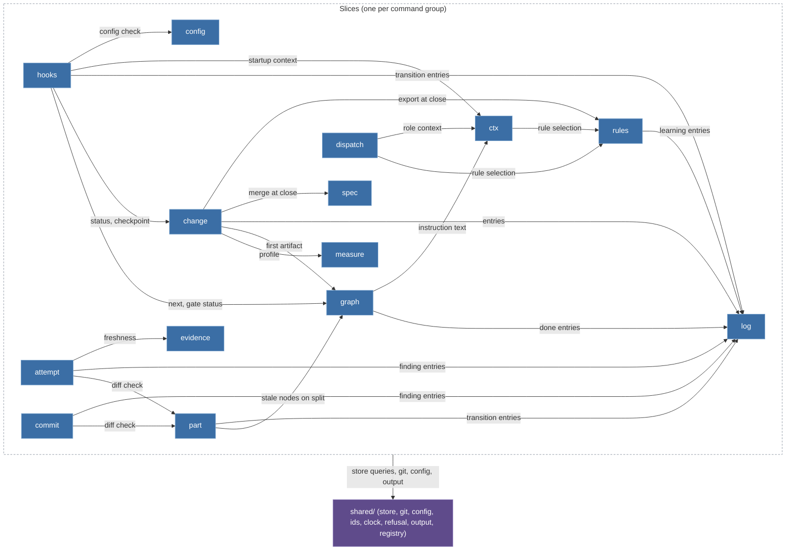
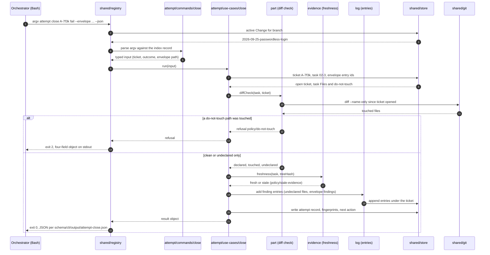

# kernel-architecture Specification

## Purpose

The kernel source is organised by capability, not by technical layer (design decision D-13 of the archived Change `v3-t10-kernel-cli-contract`). One **slice** per command group of `kernel-cli` owns its whole vertical: parsing argv into a typed input, the use case, its writes on the Change directory built on the shared store, text and JSON rendering, the zod output schema that T12 exports to `schema/cli/output/`, and its tests next to the code. `shared/` holds only what is an OS boundary or is used by three or more slices. Every record in `schema/cli/commands.json` names its `slice`; the contract test checks that the set of slices in the index equals the module list of this spec and that the dependency matrix names only known slices. T11's import scan checks the code against the same matrix.

The alternatives (horizontal layers, hexagonal) and why they lost are recorded in design decision D-13 of the archived Change `v3-t10-kernel-cli-contract`.

## Requirements

### Requirement: Vertical slices

The kernel source SHALL be organised as one slice per command group plus `shared/`; the set of `slice` values in `schema/cli/commands.json` SHALL equal this module list.

| Slice      | Commands                                                                             | Owner tasks   | One sentence                                                                                                                                |
| ---------- | ------------------------------------------------------------------------------------ | ------------- | ------------------------------------------------------------------------------------------------------------------------------------------- |
| `change`   | `change new`, `status`, `list`, `resume`, `park`, `takeover`, `checkpoint`, `close`  | T20, T22, T30 | Lifecycle of the one Change per branch; `close` composes `spec`, `log route` and `rules export`.                                            |
| `measure`  | `measure`                                                                            | T20           | Size heuristic for an intent or a diff; separate because `change new` and `/bdk:cr` both call it and its calibration changes independently. |
| `graph`    | `next`, `explain`, `validate`, `done`                                                | T21           | The artifact graph from `pipeline.yaml`: node states, input hashes, kind validators, gate status.                                           |
| `part`     | `part list`, `start`, `done`, `split`                                                | T22           | Plan parts, their validators (S1, P6) and the diff check against `Files:` and `do-not-touch`.                                               |
| `attempt`  | `attempt open`, `close`, `list`                                                      | T22           | Tickets, budgets, the escalation ladder and oscillation detection (P4, A-drabina).                                                          |
| `log`      | `log add`, `ingest`, `list`, `show`, `resolve`, `route`                              | T20, T22, T31 | The append-only ledger and its provenance rules (K2, P1); the leaf every writing slice depends on.                                          |
| `dispatch` | `dispatch build`, `show`, `run`                                                      | T23           | Dispatch packages (K3, K4) and the headless runner.                                                                                         |
| `evidence` | `evidence record`, `check`                                                           | T23           | Evidence manifests, tree hashes, citations and freshness (T4, P5).                                                                          |
| `spec`     | `spec delta check`, `merge`, `diff`                                                  | T30           | Spec deltas and the deterministic merge (D2b, V1-7).                                                                                        |
| `config`   | `config show`, `check`, `schema`, `set`                                              | T12           | The commands over the layered configuration; the layering itself is `shared/config`.                                                        |
| `ctx`      | `ctx skill`, `role`, `startup`                                                       | T13           | Prompt context composition: fragments, rules, prompt values, the agents table.                                                              |
| `rules`    | `rules check`, `show`, `add`, `explain`, `prune`, `import`, `stats`, `export`        | T31           | Rule files, ids, `applies` selection and the learning funnel.                                                                               |
| `query`    | `query`                                                                              | T20           | Read-only SQL over the index.                                                                                                               |
| `commit`   | `commit`                                                                             | T22           | The task commit with BDK trailers.                                                                                                          |
| `hooks`    | `hooks session-start`, `session-end`, `prompt-expansion`, `pre-tool`, `skill-exists` | T24           | Host payload parsing, guard decisions, the only writer of `source: user`.                                                                   |
| `service`  | `doctor`, `rebuild`, `import`, `version`                                             | T11, T22, T32 | Diagnosis, index rebuild, the v2 import and the version; reads every other slice, writes none.                                              |
| `export`   | `export agents`                                                                      | T23           | Host projections generated from the role skills.                                                                                            |

The one relationship the map shows is _who may import whom_. Arrows point from the importing slice to the imported one; every slice may import `shared/`, drawn as one edge from the slice boundary. `service` (imports every slice, read-only), `query` and `export` (import nothing but `shared/`) are left out of the drawing to stay within the node budget; the matrix below is complete.



#### Scenario: slice parity

- **WHEN** a record in `schema/cli/commands.json` names a slice that this list does not contain, or a listed slice has no record
- **THEN** the contract test fails

### Requirement: Dependency matrix

A slice SHALL import another slice only through that slice's `index.ts` and only along a row of the matrix; the graph SHALL stay acyclic.

A slice imports another slice only through that slice's `index.ts`, and only along a row of this table. **Reads of committed state never need a slice import**: `shared/store` exposes typed queries over the index (open tickets of a Change, the `Files:` of a task, the manifests of a task, entry summaries) whose row shapes are T14's, so `evidence record` checks its ticket, `part done` checks for open tickets and `log add` checks its ticket without importing `attempt`. A slice import is for a use case or domain logic that another slice owns (the diff check owned by `part`, freshness owned by `evidence`, entry writing owned by `log`). This is what keeps the graph acyclic.

| From                                                              | May import                                 | Why                                                                                                                                                            |
| ----------------------------------------------------------------- | ------------------------------------------ | -------------------------------------------------------------------------------------------------------------------------------------------------------------- |
| `change`                                                          | `measure`, `graph`, `log`, `spec`, `rules` | `new` measures and asks the graph for the first artifact; every verb writes entries; `close` merges specs and regenerates the rule projection.                 |
| `graph`                                                           | `log`, `ctx`                               | `done` writes the entry; `next` composes the instruction from the kind template and the skill context.                                                         |
| `part`                                                            | `graph`, `log`                             | `split` marks plan nodes stale; `start`, `done` and `split` write transition entries.                                                                          |
| `attempt`                                                         | `part`, `log`, `evidence`                  | `close` runs `part`'s diff check, `evidence`'s freshness check and writes findings.                                                                            |
| `commit`                                                          | `part`, `log`                              | The same diff check as `attempt close`, and the finding for undeclared files.                                                                                  |
| `dispatch`                                                        | `rules`, `ctx`                             | Package sections come from rule selection and the role context.                                                                                                |
| `ctx`                                                             | `rules`                                    | Rule text and `applies` filtering.                                                                                                                             |
| `rules`                                                           | `log`                                      | `add` writes the `learning` entry; `stats` reads through the store.                                                                                            |
| `hooks`                                                           | `change`, `graph`, `log`, `ctx`, `config`  | `session-start` composes status, startup context and the config check; `prompt-expansion` asks the graph and writes the transition; `session-end` checkpoints. |
| `service`                                                         | every slice (read-only)                    | `doctor` and `rebuild` inspect all state; `import` calls `rules import` and `config`.                                                                          |
| `log`, `evidence`, `spec`, `config`, `query`, `measure`, `export` | `shared` only                              | Leaves.                                                                                                                                                        |

Edges not in the table are forbidden, including the reverse of every listed edge. The two structural tests below fail the build on a violation.

#### Scenario: import outside the matrix

- **WHEN** a file under `kernel/src/<slice>/` imports a slice that its matrix row does not list, imports a slice file other than its `index.ts`, or `shared/` imports a slice
- **THEN** the import scan fails the build

### Requirement: Slice anatomy

Every slice SHALL have the same directory layout, one directory per layer and one file per command inside each layer, with the layers pointing one way.

One directory per layer, one file per command inside each layer, so `close` sits at the same relative path in every layer of every slice: `commands/close.ts`, `use-cases/close.ts`, `render/close.ts`, `schema/close.ts`, `tests/close.test.ts`.

```
kernel/src/attempt/
  index.ts              public surface: the three command registrations and the use cases other slices may call; the only file another slice may import
  commands/             argv -> typed input, one file per command; --help text from the index record
    parse.ts            the slice's positional grammar (`kernel-cli`, Invocation) and flag parsing, shared by the three commands
    open.ts
    close.ts
    list.ts
  use-cases/            one file per command; domain logic, no argv, no stdout
    open.ts             budgets, ladder, oscillation, ticket file
    close.ts            outcome, diff check (part), evidence freshness (evidence), entries check, findings (log), next action
    list.ts             read model over store queries
  domain/               slice-owned types and pure rules, no IO
    ticket.ts           ticket record, outcome, fingerprint
    budget.ts           not-run and retry budgets
    ladder.ts           escalation ladder and the oscillation detector (A-drabina)
  store/                this slice's persistence on .bdk/changes/<id>/attempts/ and its index tables, built on shared/store primitives
    attempts.ts         writes: ticket record, outcome, fingerprints, next action
    queries.ts          typed reads this slice owns (open tickets of a task, budgets)
  render/               text rendering, one file per command; JSON is the schema's object
    open.ts
    close.ts
    list.ts
  schema/               zod schemas of the outputs, one file per command; T12 exports them to schema/cli/output/attempt-*.json
    open.ts
    close.ts
    list.ts
  tests/
    open.test.ts        unit tests of the use case on an in-memory store
    close.test.ts
    list.test.ts
    attempt.e2e.ts      E2E through bdk.mjs on a repository fixture, one case per exit code the index declares
```

Inside a slice the layers point one way: `commands/` imports `use-cases/`, `render/` and `schema/`; `use-cases/` imports `domain/`, `store/`, `schema/` and the `index.ts` of the slices in its matrix row; `store/` imports `domain/` and `shared/store`; `render/` and `schema/` import `domain/` only; `domain/` imports nothing but types from `shared/ids` and `shared/clock`. The import scan below enforces the direction.

Every slice has the same directories with the same responsibilities, so a reader who knows one slice knows all of them. A slice with one command (`commit`, `query`, `measure`) keeps the directories with one file in each; a slice without pure rules omits `domain/`. `graph/domain/kinds/` holds one class per artifact kind, `hooks/domain/` the payload parsers per host event, `dispatch/use-cases/run.ts` is the headless runner.

#### Scenario: layer direction inside a slice

- **WHEN** `commands/` imports `store/`, `render/` imports `use-cases/`, or `domain/` imports anything but types from `shared/ids` and `shared/clock`
- **THEN** the import scan fails the build

### Requirement: shared/ admission rule

Something SHALL enter `shared/` only as an OS boundary or when three or more slices use it, and the `node:` modules SHALL appear only in the files the inventory names.

Something enters `shared/` for one of two reasons and each entry states which: **(a)** it is an OS boundary (file system, child process, clock, terminal), or **(b)** three or more slices use it. Anything else lives in the slice that needs it, even if a second slice later copies three lines.

| Module            | Admitted by                                 | Holds                                                                                                                                                                                                                                                             |
| ----------------- | ------------------------------------------- | ----------------------------------------------------------------------------------------------------------------------------------------------------------------------------------------------------------------------------------------------------------------- |
| `shared/store`    | (a) file system; (b) every slice            | The single access point of R-store: Change directory IO, frontmatter, the SQLite index (`node:sqlite`), lazy rebuild, typed read queries whose shapes are T14's.                                                                                                  |
| `shared/git`      | (a) child process                           | Wrapper over `git` (`node:child_process`): diff, trailers, pathspec commit, work tree state; the `runtime/git-missing` and `policy/git-in-progress` checks.                                                                                                       |
| `shared/config`   | (a) file system, user home; (b) every slice | The four layers, deep merge, the zod module registry, the resolved snapshot.                                                                                                                                                                                      |
| `shared/ids`      | (b) `change`, `log`, `attempt`, `evidence`  | Merge-safe id generation and parsing of qualified references (T14 format).                                                                                                                                                                                        |
| `shared/clock`    | (a) system clock                            | The one source of `at`; injectable in tests.                                                                                                                                                                                                                      |
| `shared/refusal`  | (b) every slice                             | The four-field error object, the rule id catalogue as a typed enum, the class-to-exit mapping (`kernel-cli`, Exit codes and the error object).                                                                                                                    |
| `shared/output`   | (b) every slice                             | Text and JSON writers, list pages and the 100-item cap, the STOP block renderer (`kernel-cli`, Output modes).                                                                                                                                                     |
| `shared/registry` | (b) every slice                             | Command registration from `schema/cli/commands.json`, dispatch by argv, `--help`, mode handling (inject always exits 0, guard fail-closed), the active-Change resolution for `changeScoped` records, the `kernel/not-implemented` stub for unregistered handlers. |

A content test allows `node:fs` only in `shared/store`, `shared/config` and `shared/git`, `node:child_process` only in `shared/git` and the `dispatch` runner (`dispatch/use-cases/run.ts`, which spawns host CLIs and is the documented exception), and `node:sqlite` only in `shared/store`. `shared/` never imports a slice; the composition root (`kernel/src/main.ts`) wires the slices into the registry.

#### Scenario: node module outside its boundary

- **WHEN** `node:fs` appears outside `shared/store`, `shared/config` and `shared/git`, `node:child_process` outside `shared/git` and `dispatch/use-cases/run.ts`, or `node:sqlite` outside `shared/store`
- **THEN** the `node:` boundary test fails the build

### Requirement: Flow of one command

Every command SHALL flow through the registry, the slice's layers and the shared modules as the sequence below shows; a refusal SHALL surface as the four-field object with the class's exit code.

`bdk attempt close A-7f3k fail --envelope <path> --json`, through the registry, the slice's layers and the shared modules. The refusal branch shows the fail-closed shape of `kernel-cli`, Exit codes and the error object.



#### Scenario: refusal inside a use case

- **WHEN** a use case, or a slice it calls, returns a refusal
- **THEN** the registry prints the four-field object on stdout and exits with the code of the rule's class, and no partial write reaches the Change directory

### Requirement: Change recipes

A new command, a new artifact kind and a new host hook SHALL each touch the files the recipes name and nothing outside them.

**A new command** touches one slice and the contract: add the record to `schema/cli/commands.json` and its requirement to the group's spec under `kernel-cli/<group>/` (the contract test enforces the pair), add `<slice>/commands/<command>.ts`, `<slice>/use-cases/<command>.ts`, `<slice>/schema/<command>.ts` (T12 exports it), `<slice>/render/<command>.ts`, `<slice>/tests/<command>.test.ts` with one unit test per rule the record declares, and one E2E case per exit code. Nothing outside the slice changes; the registry reads the index.

**A new artifact kind** touches `graph` and configuration only: a node in `pipeline.yaml` with its `requires` and `if:` conditions, a kind class in `graph/domain/kinds/` with `validate()` and `instruction()`, the kind's template under `prompts/`. `next`, `explain`, `validate` and `done` need no change, and no other slice learns about the kind (the promise of approach A, kept at slice level).

**A new host hook** touches `hooks` only: a payload parser in `hooks/domain/`, a use case with the decision, and a fixture under `tests/fixtures/host-payloads/<version>/` recorded with the T01 probe.

#### Scenario: new command

- **WHEN** a Change adds a command
- **THEN** it adds the index record, the group spec requirement, one file per layer in the slice, one unit test per declared rule and one E2E case per exit code, and no file outside the slice and the contract changes

### Requirement: Tests per slice

Each slice SHALL carry unit tests of its use cases on an in-memory store and E2E tests enumerated from the index; CI SHALL run the suite on the Node matrix.

Each slice carries unit tests of its use cases on an in-memory `shared/store` (no file system, no git) and E2E tests through `dist/bdk.mjs` on a repository fixture. E2E cases are enumerated from the index: for every record, one case per value in `exits` and one per rule in `refusals`, asserting the exit code and, on `--json`, the schema. CI runs the whole suite on a Node matrix of three lines: the minimum the contract names (22.13, HOST-FACTS `node-sqlite-min`), the active LTS and the current release (24 and 26 at the time of writing), because `node:sqlite` and the test runner differ between lines and a kernel that only ever ran on one of them would learn about the others from users. Two `node:test` structural tests run over the whole tree:

1. **Import scan.** Parses every `import` in `kernel/src/`: a slice may import `shared/*` and the `index.ts` of the slices in its matrix row, nothing else (no deep imports, no reverse edges, no slice import from `shared/`); inside a slice, only the layer direction of the anatomy above (`commands/` never reaches `store/`, `render/` never reaches `use-cases/`, `domain/` reaches nothing). The matrix is read from this spec's table, so the document and the code cannot drift apart silently.
2. **`node:` boundary.** `node:fs`, `node:child_process` and `node:sqlite` appear only in the files the inventory above names.

#### Scenario: E2E enumeration

- **WHEN** a record in the index gains an exit code or a rule
- **THEN** the E2E harness has one new case for it, asserting the exit code and, under `--json`, the schema

#### Scenario: Node matrix

- **WHEN** the CI workflow runs the kernel suite
- **THEN** it runs on the contract's minimum (22.13), the active LTS and the current release

### Requirement: Build order

T11 SHALL build the shared modules and the `service` slice first, in the order below, so that the E2E harness can assert the contract for every record from day one.

In order: `shared/refusal`, `shared/output`, `shared/registry` (with the index loaded and every command stubbed as `kernel/not-implemented`), `shared/clock`, `shared/ids`, `shared/config` (the reading half; T12 completes the registry), `shared/store` (Change directory IO and the index skeleton; T14 fixes the schemas), `shared/git`, then the `service` slice with `version` and `doctor`. That is the smallest set on which the E2E harness can assert the contract for all 61 records: 59 stubs answering `kernel/not-implemented` and 2 real commands.

#### Scenario: stubbed command

- **WHEN** a command whose owner task has not landed runs
- **THEN** the exit code is 2 with `rule: kernel/not-implemented` and an `instead` naming the owner task
